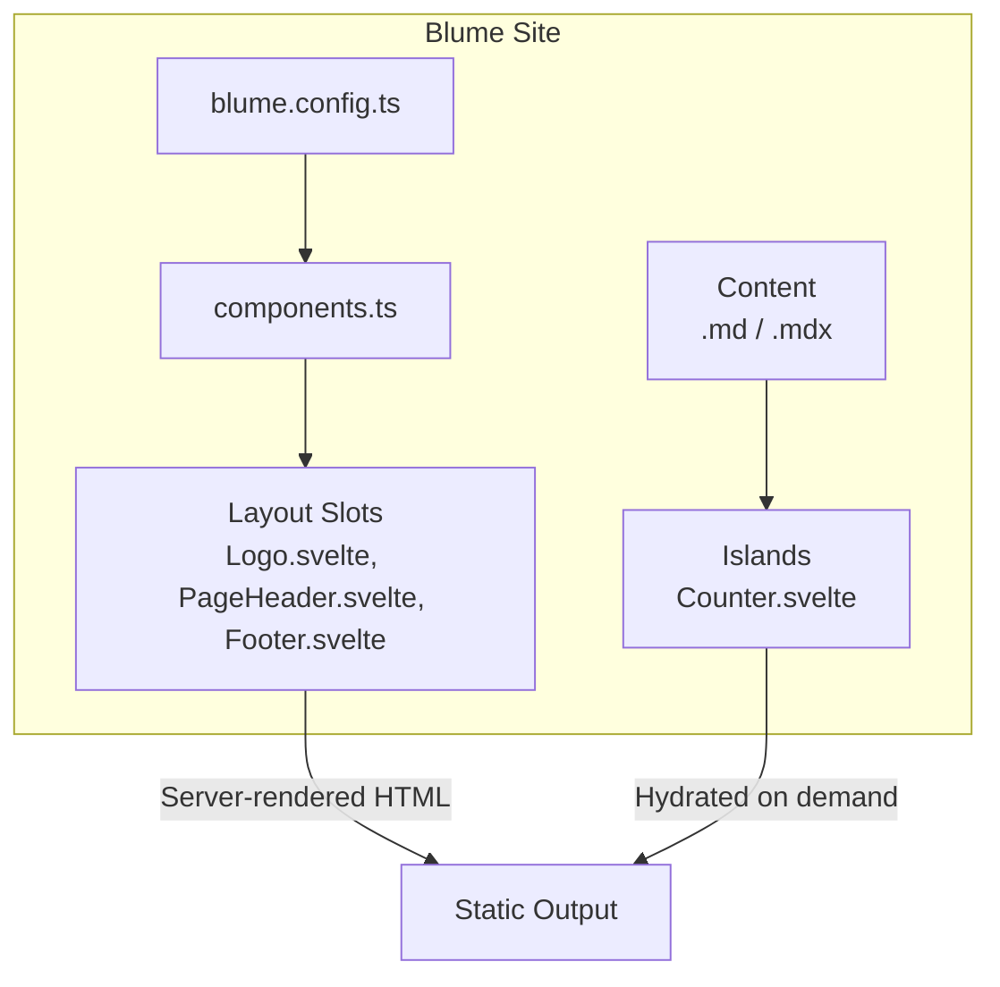
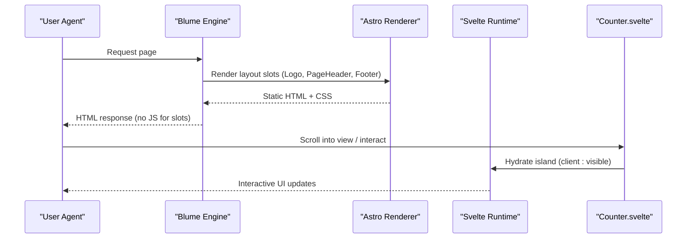
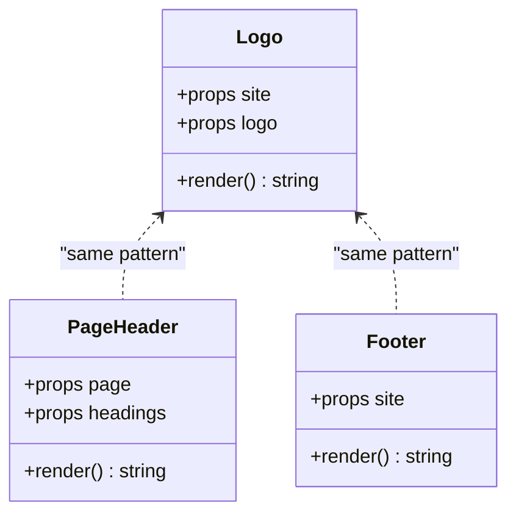
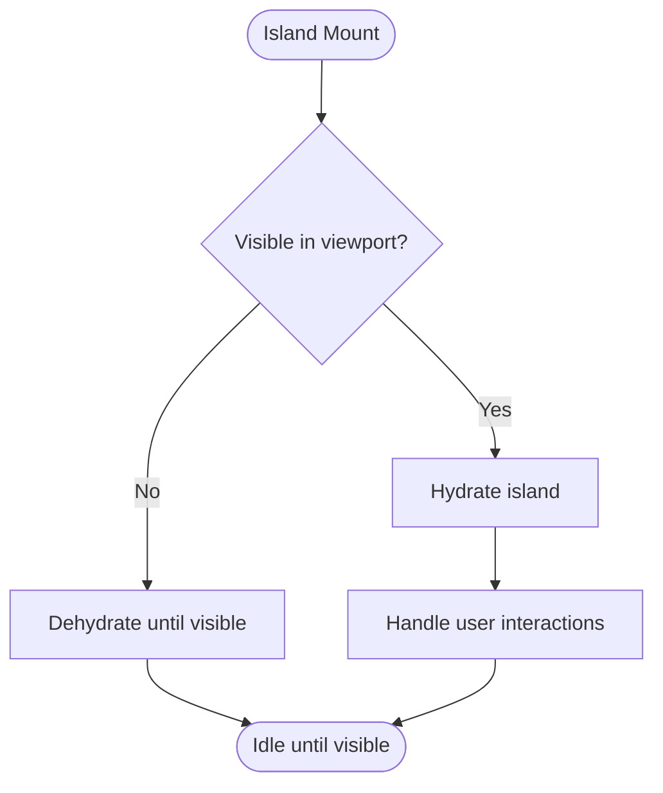
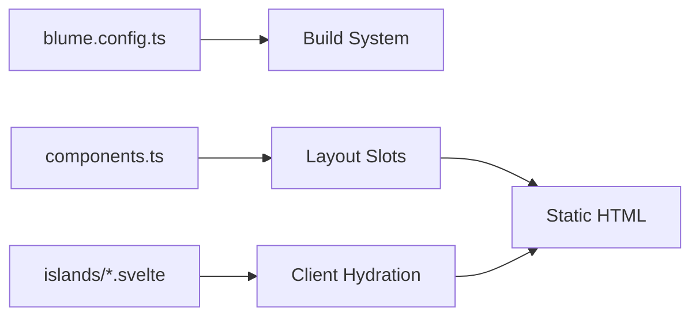

# Performance Optimization

<cite>
**Referenced Files in This Document**
- [README.md](file://README.md)
- [blume.config.ts](file://blume.config.ts)
- [package.json](file://package.json)
- [components.ts](file://components.ts)
- [components/Footer.svelte](file://components/Footer.svelte)
- [components/Logo.svelte](file://components/Logo.svelte)
- [components/PageHeader.svelte](file://components/PageHeader.svelte)
- [islands/Counter.svelte](file://islands/Counter.svelte)
- [content/index.md](file://content/index.md)
- [content/components.mdx](file://content/components.mdx)
- [content/svelte-layer.mdx](file://content/svelte-layer.mdx)
</cite>

## Table of Contents
1. [Introduction](#introduction)
2. [Project Structure](#project-structure)
3. [Core Components](#core-components)
4. [Architecture Overview](#architecture-overview)
5. [Detailed Component Analysis](#detailed-component-analysis)
6. [Dependency Analysis](#dependency-analysis)
7. [Performance Considerations](#performance-considerations)
8. [Troubleshooting Guide](#troubleshooting-guide)
9. [Conclusion](#conclusion)
10. [Appendices](#appendices)

## Introduction
This document explains performance optimization techniques in FractalWiki, focusing on Blume’s zero JavaScript by default approach and progressive enhancement strategy. It details how layout components are generated as static HTML while only interactive islands are hydrated when needed. It also covers lazy loading strategies, code splitting benefits, bundle size optimization, image and font loading strategies, caching mechanisms, performance monitoring, Core Web Vitals optimization, debugging bottlenecks, mobile performance considerations, and network optimization strategies.

## Project Structure
FractalWiki uses Blume with Svelte as the component layer:
- Layout slots (server-rendered, zero JS by default): Logo, PageHeader, Footer
- Islands (interactive, hydrated on demand): Counter
- Configuration for content, navigation, i18n, and deployment
- MDX pages that consume islands without imports

**Diagram sources**
- [blume.config.ts:14-56](file://blume.config.ts#L14-L56)
- [components.ts:20-26](file://components.ts#L20-L26)
- [components/Logo.svelte:1-49](file://components/Logo.svelte#L1-L49)
- [components/PageHeader.svelte:1-76](file://components/PageHeader.svelte#L1-L76)
- [components/Footer.svelte:1-30](file://components/Footer.svelte#L1-L30)
- [islands/Counter.svelte:1-45](file://islands/Counter.svelte#L1-L45)
- [content/index.md:1-39](file://content/index.md#L1-L39)
- [content/components.mdx:1-125](file://content/components.mdx#L1-L125)

**Section sources**
- [README.md:21-124](file://README.md#L21-L124)
- [blume.config.ts:14-56](file://blume.config.ts#L14-L56)
- [components.ts:1-26](file://components.ts#L1-L26)

## Core Components
- Layout slots: Server-rendered Svelte components mapped via components.ts. They produce static HTML and ship no JavaScript unless explicitly given a client mode.
- Islands: PascalCase .svelte files under islands/ become globally available in .mdx pages. They hydrate on demand with a default strategy of visibility-based hydration.

Key behaviors:
- Zero JS by default for layout slots
- Progressive enhancement via islands with configurable hydration
- Props passed to slots are serializable; islands accept serializable props

**Section sources**
- [components.ts:1-26](file://components.ts#L1-L26)
- [README.md:40-85](file://README.md#L40-L85)
- [content/svelte-layer.mdx:11-37](file://content/svelte-layer.mdx#L11-L37)

## Architecture Overview
The site renders static HTML for layout and content, then selectively hydrates islands based on user interaction or visibility. This minimizes initial JavaScript payload and improves perceived performance.

**Diagram sources**
- [components.ts:1-26](file://components.ts#L1-L26)
- [components/Logo.svelte:1-49](file://components/Logo.svelte#L1-L49)
- [components/PageHeader.svelte:1-76](file://components/PageHeader.svelte#L1-L76)
- [components/Footer.svelte:1-30](file://components/Footer.svelte#L1-L30)
- [islands/Counter.svelte:1-45](file://islands/Counter.svelte#L1-L45)
- [content/svelte-layer.mdx:25-37](file://content/svelte-layer.mdx#L25-L37)

## Detailed Component Analysis

### Layout Slots: Zero-JS Static Rendering
- Logo.svelte: Renders an accessible logo link with inline SVG and derived label from props. No client directive; ships no JS.
- PageHeader.svelte: Builds a sections strip from headings prop without fetching data at runtime; avoids Astro-only virtual modules by using props.
- Footer.svelte: Simple server-rendered footer with dynamic year computed at render time.

These components demonstrate:
- Server-side rendering with minimal runtime logic
- Use of Svelte runes for reactive values during SSR ($derived)
- Avoidance of client-only APIs to keep slots static

**Diagram sources**
- [components/Logo.svelte:1-49](file://components/Logo.svelte#L1-L49)
- [components/PageHeader.svelte:1-76](file://components/PageHeader.svelte#L1-L76)
- [components/Footer.svelte:1-30](file://components/Footer.svelte#L1-L30)

**Section sources**
- [components/Logo.svelte:1-49](file://components/Logo.svelte#L1-L49)
- [components/PageHeader.svelte:1-76](file://components/PageHeader.svelte#L1-L76)
- [components/Footer.svelte:1-30](file://components/Footer.svelte#L1-L30)

### Islands: Progressive Enhancement and Hydration
- Counter.svelte: Demonstrates an interactive island with state and event handling. Default hydration is client:visible; props must be serializable.

**Diagram sources**
- [islands/Counter.svelte:1-45](file://islands/Counter.svelte#L1-L45)
- [content/svelte-layer.mdx:25-37](file://content/svelte-layer.mdx#L25-L37)

**Section sources**
- [islands/Counter.svelte:1-45](file://islands/Counter.svelte#L1-L45)
- [content/svelte-layer.mdx:11-37](file://content/svelte-layer.mdx#L11-L37)

### Content Pages and Island Usage
- index.md introduces the two surfaces: layout slots and islands.
- components.mdx demonstrates usage of built-in components and mentions columns comparing engines.
- svelte-layer.mdx documents hydration modes and island availability.

**Section sources**
- [content/index.md:1-39](file://content/index.md#L1-L39)
- [content/components.mdx:1-125](file://content/components.mdx#L1-L125)
- [content/svelte-layer.mdx:1-67](file://content/svelte-layer.mdx#L1-L67)

## Dependency Analysis
- components.ts maps layout slots to Svelte components.
- blume.config.ts configures content root, deployment, frontmatter schema, navigation, and i18n.
- package.json lists dependencies including @astrojs/svelte, SvelteKit adapter, Tailwind, and other tooling.

**Diagram sources**
- [blume.config.ts:14-56](file://blume.config.ts#L14-L56)
- [components.ts:1-26](file://components.ts#L1-L26)
- [package.json:16-39](file://package.json#L16-L39)

**Section sources**
- [blume.config.ts:14-56](file://blume.config.ts#L14-L56)
- [components.ts:1-26](file://components.ts#L1-L26)
- [package.json:16-39](file://package.json#L16-L39)

## Performance Considerations

### Zero JavaScript by Default and Progressive Enhancement
- Layout slots render statically with no JavaScript unless explicitly requested. This reduces initial payload and improves Time to First Byte (TTFB) and First Contentful Paint (FCP).
- Islands provide interactivity only where needed, leveraging visibility-based hydration by default to avoid blocking critical rendering paths.

Practical implications:
- Minimize client-side logic in layout components
- Prefer server-rendered HTML for non-interactive UI
- Use islands sparingly and only for genuinely interactive features

**Section sources**
- [README.md:40-85](file://README.md#L40-L85)
- [content/svelte-layer.mdx:25-37](file://content/svelte-layer.mdx#L25-L37)

### Lazy Loading Strategies
- Visibility-based hydration ensures islands load only when scrolled into view, reducing initial JS and improving LCP.
- For heavy assets (images, videos), use native lazy-loading attributes and responsive srcset to defer offscreen resources.

Recommendations:
- Keep islands small and focused
- Avoid heavy computations in island mount
- Use IntersectionObserver patterns if custom lazy behavior is required

**Section sources**
- [islands/Counter.svelte:1-45](file://islands/Counter.svelte#L1-L45)
- [content/svelte-layer.mdx:25-37](file://content/svelte-layer.mdx#L25-L37)

### Code Splitting Benefits
- Islands are isolated per file; only islands used on a page are included in its bundle.
- Layout slots remain static and do not contribute to client bundles unless given a client mode.

Benefits:
- Smaller initial JavaScript payloads
- Faster parse and execute times
- Reduced main-thread work during first paint

**Section sources**
- [components.ts:1-26](file://components.ts#L1-L26)
- [README.md:40-85](file://README.md#L40-L85)

### Bundle Size Optimization
- Keep islands minimal; avoid importing large libraries unnecessarily.
- Prefer lightweight alternatives for icons and utilities.
- Remove unused dependencies and tree-shake effectively.

Actions:
- Audit island imports
- Replace heavy packages with smaller equivalents
- Inline small SVGs instead of loading external assets

**Section sources**
- [package.json:16-39](file://package.json#L16-L39)

### Image Optimization
- Use modern formats (WebP, AVIF) where supported.
- Provide multiple sizes via srcset and sizes attributes.
- Set explicit width/height to prevent layout shifts (CLS).
- Lazy-load offscreen images.

Metrics impact:
- Improves CLS by preventing reflows
- Reduces bandwidth and improves LCP for above-the-fold images

[No sources needed since this section provides general guidance]

### Font Loading Strategies
- Preload critical fonts and use font-display: swap to avoid FOIT/FOUT.
- Subset fonts to reduce payload.
- Use system fonts for fallbacks.

Metrics impact:
- Improves FCP and LCP
- Reduces text layout shift

[No sources needed since this section provides general guidance]

### Caching Mechanisms
- Leverage browser caching for static assets with long-lived cache headers.
- Use immutable URLs for build artifacts.
- Implement CDN caching for global distribution.

Best practices:
- Version assets for cache busting
- Configure service workers for offline support where appropriate

[No sources needed since this section provides general guidance]

### Performance Monitoring Techniques
- Monitor Core Web Vitals: LCP, INP, CLS
- Use web vitals libraries to collect real-user metrics
- Analyze network waterfall and main thread activity

Tools:
- Chrome DevTools Performance tab
- Lighthouse audits
- WebPageTest

[No sources needed since this section provides general guidance]

### Core Web Vitals Optimization
- LCP: Optimize largest contentful element (hero image, heading)
- INP: Minimize long tasks; break up heavy operations
- CLS: Reserve space for dynamic content; avoid late-loading ads

[No sources needed since this section provides general guidance]

### Debugging Performance Bottlenecks
- Identify slow islands and excessive hydration
- Measure render times and script execution
- Profile memory usage and leaks

Steps:
- Use Performance panel to capture timelines
- Inspect hydration boundaries and island mounts
- Review bundle composition and dependency graphs

[No sources needed since this section provides general guidance]

### Mobile Performance Considerations
- Reduce JS payload for mobile networks
- Prioritize critical rendering path
- Optimize touch interactions and animations

[No sources needed since this section provides general guidance]

### Network Optimization Strategies
- Enable HTTP/2 or HTTP/3
- Compress assets (Gzip/Brotli)
- Minimize round trips; prefetch critical resources

[No sources needed since this section provides general guidance]

## Troubleshooting Guide
Common issues and resolutions:
- Unexpected hydration: Ensure islands are only used where necessary; verify client mode settings.
- Large bundles: Audit island imports and remove unused dependencies.
- Layout shifts: Add explicit dimensions for images and reserved spaces for dynamic content.
- Slow LCP: Optimize hero images and critical CSS; preload essential resources.

Checklist:
- Verify zero JS for layout slots
- Confirm islands hydrate on visibility
- Validate asset sizes and formats
- Test on low-end devices and slow networks

**Section sources**
- [content/svelte-layer.mdx:25-37](file://content/svelte-layer.mdx#L25-L37)
- [README.md:40-85](file://README.md#L40-L85)

## Conclusion
FractalWiki leverages Blume’s zero JavaScript by default approach and progressive enhancement through islands to deliver fast, efficient pages. By keeping layout slots static and hydrating only interactive islands when needed, the site achieves excellent performance characteristics. Applying the outlined optimization strategies—lazy loading, code splitting, bundle size reduction, image and font optimizations, caching, and monitoring—ensures strong Core Web Vitals across devices and networks.

## Appendices

### Hydration Modes Reference
- visible: Hydrates when scrolled into view (default)
- load: Hydrates immediately
- idle: Hydrates on idle
- only: Client only, never server-rendered

Use cases:
- visible: Most islands benefit from deferred hydration
- load: Critical interactive elements above the fold
- idle: Non-critical features
- only: Components requiring window/document access

**Section sources**
- [content/svelte-layer.mdx:25-37](file://content/svelte-layer.mdx#L25-L37)