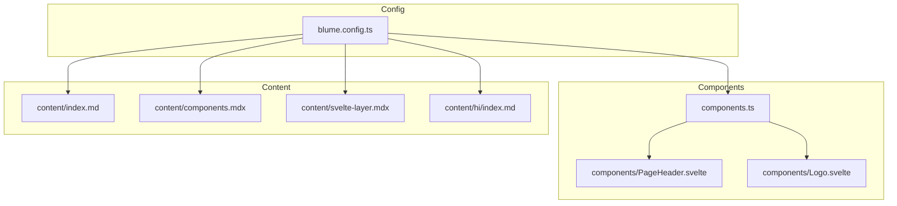
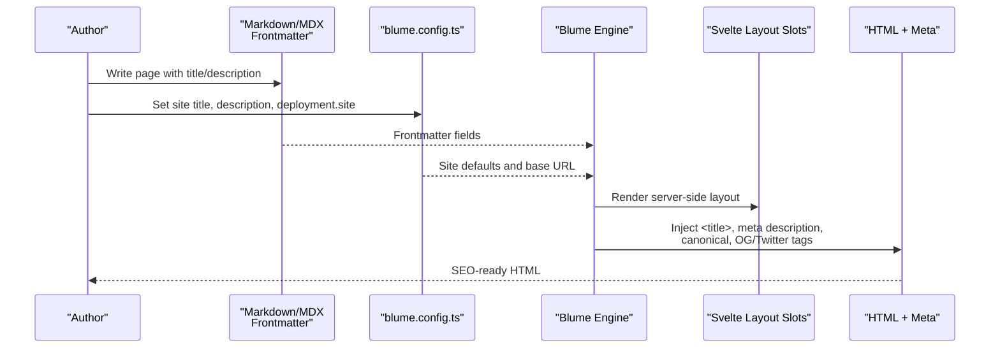
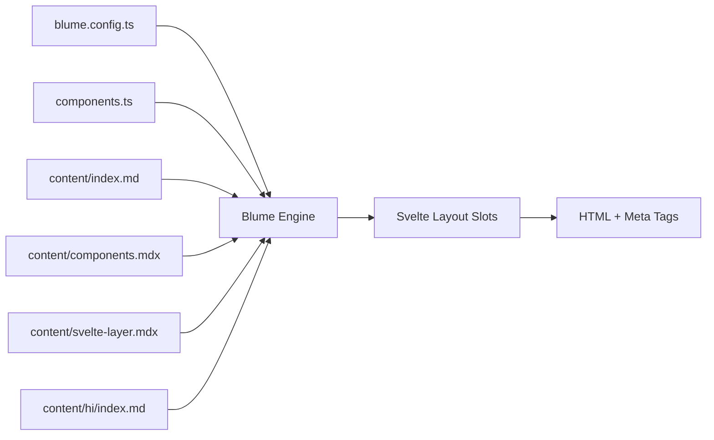

# SEO and Meta Tags

<cite>
**Referenced Files in This Document**
- [blume.config.ts](file://blume.config.ts)
- [components.ts](file://components.ts)
- [README.md](file://README.md)
- [package.json](file://package.json)
- [content/index.md](file://content/index.md)
- [content/components.mdx](file://content/components.mdx)
- [content/svelte-layer.mdx](file://content/svelte-layer.mdx)
- [content/hi/index.md](file://content/hi/index.md)
- [components/PageHeader.svelte](file://components/PageHeader.svelte)
- [components/Logo.svelte](file://components/Logo.svelte)
</cite>

## Table of Contents
1. [Introduction](#introduction)
2. [Project Structure](#project-structure)
3. [Core Components](#core-components)
4. [Architecture Overview](#architecture-overview)
5. [Detailed Component Analysis](#detailed-component-analysis)
6. [Dependency Analysis](#dependency-analysis)
7. [Performance Considerations](#performance-considerations)
8. [Troubleshooting Guide](#troubleshooting-guide)
9. [Conclusion](#conclusion)
10. [Appendices](#appendices)

## Introduction
This document explains how SEO optimization and meta tag management work in FractalWiki, which is built with Blume and uses Svelte for the component layer. It covers:
- Configuring page titles, descriptions, and keywords via frontmatter
- Open Graph and social sharing metadata
- Twitter Card support
- Search engine indexing best practices
- Canonical URLs, robots.txt generation, and sitemap creation
- Accessibility considerations for SEO (semantic HTML and ARIA labels)
- Examples of effective meta tag configurations for different content types

Blume provides first-class SEO features including OG, canonicals, sitemaps, and more, while this project swaps Blume’s default Astro components with Svelte components for layout slots.

**Section sources**
- [README.md:21-32](file://README.md#L21-L32)
- [blume.config.ts:24-27](file://blume.config.ts#L24-L27)

## Project Structure
FractalWiki organizes configuration, components, and content as follows:
- blume.config.ts: Site-wide settings, frontmatter schema, navigation, i18n, and deployment base URL
- components.ts: Maps Blume layout slots to Svelte components
- components/*.svelte: Server-rendered layout overrides (zero JS by default)
- islands/*.svelte: Hydrated interactive components used in MDX pages
- content/**/*.md(x): Pages with frontmatter that drive per-page SEO fields

**Diagram sources**
- [blume.config.ts:14-27](file://blume.config.ts#L14-L27)
- [components.ts:20-26](file://components.ts#L20-L26)
- [content/index.md:1-4](file://content/index.md#L1-L4)
- [content/components.mdx:1-5](file://content/components.mdx#L1-L5)
- [content/svelte-layer.mdx:1-5](file://content/svelte-layer.mdx#L1-L5)
- [content/hi/index.md:1-4](file://content/hi/index.md#L1-L4)

**Section sources**
- [README.md:101-111](file://README.md#L101-L111)
- [blume.config.ts:14-27](file://blume.config.ts#L14-L27)
- [components.ts:20-26](file://components.ts#L20-L26)

## Core Components
- Site-level defaults: title and description are defined in the site config and can be overridden per page via frontmatter.
- Per-page frontmatter: Each markdown/MDX page can specify title and description; these drive <title>, meta description, and social tags.
- Deployment base URL: The deployment.site value enables absolute canonical URLs, sitemaps, and social cards across both engines.
- Layout slots: Svelte components replace Blume’s default Astro components for header/footer/page headers, preserving SEO-friendly server rendering.

Key implications:
- Set a unique, descriptive title and concise description per page for optimal SERP snippets and social previews.
- Use deployment.site to ensure correct canonical URLs and absolute links for OG/Twitter images and links.

**Section sources**
- [blume.config.ts:14-27](file://blume.config.ts#L14-L27)
- [content/index.md:1-4](file://content/index.md#L1-L4)
- [content/components.mdx:1-5](file://content/components.mdx#L1-L5)
- [content/svelte-layer.mdx:1-5](file://content/svelte-layer.mdx#L1-L5)
- [content/hi/index.md:1-4](file://content/hi/index.md#L1-L4)

## Architecture Overview
SEO data flows from configuration and frontmatter into Blume’s rendering pipeline, which generates semantic HTML, meta tags, canonical links, and social metadata. Svelte layout slots render on the server without client JavaScript unless explicitly requested.

**Diagram sources**
- [blume.config.ts:14-27](file://blume.config.ts#L14-L27)
- [content/index.md:1-4](file://content/index.md#L1-L4)
- [components.ts:20-26](file://components.ts#L20-L26)

## Detailed Component Analysis

### Frontmatter-driven Page Metadata
- Title and description are set per page in frontmatter. These values override or complement site defaults.
- Example usage patterns:
  - Home page: concise brand-focused title and high-level description
  - Documentation pages: specific topic title and summary description
  - Localized pages: translated title and description

Best practices:
- Keep titles under ~60 characters for full visibility in search results.
- Use clear, keyword-rich descriptions (~150–160 characters).
- Ensure each page has a unique title and description.

**Section sources**
- [content/index.md:1-4](file://content/index.md#L1-L4)
- [content/components.mdx:1-5](file://content/components.mdx#L1-L5)
- [content/svelte-layer.mdx:1-5](file://content/svelte-layer.mdx#L1-L5)
- [content/hi/index.md:1-4](file://content/hi/index.md#L1-L4)

### Open Graph and Social Sharing
- Blume supports OG metadata generation. With deployment.site configured, absolute URLs are used for canonicals and social assets.
- Recommended fields:
  - og:title: matches page title
  - og:description: matches page description
  - og:image: absolute URL to a representative image
  - og:url: canonical URL derived from deployment.site and route
  - og:locale: set per locale (e.g., en_US, hi_IN)

Implementation notes:
- Ensure deployment.site is set to avoid relative URLs in OG tags.
- Provide appropriately sized images (recommended 1200x630 px) for optimal previews.

**Section sources**
- [blume.config.ts:24-27](file://blume.config.ts#L24-L27)
- [README.md:21-32](file://README.md#L21-L32)

### Twitter Cards
- Twitter Card metadata aligns with OG tags. Blume typically maps OG fields to Twitter equivalents.
- Recommended fields:
  - twitter:card: summary_large_image
  - twitter:title: same as og:title
  - twitter:description: same as og:description
  - twitter:image: absolute URL to an image

Verification:
- Use Twitter’s card validator to preview and validate cards.

**Section sources**
- [README.md:21-32](file://README.md#L21-L32)
- [blume.config.ts:24-27](file://blume.config.ts#L24-L27)

### Canonical URLs and Robots Directives
- Canonical URLs: Enabled via deployment.site; Blume generates absolute canonical links per page.
- Robots directives: Configure per-page or globally through Blume’s frontmatter/schema if supported by your version. Common directives include noindex, nofollow, and others.
- Best practices:
  - Always set a single canonical URL per page.
  - Avoid duplicate content by using canonicals for near-duplicate pages.
  - Use robots meta tags judiciously to control indexing behavior.

**Section sources**
- [blume.config.ts:24-27](file://blume.config.ts#L24-L27)
- [README.md:21-32](file://README.md#L21-L32)

### Sitemap Generation
- Blume generates a sitemap when deployment.site is configured.
- Steps:
  - Ensure deployment.site is set correctly.
  - Build the site; sitemap will be included in the output.
  - Submit sitemap to search engines via their respective consoles.

**Section sources**
- [blume.config.ts:24-27](file://blume.config.ts#L24-L27)
- [README.md:21-32](file://README.md#L21-L32)

### robots.txt
- If not present, create a robots.txt file at the public root to guide crawlers.
- Common entries:
  - Allow all paths except sensitive areas
  - Disallow admin or draft routes
  - Reference sitemap location

Note: In this project, there is no pre-existing robots.txt; you may add one under public/ as needed.

**Section sources**
- [package.json:1-41](file://package.json#L1-L41)

### Structured Data with JSON-LD
- Add JSON-LD script blocks within MDX pages to provide structured data for rich results.
- Common schemas:
  - Article, WebPage, BreadcrumbList, FAQPage, HowTo
- Guidelines:
  - Use absolute URLs for image and author properties.
  - Include name, description, datePublished, and dateModified where applicable.
  - Validate with Google’s Rich Results Test.

Example structure (conceptual):
- WebPage schema for documentation pages
- Article schema for blog-style posts
- BreadcrumbList for hierarchical navigation

**Section sources**
- [README.md:21-32](file://README.md#L21-L32)

### Accessibility Considerations for SEO
- Semantic HTML: Use proper heading hierarchy (h1–h6), lists, and landmarks.
- ARIA labels: Enhance accessibility and indirectly benefit SEO through better crawlability.
- Image alt text: Describe images succinctly for screen readers and search engines.
- Navigation: Ensure logical link structures and descriptive anchor text.

In this project:
- Logo includes an aria-label for the home link.
- PageHeader sections nav includes an aria-label for section navigation.

**Section sources**
- [components/Logo.svelte:9](file://components/Logo.svelte#L9)
- [components/PageHeader.svelte:23](file://components/PageHeader.svelte#L23)

### Internationalization and SEO
- i18n configuration defines default and fallback locales, plus localized labels.
- Per-locale pages should have localized titles and descriptions.
- Use hreflang attributes if supported by Blume to indicate language variants.

**Section sources**
- [blume.config.ts:48-55](file://blume.config.ts#L48-L55)
- [content/hi/index.md:1-4](file://content/hi/index.md#L1-L4)

## Dependency Analysis
The following diagram shows how configuration, components, and content interact to produce SEO outputs.

**Diagram sources**
- [blume.config.ts:14-27](file://blume.config.ts#L14-L27)
- [components.ts:20-26](file://components.ts#L20-L26)
- [content/index.md:1-4](file://content/index.md#L1-L4)
- [content/components.mdx:1-5](file://content/components.mdx#L1-L5)
- [content/svelte-layer.mdx:1-5](file://content/svelte-layer.mdx#L1-L5)
- [content/hi/index.md:1-4](file://content/hi/index.md#L1-L4)

**Section sources**
- [README.md:21-32](file://README.md#L21-L32)

## Performance Considerations
- Prefer server-rendered layouts (default for Svelte slots) to minimize client JavaScript and improve initial load.
- Optimize images for OG/Twitter cards to reduce bandwidth and improve social preview performance.
- Avoid heavy client-side logic in layout slots unless necessary.

[No sources needed since this section provides general guidance]

## Troubleshooting Guide
Common issues and resolutions:
- Missing or incorrect canonical URLs: Verify deployment.site is set and routes are correct.
- Empty or wrong OG/Twitter images: Ensure absolute URLs and valid image formats.
- Duplicate content warnings: Check canonical tags and avoid identical titles/descriptions across pages.
- Localization problems: Confirm i18n settings and per-locale frontmatter.

Validation tools:
- Google Lighthouse for performance and SEO audits
- Twitter Card Validator for social previews
- Rich Results Test for structured data

**Section sources**
- [blume.config.ts:24-27](file://blume.config.ts#L24-L27)
- [README.md:21-32](file://README.md#L21-L32)

## Conclusion
FractalWiki leverages Blume’s robust SEO capabilities with a Svelte component layer. By configuring site defaults, setting per-page frontmatter, and ensuring absolute URLs via deployment.site, you can achieve strong search engine visibility and compelling social previews. Adhering to accessibility best practices and adding structured data further enhances discoverability and user experience.

[No sources needed since this section summarizes without analyzing specific files]

## Appendices

### Effective Meta Tag Configurations by Content Type
- Home page: Brand-focused title, concise overview description, primary OG image
- Documentation page: Specific topic title, summary description, relevant tags
- Blog post: Engaging title, excerpt description, author and publish date in structured data
- Localized page: Translated title and description, appropriate locale metadata

[No sources needed since this section provides general guidance]