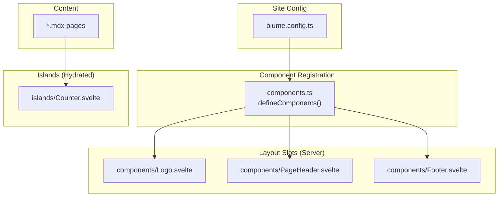
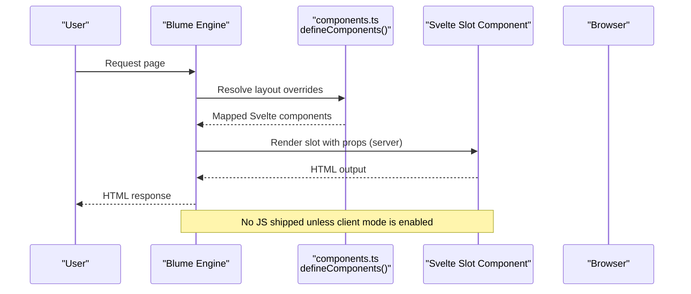
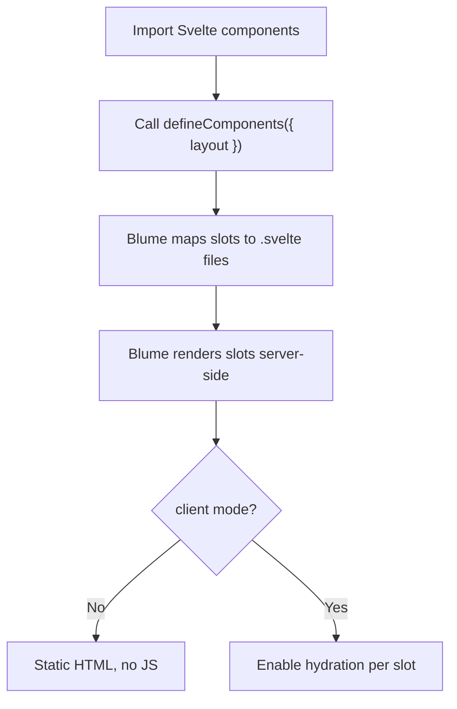
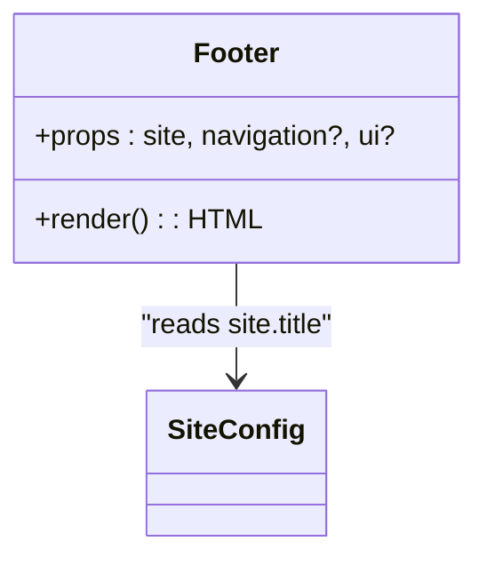
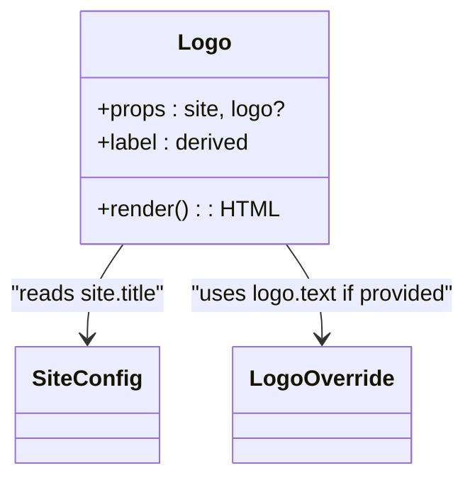
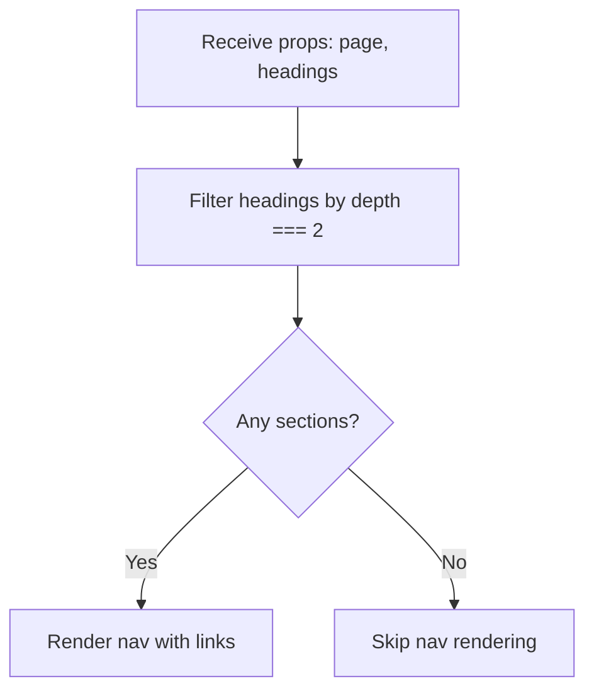
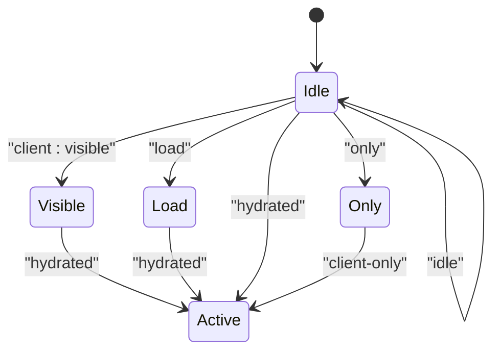
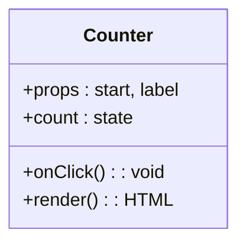
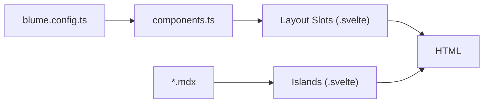

# Component System

<cite>
**Referenced Files in This Document**
- [components.ts](file://components.ts)
- [blume.config.ts](file://blume.config.ts)
- [Footer.svelte](file://components/Footer.svelte)
- [Logo.svelte](file://components/Logo.svelte)
- [PageHeader.svelte](file://components/PageHeader.svelte)
- [Counter.svelte](file://islands/Counter.svelte)
- [README.md](file://README.md)
- [svelte-layer.mdx](file://content/svelte-layer.mdx)
</cite>

## Table of Contents
1. [Introduction](#introduction)
2. [Project Structure](#project-structure)
3. [Core Components](#core-components)
4. [Architecture Overview](#architecture-overview)
5. [Detailed Component Analysis](#detailed-component-analysis)
6. [Dependency Analysis](#dependency-analysis)
7. [Performance Considerations](#performance-considerations)
8. [Troubleshooting Guide](#troubleshooting-guide)
9. [Conclusion](#conclusion)
10. [Appendices](#appendices)

## Introduction
This document explains the FractalWiki component system built on Blume with Svelte as the component layer. It covers how Blume’s slot system allows replacing default Astro components with Svelte equivalents, documents all available layout slots and their props/fallbacks, details the registration process via defineComponents, and clarifies the difference between server-rendered layout slots and client-hydrated island components. It also includes hydration strategies for islands and practical examples from the codebase.

## Project Structure
The project organizes components into two surfaces:
- Layout slots: static, server-rendered Svelte components that replace Blume’s default Astro components.
- Islands: interactive Svelte components placed under a dedicated directory and used directly in MDX without imports.

**Diagram sources**
- [blume.config.ts:14-56](file://blume.config.ts#L14-L56)
- [components.ts:20-26](file://components.ts#L20-L26)
- [Logo.svelte:1-50](file://components/Logo.svelte#L1-L50)
- [PageHeader.svelte:1-76](file://components/PageHeader.svelte#L1-L76)
- [Footer.svelte:1-30](file://components/Footer.svelte#L1-L30)
- [Counter.svelte:1-45](file://islands/Counter.svelte#L1-L45)

**Section sources**
- [blume.config.ts:14-56](file://blume.config.ts#L14-L56)
- [README.md:104-111](file://README.md#L104-L111)

## Core Components
Blume exposes a set of layout slots that can be overridden by Svelte components. The following table summarizes each slot, its fallback behavior, and the props it receives:

- Logo
  - Fallback: Blume logo
  - Props: site, logo
- Header
  - Fallback: Blume header
  - Props: none
- Sidebar / MobileNav
  - Fallback: navigation tree
  - Props: none
- Breadcrumbs
  - Fallback: breadcrumbs
  - Props: none
- TableOfContents
  - Fallback: TOC
  - Props: none
- Pagination
  - Fallback: prev/next
  - Props: none
- PageHeader / PageFooter
  - Fallback: nothing
  - Props: page, route, headings
- Footer
  - Fallback: nothing
  - Props: site, navigation, ui
- Feedback
  - Fallback: page feedback
  - Props: none
- Search
  - Fallback: search box
  - Props: none

These slots render on the server and ship no JavaScript unless you explicitly enable a client mode.

**Section sources**
- [README.md:55-71](file://README.md#L55-L71)
- [content/svelte-layer.mdx:56-67](file://content/svelte-layer.mdx#L56-L67)

## Architecture Overview
Blume owns routing, content collections, markdown/MDX, layout, theming, search, and more. The only swap is the component surface: wherever Blume would use an Astro component, this project supplies a Svelte one. Blume infers the framework from the .svelte extension and enables the necessary runtime to render your components in the appropriate slots.

**Diagram sources**
- [components.ts:1-26](file://components.ts#L1-L26)
- [README.md:21-32](file://README.md#L21-L32)

## Detailed Component Analysis

### Component Registration with defineComponents
Registration happens in a single file where you import Svelte components and map them to Blume layout slots using defineComponents. This is the central configuration point for swapping default Astro components with Svelte equivalents.

**Diagram sources**
- [components.ts:1-26](file://components.ts#L1-L26)

**Section sources**
- [components.ts:1-26](file://components.ts#L1-L26)
- [README.md:44-53](file://README.md#L44-L53)

### Server-Rendered Layout Slots vs Client-Hydrated Islands
- Layout slots are static by default and render on the server. They do not ship JavaScript unless you assign a client mode.
- Islands are interactive components placed under a specific directory. They hydrate in the browser according to a chosen strategy.

Key differences:
- Rendering: slots are server-rendered; islands hydrate client-side.
- Usage: slots are registered in components.ts; islands are auto-discovered and usable in MDX without imports.
- Data access: slots receive props from Blume; islands receive serializable props passed from MDX.

**Section sources**
- [README.md:40-71](file://README.md#L40-L71)
- [content/svelte-layer.mdx:25-37](file://content/svelte-layer.mdx#L25-L37)

### Practical Examples: Footer.svelte, Logo.svelte, PageHeader.svelte
Each example demonstrates a different slot pattern and prop usage.

#### Footer.svelte
- Purpose: Replace Blume’s default empty footer with a custom footer.
- Props: site (with title), optional navigation and ui.
- Behavior: Purely presentational; no client mode, so no JS shipped.

**Diagram sources**
- [Footer.svelte:1-30](file://components/Footer.svelte#L1-L30)

**Section sources**
- [Footer.svelte:1-30](file://components/Footer.svelte#L1-L30)

#### Logo.svelte
- Purpose: Replace Blume’s default logo inside the header.
- Props: site (with title), optional logo (with text override).
- Behavior: Static rendering; uses derived value for label based on logo.text or site.title.

**Diagram sources**
- [Logo.svelte:1-50](file://components/Logo.svelte#L1-L50)

**Section sources**
- [Logo.svelte:1-50](file://components/Logo.svelte#L1-L50)

#### PageHeader.svelte
- Purpose: Render a section strip above the article body using extracted headings.
- Props: page (title, description, route), optional route, headings array.
- Behavior: Filters headings by depth to build a navigable list; no client mode, no JS.

**Diagram sources**
- [PageHeader.svelte:1-76](file://components/PageHeader.svelte#L1-L76)

**Section sources**
- [PageHeader.svelte:1-76](file://components/PageHeader.svelte#L1-L76)

### Hydration Strategies for Islands
Islands support multiple hydration modes:
- client:visible (default): Hydrates when scrolled into view.
- load: Hydrates immediately on page load.
- idle: Hydrates on idle.
- only: Client-only, never server-rendered.

You can set the mode per island via an export in the component file or through a descriptor form in components.ts. Props must be serializable.

**Diagram sources**
- [README.md:73-85](file://README.md#L73-L85)
- [content/svelte-layer.mdx:25-37](file://content/svelte-layer.mdx#L25-L37)

**Section sources**
- [README.md:73-85](file://README.md#L73-L85)
- [content/svelte-layer.mdx:25-37](file://content/svelte-layer.mdx#L25-L37)

### Example Island: Counter.svelte
An island component demonstrating interactivity and default hydration behavior. It uses reactive state and event handlers, and hydrates on visibility by default.

**Diagram sources**
- [Counter.svelte:1-45](file://islands/Counter.svelte#L1-L45)

**Section sources**
- [Counter.svelte:1-45](file://islands/Counter.svelte#L1-L45)

## Dependency Analysis
The component system has clear boundaries:
- blume.config.ts defines site metadata, content root, deployment settings, frontmatter schema, navigation, and i18n.
- components.ts registers layout slot overrides via defineComponents.
- Layout slot components consume Blume-provided props and render static HTML.
- Islands are independent, hydrated components used within MDX.

**Diagram sources**
- [blume.config.ts:14-56](file://blume.config.ts#L14-L56)
- [components.ts:20-26](file://components.ts#L20-L26)

**Section sources**
- [blume.config.ts:14-56](file://blume.config.ts#L14-L56)
- [components.ts:20-26](file://components.ts#L20-L26)

## Performance Considerations
- Prefer static layout slots without client mode to avoid shipping JavaScript.
- Use islands judiciously; they add client-side code and hydration overhead.
- Choose appropriate hydration modes: visible for non-critical UI, load for essential interactions, idle for deferred work, only for browser-only features.
- Keep island props serializable to minimize serialization costs.

[No sources needed since this section provides general guidance]

## Troubleshooting Guide
Common issues and resolutions:
- Accessing collection data in a Svelte slot: You cannot import Astro-only virtual modules in a .svelte slot. Options:
  - Hydrate the slot and read serialized snapshots via hooks.
  - Keep that specific slot as .astro while coexisting with Svelte slots.
- Unexpected hydration behavior: Ensure the correct client mode is set for islands and that props are serializable.
- Missing props in slots: Verify the slot’s expected props match what Blume passes (e.g., site, logo, page, headings).

**Section sources**
- [README.md:87-99](file://README.md#L87-L99)
- [content/svelte-layer.mdx:56-67](file://content/svelte-layer.mdx#L56-L67)

## Conclusion
FractalWiki leverages Blume’s slot system to seamlessly replace default Astro components with Svelte equivalents. Layout slots provide static, server-rendered UI with zero JavaScript by default, while islands offer interactive, client-hydrated components with flexible hydration strategies. By registering components via defineComponents and adhering to prop contracts, you can compose powerful, performant layouts and interactive experiences across your site.

[No sources needed since this section summarizes without analyzing specific files]

## Appendices

### Available Layout Slots Reference
- Logo: site, logo
- Header: none
- Sidebar/MobileNav: none
- Breadcrumbs: none
- TableOfContents: none
- Pagination: none
- PageHeader/PageFooter: page, route, headings
- Footer: site, navigation, ui
- Feedback: none
- Search: none

**Section sources**
- [README.md:55-71](file://README.md#L55-L71)
- [content/svelte-layer.mdx:56-67](file://content/svelte-layer.mdx#L56-L67)

### Hydration Modes Summary
- client:visible: Hydrates when scrolled into view (default)
- load: Hydrates immediately
- idle: Hydrates on idle
- only: Client-only, never server-rendered

**Section sources**
- [README.md:73-85](file://README.md#L73-L85)
- [content/svelte-layer.mdx:25-37](file://content/svelte-layer.mdx#L25-L37)