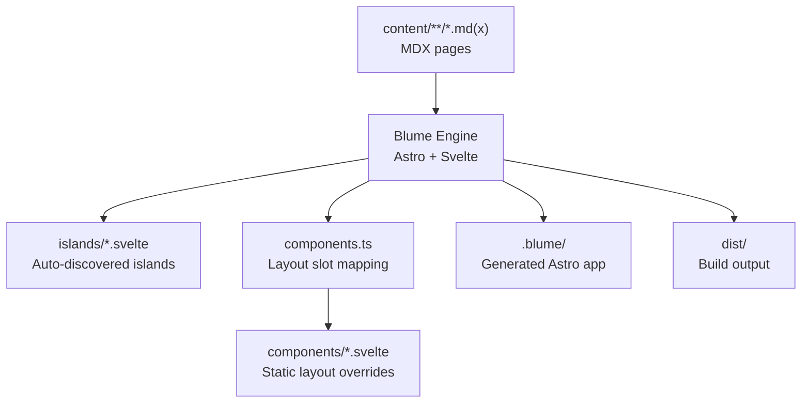
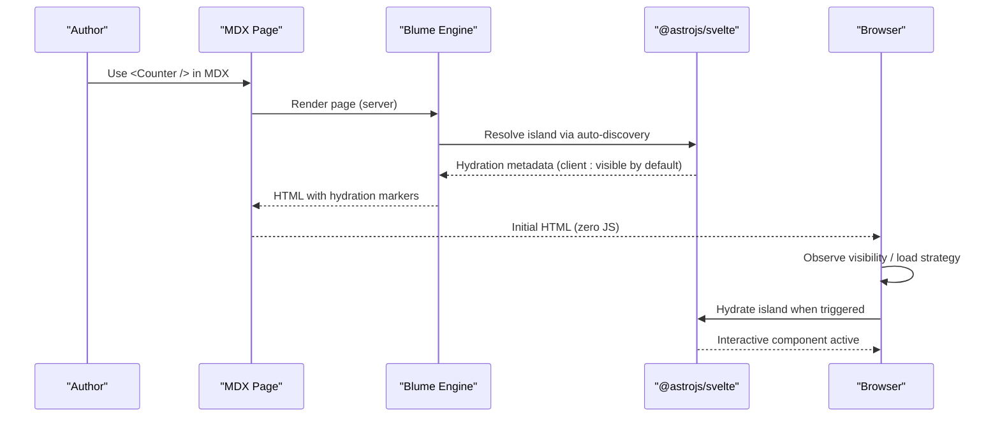
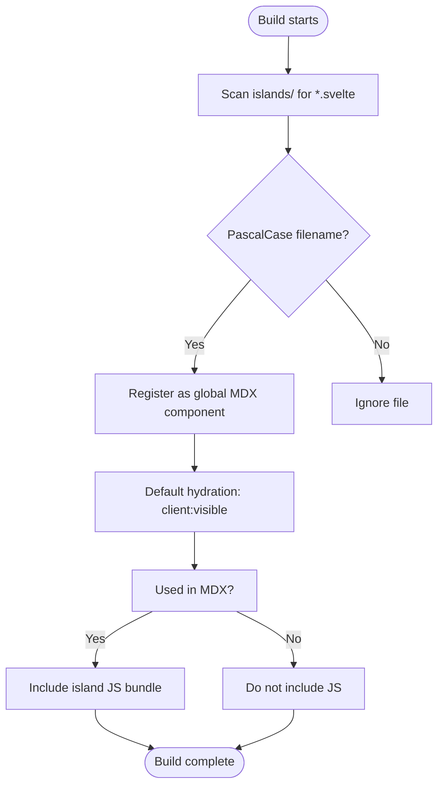
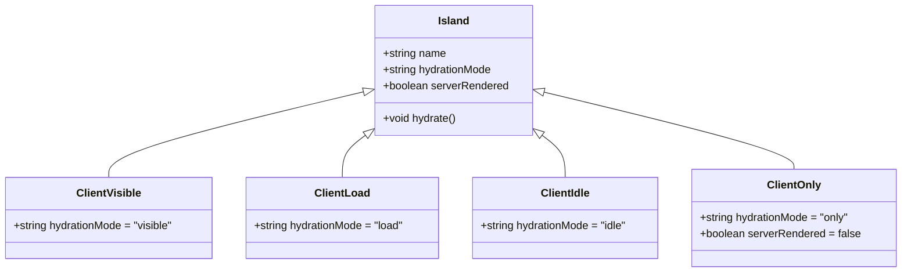
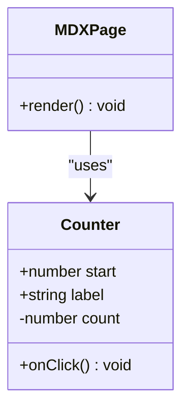
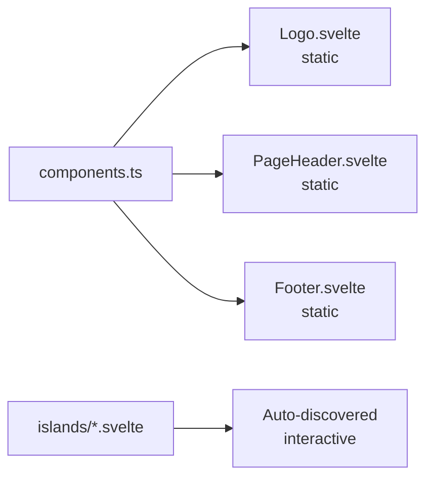
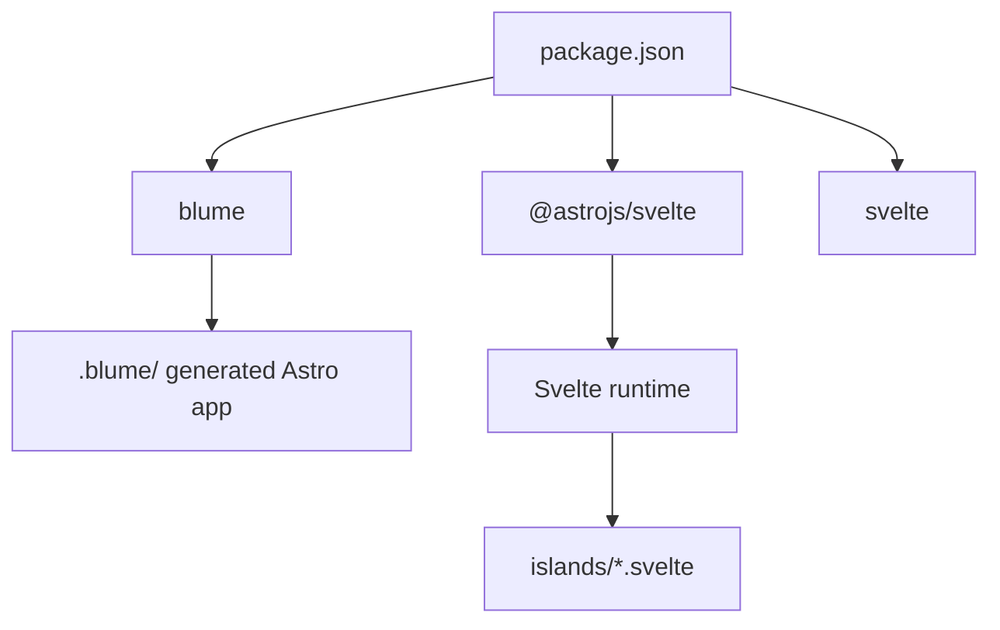

# Island Components

<cite>
**Referenced Files in This Document**
- [Counter.svelte](file://islands/Counter.svelte)
- [components.ts](file://components.ts)
- [blume.config.ts](file://blume.config.ts)
- [README.md](file://README.md)
- [svelte-layer.mdx](file://content/svelte-layer.mdx)
- [package.json](file://package.json)
</cite>

## Table of Contents
1. [Introduction](#introduction)
2. [Project Structure](#project-structure)
3. [Core Components](#core-components)
4. [Architecture Overview](#architecture-overview)
5. [Detailed Component Analysis](#detailed-component-analysis)
6. [Dependency Analysis](#dependency-analysis)
7. [Performance Considerations](#performance-considerations)
8. [Troubleshooting Guide](#troubleshooting-guide)
9. [Conclusion](#conclusion)

## Introduction
This document explains FractalWiki’s island component system: how interactive Svelte components placed under the islands/ directory are automatically discovered and made available to MDX pages without imports, and how they hydrate based on visibility or load strategies. It also covers hydration modes (client:visible, load, idle, only), demonstrates a practical example with Counter.svelte using Svelte 5 runes ($state), and provides guidance for architecture, performance, and debugging.

Key benefits:
- Progressive enhancement: content renders fully on the server with zero JavaScript by default.
- Islands hydrate only when needed, minimizing client-side payload.
- Automatic discovery: any PascalCase .svelte file in islands/ is usable anywhere in MDX without explicit registration.

**Section sources**
- [README.md:73-85](file://README.md#L73-L85)
- [svelte-layer.mdx:11-23](file://content/svelte-layer.mdx#L11-L23)

## Project Structure
The project uses Blume as the site engine with Svelte as the component layer. The relevant directories and files for islands are:
- islands/*.svelte — interactive components that become globally available in MDX
- components.ts — maps layout slots to Svelte components; islands are auto-discovered
- blume.config.ts — site configuration
- README.md — documentation of the two Svelte surfaces (layout slots and islands)
- package.json — dependencies including @astrojs/svelte and svelte

**Diagram sources**
- [README.md:103-111](file://README.md#L103-L111)
- [blume.config.ts:1-13](file://blume.config.ts#L1-L13)

**Section sources**
- [README.md:103-111](file://README.md#L103-L111)
- [blume.config.ts:1-13](file://blume.config.ts#L1-L13)

## Core Components
- Counter.svelte: an island demonstrating Svelte 5 runes, props, and event handling.
- components.ts: defines layout slot mappings; islands are not listed here because they are auto-discovered.
- blume.config.ts: site-level configuration; does not affect island discovery directly but configures the overall site.

Island behavior highlights:
- Auto-discovery: any PascalCase .svelte file in islands/ becomes a global component in MDX.
- Default hydration: client:visible (hydrates when scrolled into view).
- Props: must be serializable and pass through from MDX usage.
- Zero JS by default: islands ship minimal JS and only when used.

**Section sources**
- [Counter.svelte:1-9](file://islands/Counter.svelte#L1-L9)
- [README.md:73-85](file://README.md#L73-L85)
- [svelte-layer.mdx:11-23](file://content/svelte-layer.mdx#L11-L23)

## Architecture Overview
The island system integrates with Blume and Astro/Svelte tooling to provide automatic discovery and selective hydration.

**Diagram sources**
- [README.md:73-85](file://README.md#L73-L85)
- [svelte-layer.mdx:25-37](file://content/svelte-layer.mdx#L25-L37)

## Detailed Component Analysis

### Island Auto-Discovery Mechanism
- Any PascalCase .svelte file in islands/ is treated as a globally available component in MDX.
- No import statements are required; Blume registers them automatically during build.
- Islands are included only on pages that use them, keeping payloads small.
- Default hydration mode is client:visible unless overridden per island.

**Diagram sources**
- [README.md:73-85](file://README.md#L73-L85)
- [svelte-layer.mdx:11-23](file://content/svelte-layer.mdx#L11-L23)

**Section sources**
- [README.md:73-85](file://README.md#L73-L85)
- [svelte-layer.mdx:11-23](file://content/svelte-layer.mdx#L11-L23)

### Hydration Modes
Hydration determines when the island’s JavaScript runs in the browser:
- visible (default): hydrates when the component enters the viewport.
- load: hydrates immediately on page load.
- idle: hydrates when the browser is idle.
- only: client-only rendering; never server-rendered.

You can set the mode per island using export const client in the component file, or via a descriptor form in components.ts.

**Diagram sources**
- [svelte-layer.mdx:25-37](file://content/svelte-layer.mdx#L25-L37)
- [README.md:73-85](file://README.md#L73-L85)

**Section sources**
- [svelte-layer.mdx:25-37](file://content/svelte-layer.mdx#L25-L37)
- [README.md:73-85](file://README.md#L73-L85)

### Practical Example: Counter.svelte
Counter.svelte demonstrates:
- Svelte 5 runes: $props for typed props, $state for reactive state.
- Event handling: onclick updates count reactively.
- Styling: scoped styles using CSS classes and theme variables.

Usage in MDX:
- <Counter /> uses defaults.
- <Counter start={10} label="Pressed" /> passes props.

Props contract:
- start: number (default 0)
- label: string (default 'Clicked')

State management:
- count initialized from start prop using $state.

Event handling:
- Button click increments count.

**Diagram sources**
- [Counter.svelte:1-14](file://islands/Counter.svelte#L1-L14)
- [svelte-layer.mdx:16-23](file://content/svelte-layer.mdx#L16-L23)

**Section sources**
- [Counter.svelte:1-14](file://islands/Counter.svelte#L1-L14)
- [svelte-layer.mdx:16-23](file://content/svelte-layer.mdx#L16-L23)

### Layout Slots vs Islands
- Layout slots (components/*.svelte) are static by default and render on the server with no JavaScript unless explicitly given a client mode.
- Islands (islands/*.svelte) are interactive and hydrate according to their mode.
- components.ts maps layout slots to Svelte components; islands are auto-discovered and do not require registration.

**Diagram sources**
- [components.ts:1-27](file://components.ts#L1-L27)
- [README.md:40-71](file://README.md#L40-L71)

**Section sources**
- [components.ts:1-27](file://components.ts#L1-L27)
- [README.md:40-71](file://README.md#L40-L71)

## Dependency Analysis
- Blume orchestrates routing, content collections, markdown/MDX, and layout.
- @astrojs/svelte enables Svelte components within the Astro-generated app.
- Svelte 5 provides runes ($state, $props, $derived) for reactive logic.
- Islands are discovered at build time and included only when used.

**Diagram sources**
- [package.json:16-39](file://package.json#L16-L39)
- [README.md:103-111](file://README.md#L103-L111)

**Section sources**
- [package.json:16-39](file://package.json#L16-L39)
- [README.md:103-111](file://README.md#L103-L111)

## Performance Considerations
- Zero JavaScript by default: layout slots and non-hydrated islands ship no JS.
- Selective hydration: islands hydrate only when needed (visible, load, idle).
- Payload optimization: islands are included only on pages that use them.
- Prefer client:visible for most interactive elements to avoid unnecessary work.
- Use client:only sparingly for components that require immediate access to window/document.

[No sources needed since this section provides general guidance]

## Troubleshooting Guide
Common issues and resolutions:
- Island not found in MDX: ensure the file is PascalCase and located in islands/.
- Hydration not triggering: verify the client mode and visibility; check if the element is within the viewport.
- Props not updating: confirm props are serializable and correctly passed from MDX.
- Style conflicts: ensure scoped styles are applied and theme variables are defined.

Debugging techniques:
- Inspect hydration markers in the rendered HTML to confirm island boundaries.
- Use browser dev tools to observe when hydration occurs based on the selected mode.
- Verify dependency inclusion in the network tab to ensure islands are only loaded when used.

**Section sources**
- [README.md:73-85](file://README.md#L73-L85)
- [svelte-layer.mdx:25-37](file://content/svelte-layer.mdx#L25-L37)

## Conclusion
FractalWiki’s island component system leverages Blume and Svelte to deliver progressive enhancement with zero JavaScript by default. Islands are automatically discovered, hydrated selectively, and integrated seamlessly into MDX pages. By following the guidelines for architecture, performance, and debugging, developers can create efficient, interactive experiences while maintaining optimal performance.

[No sources needed since this section summarizes without analyzing specific files]