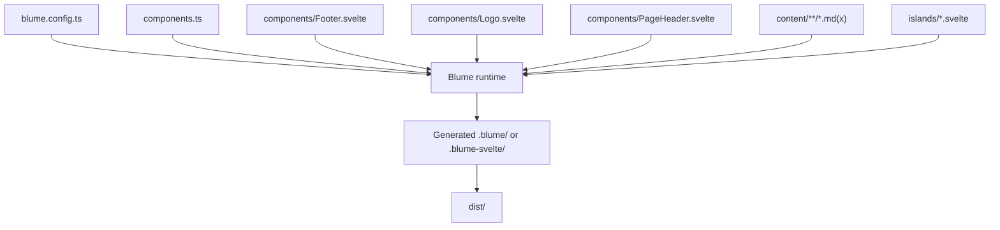
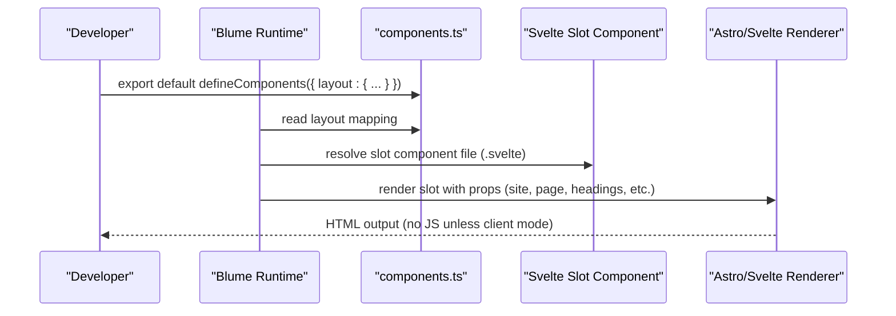
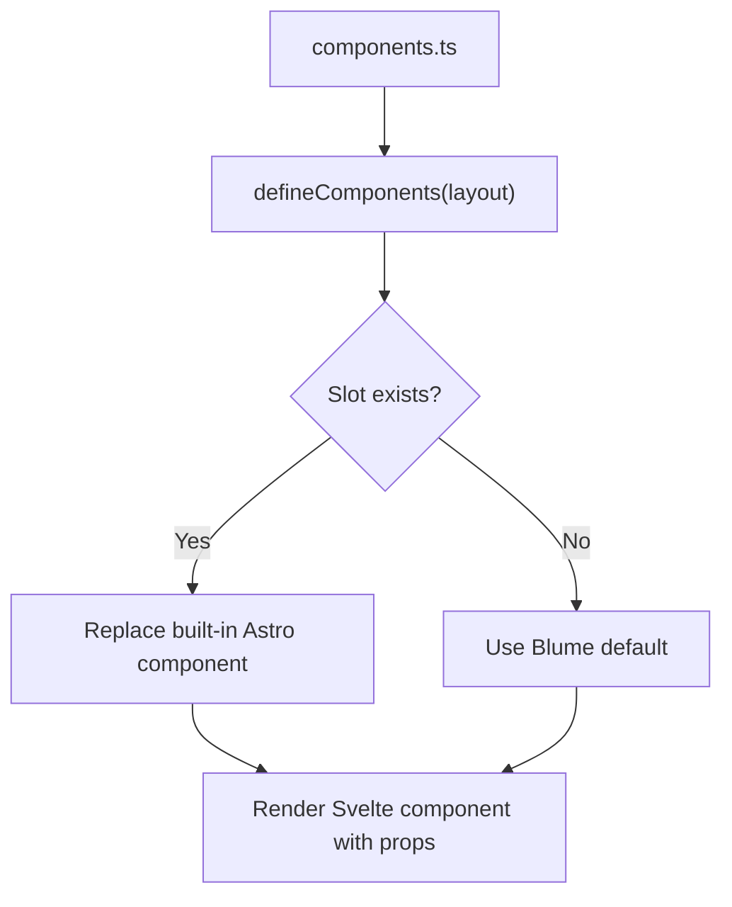
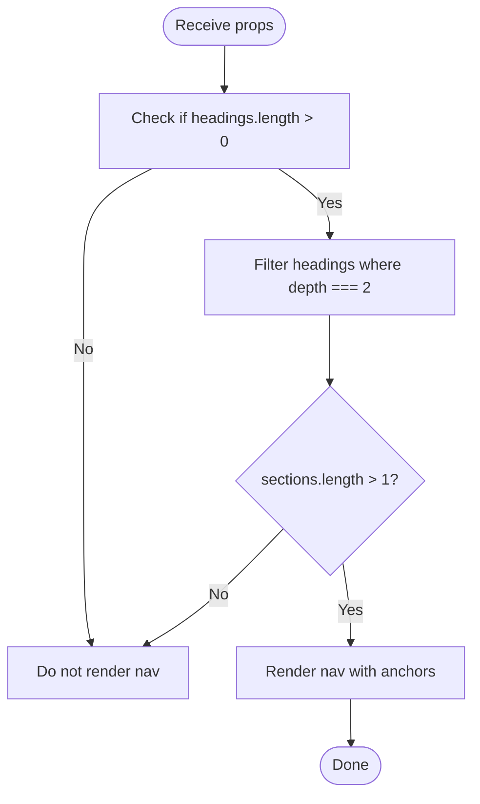
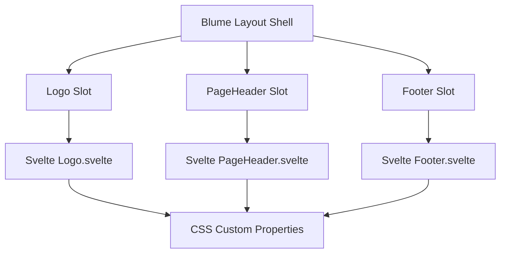
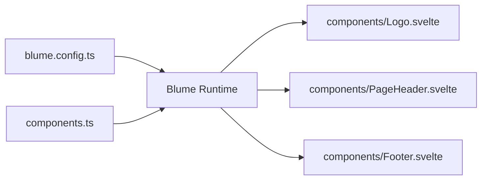

# Layout Slots

<cite>
**Referenced Files in This Document**
- [components.ts](file://components.ts)
- [blume.config.ts](file://blume.config.ts)
- [Footer.svelte](file://components/Footer.svelte)
- [Logo.svelte](file://components/Logo.svelte)
- [PageHeader.svelte](file://components/PageHeader.svelte)
- [README.md](file://README.md)
- [svelte-layer.mdx](file://content/svelte-layer.mdx)
</cite>

## Table of Contents
1. [Introduction](#introduction)
2. [Project Structure](#project-structure)
3. [Core Components](#core-components)
4. [Architecture Overview](#architecture-overview)
5. [Detailed Component Analysis](#detailed-component-analysis)
6. [Dependency Analysis](#dependency-analysis)
7. [Performance Considerations](#performance-considerations)
8. [Troubleshooting Guide](#troubleshooting-guide)
9. [Conclusion](#conclusion)
10. [Appendices](#appendices)

## Introduction
This document explains Blume’s layout slot system as implemented in FractalWiki, focusing on how the slot pattern allows replacing default Astro components with Svelte equivalents. It documents all available layout slots, their props interfaces, fallback behavior, and expected component structure. It also provides detailed examples from the codebase for Footer.svelte (dynamic year display and branding), Logo.svelte (animated SVG with hover effects), and PageHeader.svelte (section navigation derived from page headings). Finally, it covers the defineComponents API used to register slot components and offers best practices for designing slot components, validating props, and maintaining consistency across the site.

## Project Structure
FractalWiki uses a minimal structure:
- blume.config.ts configures site metadata, content root, navigation, i18n, and frontmatter schema.
- components.ts registers Svelte components against Blume layout slots via defineComponents.
- components/*.svelte contains the Svelte overrides for specific slots.
- content/** holds MDX pages that drive routing and content.
- islands/*.svelte are interactive components available in MDX without imports.



**Diagram sources**
- [blume.config.ts:14-56](file://blume.config.ts#L14-L56)
- [components.ts:20-26](file://components.ts#L20-L26)
- [Footer.svelte:1-30](file://components/Footer.svelte#L1-L30)
- [Logo.svelte:1-50](file://components/Logo.svelte#L1-L50)
- [PageHeader.svelte:1-76](file://components/PageHeader.svelte#L1-L76)

**Section sources**
- [blume.config.ts:14-56](file://blume.config.ts#L14-L56)
- [README.md:103-111](file://README.md#L103-L111)

## Core Components
The project demonstrates three concrete slot implementations:
- Logo.svelte: Renders an animated SVG mark and text label, using site configuration and optional logo override.
- PageHeader.svelte: Builds a “Sections” strip by filtering headings to depth 2 and generating anchor links.
- Footer.svelte: Displays site title and current year, plus a branding note.

These components are registered in components.ts under the layout key, which tells Blume to render these Svelte files instead of its built-in Astro components for those slots.

Key points:
- Slots are server-rendered by default and ship no JavaScript unless you opt into client hydration.
- Each slot receives a well-defined set of props passed by Blume.
- The components use CSS custom properties for theming consistency.

**Section sources**
- [components.ts:20-26](file://components.ts#L20-L26)
- [Logo.svelte:1-50](file://components/Logo.svelte#L1-L50)
- [PageHeader.svelte:1-76](file://components/PageHeader.svelte#L1-L76)
- [Footer.svelte:1-30](file://components/Footer.svelte#L1-L30)

## Architecture Overview
Blume owns routing, content collections, markdown/MDX processing, layout, theming, search, and more. In this project, the only swap is the component surface: wherever Blume would render an Astro component, it renders a Svelte component when you register one via defineComponents.



**Diagram sources**
- [components.ts:1-26](file://components.ts#L1-L26)
- [README.md:21-32](file://README.md#L21-L32)

## Detailed Component Analysis

### defineComponents API and Slot Registration
- Purpose: Map Blume layout slots to Svelte components.
- Behavior: Blume infers framework from .svelte extension, enables @astrojs/svelte, and renders your component in the slot.
- Available slots: Header, Sidebar, MobileNav, Breadcrumbs, TableOfContents, Pagination, Footer, PageHeader, PageFooter, Feedback, Logo, Search.
- Hydration: Layout slots are static (no JS) unless given a client mode; islands hydrate separately.



**Diagram sources**
- [components.ts:7-19](file://components.ts#L7-L19)
- [components.ts:20-26](file://components.ts#L20-L26)

**Section sources**
- [components.ts:7-19](file://components.ts#L7-L19)
- [components.ts:20-26](file://components.ts#L20-L26)
- [README.md:55-71](file://README.md#L55-L71)

### Slot: Logo
- Props interface:
  - site: object containing at least title
  - logo?: optional object with text property
- Fallback behavior: If logo.text is not provided, falls back to site.title.
- Expected structure: Anchor element wrapping an SVG mark and text label; accessible aria-label includes site.title and home intent.
- Implementation highlights:
  - Uses $derived to compute label from logo?.text ?? site.title.
  - Animated SVG mark rotates on hover via CSS transitions.
  - Theming via CSS custom properties (--color-accent).

```mermaid
classDiagram
class LogoProps {
+site : { title : string }
+logo? : { text? : string } | null
}
class LogoComponent {
+render()
-label : string
}
LogoComponent --> LogoProps : "receives"
```

**Diagram sources**
- [Logo.svelte:1-18](file://components/Logo.svelte#L1-L18)

**Section sources**
- [Logo.svelte:1-50](file://components/Logo.svelte#L1-L50)
- [README.md:55-71](file://README.md#L55-L71)

### Slot: PageHeader
- Props interface:
  - page: object with title, description?, route
  - headings?: array of objects with depth, slug, text
  - route?: string
- Fallback behavior: If headings is empty or fewer than two level-2 headings, no sections nav is rendered.
- Expected structure: Optional nav with label “Sections” and list of anchor links to h2 sections.
- Implementation highlights:
  - Filters headings to depth === 2 to build sections.
  - Generates anchor links using section.slug.
  - No JS required; purely static rendering based on headings prop.



**Diagram sources**
- [PageHeader.svelte:10-31](file://components/PageHeader.svelte#L10-L31)

**Section sources**
- [PageHeader.svelte:1-76](file://components/PageHeader.svelte#L1-L76)
- [svelte-layer.mdx:56-67](file://content/svelte-layer.mdx#L56-L67)

### Slot: Footer
- Props interface:
  - site: object with title
  - navigation?: unknown
  - ui?: unknown
- Fallback behavior: Blume renders no footer by default; this component exists because it was explicitly registered.
- Expected structure: Footer element displaying site title and current year, plus a branding note.
- Implementation highlights:
  - Computes year dynamically using Date().getFullYear().
  - Uses CSS custom properties for border and muted text color.
  - Styling ensures responsive layout with flexbox and gap.

```mermaid
classDiagram
class FooterProps {
+site : { title : string }
+navigation? : unknown
+ui? : unknown
}
class FooterComponent {
+render()
-year : number
}
FooterComponent --> FooterProps : "receives"
```

**Diagram sources**
- [Footer.svelte:1-12](file://components/Footer.svelte#L1-L12)

**Section sources**
- [Footer.svelte:1-30](file://components/Footer.svelte#L1-L30)
- [README.md:55-71](file://README.md#L55-L71)

### Conceptual Overview
The slot system enables consistent UI customization while keeping Blume’s core features intact. By registering Svelte components for specific slots, you can tailor the look and behavior of the site shell without modifying Blume internals. Slots receive predictable props, allowing you to build reusable, theme-aware components.



[No sources needed since this diagram shows conceptual workflow, not actual code structure]

## Dependency Analysis
The registration layer connects Blume’s runtime to your Svelte components. The config defines site-level settings, while components.ts wires slot names to component files.



**Diagram sources**
- [blume.config.ts:14-56](file://blume.config.ts#L14-L56)
- [components.ts:20-26](file://components.ts#L20-L26)

**Section sources**
- [blume.config.ts:14-56](file://blume.config.ts#L14-L56)
- [components.ts:20-26](file://components.ts#L20-L26)

## Performance Considerations
- Server-rendered slots produce zero-JS output by default, improving initial load performance.
- Avoid unnecessary client-side logic in slots unless you explicitly enable hydration via client modes.
- Use CSS custom properties for theming to avoid reflows and ensure consistent styling across light/dark modes.
- Keep slot components small and focused on their slot responsibilities to minimize bundle size.

[No sources needed since this section provides general guidance]

## Troubleshooting Guide
Common issues and resolutions:
- Slot not rendering: Ensure the slot name matches exactly and the component is registered in components.ts under layout.
- Missing props: Verify the component destructures the correct props (e.g., site, page, headings).
- Astro-only modules: You cannot import blume:data or astro:content in a .svelte slot; rely on props or hydrate and use blume/hooks if necessary.
- Hydration expectations: If you need interactivity, add client mode to the island or slot; otherwise, keep it static.

**Section sources**
- [README.md:87-99](file://README.md#L87-L99)
- [svelte-layer.mdx:64-67](file://content/svelte-layer.mdx#L64-L67)

## Conclusion
Blume’s layout slot system in FractalWiki demonstrates a clean separation between core functionality and customizable UI surfaces. By registering Svelte components for slots like Logo, PageHeader, and Footer, you gain full control over presentation while preserving Blume’s powerful features. Following the documented props interfaces, fallback behaviors, and best practices ensures consistent, performant, and maintainable layouts across your site.

[No sources needed since this section summarizes without analyzing specific files]

## Appendices

### All Available Layout Slots
- Header: Falls back to Blume header; no special props.
- Sidebar / MobileNav: Falls back to nav tree; no special props.
- Breadcrumbs: Falls back to breadcrumbs; no special props.
- TableOfContents: Falls back to TOC; no special props.
- Pagination: Falls back to prev/next; no special props.
- PageHeader / PageFooter: No default; receives page, route, headings.
- Footer: No default; receives site, navigation, ui.
- Feedback: Falls back to page feedback; no special props.
- Search: Falls back to search box; no special props.
- Logo: Falls back to Blume logo; receives site, logo.

**Section sources**
- [README.md:55-71](file://README.md#L55-L71)

### Best Practices for Slot Component Design
- Prop validation: Use TypeScript types to enforce expected shapes (as seen in each component’s $props typing).
- Fallbacks: Provide sensible defaults (e.g., logo.text falling back to site.title).
- Accessibility: Include meaningful aria attributes (e.g., aria-label on Logo anchor).
- Theming: Rely on CSS custom properties for colors and borders to support light/dark themes automatically.
- Hydration discipline: Keep slots static unless you need interactivity; prefer islands for interactive parts.
- Consistency: Follow naming conventions and structural patterns across slots to maintain uniformity.

**Section sources**
- [Logo.svelte:1-50](file://components/Logo.svelte#L1-L50)
- [PageHeader.svelte:1-76](file://components/PageHeader.svelte#L1-L76)
- [Footer.svelte:1-30](file://components/Footer.svelte#L1-L30)
- [README.md:113-124](file://README.md#L113-L124)