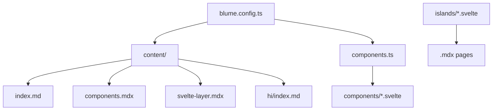
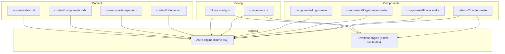
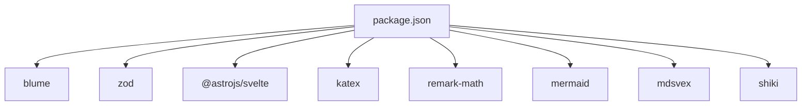
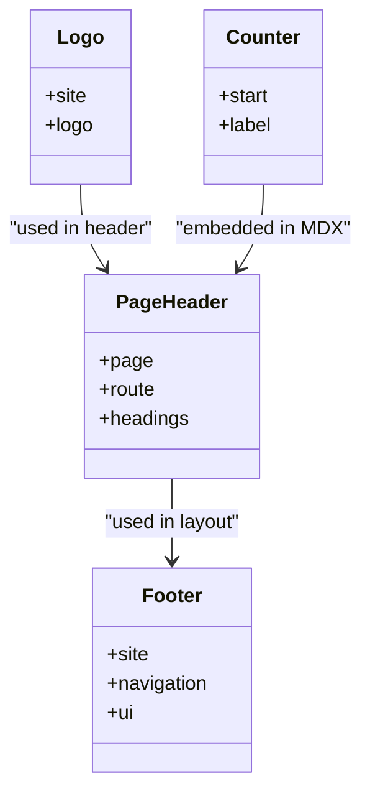
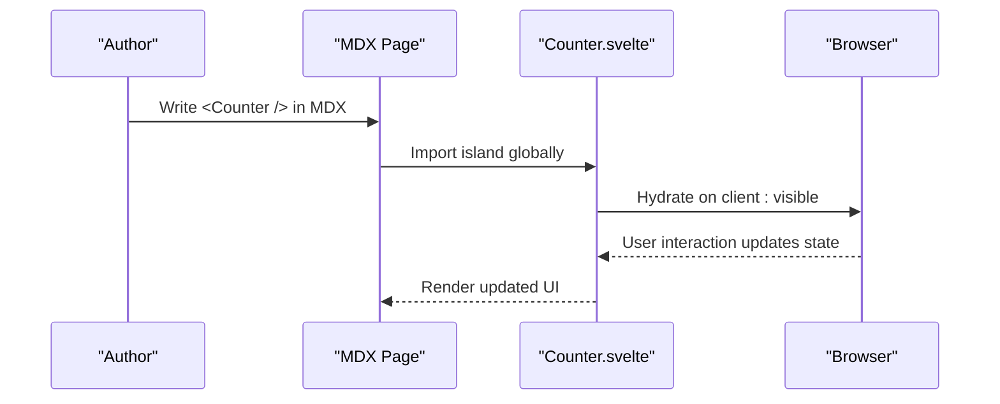

# Content Management

<cite>
**Referenced Files in This Document**
- [blume.config.ts](file://blume.config.ts)
- [components.ts](file://components.ts)
- [README.md](file://README.md)
- [package.json](file://package.json)
- [content/index.md](file://content/index.md)
- [content/components.mdx](file://content/components.mdx)
- [content/svelte-layer.mdx](file://content/svelte-layer.mdx)
- [content/hi/index.md](file://content/hi/index.md)
- [components/Footer.svelte](file://components/Footer.svelte)
- [components/Logo.svelte](file://components/Logo.svelte)
- [components/PageHeader.svelte](file://components/PageHeader.svelte)
- [islands/Counter.svelte](file://islands/Counter.svelte)
</cite>

## Table of Contents
1. Introduction
2. Project Structure
3. Core Components
4. Architecture Overview
5. Detailed Component Analysis
6. Dependency Analysis
7. Performance Considerations
8. Troubleshooting Guide
9. Conclusion
10. Appendices

## Introduction
This document explains how FractalWiki manages content with Blume, focusing on file-based organization using Markdown and MDX, frontmatter schema validation via Zod, rich content features (MDX components, KaTeX math, Mermaid diagrams), internationalization with multi-language directories, image/media handling, SEO optimization, search, navigation structures, and programmatic access to content data through Blume’s APIs. It also provides practical examples for creating pages, organizing hierarchies, and building navigation.

## Project Structure
FractalWiki uses a simple, predictable structure:
- blume.config.ts defines site metadata, content root, deployment settings, frontmatter schema, navigation, and i18n locales.
- components.ts maps Blume layout slots to Svelte components.
- content/** contains Markdown (.md) and MDX (.mdx) pages. Multi-language content lives under language-specific subdirectories (e.g., hi).
- islands/*.svelte are interactive components available in MDX without imports.
- components/*.svelte are server-rendered layout overrides.

**Diagram sources**
- [blume.config.ts:1-57](file://blume.config.ts#L1-L57)
- [components.ts:1-27](file://components.ts#L1-L27)
- [content/index.md:1-39](file://content/index.md#L1-L39)
- [content/components.mdx:1-125](file://content/components.mdx#L1-L125)
- [content/svelte-layer.mdx:1-68](file://content/svelte-layer.mdx#L1-L68)
- [content/hi/index.md:1-22](file://content/hi/index.md#L1-L22)

**Section sources**
- [blume.config.ts:1-57](file://blume.config.ts#L1-L57)
- [components.ts:1-27](file://components.ts#L1-L27)
- [README.md:1-124](file://README.md#L1-L124)

## Core Components
Blume powers routing, content collections, markdown/MDX, sidebar, table of contents, search, theming, and more. In this project, the component surface is replaced by Svelte:
- Layout slots (server-rendered, zero JS unless requested): Logo, PageHeader, Footer.
- Islands (hydrated client-side components): Counter and any PascalCase .svelte files placed in islands/.

Key configuration:
- Frontmatter schema extends default fields with tags, related, source, created, updated using Zod.
- Navigation supports tabs and grouped sidebar display.
- i18n supports English and Hindi with separate content directories.

Practical outcomes:
- Pages are plain Markdown or MDX files under content/.
- Rich content is enabled via MDX components, KaTeX math, and Mermaid diagrams.
- Search and navigation are provided out-of-the-box by Blume.

**Section sources**
- [blume.config.ts:14-56](file://blume.config.ts#L14-L56)
- [components.ts:1-27](file://components.ts#L1-L27)
- [README.md:21-124](file://README.md#L21-L124)

## Architecture Overview
The system renders content from Markdown/MDX into static pages with optional client hydration for islands. Blume handles routing, content collection, and rendering; Svelte replaces the component layer.

**Diagram sources**
- [blume.config.ts:1-57](file://blume.config.ts#L1-L57)
- [components.ts:1-27](file://components.ts#L1-L27)
- [content/index.md:1-39](file://content/index.md#L1-L39)
- [content/components.mdx:1-125](file://content/components.mdx#L1-L125)
- [content/svelte-layer.mdx:1-68](file://content/svelte-layer.mdx#L1-L68)
- [content/hi/index.md:1-22](file://content/hi/index.md#L1-L22)

## Detailed Component Analysis

### Frontmatter Schema with Zod
Blume’s frontmatter schema is extended via Zod to enforce types and provide defaults for custom fields:
- tags: array of strings (optional)
- related: array of strings (optional)
- source: string (optional)
- created: coerced string (optional)
- updated: coerced string (optional)

These fields can be used across layouts, navigation, and search to enrich pages.

**Section sources**
- [blume.config.ts:29-37](file://blume.config.ts#L29-L37)

### Internationalization (i18n)
Multi-language support is configured with:
- Default locale: en
- Fallback locale: en
- Locales: English (en) and Hindi (hi)
- Content directories: bare routes for default locale, /hi prefix for Hindi

Example:
- content/index.md serves as the English home page at /.
- content/hi/index.md serves the Hindi home page at /hi.

**Section sources**
- [blume.config.ts:48-55](file://blume.config.ts#L48-L55)
- [content/index.md:1-39](file://content/index.md#L1-L39)
- [content/hi/index.md:1-22](file://content/hi/index.md#L1-L22)

### Rich Content Features: MDX, KaTeX, Mermaid
MDX enables embedding interactive Svelte islands directly in content without imports. The project demonstrates:
- Callouts, cards, tabs, steps, accordion, badges, file tree, columns, frames.
- Mathematical expressions using KaTeX inline ($...$) and block ($$...$$).
- Diagrams using Mermaid code blocks.

Examples:
- Inline math: $E = mc^2$.
- Block math: $$ t = \max(...) $$
- Mermaid diagram: graph LR ...

These features are authored in MDX files and rendered by Blume’s pipeline.

**Section sources**
- [content/components.mdx:101-125](file://content/components.mdx#L101-L125)
- [content/svelte-layer.mdx:1-68](file://content/svelte-layer.mdx#L1-L68)
- [package.json:29-35](file://package.json#L29-L35)

### Image and Media Handling
Images and media are typically placed under public/ and referenced from Markdown/MDX using standard Markdown syntax. Blume serves static assets from public/ automatically. For responsive images, use Markdown image syntax with appropriate paths.

Best practices:
- Place images in public/images/ and reference as .
- Use descriptive alt text for accessibility and SEO.
- Optimize images before publishing to reduce bundle size.

[No sources needed since this section provides general guidance]

### SEO Optimization with Meta Tags
SEO is configured via frontmatter and site-level settings:
- title and description in frontmatter define page-level meta.
- Site-wide title and description are set in blume.config.ts.
- Deployment settings enable absolute canonicals, sitemap, and social cards.

Ensure each page has unique title and description for better indexing.

**Section sources**
- [blume.config.ts:14-27](file://blume.config.ts#L14-L27)
- [content/index.md:1-4](file://content/index.md#L1-L4)
- [content/components.mdx:1-5](file://content/components.mdx#L1-L5)
- [content/svelte-layer.mdx:1-5](file://content/svelte-layer.mdx#L1-L5)

### Search Functionality
Blume includes built-in search powered by its content collections. Pages indexed include those under content/ and their frontmatter fields. Custom fields like tags and related enhance discoverability.

To improve search results:
- Add meaningful tags and descriptions in frontmatter.
- Keep titles concise and descriptive.
- Organize content hierarchically for better grouping.

**Section sources**
- [blume.config.ts:14-27](file://blume.config.ts#L14-L27)
- [content/components.mdx:1-5](file://content/components.mdx#L1-L5)

### Navigation Structures
Navigation is defined in blume.config.ts:
- Tabs: top-level links such as Home.
- Sidebar: grouped display based on content hierarchy.

You can extend navigation by adding more tabs or organizing content folders to reflect desired groupings.

**Section sources**
- [blume.config.ts:39-44](file://blume.config.ts#L39-L44)

### Programmatic Access to Content Data
Blume exposes content collections and utilities:
- Astro-only virtual modules: blume:data and astro:content.
- Svelte slots cannot import these directly; use props or blume/hooks when hydrated.
- Islands can access serialized snapshots via blume/hooks if needed.

For Svelte slots, rely on props passed by Blume (e.g., page, route, headings). When collection data is required, either hydrate the slot and use blume/hooks or keep that slot as .astro.

**Section sources**
- [README.md:88-100](file://README.md#L88-L100)
- [components/PageHeader.svelte:1-18](file://components/PageHeader.svelte#L1-L18)

### Practical Examples

#### Creating a New Page
1. Create a new Markdown or MDX file under content/.
2. Add frontmatter with title, description, and optional tags.
3. Write content using Markdown or embed MDX components.
4. Optionally add an island by placing a PascalCase .svelte file in islands/.

Example references:
- content/index.md shows basic Markdown page structure.
- content/components.mdx demonstrates MDX usage.

**Section sources**
- [content/index.md:1-39](file://content/index.md#L1-L39)
- [content/components.mdx:1-125](file://content/components.mdx#L1-L125)

#### Organizing Content Hierarchies
- Group related pages in subfolders under content/ to create nested navigation.
- Use consistent naming for clarity and SEO.
- Leverage sidebar grouping via folder structure.

[No sources needed since this section provides general guidance]

#### Implementing Navigation
- Define tabs in blume.config.ts for top-level links.
- Rely on content folder structure for sidebar grouping.
- Update navigation labels and paths as content grows.

**Section sources**
- [blume.config.ts:39-44](file://blume.config.ts#L39-L44)

## Dependency Analysis
Blume orchestrates content processing, rendering, and component integration. Key dependencies include:
- blume: core framework for routing, content, and rendering.
- zod: schema validation for frontmatter.
- @astrojs/svelte: enables Svelte components in Astro.
- katex, remark-math: render mathematical expressions.
- mermaid: render diagrams.
- mdsvex: process MDX.
- shiki: syntax highlighting.

**Diagram sources**
- [package.json:16-39](file://package.json#L16-L39)

**Section sources**
- [package.json:1-41](file://package.json#L1-L41)

## Performance Considerations
- Server-rendered layout slots ship no JavaScript by default, improving performance.
- Islands hydrate only when used and can be configured for lazy loading (client:visible, load, idle, only).
- Optimize images and assets to reduce payload size.
- Use tags and structured content to enhance search efficiency.

[No sources needed since this section provides general guidance]

## Troubleshooting Guide
Common issues and resolutions:
- Cannot import blume:data or astro:content in Svelte slots: Use props or blume/hooks when hydrated.
- Island not appearing: Ensure PascalCase filename and placement in islands/.
- Math not rendering: Verify KaTeX dependencies and syntax.
- Diagram not showing: Check Mermaid syntax and dependencies.

**Section sources**
- [README.md:88-100](file://README.md#L88-L100)
- [content/svelte-layer.mdx:12-24](file://content/svelte-layer.mdx#L12-L24)

## Conclusion
FractalWiki leverages Blume for robust content management with Svelte as the component layer. By combining Markdown/MDX, Zod validation, KaTeX, Mermaid, and i18n, it delivers a flexible and performant knowledge base. Follow the guidelines here to create, organize, and optimize content effectively.

[No sources needed since this section summarizes without analyzing specific files]

## Appendices

### Component Relationships

**Diagram sources**
- [components/Logo.svelte:1-50](file://components/Logo.svelte#L1-L50)
- [components/PageHeader.svelte:1-76](file://components/PageHeader.svelte#L1-L76)
- [components/Footer.svelte:1-30](file://components/Footer.svelte#L1-L30)
- [islands/Counter.svelte:1-45](file://islands/Counter.svelte#L1-L45)

### Sequence Diagram: MDX Island Usage

**Diagram sources**
- [content/svelte-layer.mdx:12-24](file://content/svelte-layer.mdx#L12-L24)
- [islands/Counter.svelte:1-45](file://islands/Counter.svelte#L1-L45)