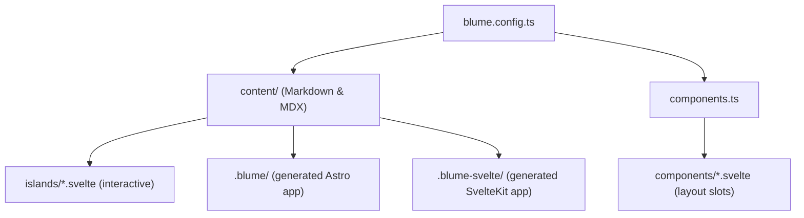
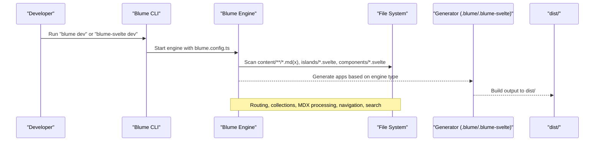
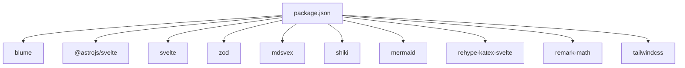

# File Structure and Organization

<cite>
**Referenced Files in This Document**
- [README.md](file://README.md)
- [blume.config.ts](file://blume.config.ts)
- [components.ts](file://components.ts)
- [package.json](file://package.json)
- [content/index.md](file://content/index.md)
- [content/components.mdx](file://content/components.mdx)
- [content/svelte-layer.mdx](file://content/svelte-layer.mdx)
- [content/hi/index.md](file://content/hi/index.md)
- [components/Footer.svelte](file://components/Footer.svelte)
- [components/Logo.svelte](file://components/Logo.svelte)
- [components/PageHeader.svelte](file://components/PageHeader.svelte)
- [islands/Counter.svelte](file://islands/Counter.svelte)
</cite>

## Table of Contents
1. [Introduction](#introduction)
2. [Project Structure](#project-structure)
3. [Core Components](#core-components)
4. [Architecture Overview](#architecture-overview)
5. [Detailed Component Analysis](#detailed-component-analysis)
6. [Dependency Analysis](#dependency-analysis)
7. [Performance Considerations](#performance-considerations)
8. [Troubleshooting Guide](#troubleshooting-guide)
9. [Conclusion](#conclusion)
10. [Appendices](#appendices)

## Introduction
This document explains FractalWiki’s file-based content organization system built on Blume. It focuses on how the content/ folder is structured, how Markdown (.md) and MDX (.mdx) files are organized and processed, how file naming maps to URL routing, and how navigation is generated from the content structure. It also covers best practices for organizing large content libraries and how Blume integrates with the file structure to produce routes, sidebars, and search indexes.

## Project Structure
FractalWiki uses a simple, predictable layout:
- blume.config.ts defines site metadata, content root, frontmatter schema, navigation, and i18n locales.
- components.ts maps Blume layout slots to Svelte components.
- content/** contains all pages. .md files are static; .mdx files can use islands and MDX components.
- islands/*.svelte are interactive components available in any .mdx page without imports.
- components/*.svelte are server-rendered layout overrides.

**Diagram sources**
- [blume.config.ts:14-56](file://blume.config.ts#L14-L56)
- [components.ts:1-27](file://components.ts#L1-L27)
- [README.md:103-111](file://README.md#L103-L111)

**Section sources**
- [README.md:103-111](file://README.md#L103-L111)
- [blume.config.ts:14-56](file://blume.config.ts#L14-L56)
- [components.ts:1-27](file://components.ts#L1-L27)

## Core Components
- Content root: The content directory is configured as the root for pages. All pages live under this folder.
- Frontmatter schema: Custom fields like tags, related, source, created, updated are validated via Zod.
- Navigation: Tabs and sidebar configuration drive the top-level tabs and grouped sidebar display.
- i18n: Default locale is en; additional locales map to subdirectories under content/. For example, content/hi/ produces /hi/* routes.

Key behaviors:
- .md files render as static pages.
- .mdx files enable MDX components and islands usage.
- Islands in islands/ are globally available in .mdx without imports and hydrate by default when visible.
- Layout slots in components.ts replace Blume’s default UI pieces with Svelte components.

**Section sources**
- [blume.config.ts:19-56](file://blume.config.ts#L19-L56)
- [README.md:44-71](file://README.md#L44-L71)
- [README.md:73-86](file://README.md#L73-L86)

## Architecture Overview
Blume owns routing, content collections, markdown/MDX processing, sidebar generation, table of contents, search, theming, and more. In this project, the component surface is swapped to Svelte. Two engines share the same sources:
- Astro engine via blume dev generates .blume/
- SvelteKit engine via blume-svelte dev generates .blume-svelte/

**Diagram sources**
- [README.md:5-17](file://README.md#L5-L17)
- [README.md:21-38](file://README.md#L21-L38)
- [package.json:5-14](file://package.json#L5-L14)

## Detailed Component Analysis

### Content Directory and Routing
- Root pages: Placing index.md at content/ creates the homepage route /.
- Nested directories: Any subdirectory under content/ becomes a path segment. For example, content/svelte-layer.mdx maps to /svelte-layer.
- Internationalization: content/hi/index.md maps to /hi/index (or /hi/). The default locale has no prefix.
- File extensions:
  - .md: Static Markdown pages.
  - .mdx: Pages that can use MDX components and islands.

Examples:
- content/index.md → /
- content/svelte-layer.mdx → /svelte-layer
- content/components.mdx → /components
- content/hi/index.md → /hi

Best practices:
- Use descriptive filenames matching intended URLs.
- Keep index.md per section for clean hierarchical routes.
- Group related pages in nested folders to reflect site structure.

**Section sources**
- [blume.config.ts:19-22](file://blume.config.ts#L19-L22)
- [blume.config.ts:46-55](file://blume.config.ts#L46-L55)
- [content/index.md:1-39](file://content/index.md#L1-L39)
- [content/svelte-layer.mdx:1-68](file://content/svelte-layer.mdx#L1-L68)
- [content/components.mdx:1-125](file://content/components.mdx#L1-L125)
- [content/hi/index.md:1-22](file://content/hi/index.md#L1-L22)

### MDX Processing and Islands
- Islands: Any PascalCase .svelte file in islands/ is automatically available in .mdx pages without imports. Hydration defaults to client:visible unless overridden.
- Props: Pass serializable props through MDX usage.
- Hydration modes: Per-island control via export const client or descriptor form in components.ts.

Usage patterns:
- Drop islands/Counter.svelte and use <Counter /> in any .mdx.
- Configure hydration mode per island for performance.

**Section sources**
- [README.md:73-86](file://README.md#L73-L86)
- [content/svelte-layer.mdx:11-37](file://content/svelte-layer.mdx#L11-L37)
- [islands/Counter.svelte:1-45](file://islands/Counter.svelte#L1-L45)

### Layout Slots and Svelte Components
- Layout slots: Map Blume’s layout placeholders to Svelte components via components.ts.
- Available slots include Logo, PageHeader, Footer, Sidebar, MobileNav, Breadcrumbs, TableOfContents, Pagination, PageFooter, Feedback, Search.
- Server rendering: Layout slots render on the server and ship zero JavaScript unless explicitly requested.

Props passed to slots:
- Logo receives site and logo.
- PageHeader/PageFooter receive page, route, headings.
- Footer receives site, navigation, ui.

Caveat: Astro-only virtual modules cannot be imported in .svelte slots; use props or blume/hooks when hydrated.

**Section sources**
- [components.ts:1-27](file://components.ts#L1-L27)
- [README.md:44-71](file://README.md#L44-L71)
- [components/Logo.svelte:1-50](file://components/Logo.svelte#L1-L50)
- [components/PageHeader.svelte:1-76](file://components/PageHeader.svelte#L1-L76)
- [components/Footer.svelte:1-30](file://components/Footer.svelte#L1-L30)

### Frontmatter Schema and Collections
- Extended frontmatter fields: tags, related, source, created, updated are defined with Zod schemas.
- Collections: Blume scans content/** for pages and builds collections used for search, sidebar, and navigation.

Recommendations:
- Use tags for categorization and filtering.
- Maintain related links to connect pages.
- Track source and timestamps for provenance and updates.

**Section sources**
- [blume.config.ts:29-37](file://blume.config.ts#L29-L37)
- [content/index.md:1-4](file://content/index.md#L1-L4)
- [content/components.mdx:1-5](file://content/components.mdx#L1-L5)
- [content/svelte-layer.mdx:1-5](file://content/svelte-layer.mdx#L1-L5)

### Navigation Generation
- Tabs: Define top-level tabs with label and path.
- Sidebar: Display mode set to group organizes sections hierarchically based on content structure.
- i18n: Locale prefixes affect routes; default locale remains unprefixed.

Example:
- tabs: Home → "/"
- sidebar.display: "group" → groups pages by folder hierarchy.

**Section sources**
- [blume.config.ts:39-44](file://blume.config.ts#L39-L44)
- [blume.config.ts:46-55](file://blume.config.ts#L46-L55)

## Dependency Analysis
The project’s dependencies and their roles:
- blume: Core framework providing routing, content collections, markdown/MDX, navigation, search, theming.
- @astrojs/svelte: Enables Svelte components within the Astro-generated app.
- svelte: Framework for islands and layout slots.
- zod: Validates frontmatter schema.
- mdsvex: Processes MDX content.
- shiki: Syntax highlighting.
- mermaid: Diagram support in MDX.
- rehype-katex-svelte and remark-math: Math rendering.
- tailwindcss: Styling utilities.

**Diagram sources**
- [package.json:16-39](file://package.json#L16-L39)

**Section sources**
- [package.json:16-39](file://package.json#L16-L39)

## Performance Considerations
- Islands hydration: Default to client:visible to minimize initial JS payload. Use load/idle/only selectively.
- Layout slots: Render on the server; avoid unnecessary client-side logic unless required.
- MDX components: Only include components used in pages to reduce bundle size.
- Search and TOC: Generated once during build; ensure content structure supports efficient indexing.

[No sources needed since this section provides general guidance]

## Troubleshooting Guide
Common issues and resolutions:
- Island not found in .mdx: Ensure the file name is PascalCase and located in islands/.
- Slot not rendering: Verify registration in components.ts and correct slot name.
- Astro-only modules in .svelte: Use props or blume/hooks instead of importing Astro virtual modules directly.
- Route mismatch: Confirm file placement under content/ matches expected URL path.

**Section sources**
- [README.md:87-99](file://README.md#L87-L99)
- [components.ts:10-19](file://components.ts#L10-L19)
- [content/svelte-layer.mdx:11-24](file://content/svelte-layer.mdx#L11-L24)

## Conclusion
FractalWiki leverages Blume’s robust content engine with a Svelte component layer. The content/ folder drives routing, navigation, and collections. .md files provide static pages, while .mdx enables interactive islands and MDX components. By following the conventions outlined here, you can scale your content library efficiently and maintain clear URL structures and navigation.

[No sources needed since this section summarizes without analyzing specific files]

## Appendices

### Creating New Pages
- Add a new .md or .mdx file under content/.
- For nested routes, create a subdirectory and place an index.md inside it.
- Use frontmatter to set title, description, and custom fields like tags.

**Section sources**
- [README.md:113-124](file://README.md#L113-L124)
- [blume.config.ts:29-37](file://blume.config.ts#L29-L37)

### Organizing Large Content Libraries
- Group related pages into folders to reflect site hierarchy.
- Use consistent naming for clarity and SEO.
- Leverage tags and related fields to enhance discoverability.
- Maintain separate locales under dedicated subdirectories.

**Section sources**
- [blume.config.ts:46-55](file://blume.config.ts#L46-L55)
- [content/index.md:28-38](file://content/index.md#L28-L38)

### Blume Processing of File Types
- .md: Processed as static Markdown pages.
- .mdx: Processed with MDX, enabling component usage and islands.
- islands/*.svelte: Automatically discovered and made available in .mdx.

**Section sources**
- [README.md:103-111](file://README.md#L103-L111)
- [content/svelte-layer.mdx:11-24](file://content/svelte-layer.mdx#L11-L24)