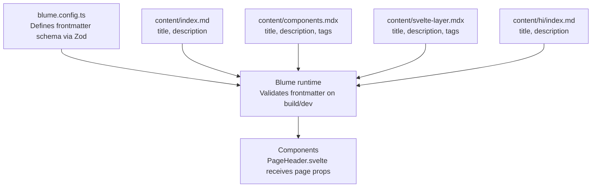
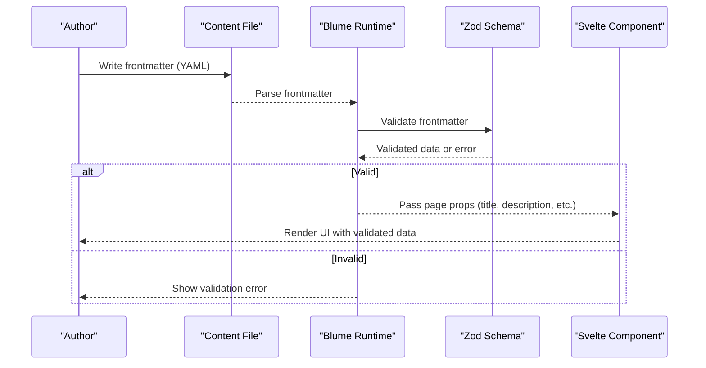
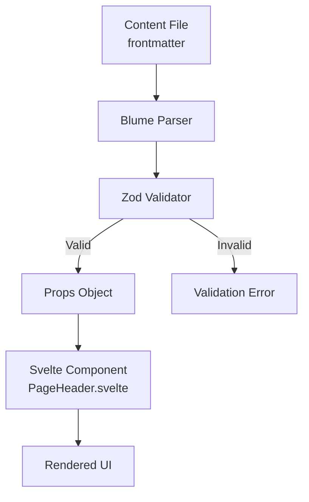
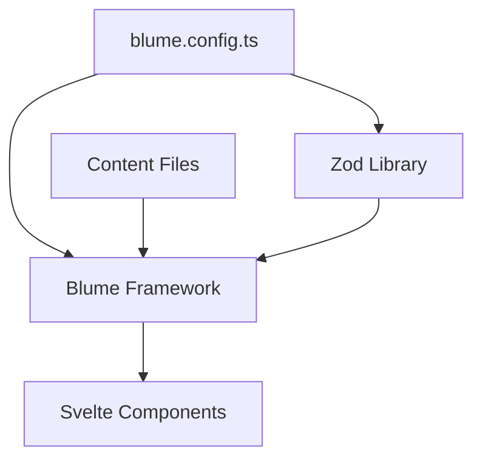

# Frontmatter Schema and Validation

<cite>
**Referenced Files in This Document**
- [blume.config.ts](file://blume.config.ts)
- [README.md](file://README.md)
- [package.json](file://package.json)
- [components.ts](file://components.ts)
- [content/index.md](file://content/index.md)
- [content/components.mdx](file://content/components.mdx)
- [content/svelte-layer.mdx](file://content/svelte-layer.mdx)
- [content/hi/index.md](file://content/hi/index.md)
- [components/PageHeader.svelte](file://components/PageHeader.svelte)
</cite>

## Table of Contents
1. [Introduction](#introduction)
2. [Project Structure](#project-structure)
3. [Core Components](#core-components)
4. [Architecture Overview](#architecture-overview)
5. [Detailed Component Analysis](#detailed-component-analysis)
6. [Dependency Analysis](#dependency-analysis)
7. [Performance Considerations](#performance-considerations)
8. [Troubleshooting Guide](#troubleshooting-guide)
9. [Conclusion](#conclusion)
10. [Appendices](#appendices)

## Introduction
This document explains how FractalWiki defines and validates frontmatter using Zod within Blume’s configuration. It covers:
- Where to define custom frontmatter fields
- Supported data types, validation rules, and defaults
- Built-in frontmatter properties like title and description
- Required vs optional fields and conditional validation patterns
- Error handling for invalid frontmatter
- Practical examples and schema inheritance
- How frontmatter flows through components and pages

The project uses Blume with a Svelte component layer. Frontmatter is defined per page and validated against the schema declared in the site configuration.

## Project Structure
Frontmatter schema and content live in these key locations:
- Site configuration and schema: blume.config.ts
- Content files (pages): content/**/*.md(x)
- Layout slots that consume page metadata: components/*.svelte
- Documentation and scripts: README.md, package.json

**Diagram sources**
- [blume.config.ts:29-37](file://blume.config.ts#L29-L37)
- [content/index.md:1-4](file://content/index.md#L1-L4)
- [content/components.mdx:1-5](file://content/components.mdx#L1-L5)
- [content/svelte-layer.mdx:1-5](file://content/svelte-layer.mdx#L1-L5)
- [content/hi/index.md:1-4](file://content/hi/index.md#L1-L4)
- [components/PageHeader.svelte:10-17](file://components/PageHeader.svelte#L10-L17)

**Section sources**
- [blume.config.ts:1-57](file://blume.config.ts#L1-L57)
- [README.md:101-111](file://README.md#L101-L111)
- [package.json:16-19](file://package.json#L16-L19)

## Core Components
- Frontmatter schema definition: The schema is extended under frontmatter.extend in blume.config.ts using Zod validators.
- Built-in fields: title and description are used across pages and consumed by layout slots.
- Custom fields: tags, related, source, created, updated are defined as optional fields with appropriate types.

Key implementation points:
- Use z.string(), z.array(z.string()), and z.coerce.string() to enforce types and coerce values when needed.
- Mark fields as optional with .optional() to allow missing values without failing validation.
- Default values can be applied at the schema level or during consumption in components.

**Section sources**
- [blume.config.ts:29-37](file://blume.config.ts#L29-L37)
- [content/index.md:1-4](file://content/index.md#L1-L4)
- [content/components.mdx:1-5](file://content/components.mdx#L1-L5)
- [content/svelte-layer.mdx:1-5](file://content/svelte-layer.mdx#L1-L5)
- [content/hi/index.md:1-4](file://content/hi/index.md#L1-L4)

## Architecture Overview
Frontmatter flows from content files into Blume’s runtime, which validates it against the Zod schema defined in blume.config.ts. Validated data is then passed to components as props.

**Diagram sources**
- [blume.config.ts:29-37](file://blume.config.ts#L29-L37)
- [components/PageHeader.svelte:10-17](file://components/PageHeader.svelte#L10-L17)

## Detailed Component Analysis

### Frontmatter Schema Definition
- Location: blume.config.ts under frontmatter.extend
- Purpose: Extend default frontmatter with custom fields and validation rules
- Validators used:
  - z.array(z.string()) for lists like tags and related
  - z.string() for simple text fields like source
  - z.coerce.string() for date-like strings that may need coercion
  - .optional() to make fields optional

Example field definitions:
- tags: array of strings, optional
- related: array of strings, optional
- source: string, optional
- created: coerced string, optional
- updated: coerced string, optional

These fields are available to all pages and can be consumed in components or templates.

**Section sources**
- [blume.config.ts:29-37](file://blume.config.ts#L29-L37)

### Built-in Frontmatter Properties
- title: Used across pages and displayed in layouts
- description: Used for SEO and page summaries
- Both are commonly present in content files and consumed by layout components

Examples in content:
- index.md includes title and description
- components.mdx includes title, description, and tags
- svelte-layer.mdx includes title, description, and tags
- hi/index.md includes localized title and description

**Section sources**
- [content/index.md:1-4](file://content/index.md#L1-L4)
- [content/components.mdx:1-5](file://content/components.mdx#L1-L5)
- [content/svelte-layer.mdx:1-5](file://content/svelte-layer.mdx#L1-L5)
- [content/hi/index.md:1-4](file://content/hi/index.md#L1-L4)

### Data Flow Through Components
Layout slots receive page data as props. For example, PageHeader.svelte receives:
- page: object containing title, description, route
- headings: extracted section headings for navigation

This demonstrates how frontmatter data flows from content files into Svelte components.

**Diagram sources**
- [components/PageHeader.svelte:10-17](file://components/PageHeader.svelte#L10-L17)

**Section sources**
- [components/PageHeader.svelte:10-17](file://components/PageHeader.svelte#L10-L17)

### Conditional Validation Patterns
While the current schema uses optional fields, you can implement conditional validation using Zod features:
- z.preprocess() to transform values before validation
- z.refine() for custom validation logic
- z.when() for conditional schemas based on other fields
- z.union() for multiple valid formats

For example, you could require a source URL only when a certain tag is present, or validate date formats more strictly.

### Schema Inheritance
Blume’s frontmatter.extend merges your custom schema with built-in defaults. This means:
- Built-in fields like title and description remain available
- Your custom fields are added to the validated interface
- You can override or extend existing behavior if needed

### Error Handling for Invalid Frontmatter
When frontmatter fails validation:
- Blume reports errors during development and build
- Errors include field names and expected types
- Fix the frontmatter to match the schema definition

Common issues:
- Missing required fields (if not marked optional)
- Incorrect data types (e.g., number instead of string)
- Invalid array formats

**Section sources**
- [blume.config.ts:29-37](file://blume.config.ts#L29-L37)

## Dependency Analysis
The frontmatter system depends on:
- Blume framework for content processing and schema validation
- Zod library for type validation and schema definition
- Svelte components for rendering validated data

**Diagram sources**
- [blume.config.ts:1-2](file://blume.config.ts#L1-L2)
- [package.json:16-19](file://package.json#L16-L19)

**Section sources**
- [package.json:16-19](file://package.json#L16-L19)
- [blume.config.ts:1-2](file://blume.config.ts#L1-L2)

## Performance Considerations
- Frontmatter validation occurs during build and development
- Keep schemas simple to minimize validation overhead
- Use optional fields where appropriate to avoid unnecessary validation
- Coercion (z.coerce.string()) adds minimal overhead but enables flexible input

## Troubleshooting Guide
Common schema validation errors and solutions:

1. **Missing required fields**
   - Ensure all non-optional fields are present in frontmatter
   - Check field names match exactly (case-sensitive)

2. **Type mismatches**
   - Verify data types match schema definitions
   - Use proper array syntax for list fields
   - Check date formats for coerced string fields

3. **Invalid array formats**
   - Ensure arrays contain correct element types
   - Check for nested structures if using complex schemas

4. **Conditional validation failures**
   - Review custom validation logic in refine() functions
   - Check prerequisite conditions for conditional fields

Debugging techniques:
- Run development server to see real-time validation errors
- Check console output for detailed error messages
- Temporarily simplify schema to isolate issues
- Use console.log in components to inspect received props

**Section sources**
- [blume.config.ts:29-37](file://blume.config.ts#L29-L37)

## Conclusion
FractalWiki’s frontmatter system provides robust validation through Zod while maintaining simplicity. The schema extension approach allows for flexible customization while preserving built-in functionality. By following the patterns outlined in this document, you can create reliable, type-safe frontmatter definitions that enhance content authoring experience and application stability.

## Appendices

### Common Frontmatter Patterns

#### Basic Fields
- title: string (required by default)
- description: string (optional)
- tags: array of strings (optional)

#### Metadata Fields
- source: string URL (optional)
- created: date string (optional, coerced)
- updated: date string (optional, coerced)
- related: array of related page identifiers (optional)

#### Advanced Patterns
- Conditional requirements using z.when()
- Custom validation with z.refine()
- Union types for multiple valid formats
- Nested objects for complex metadata

### Best Practices
- Always mark optional fields with .optional()
- Use descriptive field names that reflect their purpose
- Provide sensible defaults where possible
- Document custom fields in your content guidelines
- Test schema changes with sample content

### Migration Guide
When updating schemas:
1. Update blume.config.ts with new validation rules
2. Test with existing content files
3. Update any components that consume the fields
4. Document breaking changes for content authors