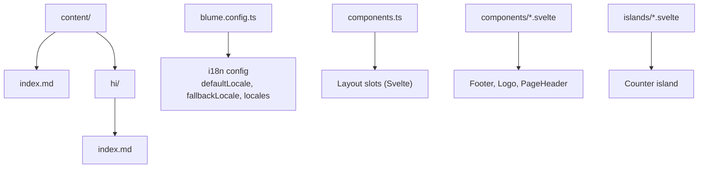
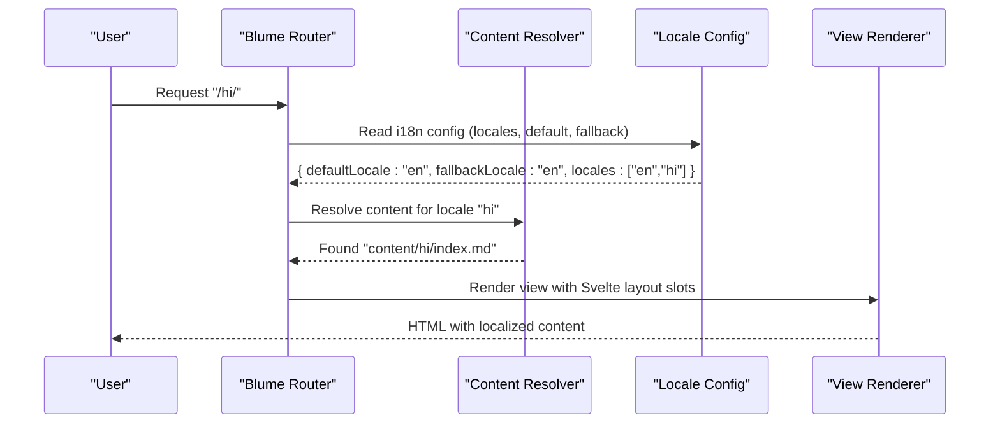
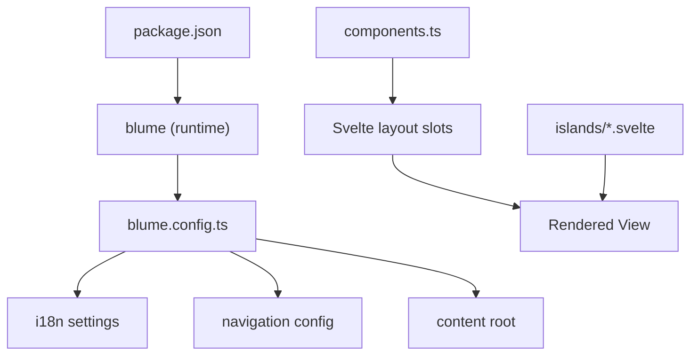

# Internationalization (i18n)

<cite>
**Referenced Files in This Document**
- [blume.config.ts](file://blume.config.ts)
- [README.md](file://README.md)
- [content/index.md](file://content/index.md)
- [content/hi/index.md](file://content/hi/index.md)
- [components.ts](file://components.ts)
- [components/Footer.svelte](file://components/Footer.svelte)
- [components/Logo.svelte](file://components/Logo.svelte)
- [components/PageHeader.svelte](file://components/PageHeader.svelte)
- [islands/Counter.svelte](file://islands/Counter.svelte)
- [package.json](file://package.json)
</cite>

## Table of Contents
1. [Introduction](#introduction)
2. [Project Structure](#project-structure)
3. [Core Components](#core-components)
4. [Architecture Overview](#architecture-overview)
5. [Detailed Component Analysis](#detailed-component-analysis)
6. [Dependency Analysis](#dependency-analysis)
7. [Performance Considerations](#performance-considerations)
8. [Troubleshooting Guide](#troubleshooting-guide)
9. [Conclusion](#conclusion)
10. [Appendices](#appendices)

## Introduction
This document explains how FractalWiki uses Blume’s built-in internationalization to serve multi-language content with locale-specific directories and URL routing. It covers configuration, content organization patterns, translation workflows, and best practices for maintaining consistency across large multilingual libraries. The site demonstrates two locales: English (default, no prefix) and Hindi (prefixed route).

## Project Structure
FractalWiki organizes localized content by placing each language under a dedicated directory inside the content root. The default locale is served from bare routes; other locales are served under a prefixed path.

**Diagram sources**
- [blume.config.ts:19-56](file://blume.config.ts#L19-L56)
- [content/index.md:1-39](file://content/index.md#L1-L39)
- [content/hi/index.md:1-22](file://content/hi/index.md#L1-L22)
- [components.ts:1-27](file://components.ts#L1-L27)
- [components/Footer.svelte:1-30](file://components/Footer.svelte#L1-L30)
- [components/Logo.svelte:1-50](file://components/Logo.svelte#L1-L50)
- [components/PageHeader.svelte:1-76](file://components/PageHeader.svelte#L1-L76)
- [islands/Counter.svelte:1-45](file://islands/Counter.svelte#L1-L45)

**Section sources**
- [blume.config.ts:19-56](file://blume.config.ts#L19-L56)
- [content/index.md:1-39](file://content/index.md#L1-L39)
- [content/hi/index.md:1-22](file://content/hi/index.md#L1-L22)
- [components.ts:1-27](file://components.ts#L1-L27)

## Core Components
Blume’s i18n is configured in a single file. The configuration declares supported locales, default and fallback behavior, and maps code labels for UI. Content lives under the content root, with one subdirectory per non-default locale.

Key behaviors:
- Default locale has no URL prefix.
- Non-default locales are served under a prefixed route.
- Fallback locale is used when a page is missing in the requested locale.

**Section sources**
- [blume.config.ts:46-56](file://blume.config.ts#L46-L56)
- [content/index.md:1-39](file://content/index.md#L1-L39)
- [content/hi/index.md:18-22](file://content/hi/index.md#L18-L22)

## Architecture Overview
The i18n architecture centers on Blume’s configuration and content directory structure. Routing and rendering are handled by Blume; Svelte components provide layout and interactive islands.

**Diagram sources**
- [blume.config.ts:46-56](file://blume.config.ts#L46-L56)
- [content/hi/index.md:1-22](file://content/hi/index.md#L1-L22)
- [components.ts:1-27](file://components.ts#L1-L27)

## Detailed Component Analysis

### Locale Configuration (blume.config.ts)
- Declares default and fallback locales.
- Lists available locales with codes and display labels.
- Sets the content root to “content”.
- Defines navigation tabs and sidebar grouping.

Implications:
- Default locale routes have no prefix.
- Non-default locale routes include a prefix segment.
- Missing pages fall back to the configured fallback locale.

**Section sources**
- [blume.config.ts:19-22](file://blume.config.ts#L19-L22)
- [blume.config.ts:39-44](file://blume.config.ts#L39-L44)
- [blume.config.ts:46-56](file://blume.config.ts#L46-L56)

### Content Organization Patterns
- English (default): content/index.md serves the root route.
- Hindi: content/hi/index.md serves the /hi route.
- Shared content can be placed outside locale folders and referenced via relative links or shared components.

Best practices:
- Mirror page structure across locales for consistent routing.
- Keep shared assets and components outside locale folders.
- Use frontmatter consistently across locales for metadata.

**Section sources**
- [content/index.md:1-39](file://content/index.md#L1-L39)
- [content/hi/index.md:1-22](file://content/hi/index.md#L1-L22)

### Layout Slots and Islands (Svelte)
- Layout slots (Logo, PageHeader, Footer) are server-rendered Svelte components mapped in components.ts.
- Islands (e.g., Counter) are client-hydrated components usable in MDX without imports.
- These components receive props from Blume and do not directly access i18n state unless using hooks.

Note:
- For dynamic localization in components, use Blume’s hooks when hydration is required.

**Section sources**
- [components.ts:1-27](file://components.ts#L1-L27)
- [components/Footer.svelte:1-30](file://components/Footer.svelte#L1-L30)
- [components/Logo.svelte:1-50](file://components/Logo.svelte#L1-L50)
- [components/PageHeader.svelte:1-76](file://components/PageHeader.svelte#L1-L76)
- [islands/Counter.svelte:1-45](file://islands/Counter.svelte#L1-L45)

### Language Switching and Locale-Aware Navigation
- Add a language switcher component that navigates to the same page path under the target locale.
- For the default locale, omit the prefix; for others, include the locale prefix.
- Preserve query parameters and fragments when switching languages.
- Optionally persist user preference in cookies or local storage.

Implementation guidance:
- Build links programmatically based on current route and target locale.
- Ensure accessibility with proper aria-labels and keyboard navigation.

[No sources needed since this section provides general implementation guidance]

### Dynamic Content Localization
- Use MDX islands for interactive elements that need runtime localization.
- When accessing collection data or localized strings in Svelte slots, hydrate the slot and read via Blume’s hooks.
- Avoid Astro-only virtual modules in .svelte slots; rely on props or hooks.

**Section sources**
- [components/PageHeader.svelte:5-7](file://components/PageHeader.svelte#L5-L7)
- [README.md:89-97](file://README.md#L89-L97)

## Dependency Analysis
Blume orchestrates routing, content resolution, and rendering. Svelte components are wired through components.ts. The build tooling supports both Astro and SvelteKit engines.

**Diagram sources**
- [package.json:16-18](file://package.json#L16-L18)
- [blume.config.ts:19-56](file://blume.config.ts#L19-L56)
- [components.ts:1-27](file://components.ts#L1-L27)

**Section sources**
- [package.json:16-18](file://package.json#L16-L18)
- [blume.config.ts:19-56](file://blume.config.ts#L19-L56)
- [components.ts:1-27](file://components.ts#L1-L27)

## Performance Considerations
- Keep layout slots static (no JS) unless interactivity is required.
- Use islands only where necessary; prefer server-rendered content for SEO and initial load performance.
- Minimize hydration scope to reduce bundle size.
- Leverage Blume’s built-in caching and static generation for localized pages.

[No sources needed since this section provides general guidance]

## Troubleshooting Guide
Common issues and resolutions:
- Missing localized page: Verify the file exists under the correct locale folder and matches the expected path.
- Incorrect route prefix: Confirm the locale is non-default and should be prefixed.
- Fallback behavior: Check fallbackLocale configuration and ensure the fallback page exists.
- Svelte slot limitations: Remember Astro-only virtual modules cannot be imported in .svelte slots; use props or hooks.

**Section sources**
- [blume.config.ts:46-56](file://blume.config.ts#L46-L56)
- [content/index.md:1-39](file://content/index.md#L1-L39)
- [content/hi/index.md:18-22](file://content/hi/index.md#L18-L22)
- [README.md:89-97](file://README.md#L89-L97)

## Conclusion
FractalWiki’s i18n leverages Blume’s configuration-driven approach to deliver clean, predictable routing for multiple locales. By organizing content into locale-specific directories and using Svelte for layout and interactivity, teams can maintain consistent translations while keeping performance high. Adopting the recommended patterns ensures scalable multilingual growth and easier maintenance.

[No sources needed since this section summarizes without analyzing specific files]

## Appendices

### Best Practices for Translation Consistency
- Standardize frontmatter fields across locales.
- Maintain parallel page structures to simplify synchronization.
- Use automated checks to detect missing translations.
- Centralize shared strings and UI labels in reusable components or hooks.

[No sources needed since this section provides general guidance]

### Managing Large Multilingual Libraries
- Split content into logical sections and reuse shared components.
- Employ version control strategies (per-locale branches or PR templates).
- Integrate translation management tools with CI pipelines.
- Monitor coverage reports to identify untranslated pages.

[No sources needed since this section provides general guidance]