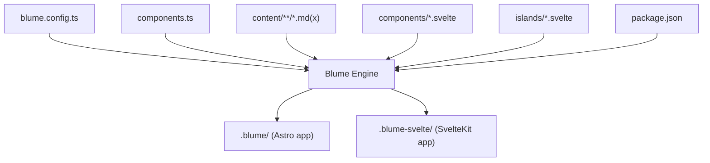
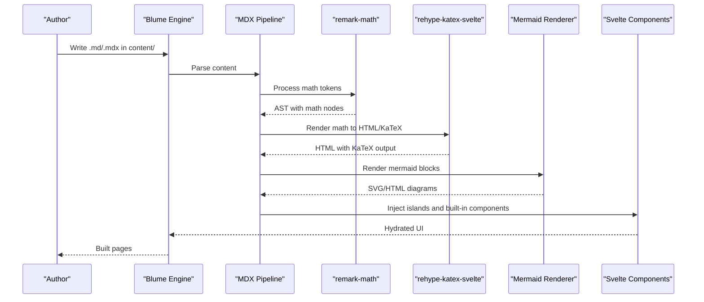
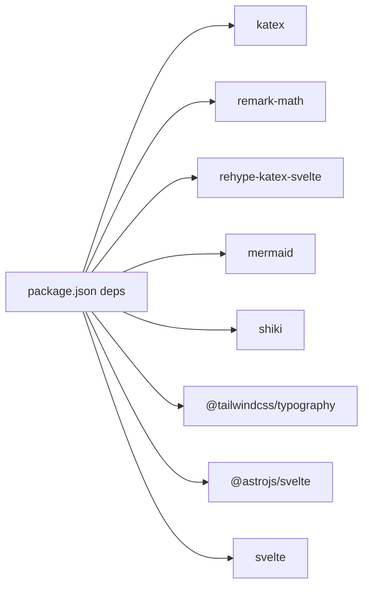

# Rich Content Features

<cite>
**Referenced Files in This Document**
- [README.md](file://README.md)
- [blume.config.ts](file://blume.config.ts)
- [components.ts](file://components.ts)
- [package.json](file://package.json)
- [content/components.mdx](file://content/components.mdx)
- [content/svelte-layer.mdx](file://content/svelte-layer.mdx)
- [content/index.md](file://content/index.md)
- [islands/Counter.svelte](file://islands/Counter.svelte)
</cite>

## Table of Contents
1. [Introduction](#introduction)
2. [Project Structure](#project-structure)
3. [Core Components](#core-components)
4. [Architecture Overview](#architecture-overview)
5. [Detailed Component Analysis](#detailed-component-analysis)
6. [Dependency Analysis](#dependency-analysis)
7. [Performance Considerations](#performance-considerations)
8. [Troubleshooting Guide](#troubleshooting-guide)
9. [Conclusion](#conclusion)
10. [Appendices](#appendices)

## Introduction
This document explains FractalWiki’s rich content capabilities powered by Blume and Svelte. It covers MDX integration with JSX-like components, mathematical expressions via KaTeX, diagram rendering with Mermaid, code syntax highlighting, table formatting, advanced typography, interactive component embedding, complex layouts, performance optimization, browser compatibility, and fallback strategies. The site uses a single source tree to run on two engines (Astro and SvelteKit), while keeping the same content and configuration.

## Project Structure
FractalWiki organizes content under content/, layout overrides under components/*.svelte, and interactive islands under islands/*.mdx pages can import islands directly without explicit imports. Configuration is centralized in blume.config.ts, and component mapping is defined in components.ts. Dependencies for rich content features are declared in package.json.



**Diagram sources**
- [blume.config.ts:14-56](file://blume.config.ts#L14-L56)
- [components.ts:20-26](file://components.ts#L20-L26)
- [package.json:16-39](file://package.json#L16-L39)

**Section sources**
- [README.md:1-124](file://README.md#L1-L124)
- [blume.config.ts:14-56](file://blume.config.ts#L14-L56)
- [components.ts:20-26](file://components.ts#L20-L26)
- [package.json:16-39](file://package.json#L16-L39)

## Core Components
- Layout slots: Logo, PageHeader, Footer are Svelte components registered in components.ts and rendered server-side with zero JavaScript unless explicitly hydrated.
- Islands: Any PascalCase .svelte file in islands/ becomes globally available in .mdx pages with no import. Default hydration is client:visible; modes include load, idle, only.
- Content: Markdown and MDX files live under content/. MDX supports JSX-like components from Blume’s library rewritten in Svelte.

Key behaviors:
- Server-rendered layout slots ship no JS by default.
- Islands hydrate on demand and only where used.
- Props must be serializable for islands.

**Section sources**
- [README.md:40-86](file://README.md#L40-L86)
- [components.ts:20-26](file://components.ts#L20-L26)
- [content/svelte-layer.mdx:11-37](file://content/svelte-layer.mdx#L11-L37)
- [islands/Counter.svelte:1-45](file://islands/Counter.svelte#L1-L45)

## Architecture Overview
Blume orchestrates routing, content collections, markdown/MDX processing, sidebar, TOC, search, theming, and deployment metadata. In this project, Svelte replaces Astro as the component layer. The MDX pipeline integrates remark and rehype plugins for math and slugs, Shiki for syntax highlighting, and Mermaid for diagrams.



**Diagram sources**
- [package.json:29-35](file://package.json#L29-L35)
- [content/components.mdx:101-118](file://content/components.mdx#L101-L118)

**Section sources**
- [README.md:21-33](file://README.md#L21-L33)
- [package.json:29-35](file://package.json#L29-L35)

## Detailed Component Analysis

### MDX Integration and JSX-like Components
- MDX pages can use Blume’s built-in components without imports. Examples include Callout, CardGroup/Card, Tabs/TabsItem, Steps/Step, Accordion/AccordionItem, Expandable, Badge, FileTree, Columns/Column, Frame.
- These components are rewritten in Svelte but maintain the same prop contracts as Blume’s original Astro components.

Practical usage patterns:
- Nesting components inside each other (e.g., CardGroup containing Cards).
- Using tabs to present alternative instructions or outputs.
- Building step-by-step guides and collapsible sections.

**Section sources**
- [content/components.mdx:1-125](file://content/components.mdx#L1-L125)

### Mathematical Expressions with KaTeX
- Inline math uses $...$ delimiters.
- Block equations use $$...$$ delimiters.
- Rendering is handled by remark-math and rehype-katex-svelte, producing accessible HTML with KaTeX styling.

Examples demonstrated in content:
- Inline equation example.
- Block equation example.

Best practices:
- Keep inline math concise to avoid layout shifts.
- Use block equations for complex formulas to improve readability.
- Ensure KaTeX CSS is included (provided by Blume’s pipeline).

**Section sources**
- [content/components.mdx:101-109](file://content/components.mdx#L101-L109)
- [package.json:29-34](file://package.json#L29-L34)

### Diagram Rendering with Mermaid
- Mermaid code blocks render flowcharts, sequence diagrams, and more.
- Syntax: ```mermaid
...
```.
- Rendering is performed at build time and embedded into the page.

Example demonstrated:
- A simple graph showing content → mdsvex → SvelteKit → dist.

Guidelines:
- Prefer lightweight diagrams for performance.
- Avoid overly large graphs that increase bundle size.
- Test cross-browser rendering since Mermaid relies on SVG and DOM APIs.

**Section sources**
- [content/components.mdx:111-118](file://content/components.mdx#L111-L118)
- [package.json:31](file://package.json#L31)

### Code Syntax Highlighting
- Syntax highlighting is provided by Shiki.
- Use fenced code blocks with language identifiers (e.g., ```sh, ```ts, ```js).
- Highlights are applied during build-time processing.

Recommendations:
- Specify languages consistently for optimal highlighting.
- Keep code snippets focused to reduce payload.

**Section sources**
- [package.json:35](file://package.json#L35)
- [content/components.mdx:38-53](file://content/components.mdx#L38-L53)

### Table Formatting
- Standard Markdown tables are supported and styled by Blume’s theme.
- Use pipes and dashes to define columns and headers.
- Tables integrate with the site’s typography and responsive design.

Tips:
- Keep column widths reasonable for mobile readability.
- Avoid excessive nested elements within table cells.

**Section sources**
- [content/index.md:28-36](file://content/index.md#L28-L36)

### Advanced Typography
- Tailwind Typography plugin provides consistent prose styles for headings, paragraphs, lists, and links.
- Theme tokens (CSS custom properties) ensure light/dark mode consistency across components.

Usage:
- Rely on Blume’s default prose classes for content bodies.
- Customize theme tokens in theme.css and reference them in Svelte components.

**Section sources**
- [package.json:25](file://package.json#L25)
- [README.md:120-124](file://README.md#L120-L124)

### Embedding Interactive Components (Islands)
- Place any PascalCase .svelte file in islands/ to make it globally available in .mdx.
- Default hydration is client:visible; you can set export const client = "load" | "idle" | "only".
- Props must be serializable.

Example:
- Counter island demonstrates stateful interaction with props start and label.

Hydration modes:
- visible: hydrate when scrolled into view (default).
- load: hydrate immediately.
- idle: hydrate on idle.
- only: client-only, never server-rendered.

**Section sources**
- [content/svelte-layer.mdx:11-37](file://content/svelte-layer.mdx#L11-L37)
- [islands/Counter.svelte:1-45](file://islands/Counter.svelte#L1-L45)

### Creating Complex Layouts
- Combine built-in components like CardGroup, Columns, Tabs, and Frame to build rich layouts.
- Use responsive props (e.g., cols) to adapt to different screen sizes.
- Leverage theme tokens for consistent styling.

Patterns:
- Two-column layouts with Columns.
- Tabbed interfaces for multi-option instructions.
- Framed sections for callouts or examples.

**Section sources**
- [content/components.mdx:25-99](file://content/components.mdx#L25-L99)

## Dependency Analysis
Rich content features depend on specific packages integrated through Blume’s pipeline:
- Math: remark-math and rehype-katex-svelte with katex.
- Diagrams: mermaid.
- Syntax highlighting: shiki.
- Typography: @tailwindcss/typography.
- Svelte integration: @astrojs/svelte and svelte.



**Diagram sources**
- [package.json:25-35](file://package.json#L25-L35)

**Section sources**
- [package.json:25-35](file://package.json#L25-L35)

## Performance Considerations
- Islands hydrate on demand; prefer client:visible to defer non-critical interactivity.
- Use only for components requiring window/document access to avoid SSR mismatches.
- Keep Mermaid diagrams minimal to reduce SVG payload.
- Limit inline math complexity; prefer block equations for heavy formulas.
- Avoid unnecessary dependencies in islands to keep per-page JS small.
- Leverage static layout slots to ship zero JS where possible.

[No sources needed since this section provides general guidance]

## Troubleshooting Guide
Common issues and resolutions:
- Math not rendering: Ensure remark-math and rehype-katex-svelte are installed and KaTeX CSS is available. Verify delimiters ($...$, $$...$$).
- Mermaid diagrams blank: Check browser console for errors; confirm mermaid is loaded and the block syntax is correct.
- Islands not hydrating: Verify client mode and that props are serializable. For window/document access, use client:only.
- Syntax highlighting missing: Confirm language tags in fenced code blocks and that shiki is included.
- Layout slot data access: Remember blume:data and astro:content are Astro-only virtual modules; use props or blume/hooks when hydrated.

**Section sources**
- [README.md:88-99](file://README.md#L88-L99)
- [content/svelte-layer.mdx:25-37](file://content/svelte-layer.mdx#L25-L37)

## Conclusion
FractalWiki delivers a robust rich content experience by combining MDX, KaTeX, Mermaid, Shiki, and Svelte islands within Blume’s framework. Authors can embed interactive components, create complex layouts, and leverage advanced typography while maintaining performance and accessibility. By following best practices for hydration, content structure, and dependency management, teams can optimize both user experience and build efficiency.

[No sources needed since this section summarizes without analyzing specific files]

## Appendices

### Browser Compatibility and Fallback Strategies
- KaTeX: Supported in modern browsers; ensure CSS is loaded. For older browsers, consider polyfills if necessary.
- Mermaid: Relies on SVG and DOM APIs; test on target browsers. Provide static images as fallbacks for critical diagrams if needed.
- Islands: If client-side features fail, degrade gracefully by ensuring server-rendered content remains usable.
- Syntax highlighting: Falls back to plain text if highlighting fails; verify shiki inclusion.

[No sources needed since this section provides general guidance]