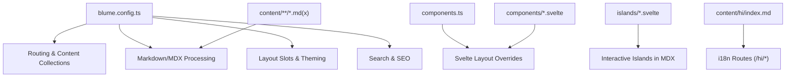
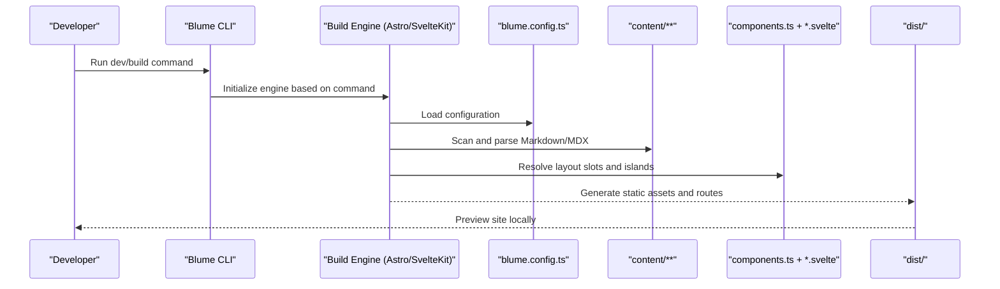
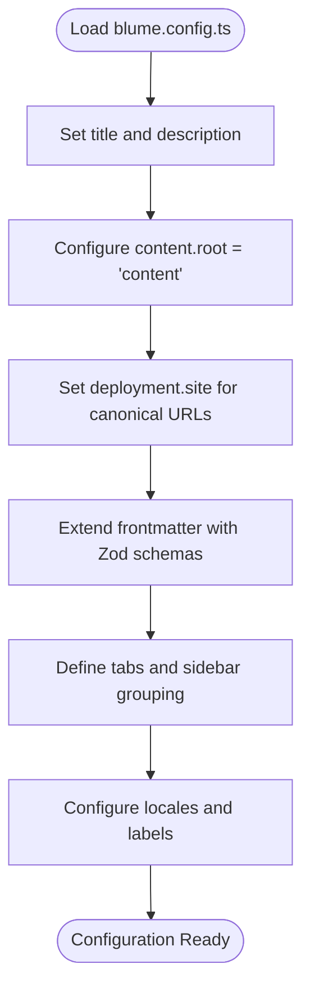
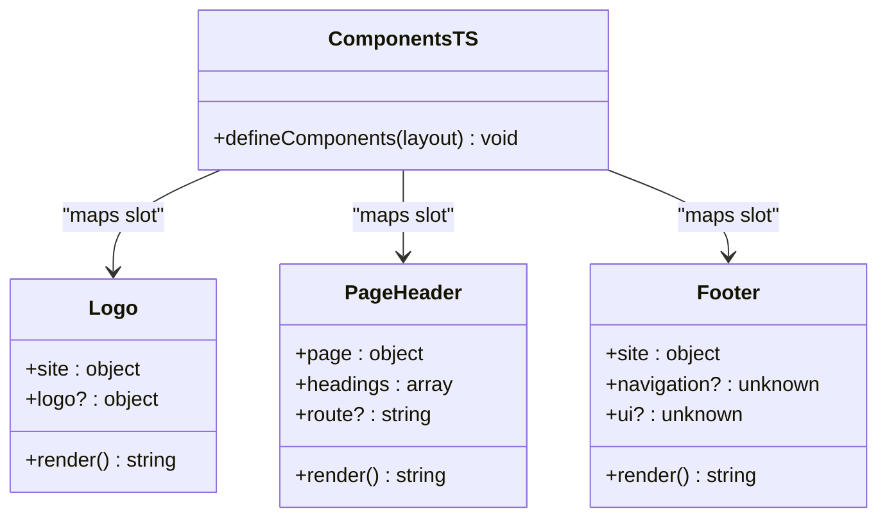
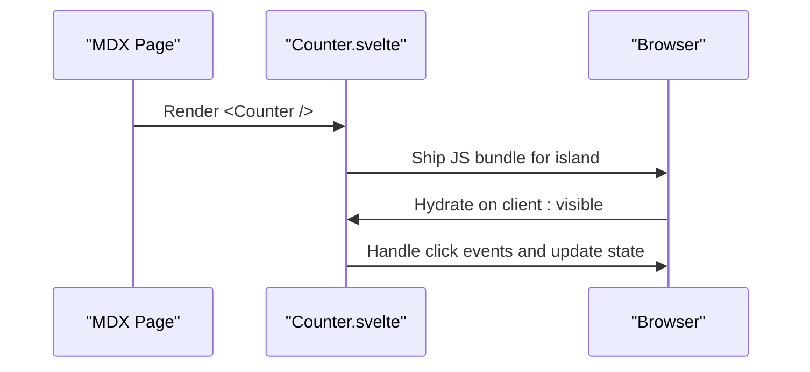
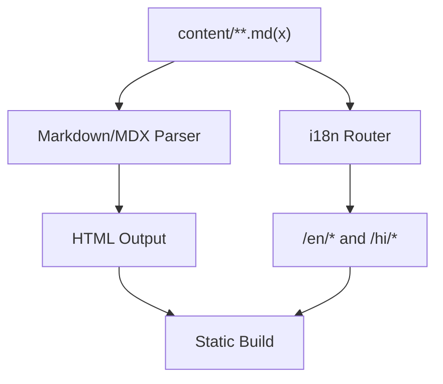
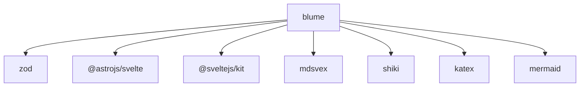

# Blume Foundation

<cite>
**Referenced Files in This Document**
- [blume.config.ts](file://blume.config.ts)
- [components.ts](file://components.ts)
- [README.md](file://README.md)
- [package.json](file://package.json)
- [content/index.md](file://content/index.md)
- [content/components.mdx](file://content/components.mdx)
- [content/hi/index.md](file://content/hi/index.md)
- [components/Footer.svelte](file://components/Footer.svelte)
- [components/Logo.svelte](file://components/Logo.svelte)
- [components/PageHeader.svelte](file://components/PageHeader.svelte)
- [islands/Counter.svelte](file://islands/Counter.svelte)
</cite>

## Table of Contents
1. [Introduction](#introduction)
2. [Project Structure](#project-structure)
3. [Core Components](#core-components)
4. [Architecture Overview](#architecture-overview)
5. [Detailed Component Analysis](#detailed-component-analysis)
6. [Dependency Analysis](#dependency-analysis)
7. [Performance Considerations](#performance-considerations)
8. [Troubleshooting Guide](#troubleshooting-guide)
9. [Conclusion](#conclusion)

## Introduction
Blume is the core foundation powering FractalWiki as a static site generator. It owns routing, content collections, markdown processing, layout management, theming, and search. The project demonstrates Blume’s dual-engine architecture: the same source code runs on both Astro and SvelteKit through a single configuration file (blume.config.ts). Blume abstracts away build engine complexity while exposing a unified API for configuration, frontmatter validation with Zod, and component overrides via .svelte files.

This document explains how Blume configures site metadata, content root, deployment settings, navigation, i18n, and frontmatter schema; how it processes Markdown and MDX; how layout slots are overridden with Svelte components; and how islands provide interactive behavior within pages.

## Project Structure
FractalWiki organizes configuration, components, and content in a clear structure that Blume consumes directly:

- blume.config.ts: Central configuration for site metadata, content root, deployment, frontmatter schema, navigation, and i18n.
- components.ts: Maps Blume layout slots to .svelte components.
- components/*.svelte: Server-rendered layout overrides (e.g., Footer, Logo, PageHeader).
- islands/*.svelte: Hydrated interactive components available in .mdx without imports.
- content/**: Markdown and MDX pages; subfolders define locales (e.g., hi/ for Hindi).
- package.json: Scripts for both engines (Astro and SvelteKit), dependencies including blume and zod.

**Diagram sources**
- [blume.config.ts:1-57](file://blume.config.ts#L1-L57)
- [components.ts:1-27](file://components.ts#L1-L27)
- [content/index.md:1-39](file://content/index.md#L1-L39)
- [content/hi/index.md:1-22](file://content/hi/index.md#L1-L22)

**Section sources**
- [blume.config.ts:1-57](file://blume.config.ts#L1-L57)
- [components.ts:1-27](file://components.ts#L1-L27)
- [package.json:1-41](file://package.json#L1-L41)
- [content/index.md:1-39](file://content/index.md#L1-L39)
- [content/hi/index.md:1-22](file://content/hi/index.md#L1-L22)

## Core Components
Blume’s core responsibilities include:

- Routing: File-based routes derived from content/**, with i18n prefixes per locale.
- Content Collections: Automatic discovery and typing of pages, with frontmatter validated by Zod.
- Markdown/MDX Processing: Rendering Markdown and MDX into HTML, supporting math and diagrams.
- Layout Management: Slot-based overrides for Header, Sidebar, PageHeader, Footer, etc.
- Theming: CSS custom properties consumed by components; theme.css can be referenced in config.
- Search: Built-in search enabled across content collections.

Key configuration highlights:

- Site metadata: title and description set at the top level.
- Content root: Set to "content" instead of default "docs".
- Deployment: Canonical base URL configured for absolute links, sitemap, and social cards.
- Frontmatter schema: Extended with tags, related, source, created, updated fields using Zod.
- Navigation: Tabs and sidebar grouping defined.
- i18n: Default and fallback locales, plus multiple locales with labels.

Examples of common patterns:

- Adding a new page: drop a .md or .mdx file under content/.
- Overriding a layout slot: register a .svelte component in components.ts under layout.
- Creating an island: place a PascalCase .svelte file in islands/ and use it in any .mdx without import.
- Theme customization: add theme.css and point the theme field in blume.config.ts.

**Section sources**
- [blume.config.ts:14-56](file://blume.config.ts#L14-L56)
- [components.ts:20-26](file://components.ts#L20-L26)
- [README.md:21-38](file://README.md#L21-L38)
- [README.md:44-86](file://README.md#L44-L86)
- [README.md:101-124](file://README.md#L101-L124)

## Architecture Overview
Blume provides a dual-engine architecture where the same source code runs on both Astro and SvelteKit. The configuration-driven approach centralizes site setup, while component overrides allow framework-specific rendering.

**Diagram sources**
- [package.json:5-14](file://package.json#L5-L14)
- [blume.config.ts:14-56](file://blume.config.ts#L14-L56)
- [components.ts:20-26](file://components.ts#L20-L26)

**Section sources**
- [README.md:1-17](file://README.md#L1-L17)
- [package.json:5-14](file://package.json#L5-L14)

## Detailed Component Analysis

### Configuration-Driven Setup (blume.config.ts)
The configuration file defines site metadata, content root, deployment settings, frontmatter schema, navigation, and i18n. It uses TypeScript and Zod for type safety and validation.

Key sections:
- title and description: Site identity and meta description.
- content.root: Points to the "content" directory for pages.
- deployment.site: Base URL for canonical links, sitemap, and social cards.
- frontmatter.extend: Extends default frontmatter with Zod schemas for tags, related, source, created, updated.
- navigation.tabs and navigation.sidebar: Define top-level tabs and sidebar grouping behavior.
- i18n.defaultLocale, i18n.fallbackLocale, i18n.locales: Configure English and Hindi locales with labels.

**Diagram sources**
- [blume.config.ts:14-56](file://blume.config.ts#L14-L56)

**Section sources**
- [blume.config.ts:14-56](file://blume.config.ts#L14-L56)

### Layout Slot Overrides (components.ts and components/*.svelte)
Blume’s layout system allows overriding built-in components with .svelte files. The components.ts file maps slots like Logo, PageHeader, and Footer to their respective Svelte implementations.

- Logo.svelte: Displays site title or custom logo text, styled with CSS variables.
- PageHeader.svelte: Renders section navigation based on headings extracted from the page.
- Footer.svelte: Shows site title and year, with responsive styling.

These components receive props from Blume (e.g., site, headings, route) and render server-side without JavaScript unless explicitly hydrated.

**Diagram sources**
- [components.ts:20-26](file://components.ts#L20-L26)
- [components/Logo.svelte:1-50](file://components/Logo.svelte#L1-L50)
- [components/PageHeader.svelte:1-76](file://components/PageHeader.svelte#L1-L76)
- [components/Footer.svelte:1-30](file://components/Footer.svelte#L1-L30)

**Section sources**
- [components.ts:1-27](file://components.ts#L1-L27)
- [components/Logo.svelte:1-50](file://components/Logo.svelte#L1-L50)
- [components/PageHeader.svelte:1-76](file://components/PageHeader.svelte#L1-L76)
- [components/Footer.svelte:1-30](file://components/Footer.svelte#L1-L30)

### Interactive Islands (islands/Counter.svelte)
Islands are interactive Svelte components that can be used in any .mdx page without importing them. They hydrate on client:visible by default and ship JavaScript only when used.

- Counter.svelte: Demonstrates state management with $state and event handling.
- Props are serializable and typed via TypeScript.
- Islands enable dynamic behavior within static pages.

**Diagram sources**
- [islands/Counter.svelte:1-45](file://islands/Counter.svelte#L1-L45)

**Section sources**
- [islands/Counter.svelte:1-45](file://islands/Counter.svelte#L1-L45)
- [README.md:73-86](file://README.md#L73-L86)

### Content Processing and Internationalization
Blume processes Markdown and MDX files from the content directory, supporting rich features like math and diagrams. Internationalization is handled via folder structure (e.g., content/hi/) and configuration.

- content/index.md: Main English page with frontmatter and content.
- content/components.mdx: Demonstrates MDX usage with built-in components.
- content/hi/index.md: Hindi version of the home page, served under /hi.

**Diagram sources**
- [content/index.md:1-39](file://content/index.md#L1-L39)
- [content/components.mdx:1-125](file://content/components.mdx#L1-L125)
- [content/hi/index.md:1-22](file://content/hi/index.md#L1-L22)
- [blume.config.ts:48-55](file://blume.config.ts#L48-L55)

**Section sources**
- [content/index.md:1-39](file://content/index.md#L1-L39)
- [content/components.mdx:1-125](file://content/components.mdx#L1-L125)
- [content/hi/index.md:1-22](file://content/hi/index.md#L1-L22)
- [blume.config.ts:48-55](file://blume.config.ts#L48-L55)

## Dependency Analysis
Blume integrates with various tools and frameworks to provide its functionality:

- blume: Core static site generator library.
- zod: Schema validation for frontmatter.
- @astrojs/svelte: Enables Svelte components in Astro engine.
- @sveltejs/kit and svelte: Power the SvelteKit engine.
- mdsvex: Processes MDX content.
- shiki, katex, mermaid: Syntax highlighting, math rendering, and diagrams.

**Diagram sources**
- [package.json:16-39](file://package.json#L16-L39)

**Section sources**
- [package.json:16-39](file://package.json#L16-L39)

## Performance Considerations
- Static generation: Blume prerenders all pages for fast delivery.
- Zero JS by default: Layout slots render server-side without JavaScript unless explicitly hydrated.
- Island hydration: Only islands ship JavaScript, and only when used.
- Efficient bundling: Dependencies are tree-shaken and optimized for production builds.

[No sources needed since this section provides general guidance]

## Troubleshooting Guide
Common issues and solutions:

- Virtual modules in Svelte slots: blume:data and astro:content are Astro-only; use props or blume/hooks when hydrated.
- Frontmatter validation errors: Ensure Zod schemas match your frontmatter structure.
- Island hydration modes: Adjust client mode for islands if performance is critical.
- Theme not applied: Verify theme.css path in blume.config.ts and ensure CSS variables are defined.

**Section sources**
- [README.md:87-99](file://README.md#L87-L99)
- [blume.config.ts:29-37](file://blume.config.ts#L29-L37)

## Conclusion
Blume serves as a powerful and flexible foundation for FractalWiki, providing a unified API for routing, content processing, layout management, theming, and search. Its dual-engine architecture supports both Astro and SvelteKit from the same source code, while configuration-driven setup ensures consistency and maintainability. By leveraging TypeScript, Zod validation, and Svelte components, Blume abstracts away build complexity while offering a developer-friendly experience.

[No sources needed since this section summarizes without analyzing specific files]