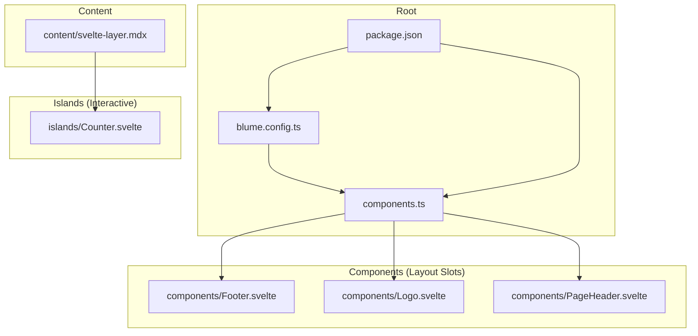
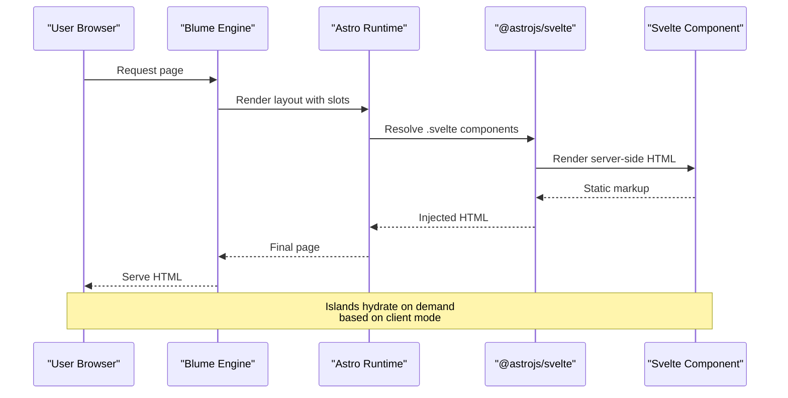
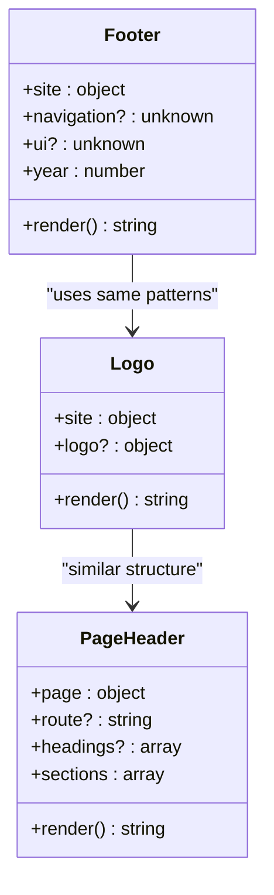
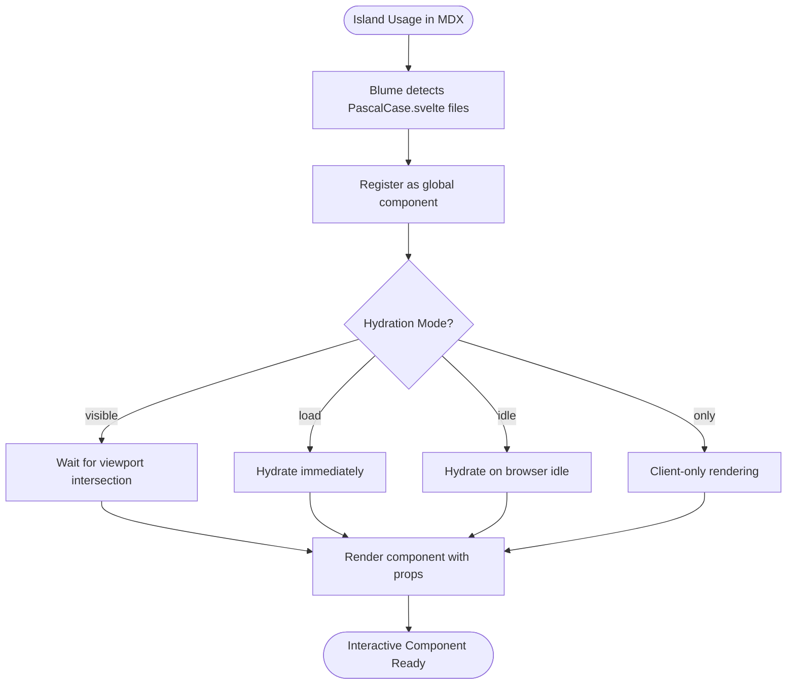
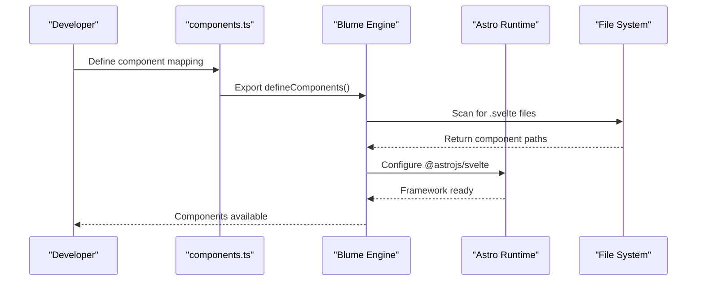
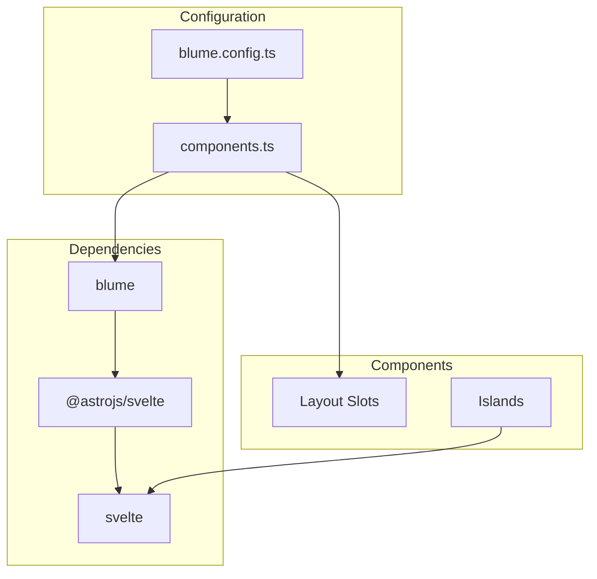

# Component Architecture

<cite>
**Referenced Files in This Document**
- [components.ts](file://components.ts)
- [blume.config.ts](file://blume.config.ts)
- [package.json](file://package.json)
- [README.md](file://README.md)
- [components/Footer.svelte](file://components/Footer.svelte)
- [components/Logo.svelte](file://components/Logo.svelte)
- [components/PageHeader.svelte](file://components/PageHeader.svelte)
- [islands/Counter.svelte](file://islands/Counter.svelte)
- [content/svelte-layer.mdx](file://content/svelte-layer.mdx)
</cite>

## Table of Contents
1. [Introduction](#introduction)
2. [Project Structure](#project-structure)
3. [Core Components](#core-components)
4. [Architecture Overview](#architecture-overview)
5. [Detailed Component Analysis](#detailed-component-analysis)
6. [Dependency Analysis](#dependency-analysis)
7. [Performance Considerations](#performance-considerations)
8. [Troubleshooting Guide](#troubleshooting-guide)
9. [Conclusion](#conclusion)
10. [Appendices](#appendices)

## Introduction
This document explains the component architecture pattern used by FractalWiki to replace Astro’s default component system with Svelte components via Blume. It covers how slot mapping is defined, the two distinct surfaces (layout slots for server-rendered static components and islands for client-hydrated interactive components), the registration process, prop passing mechanisms, lifecycle management, and how Blume detects .svelte files and wires up @astrojs/svelte without requiring Astro configuration. Practical examples are included for creating custom layout overrides and interactive islands with TypeScript integration.

## Project Structure
FractalWiki organizes its component layer into two primary directories:
- components/: Server-rendered layout slots that replace Blume’s default Astro components.
- islands/: Client-hydrated interactive components available globally in MDX pages without imports.

The site configuration and component mapping live at the root level:
- blume.config.ts: Site configuration including content root, navigation, i18n, and deployment settings.
- components.ts: Maps Blume layout slots to Svelte components using defineComponents.
- package.json: Declares dependencies including blume, @astrojs/svelte, svelte, and related tooling.

**Diagram sources**
- [blume.config.ts:1-57](file://blume.config.ts#L1-L57)
- [components.ts:1-27](file://components.ts#L1-L27)
- [package.json:1-41](file://package.json#L1-L41)
- [components/Footer.svelte:1-30](file://components/Footer.svelte#L1-L30)
- [components/Logo.svelte:1-50](file://components/Logo.svelte#L1-L50)
- [components/PageHeader.svelte:1-76](file://components/PageHeader.svelte#L1-L76)
- [islands/Counter.svelte:1-45](file://islands/Counter.svelte#L1-L45)
- [content/svelte-layer.mdx:1-68](file://content/svelte-layer.mdx#L1-L68)

**Section sources**
- [blume.config.ts:1-57](file://blume.config.ts#L1-L57)
- [components.ts:1-27](file://components.ts#L1-L27)
- [package.json:1-41](file://package.json#L1-L41)
- [README.md:1-124](file://README.md#L1-L124)

## Core Components
Blume provides a set of layout slots that can be overridden with Svelte components. The project registers three key slots:
- Logo: Displays the site logo and title.
- PageHeader: Renders a section strip based on page headings.
- Footer: Shows site information and branding.

These components receive props from Blume consistent with its internal contracts. They render on the server by default and ship no JavaScript unless explicitly configured otherwise.

Additionally, islands provide interactive components that hydrate in the browser. The Counter island demonstrates stateful behavior with minimal setup.

Key points:
- Slot mapping is centralized in components.ts using defineComponents.
- Islands are auto-discovered from the islands directory and made globally available in MDX.
- Props must be serializable for islands; layout slots receive typed props from Blume.

**Section sources**
- [components.ts:1-27](file://components.ts#L1-L27)
- [components/Footer.svelte:1-30](file://components/Footer.svelte#L1-L30)
- [components/Logo.svelte:1-50](file://components/Logo.svelte#L1-L50)
- [components/PageHeader.svelte:1-76](file://components/PageHeader.svelte#L1-L76)
- [islands/Counter.svelte:1-45](file://islands/Counter.svelte#L1-L45)

## Architecture Overview
The architecture separates concerns between static layout rendering and dynamic client-side interactivity:

- Layout slots are server-rendered components that replace Blume’s default Astro components. They receive props like site metadata, page data, and navigation info.
- Islands are client-hydrated components that add interactivity to MDX pages. They use Svelte runes for state management and follow hydration modes for performance optimization.

Blume automatically detects .svelte files and configures @astrojs/svelte during build time, eliminating the need for manual Astro configuration.

**Diagram sources**
- [components.ts:1-27](file://components.ts#L1-L27)
- [package.json:21-21](file://package.json#L21-L21)
- [README.md:29-32](file://README.md#L29-L32)

## Detailed Component Analysis

### Layout Slots: Server-Rendered Static Components
Layout slots are registered in components.ts and rendered on the server. Each slot receives specific props from Blume:

- Logo: Receives site and logo props, displays branding with optional text override.
- PageHeader: Receives page, route, and headings props, builds a section navigation strip.
- Footer: Receives site, navigation, and ui props, shows footer content.

These components use Svelte 5 runes for reactive logic but remain static by default. They can be enhanced with client modes if interactivity is needed.

**Diagram sources**
- [components/Logo.svelte:1-50](file://components/Logo.svelte#L1-L50)
- [components/PageHeader.svelte:1-76](file://components/PageHeader.svelte#L1-L76)
- [components/Footer.svelte:1-30](file://components/Footer.svelte#L1-L30)

**Section sources**
- [components.ts:20-26](file://components.ts#L20-L26)
- [components/Logo.svelte:1-50](file://components/Logo.svelte#L1-L50)
- [components/PageHeader.svelte:1-76](file://components/PageHeader.svelte#L1-L76)
- [components/Footer.svelte:1-30](file://components/Footer.svelte#L1-L30)

### Islands: Client-Hydrated Interactive Components
Islands are Svelte components placed in the islands directory. They are automatically discovered and made available globally in MDX pages without imports.

The Counter island demonstrates:
- Prop-based configuration with TypeScript types
- State management using Svelte runes ($state)
- Event handling for user interactions
- Default hydration mode (client:visible)

Islands support different hydration strategies:
- visible: Hydrates when scrolled into view (default)
- load: Hydrates immediately on page load
- idle: Hydrates when the browser is idle
- only: Client-only rendering, no server output

**Diagram sources**
- [islands/Counter.svelte:1-45](file://islands/Counter.svelte#L1-L45)
- [content/svelte-layer.mdx:25-37](file://content/svelte-layer.mdx#L25-L37)

**Section sources**
- [islands/Counter.svelte:1-45](file://islands/Counter.svelte#L1-L45)
- [content/svelte-layer.mdx:11-23](file://content/svelte-layer.mdx#L11-L23)
- [content/svelte-layer.mdx:25-37](file://content/svelte-layer.mdx#L25-L37)

### Component Registration Process
The registration process follows a clear pattern:

1. Create a Svelte component file in the appropriate directory
2. Import the component in components.ts
3. Map it to a Blume slot using defineComponents
4. Blume automatically handles framework detection and configuration

For islands, registration is automatic - any PascalCase .svelte file in the islands directory becomes available globally.

**Diagram sources**
- [components.ts:1-27](file://components.ts#L1-L27)
- [README.md:29-32](file://README.md#L29-L32)

**Section sources**
- [components.ts:1-27](file://components.ts#L1-L27)
- [README.md:29-32](file://README.md#L29-L32)

### Prop Passing Mechanisms
Props flow from Blume to components through well-defined contracts:

- Layout slots receive typed props from Blume's internal data structures
- Islands accept props passed directly from MDX usage
- All props must be serializable for islands due to hydration requirements

TypeScript integration ensures type safety throughout the component chain.

**Section sources**
- [components/Logo.svelte:4-4](file://components/Logo.svelte#L4-L4)
- [components/PageHeader.svelte:10-17](file://components/PageHeader.svelte#L10-L17)
- [components/Footer.svelte:4-4](file://components/Footer.svelte#L4-L4)
- [islands/Counter.svelte:6-6](file://islands/Counter.svelte#L6-L6)

### Lifecycle Management
Component lifecycles differ between layout slots and islands:

- Layout slots: Server-rendered with optional client hydration
- Islands: Client-hydrated with configurable timing strategies
- Both use Svelte 5 runes for reactive state management

Lifecycle hooks can be used for side effects and cleanup operations.

**Section sources**
- [README.md:70-71](file://README.md#L70-L71)
- [content/svelte-layer.mdx:25-37](file://content/svelte-layer.mdx#L25-L37)

## Dependency Analysis
The component architecture has clear dependency relationships:

- components.ts depends on blume for slot registration
- Layout slots depend on Blume's prop contracts
- Islands depend on Svelte runtime for hydration
- All components use theme CSS variables for styling consistency

**Diagram sources**
- [package.json:16-39](file://package.json#L16-L39)
- [blume.config.ts:1-57](file://blume.config.ts#L1-L57)
- [components.ts:1-27](file://components.ts#L1-L27)

**Section sources**
- [package.json:16-39](file://package.json#L16-L39)
- [blume.config.ts:1-57](file://blume.config.ts#L1-L57)

## Performance Considerations
The architecture optimizes performance through several strategies:

- Server-rendered layout slots produce zero-JS output by default
- Islands use lazy hydration strategies to minimize initial bundle size
- Components use efficient Svelte runes for reactive updates
- Theme variables enable consistent styling without runtime overhead

Performance best practices:
- Use visible hydration for non-critical interactive elements
- Keep island props serializable and minimal
- Leverage server-side rendering for static content
- Monitor bundle size impact of additional islands

[No sources needed since this section provides general guidance]

## Troubleshooting Guide
Common issues and solutions:

- **Slot not rendering**: Verify component is registered in components.ts and uses correct slot name
- **Props undefined**: Check Blume's prop contract documentation for each slot
- **Island not hydrating**: Ensure proper client mode configuration and serializable props
- **TypeScript errors**: Verify prop types match Blume's expected interfaces

Debugging tips:
- Use Blume's development tools for component inspection
- Check browser console for hydration warnings
- Validate prop serialization for islands
- Review generated .blume directory for build artifacts

**Section sources**
- [README.md:87-99](file://README.md#L87-L99)
- [content/svelte-layer.mdx:64-67](file://content/svelte-layer.mdx#L64-L67)

## Conclusion
FractalWiki's component architecture successfully replaces Astro's default component system with Svelte through Blume's slot mapping mechanism. The separation between static layout slots and interactive islands provides optimal performance while maintaining developer experience. The automatic detection and configuration of Svelte components eliminates boilerplate configuration while providing full TypeScript support.

The architecture enables:
- Zero-JS server-rendered layouts by default
- Lazy-hydrated interactive components
- Consistent prop contracts across components
- Automatic framework configuration
- Full TypeScript integration

This approach demonstrates how modern static site generators can integrate multiple frontend frameworks seamlessly while maintaining performance and developer productivity.

[No sources needed since this section summarizes without analyzing specific files]

## Appendices

### Practical Examples

#### Creating Custom Layout Overrides
To create a custom layout override:

1. Create a new Svelte component in the components directory
2. Import it in components.ts
3. Register it under the appropriate slot in defineComponents
4. Use Blume's prop contracts for type safety

Example workflow:
- Add components/CustomHeader.svelte
- Import in components.ts
- Register as layout.Header = CustomHeader
- Implement using site, navigation, and ui props

#### Building Interactive Islands
To create an interactive island:

1. Create a PascalCase.svelte file in the islands directory
2. Define props with TypeScript interfaces
3. Use Svelte runes for state management
4. Configure hydration mode as needed
5. Use directly in MDX without imports

Example workflow:
- Create islands/DataChart.svelte
- Define chart props and state
- Implement interactive features
- Use <DataChart data={...} /> in MDX

#### TypeScript Integration
All components support full TypeScript integration:

- Define prop interfaces using TypeScript
- Get autocomplete and type checking
- Ensure prop serialization for islands
- Leverage Svelte 5 runes with proper typing

**Section sources**
- [components.ts:20-26](file://components.ts#L20-L26)
- [islands/Counter.svelte:1-45](file://islands/Counter.svelte#L1-L45)
- [content/svelte-layer.mdx:11-23](file://content/svelte-layer.mdx#L11-L23)