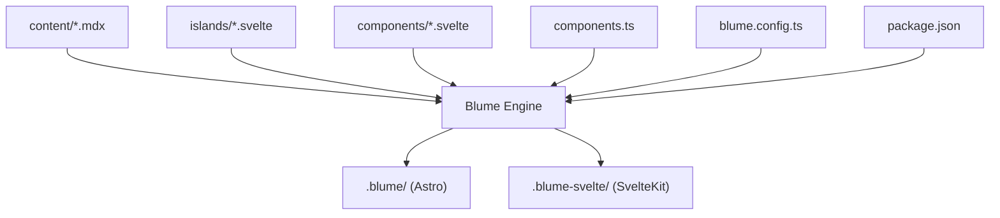
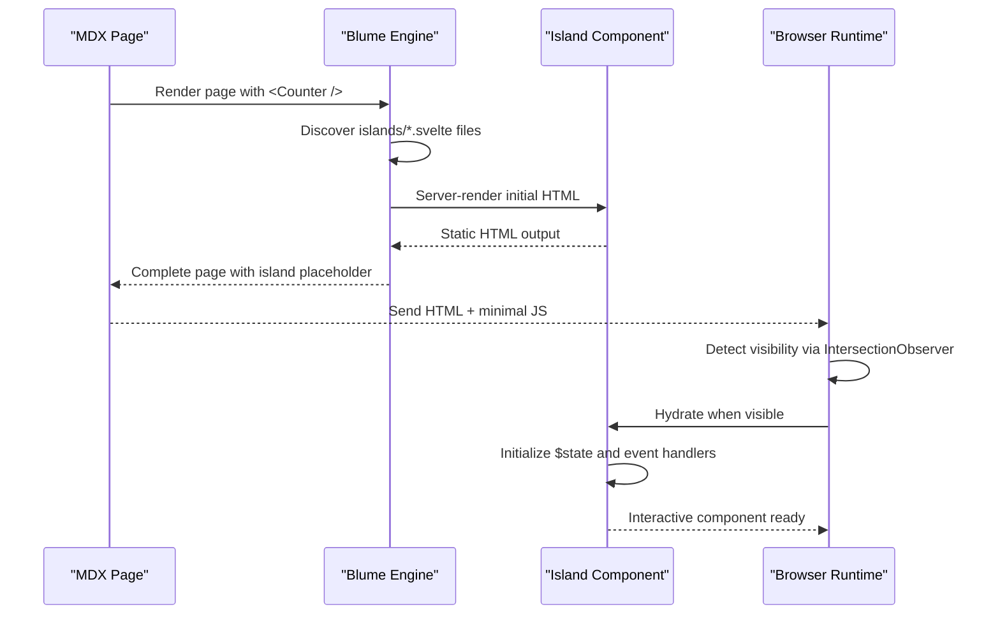
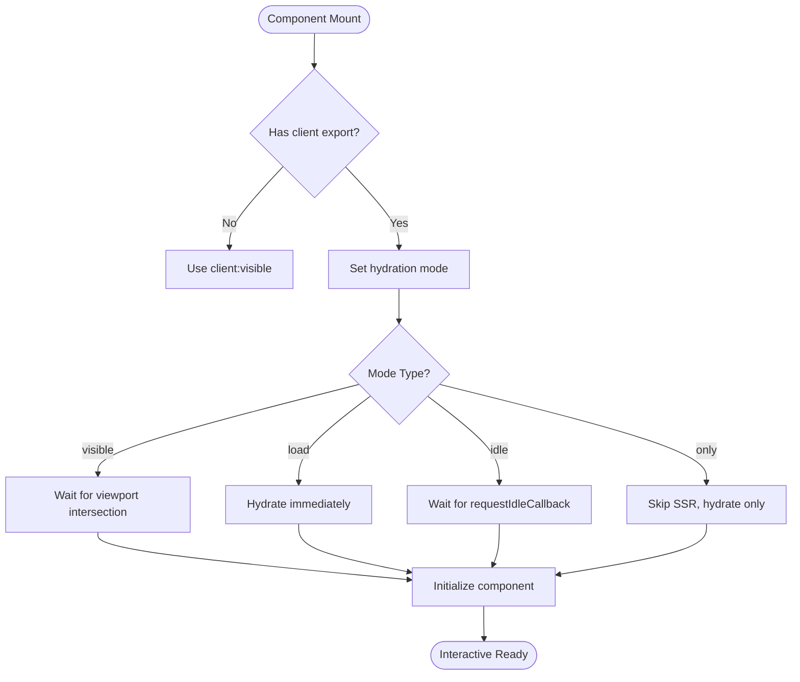
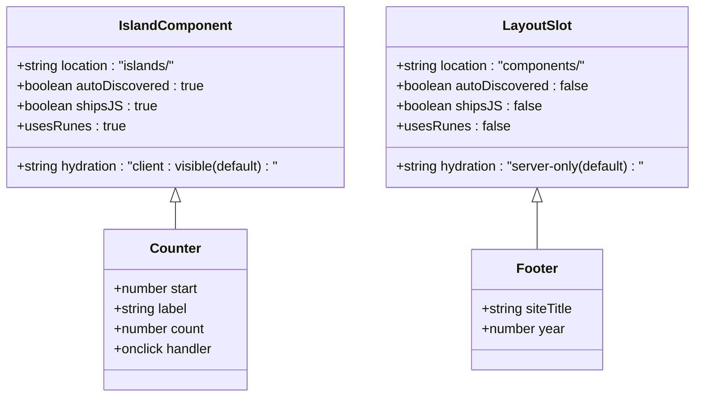
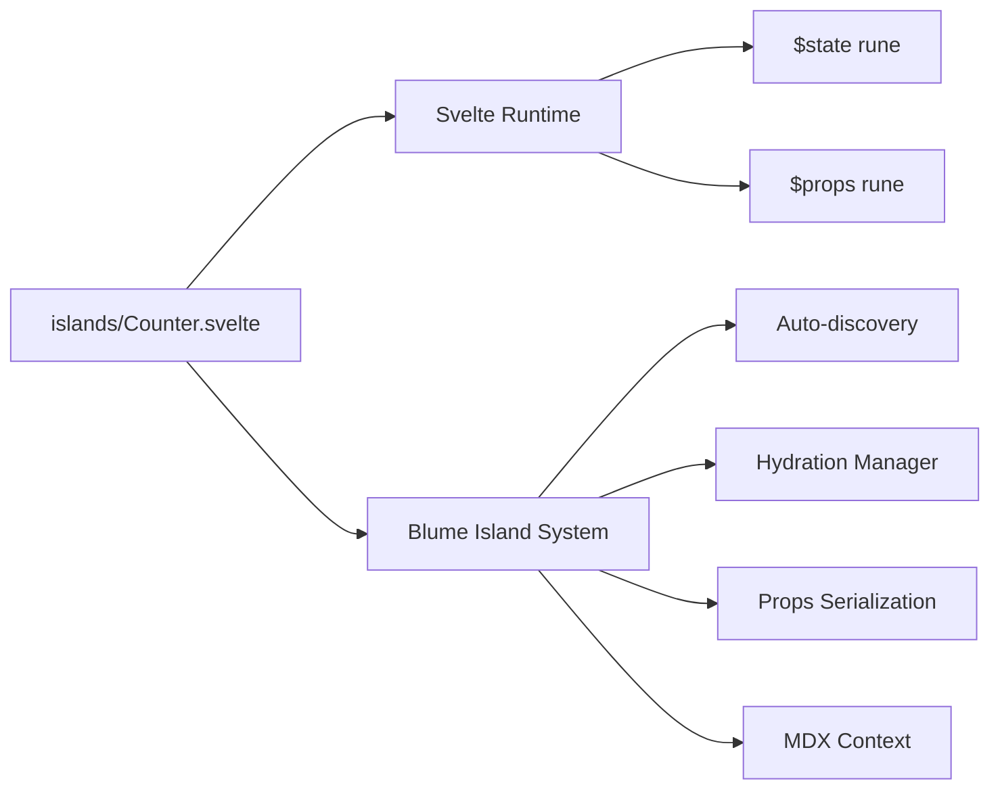

# Island Components

<cite>
**Referenced Files in This Document**
- [README.md](file://README.md)
- [blume.config.ts](file://blume.config.ts)
- [components.ts](file://components.ts)
- [islands/Counter.svelte](file://islands/Counter.svelte)
- [content/svelte-layer.mdx](file://content/svelte-layer.mdx)
- [components/Footer.svelte](file://components/Footer.svelte)
- [components/PageHeader.svelte](file://components/PageHeader.svelte)
- [package.json](file://package.json)
</cite>

## Table of Contents
1. [Introduction](#introduction)
2. [Project Structure](#project-structure)
3. [Core Components](#core-components)
4. [Architecture Overview](#architecture-overview)
5. [Detailed Component Analysis](#detailed-component-analysis)
6. [Dependency Analysis](#dependency-analysis)
7. [Performance Considerations](#performance-considerations)
8. [Troubleshooting Guide](#troubleshooting-guide)
9. [Conclusion](#conclusion)
10. [Appendices](#appendices)

## Introduction
This document explains how island components work in FractalWiki, focusing on automatic discovery of .svelte files under the islands/ directory, zero JavaScript by default with client-side hydration only when needed, and the differences between islands and layout slots. It also covers hydration strategies (visibility-based loading and manual control), state management using Svelte 5 runes ($state), TypeScript integration, props handling, and lifecycle considerations.

## Project Structure
FractalWiki uses Blume to generate both an Astro app and a SvelteKit app from the same sources. The key directories for this topic are:
- content/: Markdown and MDX pages where islands can be used without imports
- islands/: PascalCase .svelte files that become globally available interactive components
- components/: Svelte components registered as layout slots (server-rendered by default)
- components.ts: Maps Blume layout slots to Svelte components
- blume.config.ts: Site configuration and engine behavior
- package.json: Dependencies including Svelte and Blume integrations

**Diagram sources**
- [README.md:104-111](file://README.md#L104-L111)
- [blume.config.ts:14-56](file://blume.config.ts#L14-L56)
- [components.ts:20-26](file://components.ts#L20-L26)

**Section sources**
- [README.md:104-111](file://README.md#L104-L111)
- [blume.config.ts:14-56](file://blume.config.ts#L14-L56)
- [components.ts:20-26](file://components.ts#L20-L26)

## Core Components
The core island component in this project is Counter.svelte, which demonstrates:
- Automatic discovery and global availability in MDX files
- Props handling with TypeScript definitions
- State management using Svelte 5 $state rune
- Client-side interactivity with event handlers
- Zero JavaScript by default with visibility-based hydration

Layout slot components like Footer.svelte and PageHeader.svelte show the contrast: they render server-side without JavaScript unless explicitly configured otherwise.

**Section sources**
- [islands/Counter.svelte:1-45](file://islands/Counter.svelte#L1-L45)
- [components/Footer.svelte:1-30](file://components/Footer.svelte#L1-L30)
- [components/PageHeader.svelte:1-76](file://components/PageHeader.svelte#L1-L76)

## Architecture Overview
Island components follow a specific architecture pattern:

**Diagram sources**
- [README.md:73-85](file://README.md#L73-L85)
- [content/svelte-layer.mdx:11-23](file://content/svelte-layer.mdx#L11-L23)

## Detailed Component Analysis

### Island Discovery Mechanism
Blume automatically discovers all PascalCase .svelte files in the islands/ directory and makes them globally available in any .mdx file without requiring imports. This eliminates boilerplate code and simplifies component usage.

The discovery process works as follows:
1. Scan islands/ directory for .svelte files
2. Convert filenames to PascalCase component names
3. Register components globally in the MDX context
4. Enable direct usage like `<Counter />` without imports

**Section sources**
- [README.md:73-85](file://README.md#L73-L85)
- [content/svelte-layer.mdx:11-16](file://content/svelte-layer.mdx#L11-L16)

### Hydration Strategies
Islands support multiple hydration strategies controlled by the `client` export:

| Strategy | Behavior | Use Case |
|----------|----------|----------|
| `visible` (default) | Hydrates when scrolled into viewport | Performance optimization for below-fold content |
| `load` | Hydrates immediately on page load | Critical interactive elements |
| `idle` | Hydrates when browser is idle | Non-critical interactions |
| `only` | Client-only rendering, no SSR | Browser-specific APIs |

**Diagram sources**
- [content/svelte-layer.mdx:25-37](file://content/svelte-layer.mdx#L25-L37)
- [README.md:83-85](file://README.md#L83-L85)

### Islands vs Layout Slots
The key differences between islands and layout slots:

**Islands:**
- Located in islands/ directory
- Automatically discovered and globally available
- Hydrated client-side by default (client:visible)
- Designed for interactive components
- Can use Svelte 5 runes ($state, $props)
- Ship JavaScript only when used

**Layout Slots:**
- Located in components/ directory
- Must be registered in components.ts
- Server-rendered by default (no JavaScript)
- Designed for static UI elements
- Receive specific props from Blume
- Zero JavaScript unless explicitly configured

**Diagram sources**
- [islands/Counter.svelte:1-45](file://islands/Counter.svelte#L1-L45)
- [components/Footer.svelte:1-30](file://components/Footer.svelte#L1-L30)
- [components.ts:20-26](file://components.ts#L20-L26)

### State Management with Svelte 5 Runes
Island components leverage Svelte 5's reactive runes for state management:

**$props()**: Defines typed props with defaults
**$state()**: Creates reactive state variables
**$derived()**: Computes derived values reactively

The Counter component demonstrates these patterns:
- Props defined with TypeScript interface
- Reactive state initialized from props
- Event handlers update state directly
- Template automatically re-renders on state changes

**Section sources**
- [islands/Counter.svelte:6-8](file://islands/Counter.svelte#L6-L8)

### TypeScript Integration
Island components support full TypeScript integration:
- Props are strongly typed with interfaces
- State variables have inferred types
- Event handlers are type-safe
- IDE autocomplete works seamlessly

The Counter component shows proper TypeScript usage with prop validation and type inference.

**Section sources**
- [islands/Counter.svelte:6](file://islands/Counter.svelte#L6)

### Lifecycle Management
Island components follow standard Svelte lifecycle patterns:
- **Mount**: Component initializes when hydrated
- **Update**: State changes trigger re-renders
- **Unmount**: Cleanup occurs when component is removed

For browser-specific APIs, use the `client:only` strategy to avoid server-side execution.

**Section sources**
- [content/svelte-layer.mdx:37](file://content/svelte-layer.mdx#L37)

## Dependency Analysis
Island components have minimal dependencies but integrate deeply with the Blume framework:

**Diagram sources**
- [islands/Counter.svelte:1-45](file://islands/Counter.svelte#L1-L45)
- [components.ts:17-18](file://components.ts#L17-L18)

**Section sources**
- [package.json:16-38](file://package.json#L16-L38)
- [components.ts:17-18](file://components.ts#L17-L18)

## Performance Considerations
Island components are designed for optimal performance:

**Zero JavaScript by Default**: Islands ship no JavaScript until they're actually used on a page
**Lazy Hydration**: Default visibility-based loading prevents unnecessary client-side processing
**Selective Bundling**: Only the JavaScript for used islands is included in the bundle
**Efficient Updates**: Svelte 5 runes provide fine-grained reactivity

**Best Practices:**
- Use `client:visible` for most components (default)
- Use `client:only` for browser-specific functionality
- Keep island components small and focused
- Avoid heavy computations in initial render

## Troubleshooting Guide

**Common Issues:**
1. **Island not found**: Ensure filename is PascalCase and located in islands/ directory
2. **Props not working**: Verify props are serializable (no functions or complex objects)
3. **Hydration errors**: Check if component uses browser APIs without `client:only`
4. **TypeScript errors**: Ensure proper prop typing and import paths

**Debugging Tips:**
- Use browser dev tools to check network tab for island bundles
- Verify hydration mode with `export const client`
- Test props serialization by logging values
- Check console for hydration warnings

**Section sources**
- [README.md:83-85](file://README.md#L83-L85)
- [content/svelte-layer.mdx:27-37](file://content/svelte-layer.mdx#L27-L37)

## Conclusion
Island components in FractalWiki provide a powerful pattern for adding client-side interactivity while maintaining zero JavaScript by default. The automatic discovery mechanism, flexible hydration strategies, and seamless TypeScript integration make them ideal for building interactive features in documentation sites. By understanding the differences between islands and layout slots, developers can choose the right approach for each component based on its requirements and performance implications.

## Appendices

### Creating Your First Island Component
1. Create a new file in the islands/ directory with PascalCase naming
2. Define props using $props() with TypeScript interface
3. Add reactive state with $state() rune
4. Implement event handlers for interactivity
5. Use in any .mdx file without imports

### Hydration Mode Selection Guide
- **client:visible**: Most components (default)
- **client:load**: Above-the-fold interactive elements
- **client:idle**: Background tasks and non-critical features  
- **client:only**: Browser-specific APIs and window/document access

**Section sources**
- [README.md:113-119](file://README.md#L113-L119)
- [content/svelte-layer.mdx:25-37](file://content/svelte-layer.mdx#L25-L37)