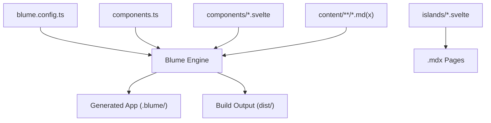
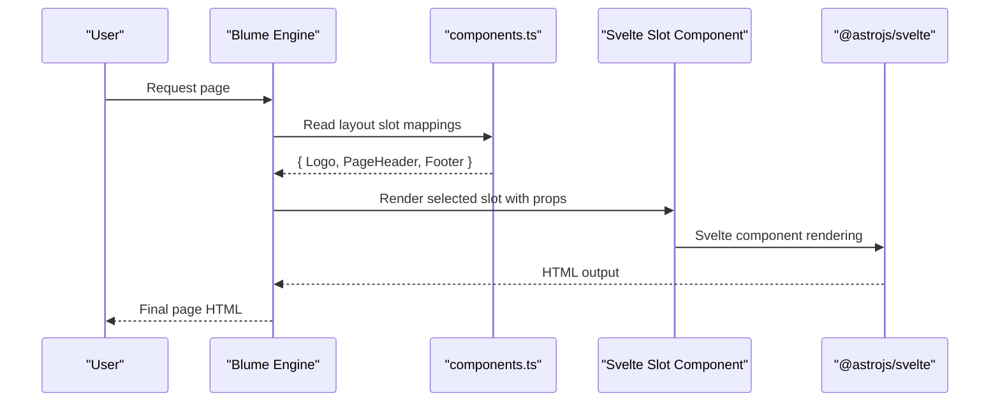
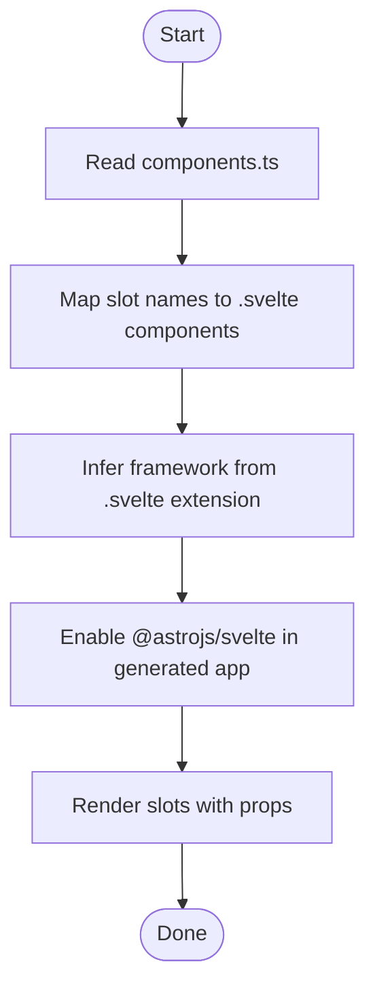
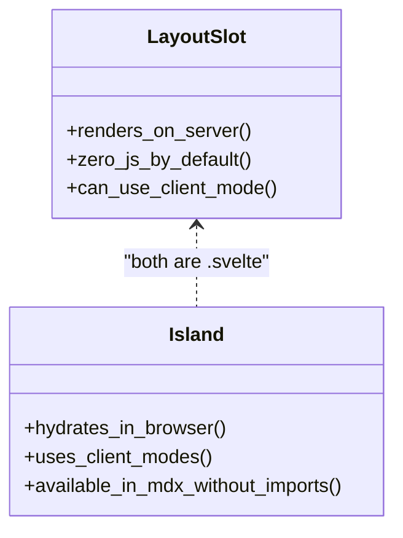
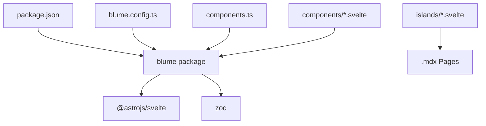

# Layout Slots

<cite>
**Referenced Files in This Document**
- [components.ts](file://components.ts)
- [blume.config.ts](file://blume.config.ts)
- [README.md](file://README.md)
- [package.json](file://package.json)
- [components/Footer.svelte](file://components/Footer.svelte)
- [components/Logo.svelte](file://components/Logo.svelte)
- [components/PageHeader.svelte](file://components/PageHeader.svelte)
- [islands/Counter.svelte](file://islands/Counter.svelte)
- [content/svelte-layer.mdx](file://content/svelte-layer.mdx)
</cite>

## Table of Contents
1. [Introduction](#introduction)
2. [Project Structure](#project-structure)
3. [Core Components](#core-components)
4. [Architecture Overview](#architecture-overview)
5. [Detailed Component Analysis](#detailed-component-analysis)
6. [Dependency Analysis](#dependency-analysis)
7. [Performance Considerations](#performance-considerations)
8. [Troubleshooting Guide](#troubleshooting-guide)
9. [Conclusion](#conclusion)
10. [Appendices](#appendices)

## Introduction
This document explains Blume’s layout slot system as implemented in FractalWiki, focusing on how Svelte components replace Astro’s default layout components through the slot mapping defined in components.ts. It covers all available slots, their purposes, and the component registration process using defineComponents(). It also explains how Blume automatically infers framework from file extensions, how props are passed to slots, and when to use client mode for interactive elements within static layouts. Practical examples with TypeScript integration are included to guide creating custom layout overrides.

## Project Structure
FractalWiki organizes its Svelte-based component layer under two directories:
- components/*.svelte: Static layout slot overrides rendered on the server.
- islands/*.svelte: Interactive components that hydrate in the browser and can be used directly in .mdx pages without imports.

Configuration lives in blume.config.ts for site settings, navigation, i18n, and frontmatter schema. Slot-to-component mapping is centralized in components.ts.

**Diagram sources**
- [blume.config.ts:1-57](file://blume.config.ts#L1-L57)
- [components.ts:1-27](file://components.ts#L1-L27)
- [README.md:104-111](file://README.md#L104-L111)

**Section sources**
- [README.md:104-111](file://README.md#L104-L111)
- [blume.config.ts:1-57](file://blume.config.ts#L1-L57)

## Core Components
The project demonstrates three key layout slot overrides:
- Logo: Renders the site logo and title inside the header area.
- PageHeader: Displays a section strip derived from page headings above the article body.
- Footer: Adds a minimal footer with site title and year.

These components receive specific props from Blume and render statically by default unless you opt into client hydration.

**Section sources**
- [components/Logo.svelte:1-50](file://components/Logo.svelte#L1-L50)
- [components/PageHeader.svelte:1-76](file://components/PageHeader.svelte#L1-L76)
- [components/Footer.svelte:1-30](file://components/Footer.svelte#L1-L30)

## Architecture Overview
Blume owns routing, content collections, markdown, layout, theming, and search. The only swap here is the component surface: wherever Blume would use an Astro component, this project supplies a Svelte one. Blume detects .svelte files via the extension, enables @astrojs/svelte internally, and renders your component in the slot. There is no Astro config in this project; it is generated into .blume/.

**Diagram sources**
- [components.ts:1-27](file://components.ts#L1-L27)
- [README.md:21-32](file://README.md#L21-L32)

**Section sources**
- [README.md:21-32](file://README.md#L21-L32)
- [components.ts:1-27](file://components.ts#L1-L27)

## Detailed Component Analysis

### Slot Mapping and Registration
- All available slots: Header, Sidebar, MobileNav, Breadcrumbs, TableOfContents, Pagination, Footer, PageHeader, PageFooter, Feedback, Logo, Search.
- Registration uses defineComponents() with a layout object mapping slot names to Svelte components.
- Blume infers framework from .svelte extension and enables @astrojs/svelte automatically.

**Diagram sources**
- [components.ts:1-27](file://components.ts#L1-L27)
- [README.md:21-32](file://README.md#L21-L32)

**Section sources**
- [components.ts:1-27](file://components.ts#L1-L27)
- [README.md:44-53](file://README.md#L44-L53)

### Available Slots and Props
- Logo: Receives site and optional logo text; defaults to site.title if logo.text is absent.
- PageHeader / PageFooter: Receive page, route, and headings; useful for building section strips or metadata displays.
- Footer: Receives site, navigation, and ui; commonly used for branding and links.
- Other slots (Header, Sidebar, MobileNav, Breadcrumbs, TableOfContents, Pagination, Feedback, Search): Provided by Blume and can be overridden similarly.

Props are typed via TypeScript in each component using $props(), ensuring type safety and IDE support.

**Section sources**
- [components/Logo.svelte:1-50](file://components/Logo.svelte#L1-L50)
- [components/PageHeader.svelte:1-76](file://components/PageHeader.svelte#L1-L76)
- [components/Footer.svelte:1-30](file://components/Footer.svelte#L1-L30)
- [README.md:55-68](file://README.md#L55-L68)

### Islands vs Layout Slots
- Layout slots are static by default and render on the server with zero JavaScript unless given a client mode.
- Islands are interactive components placed in islands/*.svelte; they hydrate based on client mode and can be used anywhere in .mdx without imports.
- Default hydration for islands is client:visible; modes include load, idle, only.

**Diagram sources**
- [README.md:42-71](file://README.md#L42-L71)
- [content/svelte-layer.mdx:25-38](file://content/svelte-layer.mdx#L25-L38)

**Section sources**
- [README.md:42-71](file://README.md#L42-L71)
- [content/svelte-layer.mdx:25-38](file://content/svelte-layer.mdx#L25-L38)

### Practical Examples: Custom Layout Overrides with TypeScript
- Create a new Svelte component under components/ with TypeScript props via $props().
- Register the component in components.ts under layout with the desired slot name.
- Use theme CSS variables for styling consistency across light/dark modes.
- For interactivity, add client mode either per-slot via descriptor form in components.ts or export const client in the component file.

Example references:
- Logo component shows prop typing and derived values.
- PageHeader builds a sections strip from headings prop without collection lookups.
- Footer demonstrates simple static rendering with site data.

**Section sources**
- [components/Logo.svelte:1-50](file://components/Logo.svelte#L1-L50)
- [components/PageHeader.svelte:1-76](file://components/PageHeader.svelte#L1-L76)
- [components/Footer.svelte:1-30](file://components/Footer.svelte#L1-L30)
- [content/svelte-layer.mdx:39-54](file://content/svelte-layer.mdx#L39-L54)

### When to Use Client Mode
- Use client mode for interactive elements within static layouts when you need runtime behavior (e.g., toggles, dynamic menus).
- Modes: visible (default), load, idle, only.
- For slots needing collection data, either hydrate the slot and read serialized snapshot via blume/hooks, or keep that slot as .astro.

**Section sources**
- [content/svelte-layer.mdx:25-38](file://content/svelte-layer.mdx#L25-L38)
- [README.md:87-99](file://README.md#L87-L99)

## Dependency Analysis
Blume orchestrates the mapping between slots and Svelte components, enabling @astrojs/svelte automatically. The project depends on blume and zod for configuration validation. Development scripts expose both Astro and SvelteKit engines.

**Diagram sources**
- [package.json:1-41](file://package.json#L1-L41)
- [blume.config.ts:1-57](file://blume.config.ts#L1-L57)
- [components.ts:1-27](file://components.ts#L1-L27)

**Section sources**
- [package.json:1-41](file://package.json#L1-L41)
- [blume.config.ts:1-57](file://blume.config.ts#L1-L57)

## Performance Considerations
- Layout slots are static by default and ship no JavaScript, minimizing payload.
- Islands hydrate selectively based on client mode, reducing unnecessary client-side code.
- Avoid importing Astro-only virtual modules (blume:data, astro:content) in .svelte slots; rely on props instead.
- Prefer deriving UI from provided props (like headings) rather than performing collection lookups in slots.

[No sources needed since this section provides general guidance]

## Troubleshooting Guide
- If a slot needs collection data, consider hydrating it and using blume/hooks, or keep that slot as .astro.
- Ensure TypeScript types match the expected props for each slot to avoid runtime errors.
- Verify client mode usage for interactive elements; default is no JS unless specified.
- Check that components.ts correctly maps slot names to .svelte files.

**Section sources**
- [README.md:87-99](file://README.md#L87-L99)
- [content/svelte-layer.mdx:64-68](file://content/svelte-layer.mdx#L64-L68)

## Conclusion
Blume’s layout slot system in FractalWiki replaces Astro’s default components with Svelte ones through a clean mapping in components.ts. Slots like Logo, PageHeader, and Footer demonstrate static server-rendered components with TypeScript-typed props. Islands provide interactive capabilities with controlled hydration. By leveraging Blume’s automatic framework inference and prop contracts, developers can create powerful, maintainable layouts while keeping performance optimal.

[No sources needed since this section summarizes without analyzing specific files]

## Appendices

### Slot Reference Table
- Logo: site, logo
- Header: —
- Sidebar / MobileNav: —
- Breadcrumbs: —
- TableOfContents: —
- Pagination: —
- PageHeader / PageFooter: page, route, headings
- Footer: site, navigation, ui
- Feedback: —
- Search: —

**Section sources**
- [README.md:55-68](file://README.md#L55-L68)

### Hydration Modes Summary
- visible: hydrates when scrolled into view (default)
- load: hydrates immediately
- idle: hydrates on idle
- only: client only, never server-rendered

**Section sources**
- [content/svelte-layer.mdx:25-38](file://content/svelte-layer.mdx#L25-L38)