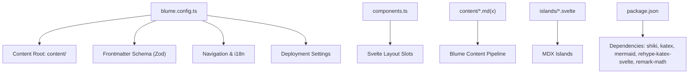
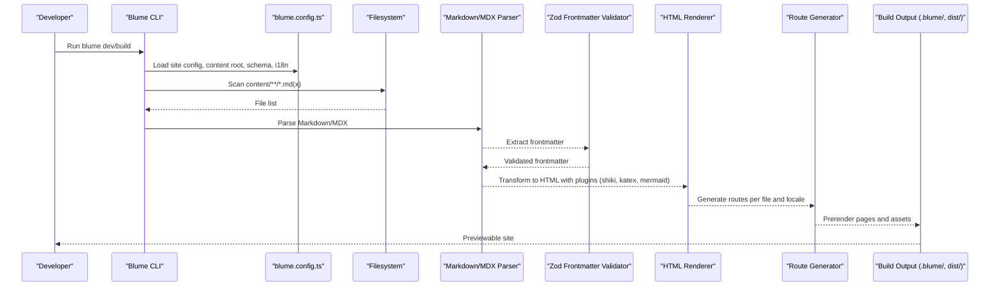
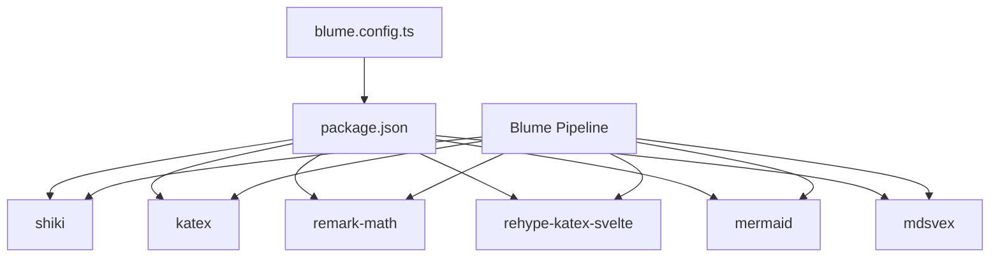

# Content Processing

<cite>
**Referenced Files in This Document**
- [blume.config.ts](file://blume.config.ts)
- [README.md](file://README.md)
- [components.ts](file://components.ts)
- [package.json](file://package.json)
- [content/index.md](file://content/index.md)
- [content/components.mdx](file://content/components.mdx)
- [content/svelte-layer.mdx](file://content/svelte-layer.mdx)
- [content/hi/index.md](file://content/hi/index.md)
- [components/PageHeader.svelte](file://components/PageHeader.svelte)
- [islands/Counter.svelte](file://islands/Counter.svelte)
</cite>

## Table of Contents
1. [Introduction](#introduction)
2. [Project Structure](#project-structure)
3. [Core Components](#core-components)
4. [Architecture Overview](#architecture-overview)
5. [Detailed Component Analysis](#detailed-component-analysis)
6. [Dependency Analysis](#dependency-analysis)
7. [Performance Considerations](#performance-considerations)
8. [Troubleshooting Guide](#troubleshooting-guide)
9. [Conclusion](#conclusion)
10. [Appendices](#appendices)

## Introduction
This document explains the content processing pipeline in FractalWiki, focusing on how Markdown and MDX files are processed through Blume’s content system. It covers frontmatter validation with Zod schemas, content root configuration, file structure organization, routing generation from content files, rich content features (syntax highlighting, math rendering with KaTeX, diagram support with Mermaid, and image handling), and the relationship between content files and generated routes including SEO optimization and meta tag generation. It also provides examples of advanced content patterns and best practices for organizing large documentation sites.

## Project Structure
FractalWiki is a Blume site that uses Svelte as the component layer while keeping all content under a dedicated content directory. The project defines:
- A central configuration file for site metadata, content root, frontmatter schema, navigation, i18n, and deployment settings.
- A components mapping file to override Blume layout slots with Svelte components.
- A content directory containing Markdown and MDX pages, including localized content.
- Islands for interactive components used within MDX pages.

**Diagram sources**
- [blume.config.ts:14-56](file://blume.config.ts#L14-L56)
- [components.ts:20-26](file://components.ts#L20-L26)
- [package.json:16-39](file://package.json#L16-L39)

**Section sources**
- [blume.config.ts:14-56](file://blume.config.ts#L14-L56)
- [README.md:104-124](file://README.md#L104-L124)
- [package.json:16-39](file://package.json#L16-L39)

## Core Components
- Configuration and schema:
  - Site title and description are defined in the configuration.
  - Frontmatter schema extends default fields with tags, related, source, created, and updated using Zod validators.
  - Navigation tabs and sidebar grouping are configured.
  - i18n is set up with default and fallback locales, and locale definitions.
  - Deployment settings enable absolute canonicals, sitemap, and social cards.
- Content root:
  - The content root is explicitly set to the content directory.
- Routing and engines:
  - Two engines run from the same sources: Astro engine via blume dev and SvelteKit engine via blume-svelte dev.
  - Generated apps live under .blume/ and .blume-svelte/.
- Rich content dependencies:
  - Syntax highlighting via Shiki.
  - Math rendering via KaTeX and remark-math with rehype-katex-svelte.
  - Diagrams via Mermaid.
  - MDX processing via mdsvex.

**Section sources**
- [blume.config.ts:14-56](file://blume.config.ts#L14-L56)
- [README.md:1-18](file://README.md#L1-L18)
- [package.json:16-39](file://package.json#L16-L39)

## Architecture Overview
The content processing pipeline integrates Blume’s content system with Svelte components and rich media processors. Content files are scanned, validated, transformed into HTML, and routed based on their location and i18n configuration.

**Diagram sources**
- [blume.config.ts:14-56](file://blume.config.ts#L14-L56)
- [package.json:16-39](file://package.json#L16-L39)

**Section sources**
- [blume.config.ts:14-56](file://blume.config.ts#L14-L56)
- [README.md:1-18](file://README.md#L1-L18)

## Detailed Component Analysis

### Content Root and File Organization
- Content root is configured to the content directory.
- Pages are organized by language; English pages reside at the root of content, while Hindi pages are under content/hi.
- MDX pages can include islands directly without imports.

Examples:
- English index page: [content/index.md](file://content/index.md)
- Hindi index page: [content/hi/index.md](file://content/hi/index.md)
- MDX demo page: [content/components.mdx](file://content/components.mdx)
- MDX island usage page: [content/svelte-layer.mdx](file://content/svelte-layer.mdx)

**Section sources**
- [blume.config.ts:20-22](file://blume.config.ts#L20-L22)
- [content/index.md:1-39](file://content/index.md#L1-L39)
- [content/hi/index.md:1-22](file://content/hi/index.md#L1-L22)
- [content/components.mdx:1-125](file://content/components.mdx#L1-L125)
- [content/svelte-layer.mdx:1-68](file://content/svelte-layer.mdx#L1-L68)

### Frontmatter Validation with Zod
- The frontmatter schema extends default fields with optional arrays and strings for tags and related links, plus date-like strings for created and updated timestamps.
- Zod ensures type safety and coercion for string dates.

Example schema keys:
- tags: array of strings
- related: array of strings
- source: string
- created: coerced string
- updated: coerced string

**Section sources**
- [blume.config.ts:29-37](file://blume.config.ts#L29-L37)

### Routing Generation from Content Files
- Routes are derived from file paths relative to the content root.
- Default locale pages use bare routes (e.g., /).
- Localized pages are prefixed by locale code (e.g., /hi/...).
- Navigation tabs and sidebar groups are configured to reflect site structure.

Routing examples:
- content/index.md → /
- content/hi/index.md → /hi/

**Section sources**
- [blume.config.ts:46-55](file://blume.config.ts#L46-L55)
- [content/index.md:1-39](file://content/index.md#L1-L39)
- [content/hi/index.md:1-22](file://content/hi/index.md#L1-L22)

### Rich Content Features
- Syntax highlighting: Enabled via Shiki dependency.
- Math rendering: Inline and block math supported using KaTeX with remark-math and rehype-katex-svelte.
- Diagrams: Mermaid diagrams supported in MDX blocks.
- Images: Handled by the Markdown/MDX pipeline; static assets typically go under public or referenced via relative paths.

Evidence in content:
- Math inline and block usage: [content/components.mdx:101-110](file://content/components.mdx#L101-L110)
- Mermaid diagram usage: [content/components.mdx:111-118](file://content/components.mdx#L111-L118)

**Section sources**
- [package.json:16-39](file://package.json#L16-L39)
- [content/components.mdx:101-118](file://content/components.mdx#L101-L118)

### Relationship Between Content Files and Generated Routes
- Each Markdown/MDX file maps to a route based on its path relative to the content root.
- i18n prefixes apply to non-default locales.
- SEO metadata (title, description) comes from frontmatter and configuration.

Examples:
- content/index.md sets title and description for the home route.
- content/hi/index.md sets localized title and description for /hi/.

**Section sources**
- [content/index.md:1-4](file://content/index.md#L1-L4)
- [content/hi/index.md:1-4](file://content/hi/index.md#L1-L4)
- [blume.config.ts:24-27](file://blume.config.ts#L24-L27)

### SEO Optimization and Meta Tag Generation
- Title and description are provided in frontmatter for each page.
- Deployment settings enable absolute canonicals, sitemap, and social cards.
- Blume generates optimized metadata based on frontmatter and site config.

**Section sources**
- [blume.config.ts:24-27](file://blume.config.ts#L24-L27)
- [content/index.md:1-4](file://content/index.md#L1-L4)
- [content/hi/index.md:1-4](file://content/hi/index.md#L1-L4)

### Advanced Content Patterns and Best Practices
- Use MDX for pages requiring islands or interactive components.
- Organize content by feature or topic, leveraging subdirectories for scalability.
- Apply consistent frontmatter fields (tags, related) to improve navigation and searchability.
- Leverage i18n directories for localized content.
- Keep islands minimal and serializable for props to ensure efficient hydration.

Examples:
- Island usage in MDX: [content/svelte-layer.mdx:11-24](file://content/svelte-layer.mdx#L11-L24)
- Tags and related fields in frontmatter: [content/components.mdx:1-5](file://content/components.mdx#L1-L5)

**Section sources**
- [content/svelte-layer.mdx:11-24](file://content/svelte-layer.mdx#L11-L24)
- [content/components.mdx:1-5](file://content/components.mdx#L1-L5)

### Svelte Integration: Layout Slots and Islands
- Layout slots are overridden via components.ts to replace Blume’s default Astro components with Svelte ones.
- Islands are PascalCase .svelte files in islands/ that become globally available in MDX without imports.
- Hydration modes control when islands hydrate (visible, load, idle, only).

Examples:
- Layout slot registration: [components.ts:20-26](file://components.ts#L20-L26)
- PageHeader slot implementation: [components/PageHeader.svelte:1-76](file://components/PageHeader.svelte#L1-L76)
- Island Counter usage: [islands/Counter.svelte:1-45](file://islands/Counter.svelte#L1-L45)

**Section sources**
- [components.ts:20-26](file://components.ts#L20-L26)
- [components/PageHeader.svelte:1-76](file://components/PageHeader.svelte#L1-L76)
- [islands/Counter.svelte:1-45](file://islands/Counter.svelte#L1-L45)

## Dependency Analysis
Blume orchestrates content processing with several key dependencies:
- shiki for syntax highlighting.
- katex and remark-math for math rendering.
- rehype-katex-svelte to integrate KaTeX with Svelte.
- mermaid for diagram rendering.
- mdsvex for MDX processing.

**Diagram sources**
- [package.json:16-39](file://package.json#L16-L39)
- [blume.config.ts:14-56](file://blume.config.ts#L14-L56)

**Section sources**
- [package.json:16-39](file://package.json#L16-L39)
- [blume.config.ts:14-56](file://blume.config.ts#L14-L56)

## Performance Considerations
- Prefer Markdown over MDX where interactivity is not needed to reduce client-side JavaScript.
- Use islands sparingly and choose appropriate hydration modes to minimize bundle size.
- Keep frontmatter fields minimal and avoid heavy computations in layouts.
- Leverage static assets and avoid runtime transformations for images.

[No sources needed since this section provides general guidance]

## Troubleshooting Guide
- If frontmatter validation fails, ensure fields match the Zod schema types and optional flags.
- For missing routes, verify file placement under the correct locale directory and content root.
- When islands do not hydrate, check client mode settings and prop serialization.
- For math or diagram rendering issues, confirm dependencies are installed and syntax is correct.

**Section sources**
- [blume.config.ts:29-37](file://blume.config.ts#L29-L37)
- [content/svelte-layer.mdx:25-38](file://content/svelte-layer.mdx#L25-L38)
- [content/components.mdx:101-118](file://content/components.mdx#L101-L118)

## Conclusion
FractalWiki demonstrates a robust content processing pipeline powered by Blume, integrating Markdown and MDX with Svelte components. The system supports rich content features, validates frontmatter with Zod, generates routes based on file structure and i18n, and optimizes SEO through metadata and deployment settings. By following best practices for content organization and island usage, large documentation sites can be efficiently built and maintained.

[No sources needed since this section summarizes without analyzing specific files]

## Appendices

### Example Advanced Content Patterns
- Using Callout, Tabs, Steps, Accordion, Badges, Columns, and Frame components in MDX.
- Demonstrating math inline and block expressions.
- Embedding Mermaid diagrams for flowcharts.

References:
- [content/components.mdx:12-125](file://content/components.mdx#L12-L125)

**Section sources**
- [content/components.mdx:12-125](file://content/components.mdx#L12-L125)