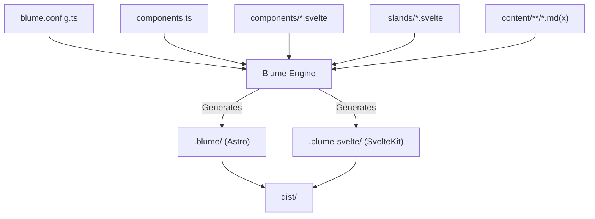
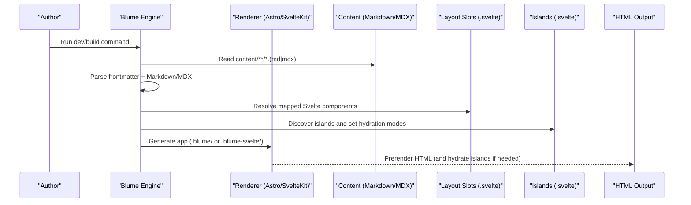
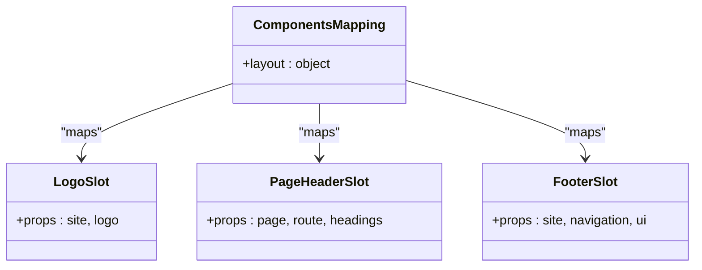
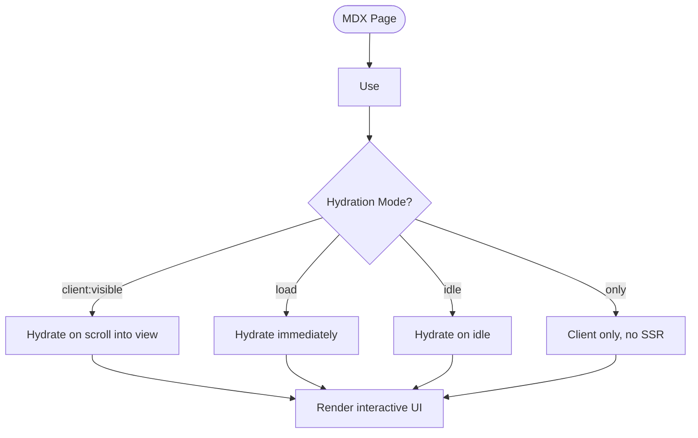
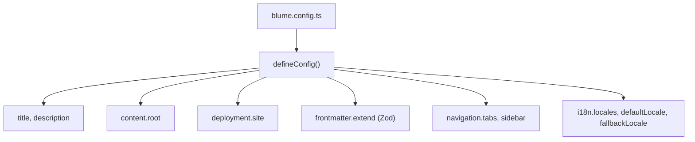
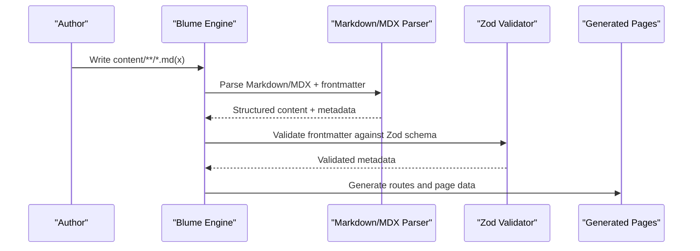
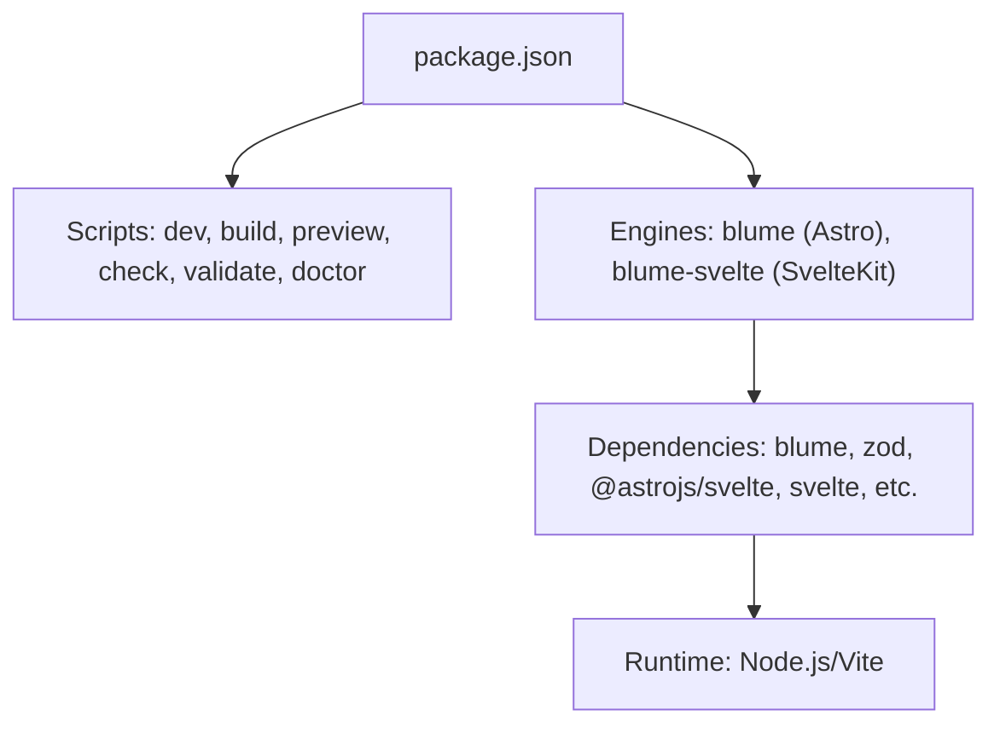

# Core Concepts

<cite>
**Referenced Files in This Document**
- [README.md](file://README.md)
- [blume.config.ts](file://blume.config.ts)
- [components.ts](file://components.ts)
- [package.json](file://package.json)
- [components/Footer.svelte](file://components/Footer.svelte)
- [components/Logo.svelte](file://components/Logo.svelte)
- [components/PageHeader.svelte](file://components/PageHeader.svelte)
- [islands/Counter.svelte](file://islands/Counter.svelte)
- [content/index.md](file://content/index.md)
- [content/components.mdx](file://content/components.mdx)
- [content/svelte-layer.mdx](file://content/svelte-layer.mdx)
- [content/hi/index.md](file://content/hi/index.md)
</cite>

## Table of Contents
1. Introduction
2. Project Structure
3. Core Components
4. Architecture Overview
5. Detailed Component Analysis
6. Dependency Analysis
7. Performance Considerations
8. Troubleshooting Guide
9. Conclusion

## Introduction
This document explains the core architectural concepts of FractalWiki, a Blume-powered site that runs on two engines from one unchanged source tree: Astro and SvelteKit. Blume provides routing, content collections, Markdown/MDX processing, theming, search, and more. The project’s key innovation is replacing Astro’s default component system with Svelte components through slot mapping. Two Svelte surfaces are supported:
- Layout slots for server-rendered static components
- Islands for client-hydrated interactive components

Configuration is driven by blume.config.ts with Zod schema validation for frontmatter. Content lives under content/ as Markdown or MDX files with frontmatter. The data flow goes from content files through Blume processing to final HTML output. A known constraint around Astro-only virtual modules is addressed with workarounds.

## Project Structure
FractalWiki organizes code into clear layers:
- Configuration: blume.config.ts defines site metadata, content root, deployment settings, frontmatter schema (Zod), navigation, and i18n locales.
- Component mapping: components.ts maps Blume layout slots to Svelte components.
- Layout overrides: components/*.svelte provide server-rendered UI parts.
- Islands: islands/*.svelte provide interactive components available in MDX without imports.
- Content: content/**/*.md(x) holds pages; subfolders enable localization.
- Generated apps: .blume/ (Astro app) and .blume-svelte/ (SvelteKit app) are generated at runtime/build time.

**Diagram sources**
- [blume.config.ts:1-57](file://blume.config.ts#L1-L57)
- [components.ts:1-27](file://components.ts#L1-L27)
- [components/Footer.svelte:1-30](file://components/Footer.svelte#L1-L30)
- [components/Logo.svelte:1-50](file://components/Logo.svelte#L1-L50)
- [components/PageHeader.svelte:1-76](file://components/PageHeader.svelte#L1-L76)
- [islands/Counter.svelte:1-45](file://islands/Counter.svelte#L1-L45)
- [content/index.md:1-39](file://content/index.md#L1-L39)
- [content/components.mdx:1-125](file://content/components.mdx#L1-L125)
- [content/svelte-layer.mdx:1-68](file://content/svelte-layer.mdx#L1-L68)
- [content/hi/index.md:1-22](file://content/hi/index.md#L1-L22)

**Section sources**
- [README.md:1-124](file://README.md#L1-L124)
- [blume.config.ts:1-57](file://blume.config.ts#L1-L57)
- [components.ts:1-27](file://components.ts#L1-L27)
- [package.json:1-41](file://package.json#L1-L41)

## Core Components
- Blume configuration: Centralized site setup including title, description, content root, deployment URLs, frontmatter schema via Zod, navigation structure, and i18n locales.
- Component mapping: A single file registers Svelte components against Blume layout slots, enabling the swap from Astro components to Svelte components.
- Layout slots: Server-rendered Svelte components replace Blume’s built-in Astro components. They receive props like site, page, route, headings, navigation, and ui.
- Islands: Any PascalCase .svelte file in islands/ becomes globally available in MDX pages. Hydration defaults to client-visible and can be customized per island.

Key behaviors:
- Blume infers framework from .svelte extension and enables @astrojs/svelte automatically when running under Astro.
- Under SvelteKit engine, the whole app hydrates; islands behave differently due to app-wide hydration.
- Frontmatter schema enforces types and optional fields using Zod.

**Section sources**
- [blume.config.ts:1-57](file://blume.config.ts#L1-L57)
- [components.ts:1-27](file://components.ts#L1-L27)
- [README.md:21-100](file://README.md#L21-L100)
- [content/svelte-layer.mdx:1-68](file://content/svelte-layer.mdx#L1-L68)

## Architecture Overview
Blume acts as the foundation, providing routing, content collections, Markdown/MDX processing, theming, search, and more. It generates either an Astro app (.blume/) or a SvelteKit app (.blume-svelte/) depending on the engine used. The project’s Svelte layer replaces Blume’s default component surface by mapping slots to .svelte files. Data flows from content files through Blume processing to final HTML output.

**Diagram sources**
- [blume.config.ts:1-57](file://blume.config.ts#L1-L57)
- [components.ts:1-27](file://components.ts#L1-L27)
- [content/index.md:1-39](file://content/index.md#L1-L39)
- [content/components.mdx:1-125](file://content/components.mdx#L1-L125)
- [content/svelte-layer.mdx:1-68](file://content/svelte-layer.mdx#L1-L68)

**Section sources**
- [README.md:1-18](file://README.md#L1-L18)
- [package.json:1-41](file://package.json#L1-L41)

## Detailed Component Analysis

### Slot Mapping and Svelte Replacement
Blume’s layout slots normally resolve to built-in Astro components. In this project, components.ts maps slots to Svelte components. Blume detects .svelte extensions and enables the appropriate renderer. Slots include Logo, PageHeader, Footer, and others. Each slot receives specific props provided by Blume.

**Diagram sources**
- [components.ts:1-27](file://components.ts#L1-L27)
- [components/Logo.svelte:1-50](file://components/Logo.svelte#L1-L50)
- [components/PageHeader.svelte:1-76](file://components/PageHeader.svelte#L1-L76)
- [components/Footer.svelte:1-30](file://components/Footer.svelte#L1-L30)

**Section sources**
- [components.ts:1-27](file://components.ts#L1-L27)
- [README.md:21-72](file://README.md#L21-L72)

### Islands: Client-Hydrated Interactive Components
Any PascalCase .svelte file in islands/ becomes a globally available component in MDX pages. Hydration defaults to client-visible and can be configured per island. Props must be serializable. Islands ship JS only for themselves and only on pages that use them.

**Diagram sources**
- [islands/Counter.svelte:1-45](file://islands/Counter.svelte#L1-L45)
- [content/svelte-layer.mdx:1-68](file://content/svelte-layer.mdx#L1-L68)

**Section sources**
- [README.md:73-86](file://README.md#L73-L86)
- [content/svelte-layer.mdx:11-38](file://content/svelte-layer.mdx#L11-L38)

### Configuration-Driven Approach with Zod Validation
blume.config.ts centralizes site configuration, including:
- Title and description
- Content root directory
- Deployment settings for canonical URLs and social cards
- Frontmatter schema using Zod for type safety and validation
- Navigation structure and sidebar display mode
- i18n locales with default and fallback locales

**Diagram sources**
- [blume.config.ts:1-57](file://blume.config.ts#L1-L57)

**Section sources**
- [blume.config.ts:1-57](file://blume.config.ts#L1-L57)

### Content Management Model: Markdown/MDX and Frontmatter
Content resides under content/ with support for Markdown and MDX. Frontmatter defines metadata such as title, description, tags, related links, source, created, and updated dates. MDX allows embedding Svelte islands directly in content. Localization is supported via folder-based structure (e.g., content/hi/).

**Diagram sources**
- [content/index.md:1-39](file://content/index.md#L1-L39)
- [content/components.mdx:1-125](file://content/components.mdx#L1-L125)
- [content/svelte-layer.mdx:1-68](file://content/svelte-layer.mdx#L1-L68)
- [content/hi/index.md:1-22](file://content/hi/index.md#L1-L22)
- [blume.config.ts:29-37](file://blume.config.ts#L29-L37)

**Section sources**
- [content/index.md:1-39](file://content/index.md#L1-L39)
- [content/components.mdx:1-125](file://content/components.mdx#L1-L125)
- [content/svelte-layer.mdx:1-68](file://content/svelte-layer.mdx#L1-L68)
- [content/hi/index.md:1-22](file://content/hi/index.md#L1-L22)
- [blume.config.ts:29-37](file://blume.config.ts#L29-L37)

### Astro-Only Virtual Modules Constraint and Workarounds
A key constraint is that blume:data and astro:content are Astro-only virtual modules. A .svelte slot cannot import them directly. Workarounds include:
- Hydrating the slot and reading serialized snapshot via blume/hooks
- Keeping that specific slot as .astro while allowing Astro and Svelte slots to coexist

In practice, components like PageHeader build their section strip from the headings prop rather than performing collection lookups.

**Section sources**
- [README.md:87-99](file://README.md#L87-L99)
- [components/PageHeader.svelte:1-76](file://components/PageHeader.svelte#L1-L76)

## Dependency Analysis
The project’s dependencies are managed through package.json, which includes scripts for both Astro and SvelteKit engines. Key dependencies include blume, zod, @astrojs/svelte, svelte, and various tooling packages. The dual-engine approach is enabled by separate commands for each engine while sharing the same source tree.

**Diagram sources**
- [package.json:1-41](file://package.json#L1-L41)

**Section sources**
- [package.json:1-41](file://package.json#L1-L41)

## Performance Considerations
- Layout slots render on the server and ship zero JavaScript unless explicitly given a client mode, minimizing bundle size.
- Islands hydrate only when used and can be configured for optimal loading strategies (visible, load, idle, only).
- MDX processing allows embedding interactive components selectively, avoiding unnecessary client-side code.
- Static generation produces optimized HTML output suitable for fast delivery and SEO.

[No sources needed since this section provides general guidance]

## Troubleshooting Guide
Common issues and solutions:
- If a Svelte slot needs collection data, remember that blume:data and astro:content are Astro-only virtual modules. Use blume/hooks when hydrated or keep the slot as .astro.
- Ensure frontmatter fields match the Zod schema defined in blume.config.ts to avoid validation errors.
- Verify that island components use PascalCase filenames and are placed in the islands/ directory for automatic discovery.
- Check hydration modes if islands do not initialize as expected; adjust client directives accordingly.

**Section sources**
- [README.md:87-99](file://README.md#L87-L99)
- [blume.config.ts:29-37](file://blume.config.ts#L29-L37)
- [content/svelte-layer.mdx:25-38](file://content/svelte-layer.mdx#L25-L38)

## Conclusion
FractalWiki demonstrates how Blume serves as a powerful foundation enabling dual-engine support for Astro and SvelteKit from a single source tree. The Svelte component architecture replaces Astro’s default system through slot mapping, supporting both static layout components and interactive islands. Configuration-driven setup with Zod validation ensures type safety and consistency. The content management model leverages Markdown/MDX with frontmatter for rich documentation. Understanding the constraint around Astro-only virtual modules helps developers implement effective workarounds. This architecture provides flexibility, performance, and maintainability for modern documentation sites.

[No sources needed since this section summarizes without analyzing specific files]