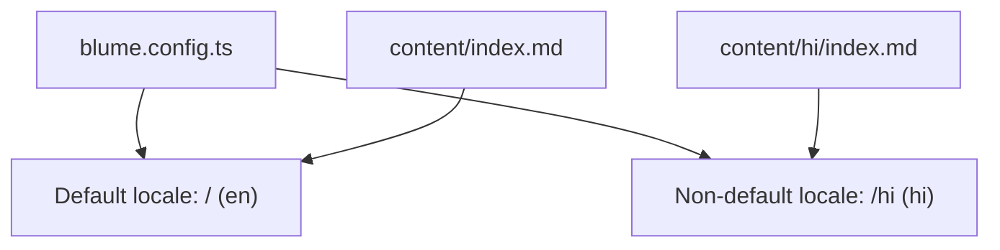
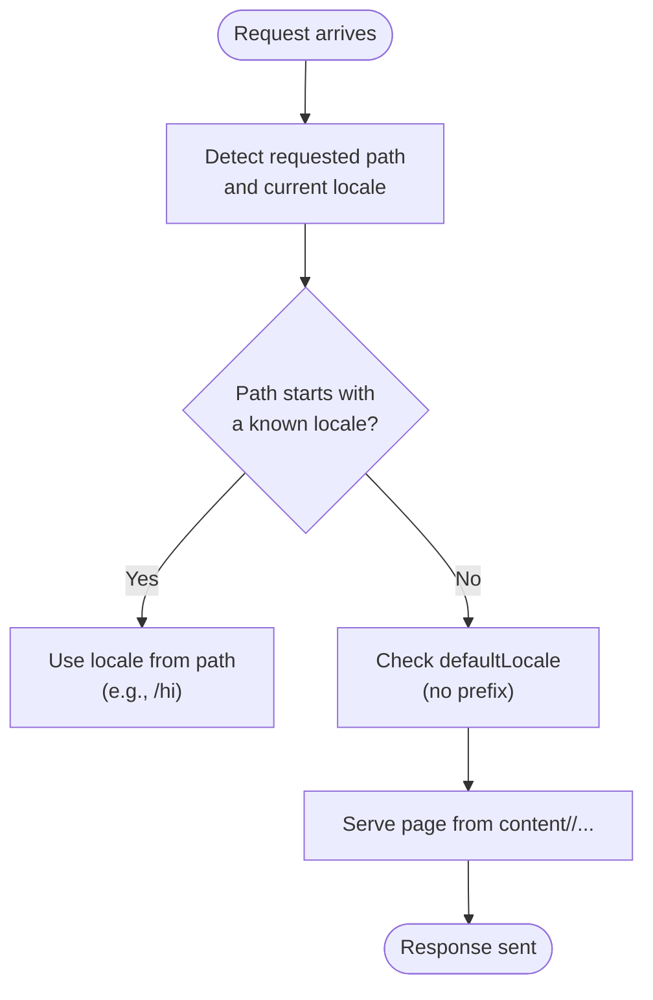
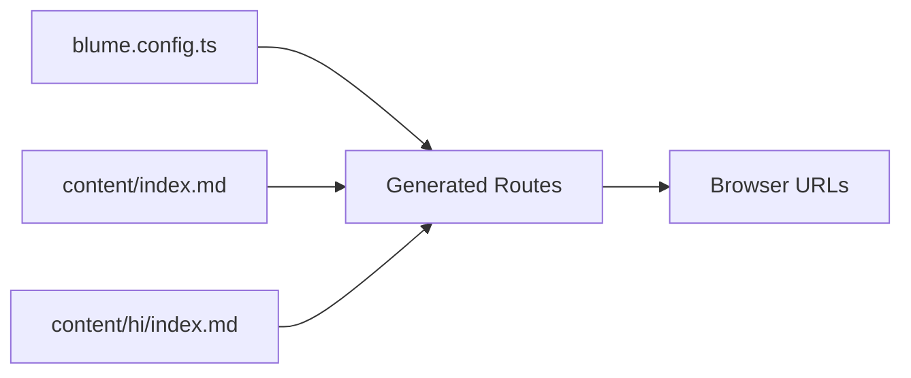

# Internationalization

<cite>
**Referenced Files in This Document**
- [blume.config.ts](file://blume.config.ts)
- [content/index.md](file://content/index.md)
- [content/hi/index.md](file://content/hi/index.md)
- [README.md](file://README.md)
</cite>

## Table of Contents
1. [Introduction](#introduction)
2. [Project Structure](#project-structure)
3. [Core Components](#core-components)
4. [Architecture Overview](#architecture-overview)
5. [Detailed Component Analysis](#detailed-component-analysis)
6. [Dependency Analysis](#dependency-analysis)
7. [Performance Considerations](#performance-considerations)
8. [Troubleshooting Guide](#troubleshooting-guide)
9. [Conclusion](#conclusion)
10. [Appendices](#appendices)

## Introduction
This document explains the internationalization (i18n) system used by FractalWiki, powered by Blume. It covers how English and Hindi locales are configured, how content is organized per locale, how routes are generated, and how fallbacks work. It also provides best practices for managing translations and guidance for implementing language switching and detecting user preferences.

## Project Structure
FractalWiki uses a simple, predictable structure for i18n:
- Default locale content lives directly under content/.
- Additional locales live under content/<locale-code>/, such as content/hi/.
- The site configuration defines supported locales, default/fallback behavior, and labels.

**Diagram sources**
- [blume.config.ts:48-55](file://blume.config.ts#L48-L55)
- [content/index.md:1-39](file://content/index.md#L1-L39)
- [content/hi/index.md:1-22](file://content/hi/index.md#L1-L22)

**Section sources**
- [blume.config.ts:48-55](file://blume.config.ts#L48-L55)
- [content/index.md:1-39](file://content/index.md#L1-L39)
- [content/hi/index.md:1-22](file://content/hi/index.md#L1-L22)

## Core Components
The i18n setup is defined in the site configuration:
- defaultLocale: the base route without prefix (e.g., /).
- fallbackLocale: used when a translation is missing or not available.
- locales: list of supported languages with code and label.

Content organization:
- Default locale pages are placed at content/*.md(x).
- Non-default locale pages are mirrored under content/<code>/*.md(x).

Routing behavior:
- Default locale routes have no prefix (e.g., /index.md → /).
- Non-default locale routes are prefixed with the locale code (e.g., content/hi/index.md → /hi).

Navigation and labels:
- Navigation entries can be localized by mirroring content and using per-locale frontmatter.
- Locale labels are defined in the config for UI elements like language switchers.

**Section sources**
- [blume.config.ts:48-55](file://blume.config.ts#L48-L55)
- [content/index.md:1-39](file://content/index.md#L1-L39)
- [content/hi/index.md:1-22](file://content/hi/index.md#L1-L22)

## Architecture Overview
Blume’s i18n pipeline maps file paths to routes based on the configured locales. The default locale remains unprefixed; all other locales receive a URL prefix derived from their code.

**Diagram sources**
- [blume.config.ts:48-55](file://blume.config.ts#L48-L55)
- [content/index.md:1-39](file://content/index.md#L1-L39)
- [content/hi/index.md:1-22](file://content/hi/index.md#L1-L22)

## Detailed Component Analysis

### i18n Configuration (blume.config.ts)
Key responsibilities:
- Declares defaultLocale and fallbackLocale.
- Registers supported locales with human-readable labels.
- Guides Blume to generate routes accordingly.

Behavioral implications:
- Pages under content/ serve at root-level URLs.
- Pages under content/hi/ serve under /hi/...
- Missing translations fall back to the configured fallbackLocale.

Best practices:
- Keep defaultLocale consistent across environments.
- Ensure every non-default locale has a corresponding directory.
- Use meaningful labels for each locale to improve UX in language switchers.

**Section sources**
- [blume.config.ts:48-55](file://blume.config.ts#L48-L55)

### Content Organization and Routing
- Default locale content: content/index.md maps to /.
- Hindi locale content: content/hi/index.md maps to /hi.
- Mirroring structure ensures clarity and maintainability across languages.

Guidelines:
- Mirror the same hierarchy in each locale directory.
- Keep filenames identical across locales to simplify linking and navigation.
- Use frontmatter title/description per locale for SEO and previews.

**Section sources**
- [content/index.md:1-39](file://content/index.md#L1-L39)
- [content/hi/index.md:1-22](file://content/hi/index.md#L1-L22)

### Language Switching and User Preference Detection
While this repository does not include a built-in language switcher component, you can implement one by:
- Reading the current route and constructing the alternate locale path.
- Persisting the chosen locale in localStorage or a cookie.
- On initial load, detect the browser language and redirect if needed.
- Using the configured locales’ labels to render the language menu.

Recommended flow:
- Detect preferred locale from browser settings.
- If a matching locale exists, navigate to the prefixed route (/hi/...).
- Otherwise, keep the default locale route (/).
- Allow users to override via a language selector that updates the URL and persists the choice.

Note: Implement these patterns in your Svelte components or layout slots.

[No sources needed since this section provides general guidance]

### Best Practices for Managing Translations
- Maintain parallel directories per locale (content/en, content/hi, etc.).
- Keep file names and structures synchronized across locales.
- Centralize shared strings in components where possible; localize only what varies.
- Validate frontmatter fields per locale to ensure consistency.
- Review links and anchors to avoid broken cross-language references.

[No sources needed since this section provides general guidance]

## Dependency Analysis
The i18n behavior depends on:
- blume.config.ts for locale definitions and routing rules.
- content/<locale>/ files for localized content.
- Generated routes produced by Blume based on the above.

**Diagram sources**
- [blume.config.ts:48-55](file://blume.config.ts#L48-L55)
- [content/index.md:1-39](file://content/index.md#L1-L39)
- [content/hi/index.md:1-22](file://content/hi/index.md#L1-L22)

**Section sources**
- [blume.config.ts:48-55](file://blume.config.ts#L48-L55)
- [content/index.md:1-39](file://content/index.md#L1-L39)
- [content/hi/index.md:1-22](file://content/hi/index.md#L1-L22)

## Performance Considerations
- Keep content directories lean and mirror only necessary files per locale.
- Avoid heavy client-side logic for language detection; prefer server-side defaults and minimal redirects.
- Cache locale-specific assets and routes appropriately during builds.

[No sources needed since this section provides general guidance]

## Troubleshooting Guide
Common issues and resolutions:
- Missing locale directory: Ensure content/<locale>/ exists for each non-default locale.
- Incorrect fallback behavior: Verify fallbackLocale matches your intended default.
- Route mismatch: Confirm file names match across locales and that paths align with expected URLs.
- Navigation labels: Check that locale labels are correctly set in the configuration.

**Section sources**
- [blume.config.ts:48-55](file://blume.config.ts#L48-L55)
- [content/index.md:1-39](file://content/index.md#L1-L39)
- [content/hi/index.md:1-22](file://content/hi/index.md#L1-L22)

## Conclusion
FractalWiki’s i18n setup leverages Blume’s configuration to define locales, organize content by language, and generate clean, predictable routes. By mirroring content directories per locale and configuring default/fallback behaviors, you can deliver a robust multilingual experience. Implement language switching and preference detection in your components to enhance usability while maintaining consistency across languages.

[No sources needed since this section summarizes without analyzing specific files]

## Appendices

### Example: Locale-to-Route Mapping
- content/index.md → /
- content/hi/index.md → /hi

**Section sources**
- [content/index.md:1-39](file://content/index.md#L1-L39)
- [content/hi/index.md:1-22](file://content/hi/index.md#L1-L22)

### Example: Locale Labels
- en: English
- hi: हिन्दी

**Section sources**
- [blume.config.ts:48-55](file://blume.config.ts#L48-L55)