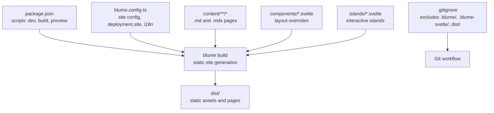
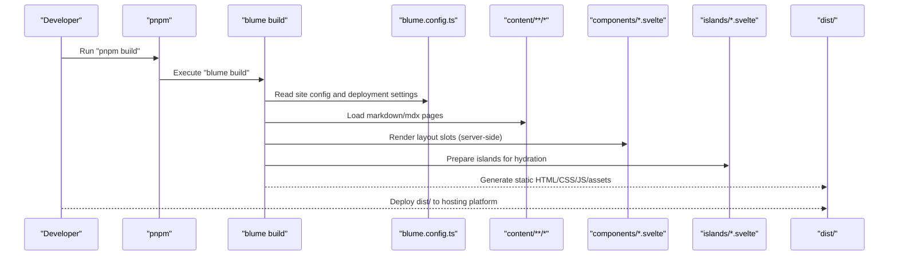
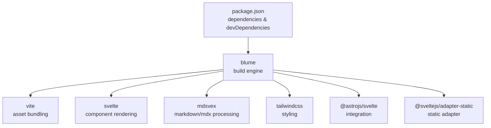

# Deployment

<cite>
**Referenced Files in This Document**
- [package.json](file://package.json)
- [blume.config.ts](file://blume.config.ts)
- [README.md](file://README.md)
- [.gitignore](file://.gitignore)
</cite>

## Table of Contents
1. [Introduction](#introduction)
2. [Project Structure](#project-structure)
3. [Core Components](#core-components)
4. [Architecture Overview](#architecture-overview)
5. [Detailed Component Analysis](#detailed-component-analysis)
6. [Dependency Analysis](#dependency-analysis)
7. [Performance Considerations](#performance-considerations)
8. [Troubleshooting Guide](#troubleshooting-guide)
9. [Conclusion](#conclusion)
10. [Appendices](#appendices)

## Introduction
This document provides comprehensive deployment guidance for FractalWiki projects built with Blume and Svelte components. It explains the static site generation process using the pnpm build command, describes the resulting dist/ output, and outlines deployment options for Vercel, Netlify, GitHub Pages, and traditional hosting. It also covers environment configuration for production builds, asset optimization, caching strategies, CDN best practices, performance tuning, monitoring and analytics setup, CI/CD pipeline integration, automated deployment workflows, security considerations, and SSL certificate management.

## Project Structure
FractalWiki is a Blume-based project that uses Svelte as the component layer. The build system is driven by Blume scripts defined in package.json, which generate a static site into the dist/ directory. The configuration for site metadata, content root, i18n, and deployment base URL lives in blume.config.ts. Generated directories (.blume/, .blume-svelte/) and build artifacts (dist/) are excluded from version control via .gitignore.

**Diagram sources**
- [package.json:1-41](file://package.json#L1-L41)
- [blume.config.ts:1-57](file://blume.config.ts#L1-L57)
- [.gitignore:1-6](file://.gitignore#L1-L6)

**Section sources**
- [package.json:1-41](file://package.json#L1-L41)
- [blume.config.ts:1-57](file://blume.config.ts#L1-L57)
- [README.md:1-124](file://README.md#L1-L124)
- [.gitignore:1-6](file://.gitignore#L1-L6)

## Core Components
- Build scripts: The pnpm build script invokes blume build to produce a static site. Development and preview commands are also available for local iteration.
- Site configuration: blume.config.ts defines title, description, content root, deployment.site (base URL), frontmatter schema, navigation, and i18n locales.
- Content and components: Markdown/MDX files under content/ define pages; Svelte components under components/ override layout slots; interactive islands live under islands/.
- Output: The build generates a dist/ folder containing fully static HTML, CSS, JS, and media ready for any static host or CDN.

Key behaviors:
- Static generation: All pages are pre-rendered to static HTML during build.
- Zero-JS layouts by default: Layout slots render server-side without shipping JavaScript unless explicitly hydrated.
- Islands hydration: Interactive components hydrate on demand based on configured modes.

**Section sources**
- [package.json:1-41](file://package.json#L1-L41)
- [blume.config.ts:1-57](file://blume.config.ts#L1-L57)
- [README.md:1-124](file://README.md#L1-L124)

## Architecture Overview
The build architecture centers around Blume’s static site generator, which reads configuration and content, renders pages with Svelte components, and outputs a static site.

**Diagram sources**
- [package.json:1-41](file://package.json#L1-L41)
- [blume.config.ts:1-57](file://blume.config.ts#L1-L57)
- [README.md:1-124](file://README.md#L1-L124)

## Detailed Component Analysis

### Static Site Generation with pnpm build
- Command: pnpm build executes blume build.
- Input: Reads blume.config.ts, content/**/*.md(x), and Svelte components.
- Output: Produces a fully static dist/ directory suitable for deployment.
- Preview: pnpm preview serves the generated dist/ locally for verification.

Best practices:
- Always run pnpm build before deploying to ensure consistent output.
- Verify the generated dist/ contains expected pages and assets.
- Use pnpm preview to validate routing and links locally.

**Section sources**
- [package.json:1-41](file://package.json#L1-L41)
- [README.md:1-124](file://README.md#L1-L124)

### Environment Configuration for Production Builds
- Base site URL: Set deployment.site in blume.config.ts to your production domain. This affects canonical URLs, sitemap, and social cards.
- Content root: Ensure content.root points to the correct directory (default is docs; this project uses content).
- i18n: Configure defaultLocale, fallbackLocale, and locale entries to match your deployed structure.
- Frontmatter schema: Extend zod schemas for tags, related, source, created, updated as needed.

Production tips:
- Validate all frontmatter fields at build time using zod schemas to catch errors early.
- Keep deployment.site aligned with your actual domain to avoid broken canonicals and social previews.

**Section sources**
- [blume.config.ts:1-57](file://blume.config.ts#L1-L57)

### Asset Optimization and Caching Strategies
- Static assets: All generated assets are immutable and can be cached aggressively.
- Browser caching: Serve static files with long-lived cache headers (e.g., Cache-Control: public, max-age=31536000, immutable) for optimized assets.
- HTML caching: Cache HTML with short TTLs or no-store to reflect updates quickly.
- Compression: Enable gzip or Brotli compression on your CDN/hosting provider.
- Minification: Blume/Vite pipelines typically minify CSS/JS; verify in the generated dist/ output.

**Section sources**
- [README.md:1-124](file://README.md#L1-L124)

### CDN Deployment Best Practices
- Origin: Point your CDN origin to the dist/ directory served by your hosting provider.
- Cache rules:
  - Static assets (CSS/JS/images): Long TTLs with content hashing.
  - HTML: Short TTL or revalidation to ensure fresh content.
- Security: Enforce HTTPS, enable HSTS, and restrict access to sensitive paths if needed.
- Performance: Enable HTTP/2 or HTTP/3, use edge caching, and configure regional distribution.

[No sources needed since this section provides general guidance]

### Monitoring and Analytics Setup
- Add analytics scripts in your layout components or via Blume’s head injection mechanisms.
- Track page views, user interactions, and performance metrics.
- Use structured logging and error tracking for client-side issues.
- Monitor CDN health and latency through provider dashboards.

[No sources needed since this section provides general guidance]

### CI/CD Pipeline Integration and Automated Deployment
- Trigger: On push to main or pull request merges, run pnpm install and pnpm build.
- Artifacts: Publish the dist/ directory to your hosting platform’s artifact store.
- Staging: Create a staging environment with a separate branch and deploy preview builds.
- Rollback: Maintain previous versions of dist/ for quick rollback if needed.

Example workflow steps:
- Install dependencies: pnpm install
- Build site: pnpm build
- Upload dist/: Push to hosting provider (Vercel, Netlify, GitHub Pages, etc.)

[No sources needed since this section provides general guidance]

### Security Considerations for Production Deployments
- HTTPS: Enforce HTTPS across all endpoints.
- Headers: Set security headers (CSP, X-Frame-Options, Referrer-Policy).
- Secrets: Never commit secrets; use environment variables provided by your hosting platform.
- Access control: Restrict access to admin or internal routes if applicable.
- Dependency scanning: Regularly audit dependencies for vulnerabilities.

[No sources needed since this section provides general guidance]

### SSL Certificate Management
- Managed platforms: Use built-in SSL provisioning (Vercel, Netlify, GitHub Pages).
- Custom domains: Configure DNS records and attach custom SSL certificates where supported.
- Rotation: Automate certificate renewal if managing certificates manually.
- Validation: Test SSL configuration using tools like SSL Labs.

[No sources needed since this section provides general guidance]

## Dependency Analysis
The project relies on Blume for static site generation and Svelte for components. Dependencies include Vite, Tailwind CSS, MDX processing, and SvelteKit adapter for static output.

**Diagram sources**
- [package.json:1-41](file://package.json#L1-L41)

**Section sources**
- [package.json:1-41](file://package.json#L1-L41)

## Performance Considerations
- Pre-rendering: All pages are statically generated, ensuring fast initial loads.
- Hydration strategy: Use minimal hydration for islands to reduce client-side overhead.
- Asset size: Optimize images and fonts; leverage modern formats (WebP, AVIF).
- Code splitting: Ensure only necessary code is shipped per page.
- Caching: Implement aggressive caching for static assets and appropriate policies for HTML.

[No sources needed since this section provides general guidance]

## Troubleshooting Guide
Common issues and resolutions:
- Build fails due to invalid frontmatter: Validate frontmatter against zod schemas in blume.config.ts.
- Missing assets: Ensure public/ assets are correctly referenced and included in the build.
- Routing errors: Verify deployment.site matches your domain and check link paths.
- Hydration mismatches: Confirm island hydration modes and props serialization.

Debugging steps:
- Run pnpm build and inspect console output for errors.
- Use pnpm preview to test locally.
- Check browser network tab for failed asset requests.
- Validate HTML and CSS in the generated dist/ directory.

**Section sources**
- [blume.config.ts:1-57](file://blume.config.ts#L1-L57)
- [README.md:1-124](file://README.md#L1-L124)

## Conclusion
FractalWiki leverages Blume and Svelte to deliver high-performance static sites with flexible componentization. By following the deployment guidelines outlined here—covering build processes, environment configuration, CDN strategies, monitoring, CI/CD, security, and SSL—you can reliably ship production-ready sites across various hosting platforms. Consistent adherence to these practices ensures optimal performance, reliability, and maintainability.

[No sources needed since this section summarizes without analyzing specific files]

## Appendices

### Deployment Options Summary
- Vercel: Connect repository, set build command to pnpm build, deploy dist/.
- Netlify: Configure build command and publish directory as dist/.
- GitHub Pages: Use actions to build and deploy dist/ to gh-pages branch.
- Traditional hosting: Upload dist/ contents to your web server (Nginx/Apache).

[No sources needed since this section provides general guidance]