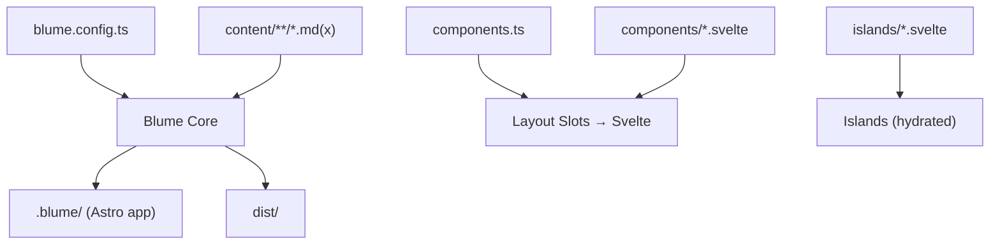
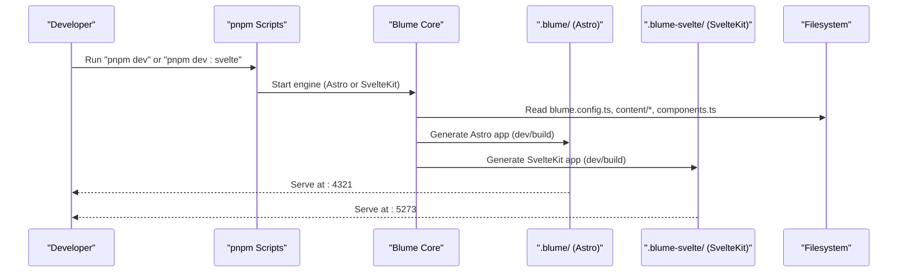
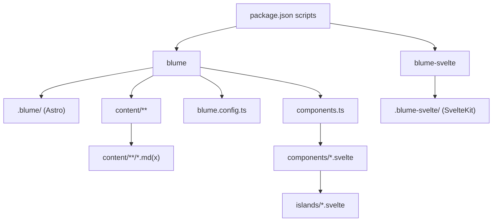

# Getting Started

<cite>
**Referenced Files in This Document**
- [README.md](file://README.md)
- [package.json](file://package.json)
- [blume.config.ts](file://blume.config.ts)
- [components.ts](file://components.ts)
- [content/index.md](file://content/index.md)
- [content/components.mdx](file://content/components.mdx)
- [content/svelte-layer.mdx](file://content/svelte-layer.mdx)
- [islands/Counter.svelte](file://islands/Counter.svelte)
- [components/PageHeader.svelte](file://components/PageHeader.svelte)
- [components/Footer.svelte](file://components/Footer.svelte)
- [components/Logo.svelte](file://components/Logo.svelte)
</cite>

## Table of Contents
1. [Introduction](#introduction)
2. [Project Structure](#project-structure)
3. [Core Components](#core-components)
4. [Architecture Overview](#architecture-overview)
5. [Detailed Component Analysis](#detailed-component-analysis)
6. [Dependency Analysis](#dependency-analysis)
7. [Performance Considerations](#performance-considerations)
8. [Troubleshooting Guide](#troubleshooting-guide)
9. [Conclusion](#conclusion)

## Introduction
Blume is a documentation framework that lets you run the same content and configuration on two engines: Astro and SvelteKit. In this project, Blume owns routing, content collections, markdown/MDX, sidebar, table of contents, search, theming, and more. The only change is the component layer: wherever Blume would use an Astro component, this site supplies a Svelte one instead. You keep one codebase and switch engines via scripts.

Key points:
- One config file drives both engines.
- Content lives in a single directory and is read by both engines.
- Layout slots are mapped to Svelte components; islands provide interactivity in MDX pages.

**Section sources**
- [README.md:1-18](file://README.md#L1-L18)
- [blume.config.ts:1-13](file://blume.config.ts#L1-L13)

## Project Structure
This project organizes content, layout overrides, and interactive islands in clear directories:

- blume.config.ts: Site configuration, frontmatter schema, navigation, i18n
- components.ts: Maps Blume layout slots to Svelte components
- components/*.svelte: Server-rendered layout overrides (zero JS by default)
- islands/*.svelte: Hydrated interactive components for .mdx pages
- content/**/*.md(x): Your documentation pages
- .blume/: Generated Astro app (do not edit or commit)
- dist/: Build output

**Diagram sources**
- [blume.config.ts:14-56](file://blume.config.ts#L14-L56)
- [components.ts:1-27](file://components.ts#L1-L27)
- [content/index.md:28-38](file://content/index.md#L28-L38)

**Section sources**
- [content/index.md:28-38](file://content/index.md#L28-L38)
- [README.md:101-111](file://README.md#L101-L111)

## Core Components
Blume exposes two first-class surfaces for customization with Svelte:

- Layout slots: Static, server-rendered components that replace Blume’s built-in shell parts. They receive props from Blume and ship no JavaScript unless explicitly requested.
- Islands: Any PascalCase .svelte file under islands/ becomes a globally available component in .mdx pages. They hydrate on the client with a default mode of visible.

How they work together:
- components.ts maps slot names to your .svelte files.
- Islands are auto-discovered and can be used in any .mdx without imports.
- Blume infers the framework from .svelte and enables the appropriate renderer automatically.

**Section sources**
- [components.ts:1-27](file://components.ts#L1-L27)
- [README.md:40-86](file://README.md#L40-L86)

## Architecture Overview
The site runs on two engines from the same source tree. Blume generates engine-specific apps while keeping content and configuration shared.

**Diagram sources**
- [package.json:5-15](file://package.json#L5-L15)
- [README.md:5-14](file://README.md#L5-L14)
- [blume.config.ts:14-56](file://blume.config.ts#L14-L56)

## Detailed Component Analysis

### Installation and Initial Setup
- Prerequisites: Node.js and pnpm installed locally.
- Install dependencies using pnpm.
- Verify installation by running the development commands for each engine.

Commands:
- pnpm dev → starts the Astro engine
- pnpm dev:svelte → starts the SvelteKit engine

What happens behind the scenes:
- Blume reads blume.config.ts and content/ to build the site.
- For Astro, it generates .blume/.
- For SvelteKit, it generates .blume-svelte/.

**Section sources**
- [package.json:5-15](file://package.json#L5-L15)
- [README.md:5-14](file://README.md#L5-L14)

### Development Workflow
- Use pnpm dev for the Astro engine. It serves the site with Svelte components as the layout layer.
- Use pnpm dev:svelte for the SvelteKit engine. It serves the same content with SvelteKit hydration.

Build and preview:
- pnpm build → builds for Astro
- pnpm build:svelte → builds for SvelteKit
- pnpm preview → previews the Astro build

**Section sources**
- [package.json:5-15](file://package.json#L5-L15)
- [README.md:34-38](file://README.md#L34-L38)

### How components.ts Maps Layout Slots
components.ts uses defineComponents to map Blume’s layout slots to your Svelte components. This is where you swap Astro defaults with your own Svelte implementations.

Slots you can override include Logo, PageHeader, Footer, Header, Sidebar, MobileNav, Breadcrumbs, TableOfContents, Pagination, PageFooter, Feedback, and Search.

- Layout slots render on the server and ship no JavaScript unless you opt into a client mode.
- Islands are separate from layout slots and live under islands/.

**Section sources**
- [components.ts:1-27](file://components.ts#L1-L27)
- [README.md:44-71](file://README.md#L44-L71)

### Creating Your First Page
Pages live under content/. Add a new .md or .mdx file to create a page. Use .mdx when you need islands or MDX components.

Example steps:
- Create content/my-first-page.md or content/my-first-page.mdx
- Write your content with frontmatter (title, description, tags, etc.)
- Navigate to the route matching the file path

You can reference existing pages like index.md and svelte-layer.mdx to see examples of structure and usage.

**Section sources**
- [content/index.md:1-14](file://content/index.md#L1-L14)
- [content/svelte-layer.mdx:1-10](file://content/svelte-layer.mdx#L1-L10)
- [README.md:113-119](file://README.md#L113-L119)

### Adding Interactive Islands
Any PascalCase .svelte file under islands/ becomes a component usable in any .mdx page without importing it. By default, islands hydrate when scrolled into view (client:visible). You can customize hydration per island.

Practical example:
- islands/Counter.svelte is available as <Counter /> in .mdx
- Pass props like start and label
- Default hydration is client:visible; set export const client to "load", "idle", or "only" if needed

Hydration modes:
- visible (default): hydrates when scrolled into view
- load: hydrates immediately
- idle: hydrates on browser idle
- only: client-only, never server-rendered

**Section sources**
- [islands/Counter.svelte:1-15](file://islands/Counter.svelte#L1-L15)
- [content/svelte-layer.mdx:11-37](file://content/svelte-layer.mdx#L11-L37)
- [README.md:73-86](file://README.md#L73-L86)

### Layout Slot Examples
- Logo.svelte: Replaces the site logo in the header; receives site and logo props
- PageHeader.svelte: Renders above the article body; receives page, route, headings
- Footer.svelte: Adds a footer with site title and year; receives site, navigation, ui

These components are static by default and do not ship JavaScript unless you request client hydration.

**Section sources**
- [components/Logo.svelte:1-18](file://components/Logo.svelte#L1-L18)
- [components/PageHeader.svelte:1-20](file://components/PageHeader.svelte#L1-L20)
- [components/Footer.svelte:1-12](file://components/Footer.svelte#L1-L12)

## Dependency Analysis
The project depends on Blume and Svelte tooling to enable dual-engine support. Scripts in package.json wire Blume and Blume Svelte to pnpm commands.

**Diagram sources**
- [package.json:5-15](file://package.json#L5-L15)
- [blume.config.ts:14-56](file://blume.config.ts#L14-L56)
- [components.ts:1-27](file://components.ts#L1-L27)

**Section sources**
- [package.json:16-39](file://package.json#L16-L39)

## Performance Considerations
- Layout slots are server-rendered and ship zero JavaScript by default.
- Islands hydrate on demand (visible by default), minimizing initial payload.
- Only islands actually used on a page get their JavaScript shipped.
- Avoid unnecessary client hydration; prefer static rendering for layout slots unless interactivity is required.

[No sources needed since this section provides general guidance]

## Troubleshooting Guide
Common setup issues and resolutions:

- pnpm commands not found
  - Ensure pnpm is installed and available in your PATH.
  - Run pnpm install before dev commands.

- Engines not starting
  - Confirm dependencies are installed.
  - Check that blume and blume-svelte are present in package.json scripts.

- Islands not appearing in MDX
  - Ensure the file is under islands/ and named with PascalCase.
  - Use the component name exactly as the filename in .mdx.

- Props not passing through
  - Island props must be serializable.
  - Verify prop types match what the component expects.

- Layout slots not rendering
  - Confirm registration in components.ts under layout.
  - Check that the .svelte file exists and exports correctly.

- Astro-only virtual modules in Svelte slots
  - Do not import blume:data or astro:content in .svelte slots.
  - Use props or blume/hooks when hydrated to access data.

- Port conflicts
  - Astro engine typically uses port 4321; SvelteKit engine uses 5273.
  - If ports are busy, stop other processes or adjust environment.

**Section sources**
- [README.md:87-100](file://README.md#L87-L100)
- [content/svelte-layer.mdx:25-37](file://content/svelte-layer.mdx#L25-L37)

## Conclusion
With Blume, you maintain a single codebase for documentation and run it on both Astro and SvelteKit. Configure once in blume.config.ts, author content in content/, and customize the UI with Svelte components. Use layout slots for static overrides and islands for interactivity. With pnpm dev and pnpm dev:svelte, you can develop against either engine seamlessly.

[No sources needed since this section summarizes without analyzing specific files]