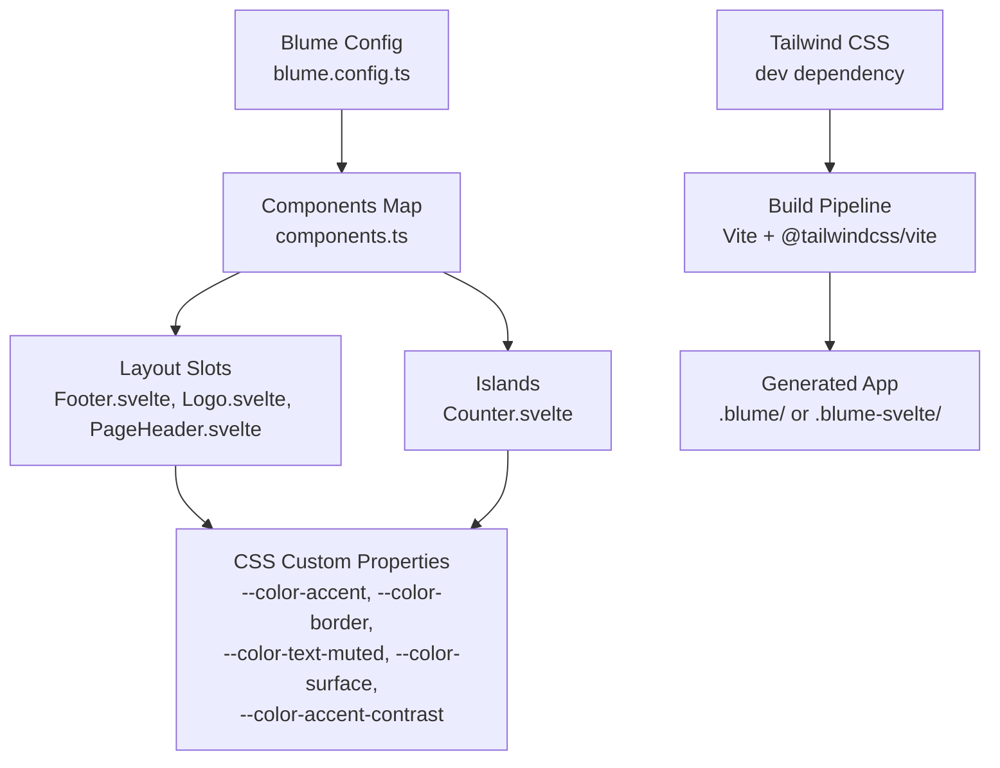
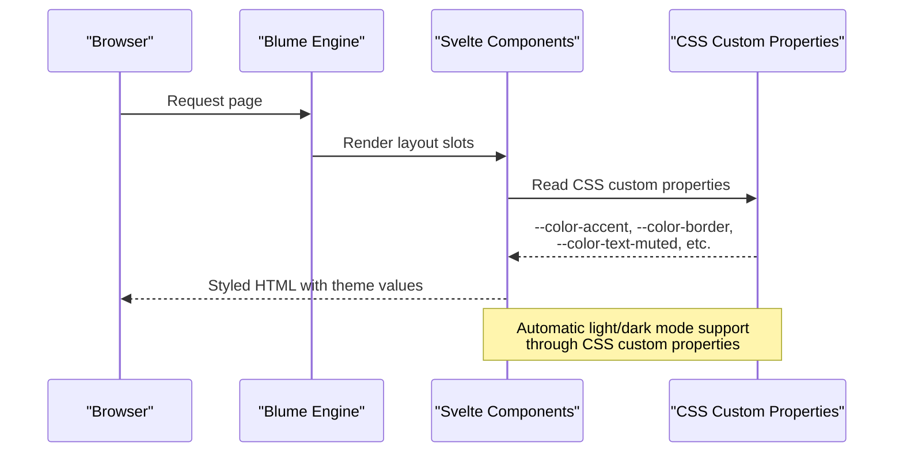
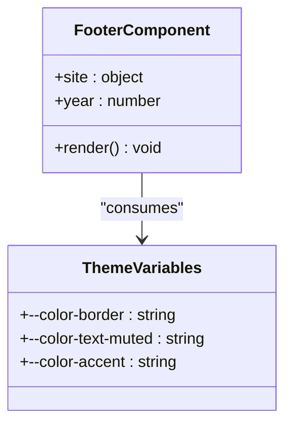
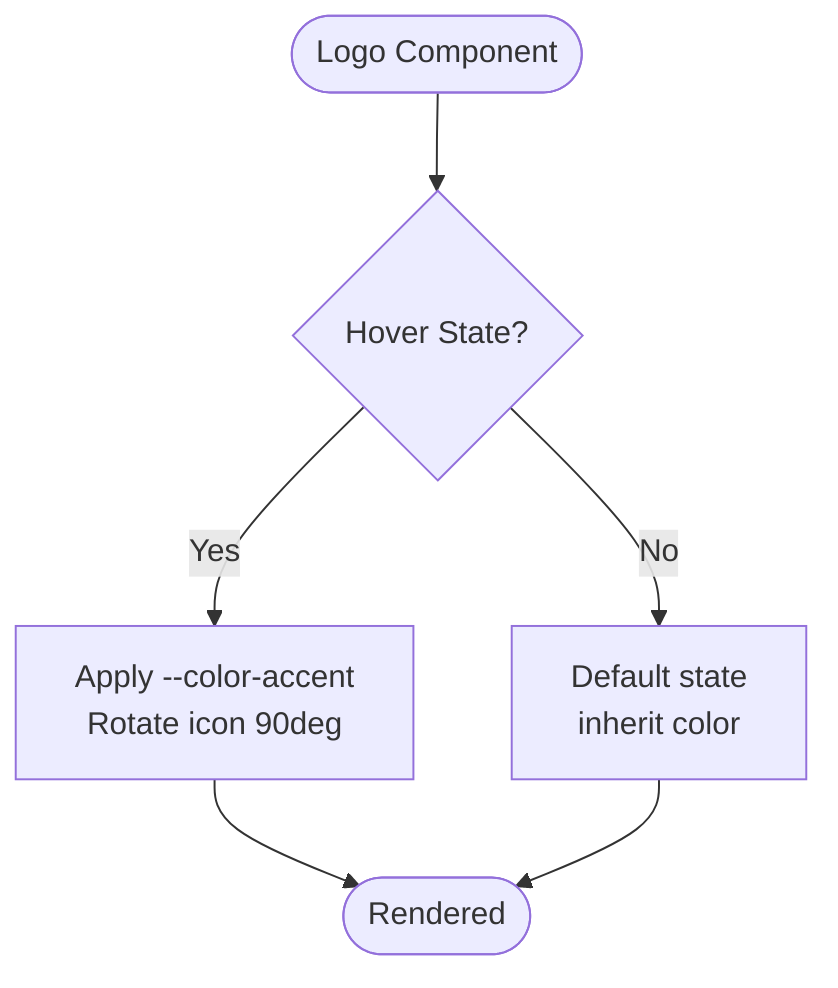
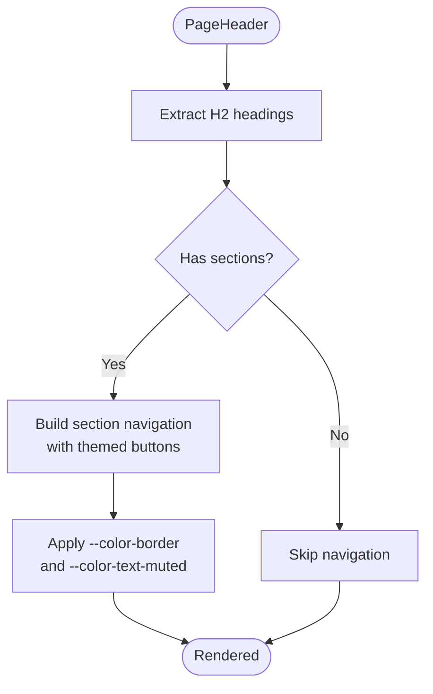
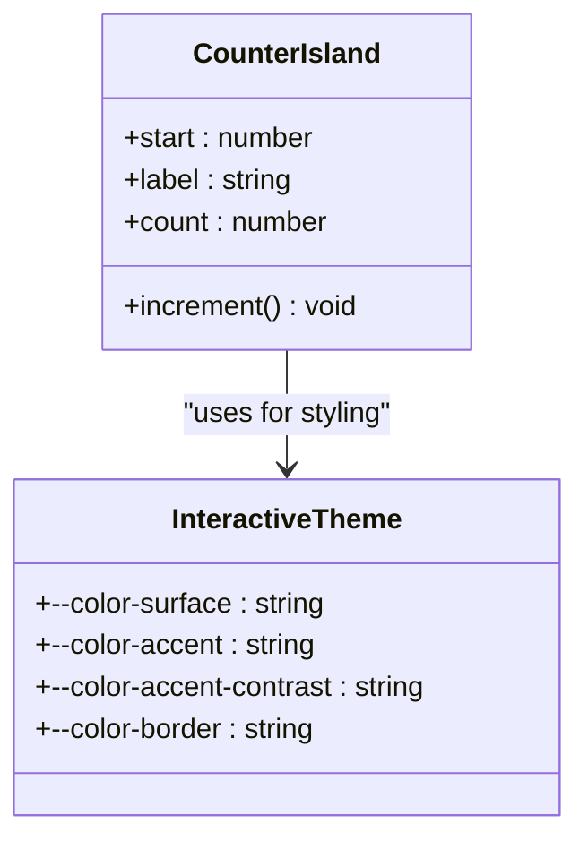
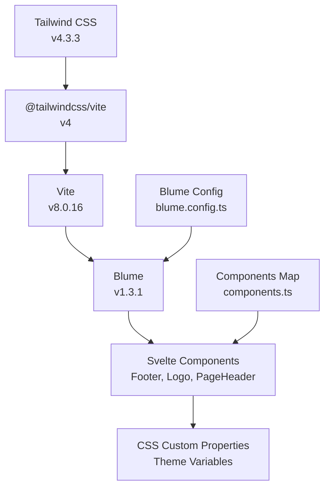

# Styling and Theming

<cite>
**Referenced Files in This Document**
- [package.json](file://package.json)
- [blume.config.ts](file://blume.config.ts)
- [components.ts](file://components.ts)
- [README.md](file://README.md)
- [components/Footer.svelte](file://components/Footer.svelte)
- [components/Logo.svelte](file://components/Logo.svelte)
- [components/PageHeader.svelte](file://components/PageHeader.svelte)
- [islands/Counter.svelte](file://islands/Counter.svelte)
</cite>

## Table of Contents
1. [Introduction](#introduction)
2. [Project Structure](#project-structure)
3. [Core Components](#core-components)
4. [Architecture Overview](#architecture-overview)
5. [Detailed Component Analysis](#detailed-component-analysis)
6. [Dependency Analysis](#dependency-analysis)
7. [Performance Considerations](#performance-considerations)
8. [Troubleshooting Guide](#troubleshooting-guide)
9. [Conclusion](#conclusion)
10. [Appendices](#appendices)

## Introduction
This document explains how styling and theming work in FractalWiki, focusing on:
- Tailwind CSS integration via the build toolchain
- Utility-first styling approach used by Blume and Svelte components
- CSS custom properties system for theming (--color-accent, --color-border, --color-text-muted, etc.)
- How Svelte components consume theme variables to support automatic light/dark mode
- Responsive design patterns and mobile-first practices
- Customizing existing components and creating new styled components
- Best practices for consistent design tokens across the application
- Cross-browser compatibility considerations and performance optimization techniques for styles

The project uses Blume with Svelte as the component layer. Blume provides a theming system based on CSS custom properties that components consume directly. Tailwind CSS is available through the dev dependencies and can be integrated into the build pipeline.

## Project Structure
FractalWiki organizes styling and theming around:
- Blume configuration for site settings and content structure
- Svelte components for layout slots and islands
- CSS custom properties consumed by components for theming
- Tailwind CSS utilities available through the build toolchain

**Diagram sources**
- [blume.config.ts:1-57](file://blume.config.ts#L1-L57)
- [components.ts:1-27](file://components.ts#L1-L27)
- [package.json:1-41](file://package.json#L1-L41)

**Section sources**
- [blume.config.ts:1-57](file://blume.config.ts#L1-L57)
- [components.ts:1-27](file://components.ts#L1-L27)
- [package.json:1-41](file://package.json#L1-L41)

## Core Components
The styling system centers around Svelte components that consume CSS custom properties for theming. Each component uses utility classes and CSS custom properties to maintain consistent visual design.

Key styling patterns observed:
- CSS custom properties for colors and themes
- Flexbox and Grid layouts for responsive design
- Semantic class naming conventions (BEM-like)
- Hover states and transitions for interactivity
- Mobile-first responsive patterns

**Section sources**
- [components/Footer.svelte:1-30](file://components/Footer.svelte#L1-L30)
- [components/Logo.svelte:1-50](file://components/Logo.svelte#L1-L50)
- [components/PageHeader.svelte:1-76](file://components/PageHeader.svelte#L1-L76)
- [islands/Counter.svelte:1-45](file://islands/Counter.svelte#L1-L45)

## Architecture Overview
The styling architecture follows a layered approach where Blume provides the theming foundation and Svelte components consume theme variables.

**Diagram sources**
- [components.ts:1-27](file://components.ts#L1-L27)
- [components/Footer.svelte:14-29](file://components/Footer.svelte#L14-L29)
- [components/Logo.svelte:20-49](file://components/Logo.svelte#L20-L49)
- [components/PageHeader.svelte:33-75](file://components/PageHeader.svelte#L33-L75)
- [islands/Counter.svelte:16-44](file://islands/Counter.svelte#L16-L44)

## Detailed Component Analysis

### Footer Component
The Footer component demonstrates basic theming with CSS custom properties for borders and text colors.

**Diagram sources**
- [components/Footer.svelte:1-30](file://components/Footer.svelte#L1-L30)

**Section sources**
- [components/Footer.svelte:1-30](file://components/Footer.svelte#L1-L30)

### Logo Component
The Logo component shows interactive theming with hover effects and accent color usage.

**Diagram sources**
- [components/Logo.svelte:20-49](file://components/Logo.svelte#L20-L49)

**Section sources**
- [components/Logo.svelte:1-50](file://components/Logo.svelte#L1-L50)

### PageHeader Component
The PageHeader component implements section navigation with themed button styles.

**Diagram sources**
- [components/PageHeader.svelte:1-76](file://components/PageHeader.svelte#L1-L76)

**Section sources**
- [components/PageHeader.svelte:1-76](file://components/PageHeader.svelte#L1-L76)

### Counter Island Component
The Counter island demonstrates interactive theming with background and accent colors.

**Diagram sources**
- [islands/Counter.svelte:1-45](file://islands/Counter.svelte#L1-L45)

**Section sources**
- [islands/Counter.svelte:1-45](file://islands/Counter.svelte#L1-L45)

## Dependency Analysis
The styling dependencies show how Tailwind CSS integrates with the Blume theming system.

**Diagram sources**
- [package.json:16-39](file://package.json#L16-L39)
- [blume.config.ts:1-57](file://blume.config.ts#L1-L57)
- [components.ts:1-27](file://components.ts#L1-L27)

**Section sources**
- [package.json:16-39](file://package.json#L16-L39)
- [blume.config.ts:1-57](file://blume.config.ts#L1-L57)
- [components.ts:1-27](file://components.ts#L1-L27)

## Performance Considerations
Several performance optimizations are evident in the styling approach:

1. **CSS Custom Properties**: Efficient theme switching without JavaScript overhead
2. **Utility Classes**: Minimal CSS footprint through Tailwind's utility-first approach
3. **Server-Side Rendering**: Layout slots render statically without client-side JavaScript
4. **Selective Hydration**: Islands only hydrate when needed
5. **CSS Transitions**: Hardware-accelerated animations using transform properties

Best practices observed:
- Using `currentColor` for SVG elements to inherit theme colors
- Implementing smooth transitions with `ease-out` timing functions
- Leveraging CSS Grid and Flexbox for efficient layouts
- Avoiding expensive CSS selectors and complex animations

## Troubleshooting Guide
Common styling issues and solutions:

### Theme Variables Not Applying
- Ensure CSS custom properties are properly defined in the theme
- Verify component imports are correct
- Check browser developer tools for CSS variable values

### Dark Mode Issues
- Confirm theme.css is properly configured in blume.config.ts
- Verify CSS custom properties have appropriate fallback values
- Test both light and dark modes thoroughly

### Responsive Design Problems
- Use mobile-first media queries
- Test on various screen sizes
- Ensure flexbox and grid layouts adapt correctly

### Performance Issues
- Monitor CSS bundle size
- Check for unused CSS rules
- Optimize images and assets

**Section sources**
- [README.md:120-124](file://README.md#L120-L124)

## Conclusion
FractalWiki's styling system combines Blume's CSS custom properties theming with Svelte components and Tailwind CSS utilities. The approach provides:

- Consistent design tokens through CSS custom properties
- Automatic light/dark mode support
- Responsive, mobile-first layouts
- Performant rendering with minimal JavaScript
- Easy customization and extension

The system maintains design consistency while allowing flexibility for component-specific styling needs.

## Appendices

### CSS Custom Properties Reference
The following CSS custom properties are used throughout the application:

- `--color-accent`: Primary accent color for interactive elements
- `--color-border`: Border color for dividers and outlines
- `--color-text-muted`: Secondary text color for less prominent content
- `--color-surface`: Background color for cards and elevated surfaces
- `--color-accent-contrast`: Text color for contrast against accent backgrounds

### Tailwind CSS Integration
Tailwind CSS is available through the development dependencies and can be integrated into the build pipeline using @tailwindcss/vite. Components can use Tailwind utility classes alongside CSS custom properties for maximum flexibility.

### Creating New Styled Components
When creating new components:
1. Use semantic class names (BEM-like pattern)
2. Consume CSS custom properties for theming
3. Implement responsive design patterns
4. Add appropriate hover states and transitions
5. Ensure accessibility with proper ARIA attributes

**Section sources**
- [components/Footer.svelte:14-29](file://components/Footer.svelte#L14-L29)
- [components/Logo.svelte:20-49](file://components/Logo.svelte#L20-L49)
- [components/PageHeader.svelte:33-75](file://components/PageHeader.svelte#L33-L75)
- [islands/Counter.svelte:16-44](file://islands/Counter.svelte#L16-L44)
- [README.md:120-124](file://README.md#L120-L124)