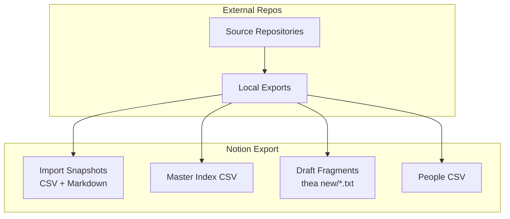
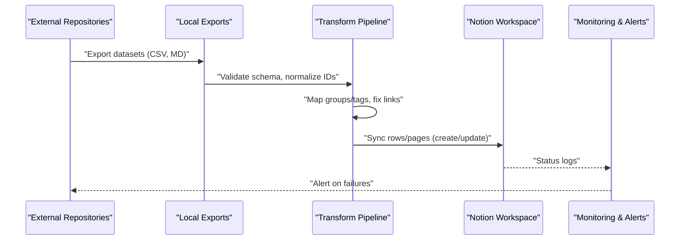
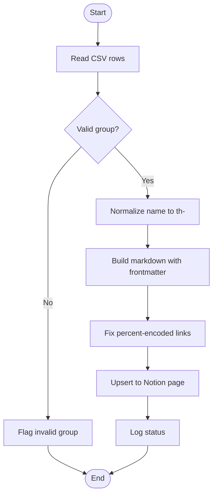
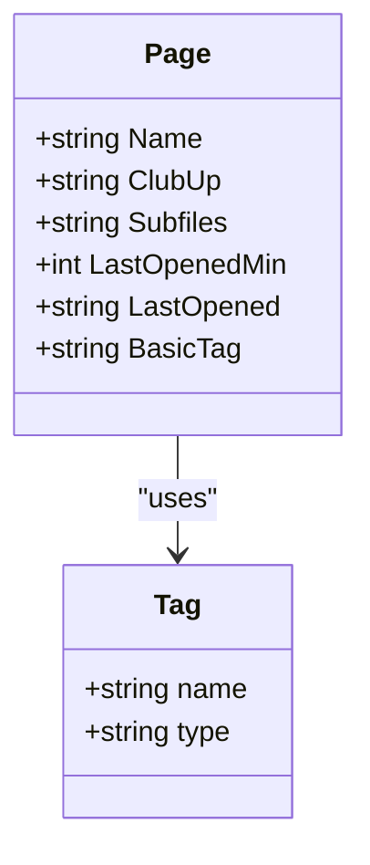
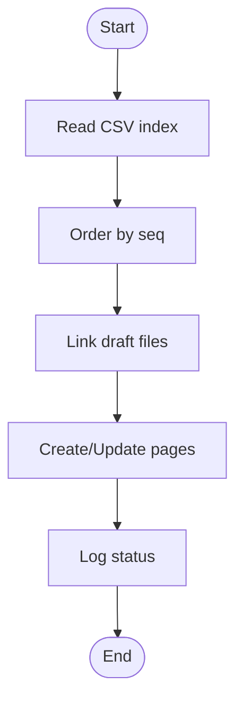
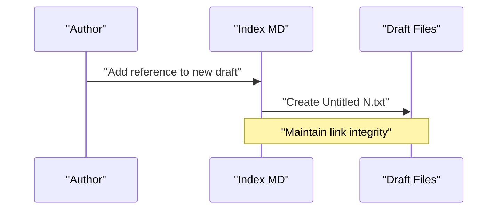
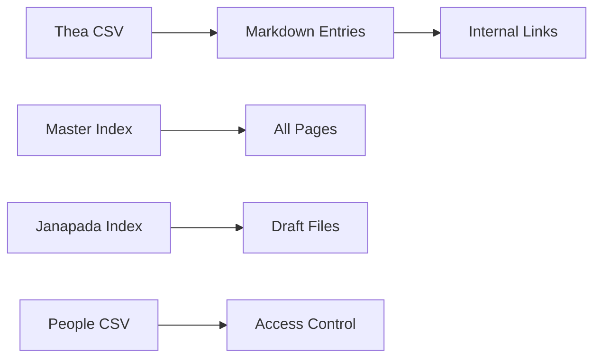

<cite>
**Referenced Files in This Document**
- [Import Dec 25, 2023/thea 8072cc1420e642d4b045662ad8696b9c.csv](file://Import%20Dec%2025,%202023/thea%208072cc1420e642d4b045662ad8696b9c.csv)
- [Import Feb 29, 2024 eef0dda8867d4abb831ef06350ab8b83.md](file://Import%20Feb%2029,%202024%20eef0dda8867d4abb831ef06350ab8b83.md)
- [People d3d39a66987f82dfb0d8014512d331ec.csv](file://People%20d3d39a66987f82dfb0d8014512d331ec.csv)
- [home/master_db ccb3b10abf3c4fe4838b0e02ad8db60d.csv](file://home/master_db%20ccb3b10abf3c4fe4838b0e02ad8db60d.csv)
- [home/janapada 1994c68933794698bdb2cccf31c9e098.csv](file://home/janapada%201994c68933794698bdb2cccf31c9e098.csv)
- [home/thea new 16f89de71c7b44f28dacd9a43ee03879.md](file://home/thea%20new%2016f89de71c7b44f28dacd9a43ee03879.md)
- [Import Dec 25, 2023/thea/th-thea 83e598c8fbdd41c3a4070759372d47ba.md](file://Import%20Dec%2025,%202023/thea/th-thea%2083e598c8fbdd41c3a4070759372d47ba.md)
- [Import Dec 25, 2023/thea/th-abudhagaja 3c50bd2b2d684aafbf7c0a3f14d15b18.md](file://Import%20Dec%2025,%202023/thea/th-abudhagaja%203c50bd2b2d684aafbf7c0a3f14d15b18.md)
- [home/master_db/01 Madhyasth Darshan for Global Peace 0b9b412a599b4715ac1b83eecf1c240a.md](file://home/master_db/01%20Madhyasth%20Darshan%20for%20Global%20Peace%200b9b412a599b4715ac1b83eecf1c240a.md)
- [home/janapada/prologue 736d1474d6b44a02b7d404330b2fe4ed.md](file://home/janapada/prologue%20736d1474d6b44a02b7d404330b2fe4ed.md)
</cite>

## Table of Contents
1. Introduction
2. Project Structure
3. Core Components
4. Architecture Overview
5. Detailed Component Analysis
6. Dependency Analysis
7. Performance Considerations
8. Troubleshooting Guide
9. Conclusion

## Introduction
This document describes the academic data synchronization processes between external repositories and the Notion workspace exported here. The repository is a Notion export containing three distinct corpora:
- Thea science-fiction lore (flat metadata markdown entries and CSV exports)
- Jeevan Vidya / Madhyasth Darshan philosophy and research notes (number-prefixed pages with rich metadata)
- Narrative story drafts (janapada)

The goal is to define automated sync workflows, data transformation pipelines, conflict resolution strategies, version control practices, backup and recovery procedures, monitoring and alerting, and performance optimization for large-scale imports and frequent incremental updates.

## Project Structure
The workspace contains:
- Import snapshots (dated folders) with CSV database exports and per-page markdown files
- A master index CSV that catalogs pages, tags, last opened timestamps, and relationships
- Draft fragments for thea content under home/thea new
- People directory with user records

**Diagram sources**
- [Import Dec 25, 2023/thea 8072cc1420e642d4b045662ad8696b9c.csv:1-112](file://Import%20Dec%2025,%202023/thea%208072cc1420e642d4b045662ad8696b9c.csv#L1-L112)
- [home/master_db ccb3b10abf3c4fe4838b0e02ad8db60d.csv:1-385](file://home/master_db%20ccb3b10abf3c4fe4838b0e02ad8db60d.csv#L1-L385)
- [home/thea new 16f89de71c7b44f28dacd9a43ee03879.md:1-233](file://home/thea%20new%2016f89de71c7b44f28dacd9a43ee03879.md#L1-L233)
- [People d3d39a66987f82dfb0d8014512d331ec.csv:1-4](file://People%20d3d39a66987f82dfb0d8014512d331ec.csv#L1-L4)

**Section sources**
- [Import Dec 25, 2023/thea 8072cc1420e642d4b045662ad8696b9c.csv:1-112](file://Import%20Dec%2025,%202023/thea%208072cc1420e642d4b045662ad8696b9c.csv#L1-L112)
- [home/master_db ccb3b10abf3c4fe4838b0e02ad8db60d.csv:1-385](file://home/master_db%20ccb3b10abf3c4fe4838b0e02ad8db60d.csv#L1-L385)
- [home/thea new 16f89de71c7b44f28dacd9a43ee03879.md:1-233](file://home/thea%20new%2016f89de71c7b44f28dacd9a43ee03879.md#L1-L233)
- [People d3d39a66987f82dfb0d8014512d331ec.csv:1-4](file://People%20d3d39a66987f82dfb0d8014512d331ec.csv#L1-L4)

## Core Components
- Thea Lore Corpus: Flat metadata markdown entries prefixed th- and a CSV table defining Name, group, description, Tags. Group is the canonical taxonomy (places, fauna, species, technology, culture, theology).
- Master Index: A comprehensive CSV listing page names, club up relationships, subfiles, last opened timestamps, and basic tags used across the workspace.
- Janapada Narrative Corpus: Story drafts organized by sequence and title, with a small CSV index.
- People Directory: User records with email addresses.

Key responsibilities:
- Maintain canonical identifiers and taxonomy consistency across markdown and CSV exports
- Preserve original terms verbatim (sanatana sarvatra, prakas, vinagas, dirghams, janapada, Madhyasth Darshan)
- Ensure internal links are valid or mapped to correct targets after import/export

**Section sources**
- [Import Dec 25, 2023/thea 8072cc1420e642d4b045662ad8696b9c.csv:1-112](file://Import%20Dec%2025,%202023/thea%208072cc1420e642d4b045662ad8696b9c.csv#L1-L112)
- [home/master_db ccb3b10abf3c4fe4838b0e02ad8db60d.csv:1-385](file://home/master_db%20ccb3b10abf3c4fe4838b0e02ad8db60d.csv#L1-L385)
- [home/janapada 1994c68933794698bdb2cccf31c9e098.csv:1-5](file://home/janapada%201994c68933794698bdb2cccf31c9e098.csv#L1-L5)
- [People d3d39a66987f82dfb0d8014512d331ec.csv:1-4](file://People%20d3d39a66987f82dfb0d8014512d331ec.csv#L1-L4)

## Architecture Overview
The synchronization architecture connects external repositories to local exports and then to the Notion workspace via structured transformations.

[No sources needed since this diagram shows conceptual workflow, not actual code structure]

## Detailed Component Analysis

### Thea Lore Sync Pipeline
- Source format: CSV table with columns Name, group, description, Tags; corresponding markdown files with YAML-like frontmatter fields (description, group, Tags) and prose body.
- Canonical taxonomy: group field defines categories such as places, fauna, species, technology, culture, theology.
- Transformation steps:
  - Normalize filenames to th-<slug>
  - Validate group values against allowed taxonomy
  - Merge CSV metadata into markdown frontmatter
  - Fix percent-encoded internal links
  - Deduplicate entries by Name

**Diagram sources**
- [Import Dec 25, 2023/thea 8072cc1420e642d4b045662ad8696b9c.csv:1-112](file://Import%20Dec%2025,%202023/thea%208072cc1420e642d4b045662ad8696b9c.csv#L1-L112)
- [Import Dec 25, 2023/thea/th-thea 83e598c8fbdd41c3a4070759372d47ba.md:1-6](file://Import%20Dec%2025,%202023/thea/th-thea%2083e598c8fbdd41c3a4070759372d47ba.md#L1-L6)
- [Import Dec 25, 2023/thea/th-abudhagaja 3c50bd2b2d684aafbf7c0a3f14d15b18.md:1-7](file://Import%20Dec%2025,%202023/thea/th-abudhagaja%203c50bd2b2d684aafbf7c0a3f14d15b18.md#L1-L7)

**Section sources**
- [Import Dec 25, 2023/thea 8072cc1420e642d4b045662ad8696b9c.csv:1-112](file://Import%20Dec%2025,%202023/thea%208072cc1420e642d4b045662ad8696b9c.csv#L1-L112)
- [Import Dec 25, 2023/thea/th-thea 83e598c8fbdd41c3a4070759372d47ba.md:1-6](file://Import%20Dec%2025,%202023/thea/th-thea%2083e598c8fbdd41c3a4070759372d47ba.md#L1-L6)
- [Import Dec 25, 2023/thea/th-abudhagaja 3c50bd2b2d684aafbf7c0a3f14d15b18.md:1-7](file://Import%20Dec%2025,%202023/thea/th-abudhagaja%203c50bd2b2d684aafbf7c0a3f14d15b18.md#L1-L7)

### Master Index Maintenance
- Purpose: Track pages, relationships (Club Up), subfiles, last opened timestamps, and Basic Tag assignments.
- Responsibilities:
  - Keep Basic Tag taxonomy consistent
  - Maintain Club Up cross-references
  - Record Last Opened timestamps for activity tracking
  - Support search and navigation across the corpus

**Diagram sources**
- [home/master_db ccb3b10abf3c4fe4838b0e02ad8db60d.csv:1-385](file://home/master_db%20ccb3b10abf3c4fe4838b0e02ad8db60d.csv#L1-L385)

**Section sources**
- [home/master_db ccb3b10abf3c4fe4838b0e02ad8db60d.csv:1-385](file://home/master_db%20ccb3b10abf3c4fe4838b0e02ad8db60d.csv#L1-L385)

### Janapada Narrative Sync
- Structure: Numbered sequence entries with titles and optional tags; draft fragments stored as text files.
- Sync strategy:
  - Map seq numbers to ordering
  - Preserve narrative integrity and original terms
  - Link drafts to index entries

**Diagram sources**
- [home/janapada 1994c68933794698bdb2cccf31c9e098.csv:1-5](file://home/janapada%201994c68933794698bdb2cccf31c9e098.csv#L1-L5)
- [home/janapada/prologue 736d1474d6b44a02b7d404330b2fe4ed.md:1-151](file://home/janapada/prologue%20736d1474d6b44a02b7d404330b2fe4ed.md#L1-L151)

**Section sources**
- [home/janapada 1994c68933794698bdb2cccf31c9e098.csv:1-5](file://home/janapada%201994c68933794698bdb2cccf31c9e098.csv#L1-L5)
- [home/janapada/prologue 736d1474d6b44a02b7d404330b2fe4ed.md:1-151](file://home/janapada/prologue%20736d1474d6b44a02b7d404330b2fe4ed.md#L1-L151)

### Thea New Draft Management
- Purpose: Hold raw draft fragments referenced from a central markdown index.
- Strategy:
  - Maintain index file linking all Untitled N.txt drafts
  - Periodically consolidate drafts into canonical entries
  - Validate link integrity

**Diagram sources**
- [home/thea new 16f89de71c7b44f28dacd9a43ee03879.md:1-233](file://home/thea%20new%2016f89de71c7b44f28dacd9a43ee03879.md#L1-L233)

**Section sources**
- [home/thea new 16f89de71c7b44f28dacd9a43ee03879.md:1-233](file://home/thea%20new%2016f89de71c7b44f28dacd9a43ee03879.md#L1-L233)

## Dependency Analysis
- Thea CSV depends on canonical group taxonomy; markdown entries depend on CSV metadata for consistency.
- Master Index depends on consistent tagging and relationship fields.
- Janapada index depends on draft files existing and being linked correctly.
- People CSV provides user context for access control and attribution.

**Diagram sources**
- [Import Dec 25, 2023/thea 8072cc1420e642d4b045662ad8696b9c.csv:1-112](file://Import%20Dec%2025,%202023/thea%208072cc1420e642d4b045662ad8696b9c.csv#L1-L112)
- [home/master_db ccb3b10abf3c4fe4838b0e02ad8db60d.csv:1-385](file://home/master_db%20ccb3b10abf3c4fe4838b0e02ad8db60d.csv#L1-L385)
- [home/janapada 1994c68933794698bdb2cccf31c9e098.csv:1-5](file://home/janapada%201994c68933794698bdb2cccf31c9e098.csv#L1-L5)
- [People d3d39a66987f82dfb0d8014512d331ec.csv:1-4](file://People%20d3d39a66987f82dfb0d8014512d331ec.csv#L1-L4)

**Section sources**
- [Import Dec 25, 2023/thea 8072cc1420e642d4b045662ad8696b9c.csv:1-112](file://Import%20Dec%2025,%202023/thea%208072cc1420e642d4b045662ad8696b9c.csv#L1-L112)
- [home/master_db ccb3b10abf3c4fe4838b0e02ad8db60d.csv:1-385](file://home/master_db%20ccb3b10abf3c4fe4838b0e02ad8db60d.csv#L1-L385)
- [home/janapada 1994c68933794698bdb2cccf31c9e098.csv:1-5](file://home/janapada%201994c68933794698bdb2cccf31c9e098.csv#L1-L5)
- [People d3d39a66987f82dfb0d8014512d331ec.csv:1-4](file://People%20d3d39a66987f82dfb0d8014512d331ec.csv#L1-L4)

## Performance Considerations
- Batch processing: Process CSV rows in batches to reduce memory usage during large imports.
- Incremental updates: Use Last Opened timestamps and change detection to update only modified pages.
- Bandwidth management: Throttle API calls when syncing to Notion; implement retry with exponential backoff.
- Link validation: Pre-validate internal links before bulk updates to minimize failed operations.
- Deduplication: Apply deterministic normalization for names and slugs to avoid duplicates.

[No sources needed since this section provides general guidance]

## Troubleshooting Guide
Common issues and resolutions:
- Broken internal links: Rebuild links using canonical slugs and verify percent-encoding.
- Invalid group values: Cross-check against the canonical taxonomy and flag entries for review.
- Missing draft files: Ensure draft references exist and create placeholders if necessary.
- Timestamp inconsistencies: Normalize timestamps and reconcile with source systems.
- Duplicate entries: Enforce unique constraints on Name and slug fields.

Recovery mechanisms:
- Maintain versioned backups of CSV and markdown exports.
- Use snapshot dates (e.g., Import Dec 25, 2023, Import Feb 29, 2024) to roll back to known states.
- Log all sync operations with error details for audit and recovery.

**Section sources**
- [Import Feb 29, 2024 eef0dda8867d4abb831ef06350ab8b83.md:1-1](file://Import%20Feb%2029,%202024%20eef0dda8867d4abb831ef06350ab8b83.md#L1-L1)
- [home/master_db ccb3b10abf3c4fe4838b0e02ad8db60d.csv:1-385](file://home/master_db%20ccb3b10abf3c4fe4838b0e02ad8db60d.csv#L1-L385)

## Conclusion
This documentation outlines the synchronization architecture, data transformation pipelines, and operational practices required to maintain consistency between external repositories and the Notion workspace. By adhering to canonical taxonomies, robust validation, incremental updates, and comprehensive monitoring, the system ensures data integrity and reliability across distributed academic resources. Continuous improvement through performance optimization and troubleshooting best practices will sustain long-term effectiveness.

[No sources needed since this section summarizes without analyzing specific files]