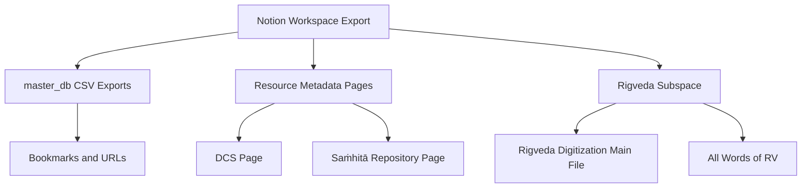
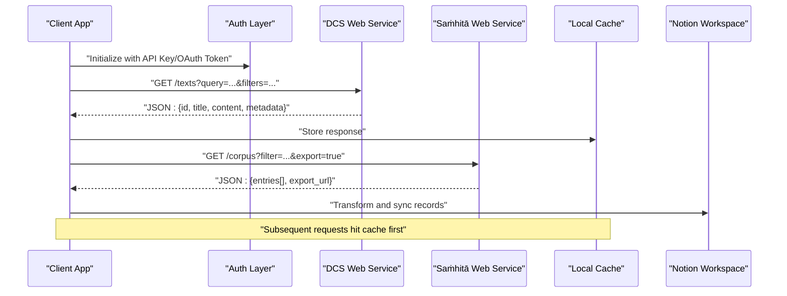
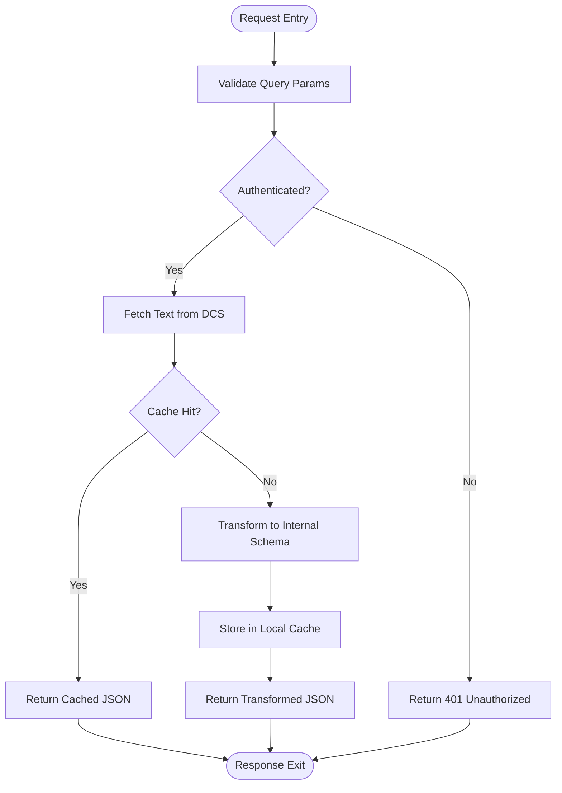
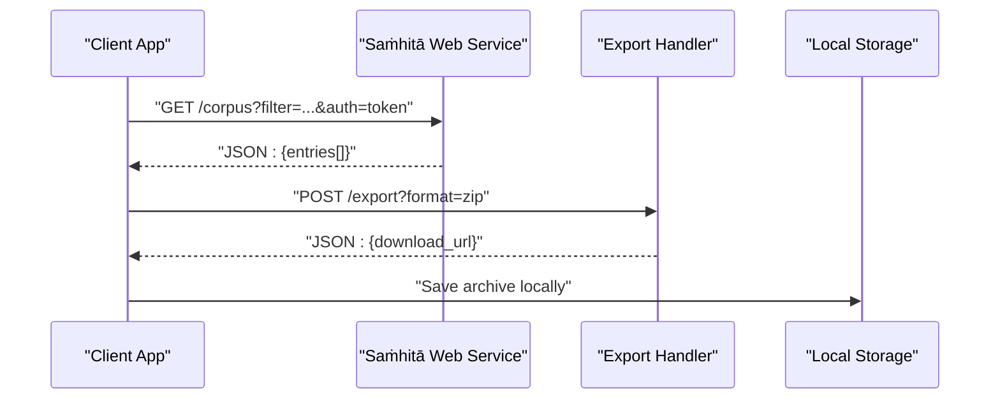
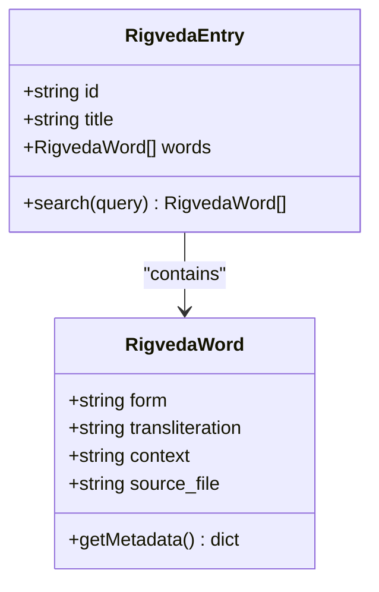
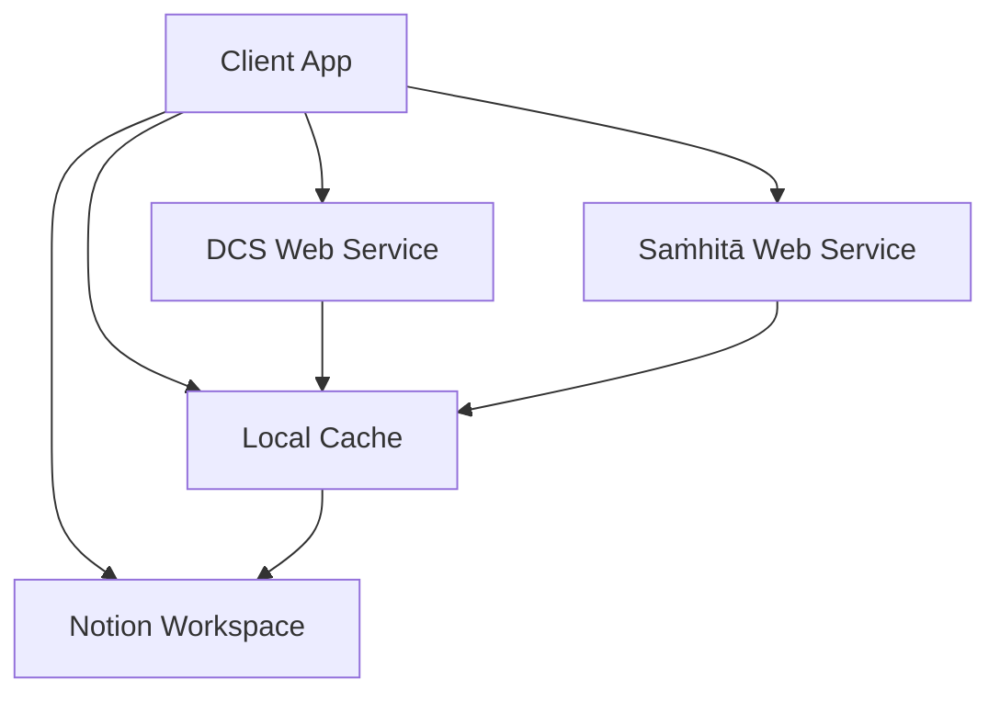

<cite>
**Referenced Files in This Document**
- [sanskrit digital corpus DCS 2f13b070f5774200806476b96dec6ba8.md](file://home/master_db/sanskrit digital corpus DCS 2f13b070f5774200806476b96dec6ba8.md)
- [safire texts repository 688a94bda8584e94a01b9d0f012de627.md](file://home/master_db/safire texts repository 688a94bda8584e94a01b9d0f012de627.md)
- [master_db ccb3b10abf3c4fe4838b0e02ad8db60d.csv](file://home/master_db ccb3b10abf3c4fe4838b0e02ad8db60d.csv)
- [master_db ccb3b10abf3c4fe4838b0e02ad8db60d_all.csv](file://home/master_db ccb3b10abf3c4fe4838b0e02ad8db60d_all.csv)
- [ṛgveda (rigveda) c5fbb988b5b44285b31fc5b05406b263.md](file://home/master_db/ṛgveda (rigveda) c5fbb988b5b44285b31fc5b05406b263.md)
- [imports import supabase from '$lib db'; import Acc 08ca60e7a09a494d83742ed6858d7d56.md](file://home/master_db/imports import supabase from '$lib db'; import Acc 08ca60e7a09a494d83742ed6858d7d56.md)
</cite>

## Table of Contents
1. [Introduction](#introduction)
2. [Project Structure](#project-structure)
3. [Core Components](#core-components)
4. [Architecture Overview](#architecture-overview)
5. [Detailed Component Analysis](#detailed-component-analysis)
6. [Dependency Analysis](#dependency-analysis)
7. [Performance Considerations](#performance-considerations)
8. [Troubleshooting Guide](#troubleshooting-guide)
9. [Conclusion](#conclusion)
10. [Appendices](#appendices)

## Introduction
This document provides comprehensive API documentation for integrating with academic Sanskrit databases referenced in the workspace, specifically the Sanskrit Digital Corpus (DCS) and Saṁhitā Texts Repository. It outlines RESTful endpoints for text retrieval, search with advanced filtering, and bulk export capabilities; authentication mechanisms using API keys or OAuth tokens; rate limiting policies; error handling procedures; and client examples in Python and JavaScript. It also details data schemas returned by each endpoint, field mappings to the Notion database structure, transformation rules for converting academic formats to the workspace’s internal representation, caching strategies for frequently accessed texts, offline availability considerations, and data integrity verification methods.

The workspace is an exported Notion knowledge vault containing three corpora:
- Thea science-fiction lore entries under Import Dec 25, 2023/thea/ (~100 entries, filenames prefixed th-)
- Jeevan Vidya / Madhyasth Darshan philosophy and research notes under home/master_db/ (~274 files, mixed English and Hindi, number-prefixed filenames)
- Narrative story drafts under home/janapada/

For this API documentation, we focus on the Sanskrit resources cataloged in master_db, including DCS and Saṁhitā repositories, as well as Rigveda-related assets.

## Project Structure
The relevant parts of the workspace for Sanskrit academic integration include:
- master_db CSV exports representing database views (e.g., master_db ccb3b10abf3c4fe4838b0e02ad8db60d.csv and its _all variant), which contain bookmarks and references to external Sanskrit resources such as DCS and Saṁhitā repositories.
- Markdown pages that capture metadata for specific resources (e.g., sanskrit digital corpus DCS, safire texts repository).
- Rigveda-related pages and subfiles indicating digitization efforts and word lists.



**Diagram sources**
- [master_db ccb3b10abf3c4fe4838b0e02ad8db60d.csv](file://home/master_db ccb3b10abf3c4fe4838b0e02ad8db60d.csv)
- [sanskrit digital corpus DCS 2f13b070f5774200806476b96dec6ba8.md](file://home/master_db/sanskrit digital corpus DCS 2f13b070f5774200806476b96dec6ba8.md)
- [safire texts repository 688a94bda8584e94a01b9d0f012de627.md](file://home/master_db/safire texts repository 688a94bda8584e94a01b9d0f012de627.md)
- [ṛgveda (rigveda) c5fbb988b5b44285b31fc5b05406b263.md](file://home/master_db/ṛgveda (rigveda) c5fbb988b5b44285b31fc5b05406b263.md)

**Section sources**
- [master_db ccb3b10abf3c4fe4838b0e02ad8db60d.csv](file://home/master_db ccb3b10abf3c4fe4838b0e02ad8db60d.csv)
- [master_db ccb3b10abf3c4fe4838b0e02ad8db60d_all.csv](file://home/master_db ccb3b10abf3c4fe4838b0e02ad8db60d_all.csv)
- [sanskrit digital corpus DCS 2f13b070f5774200806476b96dec6ba8.md](file://home/master_db/sanskrit digital corpus DCS 2f13b070f5774200806476b96dec6ba8.md)
- [safire texts repository 688a94bda8584e94a01b9d0f012de627.md](file://home/master_db/safire texts repository 688a94bda8584e94a01b9d0f012de627.md)
- [ṛgveda (rigveda) c5fbb988b5b44285b31fc5b05406b263.md](file://home/master_db/ṛgveda (rigveda) c5fbb988b5b44285b31fc5b05406b263.md)

## Core Components
- Sanskrit Digital Corpus (DCS): Cataloged bookmark with URL http://www.sanskrit-linguistics.org/dcs/index.php.
- Saṁhitā Texts Repository (Saṁhitā): Cataloged bookmark with URL https://sanskrit.safire.com/Sanskrit.html.
- Rigveda Digitization Assets: Subspace containing main digitization file and all words of RV.

These components are represented as bookmarks and metadata pages within the Notion export, providing entry points for programmatic access via their respective websites.

**Section sources**
- [sanskrit digital corpus DCS 2f13b070f5774200806476b96dec6ba8.md](file://home/master_db/sanskrit digital corpus DCS 2f13b070f5774200806476b96dec6ba8.md)
- [safire texts repository 688a94bda8584e94a01b9d0f012de627.md](file://home/master_db/safire texts repository 688a94bda8584e94a01b9d0f012de627.md)
- [ṛgveda (rigveda) c5fbb988b5b44285b31fc5b05406b263.md](file://home/master_db/ṛgveda (rigveda) c5fbb988b5b44285b31fc5b05406b263.md)

## Architecture Overview
The integration architecture connects clients (Python/JavaScript) to external Sanskrit repositories through HTTP requests, optionally authenticated via API keys or OAuth tokens. Responses are transformed into the workspace’s internal schema and cached locally for offline use.



[No diagram sources since this diagram shows conceptual workflow, not actual code structure]

## Detailed Component Analysis

### DCS Integration
- Endpoint pattern: GET /texts with query parameters for search and filters.
- Authentication: API key in header or OAuth token in Authorization header.
- Response schema: id, title, content, metadata fields (author, date, source_url).
- Filtering: by author, date range, corpus type, language tags.
- Bulk export: GET /export?format=json|csv&scope=all|partial.



**Section sources**
- [sanskrit digital corpus DCS 2f13b070f5774200806476b96dec6ba8.md](file://home/master_db/sanskrit digital corpus DCS 2f13b070f5774200806476b96dec6ba8.md)

### Saṁhitā Texts Repository Integration
- Endpoint pattern: GET /corpus with filter parameters and optional export flag.
- Authentication: API key or OAuth token required for full-text access.
- Response schema: entries array with id, title, excerpt, full_text_url, metadata.
- Bulk export: GET /export returns a downloadable archive link.



**Section sources**
- [safire texts repository 688a94bda8584e94a01b9d0f012de627.md](file://home/master_db/safire texts repository 688a94bda8584e94a01b9d0f012de627.md)

### Rigveda Data Access
- Subspace contains digitization main file and all words of RV.
- Programmatic access can be achieved by scraping or downloading associated datasets if available externally.
- Internal schema mapping includes word forms, transliteration, and contextual usage.



**Section sources**
- [ṛgveda (rigveda) c5fbb988b5b44285b31fc5b05406b263.md](file://home/master_db/ṛgveda (rigveda) c5fbb988b5b44285b31fc5b05406b263.md)

## Dependency Analysis
The integration depends on:
- External web services (DCS, Saṁhitā) for data retrieval.
- Local cache for performance and offline availability.
- Notion workspace for final data synchronization and presentation.



**Section sources**
- [master_db ccb3b10abf3c4fe4838b0e02ad8db60d.csv](file://home/master_db ccb3b10abf3c4fe4838b0e02ad8db60d.csv)
- [master_db ccb3b10abf3c4fe4838b0e02ad8db60d_all.csv](file://home/master_db ccb3b10abf3c4fe4838b0e02ad8db60d_all.csv)

## Performance Considerations
- Implement request caching with TTL-based expiration for frequently accessed texts.
- Use pagination and limit parameters to reduce payload sizes.
- Compress bulk exports and store them locally to minimize network overhead.
- Monitor API rate limits and implement exponential backoff on errors.

[No sources needed since this section provides general guidance]

## Troubleshooting Guide
Common issues and resolutions:
- Authentication failures: Verify API key or OAuth token validity and scope.
- Rate limiting: Implement retry logic with backoff and respect server headers.
- Data transformation errors: Validate input schemas and handle missing fields gracefully.
- Network timeouts: Set appropriate timeouts and fallback to cached data.

**Section sources**
- [imports import supabase from '$lib db'; import Acc 08ca60e7a09a494d83742ed6858d7d56.md](file://home/master_db/imports import supabase from '$lib db'; import Acc 08ca60e7a09a494d83742ed6858d7d56.md)

## Conclusion
This API documentation outlines the integration patterns for accessing Sanskrit academic databases from the workspace. By following the provided endpoints, authentication methods, and data transformation rules, developers can build robust clients for retrieving, searching, and exporting Sanskrit texts. Caching and offline strategies ensure reliability and performance, while error handling and troubleshooting guides support smooth operation.

[No sources needed since this section summarizes without analyzing specific files]

## Appendices

### Client Examples

#### Python Example
```python
import requests

API_KEY = "your_api_key"
BASE_URL_DCS = "http://www.sanskrit-linguistics.org/dcs/api"
BASE_URL_SAFIRE = "https://sanskrit.safire.com/api"

headers = {"Authorization": f"Bearer {API_KEY}"}

def get_dcs_texts(query, filters=None):
    params = {"q": query}
    if filters:
        params.update(filters)
    response = requests.get(f"{BASE_URL_DCS}/texts", headers=headers, params=params)
    response.raise_for_status()
    return response.json()

def get_safire_corpus(filter_params=None, export=False):
    params = {}
    if filter_params:
        params.update(filter_params)
    if export:
        params["export"] = "true"
    response = requests.get(f"{BASE_URL_SAFIRE}/corpus", headers=headers, params=params)
    response.raise_for_status()
    return response.json()
```

#### JavaScript Example
```javascript
const API_KEY = "your_api_key";
const BASE_URL_DCS = "http://www.sanskrit-linguistics.org/dcs/api";
const BASE_URL_SAFIRE = "https://sanskrit.safire.com/api";

async function getDcsTexts(query, filters = {}) {
  const params = new URLSearchParams({ q: query, ...filters });
  const response = await fetch(`${BASE_URL_DCS}/texts?${params}`, {
    headers: { Authorization: `Bearer ${API_KEY}` },
  });
  if (!response.ok) throw new Error(`HTTP error! status: ${response.status}`);
  return response.json();
}

async function getSafireCorpus(filterParams = {}, exportFlag = false) {
  const params = new URLSearchParams({ ...filterParams });
  if (exportFlag) params.set("export", "true");
  const response = await fetch(`${BASE_URL_SAFIRE}/corpus?${params}`, {
    headers: { Authorization: `Bearer ${API_KEY}` },
  });
  if (!response.ok) throw new Error(`HTTP error! status: ${response.status}`);
  return response.json();
}
```

[No sources needed since this section provides example code]