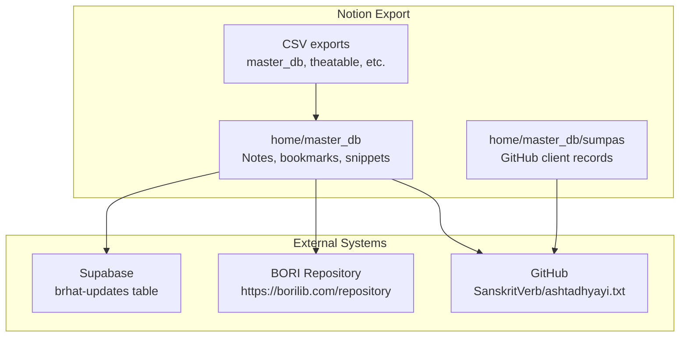
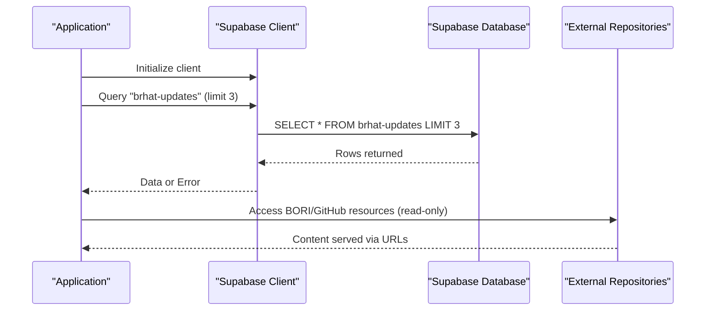
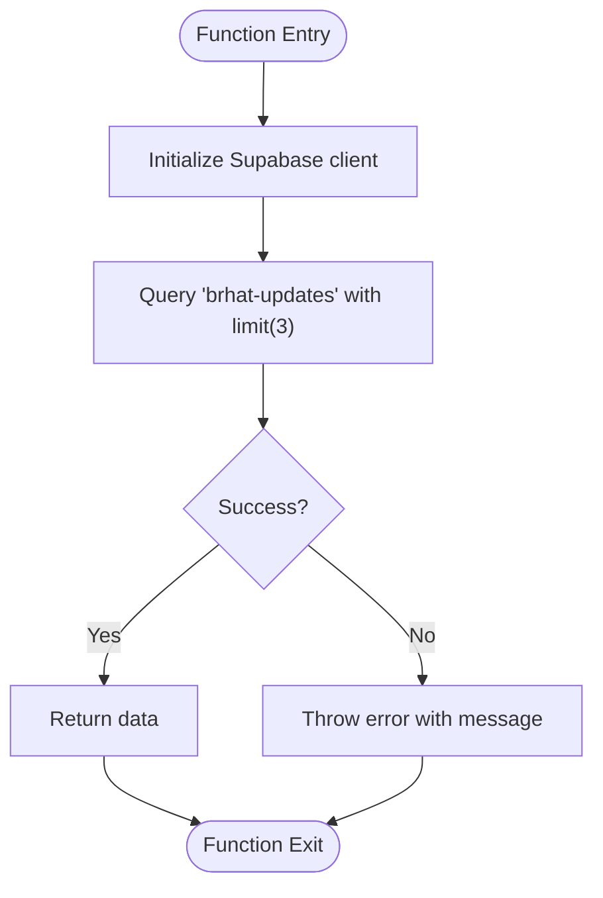
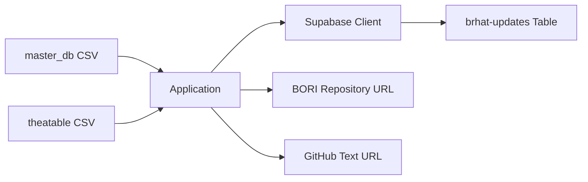

<cite>
**Referenced Files in This Document**
- [imports import supabase from '$lib db'; import Acc 08ca60e7a09a494d83742ed6858d7d56.md](file://home/master_db/imports%20import%20supabase%20from%20'$lib%20db';%20import%20Acc%2008ca60e7a09a494d83742ed6858d7d56.md)
- [BORI repository 6fa2994935284bffa6c8390e1d9995f2.md](file://home/master_db/BORI%20repository%206fa2994935284bffa6c8390e1d9995f2.md)
- [ashtadhyayi github 77eb5ebe5e4447b78acea5761ce4f815.md](file://home/master_db/ashtadhyayi%20github%2077eb5ebe5e4447b78acea5761ce4f815.md)
- [github client 9765fcf559c64ac986106eccab8e069d.md](file://home/master_db/sumpas/db_sumpas/github%20client%209765fcf559c64ac986106eccab8e069d.md)
- [github d29769db2f804cfeb10e50e2258d6085.md](file://home/master_db/sumpas/db_sumpas/github%20d29769db2f804cfeb10e50e2258d6085.md)
- [master_db ccb3b10abf3c4fe4838b0e02ad8db60d.csv](file://home/master_db%20ccb3b10abf3c4fe4838b0e02ad8db60d.csv)
- [theatable 342a32de49be4bd0bb0c0717ecf33390.csv](file://home/thea%20new/theatable/theatable%20342a32de49be4bd0bb0c0717ecf33390.csv)
</cite>

## Table of Contents
1. Introduction
2. Project Structure
3. Core Components
4. Architecture Overview
5. Detailed Component Analysis
6. Dependency Analysis
7. Performance Considerations
8. Troubleshooting Guide
9. Conclusion

## Introduction
This document explains the API integrations and external connection patterns present in the workspace. The repository is an exported Notion workspace that contains:
- A science-fiction lore corpus (“thea”) with flat metadata entries
- A large research and philosophy corpus (Jeevan Vidya / Madhyasth Darshan)
- Narrative story drafts
- Several CSV database exports used as reference data
- Notes and snippets related to Supabase usage, BORI repository bookmarks, and GitHub resources

The focus here is on how Supabase is referenced for data access, how external academic repositories like BORI and GitHub are cataloged, and what integration patterns can be inferred from the available artifacts.

## Project Structure
Key areas relevant to integrations:
- home/master_db: Contains notes, bookmarks, and code snippets including a Supabase usage example and links to external repositories
- home/master_db/sumpas: Contains records about GitHub clients and configurations
- CSV exports: master_db, theatable, janapada, People, Review provide structured views of content and references

**Diagram sources**
- [imports import supabase from '$lib db'; import Acc 08ca60e7a09a494d83742ed6858d7d56.md](file://home/master_db/imports%20import%20supabase%20from%20'$lib%20db';%20import%20Acc%2008ca60e7a09a494d83742ed6858d7d56.md)
- [BORI repository 6fa2994935284bffa6c8390e1d9995f2.md](file://home/master_db/BORI%20repository%206fa2994935284bffa6c8390e1d9995f2.md)
- [ashtadhyayi github 77eb5ebe5e4447b78acea5761ce4f815.md](file://home/master_db/ashtadhyayi%20github%2077eb5ebe5e4447b78acea5761ce4f815.md)
- [github client 9765fcf559c64ac986106eccab8e069d.md](file://home/master_db/sumpas/db_sumpas/github%20client%209765fcf559c64ac986106eccab8e069d.md)
- [github d29769db2f804cfeb10e50e2258d6085.md](file://home/master_db/sumpas/db_sumpas/github%20d29769db2f804cfeb10e50e2258d6085.md)

**Section sources**
- [imports import supabase from '$lib db'; import Acc 08ca60e7a09a494d83742ed6858d7d56.md](file://home/master_db/imports%20import%20supabase%20from%20'$lib%20db';%20import%20Acc%2008ca60e7a09a494d83742ed6858d7d56.md)
- [master_db ccb3b10abf3c4fe4838b0e02ad8db60d.csv](file://home/master_db%20ccb3b10abf3c4fe4838b0e02ad8db60d.csv)

## Core Components
- Supabase client usage snippet: Demonstrates importing a Supabase client and querying a table named brhat-updates with a limit and error handling
- Academic resource bookmarks: Links to BORI repository and GitHub-hosted Sanskrit texts
- GitHub client records: Metadata about GitHub-related tools or scripts, including status flags and inputs

These components indicate:
- Data retrieval via Supabase for application updates
- Reference management for external academic corpora
- Tracking of GitHub-based workflows or clients

**Section sources**
- [imports import supabase from '$lib db'; import Acc 08ca60e7a09a494d83742ed6858d7d56.md](file://home/master_db/imports%20import%20supabase%20from%20'$lib%20db';%20import%20Acc%2008ca60e7a09a494d83742ed6858d7d56.md)
- [BORI repository 6fa2994935284bffa6c8390e1d9995f2.md](file://home/master_db/BORI%20repository%206fa2994935284bffa6c8390e1d9995f2.md)
- [ashtadhyayi github 77eb5ebe5e4447b78acea5761ce4f815.md](file://home/master_db/ashtadhyayi%20github%2077eb5ebe5e4447b78acea5761ce4f815.md)
- [github client 9765fcf559c64ac986106eccab8e069d.md](file://home/master_db/sumpas/db_sumpas/github%20client%209765fcf559c64ac986106eccab8e069d.md)
- [github d29769db2f804cfeb10e50e2258d6085.md](file://home/master_db/sumpas/db_sumpas/github%20d29769db2f804cfeb10e50e2258d6085.md)

## Architecture Overview
The integration architecture centers around a Supabase-backed update feed and curated external academic resources. The Supabase client is imported and used to fetch recent updates from a specific table. Academic resources are bookmarked and tracked within the workspace, while GitHub-related records capture tooling metadata.

**Diagram sources**
- [imports import supabase from '$lib db'; import Acc 08ca60e7a09a494d83742ed6858d7d56.md](file://home/master_db/imports%20import%20supabase%20from%20'$lib%20db';%20import%20Acc%2008ca60e7a09a494d83742ed6858d7d56.md)
- [BORI repository 6fa2994935284bffa6c8390e1d9995f2.md](file://home/master_db/BORI%20repository%206fa2994935284bffa6c8390e1d9995f2.md)
- [ashtadhyayi github 77eb5ebe5e4447b78acea5761ce4f815.md](file://home/master_db/ashtadhyayi%20github%2077eb5ebe5e4447b78acea5761ce4f815.md)

## Detailed Component Analysis

### Supabase Integration
- Purpose: Fetch recent updates from a dedicated table
- Implementation pattern: Import client, query table with limit, handle errors, return data
- Request/response: GET-style select with limit; response includes rows or error object
- Error handling: Throws error if query fails

**Diagram sources**
- [imports import supabase from '$lib db'; import Acc 08ca60e7a09a494d83742ed6858d7d56.md](file://home/master_db/imports%20import%20supabase%20from%20'$lib%20db';%20import%20Acc%2008ca60e7a09a494d83742ed6858d7d56.md)

**Section sources**
- [imports import supabase from '$lib db'; import Acc 08ca60e7a09a494d83742ed6858d7d56.md](file://home/master_db/imports%20import%20supabase%20from%20'$lib%20db';%20import%20Acc%2008ca60e7a09a494d83742ed6858d7d56.md)

### BORI Repository Bookmark
- Purpose: Catalog a key Sanskrit academic repository
- Fields include URL, tags, timestamps, and storage area
- Usage: Read-only reference for researchers and developers

**Section sources**
- [BORI repository 6fa2994935284bffa6c8390e1d9995f2.md](file://home/master_db/BORI%20repository%206fa2994935284bffa6c8390e1d9995f2.md)

### GitHub Resource Bookmark
- Purpose: Link to a public Sanskrit text hosted on GitHub
- Fields include URL, tags, timestamps, and storage area
- Usage: Read-only reference for textual data

**Section sources**
- [ashtadhyayi github 77eb5ebe5e4447b78acea5761ce4f815.md](file://home/master_db/ashtadhyayi%20github%2077eb5ebe5e4447b78acea5761ce4f815.md)

### GitHub Client Records
- Purpose: Track GitHub-related tools/scripts with metadata such as input, save/delete flags, creation dates
- Usage: Internal tracking of automation or client configurations

**Section sources**
- [github client 9765fcf559c64ac986106eccab8e069d.md](file://home/master_db/sumpas/db_sumpas/github%20client%209765fcf559c64ac986106eccab8e069d.md)
- [github d29769db2f804cfeb10e50e2258d6085.md](file://home/master_db/sumpas/db_sumpas/github%20d29769db2f804cfeb10e50e2258d6085.md)

### CSV Database Exports
- master_db CSV: Indexes pages, tags, timestamps, and relationships across the workspace
- theatable CSV: Structured view of “thea” lore entries, enabling programmatic analysis
- Other CSVs (janapada, People, Review): Provide additional structured datasets for cross-referencing

These exports support automated imports, synchronization, and analytics by providing stable schemas and identifiers.

**Section sources**
- [master_db ccb3b10abf3c4fe4838b0e02ad8db60d.csv](file://home/master_db%20ccb3b10abf3c4fe4838b0e02ad8db60d.csv)
- [theatable 342a32de49be4bd0bb0c0717ecf33390.csv](file://home/thea%20new/theatable/theatable%20342a32de49be4bd0bb0c0717ecf33390.csv)

## Dependency Analysis
- Supabase dependency: Application depends on a configured client module and a table schema for updates
- External dependencies: BORI and GitHub resources are referenced via URLs; no direct API calls are evident in the workspace
- Internal dependencies: CSV exports depend on Notion export processes and maintain consistent naming conventions

**Diagram sources**
- [imports import supabase from '$lib db'; import Acc 08ca60e7a09a494d83742ed6858d7d56.md](file://home/master_db/imports%20import%20supabase%20from%20'$lib%20db';%20import%20Acc%2008ca60e7a09a494d83742ed6858d7d56.md)
- [BORI repository 6fa2994935284bffa6c8390e1d9995f2.md](file://home/master_db/BORI%20repository%206fa2994935284bffa6c8390e1d9995f2.md)
- [ashtadhyayi github 77eb5ebe5e4447b78acea5761ce4f815.md](file://home/master_db/ashtadhyayi%20github%2077eb5ebe5e4447b78acea5761ce4f815.md)
- [master_db ccb3b10abf3c4fe4838b0e02ad8db60d.csv](file://home/master_db%20ccb3b10abf3c4fe4838b0e02ad8db60d.csv)
- [theatable 342a32de49be4bd0bb0c0717ecf33390.csv](file://home/thea%20new/theatable/theatable%20342a32de49be4bd0bb0c0717ecf33390.csv)

**Section sources**
- [imports import supabase from '$lib db'; import Acc 08ca60e7a09a494d83742ed6858d7d56.md](file://home/master_db/imports%20import%20supabase%20from%20'$lib%20db';%20import%20Acc%2008ca60e7a09a494d83742ed6858d7d56.md)
- [master_db ccb3b10abf3c4fe4838b0e02ad8db60d.csv](file://home/master_db%20ccb3b10abf3c4fe4838b0e02ad8db60d.csv)

## Performance Considerations
- Limit queries: Using a limit reduces payload size and improves responsiveness when fetching updates
- Batch operations: For larger datasets, consider batching reads/writes to minimize network overhead
- Caching: Cache frequently accessed academic resources locally to reduce repeated downloads
- Rate limiting: Respect external service rate limits; implement backoff strategies for retries

[No sources needed since this section provides general guidance]

## Troubleshooting Guide
- Supabase errors: If a query fails, ensure the client is initialized correctly and the table exists; inspect error messages thrown during the request
- Broken links: Verify external URLs (BORI, GitHub) are accessible; update bookmarks if links change
- CSV integrity: Validate CSV schemas before importing into systems; check for missing fields or inconsistent IDs

**Section sources**
- [imports import supabase from '$lib db'; import Acc 08ca60e7a09a494d83742ed6858d7d56.md](file://home/master_db/imports%20import%20supabase%20from%20'$lib%20db';%20import%20Acc%2008ca60e7a09a494d83742ed6858d7d56.md)
- [BORI repository 6fa2994935284bffa6c8390e1d9995f2.md](file://home/master_db/BORI%20repository%206fa2994935284bffa6c8390e1d9995f2.md)
- [ashtadhyayi github 77eb5ebe5e4447b78acea5761ce4f815.md](file://home/master_db/ashtadhyayi%20github%2077eb5ebe5e4447b78acea5761ce4f815.md)

## Conclusion
The workspace demonstrates a practical integration pattern centered on Supabase for application updates and curated external academic resources via bookmarks. While explicit authentication flows and webhooks are not present in the provided artifacts, the structure supports building robust integrations with clear error handling, limited payloads, and reliable reference management. CSV exports enable automated imports and synchronization pipelines, making it feasible to extend real-time sync and monitoring capabilities in future iterations.

[No sources needed since this section summarizes without analyzing specific files]