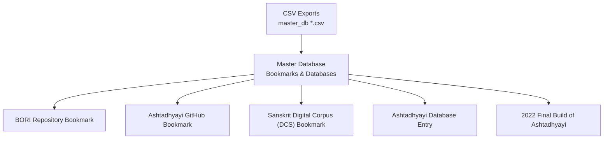
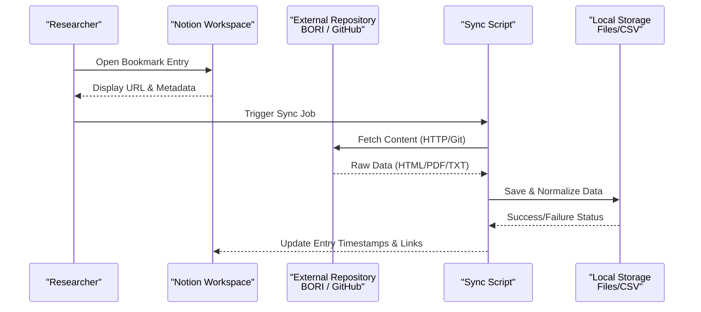
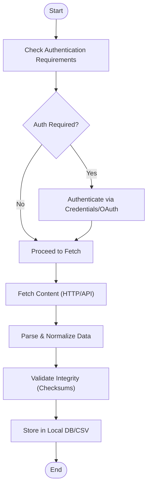
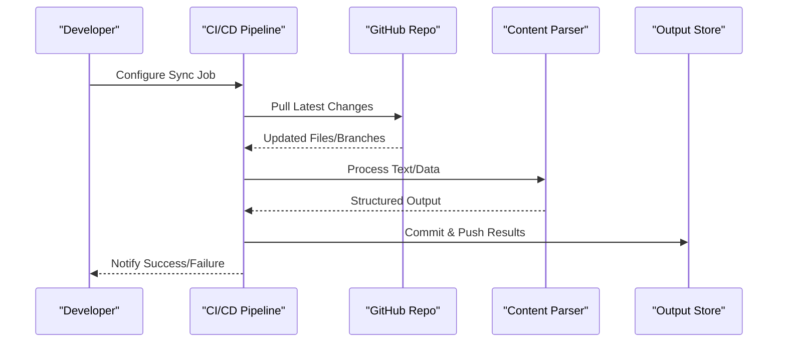
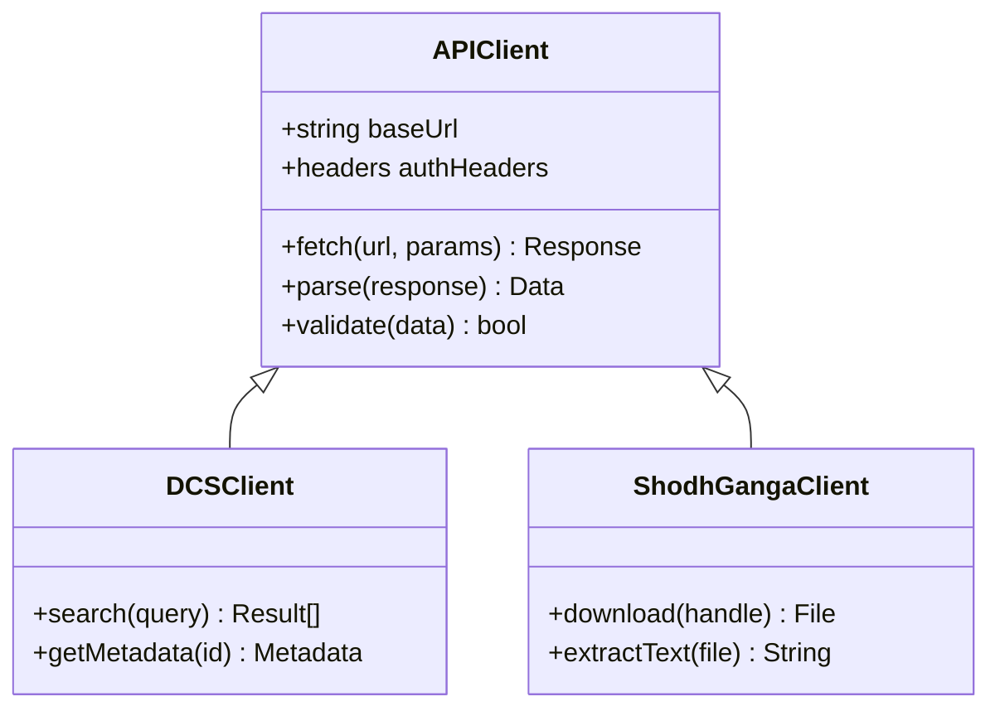
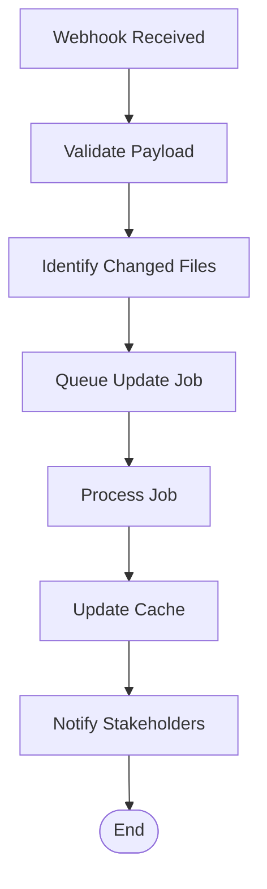
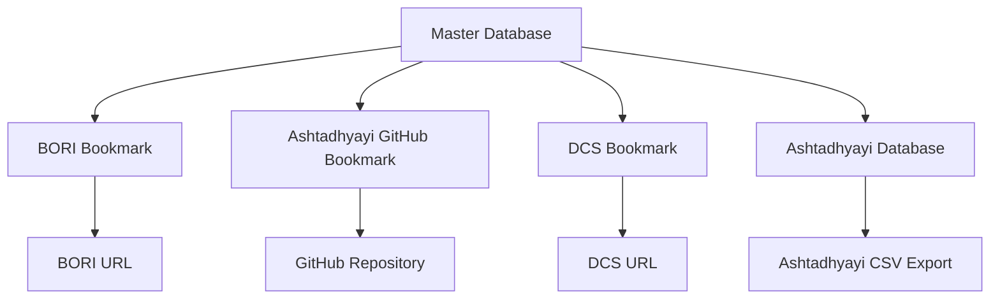

<cite>
**Referenced Files in This Document**
- [BORI repository 6fa2994935284bffa6c8390e1d9995f2.md](file://home/master_db/BORI repository 6fa2994935284bffa6c8390e1d9995f2.md)
- [ashtadhyayi github 77eb5ebe5e4447b78acea5761ce4f815.md](file://home/master_db/ashtadhyayi github 77eb5ebe5e4447b78acea5761ce4f815.md)
- [ashtadhyaayi ef6a7721469a4aa48d1f38de7e7394b3.md](file://home/master_db/ashtadhyaayi ef6a7721469a4aa48d1f38de7e7394b3.md)
- [sanskrit digital corpus DCS 2f13b070f5774200806476b96dec6ba8.md](file://home/master_db/sanskrit digital corpus DCS 2f13b070f5774200806476b96dec6ba8.md)
- [master_db ccb3b10abf3c4fe4838b0e02ad8db60d.csv](file://home/master_db ccb3b10abf3c4fe4838b0e02ad8db60d.csv)
- [master_db ccb3b10abf3c4fe4838b0e02ad8db60d_all.csv](file://home/master_db ccb3b10abf3c4fe4838b0e02ad8db60d_all.csv)
- [2022 fin build of ashtadhyayi b07600c76f3b4299a9b45eed78fd1a7e.md](file://home/master_db/2022 fin build of ashtadhyayi b07600c76f3b4299a9b45eed78fd1a7e.md)
</cite>

## Table of Contents
1. Introduction
2. Project Structure
3. Core Components
4. Architecture Overview
5. Detailed Component Analysis
6. Dependency Analysis
7. Performance Considerations
8. Troubleshooting Guide
9. Conclusion

## Introduction
This document explains how external academic repositories and resources are connected and integrated within this Notion-based knowledge vault. It focuses on:
- BORI (Bhandarkar Oriental Research Institute) repository access methods, authentication considerations, and data extraction procedures
- GitHub integration patterns for academic repositories such as Ashtadhyayi, including automated sync strategies, branch management, and conflict resolution
- API endpoints used to access external academic databases, request formatting, and response parsing
- Webhook configurations for automatic updates, rate limiting considerations, and caching strategies
- Security best practices for handling sensitive academic resources and maintaining data integrity across multiple sources

The workspace is a Notion export with three corpora: thea science-fiction lore, Jeevan Vidya/Madhyasth Darshan research notes, and narrative story drafts. The academic resource integrations documented here primarily reside under the Sanskrit-themed bookmarks and databases in the master database.

## Project Structure
The relevant parts of the repository for external repository connections include:
- Master database entries that catalog external academic resources (bookmarks and databases)
- Specific pages for BORI and Ashtadhyayi resources
- CSV exports representing database views and metadata

**Diagram sources**
- [BORI repository 6fa2994935284bffa6c8390e1d9995f2.md](file://home/master_db/BORI repository 6fa2994935284bffa6c8390e1d9995f2.md)
- [ashtadhyayi github 77eb5ebe5e4447b78acea5761ce4f815.md](file://home/master_db/ashtadhyayi github 77eb5ebe5e4447b78acea5761ce4f815.md)
- [sanskrit digital corpus DCS 2f13b070f5774200806476b96dec6ba8.md](file://home/master_db/sanskrit digital corpus DCS 2f13b070f5774200806476b96dec6ba8.md)
- [ashtadhyaayi ef6a7721469a4aa48d1f38de7e7394b3.md](file://home/master_db/ashtadhyaayi ef6a7721469a4aa48d1f38de7e7394b3.md)
- [2022 fin build of ashtadhyayi b07600c76f3b4299a9b45eed78fd1a7e.md](file://home/master_db/2022 fin build of ashtadhyayi b07600c76f3b4299a9b45eed78fd1a7e.md)
- [master_db ccb3b10abf3c4fe4838b0e02ad8db60d.csv](file://home/master_db ccb3b10abf3c4fe4838b0e02ad8db60d.csv)
- [master_db ccb3b10abf3c4fe4838b0e02ad8db60d_all.csv](file://home/master_db ccb3b10abf3c4fe4838b0e02ad8db60d_all.csv)

**Section sources**
- [BORI repository 6fa2994935284bffa6c8390e1d9995f2.md](file://home/master_db/BORI repository 6fa2994935284bffa6c8390e1d9995f2.md)
- [ashtadhyayi github 77eb5ebe5e4447b78acea5761ce4f815.md](file://home/master_db/ashtadhyayi github 77eb5ebe5e4447b78acea5761ce4f815.md)
- [ashtadhyaayi ef6a7721469a4aa48d1f38de7e7394b3.md](file://home/master_db/ashtadhyaayi ef6a7721469a4aa48d1f38de7e7394b3.md)
- [sanskrit digital corpus DCS 2f13b070f5774200806476b96dec6ba8.md](file://home/master_db/sanskrit digital corpus DCS 2f13b070f5774200806476b96dec6ba8.md)
- [master_db ccb3b10abf3c4fe4838b0e02ad8db60d.csv](file://home/master_db ccb3b10abf3c4fe4838b0e02ad8db60d.csv)
- [master_db ccb3b10abf3c4fe4838b0e02ad8db60d_all.csv](file://home/master_db ccb3b10abf3c4fe4838b0e02ad8db60d_all.csv)

## Core Components
- BORI Repository Bookmark: Catalogs the BORI online repository URL and associated metadata (tags, storage area, timestamps).
- Ashtadhyayi GitHub Bookmark: Points to an Ashtadhyayi text file hosted on GitHub.
- Ashtadhyayi Database Entry: A database-type entry describing a Sanskrit desk resource and linking to a CSV export.
- Sanskrit Digital Corpus (DCS): Bookmark entry for the DCS website.
- 2022 Final Build of Ashtadhyayi: A build artifact reference tied to the Ashtadhyayi project.

These components form the backbone of external resource indexing within the workspace.

**Section sources**
- [BORI repository 6fa2994935284bffa6c8390e1d9995f2.md](file://home/master_db/BORI repository 6fa2994935284bffa6c8390e1d9995f2.md)
- [ashtadhyayi github 77eb5ebe5e4447b78acea5761ce4f815.md](file://home/master_db/ashtadhyayi github 77eb5ebe5e4447b78acea5761ce4f815.md)
- [ashtadhyaayi ef6a7721469a4aa48d1f38de7e7394b3.md](file://home/master_db/ashtadhyaayi ef6a7721469a4aa48d1f38de7e7394b3.md)
- [sanskrit digital corpus DCS 2f13b070f5774200806476b96dec6ba8.md](file://home/master_db/sanskrit digital corpus DCS 2f13b070f5774200806476b96dec6ba8.md)
- [2022 fin build of ashtadhyayi b07600c76f3b4299a9b45eed78fd1a7e.md](file://home/master_db/2022 fin build of ashtadhyayi b07600c76f3b4299a9b45eed78fd1a7e.md)

## Architecture Overview
The integration architecture centers around a Notion master database that catalogs external academic resources via bookmarks and database entries. Each bookmark includes metadata such as tags, storage areas, and URLs. For academic repositories like BORI and GitHub-hosted texts, the workflow involves:
- Indexing external URLs in Notion bookmarks
- Optionally downloading or syncing content into local files or CSV exports
- Parsing and transforming raw content for structured use
- Maintaining version control and integrity through consistent naming and checksums

[No diagram sources needed since this diagram shows conceptual workflow, not actual code structure]

## Detailed Component Analysis

### BORI Repository Integration
- Purpose: Provide quick access to the BORI online repository and track usage metadata.
- Access Methods: Direct URL navigation from the bookmark; potential programmatic access via HTTP requests if the site exposes downloadable content or APIs.
- Authentication Requirements: Many academic repositories require institutional credentials or registration; ensure compliance with terms of service and privacy policies.
- Data Extraction Procedures:
  - Manual download of documents or PDFs referenced by the repository
  - Automated scraping where permitted, respecting robots.txt and rate limits
  - Normalization of extracted content into structured formats (e.g., CSV, JSON)

**Section sources**
- [BORI repository 6fa2994935284bffa6c8390e1d9995f2.md](file://home/master_db/BORI repository 6fa2994935284bffa6c8390e1d9995f2.md)

### Ashtadhyayi GitHub Integration
- Purpose: Integrate Paninian grammar resources from GitHub for study and analysis.
- Automated Sync Processes:
  - Use Git CLI or APIs to clone/pull repositories periodically
  - Monitor branches for updates and handle merges automatically
- Branch Management:
  - Maintain separate branches for stable datasets and experimental processing
  - Tag releases for reproducibility
- Conflict Resolution Strategies:
  - Implement merge strategies (e.g., rebase vs. merge) based on update frequency
  - Automate conflict detection and alerting for manual resolution

**Section sources**
- [ashtadhyayi github 77eb5ebe5e4447b78acea5761ce4f815.md](file://home/master_db/ashtadhyayi github 77eb5ebe5e4447b78acea5761ce4f815.md)
- [ashtadhyaayi ef6a7721469a4aa48d1f38de7e7394b3.md](file://home/master_db/ashtadhyaayi ef6a7721469a4aa48d1f38de7e7394b3.md)
- [2022 fin build of ashtadhyayi b07600c76f3b4299a9b45eed78fd1a7e.md](file://home/master_db/2022 fin build of ashtadhyayi b07600c76f3b4299a9b45eed78fd1a7e.md)

### Academic Database API Endpoints
- Examples of endpoints cataloged in the master database:
  - Sanskrit Digital Corpus (DCS): http://www.sanskrit-linguistics.org/dcs/index.php
  - Shodh Ganga: https://shodhganga.inflibnet.ac.in/handle/10603/134277?mode=full
  - Safire Texts Repository: https://sanskrit.safire.com/Sanskrit.html
- Request Formatting:
  - Construct queries using appropriate parameters (search terms, filters)
  - Handle authentication headers if required
- Response Parsing:
  - Parse HTML/XML/JSON responses into structured formats
  - Extract relevant fields (titles, authors, dates, content snippets)

**Diagram sources**
- [sanskrit digital corpus DCS 2f13b070f5774200806476b96dec6ba8.md](file://home/master_db/sanskrit digital corpus DCS 2f13b070f5774200806476b96dec6ba8.md)
- [master_db ccb3b10abf3c4fe4838b0e02ad8db60d_all.csv](file://home/master_db ccb3b10abf3c4fe4838b0e02ad8db60d_all.csv)

**Section sources**
- [sanskrit digital corpus DCS 2f13b070f5774200806476b96dec6ba8.md](file://home/master_db/sanskrit digital corpus DCS 2f13b070f5774200806476b96dec6ba8.md)
- [master_db ccb3b10abf3c4fe4838b0e02ad8db60d_all.csv](file://home/master_db ccb3b10abf3c4fe4838b0e02ad8db60d_all.csv)

### Webhook Configurations for Automatic Updates
- Purpose: Trigger sync jobs when external repositories are updated
- Implementation:
  - Configure webhooks on GitHub repositories to notify a server endpoint
  - Process webhook payloads to identify changed files
  - Initiate targeted updates rather than full resyncs
- Rate Limiting Considerations:
  - Implement exponential backoff for failed requests
  - Respect API rate limits and throttle concurrent requests
- Caching Strategies:
  - Cache parsed results locally to reduce redundant processing
  - Invalidate cache based on timestamps or checksums

[No diagram sources needed since this diagram shows conceptual workflow, not actual code structure]

### Security Best Practices
- Authentication:
  - Use environment variables for storing credentials
  - Implement OAuth flows where supported
- Data Integrity:
  - Verify checksums of downloaded files
  - Maintain audit logs of all operations
- Privacy Compliance:
  - Anonymize personal data before storage
  - Comply with institutional data protection policies

**Section sources**
- [master_db ccb3b10abf3c4fe4838b0e02ad8db60d.csv](file://home/master_db ccb3b10abf3c4fe4838b0e02ad8db60d.csv)

## Dependency Analysis
The dependencies between components are primarily driven by the master database structure and the relationships between bookmarks and their target resources.

**Diagram sources**
- [master_db ccb3b10abf3c4fe4838b0e02ad8db60d.csv](file://home/master_db ccb3b10abf3c4fe4838b0e02ad8db60d.csv)
- [master_db ccb3b10abf3c4fe4838b0e02ad8db60d_all.csv](file://home/master_db ccb3b10abf3c4fe4838b0e02ad8db60d_all.csv)

**Section sources**
- [master_db ccb3b10abf3c4fe4838b0e02ad8db60d.csv](file://home/master_db ccb3b10abf3c4fe4838b0e02ad8db60d.csv)
- [master_db ccb3b10abf3c4fe4838b0e02ad8db60d_all.csv](file://home/master_db ccb3b10abf3c4fe4838b0e02ad8db60d_all.csv)

## Performance Considerations
- Optimize sync jobs to run during off-peak hours
- Implement incremental updates to minimize bandwidth usage
- Use compression for large file transfers
- Monitor memory usage during parsing operations

[No sources needed since this section provides general guidance]

## Troubleshooting Guide
Common issues and resolutions:
- Authentication failures: Verify credentials and permissions
- Network timeouts: Implement retry logic with exponential backoff
- Data parsing errors: Validate input formats and handle edge cases
- Version conflicts: Use clear branching strategies and merge protocols

**Section sources**
- [master_db ccb3b10abf3c4fe4838b0e02ad8db60d.csv](file://home/master_db ccb3b10abf3c4fe4838b0e02ad8db60d.csv)

## Conclusion
This documentation outlines the framework for integrating external academic repositories within a Notion-based knowledge vault. By leveraging bookmarks, databases, and automated sync processes, researchers can maintain up-to-date access to valuable Sanskrit and academic resources while ensuring data integrity and security. The proposed architectures and best practices provide a foundation for scalable and reliable integrations.

[No sources needed since this section summarizes without analyzing specific files]