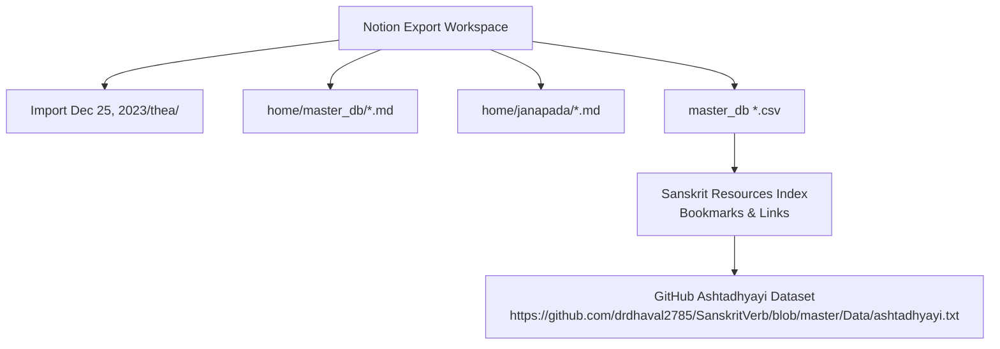
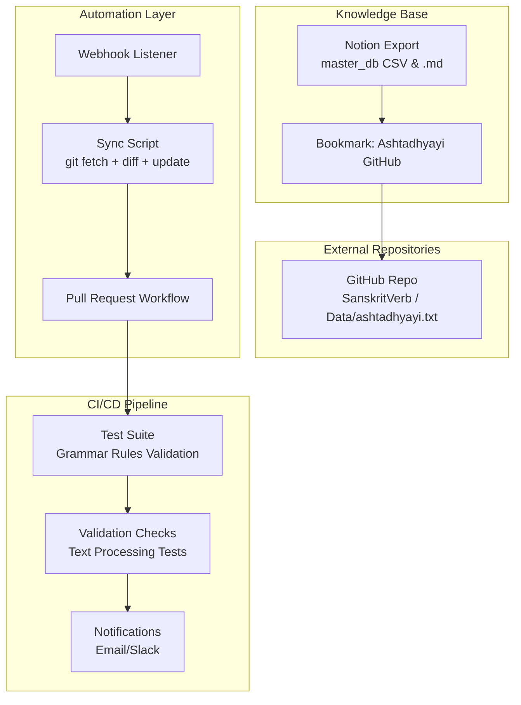
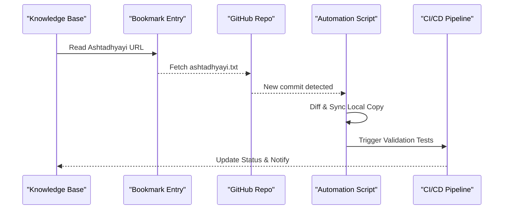
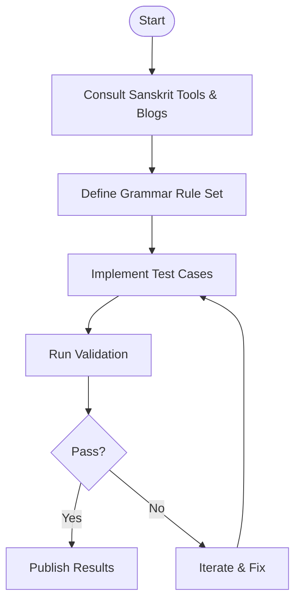
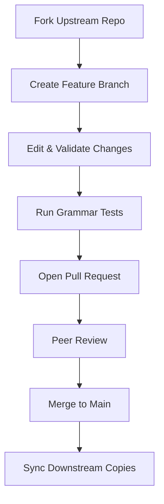
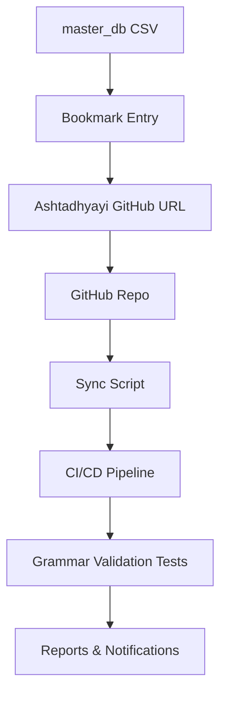

<cite>
**Referenced Files in This Document**
- [ashtadhyayi github 77eb5ebe5e4447b78acea5761ce4f815.md](file://home/master_db/ashtadhyayi github 77eb5ebe5e4447b78acea5761ce4f815.md)
- [2022 fin build of ashtadhyayi b07600c76f3b4299a9b45eed78fd1a7e.md](file://home/master_db/2022 fin build of ashtadhyayi b07600c76f3b4299a9b45eed78fd1a7e.md)
- [master_db ccb3b10abf3c4fe4838b0e02ad8db60d.csv](file://home/master_db ccb3b10abf3c4fe4838b0e02ad8db60d.csv)
- [master_db_all ccb3b10abf3c4fe4838b0e02ad8db60d_all.csv](file://home/master_db ccb3b10abf3c4fe4838b0e02ad8db60d_all.csv)
- [sanskrit declension engine 5555fca36e074564abf91775eebccb41.md](file://home/master_db/sanskrit declension engine 5555fca36e074564abf91775eebccb41.md)
- [fantastic sanskrit and computation blog 9e8969eab45eed78fd1a7e.md](file://home/master_db/fantastic sanskrit and computation blog 9e8969eab45eed78fd1a7e.md)
- [thea-th-abudhagaja 3c50bd2b2d684aafbf7c0a3f14d15b18.md](file://Import Dec 25, 2023/thea/th-abudhagaja 3c50bd2b2d684aafbf7c0a3f14d15b18.md)
- [thea-th-adiputras 7272d605fe7244ec922fba595457c7d5.md](file://Import Dec 25, 2023/thea/th-adiputras 7272d605fe7244ec922fba595457c7d5.md)
</cite>

## Table of Contents
1. Introduction
2. Project Structure
3. Core Components
4. Architecture Overview
5. Detailed Component Analysis
6. Dependency Analysis
7. Performance Considerations
8. Troubleshooting Guide
9. Conclusion

## Introduction
This document provides a comprehensive guide to maintaining synchronized academic repositories on GitHub with a focus on Sanskrit grammar resources such as the Ashtadhyayi project. It explains Git workflows for version control and collaboration, automation strategies for periodic updates, pull request processes, merge conflict resolution, webhook-driven syncs, error handling, notifications, best practices for fork management, upstream contributions, and compatibility with evolving grammatical standards. It also includes examples of CI/CD pipelines for automated testing of Sanskrit text processing and validation of grammatical rules.

The repository analyzed here is an exported Notion workspace that catalogs Sanskrit resources, including bookmarks to GitHub assets like the Ashtadhyayi dataset. These artifacts serve as a knowledge base and index for managing external academic sources and integrating them into local workflows.

## Project Structure
The workspace contains three primary corpora:
- Thea science-fiction lore entries under Import Dec 25, 2023/thea/, each file prefixed th- and organized by group metadata (e.g., places, species, ships).
- Jeevan Vidya / Madhyasth Darshan philosophy and research notes under home/master_db/, comprising hundreds of numbered files in English and Hindi.
- Narrative story drafts under home/janapada/.

CSV exports represent database views from Notion and include links to Sanskrit resources, bookmarks, and tags. Markdown files carry metadata fields such as URL, storage area, basic tag, theme, timestamps, and status flags.

**Diagram sources**
- [ashtadhyayi github 77eb5ebe5e4447b78acea5761ce4f815.md:1-17](file://home/master_db/ashtadhyayi github 77eb5ebe5e4447b78acea5761ce4f815.md#L1-L17)
- [master_db ccb3b10abf3c4fe4838b0e02ad8db60d.csv:99-111](file://home/master_db ccb3b10abf3c4fe4838b0e02ad8db60d.csv#L99-L111)

**Section sources**
- [ashtadhyayi github 77eb5ebe5e4447b78acea5761ce4f815.md:1-17](file://home/master_db/ashtadhyayi github 77eb5ebe5e4447b78acea5761ce4f815.md#L1-L17)
- [2022 fin build of ashtadhyayi b07600c76f3b4299a9b45eed78fd1a7e.md:1-14](file://home/master_db/2022 fin build of ashtadhyayi b07600c76f3b4299a9b45eed78fd1a7e.md#L1-L14)
- [master_db ccb3b10abf3c4fe4838b0e02ad8db60d.csv:99-111](file://home/master_db ccb3b10abf3c4fe4838b0e02ad8db60d.csv#L99-L111)

## Core Components
Key components relevant to academic repository integration:
- Bookmark entry for Ashtadhyayi GitHub resource: captures the canonical URL to the Ashtadhyayi dataset used in Sanskrit verb processing.
- Build note for “2022 fin build of ashtadhyayi”: indicates a snapshot or finalization point for Ashtadhyayi-related work.
- Sanskrit tools and references: declension engine and blogs that inform computational approaches to Sanskrit grammar.

These components provide the indexing and reference layer necessary to drive automation and CI/CD pipelines for validating and testing Sanskrit text processing.

**Section sources**
- [ashtadhyayi github 77eb5ebe5e4447b78acea5761ce4f815.md:1-17](file://home/master_db/ashtadhyayi github 77eb5ebe5e4447b78acea5761ce4f815.md#L1-L17)
- [2022 fin build of ashtadhyayi b07600c76f3b4299a9b45eed78fd1a7e.md:1-14](file://home/master_db/2022 fin build of ashtadhyayi b07600c76f3b4299a9b45eed78fd1a7e.md#L1-L14)
- [sanskrit declension engine 5555fca36e074564abf91775eebccb41.md:1-15](file://home/master_db/sanskrit declension engine 5555fca36e074564abf91775eebccb41.md#L1-L15)
- [fantastic sanskrit and computation blog 9e8969eab45eed78fd1a7e.md:1-17](file://home/master_db/fantastic sanskrit and computation blog 9e8969eab45eed78fd1a7e.md#L1-L17)

## Architecture Overview
The architecture integrates a knowledge base (Notion export), external academic repositories (GitHub), and CI/CD pipelines for automated validation and synchronization.

**Diagram sources**
- [ashtadhyayi github 77eb5ebe5e4447b78acea5761ce4f815.md:1-17](file://home/master_db/ashtadhyayi github 77eb5ebe5e4447b78acea5761ce4f815.md#L1-L17)
- [master_db ccb3b10abf3c4fe4838b0e02ad8db60d.csv:99-111](file://home/master_db ccb3b10abf3c4fe4838b0e02ad8db60d.csv#L99-L111)

## Detailed Component Analysis

### Ashtadhyayi Resource Integration
The bookmark entry records the canonical URL to the Ashtadhyayi dataset hosted on GitHub. This serves as the authoritative source for grammar rule data used in Sanskrit verb processing. The build note marks a finalized state for related work, useful for versioning and reproducibility.

**Diagram sources**
- [ashtadhyayi github 77eb5ebe5e4447b78acea5761ce4f815.md:1-17](file://home/master_db/ashtadhyayi github 77eb5ebe5e4447b78acea5761ce4f815.md#L1-L17)
- [2022 fin build of ashtadhyayi b07600c76f3b4299a9b45eed78fd1a7e.md:1-14](file://home/master_db/2022 fin build of ashtadhyayi b07600c76f3b4299a9b45eed78fd1a7e.md#L1-L14)

**Section sources**
- [ashtadhyayi github 77eb5ebe5e4447b78acea5761ce4f815.md:1-17](file://home/master_db/ashtadhyayi github 77eb5ebe5e4447b78acea5761ce4f815.md#L1-L17)
- [2022 fin build of ashtadhyayi b07600c76f3b4299a9b45eed78fd1a7e.md:1-14](file://home/master_db/2022 fin build of ashtadhyayi b07600c76f3b4299a9b45eed78fd1a7e.md#L1-L14)

### Sanskrit Tools and References
References to tools like the Sanskrit declension engine and computation blogs inform the design of validation tests and processing pipelines. These resources help define expected behaviors for grammatical transformations and parsing.

**Diagram sources**
- [sanskrit declension engine 5555fca36e074564abf91775eebccb41.md:1-15](file://home/master_db/sanskrit declension engine 5555fca36e074564abf91775eebccb41.md#L1-L15)
- [fantastic sanskrit and computation blog 9e8969eab45eed78fd1a7e.md:1-17](file://home/master_db/fantastic sanskrit and computation blog 9e8969eab45eed78fd1a7e.md#L1-L17)

**Section sources**
- [sanskrit declension engine 5555fca36e074564abf91775eebccb41.md:1-15](file://home/master_db/sanskrit declension engine 5555fca36e074564abf91775eebccb41.md#L1-L15)
- [fantastic sanskrit and computation blog 9e8969eab45eed78fd1a7e.md:1-17](file://home/master_db/fantastic sanskrit and computation blog 9e8969eab45eed78fd1a7e.md#L1-L17)

### Conceptual Overview
This section outlines general principles for managing academic forks, contributing upstream, and ensuring compatibility with evolving grammatical standards. It emphasizes disciplined branching, clear commit messages, and systematic validation.

[No sources needed since this diagram shows conceptual workflow, not actual code structure]

## Dependency Analysis
Dependencies between components are primarily driven by the bookmarked Ashtadhyayi URL and the CSV index that aggregates Sanskrit resources. Automation scripts depend on these references to fetch, diff, and validate changes.

**Diagram sources**
- [master_db ccb3b10abf3c4fe4838b0e02ad8db60d.csv:99-111](file://home/master_db ccb3b10abf3c4fe4838b0e02ad8db60d.csv#L99-L111)
- [ashtadhyayi github 77eb5ebe5e4447b78acea5761ce4f815.md:1-17](file://home/master_db/ashtadhyayi github 77eb5ebe5e4447b78acea5761ce4f815.md#L1-L17)

**Section sources**
- [master_db ccb3b10abf3c4fe4838b0e02ad8db60d.csv:99-111](file://home/master_db ccb3b10abf3c4fe4838b0e02ad8db60d.csv#L99-L111)
- [master_db_all ccb3b10abf3c4fe4838b0e02ad8db60d_all.csv:99-111](file://home/master_db ccb3b10abf3c4fe4838b0e02ad8db60d_all.csv#L99-L111)

## Performance Considerations
- Use incremental syncs to minimize bandwidth and compute costs when polling upstream repositories.
- Cache validated grammar rule sets locally to avoid repeated parsing during CI runs.
- Parallelize test suites across multiple jobs to reduce pipeline duration.
- Limit webhook payloads to essential events to prevent overload.

[No sources needed since this section provides general guidance]

## Troubleshooting Guide
Common issues and resolutions:
- Broken internal links in Notion exports: verify URLs and update bookmarks accordingly.
- Webhook failures: check network connectivity, authentication tokens, and payload formats.
- Merge conflicts: resolve by rebasing feature branches onto updated main and running full validation suites before re-submitting PRs.
- Notification delivery: ensure email/Slack credentials are valid and webhooks are configured correctly.

**Section sources**
- [master_db ccb3b10abf3c4fe4838b0e02ad8db60d.csv:99-111](file://home/master_db ccb3b10abf3c4fe4838b0e02ad8db60d.csv#L99-L111)
- [ashtadhyayi github 77eb5ebe5e4447b78acea5761ce4f815.md:1-17](file://home/master_db/ashtadhyayi github 77eb5ebe5e4447b78acea5761ce4f815.md#L1-L17)

## Conclusion
Maintaining synchronized academic repositories requires a robust knowledge base, reliable automation, and rigorous CI/CD validation. By leveraging bookmarked resources like the Ashtadhyayi dataset, implementing webhook-driven syncs, and establishing clear contribution workflows, teams can ensure accuracy, reproducibility, and alignment with evolving Sanskrit grammatical standards.

[No sources needed since this section summarizes without analyzing specific files]