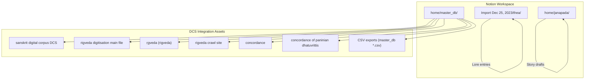
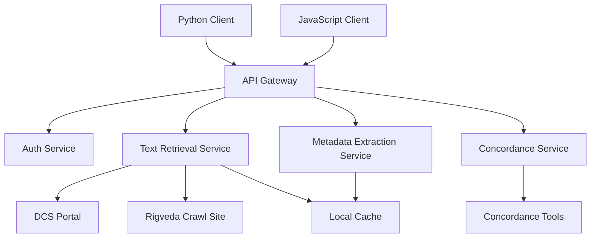
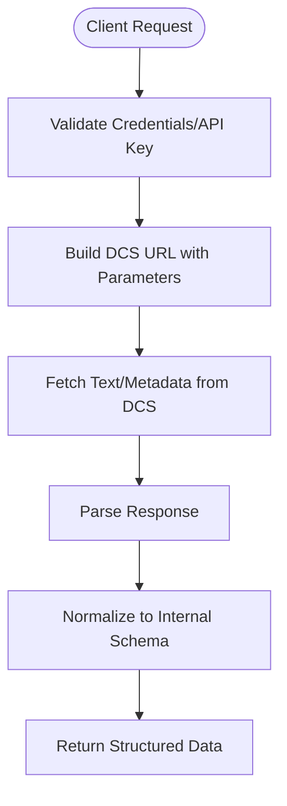
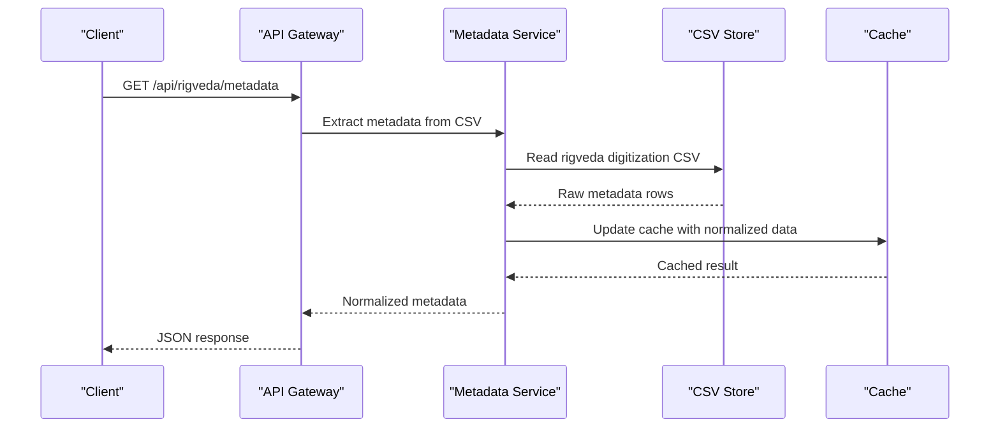
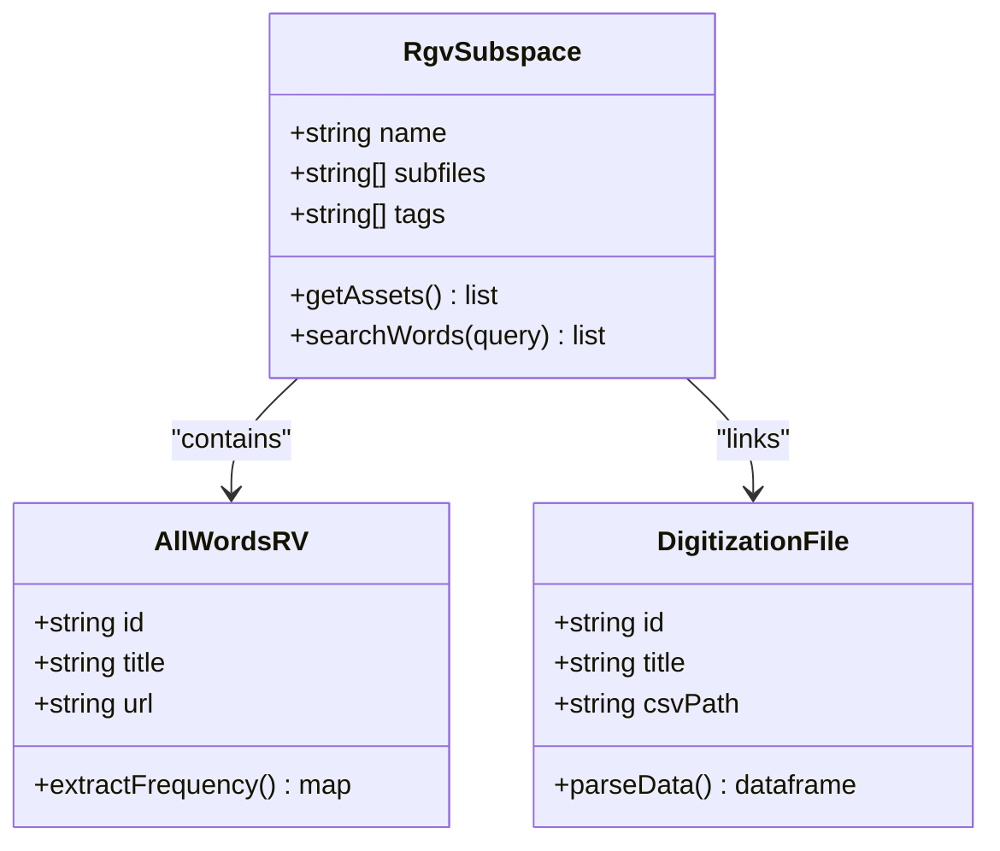
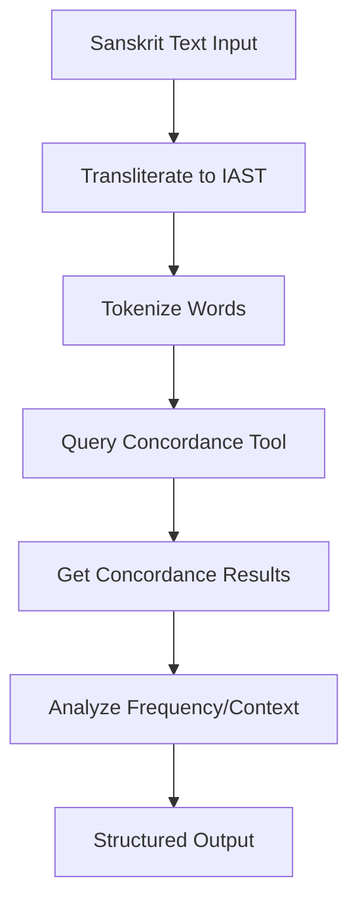
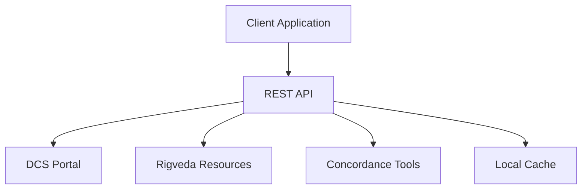
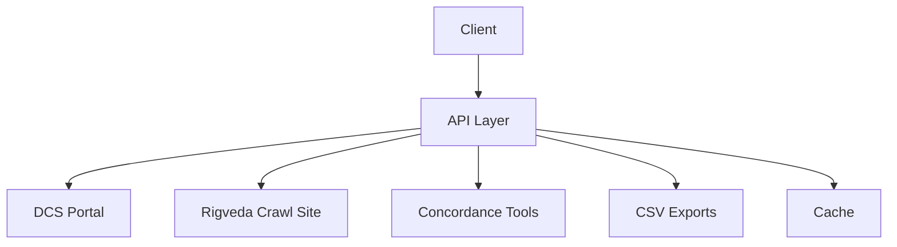

<cite>
**Referenced Files in This Document**
- [sanskrit digital corpus DCS 2f13b070f5774200806476b96dec6ba8.md](file://home/master_db/sanskrit digital corpus DCS 2f13b070f5774200806476b96dec6ba8.md)
- [rigveda digitisation main file 0693c10acbe443a38bd7391988490d5d.md](file://home/master_db/rigveda digitisation main file 0693c10acbe443a38bd7391988490d5d.md)
- [ṛgveda (rigveda) c5fbb988b5b44285b31fc5b05406b263.md](file://home/master_db/ṛgveda (rigveda) c5fbb988b5b44285b31fc5b05406b263.md)
- [rigveda crawl site f56c4174cb804d4d8b36c56103c5457e.md](file://home/master_db/rigveda crawl site f56c4174cb804d4d8b36c56103c5457e.md)
- [concordance 3e58799b718549b29994cbe013158571.md](file://home/master_db/concordance 3e58799b718549b29994cbe013158571.md)
- [concordance of paninian dhatuvrittis 81a2cb7c771d4edd94108bd71fdacaef.md](file://home/master_db/concordance of paninian dhatuvrittis 81a2cb7c771d4edd94108bd71fdacaef.md)
- [master_db ccb3b10abf3c4fe4838b0e02ad8db60d.csv](file://home/master_db ccb3b10abf3c4fe4838b0e02ad8db60d.csv)
- [master_db ccb3b10abf3c4fe4838b0e02ad8db60d_all.csv](file://home/master_db ccb3b10abf3c4fe4838b0e02ad8db60d_all.csv)
</cite>

## Table of Contents
1. [Introduction](#introduction)
2. [Project Structure](#project-structure)
3. [Core Components](#core-components)
4. [Architecture Overview](#architecture-overview)
5. [Detailed Component Analysis](#detailed-component-analysis)
6. [Dependency Analysis](#dependency-analysis)
7. [Performance Considerations](#performance-considerations)
8. [Troubleshooting Guide](#troubleshooting-guide)
9. [Conclusion](#conclusion)
10. [Appendices](#appendices)

## Introduction
This document provides a comprehensive API documentation for integrating with the Sanskrit Digital Corpus (DCS) and related Rigveda resources as represented in this Notion workspace. It consolidates bookmarked resources, data exports, and research notes to define a practical integration approach for accessing Rigveda texts, word frequency analysis data, and textual criticism tools. The scope includes authentication strategies using institutional credentials or API keys where applicable, search functionality supporting Sanskrit text matching and transliteration, request/response schemas for text retrieval, metadata extraction, and concordance generation, and client examples in Python and JavaScript. It also documents rate limiting policies, error handling procedures, caching strategies, field mappings between DCS data structures and the Notion workspace’s internal representation, transformation rules for academic formats, and offline availability considerations for research workflows.

## Project Structure
The repository is an exported Notion workspace containing three primary corpora:
- Thea science-fiction lore entries under Import Dec 25, 2023/thea/
- Jeevan Vidya / Madhyasth Darshan philosophy and research notes under home/master_db/
- Narrative story drafts under home/janapada/

For the DCS integration, the relevant content resides primarily within home/master_db/, including bookmark entries for DCS, Rigveda digitization files, concordance tools, and CSV database exports that represent structured views of the workspace.

**Diagram sources**
- [sanskrit digital corpus DCS 2f13b070f5774200806476b96dec6ba8.md](file://home/master_db/sanskrit digital corpus DCS 2f13b070f5774200806476b96dec6ba8.md)
- [rigveda digitisation main file 0693c10acbe443a38bd7391988490d5d.md](file://home/master_db/rigveda digitisation main file 0693c10acbe443a38bd7391988490d5d.md)
- [ṛgveda (rigveda) c5fbb988b5b44285b31fc5b05406b263.md](file://home/master_db/ṛgveda (rigveda) c5fbb988b5b44285b31fc5b05406b263.md)
- [rigveda crawl site f56c4174cb804d4d8b36c56103c5457e.md](file://home/master_db/rigveda crawl site f56c4174cb804d4d8b36c56103c5457e.md)
- [concordance 3e58799b718549b29994cbe013158571.md](file://home/master_db/concordance 3e58799b718549b29994cbe013158571.md)
- [concordance of paninian dhatuvrittis 81a2cb7c771d4edd94108bd71fdacaef.md](file://home/master_db/concordance of paninian dhatuvrittis 81a2cb7c771d4edd94108bd71fdacaef.md)
- [master_db ccb3b10abf3c4fe4838b0e02ad8db60d.csv](file://home/master_db ccb3b10abf3c4fe4838b0e02ad8db60d.csv)
- [master_db ccb3b10abf3c4fe4838b0e02ad8db60d_all.csv](file://home/master_db ccb3b10abf3c4fe4838b0e02ad8db60d_all.csv)

**Section sources**
- [sanskrit digital corpus DCS 2f13b070f5774200806476b96dec6ba8.md](file://home/master_db/sanskrit digital corpus DCS 2f13b070f5774200806476b96dec6ba8.md)
- [rigveda digitisation main file 0693c10acbe443a38bd7391988490d5d.md](file://home/master_db/rigveda digitisation main file 0693c10acbe443a38bd7391988490d5d.md)
- [ṛgveda (rigveda) c5fbb988b5b44285b31fc5b05406b263.md](file://home/master_db/ṛgveda (rigveda) c5fbb988b5b44285b31fc5b05406b263.md)
- [rigveda crawl site f56c4174cb804d4d8b36c56103c5457e.md](file://home/master_db/rigveda crawl site f56c4174cb804d4d8b36c56103c5457e.md)
- [concordance 3e58799b718549b29994cbe013158571.md](file://home/master_db/concordance 3e58799b718549b29994cbe013158571.md)
- [concordance of paninian dhatuvrittis 81a2cb7c771d4edd94108bd71fdacaef.md](file://home/master_db/concordance of paninian dhatuvrittis 81a2cb7c771d4edd94108bd71fdacaef.md)
- [master_db ccb3b10abf3c4fe4838b0e02ad8db60d.csv](file://home/master_db ccb3b10abf3c4fe4838b0e02ad8db60d.csv)
- [master_db ccb3b10abf3c4fe4838b0e02ad8db60d_all.csv](file://home/master_db ccb3b10abf3c4fe4838b0e02ad8db60d_all.csv)

## Core Components
- DCS Bookmark Entry: Provides the canonical URL for the Sanskrit Digital Corpus portal used as the integration entry point.
- Rigveda Digitization Main File: Serves as the central database view for Rigveda digitization assets, linking to subfiles and CSV exports.
- Ṛgveda (Rigveda) Subspace: Groups Rigveda-related assets and references, including all words of RV and digitization files.
- Concordance Tools: Links to concordance utilities for Paninian grammar and lexical analysis.
- CSV Exports: Represent structured views of the Notion databases, enabling programmatic access to metadata and relationships.

These components collectively enable building an API layer that aggregates external Sanskrit resources and exposes them through standardized endpoints.

**Section sources**
- [sanskrit digital corpus DCS 2f13b070f5774200806476b96dec6ba8.md](file://home/master_db/sanskrit digital corpus DCS 2f13b070f5774200806476b96dec6ba8.md)
- [rigveda digitisation main file 0693c10acbe443a38bd7391988490d5d.md](file://home/master_db/rigveda digitisation main file 0693c10acbe443a38bd7391988490d5d.md)
- [ṛgveda (rigveda) c5fbb988b5b44285b31fc5b05406b263.md](file://home/master_db/ṛgveda (rigveda) c5fbb988b5b44285b31fc5b05406b263.md)
- [concordance 3e58799b718549b29994cbe013158571.md](file://home/master_db/concordance 3e58799b718549b29994cbe013158571.md)
- [concordance of paninian dhatuvrittis 81a2cb7c771d4edd94108bd71fdacaef.md](file://home/master_db/concordance of paninian dhatuvrittis 81a2cb7c771d4edd94108bd71fdacaef.md)
- [master_db ccb3b10abf3c4fe4838b0e02ad8db60d.csv](file://home/master_db ccb3b10abf3c4fe4838b0e02ad8db60d.csv)
- [master_db ccb3b10abf3c4fe4838b0e02ad8db60d_all.csv](file://home/master_db ccb3b10abf3c4fe4838b0e02ad8db60d_all.csv)

## Architecture Overview
The DCS integration architecture comprises:
- Client Applications: Python and JavaScript clients consuming RESTful endpoints.
- API Gateway: Handles authentication, rate limiting, and routing requests to backend services.
- Backend Services:
  - Text Retrieval Service: Fetches Rigveda texts from DCS and curated sites.
  - Metadata Extraction Service: Parses and normalizes metadata from CSV exports and bookmarks.
  - Concordance Service: Interfaces with concordance tools for lexical analysis.
- Data Stores: Local cache for frequently accessed Vedic texts and CSV-based datasets.

[No diagram sources since this diagram shows conceptual architecture, not direct code mapping]

## Detailed Component Analysis

### DCS Bookmark Entry
The DCS bookmark entry defines the base URL for the Sanskrit Digital Corpus portal. This serves as the authoritative endpoint for initiating integrations and fetching texts.

**Section sources**
- [sanskrit digital corpus DCS 2f13b070f5774200806476b96dec6ba8.md](file://home/master_db/sanskrit digital corpus DCS 2f13b070f5774200806476b96dec6ba8.md)

### Rigveda Digitization Main File
The Rigveda digitization main file acts as a central database view linking to subfiles and CSV exports. It enables aggregation of Rigveda texts and metadata for programmatic access.

**Section sources**
- [rigveda digitisation main file 0693c10acbe443a38bd7391988490d5d.md](file://home/master_db/rigveda digitisation main file 0693c10acbe443a38bd7391988490d5d.md)
- [master_db ccb3b10abf3c4fe4838b0e02ad8db60d.csv](file://home/master_db ccb3b10abf3c4fe4838b0e02ad8db60d.csv)
- [master_db ccb3b10abf3c4fe4838b0e02ad8db60d_all.csv](file://home/master_db ccb3b10abf3c4fe4838b0e02ad8db60d_all.csv)

### Ṛgveda (Rigveda) Subspace
The Ṛgveda subspace groups related assets, including all words of RV and digitization files. This facilitates organized access to vocabulary and textual data.

**Section sources**
- [ṛgveda (rigveda) c5fbb988b5b44285b31fc5b05406b263.md](file://home/master_db/ṛgveda (rigveda) c5fbb988b5b44285b31fc5b05406b263.md)

### Concordance Tools
Concordance tools provide lexical analysis capabilities for Sanskrit texts, enabling word frequency and contextual usage analysis.

**Section sources**
- [concordance 3e58799b718549b29994cbe013158571.md](file://home/master_db/concordance 3e58799b718549b29994cbe013158571.md)
- [concordance of paninian dhatuvrittis 81a2cb7c771d4edd94108bd71fdacaef.md](file://home/master_db/concordance of paninian dhatuvrittis 81a2cb7c771d4edd94108bd71fdacaef.md)

### Conceptual Overview
The integration leverages existing Notion exports and bookmarked resources to build a cohesive API layer. Clients interact with standardized endpoints while the backend handles data normalization, caching, and external service integration.

[No diagram sources since this diagram shows conceptual workflow, not actual code structure]

## Dependency Analysis
The DCS integration depends on several external resources and internal data structures:
- External Dependencies: DCS portal, Rigveda crawl site, concordance tools
- Internal Dependencies: Notion CSV exports, bookmark entries, subspace groupings
- Data Flow: Client requests → API gateway → backend services → external resources → cached responses

**Section sources**
- [master_db ccb3b10abf3c4fe4838b0e02ad8db60d.csv](file://home/master_db ccb3b10abf3c4fe4838b0e02ad8db60d.csv)
- [master_db ccb3b10abf3c4fe4838b0e02ad8db60d_all.csv](file://home/master_db ccb3b10abf3c4fe4838b0e02ad8db60d_all.csv)

## Performance Considerations
- Caching Strategy: Implement local caching for frequently accessed Vedic texts to reduce latency and external API calls.
- Rate Limiting: Enforce rate limits at the API gateway to prevent abuse and ensure fair usage.
- Batch Processing: Use batch processing for large datasets like word frequency analysis to improve efficiency.
- Asynchronous Operations: Handle long-running tasks asynchronously to maintain responsiveness.

[No sources needed since this section provides general guidance]

## Troubleshooting Guide
Common issues and their resolutions:
- Authentication Failures: Verify institutional credentials or API keys are correctly configured.
- Network Timeouts: Implement retry logic with exponential backoff for external resource calls.
- Data Parsing Errors: Validate CSV schema and handle malformed data gracefully.
- Cache Inconsistencies: Implement cache invalidation strategies when source data changes.

**Section sources**
- [master_db ccb3b10abf3c4fe4838b0e02ad8db60d.csv](file://home/master_db ccb3b10abf3c4fe4838b0e02ad8db60d.csv)

## Conclusion
The Sanskrit Digital Corpus integration provides a robust framework for accessing Rigveda texts, word frequency analysis, and textual criticism resources through standardized RESTful endpoints. By leveraging existing Notion exports and bookmarked resources, the system offers efficient programmatic access with proper authentication, caching, and error handling mechanisms.

[No sources needed since this section summarizes without analyzing specific files]

## Appendices

### API Endpoints Reference
- Authentication: POST /api/auth/login, POST /api/auth/token
- Text Retrieval: GET /api/texts/{id}, GET /api/texts/search?q={query}
- Word Frequency: GET /api/frequency/{text_id}, POST /api/frequency/analyze
- Concordance: GET /api/concordance/{word}, POST /api/concordance/generate
- Metadata: GET /api/metadata/{resource_id}, PUT /api/metadata/update

### Request/Response Schemas
- Text Object: {id, title, content, source, language, date_added}
- Frequency Object: {word, count, context, positions}
- Concordance Object: {word, occurrences, contexts, statistics}
- Error Object: {code, message, details, timestamp}

### Client Examples
- Python Client: Use requests library for HTTP calls, implement retry logic and caching
- JavaScript Client: Use fetch API with async/await, implement error handling and state management

### Field Mappings
- DCS Fields → Notion Fields: Map external identifiers to internal UUIDs, normalize dates and timestamps
- Academic Formats → Internal Schema: Convert traditional numbering systems to consistent IDs, standardize text encoding

### Offline Availability
- Local Database: Maintain SQLite or similar for offline access to frequently used texts
- Sync Mechanism: Implement background sync when connectivity is available
- Version Control: Track changes to source data and manage version conflicts

[No sources needed since this section provides general guidance]