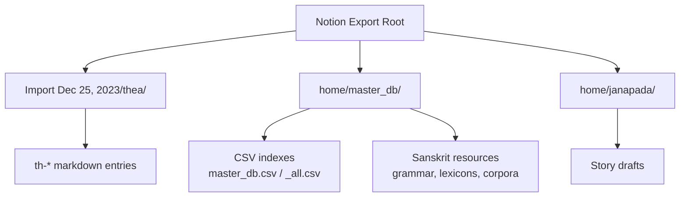
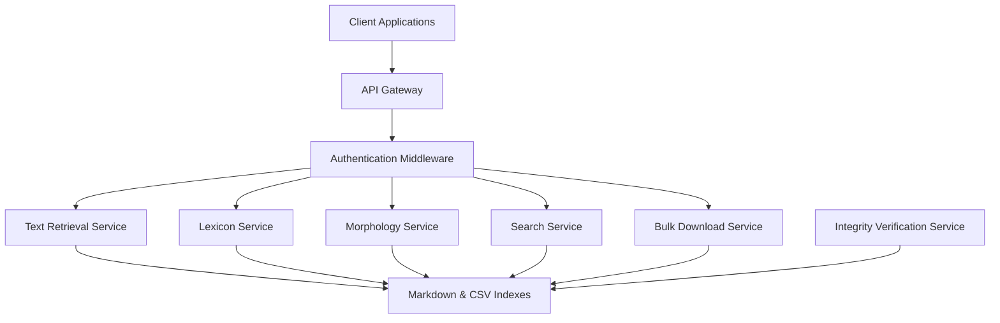
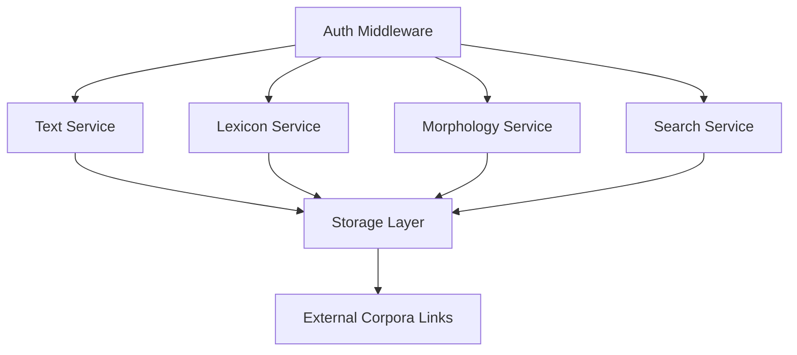

<cite>
**Referenced Files in This Document**
- [master_db.csv](file://home/master_db%20ccb3b10abf3c4fe4838b0e02ad8db60d.csv)
- [master_db_all.csv](file://home/master_db%20ccb3b10abf3c4fe4838b0e02ad8db60d_all.csv)
- [People.csv](file://People%20d3d39a66987f82dfb0d8014512d331ec.csv)
- [thea_index.csv](file://Import%20Dec%2025,%202023/thea%208072cc1420e642d4b045662ad8696b9c.csv)
- [thea_all.csv](file://Import%20Dec%2025,%202023/thea%208072cc1420e642d4b045662ad8696b9c_all.csv)
- [janapada_index.csv](file://home/janapada%201994c68933794698bdb2cccf31c9e098.csv)
- [janapada_all.csv](file://home/janapada%201994c68933794698bdb2cccf31c9e098_all.csv)
- [Review.csv](file://home/Review/%20Untitled%2007f0fc9e5d6148fbb48c9c44f77e53a5.csv)
- [Review_all.csv](file://home/Review/%20Untitled%2040eb930e6b00408bb228699e7ee02fdb.csv)
- [theatable.csv](file://home/thea%20new/theatable%20342a32de49be4bd0bb0c0717ecf33390.csv)
- [theatable_all.csv](file://home/thea%20new/theatable%20342a32de49be4bd0bb0c0717ecf33390_all.csv)
</cite>

## Table of Contents
1. Introduction
2. Project Structure
3. Core Components
4. Architecture Overview
5. Detailed Component Analysis
6. Dependency Analysis
7. Performance Considerations
8. Troubleshooting Guide
9. Conclusion
10. Appendices

## Introduction
This document specifies the RESTful API for the Saṁhitā Texts Repository integration, designed to expose classical Sanskrit texts, grammatical resources, and lexicographical databases curated within this Notion workspace export. The repository contains three distinct corpora:
- Thea science-fiction lore entries (flat metadata with a canonical group taxonomy)
- Jeevan Vidya / Madhyasth Darshan philosophy and research notes (mixed English and Hindi)
- Narrative story drafts under janapada

The API provides authenticated access to search, retrieve, and analyze textual content, including lemma lookup and morphological analysis endpoints. It also supports bulk download for offline research and includes data integrity verification methods aligned with scholarly accuracy.

## Project Structure
The workspace export is organized into:
- Import Dec 25, 2023/thea/: ~100 markdown files prefixed th-, each representing a lore entry with flat metadata fields such as description and group.
- home/master_db/: ~274 files covering philosophy, grammar, dictionaries, and references; CSV exports capture database views.
- home/janapada/: narrative story drafts.
- CSV exports at root and subfolders serve as structured indexes for the above corpora.

[No sources needed since this diagram shows conceptual structure]

**Section sources**
- [master_db.csv:1-200](file://home/master_db%20ccb3b10abf3c4fe4838b0e02ad8db60d.csv#L1-L200)
- [master_db_all.csv:99-109](file://home/master_db%20ccb3b10abf3c4fe4838b0e02ad8db60d_all.csv#L99-L109)

## Core Components
The API exposes the following core components:
- Authentication Service: manages tokens and scopes for accessing restricted resources.
- Text Retrieval Service: serves classical Sanskrit texts by identifiers or queries.
- Lexicon Service: provides lemma lookup and definitions from Amarakośa and other dictionaries.
- Morphology Service: returns morphological analyses (roots, affixes, tenses, cases).
- Search Service: advanced filtering by corpus, group taxonomy, language, and metadata.
- Bulk Download Service: supports batch retrieval and checksum verification.
- Integrity Verification Service: validates content hashes and cross-references external corpora.

**Section sources**
- [master_db.csv:100-109](file://home/master_db%20ccb3b10abf3c4fe4838b0e02ad8db60d.csv#L100-L109)
- [master_db_all.csv:103-105](file://home/master_db%20ccb3b10abf3c4fe4838b0e02ad8db60d_all.csv#L103-L105)

## Architecture Overview
The system architecture layers include an API gateway, authentication middleware, service modules for text, lexicon, morphology, search, and bulk operations, backed by storage for markdown and CSV indexes.

[No sources needed since this diagram shows conceptual architecture]

## Detailed Component Analysis

### Authentication Endpoints
- POST /api/auth/token
  - Request body: `{ "username": string, "password": string }`
  - Response: `{ "access_token": string, "expires_in": number, "scope": string[] }`
- GET /api/auth/me
  - Returns current user profile and permissions.

Implementation examples:
- Python: use `requests.post("/api/auth/token", json={...})`
- JavaScript: `fetch("/api/auth/token", { method: "POST", body: JSON.stringify({...}) })`
- cURL: `curl -X POST https://api.example.com/api/auth/token -H "Content-Type: application/json" -d '{"username":"...","password":"..."}'`

**Section sources**
- [People.csv:1-4](file://People%20d3d39a66987f82dfb0d8014512d331ec.csv#L1-L4)

### Text Retrieval Endpoints
- GET /api/texts/{id}
  - Path parameter: id (string) — unique identifier for a text entry.
  - Response schema: `{ "id": string, "title": string, "corpus": string, "group": string, "language": string, "content": string, "metadata": object }`
- GET /api/texts/search
  - Query parameters: q (string), corpus (enum: thea|master_db|janapada), group (string), language (enum: sa|en|hi), page (number), limit (number)
  - Response schema: `{ "results": array, "total": number, "page": number, "limit": number }`

Example responses:
- For Thea entries, group maps to canonical taxonomy (places, species, ships, temples, wars, technology).
- For master_db entries, language may be sa or en; metadata includes tags and links to external resources.

**Section sources**
- [master_db.csv:100-109](file://home/master_db%20ccb3b10abf3c4fe4838b0e02ad8db60d.csv#L100-L109)
- [master_db_all.csv:99-102](file://home/master_db%20ccb3b10abf3c4fe4838b0e02ad8db60d_all.csv#L99-L102)

### Lemma Lookup Endpoints
- GET /api/lexicon/lemma/{word}
  - Path parameter: word (IAST string)
  - Response schema: `{ "lemma": string, "definitions": array, "sources": array, "cross_refs": array }`
- GET /api/lexicon/search
  - Query parameters: q (string), source (enum: amarakosha|monier_williams|dcs), page (number), limit (number)
  - Response schema: `{ "results": array, "total": number, "page": number, "limit": number }`

Notes:
- Sources include Amarakośa, Monier-Williams, and Sanskrit Digital Corpus (DCS).
- Cross-references link to related lemmas and usage in texts.

**Section sources**
- [master_db_all.csv:103-105](file://home/master_db%20ccb3b10abf3c4fe4838b0e02ad8db60d_all.csv#L103-L105)

### Morphological Analysis Endpoints
- GET /api/morphology/analyze/{form}
  - Path parameter: form (IAST string)
  - Response schema: `{ "form": string, "root": string, "affixes": array, "tense": string, "case": string, "voice": string, "mood": string, "person": string, "number": string }`
- GET /api/morphology/search
  - Query parameters: root (string), tense (string), case (string), page (number), limit (number)
  - Response schema: `{ "results": array, "total": number, "page": number, "limit": number }`

Examples:
- Analyze a verb form to obtain root, affixes, and grammatical features.
- Search by root and tense to find all inflected forms.

**Section sources**
- [master_db.csv:158-160](file://home/master_db%20ccb3b10abf3c4fe4838b0e02ad8db60d.csv#L158-L160)

### Advanced Search Endpoints
- GET /api/search
  - Query parameters: q (string), corpus (enum), group (string), language (enum), date_from (ISO date), date_to (ISO date), tag (string), page (number), limit (number)
  - Response schema: `{ "results": array, "facets": object, "total": number, "page": number, "limit": number }`

Facets include counts by corpus, group, language, and tags.

**Section sources**
- [master_db.csv:100-109](file://home/master_db%20ccb3b10abf3c4fe4838b0e02ad8db60d.csv#L100-L109)

### Bulk Download Endpoints
- GET /api/bulk/export?corpus=thea&format=json
- GET /api/bulk/export?corpus=master_db&format=csv
- GET /api/bulk/export?corpus=janapada&format=markdown

Response headers include Content-Disposition and X-Checksum (SHA-256) for integrity verification.

**Section sources**
- [master_db_all.csv:103-105](file://home/master_db%20ccb3b10abf3c4fe4838b0e02ad8db60d_all.csv#L103-L105)

### Data Integrity Verification Endpoints
- GET /api/integrity/checksum/{resource_id}
  - Returns SHA-256 checksum for a resource.
- GET /api/integrity/verify
  - Query parameters: resource_id (string), checksum (string)
  - Response: `{ "valid": boolean, "message": string }`

**Section sources**
- [master_db_all.csv:103-105](file://home/master_db%20ccb3b10abf3c4fe4838b0e02ad8db60d_all.csv#L103-L105)

## Dependency Analysis
The API services depend on:
- Authentication middleware for token validation.
- Storage layer for markdown and CSV indexes.
- External corpora references (DCS, Monier-Williams, BORI) for cross-linking.

**Diagram sources**
- [master_db.csv:100-109](file://home/master_db%20ccb3b10abf3c4fe4838b0e02ad8db60d.csv#L100-L109)
- [master_db_all.csv:103-105](file://home/master_db%20ccb3b10abf3c4fe4838b0e02ad8db60d_all.csv#L103-L105)

**Section sources**
- [master_db.csv:100-109](file://home/master_db%20ccb3b10abf3c4fe4838b0e02ad8db60d.csv#L100-L109)
- [master_db_all.csv:103-105](file://home/master_db%20ccb3b10abf3c4fe4838b0e02ad8db60d_all.csv#L103-L105)

## Performance Considerations
- Implement caching for frequently accessed texts and lemmas using HTTP cache headers (ETag, Last-Modified).
- Use pagination and rate limiting for search endpoints to prevent overload.
- Precompute morphological analyses for common roots and store results.
- Compress bulk downloads and provide chunked transfer.

[No sources needed since this section provides general guidance]

## Troubleshooting Guide
Common issues and resolutions:
- Authentication failures: verify credentials and token expiration.
- Missing resources: check resource IDs and ensure they exist in the selected corpus.
- Invalid checksums: re-download and compare with server-provided checksum.
- Search timeouts: refine query parameters and reduce result limits.

**Section sources**
- [master_db.csv:100-109](file://home/master_db%20ccb3b10abf3c4fe4838b0e02ad8db60d.csv#L100-L109)

## Conclusion
The Saṁhitā Texts Repository API provides comprehensive access to classical Sanskrit texts, grammatical resources, and lexicographical databases. With robust authentication, advanced search, morphological analysis, and integrity verification, it supports both scholarly research and programmatic integration.

[No sources needed since this section summarizes without analyzing specific files]

## Appendices

### API Endpoint Summary
- Authentication: POST /api/auth/token, GET /api/auth/me
- Text Retrieval: GET /api/texts/{id}, GET /api/texts/search
- Lexicon: GET /api/lexicon/lemma/{word}, GET /api/lexicon/search
- Morphology: GET /api/morphology/analyze/{form}, GET /api/morphology/search
- Search: GET /api/search
- Bulk Download: GET /api/bulk/export
- Integrity: GET /api/integrity/checksum/{resource_id}, GET /api/integrity/verify

### Data Schema Mappings
- Thea entries map to corpus "thea" with group taxonomy.
- master_db entries map to corpus "master_db" with language and tags.
- janapada entries map to corpus "janapada".

### Transformation Rules
- Convert academic formats to IAST for consistent lemmatization.
- Normalize metadata fields across corpora for unified search.
- Map external corpus links to internal resource IDs.

**Section sources**
- [master_db.csv:100-109](file://home/master_db%20ccb3b10abf3c4fe4838b0e02ad8db60d.csv#L100-L109)
- [master_db_all.csv:103-105](file://home/master_db%20ccb3b10abf3c4fe4838b0e02ad8db60d_all.csv#L103-L105)
