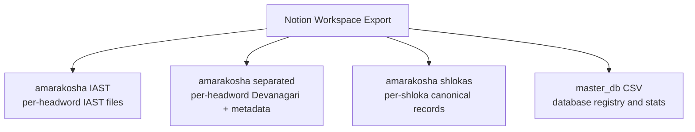
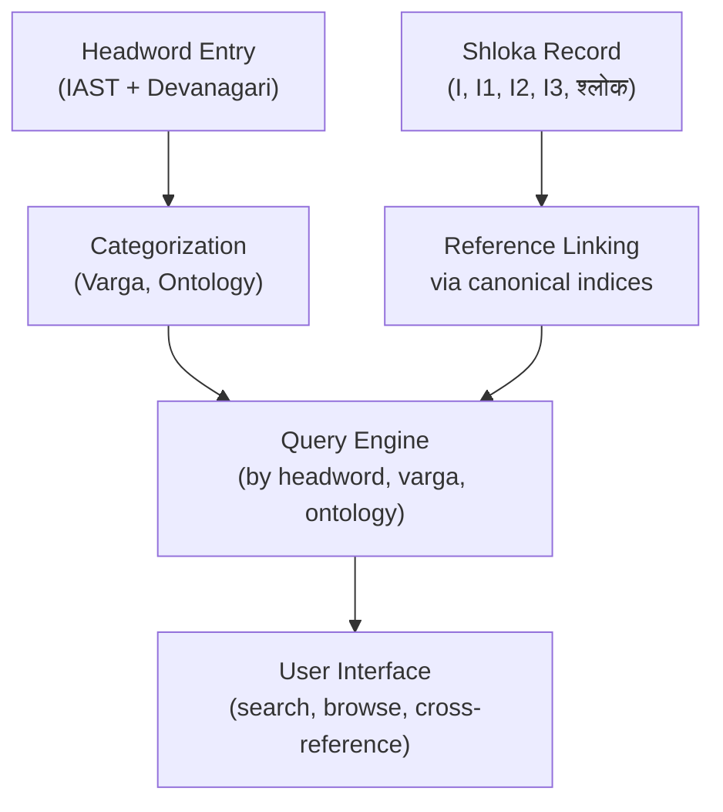
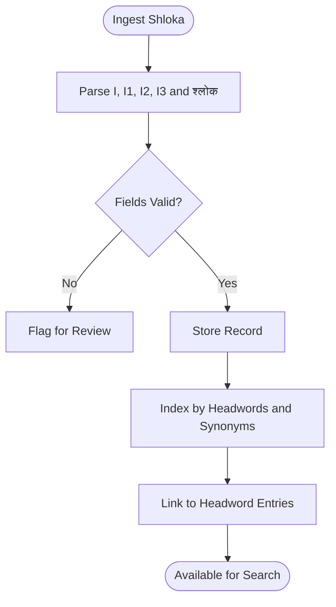
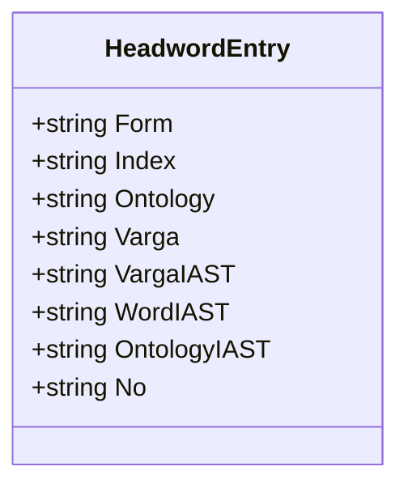
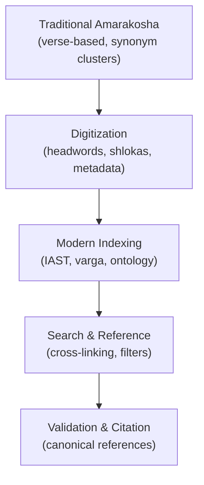
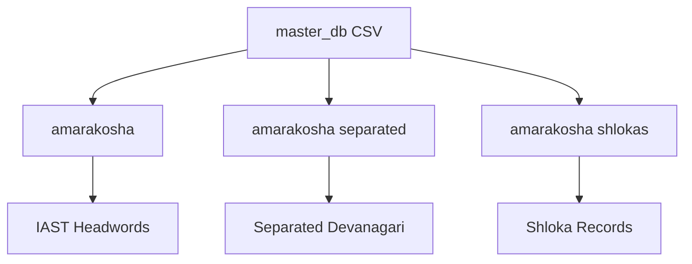

<cite>
**Referenced Files in This Document**
- [amarakosha 0ebc15a9be0049179b1156d4041755d4.md](file://home/master_db/amarakosha 0ebc15a9be0049179b1156d4041755d4.md)
- [amarakosha shlokas 025fb04ba492401f86bde892ce3e3cd7.md](file://home/master_db/amarakosha shlokas 025fb04ba492401f86bde892ce3e3cd7.md)
- [अ अग्नि (separated entry)](file://home/master_db/amarakosha separated/db_amarakoshaseparated/अग्नि 5092c70977564c4db448acd9f711fd9d.md)
- [abhiśāpaḥ praṇādastu śabdaḥ syādanurāgajaḥ (shloka entry)](file://home/master_db/amarakosha shlokas/db_amarakoshashlokas/abhiśāpaḥ praṇādastu śabdaḥ syādanurāgajaḥ 39211cbd067b46f0bedb6a3400389555.md)
- [master_db ccb3b10abf3c4fe4838b0e02ad8db60d.csv](file://home/master_db ccb3b10abf3c4fe4838b0e02ad8db60d.csv)
</cite>

## Table of Contents
1. [Introduction](#introduction)
2. [Project Structure](#project-structure)
3. [Core Components](#core-components)
4. [Architecture Overview](#architecture-overview)
5. [Detailed Component Analysis](#detailed-component-analysis)
6. [Dependency Analysis](#dependency-analysis)
7. [Performance Considerations](#performance-considerations)
8. [Troubleshooting Guide](#troubleshooting-guide)
9. [Conclusion](#conclusion)

## Introduction
This document explains the integration of the classical Amarakosha dictionary into a modern digital reference system. It covers how the traditional Sanskrit lexicographical text has been digitized, segmented into manageable components, and organized for contemporary search and cross-referencing. The repository provides three complementary views:
- IAST-based word entries (one file per headword)
- Separated Devanagari entries with structured metadata (form, index, ontology, varga)
- Shloka-based records preserving canonical verse locations and original text

These assets are managed within an exported Notion workspace that uses CSV exports as database views and markdown files as individual entries.

## Project Structure
The Amarakosha corpus is organized under home/master_db with three primary sub-corpora:
- amarakosha IAST: one markdown file per headword using IAST transliteration
- amarakosha separated: one markdown file per headword in Devanagari with structured fields (Form, Index, Ontology, Varga, Word IAST, ontology IAST, No.)
- amarakakosha shlokas: one markdown file per shloka with canonical location fields (I, I1, I2, I3) and the full shloka line

A master database export (master_db CSV) catalogs these databases and their usage metrics.

**Diagram sources**
- [amarakosha 0ebc15a9be0049179b1156d4041755d4.md](file://home/master_db/amarakosha 0ebc15a9be0049179b1156d4041755d4.md)
- [amarakosha shlokas 025fb04ba492401f86bde892ce3e3cd7.md](file://home/master_db/amarakosha shlokas 025fb04ba492401f86bde892ce3e3cd7.md)
- [master_db ccb3b10abf3c4fe4838b0e02ad8db60d.csv](file://home/master_db ccb3b10abf3c4fe4838b0e02ad8db60d.csv)

**Section sources**
- [amarakosha 0ebc15a9be0049179b1156d4041755d4.md](file://home/master_db/amarakosha 0ebc15a9be0049179b1156d4041755d4.md)
- [amarakosha shlokas 025fb04ba492401f86bde892ce3e3cd7.md](file://home/master_db/amarakosha shlokas 025fb04ba492401f86bde892ce3e3cd7.md)
- [master_db ccb3b10abf3c4fe4838b0e02ad8db60d.csv](file://home/master_db ccb3b10abf3c4fe4838b0e02ad8db60d.csv)

## Core Components
- IAST Headword Corpus: Each file represents a single headword in IAST. These serve as normalized lexical units for indexing and search across variants.
- Separated Devanagari Corpus: Each file contains structured fields:
  - Form: grammatical form tag
  - Index: canonical Amarakosha index path
  - Ontology: semantic categories in Devanagari
  - Varga: thematic category (varga) in Devanagari and IAST
  - Word IAST: normalized headword in IAST
  - ontology IAST: normalized semantic tags in IAST
  - No.: unique identifier
- Shloka Corpus: Each file captures a shloka with:
  - I, I1, I2, I3: canonical location identifiers
  - श्लोक : the original shloka line

These three corpora together enable:
- Lexical lookup by headword (IAST or Devanagari)
- Cross-referencing via canonical indices and vargas
- Verse-level provenance and scholarly citation

**Section sources**
- [अ अग्नि (separated entry)](file://home/master_db/amarakosha separated/db_amarakoshaseparated/अग्नि 5092c70977564c4db448acd9f711fd9d.md)
- [abhiśāpaḥ praṇādastu śabdaḥ syādanurāgajaḥ (shloka entry)](file://home/master_db/amarakosha shlokas/db_amarakoshashlokas/abhiśāpaḥ praṇādastu śabdaḥ syādanurāgajaḥ 39211cbd067b46f0bedb6a3400389555.md)

## Architecture Overview
The integration architecture maps traditional textual organization to modern data structures:
- Canonical indexing (I, I1, I2, I3) anchors each shloka to its source location
- Varga and ontology fields provide hierarchical categorization for synonym clusters
- IAST normalization enables consistent search across Devanagari and transliterated forms
- Separate corpora support different workflows: lexicography (headwords), philology (shlokas), and retrieval (searchable indexes)

[No sources needed since this diagram shows conceptual workflow, not actual code structure]

## Detailed Component Analysis

### Shloka-Based Organization and Cross-Referencing
Each shloka record preserves the canonical location and original text. This supports:
- Precise citation and verification against printed editions
- Mapping synonyms to their originating verses
- Scholarly validation through verse-level provenance

**Section sources**
- [abhiśāpaḥ praṇādastu śabdaḥ syādanurāgajaḥ (shloka entry)](file://home/master_db/amarakosha shlokas/db_amarakoshashlokas/abhiśāpaḥ praṇādastu śabdaḥ syādanurāgajaḥ 39211cbd067b46f0bedb6a3400389555.md)

### Separated Devanagari Entries and Metadata Schema
The separated entries standardize lexical data with explicit fields:
- Form: grammatical classification
- Index: canonical Amarakosha index path
- Ontology: semantic categories in Devanagari
- Varga: thematic grouping in Devanagari and IAST
- Word IAST: normalized headword
- ontology IAST: normalized semantic tags
- No.: unique ID

This schema enables:
- Fast filtering by varga and ontology
- Consistent IAST-based search
- Robust cross-referencing between headwords and shlokas

**Diagram sources**
- [अ अग्नि (separated entry)](file://home/master_db/amarakosha separated/db_amarakoshaseparated/अग्नि 5092c70977564c4db448acd9f711fd9d.md)

**Section sources**
- [अ अग्नि (separated entry)](file://home/master_db/amarakosha separated/db_amarakoshaseparated/अग्नि 5092c70977564c4db448acd9f711fd9d.md)

### IAST Headword Corpus
The IAST corpus provides normalized headwords for indexing and search. Each file corresponds to a single headword, enabling:
- Uniform representation across transliteration variants
- Efficient deduplication and merging
- Interoperability with other Sanskrit datasets

**Section sources**
- [amarakosha 0ebc15a9be0049179b1156d4041755d4.md](file://home/master_db/amarakosha 0ebc15a9be0049179b1156d4041755d4.md)

### Conceptual Overview
The integration bridges classical lexicography and modern information retrieval:
- Traditional shloka-centric organization is preserved for scholarly fidelity
- Structured metadata enables computational analysis and user-friendly browsing
- Canonical indexing ensures traceability back to source texts

[No sources needed since this diagram shows conceptual workflow, not actual code structure]

## Dependency Analysis
The Notion export artifacts create a registry of databases and usage statistics. The master_db CSV lists entries such as amarakosha, amarakosha separated, and amarakosha shlokas, along with timestamps and access metrics. This registry helps track:
- Which corpora are actively used
- Temporal patterns of engagement
- Relationships between databases and themes (e.g., Sanskrit theme)

**Diagram sources**
- [master_db ccb3b10abf3c4fe4838b0e02ad8db60d.csv](file://home/master_db ccb3b10abf3c4fe4838b0e02ad8db60d.csv)

**Section sources**
- [master_db ccb3b10abf3c4fe4838b0e02ad8db60d.csv](file://home/master_db ccb3b10abf3c4fe4838b0e02ad8db60d.csv)

## Performance Considerations
- File-per-entry model: Simple and transparent but may require aggregation for bulk operations
- IAST normalization: Reduces search complexity and improves match accuracy
- Canonical indexing: Enables fast cross-references without heavy joins
- Thematic filtering: Varga and ontology fields allow efficient subset queries

[No sources needed since this section provides general guidance]

## Troubleshooting Guide
Common issues and resolutions:
- Broken internal links: Notion export percent-encodes links; verify paths and re-link if necessary
- Missing files: Some referenced CSVs may not exist in the export; rely on available corpora
- Inconsistent transliteration: Ensure IAST normalization is applied consistently across entries
- Validation errors: Flag records with missing or malformed fields for review

**Section sources**
- [amarakosha 0ebc15a9be0049179b1156d4041755d4.md](file://home/master_db/amarakosha 0ebc15a9be0049179b1156d4041755d4.md)
- [amarakosha shlokas 025fb04ba492401f86bde892ce3e3cd7.md](file://home/master_db/amarakosha shlokas 025fb04ba492401f86bde892ce3e3cd7.md)

## Conclusion
The Amarakosha integration successfully digitizes and structures a classical Sanskrit dictionary for modern use. By preserving shloka-based provenance while introducing structured metadata and IAST normalization, the project enables both scholarly rigor and computational accessibility. The separation into IAST headwords, Devanagari entries, and shloka records supports diverse workflows from lexicography to philology, while canonical indexing ensures traceability and validation.

[No sources needed since this section summarizes without analyzing specific files]