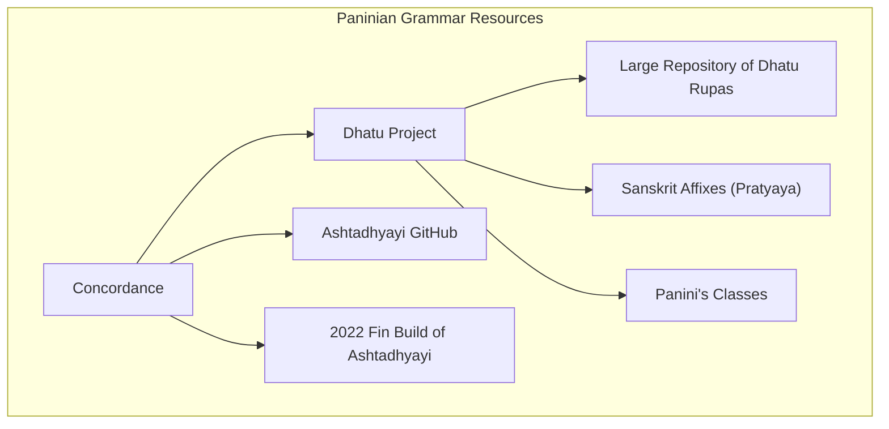
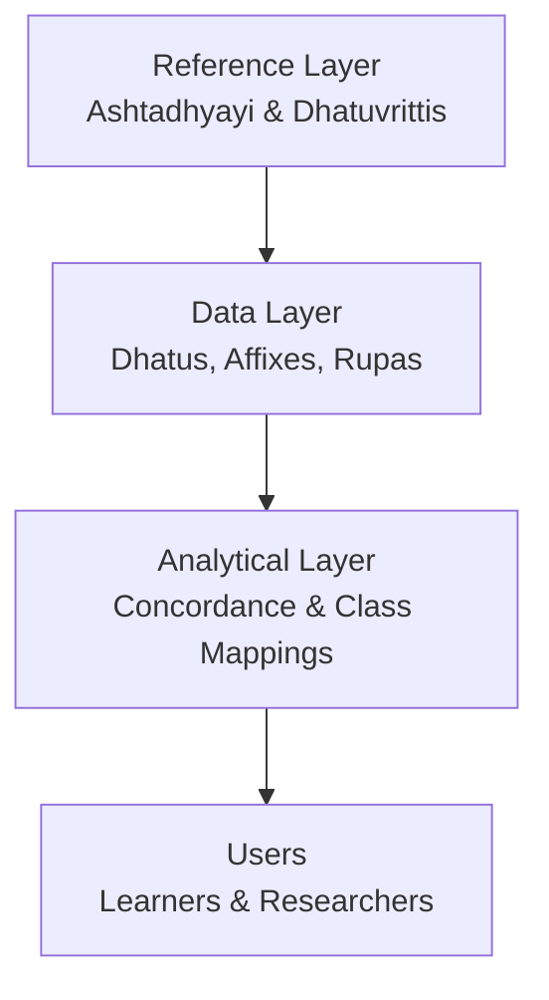
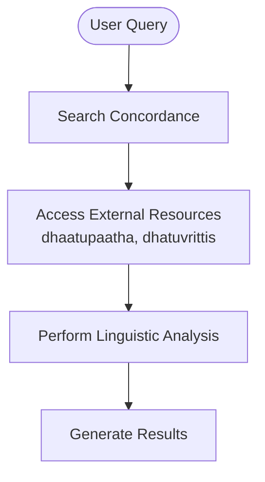
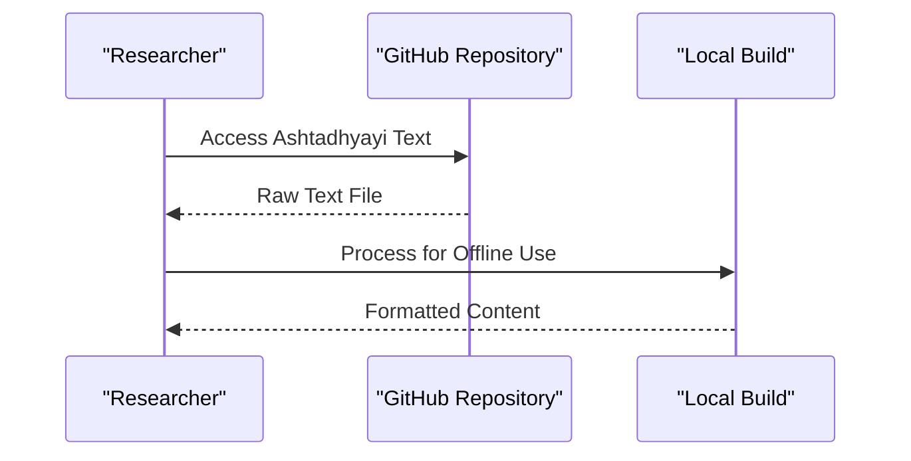
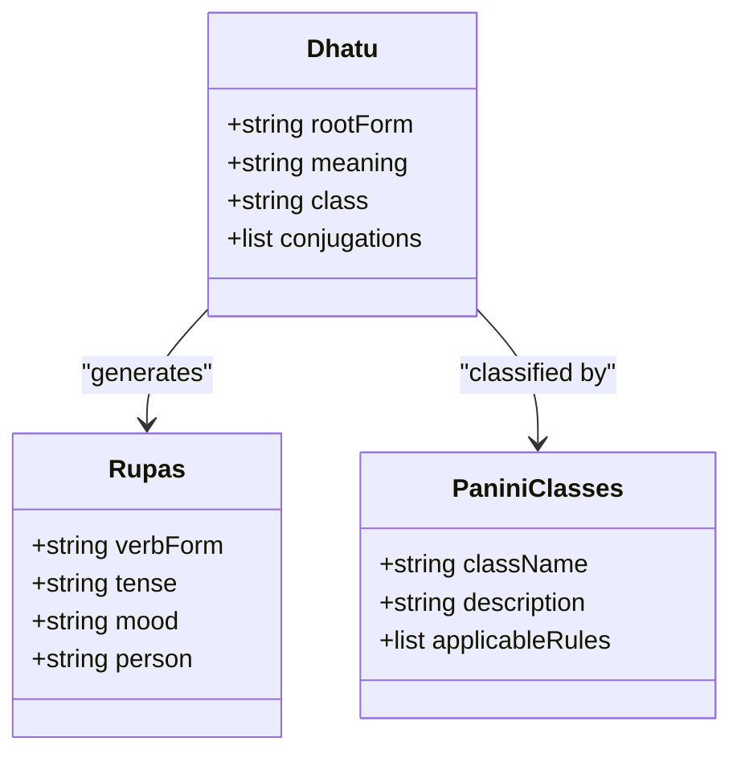
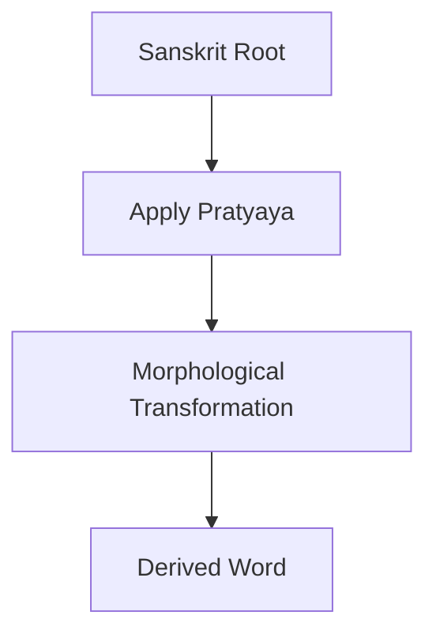
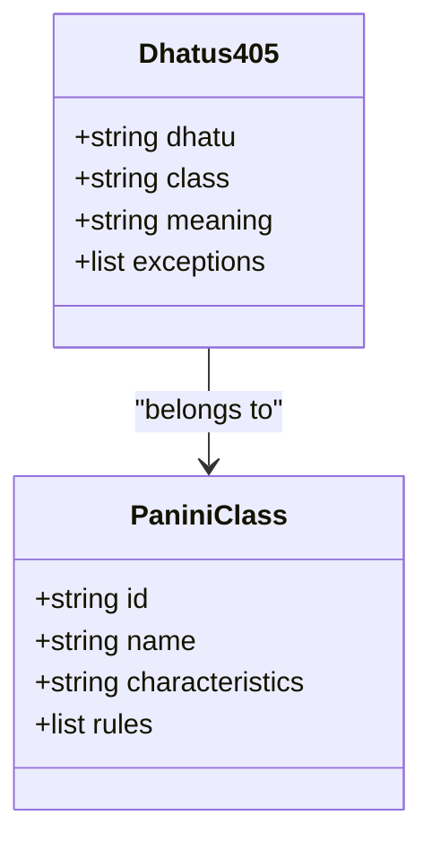
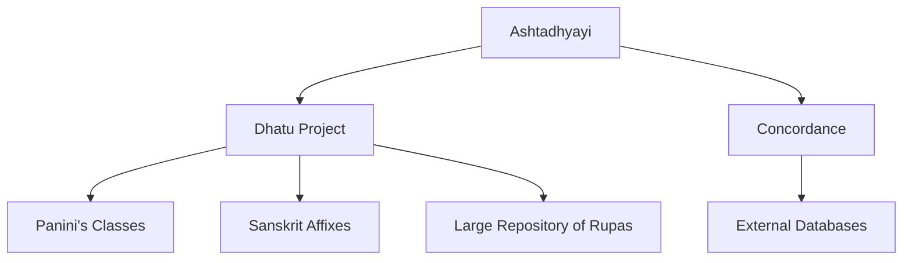

<cite>
**Referenced Files in This Document**
- [concordance 3e58799b718549b29994cbe013158571.md](file://home/master_db/concordance%203e58799b718549b29994cbe013158571.md)
- [concordance of paninian dhatuvrittis 81a2cb7c771d4edd94108bd71fdacaef.md](file://home/master_db/concordance%20of%20paninian%20dhatuvrittis%2081a2cb7c771d4edd94108bd71fdacaef.md)
- [ashtadhyayi github 77eb5ebe5e4447b78acea5761ce4f815.md](file://home/master_db/ashtadhyayi%20github%2077eb5ebe5e4447b78acea5761ce4f815.md)
- [2022 fin build of ashtadhyayi b07600c76f3b4299a9b45eed78fd1a7e.md](file://home/master_db/2022%20fin%20build%20of%20ashtadhyayi%20b07600c76f3b4299a9b45eed78fd1a7e.md)
- [dhatu project 1e5c1f6a49074d54a4b867ab9f5ad85a.md](file://home/master_db/dhatu%20project%201e5c1f6a49074d54a4b867ab9f5ad85a.md)
- [large repository of dhatu rupas dc3d0f2fe12344b78114034f2b22b3ef.md](file://home/master_db/large%20repository%20of%20dhatu%20rupas%20dc3d0f2fe12344b78114034f2b22b3ef.md)
- [sanskrit affixes pratyaya Untitled 327f99ad06584e2da54ead3466b2a672.csv](file://home/master_db/sanskrit%20affixes%20pratyaya/Untitled%20327f99ad06584e2da54ead3466b2a672.csv)
- [panini’s classes dhatubase panini classes d116d86f9de44a81ad4688b7184020eb.csv](file://home/master_db/panini%E2%80%99s%20classes/dhatubase%20panini%20classes%20d116d86f9de44a81ad4688b7184020eb.csv)
- [dhatus 405 deprecated dhatubase 405 dhatus 92c33f54e23345f694d0d0aef8fbaf.csv](file://home/master_db/dhatus%20405%20deprecated/dhatubase%20405%20dhatus%2092c33f54e23345f694d0d0aef8fbaf.csv)
</cite>

## Table of Contents
1. Introduction
2. Project Structure
3. Core Components
4. Architecture Overview
5. Detailed Component Analysis
6. Dependency Analysis
7. Performance Considerations
8. Troubleshooting Guide
9. Conclusion

## Introduction
This document provides a comprehensive guide to the Paninian grammar resources contained in this Notion workspace export. It explains how Ashtadhyayi materials, grammatical rules and patterns, root form analysis methodologies, and the Paninian classes system are organized and can be used for Sanskrit learning and research. It also documents the concordance system for Paninian dhatuvrittis and outlines technical approaches for implementing grammar processing tools and integrating with computational linguistics frameworks.

## Project Structure
The repository is an exported Notion workspace containing three primary corpora:
- Thea science-fiction lore (Import Dec 25, 2023/thea/)
- Jeevan Vidya / Madhyasth Darshan philosophy and research notes (home/master_db/)
- Narrative story drafts (home/janapada/)

For Paninian grammar resources, the relevant corpus is home/master_db/, which includes:
- Concordance entries linking to external Sanskrit websites and datasets
- Ashtadhyayi references and builds
- Dhatu (root forms) projects, including large repositories of verb forms (rupas)
- Affixes (pratyayas) documentation and CSV exports
- Paninian classes data for dhatus

**Diagram sources**
- [concordance 3e58799b718549b29994cbe013158571.md](file://home/master_db/concordance%203e58799b718549b29994cbe013158571.md)
- [concordance of paninian dhatuvrittis 81a2cb7c771d4edd94108bd71fdacaef.md](file://home/master_db/concordance%20of%20paninian%20dhatuvrittis%2081a2cb7c771d4edd94108bd71fdacaef.md)
- [ashtadhyayi github 77eb5ebe5e4447b78acea5761ce4f815.md](file://home/master_db/ashtadhyayi%20github%2077eb5ebe5e4447b78acea5761ce4f815.md)
- [2022 fin build of ashtadhyayi b07600c76f3b4299a9b45eed78fd1a7e.md](file://home/master_db/2022%20fin%20build%20of%20ashtadhyayi%20b07600c76f3b4299a9b45eed78fd1a7e.md)
- [dhatu project 1e5c1f6a49074d54a4b867ab9f5ad85a.md](file://home/master_db/dhatu%20project%201e5c1f6a49074d54a4b867ab9f5ad85a.md)
- [large repository of dhatu rupas dc3d0f2fe12344b78114034f2b22b3ef.md](file://home/master_db/large%20repository%20of%20dhatu%20rupas%20dc3d0f2fe12344b78114034f2b22b3ef.md)

**Section sources**
- [dhatu project 1e5c1f6a49074d54a4b867ab9f5ad85a.md](file://home/master_db/dhatu%20project%201e5c1f6a49074d54a4b867ab9f5ad85a.md)
- [large repository of dhatu rupas dc3d0f2fe12344b78114034f2b22b3ef.md](file://home/master_db/large%20repository%20of%20dhatu%20rupas%20dc3d0f2fe12344b78114034f2b22b3ef.md)

## Core Components
- Concordance System: Links to external Sanskrit resources such as dhaatupaatha and curated databases for dhatuvrittis. These serve as entry points for linguistic analysis and cross-referencing.
- Ashtadhyayi Materials: References to authoritative texts and builds, including GitHub-hosted data files and local builds for offline study.
- Dhatu Project: Central hub organizing dhatus (roots), their classifications, conjugation tables (rupas), and related datasets.
- Sanskrit Affixes (Pratyaya): Catalog of suffixes and prepositions with functional descriptions, supporting morphological analysis.
- Paninian Classes: Structured classification of dhatus according to Paninian grammatical categories, enabling systematic rule application.

**Section sources**
- [concordance 3e58799b718549b29994cbe013158571.md](file://home/master_db/concordance%203e58799b718549b29994cbe013158571.md)
- [concordance of paninian dhatuvrittis 81a2cb7c771d4edd94108bd71fdacaef.md](file://home/master_db/concordance%20of%20paninian%20dhatuvrittis%2081a2cb7c771d4edd94108bd71fdacaef.md)
- [ashtadhyayi github 77eb5ebe5e4447b78acea5761ce4f815.md](file://home/master_db/ashtadhyayi%20github%2077eb5ebe5e4447b78acea5761ce4f815.md)
- [2022 fin build of ashtadhyayi b07600c76f3b4299a9b45eed78fd1a7e.md](file://home/master_db/2022%20fin%20build%20of%20ashtadhyayi%20b07600c76f3b4299a9b45eed78fd1a7e.md)
- [dhatu project 1e5c1f6a49074d54a4b867ab9f5ad85a.md](file://home/master_db/dhatu%20project%201e5c1f6a49074d54a4b867ab9f5ad85a.md)
- [large repository of dhatu rupas dc3d0f2fe12344b78114034f2b22b3ef.md](file://home/master_db/large%20repository%20of%20dhatu%20rupas%20dc3d0f2fe12344b78114034f2b22b3ef.md)

## Architecture Overview
The Paninian grammar resource architecture integrates reference materials, structured datasets, and analytical tools:
- Reference Layer: Ashtadhyayi texts and dhatuvrittis provide foundational rules and commentaries.
- Data Layer: CSV exports and markdown entries organize dhatus, affixes, and conjugation tables.
- Analytical Layer: Concordance links and class mappings enable morphological parsing and syntactic analysis.

**Diagram sources**
- [ashtadhyayi github 77eb5ebe5e4447b78acea5761ce4f815.md](file://home/master_db/ashtadhyayi%20github%2077eb5ebe5e4447b78acea5761ce4f815.md)
- [concordance of paninian dhatuvrittis 81a2cb7c771d4edd94108bd71fdacaef.md](file://home/master_db/concordance%20of%20paninian%20dhatuvrittis%2081a2cb7c771d4edd94108bd71fdacaef.md)
- [dhatu project 1e5c1f6a49074d54a4b867ab9f5ad85a.md](file://home/master_db/dhatu%20project%201e5c1f6a49074d54a4b867ab9f5ad85a.md)

## Detailed Component Analysis

### Concordance System for Paninian Dhatuvrittis
The concordance system facilitates access to external Sanskrit resources and curated databases. Key components include:
- Direct links to dhaatupaatha for root form analysis
- Bookmark entries for dhatuvrittis databases
- Metadata fields for tracking usage and versioning

**Diagram sources**
- [concordance 3e58799b718549b29994cbe013158571.md](file://home/master_db/concordance%203e58799b718549b29994cbe013158571.md)
- [concordance of paninian dhatuvrittis 81a2cb7c771d4edd94108bd71fdacaef.md](file://home/master_db/concordance%20of%20paninian%20dhatuvrittis%2081a2cb7c771d4edd94108bd71fdacaef.md)

**Section sources**
- [concordance 3e58799b718549b29994cbe013158571.md](file://home/master_db/concordance%203e58799b718549b29994cbe013158571.md)
- [concordance of paninian dhatuvrittis 81a2cb7c771d4edd94108bd71fdacaef.md](file://home/master_db/concordance%20of%20paninian%20dhatuvrittis%2081a2cb7c771d4edd94108bd71fdacaef.md)

### Ashtadhyayi Materials and Builds
Ashtadhyayi resources include:
- GitHub-hosted text files for programmatic access
- Local builds for offline study and development
- Versioned entries tracking updates and revisions

**Diagram sources**
- [ashtadhyayi github 77eb5ebe5e4447b78acea5761ce4f815.md](file://home/master_db/ashtadhyayi%20github%2077eb5ebe5e4447b78acea5761ce4f815.md)
- [2022 fin build of ashtadhyayi b07600c76f3b4299a9b45eed78fd1a7e.md](file://home/master_db/2022%20fin%20build%20of%20ashtadhyayi%20b07600c76f3b4299a9b45eed78fd1a7e.md)

**Section sources**
- [ashtadhyayi github 77eb5ebe5e4447b78acea5761ce4f815.md](file://home/master_db/ashtadhyayi%20github%2077eb5ebe5e4447b78acea5761ce4f815.md)
- [2022 fin build of ashtadhyayi b07600c76f3b4299a9b45eed78fd1a7e.md](file://home/master_db/2022%20fin%20build%20of%20ashtadhyayi%20b07600c76f3b4299a9b45eed78fd1a7e.md)

### Dhatu Project and Root Form Analysis
The dhatu project serves as the central hub for Sanskrit root forms and their conjugations:
- Organizes dhatus with metadata and relationships
- Provides large repositories of verb forms (rupas)
- Integrates with Paninian classes for systematic analysis

**Diagram sources**
- [dhatu project 1e5c1f6a49074d54a4b867ab9f5ad85a.md](file://home/master_db/dhatu%20project%201e5c1f6a49074d54a4b867ab9f5ad85a.md)
- [large repository of dhatu rupas dc3d0f2fe12344b78114034f2b22b3ef.md](file://home/master_db/large%20repository%20of%20dhatu%20rupas%20dc3d0f2fe12344b78114034f2b22b3ef.md)
- [panini’s classes dhatubase panini classes d116d86f9de44a81ad4688b7184020eb.csv](file://home/master_db/panini%E2%80%99s%20classes/dhatubase%20panini%20classes%20d116d86f9de44a81ad4688b7184020eb.csv)

**Section sources**
- [dhatu project 1e5c1f6a49074d54a4b867ab9f5ad85a.md](file://home/master_db/dhatu%20project%201e5c1f6a49074d54a4b867ab9f5ad85a.md)
- [large repository of dhatu rupas dc3d0f2fe12344b78114034f2b22b3ef.md](file://home/master_db/large%20repository%20of%20dhatu%20rupas%20dc3d0f2fe12344b78114034f2b22b3ef.md)

### Sanskrit Affixes (Pratyaya) Documentation
Affixes are documented with functional descriptions and usage patterns:
- Suffixes for forming nouns, adjectives, and verbal derivatives
- Prepositions indicating spatial and temporal relationships
- Specialized markers for grammatical transformations

**Diagram sources**
- [sanskrit affixes pratyaya Untitled 327f99ad06584e2da54ead3466b2a672.csv](file://home/master_db/sanskrit%20affixes%20pratyaya/Untitled%20327f99ad06584e2da54ead3466b2a672.csv)

**Section sources**
- [sanskrit affixes pratyaya Untitled 327f99ad06584e2da54ead3466b2a672.csv](file://home/master_db/sanskrit%20affixes%20pratyaya/Untitled%20327f99ad06584e2da54ead3466b2a672.csv)

### Paninian Classes System
The Paninian classes system organizes dhatus into grammatical categories:
- Classification based on phonetic and semantic properties
- Rule applicability determined by class membership
- Support for automated morphological analysis

**Diagram sources**
- [dhatus 405 deprecated dhatubase 405 dhatus 92c33f54e23345f694d0d0aef8fbaf.csv](file://home/master_db/dhatus%20405%20deprecated/dhatubase%20405%20dhatus%2092c33f54e23345f694d0d0aef8fbaf.csv)
- [panini’s classes dhatubase panini classes d116d86f9de44a81ad4688b7184020eb.csv](file://home/master_db/panini%E2%80%99s%20classes/dhatubase%20panini%20classes%20d116d86f9de44a81ad4688b7184020eb.csv)

**Section sources**
- [dhatus 405 deprecated dhatubase 405 dhatus 92c33f54e23345f694d0d0aef8fbaf.csv](file://home/master_db/dhatus%20405%20deprecated/dhatubase%20405%20dhatus%2092c33f54e23345f694d0d0aef8fbaf.csv)
- [panini’s classes dhatubase panini classes d116d86f9de44a81ad4688b7184020eb.csv](file://home/master_db/panini%E2%80%99s%20classes/dhatubase%20panini%20classes%20d116d86f9de44a81ad4688b7184020eb.csv)

## Dependency Analysis
The Paninian grammar resources exhibit clear dependency relationships:
- Concordance entries depend on external Sanskrit databases
- Dhatu project integrates multiple data sources (classes, affixes, rupas)
- Ashtadhyayi materials provide foundational rules for all components

**Diagram sources**
- [concordance 3e58799b718549b29994cbe013158571.md](file://home/master_db/concordance%203e58799b718549b29994cbe013158571.md)
- [dhatu project 1e5c1f6a49074d54a4b867ab9f5ad85a.md](file://home/master_db/dhatu%20project%201e5c1f6a49074d54a4b867ab9f5ad85a.md)
- [ashtadhyayi github 77eb5ebe5e4447b78acea5761ce4f815.md](file://home/master_db/ashtadhyayi%20github%2077eb5ebe5e4447b78acea5761ce4f815.md)

**Section sources**
- [dhatu project 1e5c1f6a49074d54a4b867ab9f5ad85a.md](file://home/master_db/dhatu%20project%201e5c1f6a49074d54a4b867ab9f5ad85a.md)

## Performance Considerations
When implementing grammar processing tools using these resources:
- Optimize database queries for large rupa repositories
- Cache frequently accessed Ashtadhyayi rules
- Implement efficient indexing for dhatu searches
- Use batch processing for morphological analysis tasks

## Troubleshooting Guide
Common issues and solutions:
- Broken internal links in Notion exports: Verify file paths and update references
- Missing CSV data: Check export completeness and re-download if necessary
- External resource availability: Monitor uptime of linked Sanskrit databases
- Version compatibility: Ensure consistency between different builds and datasets

**Section sources**
- [concordance 3e58799b718549b29994cbe013158571.md](file://home/master_db/concordance%203e58799b718549b29994cbe013158571.md)
- [ashtadhyayi github 77eb5ebe5e4447b78acea5761ce4f815.md](file://home/master_db/ashtadhyayi%20github%2077eb5ebe5e4447b78acea5761ce4f815.md)

## Conclusion
The Paninian grammar resources in this workspace provide a comprehensive foundation for Sanskrit linguistic analysis. By organizing Ashtadhyayi materials, dhatu classifications, affix documentation, and conjugation tables, the system supports both traditional scholarship and computational linguistics applications. The concordance system enables seamless integration with external resources, while the structured data format facilitates automation and scalability. Users can leverage these resources for language learning, academic research, and the development of advanced Sanskrit processing tools.