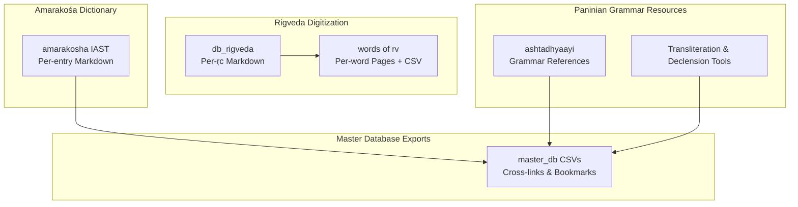
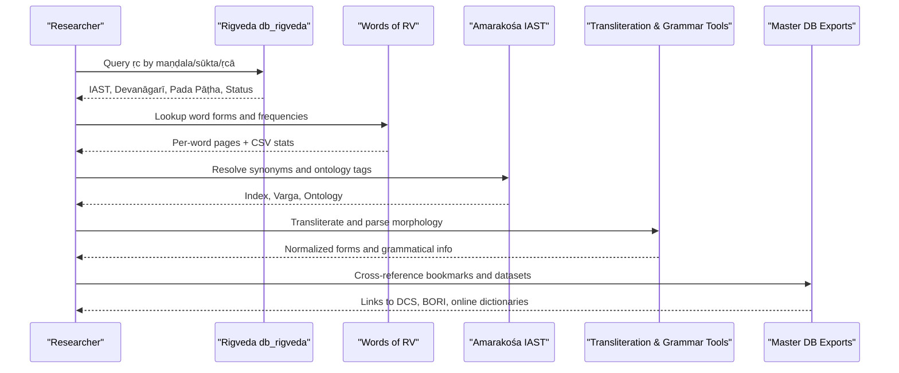
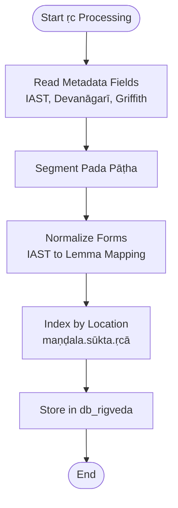
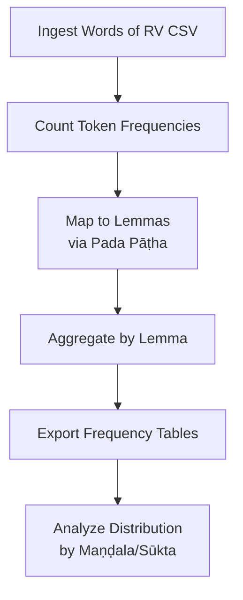
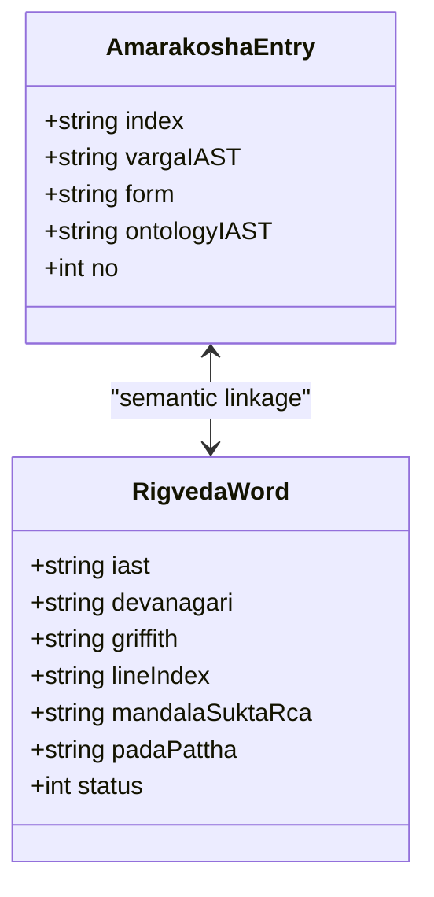
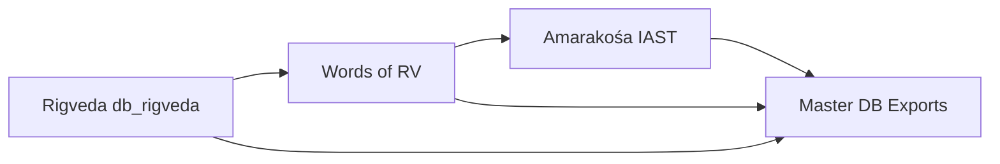

<cite>
**Referenced Files in This Document**
- [rigveda digitisation main file/db_rigveda/1 - 1 0ea099aff8a544d38b94131014ff7cd2.md](file://home/master_db/rigveda%20digitisation%20main%20file/db_rigveda/1%20-%201%200ea099aff8a544d38b94131014ff7cd2.md)
- [all words of rv/words of rv/abadhiram 82de367543e542d9875ecebac8457ddd.md](file://home/master_db/all%20words%20of%20rv/words%20of%20rv/abadhiram%2082de367543e542d9875ecebac8457ddd.md)
- [amarakosha/amarakosha IAST/a 3fe363b00e3c42e784eff9b6ebeb4ddc.md](file://home/master_db/amarakosha/amarakosha%20IAST/a%203fe363b00e3c42e784eff9b6ebeb4ddc.md)
- [master_db ccb3b10abf3c4fe4838b0e02ad8db60d.csv](file://home/master_db%20ccb3b10abf3c4fe4838b0e02ad8db60d.csv)
- [master_db ccb3b10abf3c4fe4838b0e02ad8db60d_all.csv](file://home/master_db%20ccb3b10abf3c4fe4838b0e02ad8db60d_all.csv)
</cite>

## Table of Contents
1. [Introduction](#introduction)
2. [Project Structure](#project-structure)
3. [Core Components](#core-components)
4. [Architecture Overview](#architecture-overview)
5. [Detailed Component Analysis](#detailed-component-analysis)
6. [Dependency Analysis](#dependency-analysis)
7. [Performance Considerations](#performance-considerations)
8. [Troubleshooting Guide](#troubleshooting-guide)
9. [Conclusion](#conclusion)
10. [Appendices](#appendices)

## Introduction
This document presents a comprehensive overview of the Sanskrit studies corpus contained in this Notion workspace export. It focuses on three pillars:
- Rigveda digitization: structured per-ṛc files with IAST, Devanāgarī, transliteration, and cross-references.
- Paninian grammar resources: links to Ashtādhyāyī, dhatu resources, declension engines, and transliteration tools.
- Amarakośa dictionary integration: lemmatized entries organized by index and ontology tags.

The repository is a personal knowledge vault rather than executable code. It contains:
- A large digital corpus for Rigveda (per-ṛc markdown files), word frequency lists, and related databases.
- Amarakośa entries as individual markdown pages with IAST forms, indices, and ontology fields.
- Curated bookmarks and database exports linking to external Sanskrit resources (DCS, BORI, online dictionaries, transliteration tools).

## Project Structure
The Sanskrit-related content is primarily under home/master_db, organized into thematic folders and CSV exports that represent database views. Key directories include:
- rigveda digitisation main file/db_rigveda: one markdown file per ṛc with standardized metadata.
- all words of rv: per-word markdown pages and CSV exports for frequency analysis.
- amarakosha/amarakosha IAST: per-entry lexicographical records.
- ashtadhyaayi: Paninian grammar materials and references.
- master_db CSVs: exported views of the Notion databases used to organize and cross-link resources.

**Diagram sources**
- [rigveda digitisation main file/db_rigveda/1 - 1 0ea099aff8a544d38b94131014ff7cd2.md](file://home/master_db/rigveda%20digitisation%20main%20file/db_rigveda/1%20-%201%200ea099aff8a544d38b94131014ff7cd2.md)
- [all words of rv/words of rv/abadhiram 82de367543e542d9875ecebac8457ddd.md](file://home/master_db/all%20words%20of%20rv/words%20of%20rv/abadhiram%2082de367543e542d9875ecebac8457ddd.md)
- [amarakosha/amarakosha IAST/a 3fe363b00e3c42e784eff9b6ebeb4ddc.md](file://home/master_db/amarakosha/amarakosha%20IAST/a%203fe363b00e3c42e784eff9b6ebeb4ddc.md)
- [master_db ccb3b10abf3c4fe4838b0e02ad8db60d.csv](file://home/master_db%20ccb3b10abf3c4fe4838b0e02ad8db60d.csv)
- [master_db ccb3b10abf3c4fe4838b0e02ad8db60d_all.csv](file://home/master_db%20ccb3b10abf3c4fe4838b0e02ad8db60d_all.csv)

**Section sources**
- [master_db ccb3b10abf3c4fe4838b0e02ad8db60d.csv](file://home/master_db%20ccb3b10abf3c4fe4838b0e02ad8db60d.csv)
- [master_db ccb3b10abf3c4fe4838b0e02ad8db60d_all.csv](file://home/master_db%20ccb3b10abf3c4fe4838b0e02ad8db60d_all.csv)

## Core Components
- Rigveda per-ṛc records: Each ṛc is represented by a markdown file containing IAST text, Devanāgarī, English translation, line index, maṇḍala/sūkta/ṛcā identifiers, pada pāṭha segmentation, and status. This structure supports computational processing, concordance building, and textual criticism workflows.
- Word frequency corpus: The “all words of rv” folder provides per-word pages and CSV exports suitable for frequency analysis, lemma normalization, and morphological studies.
- Amarakośa lexicography: Entries are stored as individual markdown files with IAST form, index reference, varga classification, and ontology tags, enabling semantic indexing and cross-referencing.
- Paninian grammar resources: The workspace includes curated bookmarks and database entries pointing to Ashtādhyāyī texts, dhatu resources, declension engines, and transliteration utilities.

**Section sources**
- [rigveda digitisation main file/db_rigveda/1 - 1 0ea099aff8a544d38b94131014ff7cd2.md](file://home/master_db/rigveda%20digitisation%20main%20file/db_rigveda/1%20-%201%200ea099aff8a544d38b94131014ff7cd2.md)
- [all words of rv/words of rv/abadhiram 82de367543e542d9875ecebac8457ddd.md](file://home/master_db/all%20words%20of%20rv/words%20of%20rv/abadhiram%2082de367543e542d9875ecebac8457ddd.md)
- [amarakosha/amarakosha IAST/a 3fe363b00e3c42e784eff9b6ebeb4ddc.md](file://home/master_db/amarakosha/amarakosha%20IAST/a%203fe363b00e3c42e784eff9b6ebeb4ddc.md)
- [master_db ccb3b10abf3c4fe4838b0e02ad8db60d_all.csv](file://home/master_db%20ccb3b10abf3c4fe4838b0e02ad8db60d_all.csv)

## Architecture Overview
The corpus architecture integrates classical Sanskrit texts with modern indexing systems through a consistent metadata schema and cross-linked resources. The workflow connects Rigveda ṛc records to word-level entries and lexicographical data, while leveraging external tools for transliteration and grammatical analysis.

**Diagram sources**
- [rigveda digitisation main file/db_rigveda/1 - 1 0ea099aff8a544d38b94131014ff7cd2.md](file://home/master_db/rigveda%20digitisation%20main%20file/db_rigveda/1%20-%201%200ea099aff8a544d38b94131014ff7cd2.md)
- [all words of rv/words of rv/abadhiram 82de367543e542d9875ecebac8457ddd.md](file://home/master_db/all%20words%20of%20rv/words%20of%20rv/abadhiram%2082de367543e542d9875ecebac8457ddd.md)
- [amarakosha/amarakosha IAST/a 3fe363b00e3c42e784eff9b6ebeb4ddc.md](file://home/master_db/amarakosha/amarakosha%20IAST/a%203fe363b00e3c42e784eff9b6ebeb4ddc.md)
- [master_db ccb3b10abf3c4fe4838b0e02ad8db60d_all.csv](file://home/master_db%20ccb3b10abf3c4fe4838b0e02ad8db60d_all.csv)

## Detailed Component Analysis

### Rigveda Digitization
Each ṛc record follows a consistent schema:
- IAST: Canonical transliterated text.
- Devanāgarī: Original script representation.
- Griffith: English translation.
- Line index: Stable identifier for cross-referencing.
- Maṇḍala, sūkta, ṛcā: Hierarchical location within the Rigveda.
- Pada pāṭha: Segmented word forms for morphological analysis.
- Status: Editorial or verification state.

This structure enables:
- Concordance generation across maṇḍalas and sūktas.
- Textual criticism via status tracking and variant comparison.
- Computational linguistics pipelines using pada pāṭha for tokenization and parsing.

**Diagram sources**
- [rigveda digitisation main file/db_rigveda/1 - 1 0ea099aff8a544d38b94131014ff7cd2.md](file://home/master_db/rigveda%20digitisation%20main%20file/db_rigveda/1%20-%201%200ea099aff8a544d38b94131014ff7cd2.md)

**Section sources**
- [rigveda digitisation main file/db_rigveda/1 - 1 0ea099aff8a544d38b94131014ff7cd2.md](file://home/master_db/rigveda%20digitisation%20main%20file/db_rigveda/1%20-%201%200ea099aff8a544d38b94131014ff7cd2.md)

### Word Frequency Analysis
The “all words of rv” directory provides:
- Per-word markdown pages for each attested form.
- CSV exports aggregating counts and metadata for statistical analysis.

Methods supported:
- Frequency counting across the entire corpus.
- Lemma normalization using pada pāṭha segmentation.
- Cross-referencing with Amarakośa entries for semantic clustering.

**Diagram sources**
- [all words of rv/words of rv/abadhiram 82de367543e542d9875ecebac8457ddd.md](file://home/master_db/all%20words%20of%20rv/words%20of%20rv/abadhiram%2082de367543e542d9875ecebac8457ddd.md)

**Section sources**
- [all words of rv/words of rv/abadhiram 82de367543e542d9875ecebac8457ddd.md](file://home/master_db/all%20words%20of%20rv/words%20of%20rv/abadhiram%2082de367543e542d9875ecebac8457ddd.md)

### Amarakośa Dictionary Integration
Amarakośa entries are structured as:
- Index: Reference to the traditional index.
- Varga IAST: Lexicographical category.
- Form: Headword in IAST.
- Ontology IAST: Semantic tags for conceptual mapping.
- No.: Unique entry number.

This schema supports:
- Semantic indexing and concept-based retrieval.
- Cross-referencing between Rigveda vocabulary and lexicographical categories.
- Lexicographical tooling for synonym clusters and ontological tagging.

**Diagram sources**
- [amarakosha/amarakosha IAST/a 3fe363b00e3c42e784eff9b6ebeb4ddc.md](file://home/master_db/amarakosha/amarakosha%20IAST/a%203fe363b00e3c42e784eff9b6ebeb4ddc.md)
- [rigveda digitisation main file/db_rigveda/1 - 1 0ea099aff8a544d38b94131014ff7cd2.md](file://home/master_db/rigveda%20digitisation%20main%20file/db_rigveda/1%20-%201%200ea099aff8a544d38b94131014ff7cd2.md)

**Section sources**
- [amarakosha/amarakosha IAST/a 3fe363b00e3c42e784eff9b6ebeb4ddc.md](file://home/master_db/amarakosha/amarakosha%20IAST/a%203fe363b00e3c42e784eff9b6ebeb4ddc.md)

### Paninian Grammar and Computational Linguistics
The workspace curates resources for Paninian grammar and computational tools:
- Ashtādhyāyī references and GitHub repositories.
- Dhatu projects and deprecated dhatus catalogs.
- Online transliteration tools and declension engines.
- Concordance resources for dhatuvrittis.

These resources enable:
- Morphological analysis using Paninian rules.
- Automated transliteration between scripts.
- Lexical lookup and root-based searches.

**Section sources**
- [master_db ccb3b10abf3c4fe4838b0e02ad8db60d_all.csv](file://home/master_db%20ccb3b10abf3c4fe4838b0e02ad8db60d_all.csv)

## Dependency Analysis
The corpus exhibits clear dependencies between components:
- Rigveda ṛc records depend on pada pāṭha segmentation for morphological analysis.
- Word frequency analysis depends on both Rigveda tokens and Amarakośa lemmas for normalization.
- Master DB exports link all components via bookmarks and database relationships.

**Diagram sources**
- [rigveda digitisation main file/db_rigveda/1 - 1 0ea099aff8a544d38b94131014ff7cd2.md](file://home/master_db/rigveda%20digitisation%20main%20file/db_rigveda/1%20-%201%200ea099aff8a544d38b94131014ff7cd2.md)
- [all words of rv/words of rv/abadhiram 82de367543e542d9875ecebac8457ddd.md](file://home/master_db/all%20words%20of%20rv/words%20of%20rv/abadhiram%2082de367543e542d9875ecebac8457ddd.md)
- [amarakosha/amarakosha IAST/a 3fe363b00e3c42e784eff9b6ebeb4ddc.md](file://home/master_db/amarakosha/amarakosha%20IAST/a%203fe363b00e3c42e784eff9b6ebeb4ddc.md)
- [master_db ccb3b10abf3c4fe4838b0e02ad8db60d_all.csv](file://home/master_db%20ccb3b10abf3c4fe4838b0e02ad8db60d_all.csv)

**Section sources**
- [master_db ccb3b10abf3c4fe4838b0e02ad8db60d_all.csv](file://home/master_db%20ccb3b10abf3c4fe4838b0e02ad8db60d_all.csv)

## Performance Considerations
- File-per-record design: Each ṛc and word has its own markdown file, facilitating parallel processing but requiring efficient indexing for large-scale queries.
- CSV exports: Provide batch-friendly formats for statistical analysis and machine learning pipelines.
- Metadata consistency: Standardized fields (IAST, Devanāgarī, pada pāṭha) reduce preprocessing overhead.
- External tool integration: Leverage existing transliteration and declension engines to avoid reinventing complex NLP pipelines.

## Troubleshooting Guide
Common issues and resolutions:
- Broken internal links: Notion exports often contain percent-encoded or outdated links; verify URLs against current resource locations.
- Missing files: Some referenced pages may not exist in the export; rely on CSV exports and external links for continuity.
- Transliteration inconsistencies: Use canonical IAST forms and validate with online transliteration tools.
- Data normalization: Ensure consistent lemma mapping from pada pāṭha to canonical roots using Paninian resources.

**Section sources**
- [master_db ccb3b10abf3c4fe4838b0e02ad8db60d.csv](file://home/master_db%20ccb3b10abf3c4fe4838b0e02ad8db60d.csv)
- [master_db ccb3b10abf3c4fe4838b0e02ad8db60d_all.csv](file://home/master_db%20ccb3b10abf3c4fe4838b0e02ad8db60d_all.csv)

## Conclusion
This Sanskrit studies corpus provides a robust foundation for digital humanities research, combining classical texts with modern computational methods. The Rigveda digitization offers structured per-ṛc records, the word frequency corpus enables statistical analysis, and the Amarakośa integration supports semantic indexing. Paninian grammar resources and external tools complete the ecosystem for morphological and lexicographical studies. Researchers can leverage this infrastructure for concordance building, textual criticism, and computational linguistics applications.

## Appendices
- External resources cataloged in master_db include DCS, BORI, online dictionaries, transliteration tools, and Paninian grammar repositories.
- Recommended workflows: Start with Rigveda ṛc records, extract tokens via pada pāṭha, normalize to lemmas, cross-reference with Amarakośa, and analyze frequencies using CSV exports.