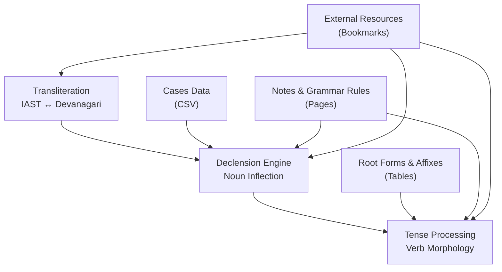
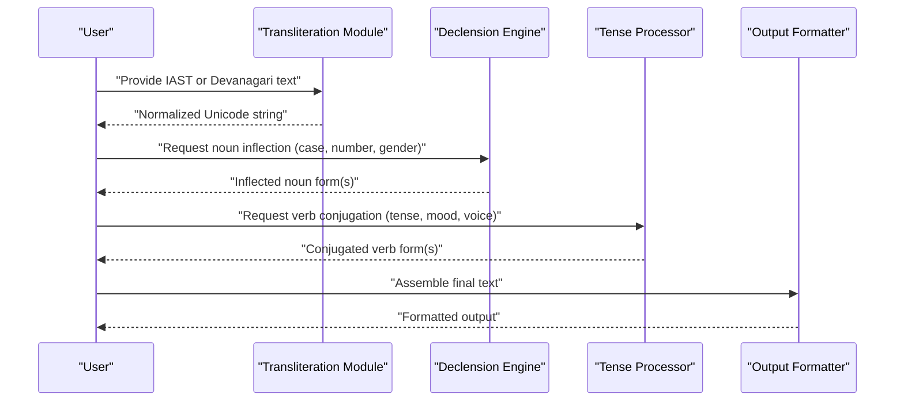
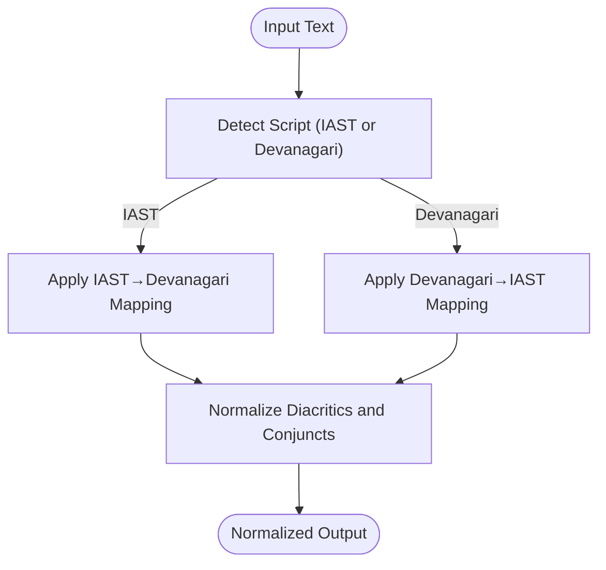
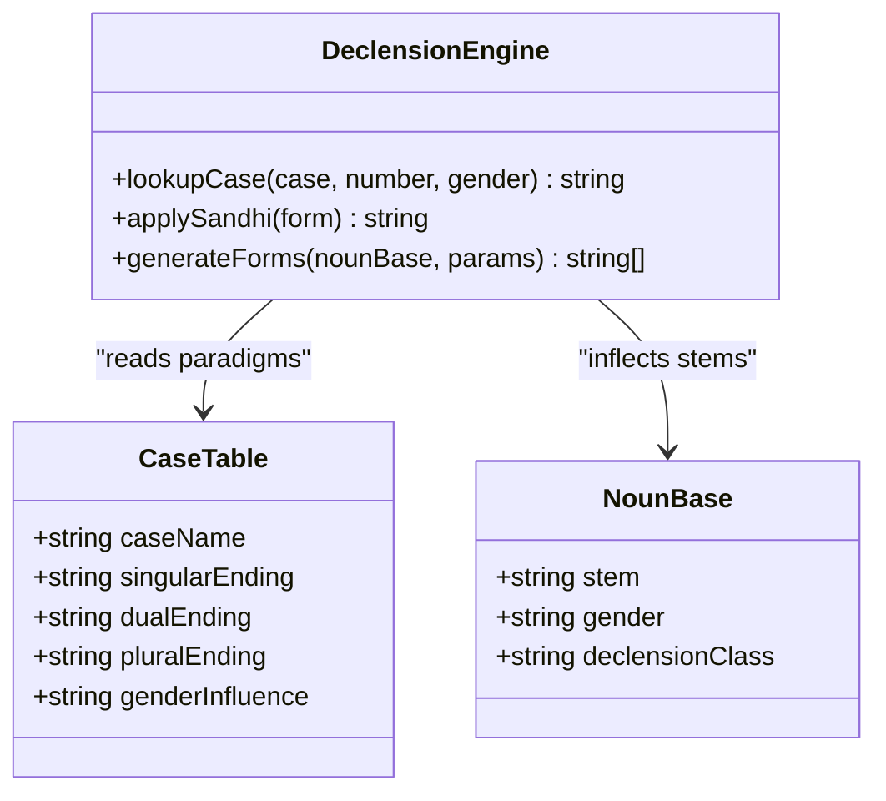
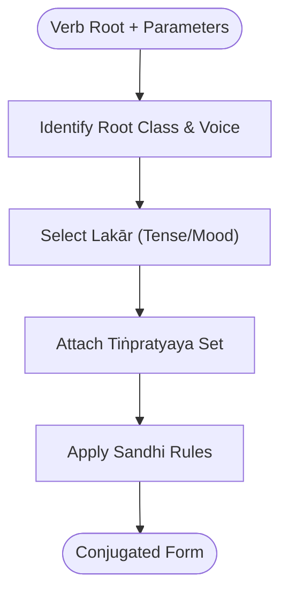
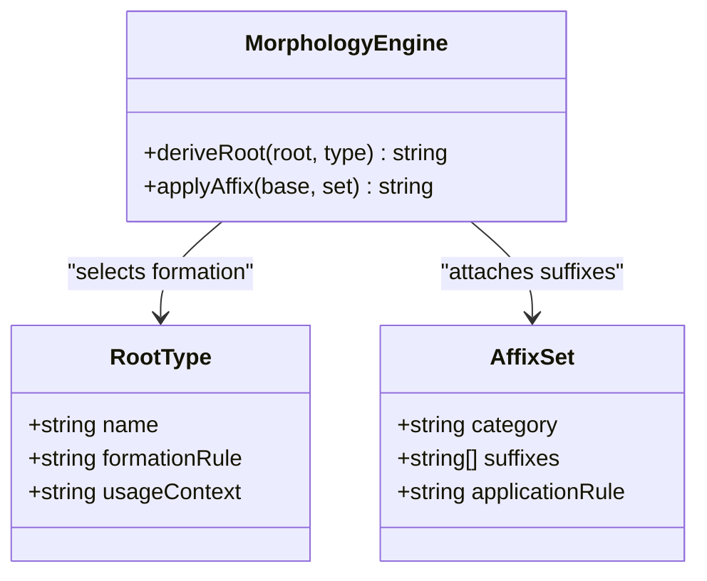
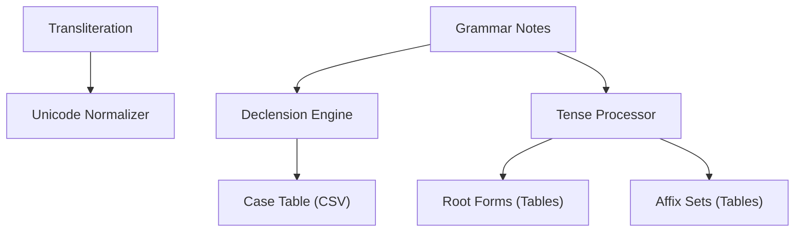

<cite>
**Referenced Files in This Document**
- [sanskrit declension engine 5555fca36e074564abf91775eebccb41.md](file://home/master_db/sanskrit declension engine 5555fca36e074564abf91775eebccb41.md)
- [iast and devanagari copypaste 1e26f2b181d54a3cb0edae50a3d5c637.md](file://home/master_db/iast and devanagari copypaste 1e26f2b181d54a3cb0edae50a3d5c637.md)
- [online devanagari keyboard 4cbf6e054acc4d49b0fb22b83cd455f4.md](file://home/master_db/online devanagari keyboard 4cbf6e054acc4d49b0fb22b83cd455f4.md)
- [sanskrit tenses 00184091ee79483e8b5cd353f1554163.md](file://home/master_db/sanskrit tenses 00184091ee79483e8b5cd353f1554163.md)
- [sanskrit root forms ef75d69409ea4776ba5efb54d52c4662.md](file://home/master_db/sanskrit root forms ef75d69409ea4776ba5efb54d52c4662.md)
- [sanskrit affixes pratyaya 8de98a416c5e4862a7554fad013ca3a8.md](file://home/master_db/sanskrit affixes pratyaya 8de98a416c5e4862a7554fad013ca3a8.md)
- [sanskrit cases 94009145ae2d437381aabfda309e5f07.md](file://home/master_db/sanskrit cases 94009145ae2d437381aabfda309e5f07.md)
- [db_sanskrit cases 149951d43e5e4d5a8c1c1625acb7a9ee.csv](file://home/master_db/sanskrit cases/db_sanskrit cases 149951d43e5e4d5a8c1c1625acb7a9ee.csv)
- [sanskrit notes 4bac12b2882040ae8fc8a8d42cff682c.md](file://home/master_db/sanskrit notes 4bac12b2882040ae8fc8a8d42cff682c.md)
- [fantastic sanskrit and computation blog 9e8969eab7b34d679d5ea5c4d39633a9.md](file://home/master_db/fantastic sanskrit and computation blog 9e8969eab7b34d679d5ea5c4d39633a9.md)
- [iit roorkee sanskrit learning material e0ae9e2d437381aabfda309e5f07.md](file://home/master_db/iit roorkee sanskrit learning material e0ae9e2d437381aabfda309e5f07.md)
- [sbase_iitroorkee 350467a3bdfa4023941945e8d73b36f6.csv](file://home/master_db/iit roorkee sanskrit learning material/sbase_iitroorkee 350467a3bdfa4023941945e8d73b36f6.csv)
- [master_db ccb3b10abf3c4fe4838b0e02ad8db60d.csv](file://home/master_db ccb3b10abf3c4fe4838b0e02ad8db60d.csv)
</cite>

## Table of Contents
1. [Introduction](#introduction)
2. [Project Structure](#project-structure)
3. [Core Components](#core-components)
4. [Architecture Overview](#architecture-overview)
5. [Detailed Component Analysis](#detailed-component-analysis)
6. [Dependency Analysis](#dependency-analysis)
7. [Performance Considerations](#performance-considerations)
8. [Troubleshooting Guide](#troubleshooting-guide)
9. [Conclusion](#conclusion)
10. [Appendices](#appendices)

## Introduction
This document describes the Sanskrit text processing tools captured in the Notion workspace. It focuses on three pillars:
- Transliteration between IAST (International Alphabet of Sanskrit Transliteration) and Devanagari
- Declension engine for Sanskrit noun inflections
- Tense processing capabilities for verb morphology

The repository is a knowledge vault rather than executable code. It contains curated references, data tables, and study materials that define the input/output formats, algorithms, and integration points for building or operating these tools. The documentation synthesizes these artifacts into a coherent technical guide suitable for both practitioners and researchers.

## Project Structure
The Sanskrit-related content resides primarily under home/master_db with supporting CSV exports and reference links. Key elements include:
- Reference pages for transliteration, declension, tenses, roots, affixes, and cases
- CSV datasets describing case paradigms and course materials
- External resource bookmarks for keyboards, dictionaries, corpora, and grammars

[No sources needed since this diagram shows conceptual workflow, not actual code structure]

**Section sources**
- [master_db ccb3b10abf3c4fe4838b0e02ad8db60d.csv](file://home/master_db ccb3b10abf3c4fe4838b0e02ad8db60d.csv)

## Core Components
- Transliteration System (IAST ↔ Devanagari): Provides mapping rules and examples to convert between Latin-based IAST and Devanagari script. Includes sample pairs and usage patterns.
- Declension Engine: Implements noun inflection across cases, numbers, and genders using structured case tables and paradigm rules.
- Tense Processing: Encodes tense/mood categories and applies appropriate verbal endings based on root class and voice.

These components are documented through reference pages, tables, and CSV datasets that collectively specify the transformation logic and data structures required for implementation.

**Section sources**
- [iast and devanagari copypaste 1e26f2b181d54a3cb0edae50a3d5c637.md](file://home/master_db/iast and devanagari copypaste 1e26f2b181d54a3cb0edae50a3d5c637.md)
- [sanskrit cases 94009145ae2d437381aabfda309e5f07.md](file://home/master_db/sanskrit cases 94009145ae2d437381aabfda309e5f07.md)
- [db_sanskrit cases 149951d43e5e4d5a8c1c1625acb7a9ee.csv](file://home/master_db/sanskrit cases/db_sanskrit cases 149951d43e5e4d5a8c1c1625acb7a9ee.csv)
- [sanskrit tenses 00184091ee79483e8b5cd353f1554163.md](file://home/master_db/sanskrit tenses 00184091ee79483e8b5cd353f1554163.md)
- [sanskrit root forms ef75d69409ea4776ba5efb54d52c4662.md](file://home/master_db/sanskrit root forms ef75d69409ea4776ba5efb54d52c4662.md)
- [sanskrit affixes pratyaya 8de98a416c5e4862a7554fad013ca3a8.md](file://home/master_db/sanskrit affixes pratyaya 8de98a416c5e4862a7554fad013ca3a8.md)

## Architecture Overview
The system integrates three layers:
- Input Normalization: Transliteration ensures consistent Unicode representation (IAST or Devanagari).
- Morphological Processing: Declension and tense modules apply grammar rules to generate correct forms.
- Output Generation: Produces standardized outputs compatible with downstream tools (dictionaries, corpora, readers).

[No sources needed since this diagram shows conceptual workflow, not actual code structure]

## Detailed Component Analysis

### Transliteration System (IAST ↔ Devanagari)
- Purpose: Convert between IAST and Devanagari consistently, preserving diacritics and long vowels.
- Input/Output: Accepts either IAST or Devanagari; returns normalized Unicode in the target script.
- Algorithm: Character-level mapping with context-aware handling for anusvāra, visarga, and conjuncts.
- Examples: Sample mappings and paired entries demonstrate typical transformations.

**Section sources**
- [iast and devanagari copypaste 1e26f2b181d54a3cb0edae50a3d5c637.md](file://home/master_db/iast and devanagari copypaste 1e26f2b181d54a3cb0edae50a3d5c637.md)

### Declension Engine (Noun Inflection)
- Purpose: Generate correct noun forms across cases, numbers, and genders.
- Data Model: Case table defines singular/dual/plural endings per case; gender influences endings where applicable.
- Algorithm: Lookup paradigm by case-number-gender triple; apply sandhi rules if necessary.
- Integration: Consumes normalized nouns from transliteration module; feeds results to formatting layer.

**Diagram sources**
- [db_sanskrit cases 149951d43e5e4d5a8c1c1625acb7a9ee.csv](file://home/master_db/sanskrit cases/db_sanskrit cases 149951d43e5e4d5a8c1c1625acb7a9ee.csv)
- [sanskrit cases 94009145ae2d437381aabfda309e5f07.md](file://home/master_db/sanskrit cases 94009145ae2d437381aabfda309e5f07.md)

**Section sources**
- [sanskrit cases 94009145ae2d437381aabfda309e5f07.md](file://home/master_db/sanskrit cases 94009145ae2d437381aabfda309e5f07.md)
- [db_sanskrit cases 149951d43e5e4d5a8c1c1625acb7a9ee.csv](file://home/master_db/sanskrit cases/db_sanskrit cases 149951d43e5e4d5a8c1c1625acb7a9ee.csv)

### Tense Processing (Verb Conjugation)
- Purpose: Apply tense/mood rules to verb roots to produce correct forms.
- Categories: Present, imperative, imperfect, optative, futures, conditional, remote past, recent past, benedictive.
- Algorithm: Select lakār based on tense/mood; attach appropriate tiṅpratyaya according to voice (parasmai, ātmane, ubhayapada) and root class.
- Data Sources: Tables enumerate types, names, and senses; notes provide detailed suffix sets and classes.

**Section sources**
- [sanskrit tenses 00184091ee79483e8b5cd353f1554163.md](file://home/master_db/sanskrit tenses 00184091ee79483e8b5cd353f1554163.md)
- [sanskrit notes 4bac12b2882040ae8fc8a8d42cff682c.md](file://home/master_db/sanskrit notes 4bac12b2882040ae8fc8a8d42cff682c.md)

### Root Forms and Affixes
- Root Types: Causal, desiderative, denominative, intensive/frequentative with specific formation rules.
- Affixes: Pratyaya tables define suffixes for nominal and verbal derivation.
- Usage: Inform both declension and tense modules by specifying root class and applicable affix sets.

**Section sources**
- [sanskrit root forms ef75d69409ea4776ba5efb54d52c4662.md](file://home/master_db/sanskrit root forms ef75d69409ea4776ba5efb54d52c4662.md)
- [sanskrit affixes pratyaya 8de98a416c5e4862a7554fad013ca3a8.md](file://home/master_db/sanskrit affixes pratyaya 8de98a416c5e4862a7554fad013ca3a8.md)

### External Resources and Integration Points
- Online Devanagari Keyboard: Facilitates input in Devanagari script.
- Learning Materials: Course files and PDFs support training and validation.
- Bookmarks: Links to grammars, dictionaries, corpora, and tools for extended functionality.

**Section sources**
- [online devanagari keyboard 4cbf6e054acc4d49b0fb22b83cd455f4.md](file://home/master_db/online devanagari keyboard 4cbf6e054acc4d49b0fb22b83cd455f4.md)
- [iit roorkee sanskrit learning material e0ae9e2d437381aabfda309e5f07.md](file://home/master_db/iit roorkee sanskrit learning material e0ae9e2d437381aabfda309e5f07.md)
- [sbase_iitroorkee 350467a3bdfa4023941945e8d73b36f6.csv](file://home/master_db/iit roorkee sanskrit learning material/sbase_iitroorkee 350467a3bdfa4023941945e8d73b36f6.csv)
- [fantastic sanskrit and computation blog 9e8969eab7b34d679d5ea5c4d39633a9.md](file://home/master_db/fantastic sanskrit and computation blog 9e8969eab7b34d679d5ea5c4d39633a9.md)

## Dependency Analysis
- Transliteration depends on Unicode normalization and mapping tables.
- Declension depends on case tables and noun base metadata.
- Tense processing depends on root classification, lakār selection, and tiṅpratyaya sets.
- All modules integrate via normalized Unicode strings and shared grammar rules.

**Section sources**
- [db_sanskrit cases 149951d43e5e4d5a8c1c1625acb7a9ee.csv](file://home/master_db/sanskrit cases/db_sanskrit cases 149951d43e5e4d5a8c1c1625acb7a9ee.csv)
- [sanskrit root forms ef75d69409ea4776ba5efb54d52c4662.md](file://home/master_db/sanskrit root forms ef75d69409ea4776ba5efb54d52c4662.md)
- [sanskrit affixes pratyaya 8de98a416c5e4862a7554fad013ca3a8.md](file://home/master_db/sanskrit affixes pratyaya 8de98a416c5e4862a7554fad013ca3a8.md)
- [sanskrit notes 4bac12b2882040ae8fc8a8d42cff682c.md](file://home/master_db/sanskrit notes 4bac12b2882040ae8fc8a8d42cff682c.md)

## Performance Considerations
- Precompute Paradigms: Cache frequent noun paradigms and verb conjugations to reduce lookup time.
- Stream Processing: Process large texts line-by-line to minimize memory footprint.
- Efficient Mapping: Use hash maps for character-level transliteration to achieve O(1) lookups.
- Batch Operations: Group requests to declension and tense modules to amortize overhead.

[No sources needed since this section provides general guidance]

## Troubleshooting Guide
- Transliteration Errors: Verify diacritic consistency and check for ambiguous mappings; ensure proper Unicode normalization before conversion.
- Declension Mismatches: Confirm case-number-gender parameters match the intended paradigm; validate stem endings against case tables.
- Tense Conjugation Issues: Check root class assignment and voice selection; verify correct tiṅpratyaya set for the chosen lakār.
- Resource Links: Bookmark pages may become outdated; maintain updated URLs for keyboards, dictionaries, and corpora.

**Section sources**
- [iast and devanagari copypaste 1e26f2b181d54a3cb0edae50a3d5c637.md](file://home/master_db/iast and devanagari copypaste 1e26f2b181d54a3cb0edae50a3d5c637.md)
- [sanskrit cases 94009145ae2d437381aabfda309e5f07.md](file://home/master_db/sanskrit cases 94009145ae2d437381aabfda309e5f07.md)
- [sanskrit tenses 00184091ee79483e8b5cd353f1554163.md](file://home/master_db/sanskrit tenses 00184091ee79483e8b5cd353f1554163.md)

## Conclusion
The Sanskrit text processing tools are defined through a cohesive set of reference pages, tables, and datasets. By implementing the transliteration mappings, case-based declension, and tense/mood conjugation rules outlined here, one can build robust pipelines for transforming and analyzing Sanskrit texts. Integration with external resources enhances usability and supports research workflows.

[No sources needed since this section summarizes without analyzing specific files]

## Appendices
- Practical Workflows:
  - Transliterate IAST to Devanagari for display; normalize for storage.
  - Generate noun forms by querying case tables with specified parameters.
  - Conjugate verbs by selecting lakār and applying appropriate suffix sets.
- Batch Processing:
  - Read corpus files, process line-by-line, and write results incrementally.
  - Use parallel workers for independent segments to improve throughput.
- Customization:
  - Extend case tables for dialectal variants.
  - Add new root classes and affix sets as needed.
  - Integrate dictionary APIs for lemmatization and validation.

[No sources needed since this section provides general guidance]