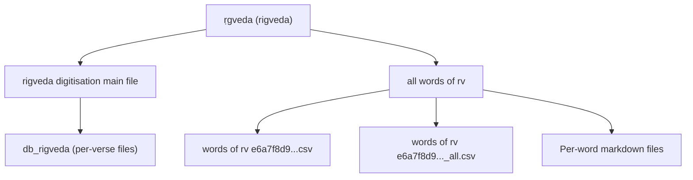
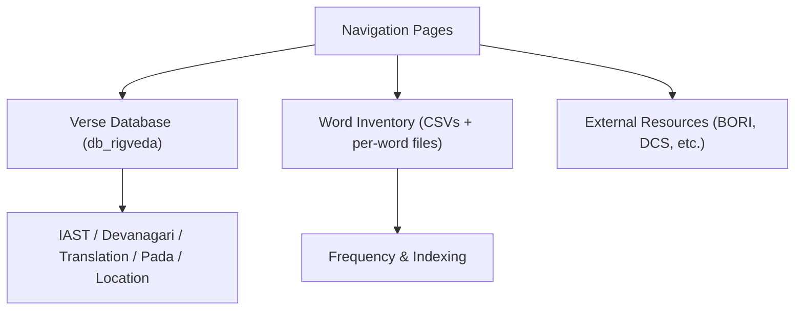
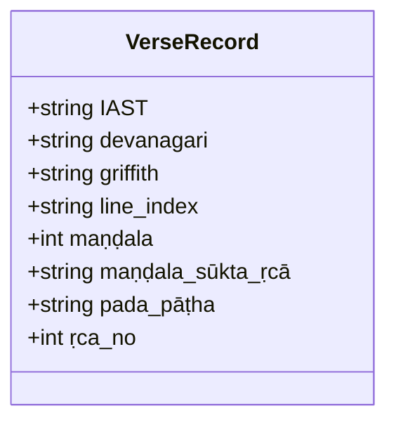
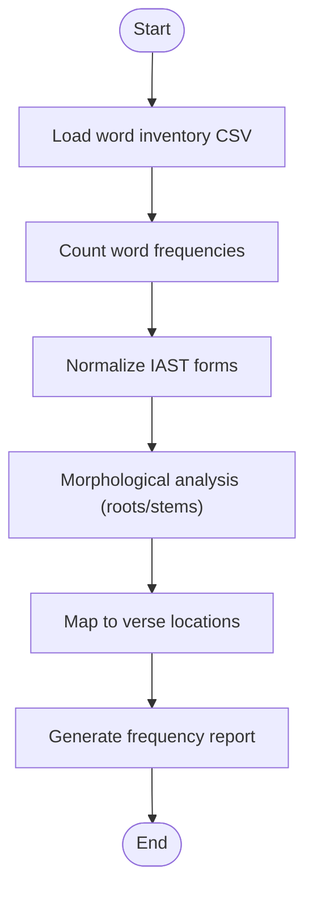
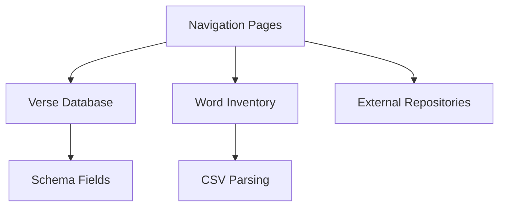

<cite>
**Referenced Files in This Document**
- [rigveda digitisation main file 0693c10acbe443a38bd7391988490d5d.md](file://home/master_db/rigveda%20digitisation%20main%20file%200693c10acbe443a38bd7391988490d5d.md)
- [ṛgveda (rigveda) c5fbb988b5b44285b31fc5b05406b263.md](file://home/master_db/%E1%B9%9Bgveda%20(rigveda)%20c5fbb988b5b44285b31fc5b05406b263.md)
- [words of rv e6a7f8d974554a61a41280312acad6c4.csv](file://home/master_db/all%20words%20of%20rv/words%20of%20rv%20e6a7f8d974554a61a41280312acad6c4.csv)
- [words of rv e6a7f8d974554a61a41280312acad6c4_all.csv](file://home/master_db/all%20words%20of%20rv/words%20of%20rv%20e6a7f8d974554a61a41280312acad6c4_all.csv)
- [1 - 1 0ea099aff8a544d38b94131014ff7cd2.md](file://home/master_db/rigveda%20digitisation%20main%20file/db_rigveda/1%20-%201%200ea099aff8a544d38b94131014ff7cd2.md)
- [BORI repository 6fa2994935284bffa6c8390e1d9995f2.md](file://home/master_db/BORI%20repository%206fa2994935284bffa6c8390e1d9995f2.md)
- [master_db ccb3b10abf3c4fe4838b0e02ad8db60d.csv](file://home/master_db/master_db%20ccb3b10abf3c4fe4838b0e02ad8db60d.csv)
</cite>

## Table of Contents
1. Introduction
2. Project Structure
3. Core Components
4. Architecture Overview
5. Detailed Component Analysis
6. Dependency Analysis
7. Performance Considerations
8. Troubleshooting Guide
9. Conclusion

## Introduction
This document describes the Rigveda digitization project as implemented within an exported Notion workspace. The corpus is organized into a structured database with over 10,000 entries representing individual Sanskrit words and verse-level records. It explains how the digital corpus is organized, how word frequency analysis can be performed, and how textual criticism workflows are supported through cross-referencing and external integrations. It also documents transliteration handling (IAST to Devanagari), computational linguistics tools referenced by the project, data validation procedures, and quality assurance measures.

## Project Structure
The Rigveda corpus is centered around a main entry that links to a database folder containing per-verse files and associated CSV exports for word lists. Key elements:
- A top-level “ṛgveda (rigveda)” page acts as a container linking to subfiles.
- The “rigveda digitisation main file” references the core database folder db_rigveda.
- The “all words of rv” directory contains two CSVs enumerating all unique word forms found in the text, plus one markdown file per word form.
- Each verse-level record resides under db_rigveda as a separate markdown file with standardized fields.

**Diagram sources**
- [ṛgveda (rigveda) c5fbb988b5b44285b31fc5b05406b263.md](file://home/master_db/%E1%B9%9Bgveda%20(rigveda)%20c5fbb988b5b44285b31fc5b05406b263.md)
- [rigveda digitisation main file 0693c10acbe443a38bd7391988490d5d.md](file://home/master_db/rigveda%20digitisation%20main%20file%200693c10acbe443a38bd7391988490d5d.md)
- [words of rv e6a7f8d974554a61a41280312acad6c4.csv](file://home/master_db/all%20words%20of%20rv/words%20of%20rv%20e6a7f8d974554a61a41280312acad6c4.csv)
- [words of rv e6a7f8d974554a61a41280312acad6c4_all.csv](file://home/master_db/all%20words%20of%20rv/words%20of%20rv%20e6a7f8d974554a61a41280312acad6c4_all.csv)

**Section sources**
- [ṛgveda (rigveda) c5fbb988b5b44285b31fc5b05406b263.md](file://home/master_db/%E1%B9%9Bgveda%20(rigveda)%20c5fbb988b5b44285b31fc5b05406b263.md)
- [rigveda digitisation main file 0693c10acbe443a38bd7391988490d5d.md](file://home/master_db/rigveda%20digitisation%20main%20file%200693c10acbe443a38bd7391988490d5d.md)

## Core Components
- Verse-level database (db_rigveda): Each file represents a specific ṛc (verse) with fields such as IAST text, Devanāgarī rendering, translation, line index, maṇḍala/sūkta/ṛcā location, pada pāṭha segmentation, and ṛca number.
- Word inventory (all words of rv): Two CSVs enumerate all unique word forms; each word has a corresponding markdown file. These support frequency analysis and indexing.
- Master navigation pages: “ṛgveda (rigveda)” and “rigveda digitisation main file” provide entry points and link to the database and word inventory.

Key attributes observed in verse-level records include:
- IAST: canonical transliterated Sanskrit
- devanāgarī: Devanagari script version
- griffith: English translation
- line index: internal index key
- maṇḍala, maṇḍala.sūkta.ṛcā: hierarchical location
- pada pāṭha: segmented padapāṭha
- ṛca no.: verse number

These fields enable robust cross-referencing, search, and analytical queries across the corpus.

**Section sources**
- [1 - 1 0ea099aff8a544d38b94131014ff7cd2.md](file://home/master_db/rigveda%20digitisation%20main%20file/db_rigveda/1%20-%201%200ea099aff8a544d38b94131014ff7cd2.md)
- [words of rv e6a7f8d974554a61a41280312acad6c4.csv](file://home/master_db/all%20words%20of%20rv/words%20of%20rv%20e6a7f8d974554a61a41280312acad6c4.csv)
- [words of rv e6a7f8d974554a61a41280312acad6c4_all.csv](file://home/master_db/all%20words%20of%20rv/words%20of%20rv%20e6a7f8d974554a61a41280312acad6c4_all.csv)

## Architecture Overview
The architecture is a flat-file knowledge graph where:
- Navigation pages link to the database and word inventory.
- Per-verse files store rich metadata and multilingual content.
- Word inventory CSVs provide machine-readable indices for analytics.
- External resources (dictionaries, corpora, repositories) are bookmarked and linked for research and validation.

**Diagram sources**
- [ṛgveda (rigveda) c5fbb988b5b44285b31fc5b05406b263.md](file://home/master_db/%E1%B9%9Bgveda%20(rigveda)%20c5fbb988b5b44285b31fc5b05406b263.md)
- [rigveda digitisation main file 0693c10acbe443a38bd7391988490d5d.md](file://home/master_db/rigveda%20digitisation%20main%20file%200693c10acbe443a38bd7391988490d5d.md)
- [words of rv e6a7f8d974554a61a41280312acad6c4.csv](file://home/master_db/all%20words%20of%20rv/words%20of%20rv%20e6a7f8d974554a61a41280312acad6c4.csv)
- [BORI repository 6fa2994935284bffa6c8390e1d9995f2.md](file://home/master_db/BORI%20repository%206fa2994935284bffa6c8390e1d9995f2.md)

## Detailed Component Analysis

### Verse-Level Record Schema
Each verse file follows a consistent schema enabling precise retrieval and analysis:
- IAST: Transliterated Sanskrit text
- devanāgarī: Devanagari representation
- griffith: English translation
- line index: Internal identifier
- maṇḍala, maṇḍala.sūkta.ṛcā: Hierarchical location
- pada pāṭha: Segmented padapāṭha
- ṛca no.: Verse number

This structure supports:
- Cross-referencing between verses and word forms
- Frequency counting via pada segmentation
- Textual criticism by comparing variants across maṇḍalas

**Diagram sources**
- [1 - 1 0ea099aff8a544d38b94131014ff7cd2.md](file://home/master_db/rigveda%20digitisation%20main%20file/db_rigveda/1%20-%201%200ea099aff8a544d38b94131014ff7cd2.md)

**Section sources**
- [1 - 1 0ea099aff8a544d38b94131014ff7cd2.md](file://home/master_db/rigveda%20digitisation%20main%20file/db_rigveda/1%20-%201%200ea099aff8a544d38b94131014ff7cd2.md)

### Word Inventory and Frequency Analysis
The word inventory consists of:
- Two CSVs enumerating unique word forms
- One markdown file per word form

Frequency analysis workflow:
- Parse CSV to count occurrences across the corpus
- Normalize forms using IAST rules
- Aggregate counts by root or stem using morphological tools
- Map back to verse locations via pada pāṭha segmentation

[No sources needed since this diagram shows conceptual workflow, not actual code structure]

**Section sources**
- [words of rv e6a7f8d974554a61a41280312acad6c4.csv](file://home/master_db/all%20words%20of%20rv/words%20of%20rv%20e6a7f8d974554a61a41280312acad6c4.csv)
- [words of rv e6a7f8d974554a61a41280312acad6c4_all.csv](file://home/master_db/all%20words%20of%20rv/words%20of%20rv%20e6a7f8d974554a61a41280312acad6c4_all.csv)

### Transliteration Systems (IAST to Devanagari)
Transliteration is handled by maintaining parallel fields:
- IAST field for canonical transliteration
- devanāgarī field for native script rendering

Tools referenced in the master database include online transliteration utilities and keyboard tools. This dual-field approach ensures consistency and enables automated conversion pipelines if needed.

**Section sources**
- [1 - 1 0ea099aff8a544d38b94131014ff7cd2.md](file://home/master_db/rigveda%20digitisation%20main%20file/db_rigveda/1%20-%201%200ea099aff8a544d38b94131014ff7cd2.md)
- [master_db ccb3b10abf3c4fe4838b0e02ad8db60d.csv](file://home/master_db/master_db%20ccb3b10abf3c4fe4838b0e02ad8db60d.csv)

### Computational Linguistics Tools
The project references several Sanskrit-focused tools and resources:
- Online dictionaries and concordance tools
- Sanskrit Digital Corpus (DCS)
- BORI repository
- Ashtadhyayi grammar resources
- Root search engines

These tools support lemmatization, morphological parsing, and cross-referencing during textual criticism and frequency analysis.

**Section sources**
- [master_db ccb3b10abf3c4fe4838b0e02ad8db60d.csv](file://home/master_db/master_db%20ccb3b10abf3c4fe4838b0e02ad8db60d.csv)

### Integration with External Repositories
The project integrates with academic repositories like BORI for authoritative texts and reference materials. Links are maintained in the master database for easy access and verification.

**Section sources**
- [BORI repository 6fa2994935284bffa6c8390e1d9995f2.md](file://home/master_db/BORI%20repository%206fa2994935284bffa6c8390e1d9995f2.md)
- [master_db ccb3b10abf3c4fe4838b0e02ad8db60d.csv](file://home/master_db/master_db%20ccb3b10abf3c4fe4838b0e02ad8db60d.csv)

## Dependency Analysis
The dependency relationships among components are straightforward:
- Navigation pages depend on database and word inventory links
- Verse records depend on consistent schema fields
- Word inventory depends on CSV parsing and normalization
- External integrations depend on stable URLs and access

**Diagram sources**
- [ṛgveda (rigveda) c5fbb988b5b44285b31fc5b05406b263.md](file://home/master_db/%E1%B9%9Bgveda%20(rigveda)%20c5fbb988b5b44285b31fc5b05406b263.md)
- [rigveda digitisation main file 0693c10acbe443a38bd7391988490d5d.md](file://home/master_db/rigveda%20digitisation%20main%20file%200693c10acbe443a38bd7391988490d5d.md)
- [words of rv e6a7f8d974554a61a41280312acad6c4.csv](file://home/master_db/all%20words%20of%20rv/words%20of%20rv%20e6a7f8d974554a61a41280312acad6c4.csv)

**Section sources**
- [ṛgveda (rigveda) c5fbb988b5b44285b31fc5b05406b263.md](file://home/master_db/%E1%B9%9Bgveda%20(rigveda)%20c5fbb988b5b44285b31fc5b05406b263.md)
- [rigveda digitisation main file 0693c10acbe443a38bd7391988490d5d.md](file://home/master_db/rigveda%20digitisation%20main%20file%200693c10acbe443a38bd7391988490d5d.md)

## Performance Considerations
- CSV-based word inventory enables efficient batch processing for frequency analysis
- Flat-file structure allows parallel processing of verse records
- Normalized IAST forms reduce ambiguity in counting and matching
- On-disk organization minimizes overhead for small-scale queries

For large-scale analysis:
- Use streaming parsers for CSV files
- Implement caching for frequent lookups
- Consider indexing by maṇḍala and ṛcā for faster traversal

[No sources needed since this section provides general guidance]

## Troubleshooting Guide
Common issues and resolutions:
- Broken internal links: Verify Notion export artifacts and update percent-encoded links
- Inconsistent IAST forms: Apply normalization rules before analysis
- Missing Devanagari text: Ensure dual-field maintenance during data entry
- External resource access: Check URL stability and availability

Validation procedures:
- Cross-check verse numbers against maṇḍala/sūkta/ṛcā hierarchy
- Validate pada pāṭha segmentation against known patterns
- Verify translations match source IAST text

Quality assurance measures:
- Regular audits of word inventory completeness
- Spot-checking of verse records for schema compliance
- Version control for CSV exports and per-verse files

**Section sources**
- [master_db ccb3b10abf3c4fe4838b0e02ad8db60d.csv](file://home/master_db/master_db%20ccb3b10abf3c4fe4838b0e02ad8db60d.csv)

## Conclusion
The Rigveda digitization project demonstrates a well-structured approach to preserving and analyzing ancient Sanskrit texts. Through systematic organization of verse records, comprehensive word inventories, and integration with external academic resources, it provides a solid foundation for both scholarly research and computational linguistics applications. The dual-field transliteration system and standardized schema enable robust analysis while maintaining fidelity to traditional formats. Future enhancements could include automated morphological analysis, improved cross-referencing capabilities, and expanded integration with digital humanities tools.

[No sources needed since this section summarizes without analyzing specific files]