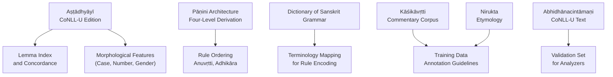
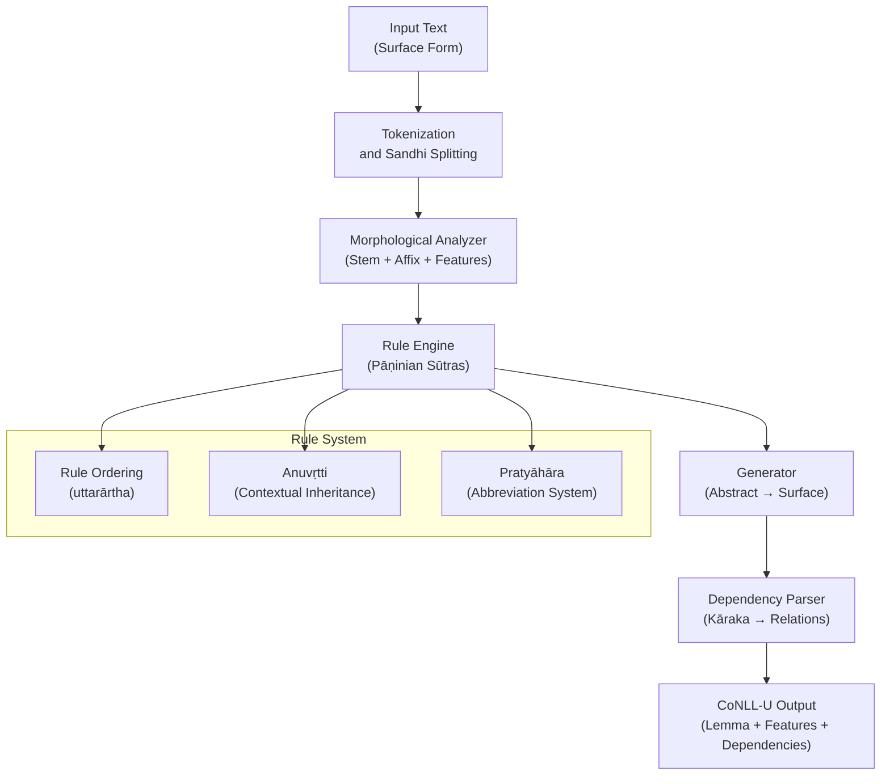
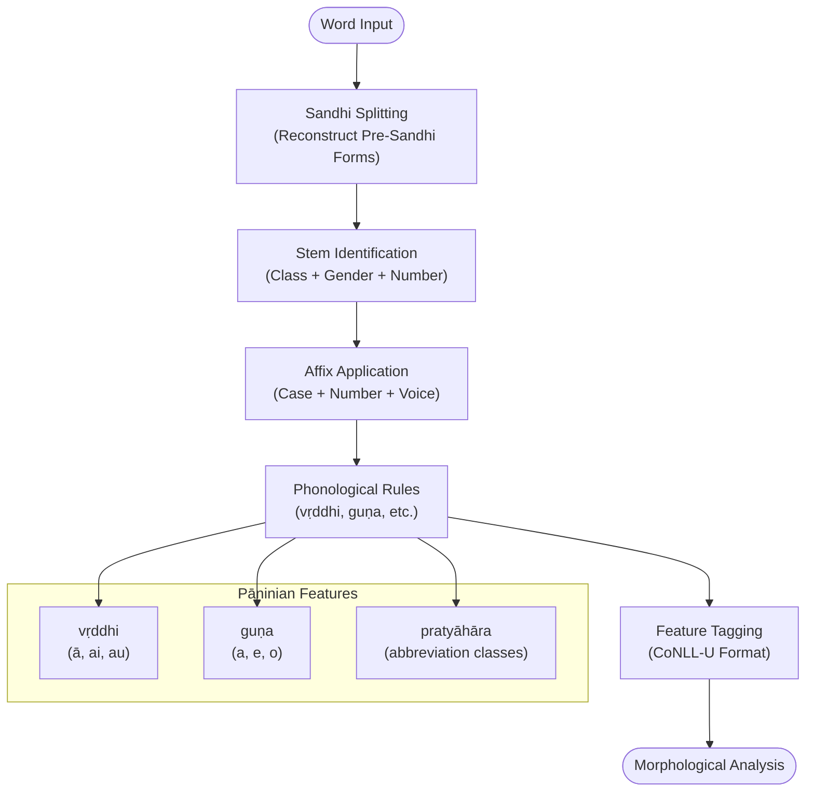
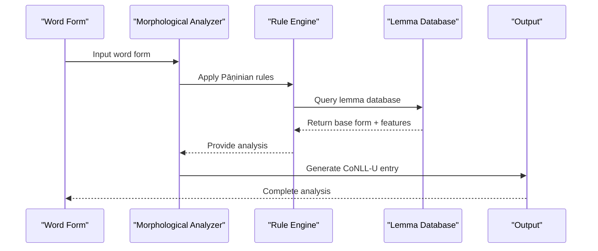
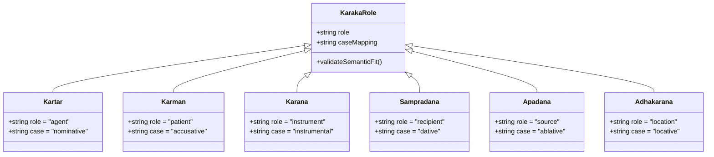
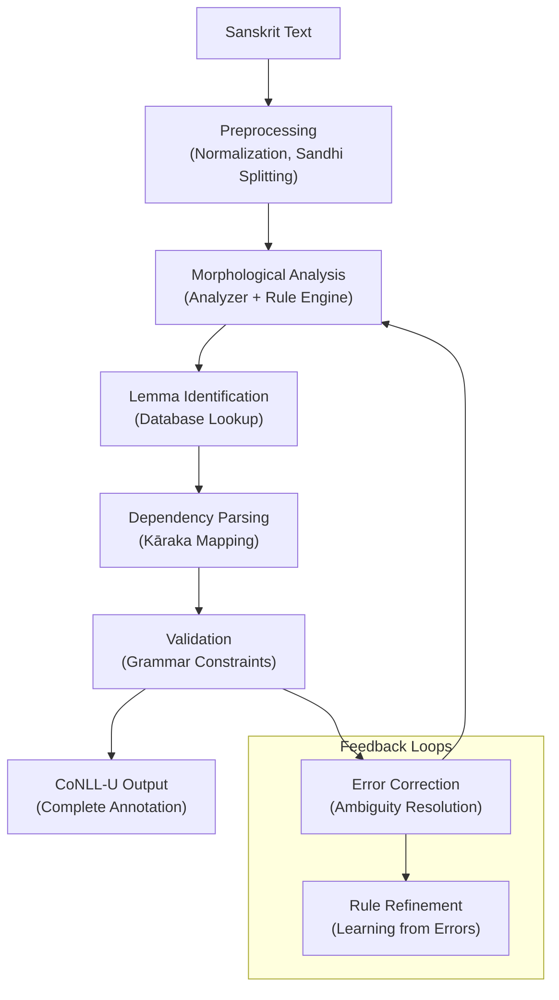
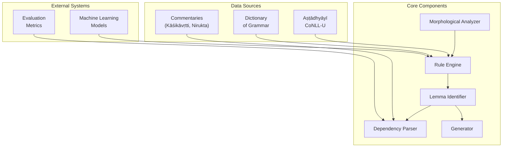

<cite>
**Referenced Files in This Document**
- [astadhyayi.md](file://astadhyayi.md)
- [panini-and-the-astadhyayi.md](file://panini-and-the-astadhyayi.md)
- [dictionary-of-sanskrit-grammar.md](file://dictionary-of-sanskrit-grammar.md)
- [sanskrit-noun-declension.md](file://sanskrit-noun-declension.md)
- [ganakarika.md](file://ganakarika.md)
- [kasikavrtti.md](file://kasikavrtti.md)
- [nirukta.md](file://nirukta.md)
- [abhidhanacintamani.md](file://abhidhanacintamani.md)
- [sanskrit-learning-resources.md](file://sanskrit-learning-resources.md)
</cite>

## Table of Contents
1. [Introduction](#introduction)
2. [Project Structure](#project-structure)
3. [Core Components](#core-components)
4. [Architecture Overview](#architecture-overview)
5. [Detailed Component Analysis](#detailed-component-analysis)
6. [Dependency Analysis](#dependency-analysis)
7. [Performance Considerations](#performance-considerations)
8. [Troubleshooting Guide](#troubleshooting-guide)
9. [Conclusion](#conclusion)
10. [Appendices](#appendices)

## Introduction
This document explains how Pāṇinian grammar is translated into computational processes for modern Sanskrit NLP systems. It focuses on:
- Morphological analyzers and generators grounded in the Aṣṭādhyāyī’s rule system
- Dependency parsing informed by kāraka theory and case morphology
- CoNLL-U format usage for lemma identification, morphological features, and sandhi reconstruction
- Integration of rule-based grammars with statistical and machine learning methods
- Best practices for building robust Sanskrit tools using annotated corpora and commentarial traditions

The repository provides a CoNLL-U parsed edition of the Aṣṭādhyāyī and related texts, enabling direct mapping from sūtras to machine-parseable representations.

**Section sources**
- [astadhyayi.md:19-44](file://astadhyayi.md#L19-L44)
- [panini-and-the-astadhyayi.md:20-70](file://panini-and-the-astadhyayi.md#L20-L70)

## Project Structure
The repository organizes Sanskrit grammatical resources as concept pages that summarize key texts and their digital editions. The most relevant files for computational implementation are:
- Aṣṭādhyāyī (CoNLL-U Edition): Machine-parseable sūtras with full morphological annotation
- Pāṇini and the Aṣṭādhyāyī: Formal architecture and derivation model
- Dictionary of Sanskrit Grammar: Terminology reference for encoding rules
- Noun Declension Reference: Paradigm structure for inflectional morphology
- Kāśikāvṛtti and Nirukta: Commentarial and etymological corpora for training data
- Abhidhānacintāmaṇi: Example of fully morphologically analyzed CoNLL-U text

**Diagram sources**
- [astadhyayi.md:19-44](file://astadhyayi.md#L19-L44)
- [panini-and-the-astadhyayi.md:20-70](file://panini-and-the-astadhyayi.md#L20-L70)
- [dictionary-of-sanskrit-grammar.md:23-48](file://dictionary-of-sanskrit-grammar.md#L23-L48)
- [kasikavrtti.md:1-12](file://kasikavrtti.md#L1-L12)
- [nirukta.md:1-12](file://nirukta.md#L1-L12)
- [abhidhanacintamani.md:53-66](file://abhidhanacintamani.md#L53-L66)

**Section sources**
- [astadhyayi.md:19-44](file://astadhyayi.md#L19-L44)
- [panini-and-the-astadhyayi.md:20-70](file://panini-and-the-astadhyayi.md#L20-L70)

## Core Components
The computational implementation centers on four interconnected components:

1. **Rule Engine**: Implements Pāṇinian sūtras as algorithmic transformations
2. **Morphological Analyzer**: Decomposes words into stems, affixes, and features
3. **Generator**: Produces well-formed Sanskrit forms from abstract representations
4. **Parser**: Maps surface forms to dependency structures using kāraka theory

These components leverage CoNLL-U annotations for lemmatization, feature tagging, and sandhi reconstruction.

**Section sources**
- [astadhyayi.md:33-44](file://astadhyayi.md#L33-L44)
- [panini-and-the-astadhyayi.md:33-51](file://panini-and-the-astadhyayi.md#L33-L51)

## Architecture Overview
The system follows a layered architecture inspired by Pāṇini’s four-level derivation model:

**Diagram sources**
- [panini-and-the-astadhyayi.md:33-51](file://panini-and-the-astadhyayi.md#L33-L51)
- [astadhyayi.md:33-44](file://astadhyayi.md#L33-L44)

## Detailed Component Analysis

### Morphological Analyzer
The analyzer implements Pāṇinian morphophonology through a multi-stage process:

**Diagram sources**
- [astadhyayi.md:25-35](file://astadhyayi.md#L25-L35)
- [sanskrit-noun-declension.md:24-41](file://sanskrit-noun-declension.md#L24-L41)

**Section sources**
- [astadhyayi.md:25-35](file://astadhyayi.md#L25-L35)
- [sanskrit-noun-declension.md:24-41](file://sanskrit-noun-declension.md#L24-L41)

### Lemma Identification Algorithm
Lemma identification follows a systematic approach based on the CoNLL-U edition:

**Diagram sources**
- [astadhyayi.md:37-44](file://astadhyayi.md#L37-L44)
- [abhidhanacintamani.md:53-66](file://abhidhanacintamani.md#L53-L66)

**Section sources**
- [astadhyayi.md:37-44](file://astadhyayi.md#L37-L44)
- [abhidhanacintamani.md:53-66](file://abhidhanacintamani.md#L53-L66)

### Dependency Parser with Kāraka Theory
The parser maps semantic roles to syntactic dependencies using Pāṇini’s kāraka system:

**Diagram sources**
- [panini-and-the-astadhyayi.md:52-61](file://panini-and-the-astadhyayi.md#L52-L61)

**Section sources**
- [panini-and-the-astadhyayi.md:52-61](file://panini-and-the-astadhyayi.md#L52-L61)

### Rule-Based Processing Pipeline
The complete processing pipeline integrates all components:

**Diagram sources**
- [astadhyayi.md:33-44](file://astadhyayi.md#L33-L44)
- [panini-and-the-astadhyayi.md:44-51](file://panini-and-the-astadhyayi.md#L44-L51)

**Section sources**
- [astadhyayi.md:33-44](file://astadhyayi.md#L33-L44)
- [panini-and-the-astadhyayi.md:44-51](file://panini-and-the-astadhyayi.md#L44-L51)

## Dependency Analysis
The system exhibits strong coupling between morphological analysis and rule application, with loose coupling to parsing and generation components:

**Diagram sources**
- [astadhyayi.md:19-44](file://astadhyayi.md#L19-L44)
- [dictionary-of-sanskrit-grammar.md:23-48](file://dictionary-of-sanskrit-grammar.md#L23-L48)
- [kasikavrtti.md:1-12](file://kasikavrtti.md#L1-L12)
- [nirukta.md:1-12](file://nirukta.md#L1-L12)

**Section sources**
- [astadhyayi.md:19-44](file://astadhyayi.md#L19-L44)
- [dictionary-of-sanskrit-grammar.md:23-48](file://dictionary-of-sanskrit-grammar.md#L23-L48)

## Performance Considerations
Key performance factors in Sanskrit NLP systems include:

1. **Rule Complexity**: Pāṇinian rules can be highly complex, requiring efficient matching algorithms
2. **Morphological Explosion**: Sanskrit’s rich inflectional system generates many possible forms
3. **Ambiguity Resolution**: Multiple valid analyses require sophisticated disambiguation
4. **Memory Usage**: Large rule sets and dictionaries demand careful memory management
5. **Processing Speed**: Real-time applications need optimized rule engines

Optimization strategies include:
- Rule compilation and indexing
- Incremental parsing with early termination
- Caching of frequent morphological patterns
- Parallel processing of independent rules

[No sources needed since this section provides general guidance]

## Troubleshooting Guide
Common issues and solutions in Sanskrit NLP implementation:

### Rule Application Errors
- **Problem**: Incorrect rule ordering causing wrong analyses
- **Solution**: Implement strict uttarārtha (later rules trump earlier ones)
- **Reference**: Rule ordering principles in Pāṇinian grammar

### Morphological Ambiguity
- **Problem**: Multiple valid parses for single word forms
- **Solution**: Use contextual information and statistical models
- **Reference**: Commentarial traditions provide disambiguation guidance

### Sandhi Reconstruction Failures
- **Problem**: Incorrect pre-sandhi form recovery
- **Solution**: Implement comprehensive sandhi rules with backtracking
- **Reference**: Opening sūtras of Aṣṭādhyāyī define foundational sandhi rules

### Lemma Identification Issues
- **Problem**: Missing or incorrect lemma mappings
- **Solution**: Expand dictionary coverage with commentarial sources
- **Reference**: CoNLL-U editions provide validated lemma sets

**Section sources**
- [panini-and-the-astadhyayi.md:44-51](file://panini-and-the-astadhyayi.md#L44-L51)
- [astadhyayi.md:25-35](file://astadhyayi.md#L25-L35)
- [kasikavrtti.md:1-12](file://kasikavrtti.md#L1-L12)

## Conclusion
The computational implementation of Sanskrit grammar requires careful integration of Pāṇinian rule systems with modern NLP techniques. The CoNLL-U format provides a standardized framework for morphological analysis and lemma identification. Success depends on:

1. Faithful implementation of Pāṇinian principles
2. Comprehensive coverage of grammatical phenomena
3. Integration with machine learning for ambiguity resolution
4. Extensive validation against annotated corpora
5. Continuous refinement based on error analysis

The repository’s CoNLL-U editions of classical texts provide an excellent foundation for building robust Sanskrit NLP systems that respect both traditional grammatical knowledge and modern computational requirements.

[No sources needed since this section summarizes without analyzing specific files]

## Appendices

### Best Practices for Sanskrit NLP Development

1. **Start with Rule-Based Systems**: Implement core Pāṇinian rules before adding statistical components
2. **Use CoNLL-U Standards**: Leverage existing formats for interoperability
3. **Incorporate Commentarial Traditions**: Use Kāśikāvṛtti and other commentaries for disambiguation
4. **Build Comprehensive Dictionaries**: Include technical terminology from Abhyankar’s dictionary
5. **Validate Against Classical Texts**: Use well-annotated corpora like Aṣṭādhyāyī and Nirukta

### Training Data Annotation Guidelines

1. **Consistent Lemma Identification**: Follow established conventions from CoNLL-U editions
2. **Morphological Feature Tagging**: Use standard tags for case, number, gender, voice
3. **Dependency Relation Specification**: Map kāraka roles to universal dependency relations
4. **Sandhi Handling**: Preserve original forms while providing reconstructed pre-sandhi versions
5. **Quality Assurance**: Cross-validate with multiple annotators and expert review

**Section sources**
- [dictionary-of-sanskrit-grammar.md:23-48](file://dictionary-of-sanskrit-grammar.md#L23-L48)
- [astadhyayi.md:37-44](file://astadhyayi.md#L37-L44)
- [nirukta.md:1-12](file://nirukta.md#L1-L12)
