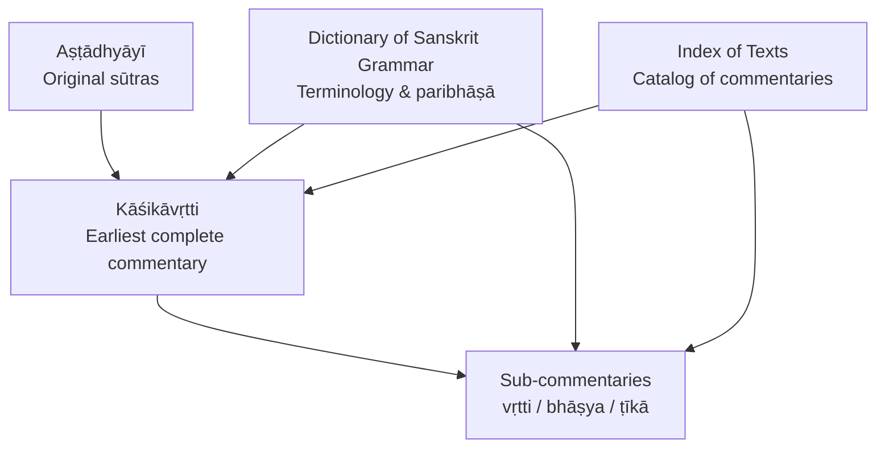
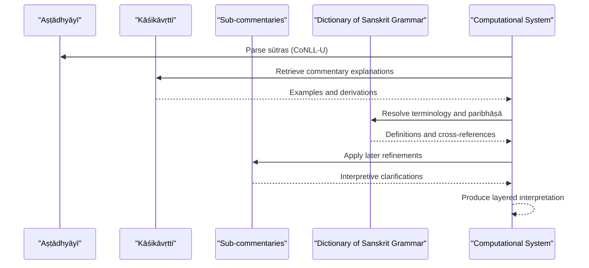
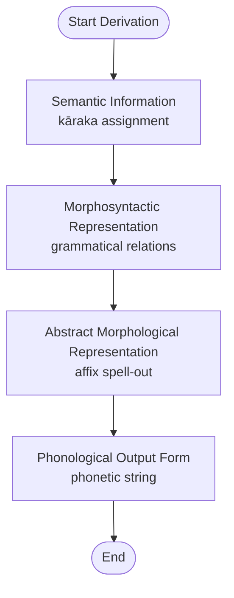
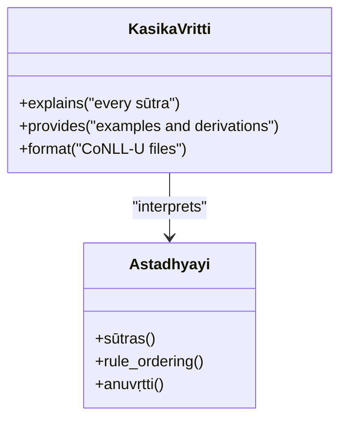
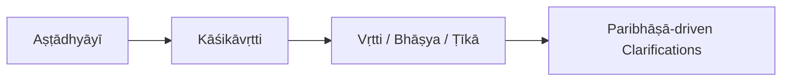
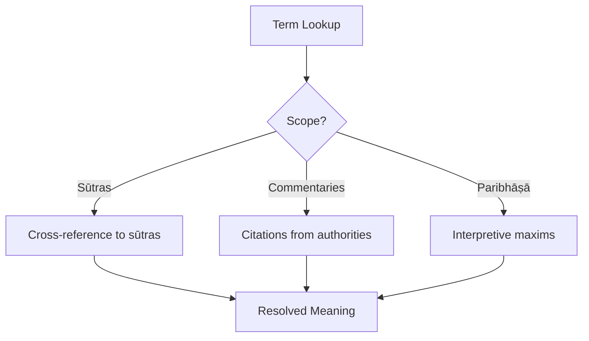
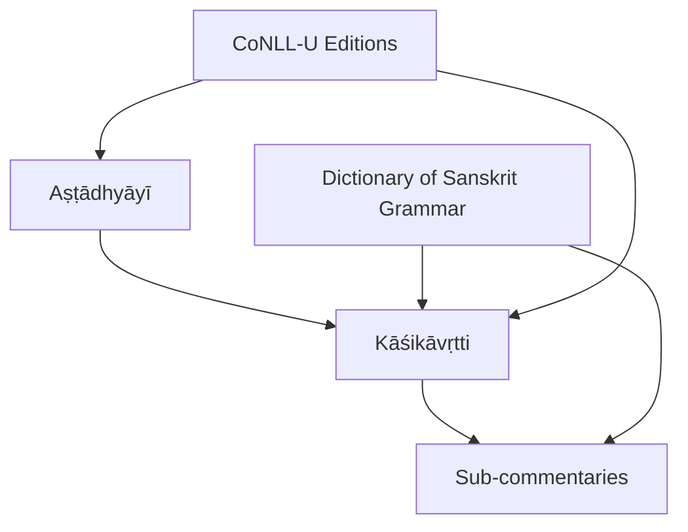
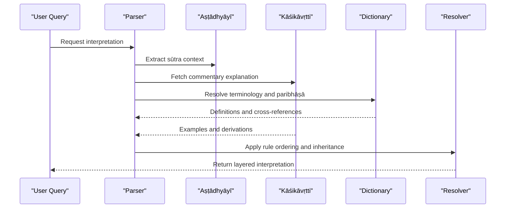

<cite>
**Referenced Files in This Document**
- [astadhyayi.md](file://astadhyayi.md)
- [panini-and-the-astadhyayi.md](file://panini-and-the-astadhyayi.md)
- [kasikavrtti.md](file://kasikavrtti.md)
- [dictionary-of-sanskrit-grammar.md](file://dictionary-of-sanskrit-grammar.md)
- [glossary-of-sanskrit-terms.md](file://glossary-of-sanskrit-terms.md)
- [INDEX.md](file://INDEX.md)
</cite>

## Table of Contents
1. [Introduction](#introduction)
2. [Project Structure](#project-structure)
3. [Core Components](#core-components)
4. [Architecture Overview](#architecture-overview)
5. [Detailed Component Analysis](#detailed-component-analysis)
6. [Dependency Analysis](#dependency-analysis)
7. [Performance Considerations](#performance-considerations)
8. [Troubleshooting Guide](#troubleshooting-guide)
9. [Conclusion](#conclusion)
10. [Appendices](#appendices)

## Introduction
This document explains the layered tradition of Sanskrit grammatical commentaries, with a focus on the Kāśikāvṛtti and related sub-commentaries that expand Pāṇini’s Aṣṭādhyāyī. It outlines how commentarial works preserve linguistic knowledge across generations, clarify rules through examples and derivations, and maintain grammatical accuracy. It also analyzes how computational systems can represent and process multi-level commentary traditions, including challenges such as rule ordering, contextual inheritance (anuvṛtti), interpretive maxims (paribhāṣā), and layered interpretation.

## Project Structure
The repository provides:
- A machine-parseable edition of Pāṇini’s Aṣṭādhyāyī with morphological annotation and CoNLL-U files.
- A dedicated entry for the Kāśikāvṛtti, the earliest complete commentary on the Aṣṭādhyāyī, presented in CoNLL-U format.
- A comprehensive dictionary of Sanskrit grammar covering Pāṇinian terminology, Vārttika terms, and paribhāṣā conventions used in commentaries.
- An index that catalogs texts, including commentary genres (bhāṣya, vṛtti, ṭīkā) and their roles.

**Diagram sources**
- [astadhyayi.md:1-85](file://astadhyayi.md#L1-L85)
- [kasikavrtti.md:1-48](file://kasikavrtti.md#L1-L48)
- [dictionary-of-sanskrit-grammar.md:1-61](file://dictionary-of-sanskrit-grammar.md#L1-L61)
- [INDEX.md:100-101](file://INDEX.md#L100-L101)

**Section sources**
- [astadhyayi.md:1-85](file://astadhyayi.md#L1-L85)
- [kasikavrtti.md:1-48](file://kasikavrtti.md#L1-L48)
- [dictionary-of-sanskrit-grammar.md:1-61](file://dictionary-of-sanskrit-grammar.md#L1-L61)
- [INDEX.md:100-101](file://INDEX.md#L100-L101)

## Core Components
- Aṣṭādhyāyī: The foundational generative grammar with ~4,000 sūtras, structured into chapters and sections, using a semi-formalized metalanguage, anuvṛtti, adhikāra headings, pratyāhāras, and rule ordering.
- Kāśikāvṛtti: The earliest complete commentary on the Aṣṭādhyāyī, explaining every sūtra with examples and derivations; provided in CoNLL-U files for computational processing.
- Dictionary of Sanskrit Grammar: A scholarly lexicon covering Pāṇinian terminology, Vārttika additions, Mahābhāṣya technical terms, and paribhāṣā conventions used throughout the commentarial tradition.
- Index of Texts: Catalogs commentary genres and specific works, enabling navigation of the broader commentary ecosystem.

**Section sources**
- [panini-and-the-astadhyayi.md:18-76](file://panini-and-the-astadhyayi.md#L18-L76)
- [astadhyayi.md:19-48](file://astadhyayi.md#L19-L48)
- [kasikavrtti.md:1-11](file://kasikavrtti.md#L1-L11)
- [dictionary-of-sanskrit-grammar.md:19-56](file://dictionary-of-sanskrit-grammar.md#L19-L56)
- [INDEX.md:100-101](file://INDEX.md#L100-L101)

## Architecture Overview
The commentary architecture layers interpretations over the original sūtras:
- Level 0: Aṣṭādhyāyī sūtras define the formal system.
- Level 1: Kāśikāvṛtti provides line-by-line explanation, examples, and derivations.
- Level 2: Later sub-commentaries (vṛtti, bhāṣya, ṭīkā) refine, debate, and extend interpretations, often invoking paribhāṣā to resolve ambiguities.

**Diagram sources**
- [astadhyayi.md:19-48](file://astadhyayi.md#L19-L48)
- [kasikavrtti.md:1-11](file://kasikavrtti.md#L1-L11)
- [dictionary-of-sanskrit-grammar.md:23-48](file://dictionary-of-sanskrit-grammar.md#L23-L48)

## Detailed Component Analysis

### Aṣṭādhyāyī: Foundational Grammar
- Organized into eight chapters and four sections per chapter.
- Uses rule ordering, anuvṛtti (contextual inheritance), adhikāra headings, and pratyāhāras for compact notation.
- Provides a four-level derivation model from semantics to phonology.
- Digitally parsed into CoNLL-U files with morphological analysis of the metalanguage.

**Diagram sources**
- [panini-and-the-astadhyayi.md:33-42](file://panini-and-the-astadhyayi.md#L33-L42)

**Section sources**
- [panini-and-the-astadhyayi.md:18-76](file://panini-and-the-astadhyayi.md#L18-L76)
- [astadhyayi.md:19-48](file://astadhyayi.md#L19-L48)

### Kāśikāvṛtti: Earliest Complete Commentary
- Explains every sūtra with examples and derivations.
- Presented in CoNLL-U files, enabling computational parsing and analysis.
- High-frequency lemmas include technical markers and connectives typical of commentary prose.

**Diagram sources**
- [kasikavrtti.md:1-11](file://kasikavrtti.md#L1-L11)
- [astadhyayi.md:19-48](file://astadhyayi.md#L19-L48)

**Section sources**
- [kasikavrtti.md:1-48](file://kasikavrtti.md#L1-L48)

### Sub-commentaries: Refinement and Debate
- Genres include vṛtti, bhāṣya, and ṭīkā, each adding layers of interpretation.
- Often engage with earlier authorities and introduce paribhāṣā to resolve conflicts or clarify scope.
- The index catalogs numerous commentary works across domains, illustrating the breadth of the tradition.

**Diagram sources**
- [INDEX.md:100-101](file://INDEX.md#L100-L101)

**Section sources**
- [INDEX.md:100-101](file://INDEX.md#L100-L101)

### Dictionary of Sanskrit Grammar: Terminology and Paribhāṣā
- Covers Pāṇinian terminology, Vārttika additions, Mahābhāṣya technical terms, and paribhāṣā conventions.
- Provides cross-references to sūtras and citations from commentarial authorities.
- Essential for navigating abbreviated references and resolving interpretive disputes.

**Diagram sources**
- [dictionary-of-sanskrit-grammar.md:23-48](file://dictionary-of-sanskrit-grammar.md#L23-L48)

**Section sources**
- [dictionary-of-sanskrit-grammar.md:19-56](file://dictionary-of-sanskrit-grammar.md#L19-L56)

## Dependency Analysis
- The Kāśikāvṛtti depends on the Aṣṭādhyāyī for its subject matter and uses commentary conventions documented in the Dictionary of Sanskrit Grammar.
- Sub-commentaries depend on both the Aṣṭādhyāyī and the Kāśikāvṛtti, often referencing paribhāṣā to arbitrate rule interactions.
- Computational systems depend on CoNLL-U editions for structured parsing and on lexical resources for disambiguation.

**Diagram sources**
- [astadhyayi.md:19-48](file://astadhyayi.md#L19-L48)
- [kasikavrtti.md:1-11](file://kasikavrtti.md#L1-L11)
- [dictionary-of-sanskrit-grammar.md:23-48](file://dictionary-of-sanskrit-grammar.md#L23-L48)

**Section sources**
- [astadhyayi.md:19-48](file://astadhyayi.md#L19-L48)
- [kasikavrtti.md:1-11](file://kasikavrtti.md#L1-L11)
- [dictionary-of-sanskrit-grammar.md:23-48](file://dictionary-of-sanskrit-grammar.md#L23-L48)

## Performance Considerations
- Layered interpretation increases computational complexity due to multiple levels of dependency and rule interaction.
- Efficient handling requires:
  - Structured representations (CoNLL-U) for sūtras and commentaries.
  - Lexical lookup services for terminology and paribhāṣā.
  - Rule engines that respect ordering, anuvṛtti, and asiddhatva where applicable.
- Optimization strategies:
  - Pre-index key terms and cross-references.
  - Cache frequent derivations and commentary mappings.
  - Use modular pipelines for each commentary layer to isolate errors and improve maintainability.

[No sources needed since this section provides general guidance]

## Troubleshooting Guide
Common issues when processing multi-level commentary traditions:
- Ambiguity in terminology: Use the Dictionary of Sanskrit Grammar to resolve technical terms and paribhāṣā.
- Rule ordering conflicts: Consult commentaries for authoritative resolutions and apply paribhāṣā consistently.
- Incomplete metadata: Ensure CoNLL-U files include lemma identification, sandhi reconstruction, and rule numbering for accurate parsing.
- Cross-reference resolution: Maintain robust linking between sūtras, commentaries, and sub-commentaries to avoid broken chains.

**Section sources**
- [dictionary-of-sanskrit-grammar.md:23-48](file://dictionary-of-sanskrit-grammar.md#L23-L48)
- [astadhyayi.md:19-48](file://astadhyayi.md#L19-L48)

## Conclusion
The Kāśikāvṛtti and subsequent sub-commentaries form a hierarchical tradition that preserves and expands Pāṇini’s grammar across generations. By providing detailed explanations, examples, and clarifications, these works maintain grammatical accuracy and enable nuanced interpretation. Computational systems can leverage structured editions and lexical resources to handle layered textual interpretation, though they must address challenges in rule ordering, contextual inheritance, and interpretive maxims.

[No sources needed since this section summarizes without analyzing specific files]

## Appendices

### Appendix A: Glossary of Key Terms
- Sūtra: Aphoristic rule in the Aṣṭādhyāyī.
- Vṛtti: Gloss or commentary explaining sūtras.
- Bhāṣya: Substantial commentary expanding on earlier works.
- Ṭīkā: Sub-commentary refining interpretations.
- Anuvṛtti: Contextual inheritance carrying forward elements from preceding rules.
- Adhikāra: Section heading governing rules within a domain.
- Pratyāhāra: Abbreviatory notation using the Śiva-sūtras.
- Paribhāṣā: Interpretive maxim guiding rule application and resolution.

**Section sources**
- [dictionary-of-sanskrit-grammar.md:23-48](file://dictionary-of-sanskrit-grammar.md#L23-L48)
- [panini-and-the-astadhyayi.md:44-65](file://panini-and-the-astadhyayi.md#L44-L65)

### Appendix B: Computational Workflow for Layered Interpretation

**Diagram sources**
- [astadhyayi.md:19-48](file://astadhyayi.md#L19-L48)
- [kasikavrtti.md:1-11](file://kasikavrtti.md#L1-L11)
- [dictionary-of-sanskrit-grammar.md:23-48](file://dictionary-of-sanskrit-grammar.md#L23-L48)
