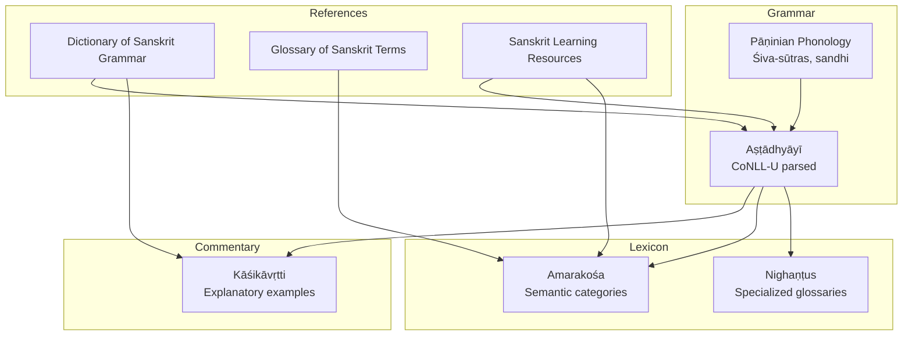
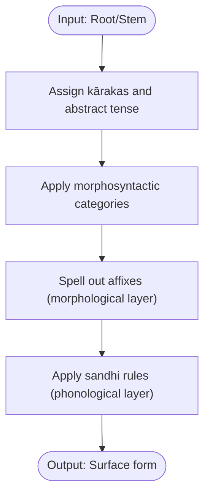
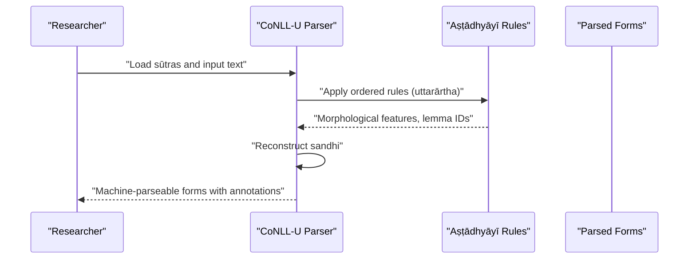
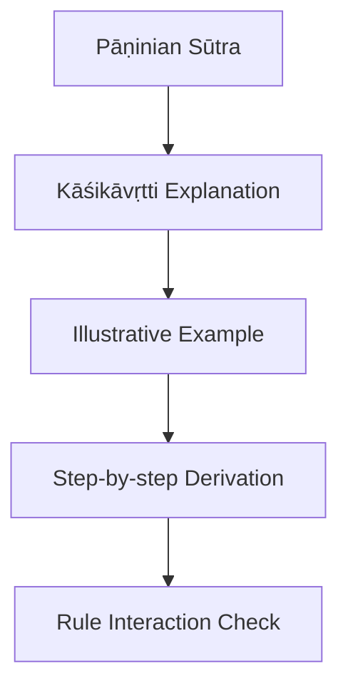
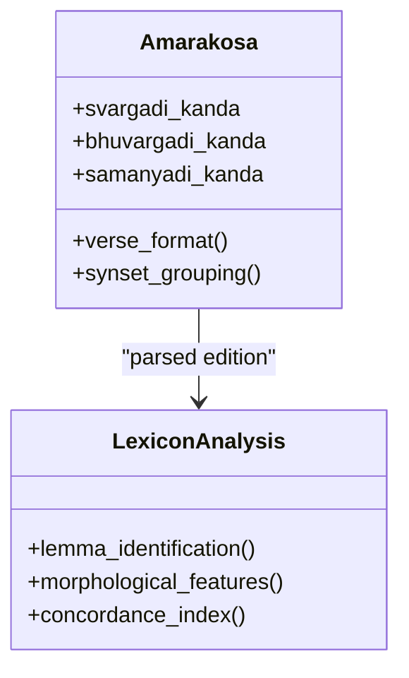
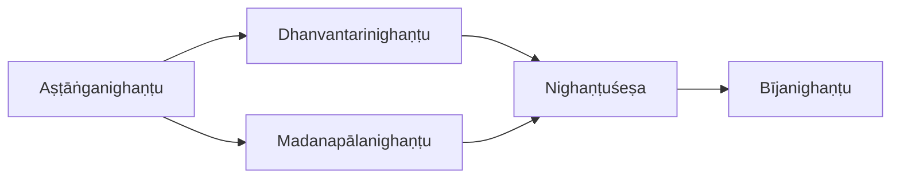
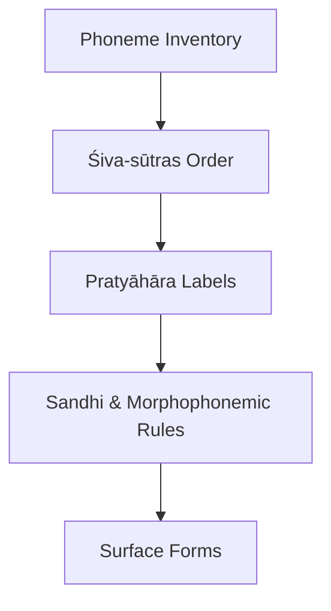
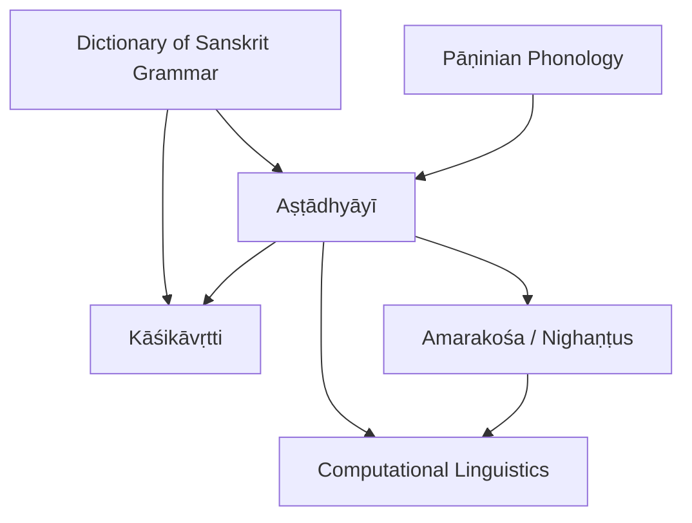

<cite>
**Referenced Files in This Document**
- [astadhyayi.md](file://astadhyayi.md)
- [kasikavrtti.md](file://kasikavrtti.md)
- [amarakosa.md](file://amarakosa.md)
- [panini-and-the-astadhyayi.md](file://panini-and-the-astadhyayi.md)
- [dictionary-of-sanskrit-grammar.md](file://dictionary-of-sanskrit-grammar.md)
- [paninian-phonology.md](file://paninian-phonology.md)
- [nighantusesa.md](file://nighantusesa.md)
- [astanganighantu.md](file://astanganighantu.md)
- [dhanvantarinighantu.md](file://dhanvantarinighantu.md)
- [madanapalanighantu.md](file://madanapalanighantu.md)
- [bijanighantu.md](file://bijanighantu.md)
- [glossary-of-sanskrit-terms.md](file://glossary-of-sanskrit-terms.md)
- [sanskrit-learning-resources.md](file://sanskrit-learning-resources.md)
</cite>

## Table of Contents
1. Introduction
2. Project Structure
3. Core Components
4. Architecture Overview
5. Detailed Component Analysis
6. Dependency Analysis
7. Performance Considerations
8. Troubleshooting Guide
9. Conclusion
10. Appendices

## Introduction
This document presents a comprehensive overview of grammatical studies grounded in the repository’s Sanskrit resources. It focuses on:
- Pāṇinian grammar (Aṣṭādhyāyī): its systematic, rule-based architecture and how it supports morphological analysis and machine processing.
- Major commentaries (Kāśikāvṛtti): how they explain and operationalize Pāṇini’s rules with examples and derivations.
- Lexicographical works (Amarakośa and Nighaṇṭus): semantic organization, synonym sets, and domain-specific glossaries that enable lexical research and computational linguistics.
It also explains lemma identification, morphological parsing, and practical applications for modern linguistic analysis using these classical texts.

## Project Structure
The repository organizes key grammatical and lexicographical materials as concept pages with metadata, references to raw sources, and tags. The most relevant files for this document are:
- Aṣṭādhyāyī: CoNLL-U parsed edition of Pāṇini’s sūtras with full morphological annotation.
- Kāśikāvṛtti: Early complete commentary explaining every sūtra with examples and derivations.
- Amarakośa: Semantic thesaurus organized by categories; includes CoNLL-U parsed edition.
- Nighaṇṭus: Specialized glossaries (e.g., Āyurvedic) cataloging synonyms and properties.
- Supporting references: Dictionary of Sanskrit Grammar, Pāṇinian phonology, and learning resources.

**Diagram sources**
- [astadhyayi.md:19-44](file://astadhyayi.md#L19-L44)
- [kasikavrtti.md:1-11](file://kasikavrtti.md#L1-L11)
- [amarakosa.md:23-64](file://amarakosa.md#L23-L64)
- [paninian-phonology.md:21-77](file://paninian-phonology.md#L21-L77)
- [dictionary-of-sanskrit-grammar.md:19-59](file://dictionary-of-sanskrit-grammar.md#L19-L59)
- [glossary-of-sanskrit-terms.md:19-63](file://glossary-of-sanskrit-terms.md#L19-L63)
- [sanskrit-learning-resources.md:22-77](file://sanskrit-learning-resources.md#L22-L77)

**Section sources**
- [astadhyayi.md:19-44](file://astadhyayi.md#L19-L44)
- [amarakosa.md:23-64](file://amarakosa.md#L23-L64)
- [panini-and-the-astadhyayi.md:18-75](file://panini-and-the-astadhyayi.md#L18-L75)
- [paninian-phonology.md:21-77](file://paninian-phonology.md#L21-L77)
- [dictionary-of-sanskrit-grammar.md:19-59](file://dictionary-of-sanskrit-grammar.md#L19-L59)

## Core Components
- Aṣṭādhyāyī (CoNLL-U Edition): Provides machine-parseable sūtras with lemma identification, morphological analysis, sandhi reconstruction, and preserved rule numbering/structure.
- Kāśikāvṛtti: Offers explanatory commentary with examples and derivations for each sūtra, enabling deeper understanding and validation of rule application.
- Amarakośa: Semantic classification of vocabulary into three major sections; verse format aids memorization; CoNLL-U parsed edition enables computational analysis.
- Nighaṇṭus: Domain-specific glossaries (especially Āyurvedic) cataloging synonyms and properties; multiple texts provide complementary coverage.
- Reference Works: Abhyankar’s Dictionary of Sanskrit Grammar provides technical terminology and cross-references; Pāṇinian phonology details sound system and sandhi; learning resources support pedagogy.

**Section sources**
- [astadhyayi.md:19-44](file://astadhyayi.md#L19-L44)
- [kasikavrtti.md:1-11](file://kasikavrtti.md#L1-L11)
- [amarakosa.md:23-64](file://amarakosa.md#L23-L64)
- [astanganighantu.md:21-46](file://astanganighantu.md#L21-L46)
- [dhanvantarinighantu.md:1-48](file://dhanvantarinighantu.md#L1-L48)
- [madanapalanighantu.md:1-48](file://madanapalanighantu.md#L1-L48)
- [nighantusesa.md:1-48](file://nighantusesa.md#L1-L48)
- [dictionary-of-sanskrit-grammar.md:19-59](file://dictionary-of-sanskrit-grammar.md#L19-L59)
- [paninian-phonology.md:21-77](file://paninian-phonology.md#L21-L77)

## Architecture Overview
The grammatical system can be viewed as a layered pipeline from semantics to phonology, consistent with Pāṇinian architecture:
- Semantic information (kārakas, abstract tense)
- Morphosyntactic representation (grammatical relations, categories)
- Abstract morphological representation (affix spell-out)
- Phonological output (actual phonetic string via sandhi)

**Diagram sources**
- [panini-and-the-astadhyayi.md:33-42](file://panini-and-the-astadhyayi.md#L33-L42)
- [paninian-phonology.md:63-77](file://paninian-phonology.md#L63-L77)

**Section sources**
- [panini-and-the-astadhyayi.md:24-50](file://panini-and-the-astadhyayi.md#L24-L50)
- [paninian-phonology.md:27-77](file://paninian-phonology.md#L27-L77)

## Detailed Component Analysis

### Aṣṭādhyāyī: Systematic Grammar and Machine Parsing
- Sūtra format and metalanguage: Captures vṛddhi, guṇa, pratyāhāra, anuvṛtti, and adhikāra headings.
- CoNLL-U edition: Provides lemma identification, morphological analysis, sandhi reconstruction, and preserves structural metadata (rule numbering, chapter/pāda).
- Opening foundational rules: Establish phonological replacements and vowel classes.

**Diagram sources**
- [astadhyayi.md:25-44](file://astadhyayi.md#L25-L44)
- [panini-and-the-astadhyayi.md:44-50](file://panini-and-the-astadhyayi.md#L44-L50)

**Section sources**
- [astadhyayi.md:25-44](file://astadhyayi.md#L25-L44)
- [panini-and-the-astadhyayi.md:24-50](file://panini-and-the-astadhyayi.md#L24-L50)

### Kāśikāvṛtti: Commentary and Derivational Examples
- Role: Earliest complete commentary explaining every sūtra with examples and derivations.
- Value: Bridges formal rules and practical application; supports validation of rule interactions and edge cases.

**Diagram sources**
- [kasikavrtti.md:1-11](file://kasikavrtti.md#L1-L11)
- [astadhyayi.md:33-44](file://astadhyayi.md#L33-L44)

**Section sources**
- [kasikavrtti.md:1-11](file://kasikavrtti.md#L1-L11)

### Amarakośa: Semantic Lexical Organization
- Structure: Three major sections (svargādi, bhūvargādi, sāmānyādi) grouping synonyms and related terms.
- Verse format: Facilitates memorization and oral transmission; still chanted in traditional education.
- Computational value: CoNLL-U parsed edition enables morphological analysis across the lexicon; synset groupings align with WordNet structures for NLP tasks.

**Diagram sources**
- [amarakosa.md:29-64](file://amarakosa.md#L29-L64)

**Section sources**
- [amarakosa.md:29-64](file://amarakosa.md#L29-L64)

### Nighaṇṭus: Domain-Specific Glossaries
- Aṣṭāṅganighaṇṭu: Catalogues medicinal substances with synonyms and properties; single CoNLL-U file with full morphological analysis.
- Dhanvantarinighaṇṭu and Madanapālanighaṇṭu: Provide overlapping coverage of botanical materia medica; high similarity in lemma usage indicates shared terminology.
- Nighaṇṭuśeṣa and Bījanighaṇṭu: Supplement the tradition with specialized entries (botanical/pharmacological).

**Diagram sources**
- [astanganighantu.md:21-46](file://astanganighantu.md#L21-L46)
- [dhanvantarinighantu.md:15-48](file://dhanvantarinighantu.md#L15-L48)
- [madanapalanighantu.md:15-48](file://madanapalanighantu.md#L15-L48)
- [nighantusesa.md:15-48](file://nighantusesa.md#L15-L48)
- [bijanighantu.md:1-12](file://bijanighantu.md#L1-L12)

**Section sources**
- [astanganighantu.md:21-46](file://astanganighantu.md#L21-L46)
- [dhanvantarinighantu.md:15-48](file://dhanvantarinighantu.md#L15-L48)
- [madanapalanighantu.md:15-48](file://madanapalanighantu.md#L15-L48)
- [nighantusesa.md:15-48](file://nighantusesa.md#L15-L48)
- [bijanighantu.md:1-12](file://bijanighantu.md#L1-L12)

### Pāṇinian Phonology: Sound System and Sandhi
- Śiva-sūtras: Organize phonemes for maximum abbreviatory power; pratyāhāras define natural classes.
- Classification: Articulatory positions and internal efforts underpin phonological rules.
- Sandhi: Systematic modification at boundaries; essential for reconstructing unsandhied forms in parsed editions.

**Diagram sources**
- [paninian-phonology.md:27-77](file://paninian-phonology.md#L27-L77)

**Section sources**
- [paninian-phonology.md:27-77](file://paninian-phonology.md#L27-L77)

### Reference Works and Pedagogy
- Dictionary of Sanskrit Grammar: Comprehensive reference for technical terminology, sūtra cross-references, and commentarial citations.
- Glossary of Sanskrit Terms: Spiritual and philosophical vocabulary aligned with practice-oriented study.
- Learning Resources: Structured progression from manual to reader to traditional vocabulary building (Amarakośa).

**Section sources**
- [dictionary-of-sanskrit-grammar.md:19-59](file://dictionary-of-sanskrit-grammar.md#L19-L59)
- [glossary-of-sanskrit-terms.md:19-63](file://glossary-of-sanskrit-terms.md#L19-L63)
- [sanskrit-learning-resources.md:22-77](file://sanskrit-learning-resources.md#L22-L77)

## Dependency Analysis
The grammatical ecosystem exhibits clear dependencies:
- Aṣṭādhyāyī depends on phonological foundations (Śiva-sūtras) and drives rule ordering and interaction.
- Kāśikāvṛtti depends on Aṣṭādhyāyī for explanations and examples.
- Amarakośa and Nighaṇṭus provide lexical resources that complement grammatical analysis and enable semantic mapping.
- Reference works (Abhyankar’s dictionary) support navigation of technical terms and cross-references across the tradition.

**Diagram sources**
- [paninian-phonology.md:27-77](file://paninian-phonology.md#L27-L77)
- [astadhyayi.md:19-44](file://astadhyayi.md#L19-L44)
- [kasikavrtti.md:1-11](file://kasikavrtti.md#L1-L11)
- [amarakosa.md:29-64](file://amarakosa.md#L29-L64)
- [dictionary-of-sanskrit-grammar.md:19-59](file://dictionary-of-sanskrit-grammar.md#L19-L59)

**Section sources**
- [astadhyayi.md:19-44](file://astadhyayi.md#L19-L44)
- [kasikavrtti.md:1-11](file://kasikavrtti.md#L1-L11)
- [amarakosa.md:29-64](file://amarakosa.md#L29-L64)
- [paninian-phonology.md:27-77](file://paninian-phonology.md#L27-L77)
- [dictionary-of-sanskrit-grammar.md:19-59](file://dictionary-of-sanskrit-grammar.md#L19-L59)

## Performance Considerations
- Rule ordering and anuvṛtti: Efficient application requires careful sequencing; later rules typically override earlier ones (uttarārtha), impacting computational efficiency.
- Lemma identification: Accurate lemmatization of sūtra language and technical terms reduces ambiguity and improves parsing speed.
- Sandhi reconstruction: Reconstructing unsandhied forms is computationally intensive but necessary for accurate morphological analysis.
- Lexical databases: Leveraging Amarakośa and Nighaṇṭus synsets enhances semantic search and alignment with WordNet-like structures.

[No sources needed since this section provides general guidance]

## Troubleshooting Guide
Common issues and strategies:
- Ambiguous rule application: Use Kāśikāvṛtti examples to validate interactions and resolve conflicts.
- Incorrect sandhi reconstruction: Cross-check with CoNLL-U parsed editions and ensure proper application of phonological rules.
- Lexical mismatches: Consult Amarakośa sections and Nighaṇṭus for synonym sets and domain-specific terms; use concordance indices to verify lemma frequencies.
- Terminology confusion: Refer to Abhyankar’s Dictionary for precise definitions and cross-references to sūtras and commentaries.

**Section sources**
- [kasikavrtti.md:1-11](file://kasikavrtti.md#L1-L11)
- [astadhyayi.md:33-44](file://astadhyayi.md#L33-L44)
- [amarakosa.md:29-64](file://amarakosa.md#L29-L64)
- [dictionary-of-sanskrit-grammar.md:19-59](file://dictionary-of-sanskrit-grammar.md#L19-L59)

## Conclusion
The repository provides a robust foundation for grammatical studies through:
- A machine-parseable Aṣṭādhyāyī enabling systematic morphological analysis and lemma identification.
- Kāśikāvṛtti offering explanatory depth and validation of rule interactions.
- Amarakośa and Nighaṇṭus supplying semantic and domain-specific lexical resources for computational linguistics.
- Reference works and learning resources supporting both scholarly and pedagogical needs.
Together, these resources enable rigorous analysis of Sanskrit grammar and facilitate modern linguistic research and machine processing.

[No sources needed since this section summarizes without analyzing specific files]

## Appendices

### Practical Examples of Modern Linguistic Analysis
- Morphological parsing: Use CoNLL-U parsed Aṣṭādhyāyī to extract lemma IDs and feature bundles for training parsers.
- Semantic mapping: Align Amarakośa synsets with WordNet to build bilingual or multilingual lexical databases.
- Domain extraction: Leverage Nighaṇṭus to identify medicinal plant synonyms and properties for specialized corpora.
- Pedagogical integration: Follow recommended study paths combining manuals, readers, and traditional vocabulary building for effective learning.

[No sources needed since this section provides general guidance]
