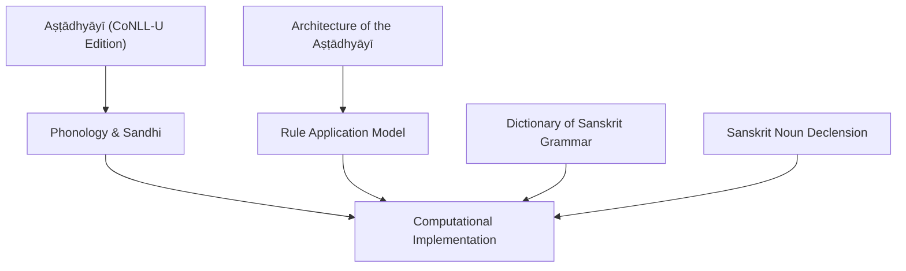
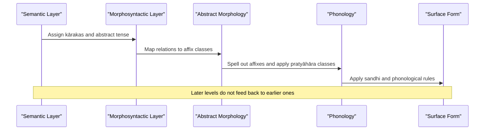
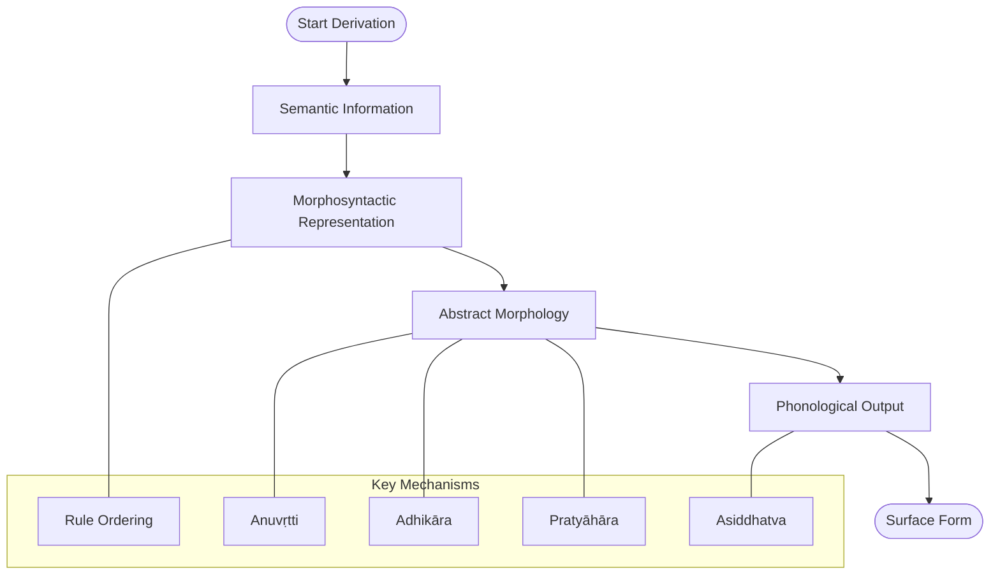
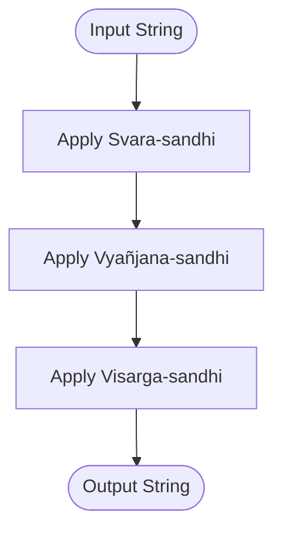
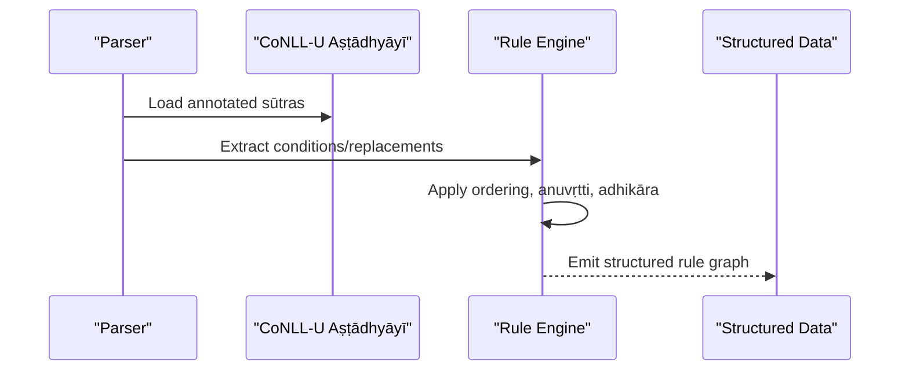
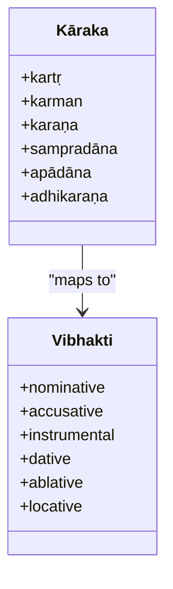
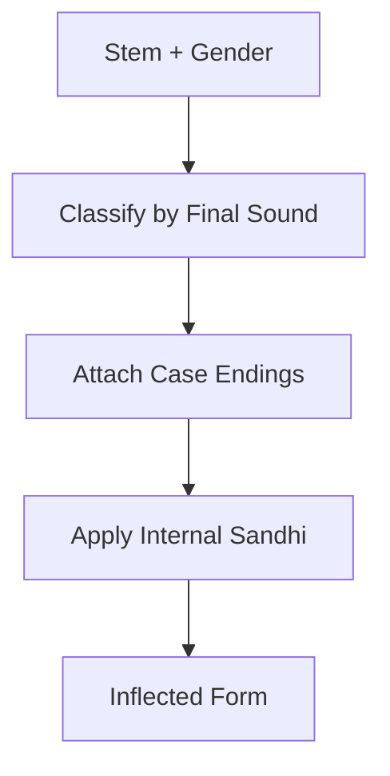
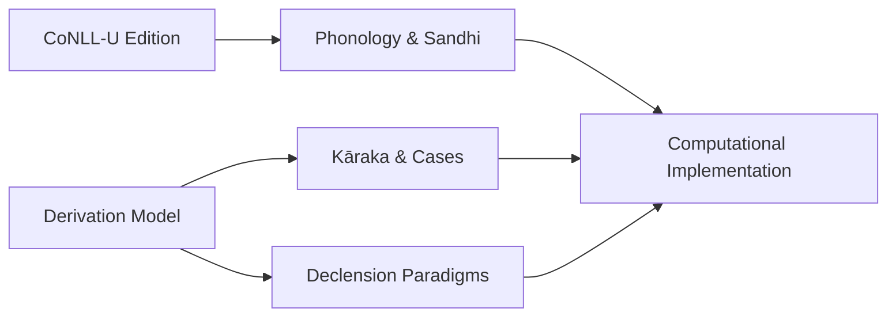

<cite>
**Referenced Files in This Document**
- [astadhyayi.md](file://astadhyayi.md)
- [panini-and-the-astadhyayi.md](file://panini-and-the-astadhyayi.md)
- [paninian-phonology.md](file://paninian-phonology.md)
- [dictionary-of-sanskrit-grammar.md](file://dictionary-of-sanskrit-grammar.md)
- [sanskrit-noun-declension.md](file://sanskrit-noun-declension.md)
</cite>

## Table of Contents
1. [Introduction](#introduction)
2. [Project Structure](#project-structure)
3. [Core Components](#core-components)
4. [Architecture Overview](#architecture-overview)
5. [Detailed Component Analysis](#detailed-component-analysis)
6. [Dependency Analysis](#dependency-analysis)
7. [Performance Considerations](#performance-considerations)
8. [Troubleshooting Guide](#troubleshooting-guide)
9. [Conclusion](#conclusion)
10. [Appendices](#appendices)

## Introduction
This document explains the revolutionary rule-based framework of Pāṇinian grammar as encoded in the Aṣṭādhyāyī, focusing on how its ~4,000 sūtras formalize Sanskrit phonology, morphology, and syntax. It also outlines how modern computational linguistics implements these principles—rule application order, sandhi formation, lemma generation, and parsing strategies—and connects classical grammatical concepts to contemporary natural language processing techniques.

## Project Structure
The repository provides a focused set of reference materials that together describe both the theoretical architecture and practical implementation aspects of Pāṇinian grammar:
- A high-level overview of the Aṣṭādhyāyī’s structure and derivation model
- A detailed account of Pāṇinian phonology, including the Śiva-sūtras and sandhi
- A machine-parseable CoNLL-U edition of the Aṣṭādhyāyī with morphological annotations
- Reference works for terminology and noun declension patterns

**Diagram sources**
- [astadhyayi.md:19-43](file://astadhyayi.md#L19-L43)
- [panini-and-the-astadhyayi.md:24-50](file://panini-and-the-astadhyayi.md#L24-L50)
- [paninian-phonology.md:27-70](file://paninian-phonology.md#L27-L70)

**Section sources**
- [astadhyayi.md:19-43](file://astadhyayi.md#L19-L43)
- [panini-and-the-astadhyayi.md:24-50](file://panini-and-the-astadhyayi.md#L24-L50)
- [paninian-phonology.md:27-70](file://paninian-phonology.md#L27-L70)

## Core Components
- Rule-based generative system: The Aṣṭādhyāyī encodes grammar as ordered rules (sūtras) that transform abstract representations into phonological forms.
- Four-level derivation: Semantic information → morphosyntactic representation → abstract morphology → phonological output.
- Phonological engine: Śiva-sūtras define the inventory and enable compact class notation (pratyāhāra); sandhi rules govern sound combinations at boundaries.
- Machine-readable edition: CoNLL-U files provide lemmatization, morphological features, and sandhi reconstruction for every term in the sūtras.
- Terminology and paradigms: Reference dictionaries and declension tables support accurate interpretation and implementation.

**Section sources**
- [panini-and-the-astadhyayi.md:24-50](file://panini-and-the-astadhyayi.md#L24-L50)
- [paninian-phonology.md:27-70](file://paninian-phonology.md#L27-L70)
- [astadhyayi.md:19-43](file://astadhyayi.md#L19-L43)
- [dictionary-of-sanskrit-grammar.md:23-48](file://dictionary-of-sanskrit-grammar.md#L23-L48)
- [sanskrit-noun-declension.md:20-71](file://sanskrit-noun-declension.md#L20-L71)

## Architecture Overview
Pāṇini’s grammar can be viewed as a pipeline where each stage constrains and enriches the next:

**Diagram sources**
- [panini-and-the-astadhyayi.md:33-42](file://panini-and-the-astadhyayi.md#L33-L42)

## Detailed Component Analysis

### A. Rule-Based System and Derivation Model
- Ordered rule application: Later rules typically override earlier ones; this ordering is essential for correct derivations.
- Contextual inheritance (anuvṛtti): Rules can inherit context from preceding rules, reducing redundancy.
- Headings (adhikāra): Section headings scope entire blocks of rules.
- Abbreviations (pratyāhāra): Compact labels derived from the Śiva-sūtras denote natural classes of sounds.
- Asiddhatva: A rule may be treated as “not having taken effect” for the purpose of another rule’s application.

**Diagram sources**
- [panini-and-the-astadhyayi.md:33-50](file://panini-and-the-astadhyayi.md#L33-L50)

**Section sources**
- [panini-and-the-astadhyayi.md:24-50](file://panini-and-the-astadhyayi.md#L24-L50)

### B. Phonology and Sandhi Formation
- Śiva-sūtras: 14 aphorisms listing phonemes in an order optimized for abbreviatory power; any contiguous subsequence yields a pratyāhāra (e.g., all vowels, all consonants).
- Classification by place and manner: Five articulatory positions and four internal efforts organize the inventory.
- Sandhi: Systematic modifications at morpheme, word, and compound boundaries include vowel combination, consonant combination, and visarga behavior.

**Diagram sources**
- [paninian-phonology.md:27-70](file://paninian-phonology.md#L27-L70)

**Section sources**
- [paninian-phonology.md:27-70](file://paninian-phonology.md#L27-L70)

### C. CoNLL-U Edition and Computational Parsing
- Machine-parseable sūtras: The CoNLL-U edition includes lemmas, morphological analysis, sandhi reconstruction, and preserved structural metadata (rule numbering, chapter/pāda organization).
- Technical markers: Each sūtra carries it letters and other markers that govern rule application; these are annotated for automated processing.
- Use cases: Enables automated parsing of sūtras, extraction of rule conditions and replacements, and simulation of rule interactions.

**Diagram sources**
- [astadhyayi.md:19-43](file://astadhyayi.md#L19-L43)

**Section sources**
- [astadhyayi.md:19-43](file://astadhyayi.md#L19-L43)

### D. Kāraka Theory and Case Assignment
- Thematic roles map to grammatical cases: agent → nominative, patient → accusative, instrument → instrumental, recipient → dative, source → ablative, location → locative.
- This mapping informs morphosyntactic representation before affix spell-out.

**Diagram sources**
- [panini-and-the-astadhyayi.md:52-61](file://panini-and-the-astadhyayi.md#L52-L61)

**Section sources**
- [panini-and-the-astadhyayi.md:52-61](file://panini-and-the-astadhyayi.md#L52-L61)

### E. Noun Declension and Paradigm Patterns
- Parameters: number (singular, dual, plural), case (eight cases), gender (masculine, feminine, neuter).
- Major stem classes: -a, -i, -u, -ṛ stems and various consonant-stem classes.
- Sandhi in declension: Internal sandhi frequently alters stem-final sounds when endings are added.

**Diagram sources**
- [sanskrit-noun-declension.md:20-71](file://sanskrit-noun-declension.md#L20-L71)

**Section sources**
- [sanskrit-noun-declension.md:20-71](file://sanskrit-noun-declension.md#L20-L71)

### F. Terminology and Reference Support
- Dictionary coverage: Comprehensive entries for sūtras, Prātiśākhyas, commentarial terms, vārttikas, and paribhāṣās.
- Entry structure: Term, function/scope, cross-references, citations, and examples.
- Utility: Essential for interpreting technical vocabulary used in rule formulation and commentary.

**Section sources**
- [dictionary-of-sanskrit-grammar.md:23-48](file://dictionary-of-sanskrit-grammar.md#L23-L48)

## Dependency Analysis
The components interdepend as follows:
- The CoNLL-U edition depends on the phonological system (Śiva-sūtras, sandhi) to reconstruct pre-sandhi forms and annotate morphology.
- The derivation model relies on terminology and paradigms to correctly interpret kāraka mappings and inflectional patterns.
- Rule application mechanisms (ordering, anuvṛtti, adhikāra, pratyāhāra, asiddhatva) coordinate across all layers.

**Diagram sources**
- [astadhyayi.md:19-43](file://astadhyayi.md#L19-L43)
- [panini-and-the-astadhyayi.md:24-61](file://panini-and-the-astadhyayi.md#L24-L61)
- [paninian-phonology.md:27-70](file://paninian-phonology.md#L27-L70)
- [sanskrit-noun-declension.md:20-71](file://sanskrit-noun-declension.md#L20-L71)

**Section sources**
- [astadhyayi.md:19-43](file://astadhyayi.md#L19-L43)
- [panini-and-the-astadhyayi.md:24-61](file://panini-and-the-astadhyayi.md#L24-L61)
- [paninian-phonology.md:27-70](file://paninian-phonology.md#L27-L70)
- [sanskrit-noun-declension.md:20-71](file://sanskrit-noun-declension.md#L20-L71)

## Performance Considerations
- Rule ordering efficiency: Proper ordering minimizes redundant checks and avoids unnecessary rewrites.
- Pratyāhāra indexing: Precomputing class membership accelerates matching against large inventories.
- Incremental sandhi: Applying sandhi incrementally during derivation reduces post-processing overhead.
- Memoization: Cache intermediate representations (e.g., after major stages) to avoid recomputation.
- Parallelizable phases: Independent sandhi modules (vowel, consonant, visarga) can be parallelized where safe.

[No sources needed since this section provides general guidance]

## Troubleshooting Guide
Common issues and resolutions:
- Incorrect rule ordering: Ensure later rules override earlier ones per the intended semantics; verify uttarārtha behavior.
- Misapplied anuvṛtti: Confirm contextual inheritance is scoped correctly within adhikāra sections.
- Sandhi errors: Validate that svara-sandhi precedes vyañjana-sandhi and visarga-sandhi; check boundary contexts.
- Lemma mismatches: Cross-check CoNLL-U lemmas against the dictionary for consistent tagging.
- Paradigm misclassification: Recheck stem final sound and gender to assign the correct declension class.

**Section sources**
- [panini-and-the-astadhyayi.md:44-50](file://panini-and-the-astadhyayi.md#L44-L50)
- [paninian-phonology.md:63-70](file://paninian-phonology.md#L63-L70)
- [dictionary-of-sanskrit-grammar.md:34-48](file://dictionary-of-sanskrit-grammar.md#L34-L48)
- [sanskrit-noun-declension.md:43-71](file://sanskrit-noun-declension.md#L43-L71)

## Conclusion
Pāṇini’s Aṣṭādhyāyī presents a highly formalized, rule-driven grammar that anticipates many ideas in modern computational linguistics. Its layered derivation model, precise phonological system, and compact notation make it amenable to algorithmic implementation. The CoNLL-U edition enables direct computational access to the sūtras, while reference works ensure accurate interpretation of terminology and paradigms. Together, these resources bridge classical grammar and contemporary NLP, enabling robust parsing, lemma generation, and morphophonological modeling.

[No sources needed since this section summarizes without analyzing specific files]

## Appendices

### A. Example: Rule Parsing Workflow
- Input: A sūtra with condition and replacement, annotated with it letters and pratyāhāras.
- Steps:
  - Parse condition and replacement using CoNLL-U annotations.
  - Resolve pratyāhāras to concrete phoneme sets via Śiva-sūtras.
  - Apply rule according to ordering constraints and anuvṛtti context.
  - Update representation and proceed to next applicable rule.

**Section sources**
- [astadhyayi.md:19-43](file://astadhyayi.md#L19-L43)
- [paninian-phonology.md:27-46](file://paninian-phonology.md#L27-L46)

### B. Example: Lemma Generation Pipeline
- Input: Surface form with sandhi applied.
- Steps:
  - Reverse sandhi to recover underlying segments.
  - Segment into stem and affixes using declension paradigms.
  - Normalize to lemma using dictionary references and morphological tags.
  - Output: Lemma with feature bundle (case, number, gender, verb form).

**Section sources**
- [paninian-phonology.md:63-70](file://paninian-phonology.md#L63-L70)
- [sanskrit-noun-declension.md:20-71](file://sanskrit-noun-declension.md#L20-L71)
- [dictionary-of-sanskrit-grammar.md:34-48](file://dictionary-of-sanskrit-grammar.md#L34-L48)
