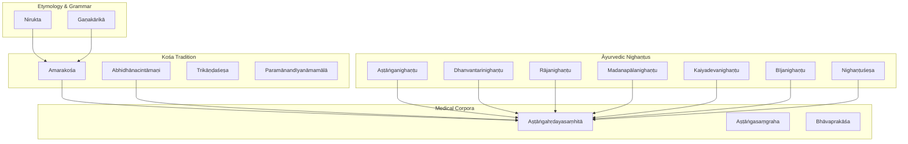
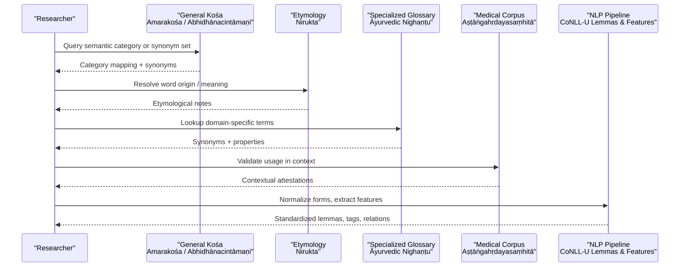
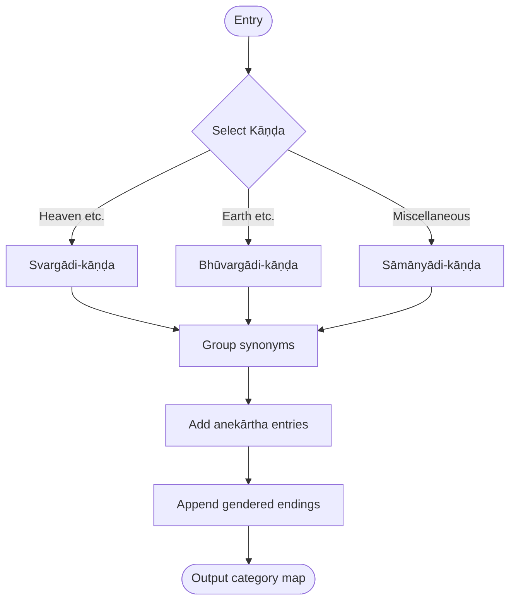
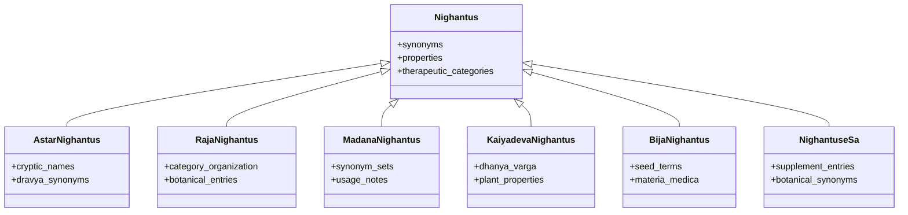
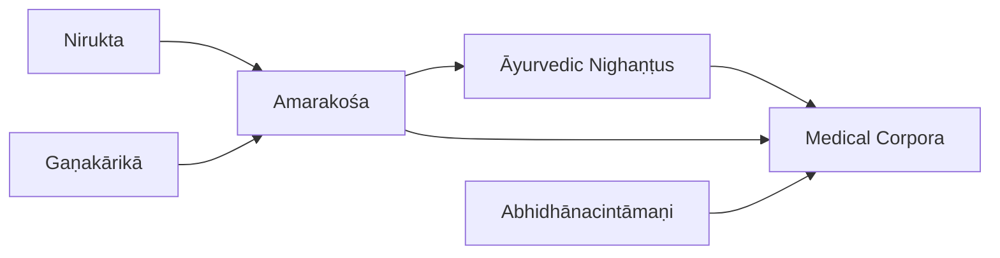

<cite>
**Referenced Files in This Document**
- [amarakosa.md](file://amarakosa.md)
- [nirukta.md](file://nirukta.md)
- [abhidhanacintamani.md](file://abhidhanacintamani.md)
- [trikandasesa.md](file://trikandasesa.md)
- [ganakarika.md](file://ganakarika.md)
- [astanganighantu.md](file://astanganighantu.md)
- [dhanvantarinighantu.md](file://dhanvantarinighantu.md)
- [rajanighantu.md](file://rajanighantu.md)
- [madanapalanighantu.md](file://madanapalanighantu.md)
- [kaiyadevanighantu.md](file://kaiyadevanighantu.md)
- [bijanighantu.md](file://bijanighantu.md)
- [nighantusesa.md](file://nighantusesa.md)
- [astangahrdayasamhita.md](file://astangahrdayasamhita.md)
- [astangasamgraha.md](file://astangasamgraha.md)
- [bhavaprakasa.md](file://bhavaprakasa.md)
- [INDEX.md](file://INDEX.md)
</cite>

## Table of Contents
1. Introduction
2. Project Structure
3. Core Components
4. Architecture Overview
5. Detailed Component Analysis
6. Dependency Analysis
7. Performance Considerations
8. Troubleshooting Guide
9. Conclusion

## Introduction
This document explains the Sanskrit lexicographical tradition with a focus on the Amarakośa kośa family, the nighaṇṭu glossaries (especially Āyurvedic ones), and specialized dictionaries. It describes how vocabulary is systematically organized by semantic categories, how word collection and classification evolved from Vedic etymology to medieval kośas and technical lexicons, and how these resources support computational linguistics through standardized lemmas, morphological annotations, semantic relationships, and cross-referencing across texts. Practical examples are provided for text processing, morphological analysis, and semantic search applications, along with guidance for integrating multiple lexicons and handling variant spellings and contextual meanings.

## Project Structure
The repository organizes Sanskrit lexicographical works as individual topic files, each describing a text’s purpose, structure, and digital availability (often CoNLL-U parsed editions). The INDEX provides a curated overview of topics and links to related materials. Key lexicographical clusters include:
- General kośas: Amarakośa, Abhidhānacintāmaṇi, Trikāṇḍaśeṣa, Paramānandīyanāmamālā
- Etymological foundations: Nirukta
- Grammatical word-lists: Gaṇakārikā
- Āyurvedic nighaṇṭus: Aṣṭāṅganighaṇṭu, Dhanvantarinighaṇṭu, Rājanighaṇṭu, Madanapālanighaṇṭu, Kaiyadevanighaṇṭu, Bījanighaṇṭu, Nighaṇṭuśeṣa
- Medical corpora that share terminology: Aṣṭāṅgahṛdayasaṃhitā, Aṣṭāṅgasaṃgraha, Bhāvaprakāśa

**Diagram sources**
- [amarakosa.md:23-64](file://amarakosa.md#L23-L64)
- [abhidhanacintamani.md:23-66](file://abhidhanacintamani.md#L23-L66)
- [nirukta.md:1-58](file://nirukta.md#L1-L58)
- [ganakarika.md:1-12](file://ganakarika.md#L1-L12)
- [astanganighantu.md:21-46](file://astanganighantu.md#L21-L46)
- [dhanvantarinighantu.md:1-48](file://dhanvantarinighantu.md#L1-L48)
- [rajanighantu.md:1-48](file://rajanighantu.md#L1-L48)
- [madanapalanighantu.md:1-48](file://madanapalanighantu.md#L1-L48)
- [kaiyadevanighantu.md:1-48](file://kaiyadevanighantu.md#L1-L48)
- [bijanighantu.md:1-12](file://bijanighantu.md#L1-L12)
- [nighantusesa.md:1-48](file://nighantusesa.md#L1-L48)
- [astangahrdayasamhita.md:20-50](file://astangahrdayasamhita.md#L20-L50)
- [astangasamgraha.md:19-46](file://astangasamgraha.md#L19-L46)
- [bhavaprakasa.md:1-48](file://bhavaprakasa.md#L1-L48)

**Section sources**
- [INDEX.md:1-277](file://INDEX.md#L1-L277)

## Core Components
- Amarakośa: Semantic thesaurus organized into three major sections; verse format aids memorization; supports modern lexical databases and CoNLL-U parsing.
- Nirukta: Foundational Vedic etymology and lexical semantics; explains origins and meanings of words in the Nighaṇṭu.
- Abhidhānacintāmaṇi: Jain kośa with explicit rūḍha/yaugika/miśra classification; rich morphological annotation in CoNLL-U.
- Trikāṇḍaśeṣa: Supplement to the Amarakośa adding entries beyond its three sections.
- Gaṇakārikā: Commentary on Pāṇini’s gaṇa-pāṭha; clarifies membership and structure of grammatical word lists.
- Āyurvedic nighaṇṭus: Specialized glossaries cataloging medicinal substances with synonyms, properties, and therapeutic categories; heavily used in medical corpora.

These components collectively provide:
- Standardized lemmas and forms via CoNLL-U
- Semantic groupings (synsets/categories)
- Cross-references between general kośas and domain-specific nighaṇṭus
- Morphological features enabling downstream NLP tasks

**Section sources**
- [amarakosa.md:23-64](file://amarakosa.md#L23-L64)
- [nirukta.md:1-58](file://nirukta.md#L1-L58)
- [abhidhanacintamani.md:23-66](file://abhidhanacintamani.md#L23-L66)
- [trikandasesa.md:1-12](file://trikandasesa.md#L1-L12)
- [ganakarika.md:1-12](file://ganakarika.md#L1-L12)
- [astanganighantu.md:21-46](file://astanganighantu.md#L21-L46)
- [dhanvantarinighantu.md:1-48](file://dhanvantarinighantu.md#L1-L48)
- [rajanighantu.md:1-48](file://rajanighantu.md#L1-L48)
- [madanapalanighantu.md:1-48](file://madanapalanighantu.md#L1-L48)
- [kaiyadevanighantu.md:1-48](file://kaiyadevanighantu.md#L1-L48)
- [bijanighantu.md:1-12](file://bijanighantu.md#L1-L12)
- [nighantusesa.md:1-48](file://nighantusesa.md#L1-L48)

## Architecture Overview
The lexicographical architecture spans historical evolution and digital integration:
- Historical evolution: From Vedic etymology (Nirukta) to kośas (Amarakośa, Abhidhānacintāmaṇi) to specialized nighaṇṭus (Āyurvedic glossaries).
- Digital integration: CoNLL-U parsed editions enable lemma normalization, morphological tagging, and cross-text similarity.
- Cross-referencing: Kośas provide broad semantic categories; nighaṇṭus supply domain-specific synonym sets; medical corpora demonstrate shared terminology usage.

**Diagram sources**
- [amarakosa.md:23-64](file://amarakosa.md#L23-L64)
- [abhidhanacintamani.md:23-66](file://abhidhanacintamani.md#L23-L66)
- [nirukta.md:1-58](file://nirukta.md#L1-L58)
- [astanganighantu.md:21-46](file://astanganighantu.md#L21-L46)
- [astangahrdayasamhita.md:20-50](file://astangahrdayasamhita.md#L20-L50)

## Detailed Component Analysis

### Amarakośa: Semantic Thesaurus and Ontology
- Organization: Three kāṇḍas grouping synonyms; includes anekārtha entries and gendered endings.
- Verse format: Facilitates memorization and oral transmission; still chanted in traditional education.
- Knowledge classification: Mirrors ancient Indian taxonomies; serves as an ontology for computational use.
- Computational value: CoNLL-U parsed edition enables machine-readable morphology and semantic relations; supports alignment with WordNet-like structures.

**Diagram sources**
- [amarakosa.md:29-37](file://amarakosa.md#L29-L37)

**Section sources**
- [amarakosa.md:23-64](file://amarakosa.md#L23-L64)

### Nirukta: Etymology and Lexical Semantics
- Purpose: Foundational text explaining word origins and meanings; commentary on the Nighaṇṭu.
- Relevance: Provides etymological grounding for kośa entries and technical terms; informs sense disambiguation.

**Section sources**
- [nirukta.md:1-58](file://nirukta.md#L1-L58)

### Abhidhānacintāmaṇi: Rūḍha/Yaugika Classification
- Innovation: Explicit tripartite classification (rūḍha, yaugika, miśra) anticipates modern compositional vs lexicalized semantics.
- Digital edition: CoNLL-U provides full lemmatization, morphological features, sandhi reconstruction, and semantic codes.

**Section sources**
- [abhidhanacintamani.md:23-66](file://abhidhanacintamani.md#L23-L66)

### Trikāṇḍaśeṣa: Supplement to the Amarakośa
- Role: Adds entries beyond the three main sections of the Amarakośa; extends coverage of semantic categories.

**Section sources**
- [trikandasesa.md:1-12](file://trikandasesa.md#L1-L12)

### Gaṇakārikā: Grammatical Word Lists
- Focus: Explains membership and structure of Pāṇini’s gaṇa-pāṭha; complements kośa categorization with grammatical regularities.

**Section sources**
- [ganakarika.md:1-12](file://ganakarika.md#L1-L12)

### Āyurvedic Nighaṇṭus: Specialized Lexicons
- Common pattern: Catalog medicinal substances with synonyms, properties, and therapeutic categories; often aligned with medical corpora.
- Examples:
  - Aṣṭāṅganighaṇṭu: Cryptic names and synonyms for dravyas; companion to Aṣṭāṅgasaṃgraha.
  - Dhanvantarinighaṇṭu: Botanical materia medica with properties.
  - Rājanighaṇṭu: Comprehensive lexicon organized by therapeutic categories.
  - Madanapālanighaṇṭu: Synonyms and uses; high lexical overlap with other nighaṇṭus.
  - Kaiyadevanighaṇṭu: Grain/plant synonyms; dhanya-varga focus.
  - Bījanighaṇṭu: Seed glossary for botanical materia medica.
  - Nighaṇṭuśeṣa: Supplement to the nighaṇṭu tradition with botanical synonyms.

**Diagram sources**
- [astanganighantu.md:21-46](file://astanganighantu.md#L21-L46)
- [dhanvantarinighantu.md:1-48](file://dhanvantarinighantu.md#L1-L48)
- [rajanighantu.md:1-48](file://rajanighantu.md#L1-L48)
- [madanapalanighantu.md:1-48](file://madanapalanighantu.md#L1-L48)
- [kaiyadevanighantu.md:1-48](file://kaiyadevanighantu.md#L1-L48)
- [bijanighantu.md:1-12](file://bijanighantu.md#L1-L12)
- [nighantusesa.md:1-48](file://nighantusesa.md#L1-L48)

**Section sources**
- [astanganighantu.md:21-46](file://astanganighantu.md#L21-L46)
- [dhanvantarinighantu.md:1-48](file://dhanvantarinighantu.md#L1-L48)
- [rajanighantu.md:1-48](file://rajanighantu.md#L1-L48)
- [madanapalanighantu.md:1-48](file://madanapalanighantu.md#L1-L48)
- [kaiyadevanighantu.md:1-48](file://kaiyadevanighantu.md#L1-L48)
- [bijanighantu.md:1-12](file://bijanighantu.md#L1-L12)
- [nighantusesa.md:1-48](file://nighantusesa.md#L1-L48)

### Medical Corpora: Shared Terminology and Usage
- Aṣṭāṅgahṛdayasaṃhitā: Systematic eight-limb organization; extensive technical vocabulary; large CoNLL-U corpus.
- Aṣṭāṅgasaṃgraha: Earlier prose exposition; establishes Ātreya tradition and dual nature of medicine.
- Bhāvaprakāśa: Comprehensive compendium covering pathology, pharmacology, therapeutics; shares lemma patterns with nighaṇṭus.

**Section sources**
- [astangahrdayasamhita.md:20-50](file://astangahrdayasamhita.md#L20-L50)
- [astangasamgraha.md:19-46](file://astangasamgraha.md#L19-L46)
- [bhavaprakasa.md:1-48](file://bhavaprakasa.md#L1-L48)

## Dependency Analysis
- Kośa-to-Nighaṇṭu dependencies: General kośas provide broad semantic categories; nighaṇṭus refine domain-specific synonym sets.
- Etymology-to-Kośa dependencies: Nirukta informs sense derivation and disambiguation for kośa entries.
- Nighaṇṭu-to-Corpus dependencies: Medical corpora validate usage and show co-occurrence patterns of technical terms.
- Digital layer: CoNLL-U editions standardize lemmas and features, enabling cross-text similarity and pipeline integration.

**Diagram sources**
- [nirukta.md:1-58](file://nirukta.md#L1-L58)
- [amarakosa.md:23-64](file://amarakosa.md#L23-L64)
- [ganakarika.md:1-12](file://ganakarika.md#L1-L12)
- [abhidhanacintamani.md:23-66](file://abhidhanacintamani.md#L23-L66)
- [astanganighantu.md:21-46](file://astanganighantu.md#L21-L46)
- [astangahrdayasamhita.md:20-50](file://astangahrdayasamhita.md#L20-L50)

**Section sources**
- [INDEX.md:1-277](file://INDEX.md#L1-L277)

## Performance Considerations
- Lexicon size and sparsity: Large nighaṇṭus increase vocabulary breadth but may introduce sparse entries; consider pruning rare variants and focusing on frequent lemmas.
- Morphological complexity: CoNLL-U features enable robust normalization; ensure consistent tokenization and sandhi reconstruction to reduce form explosion.
- Semantic density: Kośa categories improve recall in semantic search; combine with domain nighaṇṭus to balance precision and coverage.
- Cross-reference overhead: Linking multiple lexicons increases query time; precompute synonym graphs and cache category mappings.

[No sources needed since this section provides general guidance]

## Troubleshooting Guide
Common issues and resolutions:
- Variant spellings and regional names: Use CoNLL-U lemmas and sandhi reconstruction to normalize forms; align with nighaṇṭu synonym sets to resolve variants.
- Contextual ambiguity: Leverage Nirukta etymologies and kośa categories to disambiguate senses; verify with medical corpus co-occurrences.
- Integration conflicts: When merging multiple lexicons, prioritize canonical lemmas and maintain provenance metadata to track source texts.
- Missing entries: Supplement gaps using Trikāṇḍaśeṣa and Nighaṇṭuśeṣa; consult Gaṇakārikā for grammatical regularities.

**Section sources**
- [amarakosa.md:23-64](file://amarakosa.md#L23-L64)
- [nirukta.md:1-58](file://nirukta.md#L1-L58)
- [abhidhanacintamani.md:23-66](file://abhidhanacintamani.md#L23-L66)
- [trikandasesa.md:1-12](file://trikandasesa.md#L1-L12)
- [ganakarika.md:1-12](file://ganakarika.md#L1-L12)
- [nighantusesa.md:1-48](file://nighantusesa.md#L1-L48)

## Conclusion
Sanskrit lexicography—from the Vedic etymology of Nirukta to the semantic richness of kośas and the domain specificity of nighaṇṭus—provides a robust foundation for computational linguistics. Standardized lemmas, morphological annotations, and semantic relationships enable effective text processing, morphological analysis, and semantic search. Integrating multiple lexicons requires careful handling of variant spellings and contextual meanings, supported by CoNLL-U editions and cross-referencing strategies. The repository’s structured topic files and parsed corpora make it practical to build scalable, accurate NLP pipelines grounded in classical Sanskrit scholarship.

[No sources needed since this section summarizes without analyzing specific files]
