<cite>
**Referenced Files in This Document**
- [manusmrti.md](file://manusmrti.md)
- [apastambadharmasutra.md](file://apastambadharmasutra.md)
- [gautamadharmasutra.md](file://gautamadharmasutra.md)
- [vasisthadharmasutra.md](file://vasisthadharmasutra.md)
- [yajnavalkyasmrti.md](file://yajnavalkyasmrti.md)
- [naradasmrti.md](file://naradasmrti.md)
- [visnusmrti.md](file://visnusmrti.md)
- [parasaradharmasamhita.md](file://parasaradharmasamhita.md)
- [katyayanasmrti.md](file://katyayanasmrti.md)
- [arthasastra.md](file://arthasastra.md)
- [INDEX.md](file://INDEX.md)
</cite>

## Table of Contents
1. [Introduction](#introduction)
2. [Project Structure](#project-structure)
3. [Core Components](#core-components)
4. [Architecture Overview](#architecture-overview)
5. [Detailed Component Analysis](#detailed-component-analysis)
6. [Dependency Analysis](#dependency-analysis)
7. [Performance Considerations](#performance-considerations)
8. [Troubleshooting Guide](#troubleshooting-guide)
9. [Conclusion](#conclusion)
10. [Appendices](#appendices)

## Introduction
This document provides a comprehensive overview of the Dharmaśāstra tradition as represented in the repository’s Sanskrit corpus, focusing on foundational legal and social codes from ancient India. It synthesizes how these texts systematically treat law, ethics, and social duties; outlines their coverage of varṇa and āśrama responsibilities; describes judicial procedures, civil and criminal law, penances (prāyaścitta), and kingly duties; and explains how computational linguistics can trace the evolution of legal concepts across traditions and identify regional variations.

The repository includes parsed editions (CoNLL-U) of major Dharmaśāstras and related legal-political texts, enabling quantitative analysis of terminology, stylistic shifts, and conceptual change over time.

## Project Structure
The repository organizes each text as a standalone topic file with metadata describing its scope, sources, tags, and related texts. The Dharmaśāstra-related files include:
- Early Dharmasūtras: Āpastambadharmasūtra, Gautamadharmasūtra, Vasiṣṭhadharmasūtra
- Classical Smṛtis: Manusmṛti, Yājñavalkyasmṛti, Viṣṇusmṛti, Nāradasmṛti, Kātyāyanasmṛti, Parāśaradharmasaṃhitā
- Related statecraft: Arthaśāstra

Each entry lists “Related Texts” by lemma similarity, which reveals conceptual proximity and shared legal vocabulary across traditions.

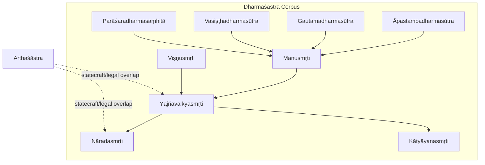

**Diagram sources**
- [apastambadharmasutra.md:1-46](file://apastambadharmasutra.md#L1-L46)
- [gautamadharmasutra.md:1-48](file://gautamadharmasutra.md#L1-L48)
- [vasisthadharmasutra.md:1-48](file://vasisthadharmasutra.md#L1-L48)
- [manusmrti.md:1-48](file://manusmrti.md#L1-L48)
- [yajnavalkyasmrti.md:1-48](file://yajnavalkyasmrti.md#L1-L48)
- [visnusmrti.md:1-48](file://visnusmrti.md#L1-L48)
- [naradasmrti.md:1-48](file://naradasmrti.md#L1-L48)
- [katyayanasmrti.md:1-48](file://katyayanasmrti.md#L1-L48)
- [parasaradharmasamhita.md:1-48](file://parasaradharmasamhita.md#L1-L48)
- [arthasastra.md:1-84](file://arthasastra.md#L1-L84)

**Section sources**
- [INDEX.md:1-277](file://INDEX.md#L1-L277)

## Core Components
This section summarizes the core components of the Dharmaśāstra corpus present in the repository and highlights their distinctive contributions to Indian legal thought.

- Āpastambadharmasūtra: One of the earliest surviving Dharmaśāstras; sūtra-style manual emphasizing conventional practice (samaya/ācāra) alongside Vedic authority; covers varṇa and āśrama duties and early legal norms.
- Gautamadharmasūtra: Early Dharmasūtra prescribing duties and laws for the four varṇas and āśramas; shows strong lexical affinity with later smṛtis.
- Vasiṣṭhadharmasūtra: Prescribes duties, laws, and penances for the varṇas; exhibits high similarity to other smṛtis, indicating shared legal vocabulary.
- Manusmṛti: The most influential Dharmaśāstra; covers varṇa duties, law, penance, and kingly governance; serves as a central reference point for later texts.
- Yājñavalkyasmṛti: Concise treatment of conduct (ācāra), law (vyavahāra), and penance (prāyaścitta); closely linked to Nāradasmṛti and Kātyāyanasmṛti in judicial topics.
- Nāradasmṛti: Comprehensive code on judicial procedure, evidence, and contract law; highly similar to Kātyāyanasmṛti and Yājñavalkyasmṛti.
- Viṣṇusmṛti: Vaiṣṇava perspective on varṇa duties, penances, and religious observances; lexically close to Yājñavalkyasmṛti and Vasiṣṭhadharmasūtra.
- Parāśaradharmasaṃhitā: Legal code tailored for Kali Yuga; prescribes duties, penances, and laws; shares significant vocabulary with Manusmṛti and Vasiṣṭhadharmasūtra.
- Kātyāyanasmṛti: Supplemental legal code with detailed rules on judicial procedure and civil law; strongly aligned with Nāradasmṛti.
- Arthaśāstra: Statecraft and economic policy; overlaps with Dharmaśāstras on king’s duties, taxation, criminal and civil law, diplomacy, and enforcement mechanisms.

These components collectively illustrate the evolution from early Dharmasūtras to classical Smṛtis, and the integration of legal theory with political administration.

**Section sources**
- [apastambadharmasutra.md:1-46](file://apastambadharmasutra.md#L1-L46)
- [gautamadharmasutra.md:1-48](file://gautamadharmasutra.md#L1-L48)
- [vasisthadharmasutra.md:1-48](file://vasisthadharmasutra.md#L1-L48)
- [manusmrti.md:1-48](file://manusmrti.md#L1-L48)
- [yajnavalkyasmrti.md:1-48](file://yajnavalkyasmrti.md#L1-L48)
- [naradasmrti.md:1-48](file://naradasmrti.md#L1-L48)
- [visnusmrti.md:1-48](file://visnusmrti.md#L1-L48)
- [parasaradharmasamhita.md:1-48](file://parasaradharmasamhita.md#L1-L48)
- [katyayanasmrti.md:1-48](file://katyayanasmrti.md#L1-L48)
- [arthasastra.md:1-84](file://arthasastra.md#L1-L84)

## Architecture Overview
The Dharmaśāstra corpus can be understood as an evolving architecture of legal knowledge:
- Early Dharmasūtras establish foundational categories (varṇa, āśrama, dharma sources).
- Classical Smṛtis systematize and expand these categories into comprehensive codes covering conduct, law, and penance.
- Specialized legal manuals (e.g., Nāradasmṛti, Kātyāyanasmṛti) refine judicial procedure, evidence, and contracts.
- Statecraft texts (Arthaśāstra) integrate legal principles with administrative and economic governance.

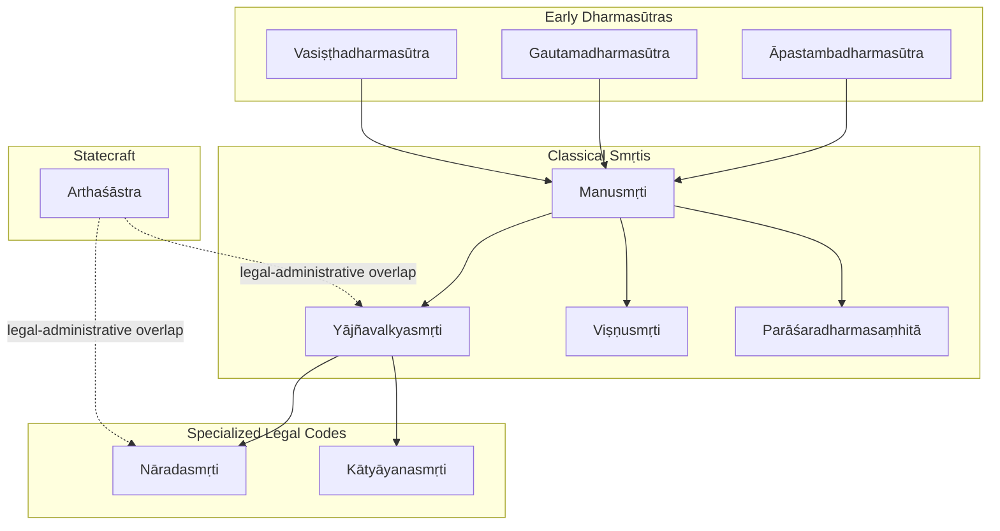

**Diagram sources**
- [apastambadharmasutra.md:1-46](file://apastambadharmasutra.md#L1-L46)
- [gautamadharmasutra.md:1-48](file://gautamadharmasutra.md#L1-L48)
- [vasisthadharmasutra.md:1-48](file://vasisthadharmasutra.md#L1-L48)
- [manusmrti.md:1-48](file://manusmrti.md#L1-L48)
- [yajnavalkyasmrti.md:1-48](file://yajnavalkyasmrti.md#L1-L48)
- [visnusmrti.md:1-48](file://visnusmrti.md#L1-L48)
- [parasaradharmasamhita.md:1-48](file://parasaradharmasamhita.md#L1-L48)
- [naradasmrti.md:1-48](file://naradasmrti.md#L1-L48)
- [katyayanasmrti.md:1-48](file://katyayanasmrti.md#L1-L48)
- [arthasastra.md:1-84](file://arthasastra.md#L1-L84)

## Detailed Component Analysis

### Manusmṛti
- Scope: Varṇa duties, law, penance, and kingly governance; most influential Dharmaśāstra.
- Lexical profile: High-frequency function words and key legal terms indicate broad normative coverage.
- Relatedness: Strong similarity to Viṣṇusmṛti, Vasiṣṭhadharmasūtra, and Yājñavalkyasmṛti, reflecting shared legal vocabulary and themes.

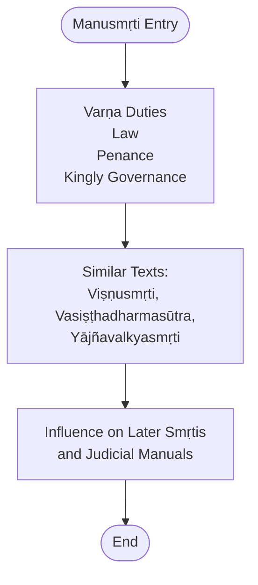

**Diagram sources**
- [manusmrti.md:1-48](file://manusmrti.md#L1-L48)

**Section sources**
- [manusmrti.md:1-48](file://manusmrti.md#L1-L48)

### Āpastambadharmasūtra
- Scope: Early Dharmasūtra; emphasizes samaya/ācāra as primary authorities alongside Vedas; outlines varṇa system and duties.
- Significance: Foundational legal framework that informs later smṛtis.

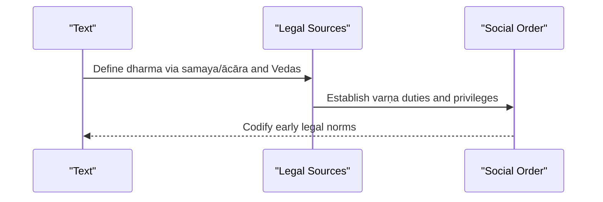

**Diagram sources**
- [apastambadharmasutra.md:1-46](file://apastambadharmasutra.md#L1-L46)

**Section sources**
- [apastambadharmasutra.md:1-46](file://apastambadharmasutra.md#L1-L46)

### Gautamadharmasūtra
- Scope: Early Dharmasūtra prescribing duties and laws for varṇas and āśramas.
- Relatedness: Close lexical ties to Vasiṣṭhadharmasūtra and Viṣṇusmṛti, indicating shared legal concepts.

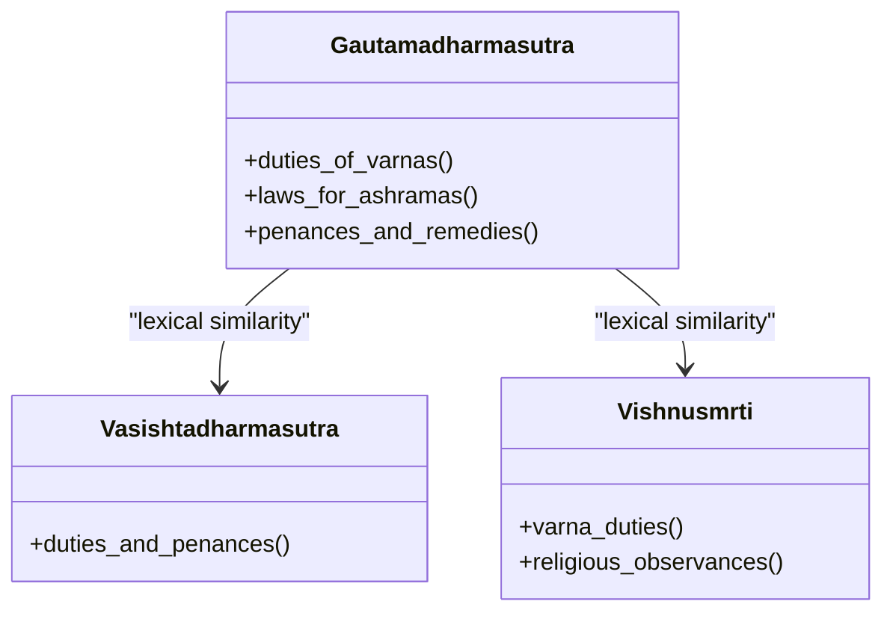

**Diagram sources**
- [gautamadharmasutra.md:1-48](file://gautamadharmasutra.md#L1-L48)
- [vasisthadharmasutra.md:1-48](file://vasisthadharmasutra.md#L1-L48)
- [visnusmrti.md:1-48](file://visnusmrti.md#L1-L48)

**Section sources**
- [gautamadharmasutra.md:1-48](file://gautamadharmasutra.md#L1-L48)

### Vasiṣṭhadharmasūtra
- Scope: Duties, laws, and penances for varṇas; high similarity to Viṣṇusmṛti and Gautamadharmasūtra.
- Role: Bridges early Dharmasūtra concerns with later smṛti elaborations.

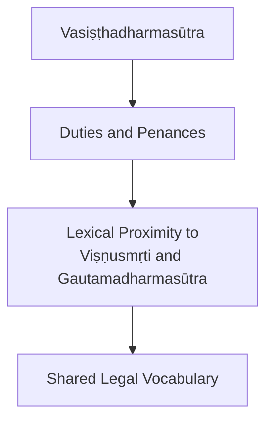

**Diagram sources**
- [vasisthadharmasutra.md:1-48](file://vasisthadharmasutra.md#L1-L48)
- [visnusmrti.md:1-48](file://visnusmrti.md#L1-L48)
- [gautamadharmasutra.md:1-48](file://gautamadharmasutra.md#L1-L48)

**Section sources**
- [vasisthadharmasutra.md:1-48](file://vasisthadharmasutra.md#L1-L48)

### Yājñavalkyasmṛti
- Scope: Conduct (ācāra), law (vyavahāra), and penance (prāyaścitta); concise compared to Manusmṛti.
- Relatedness: Strong similarity to Viṣṇusmṛti and Kātyāyanasmṛti; moderate similarity to Nāradasmṛti.

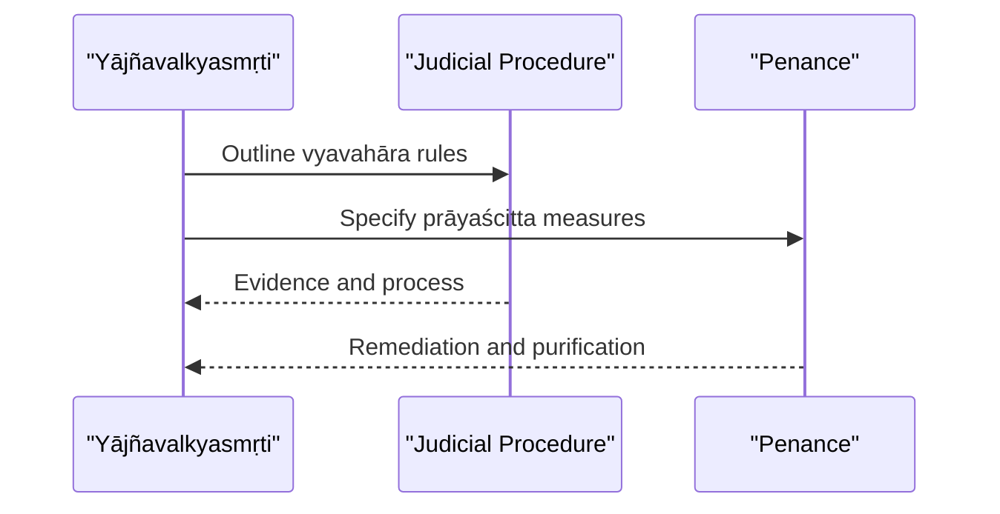

**Diagram sources**
- [yajnavalkyasmrti.md:1-48](file://yajnavalkyasmrti.md#L1-L48)
- [naradasmrti.md:1-48](file://naradasmrti.md#L1-L48)
- [katyayanasmrti.md:1-48](file://katyayanasmrti.md#L1-L48)

**Section sources**
- [yajnavalkyasmrti.md:1-48](file://yajnavalkyasmrti.md#L1-L48)

### Nāradasmṛti
- Scope: Comprehensive legal code on judicial procedure, evidence, and contract law.
- Relatedness: Highest similarity to Kātyāyanasmṛti; also close to Yājñavalkyasmṛti.

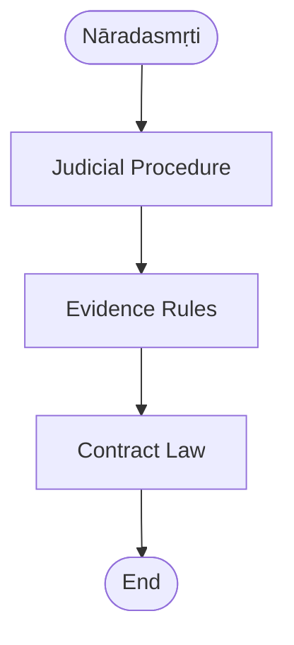

**Diagram sources**
- [naradasmrti.md:1-48](file://naradasmrti.md#L1-L48)
- [katyayanasmrti.md:1-48](file://katyayanasmrti.md#L1-L48)

**Section sources**
- [naradasmrti.md:1-48](file://naradasmrti.md#L1-L48)

### Viṣṇusmṛti
- Scope: Vaiṣṇava perspective on varṇa duties, penances, and religious observances.
- Relatedness: Strong similarity to Yājñavalkyasmṛti and Vasiṣṭhadharmasūtra.

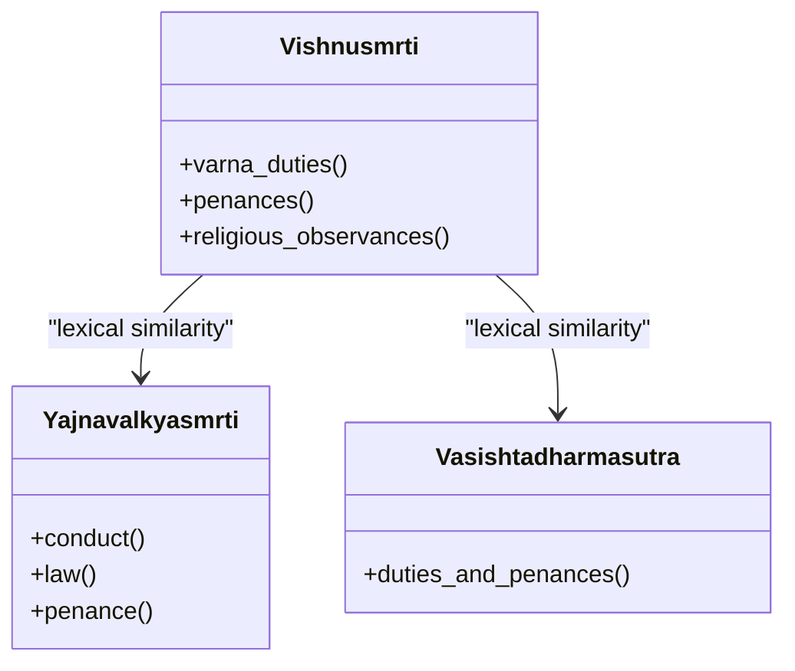

**Diagram sources**
- [visnusmrti.md:1-48](file://visnusmrti.md#L1-L48)
- [yajnavalkyasmrti.md:1-48](file://yajnavalkyasmrti.md#L1-L48)
- [vasisthadharmasutra.md:1-48](file://vasisthadharmasutra.md#L1-L48)

**Section sources**
- [visnusmrti.md:1-48](file://visnusmrti.md#L1-L48)

### Parāśaradharmasaṃhitā
- Scope: Legal code for Kali Yuga; prescribes duties, penances, and laws.
- Relatedness: Shares vocabulary with Manusmṛti and Vasiṣṭhadharmasūtra.

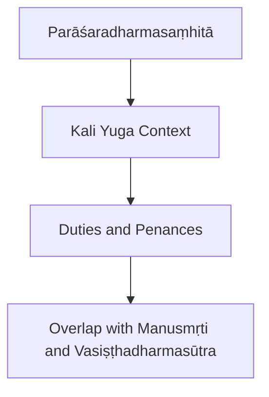

**Diagram sources**
- [parasaradharmasamhita.md:1-48](file://parasaradharmasamhita.md#L1-L48)
- [manusmrti.md:1-48](file://manusmrti.md#L1-L48)
- [vasisthadharmasutra.md:1-48](file://vasisthadharmasutra.md#L1-L48)

**Section sources**
- [parasaradharmasamhita.md:1-48](file://parasaradharmasamhita.md#L1-L48)

### Kātyāyanasmṛti
- Scope: Supplemental legal code with detailed rules on judicial procedure and civil law.
- Relatedness: Highest similarity to Nāradasmṛti; also close to Yājñavalkyasmṛti.

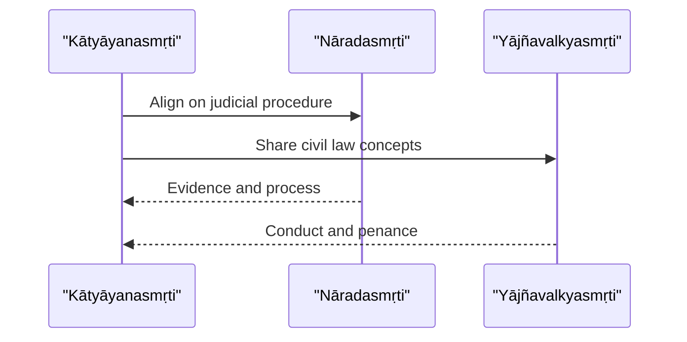

**Diagram sources**
- [katyayanasmrti.md:1-48](file://katyayanasmrti.md#L1-L48)
- [naradasmrti.md:1-48](file://naradasmrti.md#L1-L48)
- [yajnavalkyasmrti.md:1-48](file://yajnavalkyasmrti.md#L1-L48)

**Section sources**
- [katyayanasmrti.md:1-48](file://katyayanasmrti.md#L1-L48)

### Arthaśāstra
- Scope: Statecraft, economics, military strategy; overlaps with Dharmaśāstras on king’s duties, taxation, criminal and civil law, diplomacy.
- Integration: Provides administrative context for legal enforcement and policy.

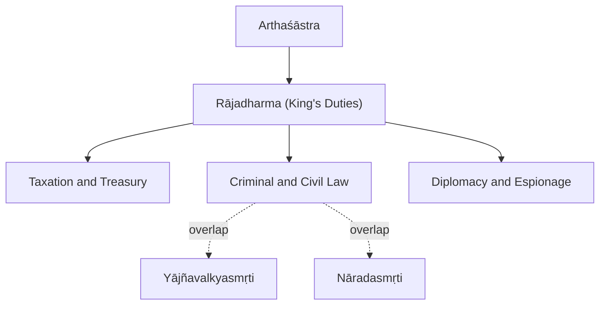

**Diagram sources**
- [arthasastra.md:1-84](file://arthasastra.md#L1-L84)
- [yajnavalkyasmrti.md:1-48](file://yajnavalkyasmrti.md#L1-L48)
- [naradasmrti.md:1-48](file://naradasmrti.md#L1-L48)

**Section sources**
- [arthasastra.md:1-84](file://arthasastra.md#L1-L84)

## Dependency Analysis
Computational linguistics reveals conceptual dependencies and evolution across the Dharmaśāstra corpus:
- Early Dharmasūtras (Āpastamba, Gautama, Vasiṣṭha) provide foundational legal vocabulary and categories.
- Manusmṛti consolidates and expands these into a comprehensive code; later smṛtis show high similarity to it.
- Judicial manuals (Nāradasmṛti, Kātyāyanasmṛti) specialize in procedure and contracts, aligning closely with Yājñavalkyasmṛti.
- Arthaśāstra integrates legal principles with statecraft, showing moderate overlap with smṛtis on enforcement and policy.

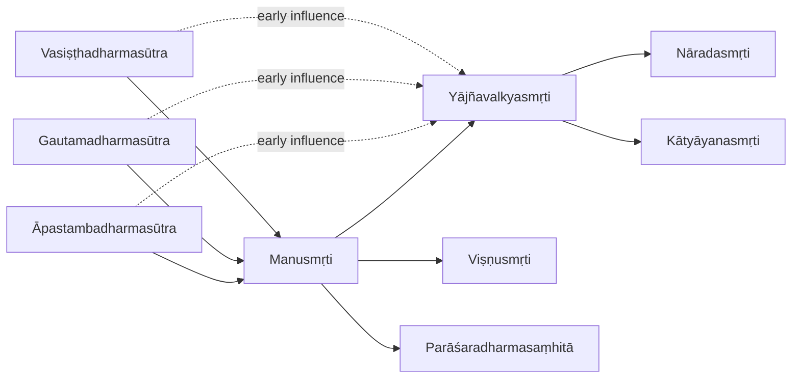

**Diagram sources**
- [apastambadharmasutra.md:1-46](file://apastambadharmasutra.md#L1-L46)
- [gautamadharmasutra.md:1-48](file://gautamadharmasutra.md#L1-L48)
- [vasisthadharmasutra.md:1-48](file://vasisthadharmasutra.md#L1-L48)
- [manusmrti.md:1-48](file://manusmrti.md#L1-L48)
- [yajnavalkyasmrti.md:1-48](file://yajnavalkyasmrti.md#L1-L48)
- [visnusmrti.md:1-48](file://visnusmrti.md#L1-L48)
- [parasaradharmasamhita.md:1-48](file://parasaradharmasamhita.md#L1-L48)
- [naradasmrti.md:1-48](file://naradasmrti.md#L1-L48)
- [katyayanasmrti.md:1-48](file://katyayanasmrti.md#L1-L48)

**Section sources**
- [manusmrti.md:1-48](file://manusmrti.md#L1-L48)
- [apastambadharmasutra.md:1-46](file://apastambadharmasutra.md#L1-L46)
- [gautamadharmasutra.md:1-48](file://gautamadharmasutra.md#L1-L48)
- [vasisthadharmasutra.md:1-48](file://vasisthadharmasutra.md#L1-L48)
- [yajnavalkyasmrti.md:1-48](file://yajnavalkyasmrti.md#L1-L48)
- [naradasmrti.md:1-48](file://naradasmrti.md#L1-L48)
- [visnusmrti.md:1-48](file://visnusmrti.md#L1-L48)
- [parasaradharmasamhita.md:1-48](file://parasaradharmasamhita.md#L1-L48)
- [katyayanasmrti.md:1-48](file://katyayanasmrti.md#L1-L48)

## Performance Considerations
- Corpus size and parsing quality: Larger CoNLL-U datasets enable more robust statistical comparisons (e.g., lemma frequency, similarity scores).
- Terminology normalization: Accurate lemmatization is critical for tracing legal concept evolution across texts.
- Cross-text alignment: Using similarity metrics helps map conceptual continuity and divergence between Dharmasūtras and Smṛtis.
- Regional variation detection: Frequency shifts in legal terms (e.g., penalties, procedures) may reflect local adaptations or recensions.

[No sources needed since this section provides general guidance]

## Troubleshooting Guide
- Inconsistent terminology: Ensure consistent lemmatization across texts to avoid misleading similarity results.
- Missing sections: Some texts have limited CoNLL-U coverage; interpret similarity scores cautiously when data is sparse.
- Overlap with non-legal texts: Arthaśāstra’s statecraft vocabulary may inflate perceived overlap with legal texts; filter by domain-specific terms when analyzing.

[No sources needed since this section provides general guidance]

## Conclusion
The Dharmaśāstra corpus in this repository offers a rich foundation for studying the evolution of Indian legal thought. Early Dharmasūtras establish core categories; Manusmṛti consolidates them; specialized smṛtis refine judicial procedure and contracts; and Arthaśāstra integrates law with statecraft. Computational linguistics enables systematic tracking of legal concept evolution, revealing both continuity and regional variation across traditions.

[No sources needed since this section summarizes without analyzing specific files]

## Appendices

### Appendix A: Key Legal Concepts Across Texts
- Varṇa and āśrama duties: Covered extensively in early Dharmasūtras and smṛtis.
- Judicial procedure and evidence: Central to Nāradasmṛti and Kātyāyanasmṛti; aligned with Yājñavalkyasmṛti.
- Penances (prāyaścitta): Common across smṛtis; emphasized in Viṣṇusmṛti and Parāśaradharmasaṃhitā.
- Kingly responsibilities: Prominent in Manusmṛti and Arthaśāstra; includes enforcement, taxation, and diplomacy.

[No sources needed since this section provides general guidance]
