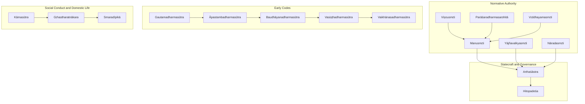
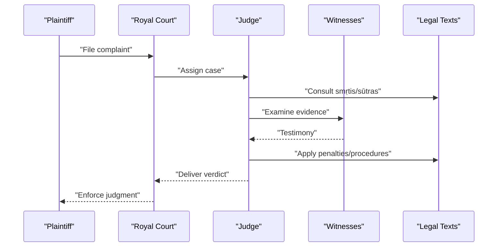
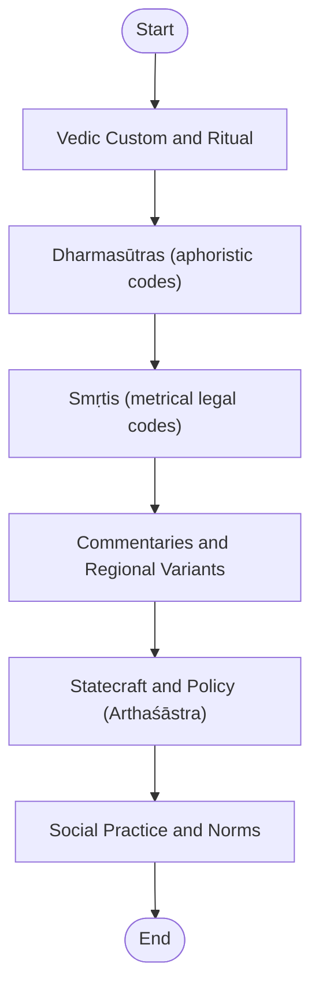
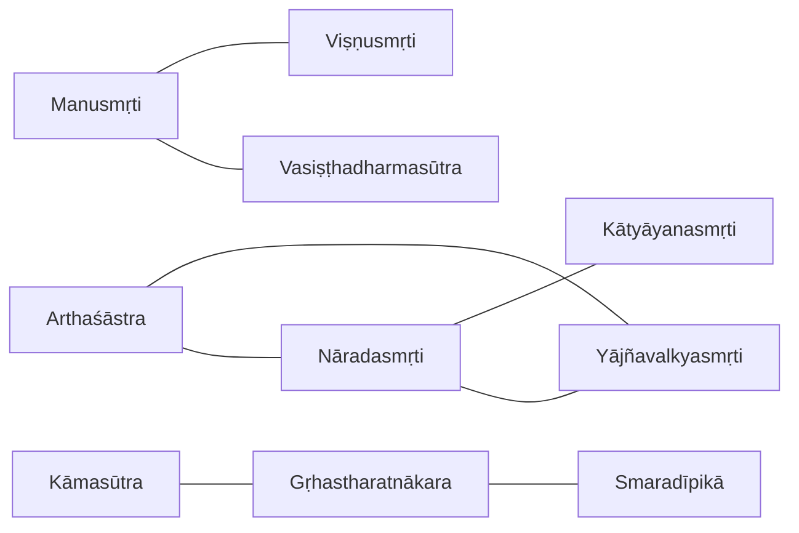

<cite>
**Referenced Files in This Document**
- [INDEX.md](file://INDEX.md)
- [manusmrti.md](file://manusmrti.md)
- [yajnavalkyasmrti.md](file://yajnavalkyasmrti.md)
- [naradasmrti.md](file://naradasmrti.md)
- [arthasastra.md](file://arthasastra.md)
- [visnusmrti.md](file://visnusmrti.md)
- [vasisthadharmasutra.md](file://vasisthadharmasutra.md)
- [parasaradharmasamhita.md](file://parasaradharmasamhita.md)
- [gautamadharmasutra.md](file://gautamadharmasutra.md)
- [apastambadharmasutra.md](file://apastambadharmasutra.md)
- [baudhayanadharmasutra.md](file://baudhayanadharmasutra.md)
- [vaikhanasadharmasutra.md](file://vaikhanasadharmasutra.md)
- [vrddhayamasmrti.md](file://vrddhayamasmrti.md)
- [kamasutra.md](file://kamasutra.md)
- [hitopadesa.md](file://hitopadesa.md)
- [grhastharatnakara.md](file://grhastharatnakara.md)
- [smaradipika.md](file://smaradipika.md)
</cite>

## Table of Contents
1. Introduction
2. Project Structure
3. Core Components
4. Architecture Overview
5. Detailed Component Analysis
6. Dependency Analysis
7. Performance Considerations
8. Troubleshooting Guide
9. Conclusion
10. Appendices

## Introduction
This document provides a comprehensive overview of legal and social texts in the Sanskrit corpus, focusing on Dharmaśāstras, Smṛtis, and related codes of social conduct. It explains how these texts encode legal frameworks, social hierarchies, ritual obligations, and ethical principles; traces the evolution of Hindu law across periods and traditions; and highlights regional variations within Vedic and post-Vedic contexts. It also outlines how computational linguistics—particularly lemma frequency analysis, similarity metrics, and concordance tools—can trace the development of legal concepts and social norms over time.

The repository organizes each text with metadata, topic tags, and computed “Related Texts” by TF-IDF cosine similarity, enabling comparative studies across legal and social domains.

**Section sources**
- [INDEX.md:1-277](file://INDEX.md#L1-L277)

## Project Structure
The repository is a curated knowledge bank of 260 topics spanning Vedic literature, Upaniṣads, Dharmaśāstra, grammar, poetics, Buddhism, Jainism, Tantra, Yoga, Āyurveda, and Purāṇas. Each file follows a consistent structure:
- Metadata header (type, title, description, knowledge-bank, sources, tags)
- Related texts ranked by lexical similarity
- Notable lemmas with occurrence counts and links to concordances
- For some entries, a short descriptive section and citations

```mermaid
graph TB
A["INDEX.md"] --> B["manusmrti.md"]
A --> C["yajnavalkyasmrti.md"]
A --> D["naradasmrti.md"]
A --> E["arthasastra.md"]
A --> F["visnusmrti.md"]
A --> G["vasisthadharmasutra.md"]
A --> H["parasaradharmasamhita.md"]
A --> I["gautamadharmasutra.md"]
A --> J["apastambadharmasutra.md"]
A --> K["baudhayanadharmasutra.md"]
A --> L["vaikhanasadharmasutra.md"]
A --> M["vrddhayamasmrti.md"]
A --> N["kamasutra.md"]
A --> O["hitopadesa.md"]
A --> P["grhastharatnakara.md"]
A --> Q["smaradipika.md"]
```

**Diagram sources**
- [INDEX.md:1-277](file://INDEX.md#L1-L277)

**Section sources**
- [INDEX.md:1-277](file://INDEX.md#L1-L277)

## Core Components
This section identifies the principal components relevant to legal and social study:

- Dharmaśāstras and Smṛtis: Manusmṛti, Yājñavalkyasmṛti, Nāradasmṛti, Viṣṇusmṛti, Parāśaradharmasaṃhitā, Vṛddhayamasmṛti
- Early Dharmasūtras: Gautamadharmasūtra, Āpastambadharmasūtra, Baudhāyanadharmasūtra, Vasiṣṭhadharmasūtra, Vaikhānasadharmasūtra
- Statecraft and Polity: Arthaśāstra
- Social Conduct and Domestic Life: Kāmasūtra, Hitopadeśa, Gṛhastharatnākara, Smaradīpikā

These components collectively cover:
- Legal frameworks: civil/criminal law, judicial procedure, evidence, contracts
- Social hierarchies: varṇa and āśrama duties, household roles
- Ritual obligations: śrauta/gṛhya rites contextually referenced in legal manuals
- Ethical principles: dharma, penance (prāyaścitta), righteousness, governance ethics

**Section sources**
- [manusmrti.md:1-48](file://manusmrti.md#L1-L48)
- [yajnavalkyasmrti.md:1-48](file://yajnavalkyasmrti.md#L1-L48)
- [naradasmrti.md:1-48](file://naradasmrti.md#L1-L48)
- [arthasastra.md:1-84](file://arthasastra.md#L1-L84)
- [visnusmrti.md:1-48](file://visnusmrti.md#L1-L48)
- [vasisthadharmasutra.md:1-48](file://vasisthadharmasutra.md#L1-L48)
- [parasaradharmasamhita.md:1-48](file://parasaradharmasamhita.md#L1-L48)
- [gautamadharmasutra.md:1-48](file://gautamadharmasutra.md#L1-L48)
- [apastambadharmasutra.md:1-46](file://apastambadharmasutra.md#L1-L46)
- [baudhayanadharmasutra.md:1-48](file://baudhayanadharmasutra.md#L1-L48)
- [vaikhanasadharmasutra.md:1-12](file://vaikhanasadharmasutra.md#L1-L12)
- [vrddhayamasmrti.md:1-30](file://vrddhayamasmrti.md#L1-L30)
- [kamasutra.md:1-48](file://kamasutra.md#L1-L48)
- [hitopadesa.md:1-48](file://hitopadesa.md#L1-L48)
- [grhastharatnakara.md:1-48](file://grhastharatnakara.md#L1-L48)
- [smaradipika.md:1-48](file://smaradipika.md#L1-L48)

## Architecture Overview
The conceptual architecture of legal and social texts can be viewed as an interrelated system where normative authority, statecraft, domestic practice, and ritual life intersect.

[No sources needed since this diagram shows conceptual relationships among categories rather than direct code mappings]

## Detailed Component Analysis

### Manusmṛti (Laws of Manu)
- Focus: Varṇa duties, law, penance, kingly governance; most influential Dharmaśāstra
- Computational insights: High similarity to Viṣṇusmṛti, Vasiṣṭhadharmasūtra, Yājñavalkyasmṛti; frequent lemmas include connective particles and pronouns reflecting prescriptive style
- Use cases: Comparative analysis of legal vocabulary across smṛtis; tracking shifts in emphasis from early sūtras to later smṛtis

**Section sources**
- [manusmrti.md:1-48](file://manusmrti.md#L1-L48)

### Yājñavalkyasmṛti (Laws of Yājñavalkya)
- Focus: Concise coverage of ācāra, vyavahāra, prāyaścitta; major smṛti tradition
- Computational insights: Strong similarity to Viṣṇusmṛti and procedural smṛtis (Kātyāyana, Nārada); frequent use of demonstratives and connectives indicates structured legal exposition
- Use cases: Tracing procedural terminology and its diffusion into later legal commentaries

**Section sources**
- [yajnavalkyasmrti.md:1-48](file://yajnavalkyasmrti.md#L1-L48)

### Nāradasmṛti (Laws of Nārada)
- Focus: Judicial procedure, evidence, contract law; comprehensive ancient Indian legal code
- Computational insights: Highest similarity to Kātyāyanasmṛti; frequent terms like rājan reflect royal adjudication focus
- Use cases: Mapping legal process vocabulary; comparing evidentiary standards across texts

**Section sources**
- [naradasmrti.md:1-48](file://naradasmrti.md#L1-L48)

### Arthaśāstra (Kauṭilya’s Science of Polity)
- Focus: Statecraft, economics, diplomacy, espionage, military strategy; foundational political science
- Computational insights: Frequent administrative and legal terms (e.g., daṇḍa, artha); overlaps with smṛtis on governance
- Use cases: Analyzing policy language; correlating state power concepts with dharma-based governance

**Section sources**
- [arthasastra.md:1-84](file://arthasastra.md#L1-L84)

### Viṣṇusmṛti (Laws of Viṣṇu)
- Focus: Vaiṣṇava perspective on varṇa duties, penances, religious observances
- Computational insights: Close similarity to Yājñavalkyasmṛti and Vasiṣṭhadharmasūtra; frequent verbs and particles indicate prescriptive directives
- Use cases: Studying sectarian influences on legal norms; comparing penance formulations

**Section sources**
- [visnusmrti.md:1-48](file://visnusmrti.md#L1-L48)

### Early Dharmasūtras (Gautama, Āpastamba, Baudhāyana, Vasiṣṭha, Vaikhānasa)
- Focus: Early legal codes prescribing duties and laws for varṇas and āśramas; sūtra-style aphorisms
- Computational insights: Similarities cluster around early legal vocabulary; Āpastambadharmasūtra emphasizes samaya/ācāra as sources of dharma
- Use cases: Tracking evolution from sūtra brevity to smṛti elaboration; identifying regional or tradition-specific legal preferences

**Section sources**
- [gautamadharmasutra.md:1-48](file://gautamadharmasutra.md#L1-L48)
- [apastambadharmasutra.md:1-46](file://apastambadharmasutra.md#L1-L46)
- [baudhayanadharmasutra.md:1-48](file://baudhayanadharmasutra.md#L1-L48)
- [vasisthadharmasutra.md:1-48](file://vasisthadharmasutra.md#L1-L48)
- [vaikhanasadharmasutra.md:1-12](file://vaikhanasadharmasutra.md#L1-L12)

### Vṛddhayamasmṛti (Ancient Yama Code)
- Focus: Legal and ethical prescriptions attributed to Yama
- Computational insights: Lexical profile suggests concise ethical directives; useful for comparative studies of moral vocabulary
- Use cases: Examining continuity of ethical themes across smṛtis

**Section sources**
- [vrddhayamasmrti.md:1-30](file://vrddhayamasmrti.md#L1-L30)

### Social Conduct and Domestic Life (Kāmasūtra, Hitopadeśa, Gṛhastharatnākara, Smaradīpikā)
- Focus: Erotics, fables teaching worldly wisdom, household duties, arts of love
- Computational insights: Kāmasūtra shows high connectivity with narrative and practical texts; Gṛhastharatnākara emphasizes marriage and household terms
- Use cases: Understanding intersection of dharma with kāma and artha; analyzing domestic ritual and social norms

**Section sources**
- [kamasutra.md:1-48](file://kamasutra.md#L1-L48)
- [hitopadesa.md:1-48](file://hitopadesa.md#L1-L48)
- [grhastharatnakara.md:1-48](file://grhastharatnakara.md#L1-L48)
- [smaradipika.md:1-48](file://smaradipika.md#L1-L48)

#### Sequence Diagram: Judicial Procedure Flow (Conceptual)

[No sources needed since this diagram shows conceptual workflow, not actual code structure]

#### Flowchart: Evolution of Legal Sources (Conceptual)

[No sources needed since this diagram shows conceptual workflow, not actual code structure]

## Dependency Analysis
Lexical similarity reveals thematic and functional dependencies among texts:

- Procedural and judicial texts cluster together: Nāradasmṛti ↔ Kātyāyanasmṛti ↔ Yājñavalkyasmṛti
- Normative smṛtis show cross-references: Manusmṛti ↔ Viṣṇusmṛti ↔ Vasiṣṭhadharmasūtra
- Statecraft intersects with governance-focused smṛtis: Arthaśāstra ↔ Yājñavalkyasmṛti/Nāradasmṛti
- Domestic and social conduct texts form a separate but connected cluster: Kāmasūtra ↔ Gṛhastharatnākara ↔ Smaradīpikā

**Diagram sources**
- [naradasmrti.md:1-48](file://naradasmrti.md#L1-L48)
- [yajnavalkyasmrti.md:1-48](file://yajnavalkyasmrti.md#L1-L48)
- [manusmrti.md:1-48](file://manusmrti.md#L1-L48)
- [visnusmrti.md:1-48](file://visnusmrti.md#L1-L48)
- [vasisthadharmasutra.md:1-48](file://vasisthadharmasutra.md#L1-L48)
- [arthasastra.md:1-84](file://arthasastra.md#L1-L84)
- [kamasutra.md:1-48](file://kamasutra.md#L1-L48)
- [grhastharatnakara.md:1-48](file://grhastharatnakara.md#L1-L48)
- [smaradipika.md:1-48](file://smaradipika.md#L1-L48)

**Section sources**
- [naradasmrti.md:1-48](file://naradasmrti.md#L1-L48)
- [yajnavalkyasmrti.md:1-48](file://yajnavalkyasmrti.md#L1-L48)
- [manusmrti.md:1-48](file://manusmrti.md#L1-L48)
- [visnusmrti.md:1-48](file://visnusmrti.md#L1-L48)
- [vasisthadharmasutra.md:1-48](file://vasisthadharmasutra.md#L1-L48)
- [arthasastra.md:1-84](file://arthasastra.md#L1-L84)
- [kamasutra.md:1-48](file://kamasutra.md#L1-L48)
- [grhastharatnakara.md:1-48](file://grhastharatnakara.md#L1-L48)
- [smaradipika.md:1-48](file://smaradipika.md#L1-L48)

## Performance Considerations
- Lemma frequency lists enable quick identification of domain-specific vocabulary (e.g., daṇḍa in Arthaśāstra, vivāha in domestic manuals)
- TF-IDF similarity helps group texts by functional focus (judicial vs. normative vs. domestic)
- Concordance links support targeted searches for legal terms across corpora
- CoNLL-U editions provide morphological granularity for advanced linguistic analysis

[No sources needed since this section provides general guidance]

## Troubleshooting Guide
When working with these texts:
- Verify tag consistency: ensure dharmasastra, smrti, srautasutra, etc., are correctly applied
- Cross-check related texts rankings: high similarity does not imply direct citation; it reflects lexical overlap
- Use concordances to confirm term usage in context before drawing conclusions about legal concepts
- Be mindful of tradition-specific variants (e.g., Vaiṣṇava vs. Śaiva influences) when interpreting legal prescriptions

**Section sources**
- [INDEX.md:1-277](file://INDEX.md#L1-L277)

## Conclusion
The repository offers a robust foundation for studying the evolution of Hindu law and social norms through Dharmaśāstras, Smṛtis, and related codes. Computational linguistics enhances traditional philology by revealing patterns of legal vocabulary, thematic clustering, and textual influence. By combining lemma analysis, similarity metrics, and concordance tools, researchers can trace how legal concepts and social practices developed across periods and regions, and how religious doctrine intersected with everyday life.

[No sources needed since this section summarizes without analyzing specific files]

## Appendices

### Appendix A: Key Themes Across Texts
- Legal frameworks: civil/criminal law, judicial procedure, evidence, contracts
- Social hierarchies: varṇa and āśrama duties, household roles
- Ritual obligations: śrauta/gṛhya rites contextually referenced in legal manuals
- Ethical principles: dharma, penance, governance ethics

[No sources needed since this section aggregates previously analyzed content]

### Appendix B: Computational Linguistics Toolkit
- Lemma frequency tables for domain vocabulary
- TF-IDF cosine similarity for thematic grouping
- Concordance links for contextual verification
- CoNLL-U parsed editions for morphological analysis

[No sources needed since this section provides general guidance]
