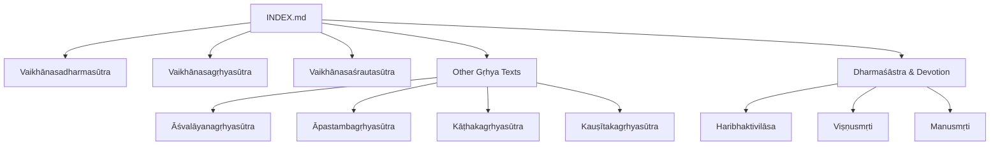
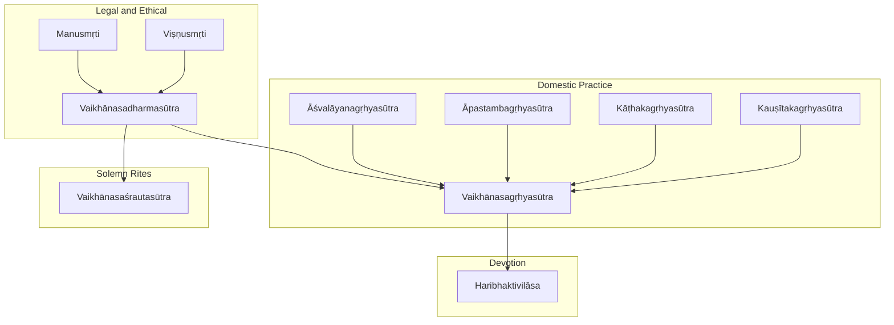
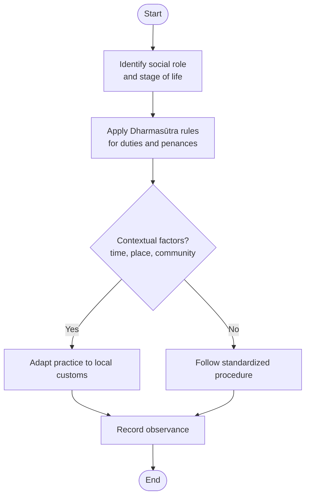
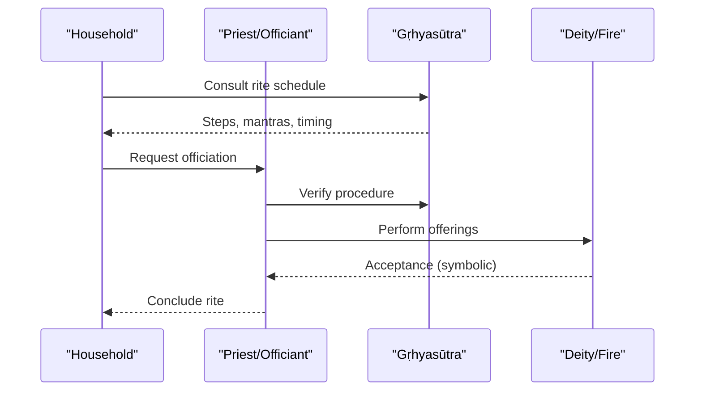
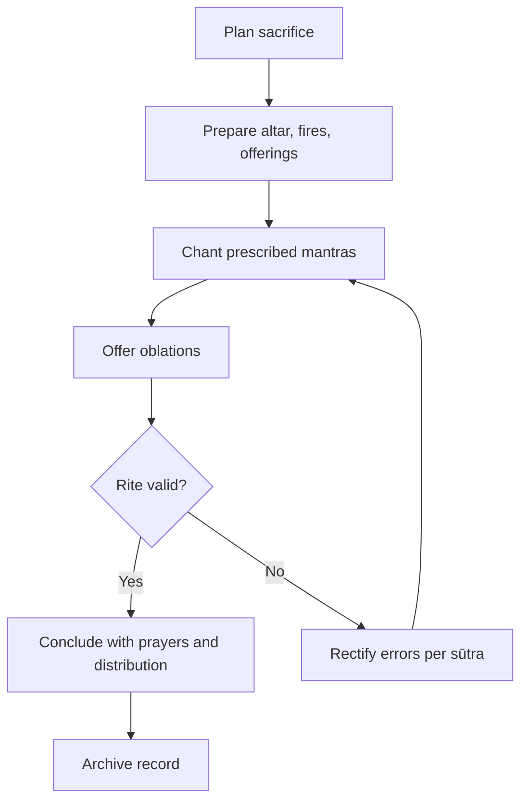
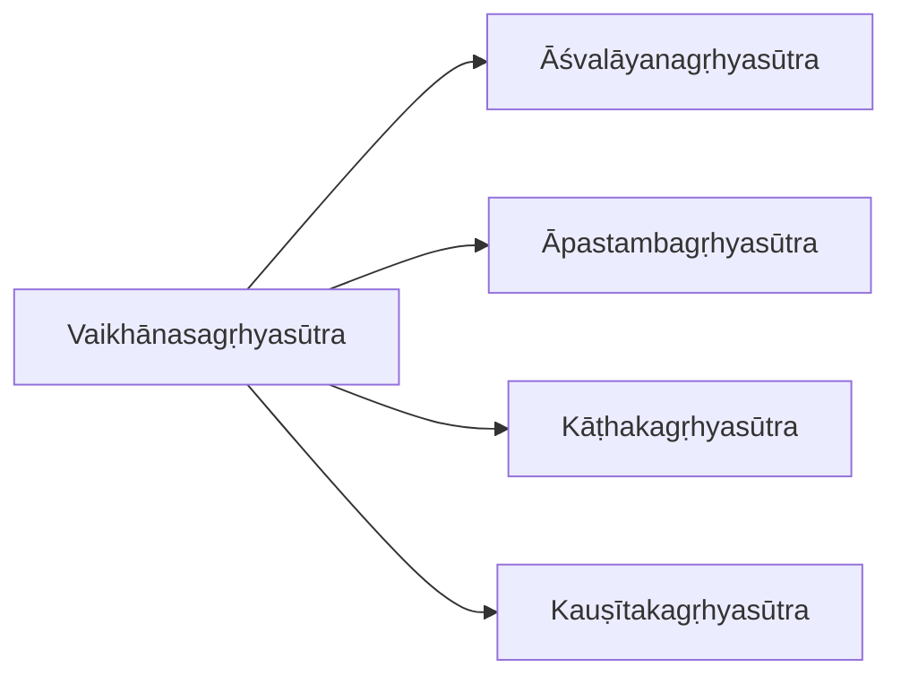
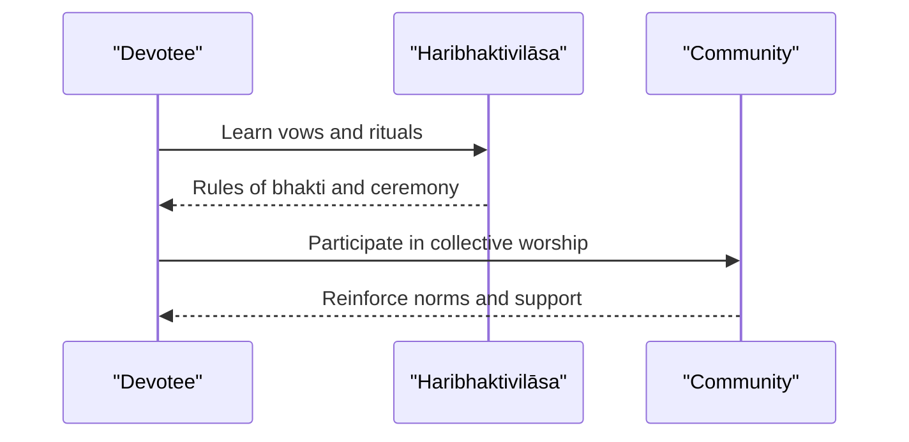
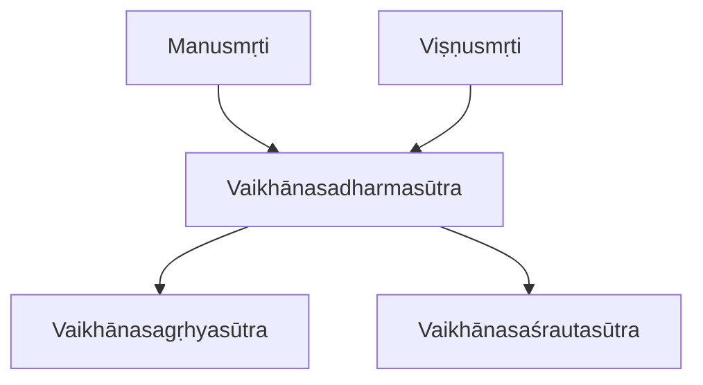
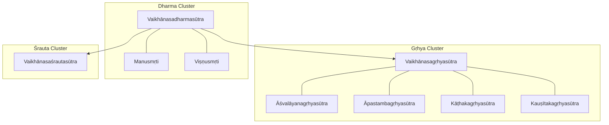

<cite>
**Referenced Files in This Document**
- [INDEX.md](file://INDEX.md)
- [vaikhanasadharmasutra.md](file://vaikhanasadharmasutra.md)
- [vaikhanasagrhyasutra.md](file://vaikhanasagrhyasutra.md)
- [vaikhanasasrautasutra.md](file://vaikhanasasrautasutra.md)
- [haribhaktivilasa.md](file://haribhaktivilasa.md)
- [visnusmrti.md](file://visnusmrti.md)
- [manusmrti.md](file://manusmrti.md)
- [asvalayanagrhyasutra.md](file://asvalayanagrhyasutra.md)
- [apastambagrhyasutra.md](file://apastambagrhyasutra.md)
- [kathakagrhyasutra.md](file://kathakagrhyasutra.md)
- [kausitakagrhyasutra.md](file://kausitakagrhyasutra.md)
- [grhastharatnakara.md](file://grhastharatnakara.md)
</cite>

## Table of Contents
1. Introduction
2. Project Structure
3. Core Components
4. Architecture Overview
5. Detailed Component Analysis
6. Dependency Analysis
7. Performance Considerations
8. Troubleshooting Guide
9. Conclusion
10. Appendices

## Introduction
This document provides a comprehensive guide to ritual manuals with a focus on practical instructions for religious ceremonies and daily worship practices. It centers on the Vaiḫānasa tradition’s three pillars: the Dharmasūtra (legal and duty framework), the Gṛhyasūtra (domestic rites), and the Śrautasūtra (solemn Vedic sacrifices). It also situates these texts within broader Dharmaśāstra literature and devotional manuals, explaining how ritual performance intersects with social organization, caste duties, and community life. Finally, it outlines how computational linguistics can be used to track standardization across regions and periods by analyzing lemma usage patterns and textual similarity.

## Project Structure
The repository organizes ritual-related materials under a Sanskrit knowledge bank with indexed entries for each text. The Vaiḫānasa corpus is represented by three core files that describe the legal code, domestic rituals, and solemn sacrifices. Additional gṛhya and dharmic texts provide comparative context for household rites and social duties.

**Diagram sources**
- [INDEX.md:1-277](file://INDEX.md#L1-L277)
- [vaikhanasadharmasutra.md:1-12](file://vaikhanasadharmasutra.md#L1-L12)
- [vaikhanasagrhyasutra.md:1-48](file://vaikhanasagrhyasutra.md#L1-L48)
- [vaikhanasasrautasutra.md:1-48](file://vaikhanasasrautasutra.md#L1-L48)

**Section sources**
- [INDEX.md:1-277](file://INDEX.md#L1-L277)

## Core Components
- Vaiḫānasa Dharmasūtra: A Vaiṣṇava legal code from the Kṛṣṇa Yajurveda tradition covering duties, penances, and domestic rites.
- Vaiḫānasa Gṛhyasūtra: A domestic ritual manual prescribing household rites and Vaiṣṇava domestic ceremonies.
- Vaiḫānasa Śrautasūtra: A solemn ritual manual detailing Vedic sacrifices from a Vaiṣṇava perspective.
- Comparative texts: Other gṛhya manuals and Dharmaśāstra/Devotional works that illuminate shared ritual vocabulary and social norms.

These components form a coherent triad: law and duty (Dharmasūtra), everyday practice (Gṛhyasūtra), and public or temple-centered sacrifice (Śrautasūtra).

**Section sources**
- [vaikhanasadharmasutra.md:1-12](file://vaikhanasadharmasutra.md#L1-L12)
- [vaikhanasagrhyasutra.md:1-48](file://vaikhanasagrhyasutra.md#L1-L48)
- [vaikhanasasrautasutra.md:1-48](file://vaikhanasasrautasutra.md#L1-L48)

## Architecture Overview
Ritual manuals operate as layered systems of instruction:
- Legal and ethical foundation (Dharmasūtra) sets duties and boundaries.
- Domestic practice (Gṛhyasūtra) translates duties into daily routines and life-cycle events.
- Solemn rites (Śrautasūtra) codify communal and temple-centered sacrifices.
- Devotional manuals (e.g., Haribhaktivilāsa) integrate bhakti frameworks into ritual life.

**Diagram sources**
- [vaikhanasadharmasutra.md:1-12](file://vaikhanasadharmasutra.md#L1-L12)
- [vaikhanasagrhyasutra.md:1-48](file://vaikhanasagrhyasutra.md#L1-L48)
- [vaikhanasasrautasutra.md:1-48](file://vaikhanasasrautasutra.md#L1-L48)
- [manusmrti.md:1-48](file://manusmrti.md#L1-L48)
- [visnusmrti.md:1-48](file://visnusmrti.md#L1-L48)
- [asvalayanagrhyasutra.md:1-32](file://asvalayanagrhyasutra.md#L1-L32)
- [apastambagrhyasutra.md:1-36](file://apastambagrhyasutra.md#L1-L36)
- [kathakagrhyasutra.md:1-30](file://kathakagrhyasutra.md#L1-L30)
- [kausitakagrhyasutra.md:1-30](file://kausitakagrhyasutra.md#L1-L30)
- [haribhaktivilasa.md:1-48](file://haribhaktivilasa.md#L1-L48)

## Detailed Component Analysis

### Vaiḫānasa Dharmasūtra: Duties, Penances, Domestic Rites
- Purpose: Establishes the legal and ethical framework for Vaiṣṇava practitioners, including varṇa duties, penances, and foundational domestic obligations.
- Social intersection: Aligns personal conduct with community expectations, reinforcing caste-based roles and responsibilities.
- Computational lens: Lemma frequency and cross-text similarity can reveal how duty terminology stabilizes across recensions and commentaries.

**Diagram sources**
- [vaikhanasadharmasutra.md:1-12](file://vaikhanasadharmasutra.md#L1-L12)
- [manusmrti.md:1-48](file://manusmrti.md#L1-L48)
- [visnusmrti.md:1-48](file://visnusmrti.md#L1-L48)

**Section sources**
- [vaikhanasadharmasutra.md:1-12](file://vaikhanasadharmasutra.md#L1-L12)
- [manusmrti.md:1-48](file://manusmrti.md#L1-L48)
- [visnusmrti.md:1-48](file://visnusmrti.md#L1-L48)

### Vaiḫānasa Gṛhyasūtra: Domestic Ceremonies and Daily Worship
- Scope: Prescribes household rites such as fire offerings, marriage, birth, and ancestor rites; integrates Vaiṣṇava devotion into daily life.
- Community integration: Coordinates family participation, priestly assistance, and neighborhood involvement in key life-cycle events.
- Computational lens: High-frequency lemmas like “agni” (fire) and verbs of offering reflect ritual centrality; similarity to other gṛhya texts shows regional convergence.

**Diagram sources**
- [vaikhanasagrhyasutra.md:1-48](file://vaikhanasagrhyasutra.md#L1-L48)
- [asvalayanagrhyasutra.md:1-32](file://asvalayanagrhyasutra.md#L1-L32)
- [apastambagrhyasutra.md:1-36](file://apastambagrhyasutra.md#L1-L36)

**Section sources**
- [vaikhanasagrhyasutra.md:1-48](file://vaikhanasagrhyasutra.md#L1-L48)
- [asvalayanagrhyasutra.md:1-32](file://asvalayanagrhyasutra.md#L1-L32)
- [apastambagrhyasutra.md:1-36](file://apastambagrhyasutra.md#L1-L36)

### Vaiḫānasa Śrautasūtra: Solemn Sacrifices and Temple Rituals
- Scope: Codifies major Vedic sacrifices and their application in temple contexts from a Vaiṣṇava viewpoint.
- Social dimension: Organizes large-scale community participation, resource allocation, and coordination among specialists.
- Computational lens: Lemma patterns emphasize sacrificial vocabulary (“yaj,” “ahu,” “āhavanīya”), indicating formalized ritual language.

**Diagram sources**
- [vaikhanasasrautasutra.md:1-48](file://vaikhanasasrautasutra.md#L1-L48)

**Section sources**
- [vaikhanasasrautasutra.md:1-48](file://vaikhanasasrautasutra.md#L1-L48)

### Comparative Gṛhya Texts: Regional Variants and Shared Practices
- Āśvalāyanagṛhyasūtra: Emphasizes pākayajñas and links between śrauta and gṛhya domains.
- Āpastambagṛhyasūtra: Grounds domestic ritual in customary practice and auspicious timing.
- Kāṭhakagṛhyasūtra and Kauṣītakagṛhyasūtra: Provide additional regional variants with overlapping ceremonial vocabularies.

**Diagram sources**
- [vaikhanasagrhyasutra.md:1-48](file://vaikhanasagrhyasutra.md#L1-L48)
- [asvalayanagrhyasutra.md:1-32](file://asvalayanagrhyasutra.md#L1-L32)
- [apastambagrhyasutra.md:1-36](file://apastambagrhyasutra.md#L1-L36)
- [kathakagrhyasutra.md:1-30](file://kathakagrhyasutra.md#L1-L30)
- [kausitakagrhyasutra.md:1-30](file://kausitakagrhyasutra.md#L1-L30)

**Section sources**
- [asvalayanagrhyasutra.md:1-32](file://asvalayanagrhyasutra.md#L1-L32)
- [apastambagrhyasutra.md:1-36](file://apastambagrhyasutra.md#L1-L36)
- [kathakagrhyasutra.md:1-30](file://kathakagrhyasutra.md#L1-L30)
- [kausitakagrhyasutra.md:1-30](file://kausitakagrhyasutra.md#L1-L30)

### Devotional Integration: Haribhaktivilāsa and Bhakti Frameworks
- Role: Integrates bhakti principles into ritual practice, aligning emotional devotion with procedural correctness.
- Social impact: Encourages inclusive participation and standardizes devotional etiquette across communities.

**Diagram sources**
- [haribhaktivilasa.md:1-48](file://haribhaktivilasa.md#L1-L48)

**Section sources**
- [haribhaktivilasa.md:1-48](file://haribhaktivilasa.md#L1-L48)

### Dharmaśāstra Context: Manusmṛti and Viṣṇusmṛti
- Function: Provide broader legal and social frameworks that inform ritual eligibility, purity, and community governance.
- Intersection: Shape who may perform which rites, when, and under what conditions, influencing both domestic and temple practices.

**Diagram sources**
- [manusmrti.md:1-48](file://manusmrti.md#L1-L48)
- [visnusmrti.md:1-48](file://visnusmrti.md#L1-L48)
- [vaikhanasadharmasutra.md:1-12](file://vaikhanasadharmasutra.md#L1-L12)
- [vaikhanasagrhyasutra.md:1-48](file://vaikhanasagrhyasutra.md#L1-L48)
- [vaikhanasasrautasutra.md:1-48](file://vaikhanasasrautasutra.md#L1-L48)

**Section sources**
- [manusmrti.md:1-48](file://manusmrti.md#L1-L48)
- [visnusmrti.md:1-48](file://visnusmrti.md#L1-L48)

## Dependency Analysis
Textual dependencies emerge through shared vocabulary, similar lemma distributions, and thematic overlap:
- Gṛhya texts cluster around domestic ritual vocabulary and life-cycle events.
- Dharmasūtra texts share legal and duty terminology.
- Śrautasūtra exhibits specialized sacrificial lexicon.

**Diagram sources**
- [vaikhanasagrhyasutra.md:1-48](file://vaikhanasagrhyasutra.md#L1-L48)
- [asvalayanagrhyasutra.md:1-32](file://asvalayanagrhyasutra.md#L1-L32)
- [apastambagrhyasutra.md:1-36](file://apastambagrhyasutra.md#L1-L36)
- [kathakagrhyasutra.md:1-30](file://kathakagrhyasutra.md#L1-L30)
- [kausitakagrhyasutra.md:1-30](file://kausitakagrhyasutra.md#L1-L30)
- [vaikhanasadharmasutra.md:1-12](file://vaikhanasadharmasutra.md#L1-L12)
- [manusmrti.md:1-48](file://manusmrti.md#L1-L48)
- [visnusmrti.md:1-48](file://visnusmrti.md#L1-L48)
- [vaikhanasasrautasutra.md:1-48](file://vaikhanasasrautasutra.md#L1-L48)

**Section sources**
- [vaikhanasagrhyasutra.md:1-48](file://vaikhanasagrhyasutra.md#L1-L48)
- [vaikhanasasrautasutra.md:1-48](file://vaikhanasasrautasutra.md#L1-L48)
- [vaikhanasadharmasutra.md:1-12](file://vaikhanasadharmasutra.md#L1-L12)
- [manusmrti.md:1-48](file://manusmrti.md#L1-L48)
- [visnusmrti.md:1-48](file://visnusmrti.md#L1-L48)

## Performance Considerations
- Lexical stability: Frequent ritual lemmas indicate stable core procedures; deviations may signal regional innovation or corruption.
- Cross-text similarity: TF-IDF cosine similarity helps identify shared ritual vocabularies and potential standardization trends.
- Temporal tracking: Comparing lemma frequencies across dated manuscripts can reveal shifts in ritual emphasis over time.
- Practical tip: Use concordance indices to trace specific terms (e.g., “agni,” “yaj,” “vā”) and map their contextual usage across texts.

[No sources needed since this section provides general guidance]

## Troubleshooting Guide
Common issues and resolutions when working with ritual manuals:
- Ambiguity in procedure: Consult multiple gṛhya texts to triangulate steps; prioritize texts aligned with your tradition.
- Timing and auspiciousness: Refer to opening statements about auspicious days and seasonal constraints.
- Purity and eligibility: Check Dharmaśāstra provisions for who may perform specific rites and under what conditions.
- Devotional alignment: Integrate bhakti guidelines to ensure emotional and procedural coherence.

**Section sources**
- [apastambagrhyasutra.md:1-36](file://apastambagrhyasutra.md#L1-L36)
- [asvalayanagrhyasutra.md:1-32](file://asvalayanagrhyasutra.md#L1-L32)
- [grhastharatnakara.md:1-48](file://grhastharatnakara.md#L1-L48)

## Conclusion
The Vaiḫānasa ritual corpus offers a structured pathway from legal duties to domestic practice and solemn sacrifice, enriched by devotional frameworks. Computational linguistics enables systematic tracking of ritual standardization across regions and periods by analyzing lemma usage and textual similarity. Together, these approaches clarify how ritual language reflects broader social and theological developments while providing practical guidance for contemporary practitioners.

[No sources needed since this section summarizes without analyzing specific files]

## Appendices

### Appendix A: Key Ritual Vocabulary and Their Roles
- Agni (fire): Central to domestic and solemn rites; indicates continuity of sacred presence.
- Yaj (to sacrifice): Marks formal offerings and communal rituals.
- Vā (or): Signals alternative procedures reflecting regional flexibility.
- Āhavanīya (sacred fire): Specific to solemn sacrifices and temple contexts.

**Section sources**
- [vaikhanasagrhyasutra.md:31-48](file://vaikhanasagrhyasutra.md#L31-L48)
- [vaikhanasasrautasutra.md:31-48](file://vaikhanasasrautasutra.md#L31-L48)

### Appendix B: Using Concordance Indices for Ritual Research
- Locate high-frequency lemmas to identify core ritual concepts.
- Trace variant forms and regional preferences via concordance links.
- Compare across texts to detect standardization or divergence.

**Section sources**
- [vaikhanasagrhyasutra.md:31-48](file://vaikhanasagrhyasutra.md#L31-L48)
- [vaikhanasasrautasutra.md:31-48](file://vaikhanasasrautasutra.md#L31-L48)
