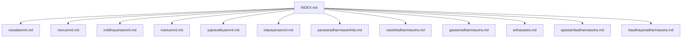
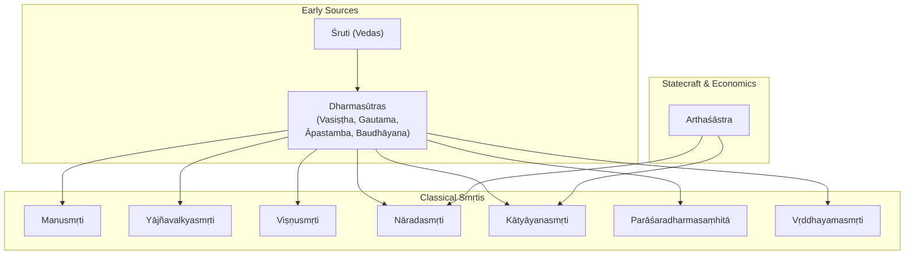
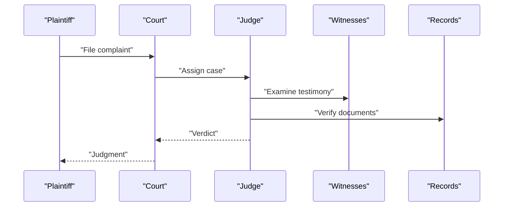
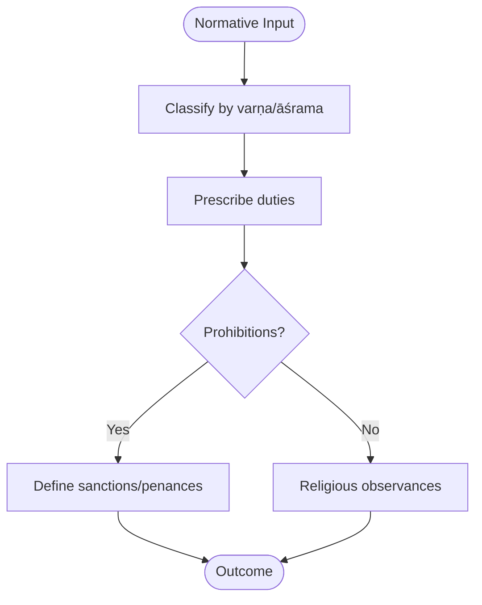
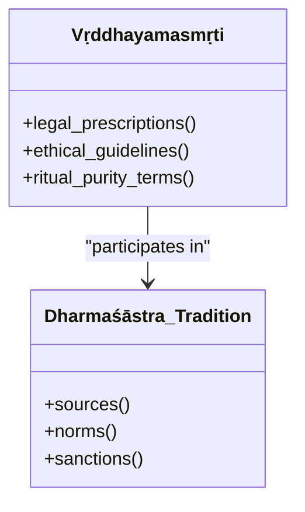
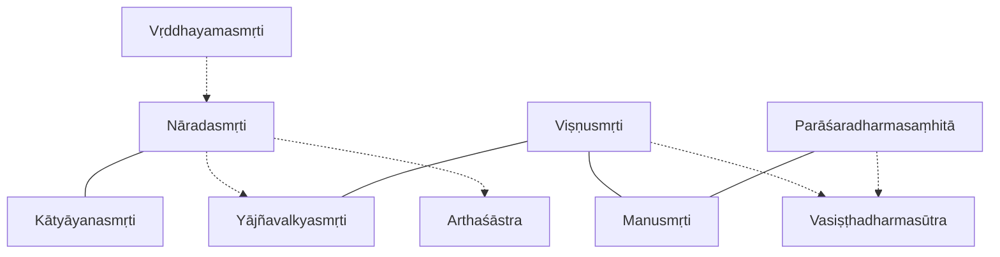

<cite>
**Referenced Files in This Document**
- [naradasmrti.md](file://naradasmrti.md)
- [visnusmrti.md](file://visnusmrti.md)
- [vrddhayamasmrti.md](file://vrddhayamasmrti.md)
- [manusmrti.md](file://manusmrti.md)
- [yajnavalkyasmrti.md](file://yajnavalkyasmrti.md)
- [katyayanasmrti.md](file://katyayanasmrti.md)
- [parasaradharmasamhita.md](file://parasaradharmasamhita.md)
- [vasisthadharmasutra.md](file://vasisthadharmasutra.md)
- [gautamadharmasutra.md](file://gautamadharmasutra.md)
- [arthasastra.md](file://arthasastra.md)
- [apastambadharmasutra.md](file://apastambadharmasutra.md)
- [baudhayanadharmasutra.md](file://baudhayanadharmasutra.md)
- [INDEX.md](file://INDEX.md)
</cite>

## Table of Contents
1. [Introduction](#introduction)
2. [Project Structure](#project-structure)
3. [Core Components](#core-components)
4. [Architecture Overview](#architecture-overview)
5. [Detailed Component Analysis](#detailed-component-analysis)
6. [Dependency Analysis](#dependency-analysis)
7. [Performance Considerations](#performance-considerations)
8. [Troubleshooting Guide](#troubleshooting-guide)
9. [Conclusion](#conclusion)
10. [Appendices](#appendices)

## Introduction
This document provides a comprehensive overview of selected Smṛti texts—Nāradasmṛti, Viṣṇusmṛti, and Vṛddhayamasmṛti—as key legal treatises that bridge early Dharmaśāstras (Dharmasūtras) and later medieval commentarial traditions. It explains the distinctive features of Smṛti literature, its relationship to Śruti, and its role in shaping Hindu jurisprudence. It also analyzes how these texts address social issues, commercial transactions, marriage laws, property rights, and dispute resolution mechanisms, using computational linguistic patterns from CoNLL-U editions to trace the development of legal terminology and conceptual frameworks.

## Project Structure
The repository organizes each text as a concept file with metadata, related-text similarity lists, and lemma frequency tables derived from CoNLL-U parsed editions. The INDEX aggregates all topics and links to individual files, enabling cross-referencing across Dharmaśāstra, Dharmasūtra, Arthaśāstra, and related corpora.

**Diagram sources**
- [INDEX.md:1-277](file://INDEX.md#L1-L277)

**Section sources**
- [INDEX.md:1-277](file://INDEX.md#L1-L277)

## Core Components
- Nāradasmṛti: A comprehensive ancient Indian legal code focused on judicial procedure, evidence, and contract law; it exhibits strong lexical overlap with other procedural smṛtis and Arthaśāstra.
- Viṣṇusmṛti: A Vaiṣṇava-oriented Dharmaśāstra covering varṇa duties, penances, and religious observances; shows high similarity to Yājñavalkyasmṛti and Manusmṛti.
- Vṛddhayamasmṛti: An “Ancient Yama Code” preserving legal and ethical prescriptions; smaller corpus but representative of early smṛti vocabulary.
- Contextual anchors: Manusmṛti, Yājñavalkyasmṛti, Kātyāyanasmṛti, Parāśaradharmasaṃhitā, and the Dharmasūtras (Vasiṣṭha, Gautama, Āpastamba, Baudhāyana) provide comparative baselines for terminology and structure.
- Arthaśāstra: Offers statecraft and economic policy context relevant to commercial law and dispute resolution.

**Section sources**
- [naradasmrti.md:1-48](file://naradasmrti.md#L1-L48)
- [visnusmrti.md:1-48](file://visnusmrti.md#L1-L48)
- [vrddhayamasmrti.md:1-30](file://vrddhayamasmrti.md#L1-L30)
- [manusmrti.md:1-48](file://manusmrti.md#L1-L48)
- [yajnavalkyasmrti.md:1-48](file://yajnavalkyasmrti.md#L1-L48)
- [katyayanasmrti.md:1-48](file://katyayanasmrti.md#L1-L48)
- [parasaradharmasamhita.md:1-48](file://parasaradharmasamhita.md#L1-L48)
- [vasisthadharmasutra.md:1-48](file://vasisthadharmasutra.md#L1-L48)
- [gautamadharmasutra.md:1-48](file://gautamadharmasutra.md#L1-L48)
- [arthasastra.md:1-84](file://arthasastra.md#L1-L84)

## Architecture Overview
Smṛti texts form a layered tradition:
- Early Dharmasūtras: Aphoristic codes grounded in custom and Vedic authority.
- Classical Smṛtis: Metrical compendia systematizing dharma, vyavahāra (law), and prāyaścitta (penance).
- Later Commentaries: Medieval exegesis interpreting and adapting rules to evolving socio-economic contexts.

**Diagram sources**
- [vasisthadharmasutra.md:1-48](file://vasisthadharmasutra.md#L1-L48)
- [gautamadharmasutra.md:1-48](file://gautamadharmasutra.md#L1-L48)
- [apastambadharmasutra.md:1-46](file://apastambadharmasutra.md#L1-L46)
- [baudhayanadharmasutra.md:1-48](file://baudhayanadharmasutra.md#L1-L48)
- [manusmrti.md:1-48](file://manusmrti.md#L1-L48)
- [yajnavalkyasmrti.md:1-48](file://yajnavalkyasmrti.md#L1-L48)
- [visnusmrti.md:1-48](file://visnusmrti.md#L1-L48)
- [naradasmrti.md:1-48](file://naradasmrti.md#L1-L48)
- [katyayanasmrti.md:1-48](file://katyayanasmrti.md#L1-L48)
- [parasaradharmasamhita.md:1-48](file://parasaradharmasamhita.md#L1-L48)
- [vrddhayamasmrti.md:1-30](file://vrddhayamasmrti.md#L1-L30)
- [arthasastra.md:1-84](file://arthasastra.md#L1-L84)

## Detailed Component Analysis

### Nāradasmṛti: Judicial Procedure, Evidence, and Contracts
- Focus: Comprehensive legal code emphasizing court procedures, evidentiary standards, and contract law.
- Lexical profile: High-frequency function words and legal verbs reflect procedural discourse; notable presence of terms addressing rulers and actions.
- Relatedness: Strongest similarity to Kātyāyanasmṛti and Yājñavalkyasmṛti; moderate similarity to Viṣṇusmṛti and Arthaśāstra, indicating shared legal vocabulary across procedural domains.

[No sources needed since this diagram shows conceptual workflow, not actual code structure]

**Section sources**
- [naradasmrti.md:1-48](file://naradasmrti.md#L1-L48)
- [katyayanasmrti.md:1-48](file://katyayanasmrti.md#L1-L48)
- [yajnavalkyasmrti.md:1-48](file://yajnavalkyasmrti.md#L1-L48)
- [arthasastra.md:1-84](file://arthasastra.md#L1-L84)

### Viṣṇusmṛti: Varṇa Duties, Penances, and Religious Observances
- Focus: Dharmaśāstra with a Vaiṣṇava perspective; covers varṇa duties, penances, and religious practices.
- Lexical profile: Frequent connectors and negations indicate prescriptive and prohibitive formulations; action verbs dominate.
- Relatedness: Highest similarity to Yājñavalkyasmṛti; also close to Manusmṛti and Vasiṣṭhadharmasūtra, reflecting shared normative content.

[No sources needed since this diagram shows conceptual workflow, not actual code structure]

**Section sources**
- [visnusmrti.md:1-48](file://visnusmrti.md#L1-L48)
- [yajnavalkyasmrti.md:1-48](file://yajnavalkyasmrti.md#L1-L48)
- [manusmrti.md:1-48](file://manusmrti.md#L1-L48)
- [vasisthadharmasutra.md:1-48](file://vasisthadharmasutra.md#L1-L48)

### Vṛddhayamasmṛti: Legal and Ethical Prescriptions
- Focus: Compact corpus preserving legal and ethical directives attributed to Yama.
- Lexical profile: Limited size yields a small set of frequent lemmas; includes ritual purity terms alongside action verbs.
- Role: Illustrates early smṛti vocabulary and thematic concerns that later texts expand upon.

[No sources needed since this diagram shows conceptual relationships, not actual code structure]

**Section sources**
- [vrddhayamasmrti.md:1-30](file://vrddhayamasmrti.md#L1-L30)

### Comparative Context: Manusmṛti, Yājñavalkyasmṛti, Kātyāyanasmṛti, Parāśaradharmasaṃhitā
- Manusmṛti: Foundational and highly influential; broad coverage of varṇa duties, law, penance, and kingship.
- Yājñavalkyasmṛti: Concise treatment of conduct, law, and penance; strong lexical overlap with Viṣṇusmṛti and Kātyāyanasmṛti.
- Kātyāyanasmṛti: Procedural supplement to earlier Dharmasūtras; highest similarity to Nāradasmṛti.
- Parāśaradharmasaṃhitā: Emphasizes Kali Yuga norms; overlaps with Vasiṣṭhadharmasūtra and Manusmṛti.

**Diagram sources**
- [manusmrti.md:1-48](file://manusmrti.md#L1-L48)
- [yajnavalkyasmrti.md:1-48](file://yajnavalkyasmrti.md#L1-L48)
- [katyayanasmrti.md:1-48](file://katyayanasmrti.md#L1-L48)
- [naradasmrti.md:1-48](file://naradasmrti.md#L1-L48)
- [visnusmrti.md:1-48](file://visnusmrti.md#L1-L48)
- [parasaradharmasamhita.md:1-48](file://parasaradharmasamhita.md#L1-L48)

**Section sources**
- [manusmrti.md:1-48](file://manusmrti.md#L1-L48)
- [yajnavalkyasmrti.md:1-48](file://yajnavalkyasmrti.md#L1-L48)
- [katyayanasmrti.md:1-48](file://katyayanasmrti.md#L1-L48)
- [naradasmrti.md:1-48](file://naradasmrti.md#L1-L48)
- [visnusmrti.md:1-48](file://visnusmrti.md#L1-L48)
- [parasaradharmasamhita.md:1-48](file://parasaradharmasamhita.md#L1-L48)

## Dependency Analysis
Computational similarity among texts reveals dependency-like relationships:
- Procedural cluster: Nāradasmṛti ↔ Kātyāyanasmṛti ↔ Yājñavalkyasmṛti, with ties to Arthaśāstra for statecraft/economic law.
- Normative cluster: Viṣṇusmṛti ↔ Yājñavalkyasmṛti ↔ Manusmṛti ↔ Vasiṣṭhadharmasūtra, indicating shared doctrinal and regulatory vocabulary.
- Early anchor: Vṛddhayamasmṛti contributes foundational terms that appear in later smṛtis.

**Diagram sources**
- [naradasmrti.md:1-48](file://naradasmrti.md#L1-L48)
- [katyayanasmrti.md:1-48](file://katyayanasmrti.md#L1-L48)
- [yajnavalkyasmrti.md:1-48](file://yajnavalkyasmrti.md#L1-L48)
- [visnusmrti.md:1-48](file://visnusmrti.md#L1-L48)
- [manusmrti.md:1-48](file://manusmrti.md#L1-L48)
- [vasisthadharmasutra.md:1-48](file://vasisthadharmasutra.md#L1-L48)
- [parasaradharmasamhita.md:1-48](file://parasaradharmasamhita.md#L1-L48)
- [vrddhayamasmrti.md:1-30](file://vrddhayamasmrti.md#L1-L30)
- [arthasastra.md:1-84](file://arthasastra.md#L1-L84)

**Section sources**
- [naradasmrti.md:1-48](file://naradasmrti.md#L1-L48)
- [visnusmrti.md:1-48](file://visnusmrti.md#L1-L48)
- [vrddhayamasmrti.md:1-30](file://vrddhayamasmrti.md#L1-L30)
- [manusmrti.md:1-48](file://manusmrti.md#L1-L48)
- [yajnavalkyasmrti.md:1-48](file://yajnavalkyasmrti.md#L1-L48)
- [katyayanasmrti.md:1-48](file://katyayanasmrti.md#L1-L48)
- [parasaradharmasamhita.md:1-48](file://parasaradharmasamhita.md#L1-L48)
- [vasisthadharmasutra.md:1-48](file://vasisthadharmasutra.md#L1-L48)
- [gautamadharmasutra.md:1-48](file://gautamadharmasutra.md#L1-L48)
- [arthasastra.md:1-84](file://arthasastra.md#L1-L84)

## Performance Considerations
- Corpus size affects statistical stability: Vṛddhayamasmṛti’s single-file corpus yields limited lemma diversity compared to larger corpora like Viṣṇusmṛti or Manusmṛti.
- Lemma frequency distributions highlight functional vs. domain-specific vocabulary; procedural texts show higher verb usage, while normative texts emphasize connectors and negations.
- Cross-text similarity can guide annotation strategies and glossary construction for legal terminology extraction.

[No sources needed since this section provides general guidance]

## Troubleshooting Guide
- When analyzing Smṛti texts, ensure consistent tokenization and lemmatization across CoNLL-U files to avoid skewed similarity scores.
- For small corpora (e.g., Vṛddhayamasmṛti), aggregate results with related texts to stabilize insights.
- Use related-text similarity tables to identify contextual anchors and validate term interpretations against well-studied corpora (Manusmṛti, Yājñavalkyasmṛti).

**Section sources**
- [vrddhayamasmrti.md:1-30](file://vrddhayamasmrti.md#L1-L30)
- [naradasmrti.md:1-48](file://naradasmrti.md#L1-L48)
- [visnusmrti.md:1-48](file://visnusmrti.md#L1-L48)
- [manusmrti.md:1-48](file://manusmrti.md#L1-L48)
- [yajnavalkyasmrti.md:1-48](file://yajnavalkyasmrti.md#L1-L48)

## Conclusion
Nāradasmṛti, Viṣṇusmṛti, and Vṛddhayamasmṛti represent pivotal stages in the evolution of Hindu legal thought. They translate early Dharmasūtra principles into structured, accessible codes that influenced medieval commentaries. Computational analyses reveal cohesive clusters around procedural law and normative duties, underscoring continuity and adaptation across centuries. These texts collectively shaped jurisprudence by codifying social conduct, commercial transactions, marriage regulations, property rights, and dispute resolution mechanisms, grounding them in both customary practice and scriptural authority.

[No sources needed since this section summarizes without analyzing specific files]

## Appendices

### Appendix A: Relationship to Śruti and Evolution of Legal Thought
- Śruti (Vedas) provides foundational authority; Dharmasūtras ground dharma in custom and Vedic injunctions.
- Smṛtis systematize and adapt these principles for broader societal application, influencing later commentarial traditions.

[No sources needed since this section provides general guidance]

### Appendix B: Key Themes Across Texts
- Social hierarchy and duties: Varṇa and āśrama responsibilities.
- Commercial law: Contracts, debts, and trade regulations reflected in procedural texts and Arthaśāstra.
- Marriage and family: Normative rules embedded in smṛtis and dharmasūtras.
- Property rights: Ownership, inheritance, and restitution addressed across legal codes.
- Dispute resolution: Court procedures, evidence evaluation, and sanctions detailed in procedural smṛtis.

[No sources needed since this section provides general guidance]
