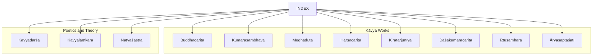
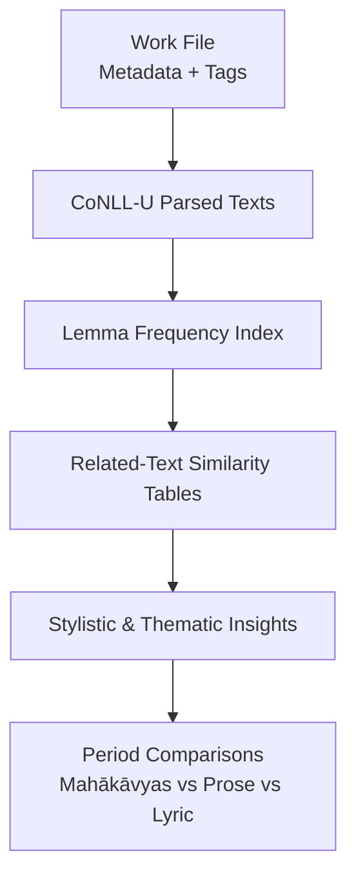
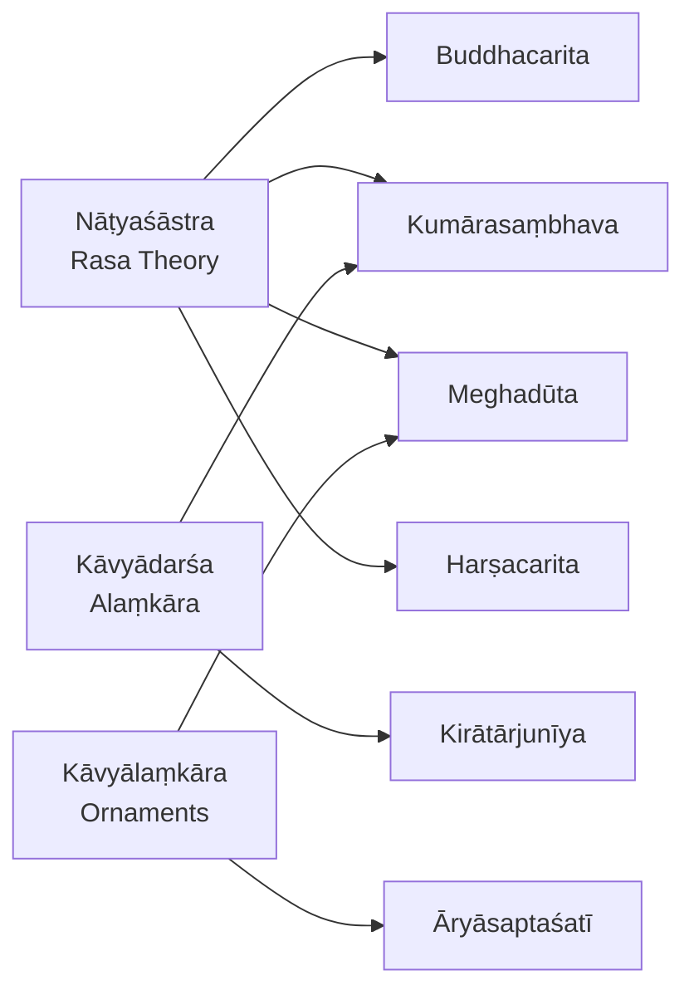

<cite>
**Referenced Files in This Document**
- [buddhacarita.md](file://buddhacarita.md)
- [kumarasambhava.md](file://kumarasambhava.md)
- [meghaduta.md](file://meghaduta.md)
- [harsacarita.md](file://harsacarita.md)
- [kavyadarsa.md](file://kavyadarsa.md)
- [kavyalankara.md](file://kavyalankara.md)
- [natyasastra.md](file://natyasastra.md)
- [aryasaptasati.md](file://aryasaptasati.md)
- [kiratarjuniya.md](file://kiratarjuniya.md)
- [dasakumaracarita.md](file://dasakumaracarita.md)
- [rtusamhara.md](file://rtusamhara.md)
- [INDEX.md](file://INDEX.md)
</cite>

## Table of Contents
1. [Introduction](#introduction)
2. [Project Structure](#project-structure)
3. [Core Components](#core-components)
4. [Architecture Overview](#architecture-overview)
5. [Detailed Component Analysis](#detailed-component-analysis)
6. [Dependency Analysis](#dependency-analysis)
7. [Performance Considerations](#performance-considerations)
8. [Troubleshooting Guide](#troubleshooting-guide)
9. [Conclusion](#conclusion)
10. [Appendices](#appendices)

## Introduction
This document provides a comprehensive guide to classical Sanskrit kāvya literature with a focus on mahākāvyas (great epics in verse), śṛṅgāra poetry, and prose narratives. It centers on key works such as Aśvaghoṣa’s Buddhacarita, Kālidāsa’s Kumārasambhava and Meghadūta, and Bāṇabhaṭṭa’s Harṣacarita. It also explains the conventions of kāvya composition—alaṃkāra (poetic embellishments), rasa theory, and meter usage—and shows how computational linguistics applied to CoNLL-U parsed editions reveals patterns in poetic style, vocabulary richness, and thematic development across periods.

## Project Structure
The repository organizes each work as a topic file with metadata, related-text similarity tables, and lemma frequency lists derived from CoNLL-U parsing. The INDEX aggregates all topics and cross-references, enabling discovery of related texts by lexical similarity and shared tags.

**Diagram sources**
- [INDEX.md:1-277](file://INDEX.md#L1-L277)

**Section sources**
- [INDEX.md:1-277](file://INDEX.md#L1-L277)

## Core Components
- Mahākāvyas: Long narrative poems in verse celebrating heroic or divine themes. Examples include Buddhacarita and Kumārasambhava.
- Dūta-kāvya: Messenger poems; Meghadūta is the archetype.
- Prose kāvya: Literary prose with poetic qualities; Harṣacarita exemplifies this genre.
- Poetics treatises: Kāvyādarśa and Kāvyālaṃkāra define alaṃkāra, genres, and stylistic norms.
- Rasa theory: Nāṭyaśāstra establishes the aesthetic framework for emotional resonance in art and literature.
- Śṛṅgāra poetry: Āryāsaptaśatī showcases erotic sentiment through a single metre.

Computational insights available in these files:
- Related-text similarity tables reveal stylistic affinities across works and periods.
- Lemma frequency lists indicate vocabulary richness and recurring motifs.
- CoNLL-U annotations enable morphological and syntactic analysis for deeper stylistic studies.

**Section sources**
- [buddhacarita.md:1-58](file://buddhacarita.md#L1-L58)
- [kumarasambhava.md:1-48](file://kumarasambhava.md#L1-L48)
- [meghaduta.md:1-48](file://meghaduta.md#L1-L48)
- [harsacarita.md:1-48](file://harsacarita.md#L1-L48)
- [kiryatarjuniya.md:1-48](file://kiratarjuniya.md#L1-L48)
- [dasakumaracarita.md:1-48](file://dasakumaracarita.md#L1-L48)
- [rtusamhara.md:1-12](file://rtusamhara.md#L1-L12)
- [aryasaptasati.md:1-51](file://aryasaptasati.md#L1-L51)
- [kavyadarsa.md:1-48](file://kavyadarsa.md#L1-L48)
- [kavyalankara.md:1-12](file://kavyalankara.md#L1-L12)
- [natyasastra.md:1-48](file://natyasastra.md#L1-L48)

## Architecture Overview
The repository’s architecture supports comparative literary analysis through structured metadata and computed similarities. Each work file includes:
- Description and period context
- Source references to raw CoNLL-U editions
- Tags for classification (e.g., mahakavya, dutakavya, alankarasastra)
- Related-text similarity rankings based on lemma usage
- Notable lemmas indicating vocabulary patterns

[No sources needed since this diagram shows conceptual workflow, not actual code structure]

## Detailed Component Analysis

### Mahākāvyas: Buddhacarita and Kumārasambhava
- Buddhacarita: A foundational mahākāvya recounting the Buddha’s life, with rich thematic vocabulary evident in frequent lemmas associated with spiritual and narrative motion.
- Kumārasambhava: A celebrated mahākāvya focusing on divine marriage and birth, showing stylistic proximity to other epic works via similarity metrics.

Computational observations:
- Both works exhibit high-frequency function words and pronouns typical of classical Sanskrit narrative.
- Related-text tables highlight intertextual affinities with other mahākāvyas and Purāṇic narratives.

**Section sources**
- [buddhacarita.md:1-58](file://buddhacarita.md#L1-L58)
- [kumarasambhava.md:1-48](file://kumarasambhava.md#L1-L48)

### Dūta-kāvya: Meghadūta
- Meghadūta: The quintessential messenger poem where a yakṣa sends a message via a cloud across India, blending landscape description with longing.
- Computational profile: Frequent first-person markers and terms of separation reflect the emotional core of the dūta tradition.

**Section sources**
- [meghaduta.md:1-48](file://meghaduta.md#L1-L48)

### Prose Kāvya: Harṣacarita
- Harṣacarita: A masterwork of Sanskrit prose biography, demonstrating sophisticated gadya style while maintaining poetic sensibility.
- Computational indicators: High use of connective particles and demonstratives aligns with extended narrative prose.

**Section sources**
- [harsacarita.md:1-48](file://harsacarita.md#L1-L48)

### Poetics Treatises: Kāvyādarśa and Kāvyālaṃkāra
- Kāvyādarśa: Daṇḍin’s systematic treatise defining poetic figures, genres, and stylistic qualities; serves as a normative reference for kāvya composition.
- Kāvyālaṃkāra: Bhāmaha’s early work cataloguing ornaments, defects, and criteria for good poetry.

These treatises provide the theoretical backbone for understanding alaṃkāra and compositional standards reflected in the literary works.

**Section sources**
- [kavyadarsa.md:1-48](file://kavyadarsa.md#L1-L48)
- [kavyalankara.md:1-12](file://kavyalankara.md#L1-L12)

### Rasa Theory: Nāṭyaśāstra
- Nāṭyaśāstra: Bharata’s foundational text establishing drama, dance, music, and rasa theory; it underpins the aesthetic experience in both verse and prose kāvya.

Rasa theory informs how poets craft emotional resonance, guiding the selection of imagery, diction, and narrative pacing.

**Section sources**
- [natyasastra.md:1-48](file://natyasastra.md#L1-L48)

### Śṛṅgāra Poetry: Āryāsaptaśatī
- Āryāsaptaśatī: A collection of 700 verses in the āryā metre depicting the full range of erotic sentiment; demonstrates mastery of metrical constraint and emotional nuance.

The work illustrates how śṛṅgāra-rasa is realized through concise, evocative language within a fixed rhythmic frame.

**Section sources**
- [aryasaptasati.md:1-51](file://aryasaptasati.md#L1-L51)

### Additional Mahākāvya: Kirātārjunīya
- Kirātārjunīya: Bhāravi’s epic portraying Arjuna’s penance and encounter with Śiva; exhibits dense ornamentation and elevated diction characteristic of classical mahākāvyas.

**Section sources**
- [kiratarjuniya.md:1-48](file://kiratarjuniya.md#L1-L48)

### Seasonal Lyric: Ṛtusaṃhāra
- Ṛtusaṃhāra: Kālidāsa’s lyrical poem describing six seasons and their effects on lovers; exemplifies descriptive lyricism and seasonal symbolism in śṛṅgāra contexts.

**Section sources**
- [rtusamhara.md:1-12](file://rtusamhara.md#L1-L12)

## Dependency Analysis
The works depend on shared conventions established by poetics treatises and rasa theory. Computational dependencies manifest as lexical similarity clusters that group texts by stylistic affinity.

**Diagram sources**
- [natyasastra.md:1-48](file://natyasastra.md#L1-L48)
- [kavyadarsa.md:1-48](file://kavyadarsa.md#L1-L48)
- [kavyalankara.md:1-12](file://kavyalankara.md#L1-L12)
- [buddhacarita.md:1-58](file://buddhacarita.md#L1-L58)
- [kumarasambhava.md:1-48](file://kumarasambhava.md#L1-L48)
- [meghaduta.md:1-48](file://meghaduta.md#L1-L48)
- [harsacarita.md:1-48](file://harsacarita.md#L1-L48)
- [kiratarjuniya.md:1-48](file://kiratarjuniya.md#L1-L48)
- [aryasaptasati.md:1-51](file://aryasaptasati.md#L1-L51)

**Section sources**
- [INDEX.md:1-277](file://INDEX.md#L1-L277)

## Performance Considerations
When analyzing classical kāvya corpora computationally:
- Use CoNLL-U annotations to normalize forms and compare lemma distributions across periods.
- Leverage related-text similarity tables to identify stylistic clusters and trace influence networks.
- Combine frequency analysis with contextual concordances to avoid misinterpreting high-frequency function words as stylistic markers.
- For meter studies, integrate prosodic rules from poetics treatises with syllabic and mātrā-based analyses where applicable.

[No sources needed since this section provides general guidance]

## Troubleshooting Guide
Common issues and resolutions:
- Misclassification of genre: Verify tags and descriptions in work files before grouping texts.
- Overreliance on surface similarity: Cross-check related-text tables with manual reading to confirm thematic alignment.
- Incomplete lemma coverage: Ensure CoNLL-U parsing quality and consistent tokenization across editions.
- Confusion between rasa and alchemy terminology: Confirm context when encountering “rasa” in non-aesthetic texts.

[No sources needed since this section provides general guidance]

## Conclusion
Classical Sanskrit kāvya literature spans grand verse epics, lyrical messenger poems, and refined prose narratives, unified by shared conventions of alaṃkāra, rasa theory, and meter. The repository’s structured metadata and computational analyses illuminate stylistic continuities and divergences across periods, enabling nuanced comparisons among major works like Buddhacarita, Kumārasambhava, Meghadūta, and Harṣacarita. By integrating traditional poetics with modern linguistic tools, scholars can trace evolving patterns in vocabulary richness, thematic development, and aesthetic expression.

[No sources needed since this section summarizes without analyzing specific files]

## Appendices

### Appendix A: Conventions of Kāvya Composition
- Alaṃkāra: Ornamental devices enrich imagery and emotional impact; treatises like Kāvyādarśa and Kāvyālaṃkāra systematize their taxonomy.
- Rasa: Emotional essence cultivated through narrative and stylistic choices; grounded in Nāṭyaśāstra’s framework.
- Meter: Formal constraints shape rhythm and mood; examples include āryā in Āryāsaptaśatī and varied meters in mahākāvyas.

**Section sources**
- [kavyadarsa.md:1-48](file://kavyadarsa.md#L1-L48)
- [kavyalankara.md:1-12](file://kavyalankara.md#L1-L12)
- [natyasastra.md:1-48](file://natyasastra.md#L1-L48)
- [aryasaptasati.md:1-51](file://aryasaptasati.md#L1-L51)

### Appendix B: Computational Linguistics Insights
- Vocabulary richness: Lemma frequency lists reveal dominant lexical domains per work.
- Stylistic clustering: Related-text similarity tables map affinities across genres and periods.
- Thematic development: Concordance access enables tracking of motif recurrence and semantic shifts over time.

**Section sources**
- [buddhacarita.md:1-58](file://buddhacarita.md#L1-L58)
- [kumarasambhava.md:1-48](file://kumarasambhava.md#L1-L48)
- [meghaduta.md:1-48](file://meghaduta.md#L1-L48)
- [harsacarita.md:1-48](file://harsacarita.md#L1-L48)
- [dasakumaracarita.md:1-48](file://dasakumaracarita.md#L1-L48)
- [kiratarjuniya.md:1-48](file://kiratarjuniya.md#L1-L48)
- [INDEX.md:1-277](file://INDEX.md#L1-L277)
