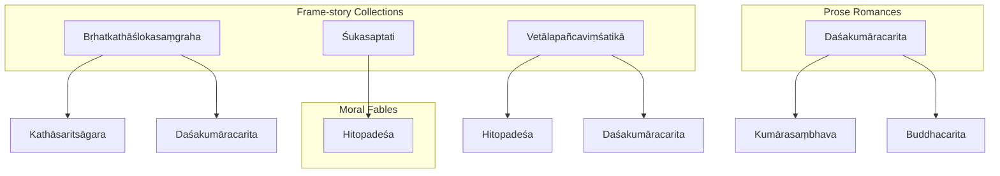
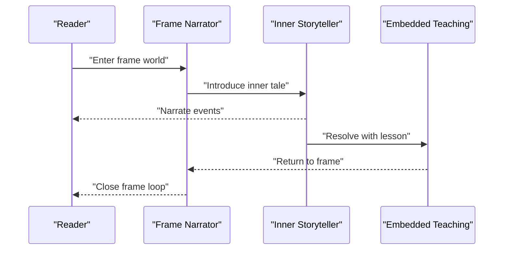
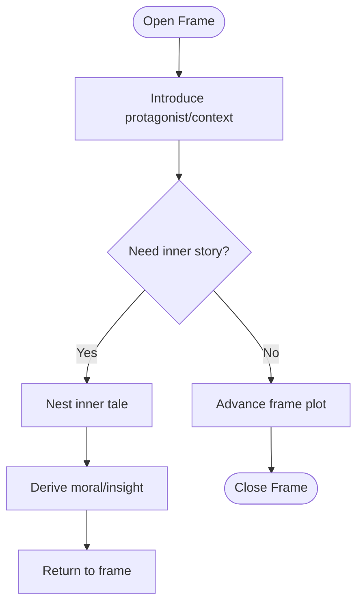
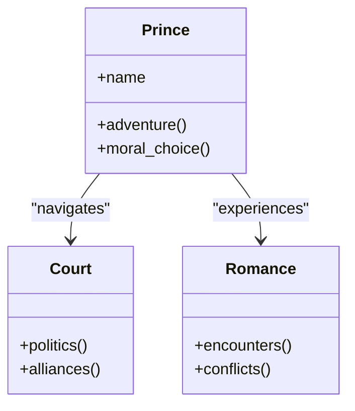
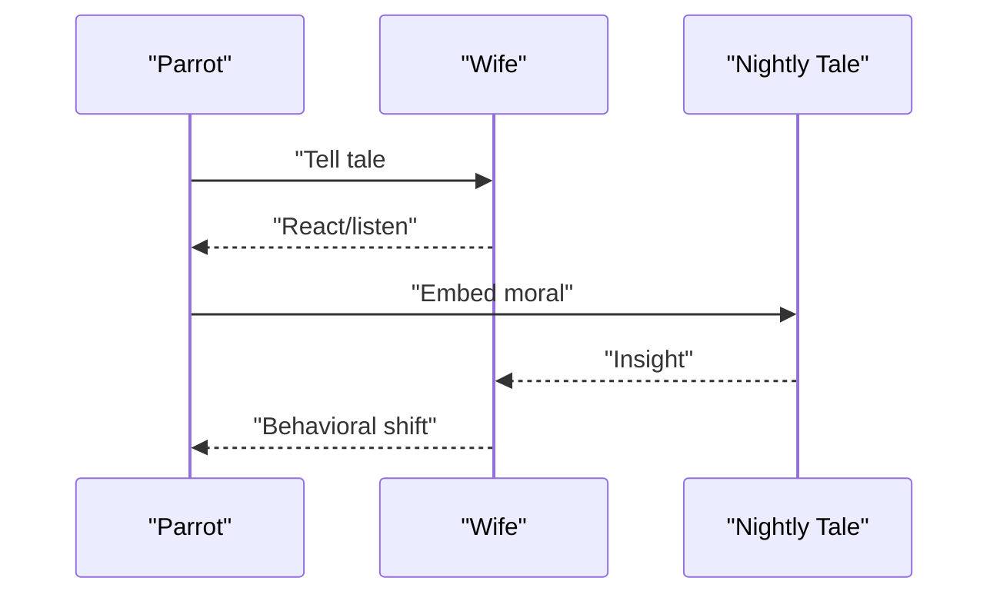
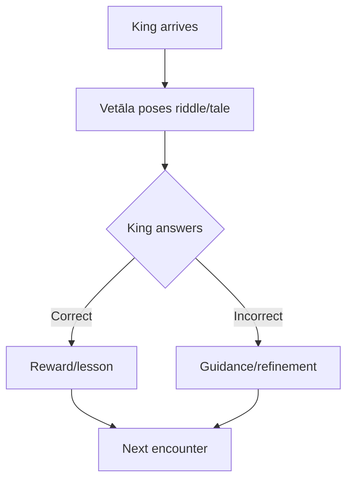
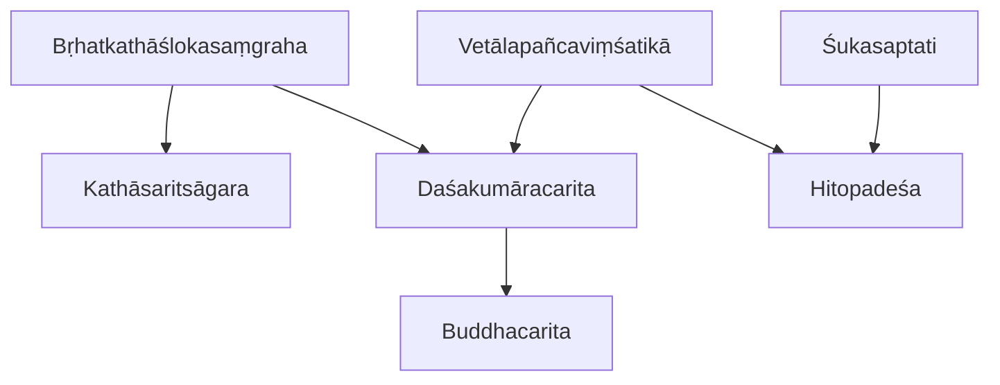

<cite>
**Referenced Files in This Document**
- [brhatkathaslokasamgraha.md](file://brhatkathaslokasamgraha.md)
- [dasakumaracarita.md](file://dasakumaracarita.md)
- [sukasaptati.md](file://sukasaptati.md)
- [vetalapancavimsatika.md](file://vetalapancavimsatika.md)
- [kathasaritsagara.md](file://kathasaritsagara.md)
- [hitopadesa.md](file://hitopadesa.md)
- [INDEX.md](file://INDEX.md)
</cite>

## Table of Contents
1. [Introduction](#introduction)
2. [Project Structure](#project-structure)
3. [Core Components](#core-components)
4. [Architecture Overview](#architecture-overview)
5. [Detailed Component Analysis](#detailed-component-analysis)
6. [Dependency Analysis](#dependency-analysis)
7. [Performance Considerations](#performance-considerations)
8. [Troubleshooting Guide](#troubleshooting-guide)
9. [Conclusion](#conclusion)
10. [Appendices](#appendices)

## Introduction
This document provides a focused, computational-literary analysis of katha-samgrahas—Sanskrit collections of interconnected stories—with emphasis on Bṛhatkathāślokasaṃgraha, Daśakumāracarita, Śukasaptati, and Vetālapañcaviṃśatikā. It explains how these works use frame-story structures to organize narratives, embed moral teachings, and preserve oral storytelling traditions within written compositions. The repository’s structured metadata enables computational analysis of recurring motifs, character archetypes, and linguistic patterns across texts through lemma frequency and similarity metrics.

## Project Structure
The repository organizes each work as a concept file with standardized front matter: title, description, knowledge-bank tag, source paths, tags, and computed “Related Texts” by TF-IDF cosine similarity over lemmas. This uniform structure supports cross-text comparisons and motif discovery.

**Diagram sources**
- [brhatkathaslokasamgraha.md:15-30](file://brhatkathaslokasamgraha.md#L15-L30)
- [dasakumaracarita.md:15-30](file://dasakumaracarita.md#L15-L30)
- [sukasaptati.md:1-12](file://sukasaptati.md#L1-L12)
- [vetalapancavimsatika.md:15-30](file://vetalapancavimsatika.md#L15-L30)
- [kathasaritsagara.md:15-30](file://kathasaritsagara.md#L15-L30)
- [hitopadesa.md:15-30](file://hitopadesa.md#L15-L30)

**Section sources**
- [INDEX.md:59-65](file://INDEX.md#L59-L65)
- [INDEX.md:109-110](file://INDEX.md#L109-L110)
- [INDEX.md:229-230](file://INDEX.md#L229-L230)
- [INDEX.md:255-256](file://INDEX.md#L255-L256)

## Core Components
- Bṛhatkathāślokasaṃgraha: A poetic condensation preserving ancient Indian folk tales and frame stories; high-frequency narrative markers such as quotation particles and pronouns indicate dense embedded speech and framing.
- Daśakumāracarita: A prose romance following ten princes’ adventures; lexical similarity highlights connections to epic and courtly literature.
- Śukasaptati: A compact frame-story collection where a parrot narrates nightly tales to influence behavior; its small size makes it ideal for comparative studies of frame mechanics.
- Vetālapañcaviṃśatikā: King Vikramāditya’s encounters with a vetāla who tells twenty-five framed tales; frequent royal address terms reflect the dialogic frame.

Computational insights from the files:
- Lemma frequencies reveal shared connective tissue across collections (e.g., common particles and pronouns), indicating similar narrative pacing and embedding strategies.
- Related-text similarity clusters group frame-story collections together and distinguish prose romances and fable collections.

**Section sources**
- [brhatkathaslokasamgraha.md:1-11](file://brhatkathaslokasamgraha.md#L1-L11)
- [brhatkathaslokasamgraha.md:31-47](file://brhatkathaslokasamgraha.md#L31-L47)
- [dasakumaracarita.md:1-11](file://dasakumaracarita.md#L1-L11)
- [dasakumaracarita.md:31-47](file://dasakumaracarita.md#L31-L47)
- [sukasaptati.md:1-12](file://sukasaptati.md#L1-L12)
- [vetalapancavimsatika.md:1-11](file://vetalapancavimsatika.md#L1-L11)
- [vetalapancavimsatika.md:31-47](file://vetalapancavimsatika.md#L31-L47)

## Architecture Overview
The conceptual architecture of katha-samgrahas centers on a stable outer frame that hosts multiple inner stories. Computational analysis treats each text as a vector of lemma frequencies; similarity scores expose shared narrative DNA.

[No sources needed since this diagram shows conceptual workflow, not actual code structure]

## Detailed Component Analysis

### Bṛhatkathāślokasaṃgraha
- Narrative technique: Poetic condensation of a larger oral tradition into verse, preserving frame stories and folk motifs.
- Frame structure: Outer narrator introduces nested tales; frequent quotation markers suggest heavy dialogue embedding.
- Moral teachings: Embedded in episodic outcomes and proverbial statements typical of folk wisdom.
- Computational signals: High counts of demonstratives and quotation particles indicate dense narration and embedded speech.

**Diagram sources**
- [brhatkathaslokasamgraha.md:1-11](file://brhatkathaslokasamgraha.md#L1-L11)
- [brhatkathaslokasamgraha.md:31-47](file://brhatkathaslokasamgraha.md#L31-L47)

**Section sources**
- [brhatkathaslokasamgraha.md:1-11](file://brhatkathaslokasamgraha.md#L1-L11)
- [brhatkathaslokasamgraha.md:15-30](file://brhatkathaslokasamgraha.md#L15-L30)
- [brhatkathaslokasamgraha.md:31-47](file://brhatkathaslokasamgraha.md#L31-L47)

### Daśakumāracarita
- Narrative technique: Prose romance interweaving love, war, and political intrigue; less overtly framed than folk collections but shares thematic links with katha tradition.
- Frame structure: Episodic adventures linked by character arcs rather than explicit narrator frames.
- Moral teachings: Statecraft, ethics, and dharma emerge through consequences of choices.
- Computational signals: Strong similarity to epic and courtly works suggests shared vocabulary of power, heroism, and counsel.

**Diagram sources**
- [dasakumaracarita.md:1-11](file://dasakumaracarita.md#L1-L11)
- [dasakumaracarita.md:15-30](file://dasakumaracarita.md#L15-L30)

**Section sources**
- [dasakumaracarita.md:1-11](file://dasakumaracarita.md#L1-L11)
- [dasakumaracarita.md:15-30](file://dasakumaracarita.md#L15-L30)
- [dasakumaracarita.md:31-47](file://dasakumaracarita.md#L31-L47)

### Śukasaptati
- Narrative technique: Compact frame story; a parrot narrates nightly tales to deter infidelity, using repetition and escalating stakes.
- Frame structure: Tight loop—each night a new story; frame advances via behavioral change.
- Moral teachings: Prudence, loyalty, and cleverness rewarded; folly punished.
- Computational signals: Small corpus amplifies relative frequencies; frame-specific lexicon stands out clearly.

**Diagram sources**
- [sukasaptati.md:1-12](file://sukasaptati.md#L1-L12)

**Section sources**
- [sukasaptati.md:1-12](file://sukasaptati.md#L1-L12)

### Vetālapañcaviṃśatikā
- Narrative technique: Dialogic frame between king and vetāla; riddles and paradoxes drive engagement.
- Frame structure: Each encounter presents a puzzle or tale; resolution hinges on insight and ethical reasoning.
- Moral teachings: Wisdom, discernment, and justice emphasized through problem-solving.
- Computational signals: Frequent royal address terms highlight the conversational frame and didactic tone.

**Diagram sources**
- [vetalapancavimsatika.md:1-11](file://vetalapancavimsatika.md#L1-L11)
- [vetalapancavimsatika.md:31-47](file://vetalapancavimsatika.md#L31-L47)

**Section sources**
- [vetalapancavimsatika.md:1-11](file://vetalapancavimsatika.md#L1-L11)
- [vetalapancavimsatika.md:15-30](file://vetalapancavimsatika.md#L15-L30)
- [vetalapancavimsatika.md:31-47](file://vetalapancavimsatika.md#L31-L47)

### Conceptual Overview
- Oral-to-written transmission: These collections preserve oral performance conventions (repetition, formulaic phrases, audience address) within written forms, enabling both literary study and digital analysis.
- Cross-text motifs: Similarities in lemma usage and related-text clustering reveal shared narrative building blocks across collections.

[No sources needed since this diagram shows conceptual workflow, not actual code structure]

## Dependency Analysis
Cross-text dependencies are captured via lemma-based similarity, grouping frame-story collections and distinguishing prose romances and fables.

**Diagram sources**
- [brhatkathaslokasamgraha.md:15-30](file://brhatkathaslokasamgraha.md#L15-L30)
- [dasakumaracarita.md:15-30](file://dasakumaracarita.md#L15-L30)
- [vetalapancavimsatika.md:15-30](file://vetalapancavimsatika.md#L15-L30)
- [kathasaritsagara.md:15-30](file://kathasaritsagara.md#L15-L30)
- [hitopadesa.md:15-30](file://hitopadesa.md#L15-L30)

**Section sources**
- [brhatkathaslokasamgraha.md:15-30](file://brhatkathaslokasamgraha.md#L15-L30)
- [dasakumaracarita.md:15-30](file://dasakumaracarita.md#L15-L30)
- [vetalapancavimsatika.md:15-30](file://vetalapancavimsatika.md#L15-L30)
- [kathasaritsagara.md:15-30](file://kathasaritsagara.md#L15-L30)
- [hitopadesa.md:15-30](file://hitopadesa.md#L15-L30)

## Performance Considerations
- Corpus size effects: Smaller corpora (e.g., Śukasaptati) can exaggerate relative frequencies; interpret similarity scores with caution.
- Lemma normalization: Ensure consistent tokenization and lemmatization across texts to improve comparability.
- Overfitting risk: High similarity may reflect genre conventions rather than direct borrowing; validate with manual reading.

[No sources needed since this section provides general guidance]

## Troubleshooting Guide
- Misclassification of frame vs. non-frame texts: Verify descriptions and tags; frame-story collections typically emphasize nested narration and repeated structural loops.
- Anomalous similarity spikes: Check for shared technical or ritual vocabulary that may skew results; consider domain-specific stoplists.
- Incomplete metadata: Ensure each work has accurate front matter (title, description, sources) to support reliable indexing.

[No sources needed since this section provides general guidance]

## Conclusion
Katha-samgrahas demonstrate a sophisticated architecture of frames, nested tales, and embedded morals that bridge oral performance and written literature. The repository’s structured metadata enables computational discovery of recurring motifs, character archetypes, and linguistic patterns, revealing deep continuities across Sanskrit narrative traditions. By combining close reading with quantitative analysis, scholars can trace how oral storytelling techniques were preserved, adapted, and transformed in written form.

[No sources needed since this section summarizes without analyzing specific files]

## Appendices
- Additional related collections:
  - Kathāsaritsāgara: Vast compendium of folk tales and frame stories with strong lexical overlap with Bṛhatkathāślokasaṃgraha.
  - Hitopadeśa: Fable collection emphasizing statecraft and worldly wisdom; shares motifs with frame-story traditions.

**Section sources**
- [kathasaritsagara.md:1-11](file://kathasaritsagara.md#L1-L11)
- [kathasaritsagara.md:15-30](file://kathasaritsagara.md#L15-L30)
- [hitopadesa.md:1-11](file://hitopadesa.md#L1-L11)
- [hitopadesa.md:15-30](file://hitopadesa.md#L15-L30)
