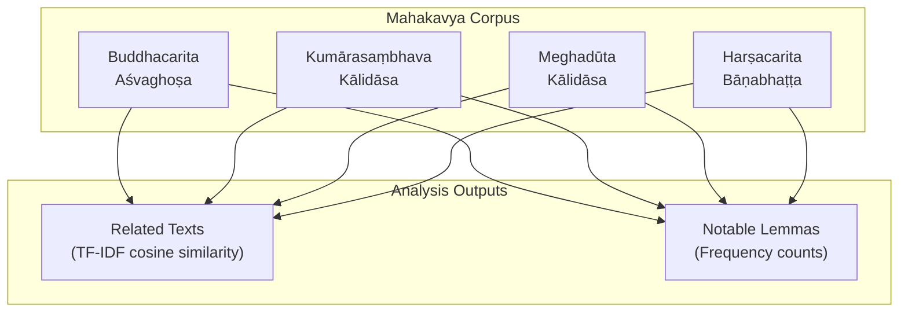
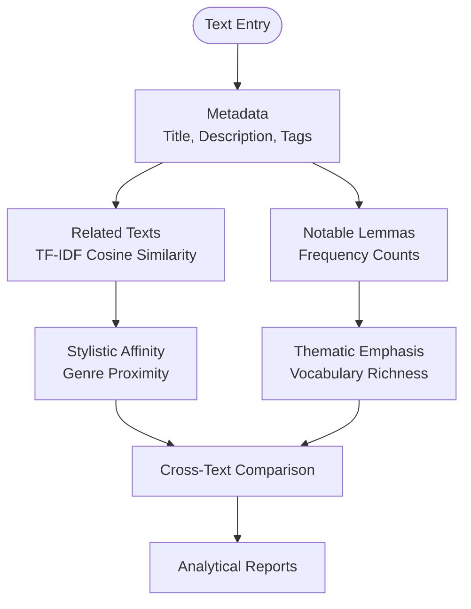
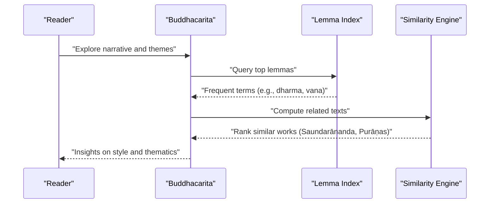
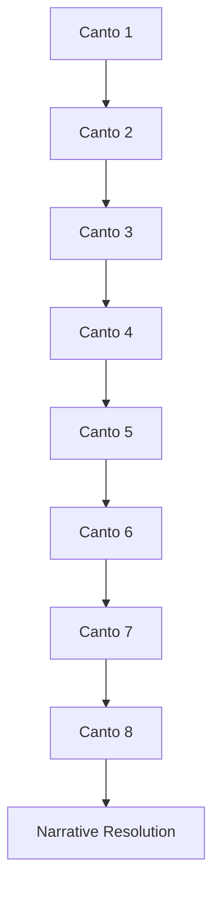
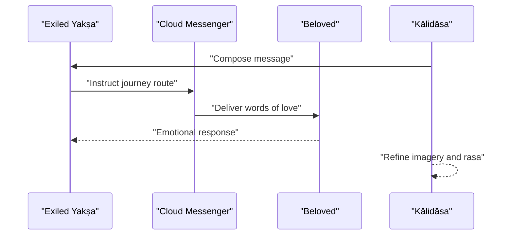
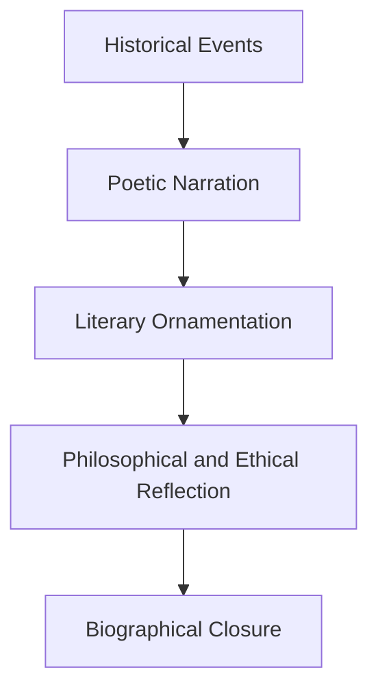
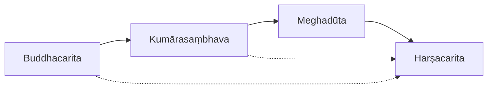

<cite>
**Referenced Files in This Document**
- [buddhacarita.md](file://buddhacarita.md)
- [kumarasambhava.md](file://kumarasambhava.md)
- [meghaduta.md](file://meghaduta.md)
- [harsacarita.md](file://harsacarita.md)
- [INDEX.md](file://INDEX.md)
</cite>

## Table of Contents
1. [Introduction](#introduction)
2. [Project Structure](#project-structure)
3. [Core Components](#core-components)
4. [Architecture Overview](#architecture-overview)
5. [Detailed Component Analysis](#detailed-component-analysis)
6. [Dependency Analysis](#dependency-analysis)
7. [Performance Considerations](#performance-considerations)
8. [Troubleshooting Guide](#troubleshooting-guide)
9. [Conclusion](#conclusion)
10. [Appendices](#appendices)

## Introduction
This document provides a comprehensive overview of mahākāvyas, the great Sanskrit epics in verse form, focusing on four landmark works:
- Aśvaghoṣa’s Buddhacarita, recognized as the earliest surviving mahākāvya
- Kālidāsa’s Kumārasambhava and Meghadūta as masterpieces of classical kāvya
- Bāṇabhaṭṭa’s Harṣacarita, a celebrated biographical work in poetic prose

It explains the conventions of mahākāvya composition, including the eight sargas (cantos), elaborate descriptions of nature, romantic episodes, and philosophical discourses. It also documents how computational linguistics—using lemma frequency and similarity metrics—reveals stylistic patterns, vocabulary richness, and thematic development across different periods of mahākāvya literature.

## Project Structure
The repository organizes each text as a concept entry with metadata, related-text similarity rankings, and notable lemmas. The relevant entries for this document are:
- Buddhacarita: 14 CoNLL-U files; Buddhist narrative spanning birth to parinirvāṇa
- Kumārasambhava: 8 CoNLL-U files; eight cantos recounting Śiva and Pārvatī’s marriage and Skanda’s birth
- Meghadūta: 2 CoNLL-U files; celebrated dūta-kāvya (message poem) by Kālidāsa
- Harṣacarita: 2 CoNLL-U files; biographical kāvya of King Harṣavardhana

**Diagram sources**
- [buddhacarita.md:1-58](file://buddhacarita.md#L1-L58)
- [kumarasambhava.md:1-48](file://kumarasambhava.md#L1-L48)
- [meghaduta.md:1-48](file://meghaduta.md#L1-L48)
- [harsacarita.md:1-48](file://harsacarita.md#L1-L48)

**Section sources**
- [INDEX.md:1-277](file://INDEX.md#L1-L277)
- [buddhacarita.md:1-58](file://buddhacarita.md#L1-L58)
- [kumarasambhava.md:1-48](file://kumarasambhava.md#L1-L48)
- [meghaduta.md:1-48](file://meghaduta.md#L1-L48)
- [harsacarita.md:1-48](file://harsacarita.md#L1-L48)

## Core Components
- Buddhacarita: Earliest surviving mahākāvya; structured around the Buddha’s life; exhibits rich lexical patterns aligned with Buddhist themes and narrative progression.
- Kumārasambhava: Classical mahākāvya in eight cantos; exemplifies ornate style, mythological depth, and refined poetics.
- Meghadūta: Dūta-kāvya masterpiece; showcases lyrical description, emotional nuance, and geographical imagination.
- Harṣacarita: Biographical kāvya blending historical narrative with literary artistry; demonstrates prose-poetry synthesis.

Computational insights from these entries include:
- Related texts ranked by TF-IDF cosine similarity reveal stylistic affinities and genre proximity
- Notable lemmas highlight recurring vocabulary and thematic emphasis per text

**Section sources**
- [buddhacarita.md:15-58](file://buddhacarita.md#L15-L58)
- [kumarasambhava.md:15-48](file://kumarasambhava.md#L15-L48)
- [meghaduta.md:15-48](file://meghaduta.md#L15-L48)
- [harsacarita.md:15-48](file://harsacarita.md#L15-L48)

## Architecture Overview
The corpus architecture centers on standardized concept entries that enable cross-text comparison through:
- Metadata fields (title, description, knowledge-bank, sources, tags)
- Similarity-based related texts tables
- Lemma frequency tables

[No diagram sources needed since this diagram shows conceptual workflow, not actual code structure]

## Detailed Component Analysis

### Buddhacarita: Earliest Surviving Mahākāvya
- Composition and scope: Aśvaghoṣa’s epic recounts the Buddha’s life from birth to parinirvāṇa across multiple files, enabling granular analysis of narrative arcs and thematic shifts.
- Stylistic markers: High-frequency lemmas such as common pronouns and particles reflect classical Sanskrit syntax; thematic lemmas like “dharma” and “vana” align with Buddhist and ascetic motifs.
- Computational profile: Strong similarity to Saundarānanda and Purāṇic texts indicates shared narrative strategies and lexical overlap with broader Indic traditions.

**Diagram sources**
- [buddhacarita.md:15-58](file://buddhacarita.md#L15-L58)

**Section sources**
- [buddhacarita.md:1-58](file://buddhacarita.md#L1-L58)

### Kumārasambhava: Classical Mahākāvya Masterpiece
- Structure: Eight cantos (sargas) narrating the marriage of Śiva and Pārvatī and the birth of Skanda; aligns with traditional mahākāvya conventions.
- Stylistic markers: Elevated diction and mythological imagery; frequent use of comparative particles and demonstratives reflects classical ornamental style.
- Computational profile: Closest similarity to Kirātārjunīya suggests shared epic-heroic tone and lexical choices; moderate similarity to Harṣacarita indicates cross-period stylistic resonance.

**Diagram sources**
- [kumarasambhava.md:1-48](file://kumarasambhava.md#L1-L48)

**Section sources**
- [kumarasambhava.md:1-48](file://kumarasambhava.md#L1-L48)

### Meghadūta: Celebrated Dūta-Kāvya
- Form and theme: A message poem where an exiled yakṣa sends a cloud messenger across central India; emphasizes lyrical description and emotional depth.
- Stylistic markers: Frequent first-person and second-person pronouns (“mad,” “tvad”) indicate intimate address; thematic lemmas like “viraha” underscore separation and longing.
- Computational profile: Highest similarity to Kokilasaṃdeśa confirms genre affinity within dūta-kāvya; moderate similarity to Kumārasambhava and Harṣacarita reveals cross-genre stylistic echoes.

**Diagram sources**
- [meghaduta.md:1-48](file://meghaduta.md#L1-L48)

**Section sources**
- [meghaduta.md:1-48](file://meghaduta.md#L1-L48)

### Harṣacarita: Historical Biography in Poetic Prose
- Scope: Bāṇabhaṭṭa’s biographical kāvya chronicles King Harṣavardhana’s life, blending historical narrative with literary embellishment.
- Stylistic markers: Prominent use of comparative particles (“iva”) and connective particles (“ca,” “api”) supports complex narrative flow; frequent “iti” marks reported speech and discourse.
- Computational profile: Closest similarity to Kumārasambhava indicates shared classical style; moderate similarity to Meghadūta and Daśakumāracarita reflects cross-textual influences in narrative technique.

**Diagram sources**
- [harsacarita.md:1-48](file://harsacarita.md#L1-L48)

**Section sources**
- [harsacarita.md:1-48](file://harsacarita.md#L1-L48)

## Dependency Analysis
The texts exhibit interrelated dependencies through:
- Genre conventions: Mahākāvya and dūta-kāvya share structural and stylistic expectations
- Thematic continuity: Romantic episodes, nature descriptions, and philosophical discourses recur across works
- Computational linkages: Similarity rankings reveal textual affinities and influence pathways

**Diagram sources**
- [buddhacarita.md:15-58](file://buddhacarita.md#L15-L58)
- [kumarasambhava.md:15-48](file://kumarasambhava.md#L15-L48)
- [meghaduta.md:15-48](file://meghaduta.md#L15-L48)
- [harsacarita.md:15-48](file://harsacarita.md#L15-L48)

**Section sources**
- [buddhacarita.md:15-58](file://buddhacarita.md#L15-L58)
- [kumarasambhava.md:15-48](file://kumarasambhava.md#L15-L48)
- [meghaduta.md:15-48](file://meghaduta.md#L15-L48)
- [harsacarita.md:15-48](file://harsacarita.md#L15-L48)

## Performance Considerations
- Data granularity: Larger corpora (e.g., Buddhacarita with 14 files) allow finer-grained analysis but require more processing resources
- Similarity computation: TF-IDF cosine similarity is efficient for ranking related texts; ensure consistent preprocessing for accurate comparisons
- Lemma indexing: Frequency counts provide quick insights into vocabulary richness; combine with contextual analysis for deeper understanding

[No sources needed since this section provides general guidance]

## Troubleshooting Guide
- Inconsistent metadata: Ensure all entries have complete title, description, and tags for reliable retrieval
- Similarity anomalies: Verify tokenization and stopword handling when interpreting low or high similarity scores
- Lemma misinterpretation: Cross-reference frequent lemmas with domain-specific glossaries to avoid generic interpretations

[No sources needed since this section provides general guidance]

## Conclusion
The mahākāvya tradition spans diverse periods and styles, unified by shared conventions and evolving artistic techniques. Computational linguistics enhances our understanding of stylistic patterns, vocabulary richness, and thematic development across texts. By leveraging lemma frequencies and similarity metrics, scholars can trace influences, identify genre boundaries, and appreciate the enduring legacy of Sanskrit epic poetry.

[No sources needed since this section summarizes without analyzing specific files]

## Appendices

### Conventions of Mahākāvya Composition
- Eight sargas (cantos): Structured division of narrative into manageable sections, often with thematic focus per canto
- Elaborate descriptions of nature: Vivid imagery of seasons, landscapes, and celestial phenomena to enhance aesthetic experience
- Romantic episodes: Central role of love and separation, often expressed through nuanced emotional states (rasa)
- Philosophical discourses: Integration of ethical, spiritual, and metaphysical reflections within narrative frameworks

[No sources needed since this section provides general guidance]

### Computational Linguistics Insights
- Lemma frequency analysis: Identifies core vocabulary and thematic emphasis per text
- TF-IDF similarity: Reveals stylistic affinities and genre proximity across works
- Cross-text comparison: Enables mapping of influence networks and evolution of poetic forms

[No sources needed since this section provides general guidance]
