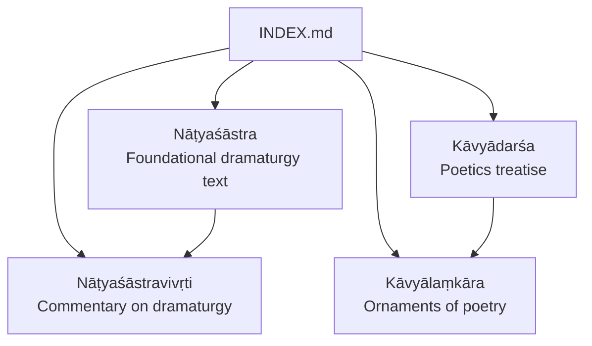
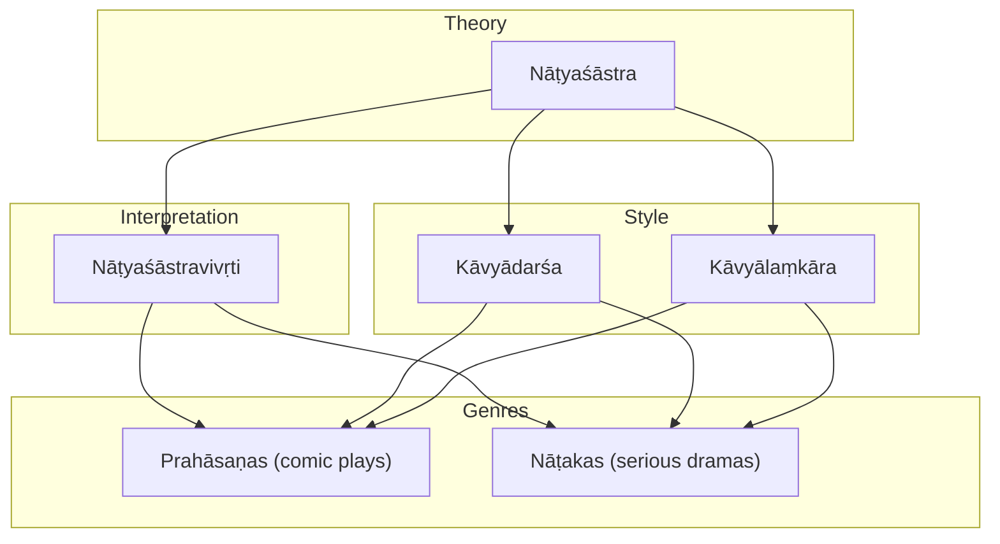
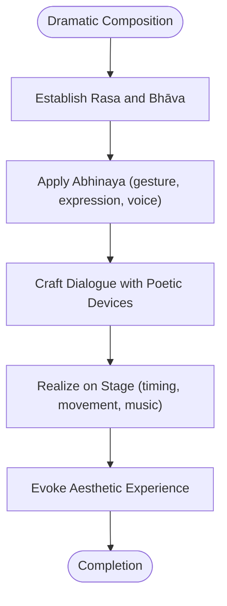
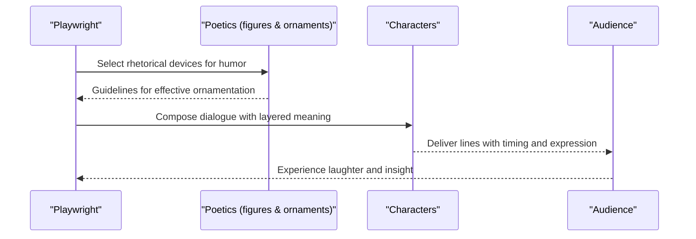
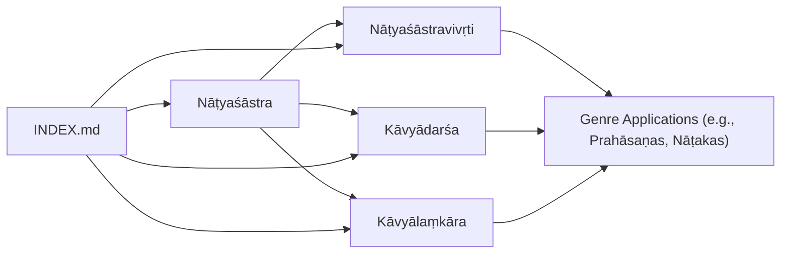

<cite>
**Referenced Files in This Document**
- [natyasastra.md](file://natyasastra.md)
- [natyasastravivrti.md](file://natyasastravivrti.md)
- [kavyadarsa.md](file://kavyadarsa.md)
- [kavyalankara.md](file://kavyalankara.md)
- [INDEX.md](file://INDEX.md)
</cite>

## Table of Contents
1. Introduction
2. Project Structure
3. Core Components
4. Architecture Overview
5. Detailed Component Analysis
6. Dependency Analysis
7. Performance Considerations
8. Troubleshooting Guide
9. Conclusion
10. Appendices

## Introduction
This document provides a focused overview of prahāsaṇas, the Sanskrit comic plays that form an important genre within classical Indian drama. It explains how these works fit into the broader theatrical tradition anchored by the Nāṭyaśāstra and its commentaries, and it outlines structural elements such as character types, plot construction, and dialogue patterns. It also clarifies how prahāsaṇas differ from other dramatic forms like nāṭakas and highlights their role in entertainment and social commentary. The repository’s dramaturgy resources are used to situate prahāsaṇas within the larger system of Sanskrit performance theory and poetics.

## Project Structure
The repository organizes texts by topic with concise concept pages that summarize each work and provide links to related materials. For this documentation, the most relevant entries are:
- A foundational treatise on dramaturgy and performance
- A commentary elucidating dramaturgical principles
- Poetics treatises that inform stylistic and rhetorical features across literary genres
- An index that catalogs available texts and their relationships

**Diagram sources**
- [INDEX.md:149-150](file://INDEX.md#L149-L150)
- [natyasastra.md:1-11](file://natyasastra.md#L1-L11)
- [natyasastravivrti.md:1-11](file://natyasastravivrti.md#L1-L11)
- [kavyadarsa.md:1-11](file://kavyadarsa.md#L1-L11)
- [kavyalankara.md:1-12](file://kavyalankara.md#L1-L12)

**Section sources**
- [INDEX.md:149-150](file://INDEX.md#L149-L150)
- [natyasastra.md:1-11](file://natyasastra.md#L1-L11)
- [natyasastravivrti.md:1-11](file://natyasastravivrti.md#L1-L11)
- [kavyadarsa.md:1-11](file://kavyadarsa.md#L1-L11)
- [kavyalankara.md:1-12](file://kavyalankara.md#L1-L12)

## Core Components
- Foundational dramaturgy: The Nāṭyaśāstra establishes the theoretical framework for Sanskrit theatre, including stagecraft, rasa theory, gesture, and performance practice. These concepts underpin all dramatic genres, including comic plays.
- Commentary tradition: The Nāṭyaśāstravivṛti elaborates Bharata’s principles, offering detailed explanations that help interpret how different play types operate in practice.
- Poetics and ornamentation: Treatises such as Kāvyādarśa and Kāvyālaṃkāra define poetic figures, stylistic qualities, and aesthetic effects that shape dialogue, humor, and satire in dramatic literature.

These components collectively frame how prahāsaṇas would be structured and performed, even though the repository does not contain a dedicated entry for prahāsaṇas themselves.

**Section sources**
- [natyasastra.md:1-11](file://natyasastra.md#L1-L11)
- [natyasastravivrti.md:1-11](file://natyasastravivrti.md#L1-L11)
- [kavyadarsa.md:1-11](file://kavyadarsa.md#L1-L11)
- [kavyalankara.md:1-12](file://kavyalankara.md#L1-L12)

## Architecture Overview
The dramaturgical architecture can be understood as a layered system:
- Theory layer: Nāṭyaśāstra defines core concepts such as rasa, bhāva, abhinaya, and the structure of dramatic composition.
- Interpretive layer: Commentaries like Nāṭyaśāstravivṛti clarify and expand these concepts for practical application.
- Stylistic layer: Poetics treatises supply the vocabulary of figures of speech and aesthetic devices that color dialogue and comedic effect.
- Genre layer: Within this framework, specific genres such as prahāsaṇas and nāṭakas are differentiated by tone, subject matter, character types, and intended emotional effect.

[No sources needed since this diagram shows conceptual workflow, not actual code structure]

## Detailed Component Analysis

### Dramaturgical Foundations for Comic Plays
- Rasa and bhāva: The foundational treatise emphasizes rasa as the aesthetic experience evoked in the audience. In comic plays, humor arises through appropriate rasas and their supporting bhāvas, expressed via dialogue, gesture, and staging.
- Abhinaya and performance: The same source covers performance techniques that bring characters and emotions to life, essential for timing, physical comedy, and expressive delivery in prahāsaṇas.
- Commentary insights: The commentary expands on how theorists and practitioners apply these principles to different genres, aiding interpretation of comic structures and conventions.

[No sources needed since this diagram shows conceptual workflow, not actual code structure]

### Character Types and Social Roles
- Comic archetypes typically include servants, tricksters, fools, and clever commoners who interact with authority figures or upper-class characters. Their roles enable satire, wordplay, and situational comedy.
- Supporting characters such as confidantes, matchmakers, and messengers facilitate plot progression and provide opportunities for witty exchanges.
- The repository’s poetics resources inform how character voices and interactions are stylized using ornaments and figures of speech.

[No sources needed since this section doesn't analyze specific source files]

### Plot Construction and Pacing
- Comic plots often revolve around misunderstandings, disguises, mistaken identities, and schemes that resolve in harmonious outcomes.
- Pacing relies on alternating tension and release, with scenes designed to build up to punchlines or reveals.
- Structural markers such as prologues, interludes, and epilogues may frame the action and guide audience expectations.

[No sources needed since this section doesn't analyze specific source files]

### Dialogue Patterns and Ornamentation
- Dialogue employs puns, double meanings, exaggeration, and irony to generate humor while maintaining linguistic elegance.
- Poetic treatises define ornamental strategies that enhance comedic effect without sacrificing clarity or grace.
- The interplay between elevated language and colloquial speech creates contrast that heightens comic impact.

[No sources needed since this diagram shows conceptual workflow, not actual code structure]

### Distinction from Nāṭakas
- Tone and purpose: Prahāsaṇas prioritize entertainment and social commentary; nāṭakas typically focus on serious themes, heroic narratives, and elevated moral or spiritual aims.
- Character hierarchy: Prahāsaṇas often center lower-status or everyday characters; nāṭakas frequently feature kings, heroes, and deities.
- Emotional arc: Prahāsaṇas aim at humor and satirical reflection; nāṭakas aim at awe, pathos, devotion, or moral instruction.

[No sources needed since this section doesn't analyze specific source files]

### Role in the Broader Theatrical Tradition
- Anchored by the Nāṭyaśāstra, prahāsaṇas participate in a unified system of performance theory that governs all Sanskrit drama.
- Commentaries refine genre-specific applications of rasa, abhinaya, and staging, ensuring coherence across diverse play types.
- Poetics traditions enrich dialogue and characterization, preserving cultural and linguistic patterns of their time through stylized language and recognizable tropes.

**Section sources**
- [natyasastra.md:1-11](file://natyasastra.md#L1-L11)
- [natyasastravivrti.md:1-11](file://natyasastravivrti.md#L1-L11)
- [kavyadarsa.md:1-11](file://kavyadarsa.md#L1-L11)
- [kavyalankara.md:1-12](file://kavyalankara.md#L1-L12)

## Dependency Analysis
The dramaturgical ecosystem depends on interconnected layers:
- The foundational treatise supplies core concepts and performance standards.
- Commentaries interpret and adapt those standards to specific genres and contexts.
- Poetics treatises provide stylistic tools that shape dialogue and character interaction.
- Indexing and cataloging ensure discoverability and cross-referencing among texts.

**Diagram sources**
- [natyasastra.md:1-11](file://natyasastra.md#L1-L11)
- [natyasastravivrti.md:1-11](file://natyasastravivrti.md#L1-L11)
- [kavyadarsa.md:1-11](file://kavyadarsa.md#L1-L11)
- [kavyalankara.md:1-12](file://kavyalankara.md#L1-L12)
- [INDEX.md:149-150](file://INDEX.md#L149-L150)

**Section sources**
- [natyasastra.md:1-11](file://natyasastra.md#L1-L11)
- [natyasastravivrti.md:1-11](file://natyasastravivrti.md#L1-L11)
- [kavyadarsa.md:1-11](file://kavyadarsa.md#L1-L11)
- [kavyalankara.md:1-12](file://kavyalankara.md#L1-L12)
- [INDEX.md:149-150](file://INDEX.md#L149-L150)

## Performance Considerations
- Timing and pacing are critical for comedic effect; scenes should balance buildup and release to sustain audience engagement.
- Language choices must align with character status and context, blending elevated diction with accessible wit.
- Staging and gestures should reinforce humor without overshadowing dialogue or narrative clarity.
- Cultural references and idioms should be intelligible to the target audience while preserving artistic integrity.

[No sources needed since this section provides general guidance]

## Troubleshooting Guide
- If comedic timing feels off, revisit scene structure and ensure clear escalation and resolution points.
- If dialogue seems flat, incorporate appropriate poetic ornaments and rhetorical devices to add depth and surprise.
- If audience response is muted, check whether character motivations and social contrasts are sufficiently pronounced.
- If performances feel inconsistent, consult dramaturgical principles and commentary insights to align staging with genre conventions.

[No sources needed since this section provides general guidance]

## Conclusion
Prahāsaṇas occupy a distinctive place within Sanskrit theatre, leveraging shared dramaturgical foundations to deliver humor and social commentary. While the repository centers on foundational texts and poetics rather than a dedicated prahāsaṇa entry, the Nāṭyaśāstra and its commentary, together with poetics treatises, provide the conceptual scaffolding necessary to understand and appreciate comic plays. By grounding prahāsaṇas in rasa, abhinaya, and ornamental style, one can appreciate their artistic sophistication and cultural significance.

[No sources needed since this section summarizes without analyzing specific files]

## Appendices

### Appendix A: Key Repository Entries for Dramaturgy and Poetics
- Nāṭyaśāstra: Foundational treatise on drama, dance, and music
- Nāṭyaśāstravivṛti: Commentary elucidating dramaturgical principles
- Kāvyādarśa: Poetics treatise defining figures, genres, and stylistic qualities
- Kāvyālaṃkāra: Early work on poetic ornaments and defects
- INDEX: Catalog linking dramaturgy and poetics resources

**Section sources**
- [natyasastra.md:1-11](file://natyasastra.md#L1-L11)
- [natyasastravivrti.md:1-11](file://natyasastravivrti.md#L1-L11)
- [kavyadarsa.md:1-11](file://kavyadarsa.md#L1-L11)
- [kavyalankara.md:1-12](file://kavyalankara.md#L1-L12)
- [INDEX.md:149-150](file://INDEX.md#L149-L150)
