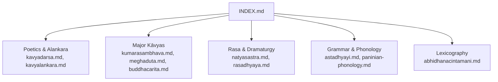
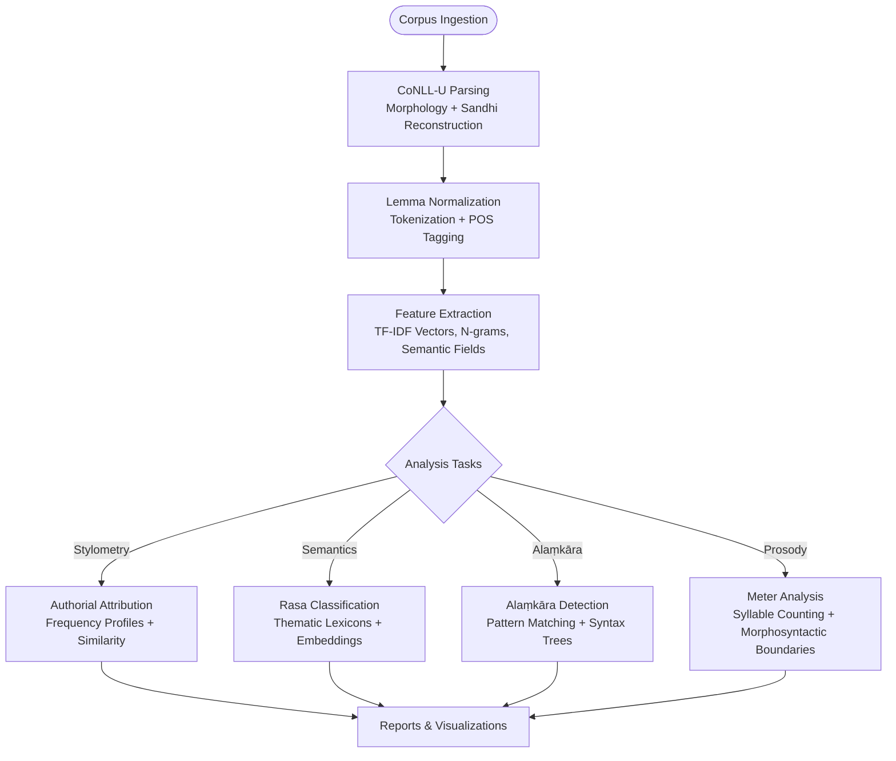
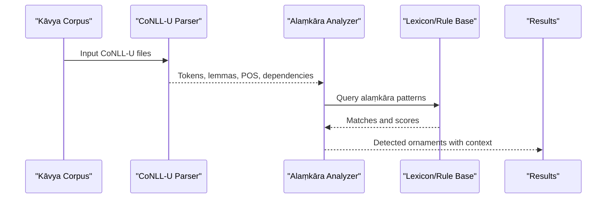
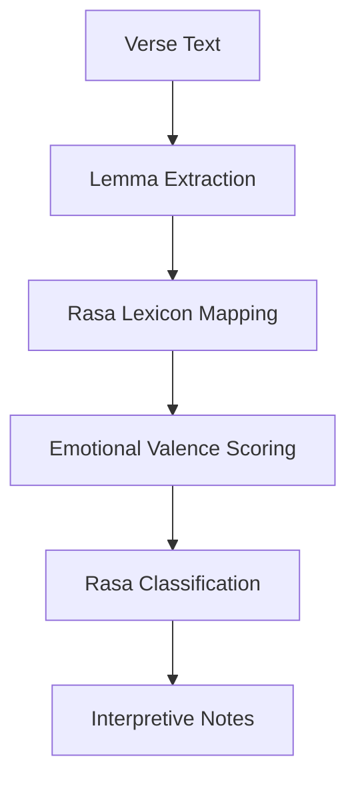
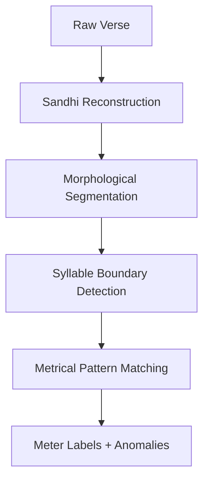
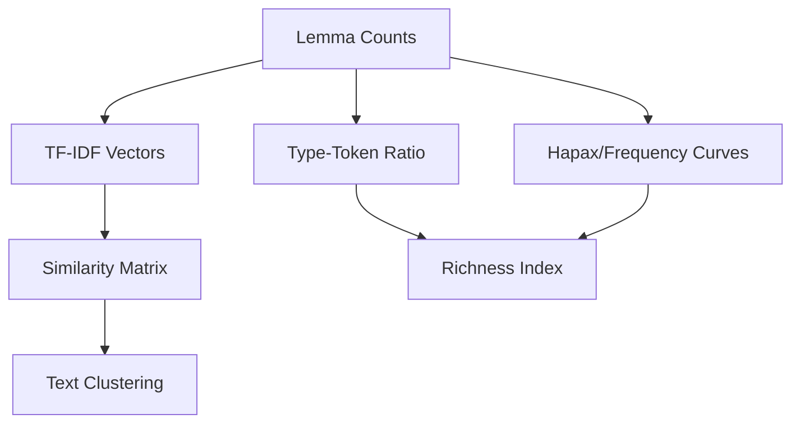
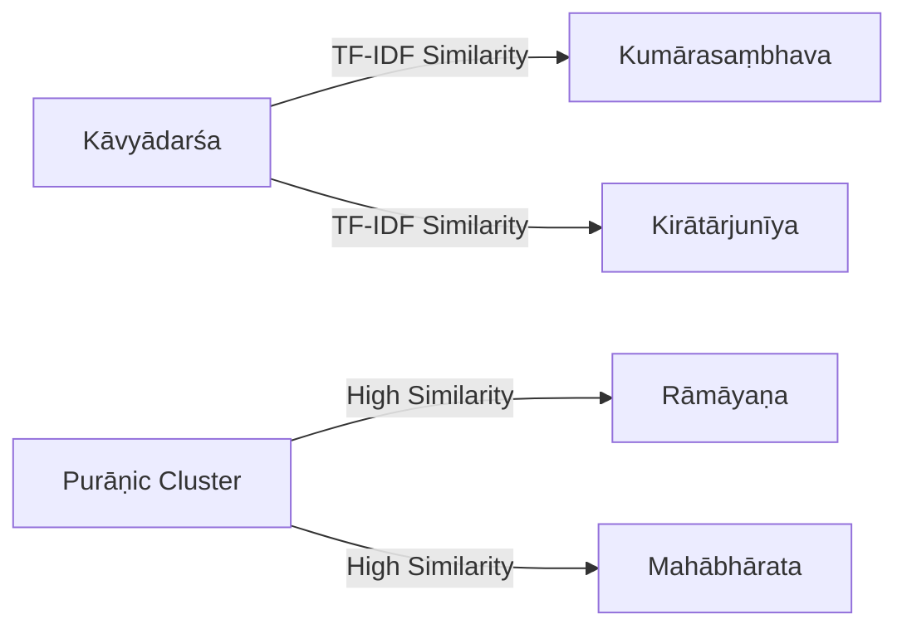
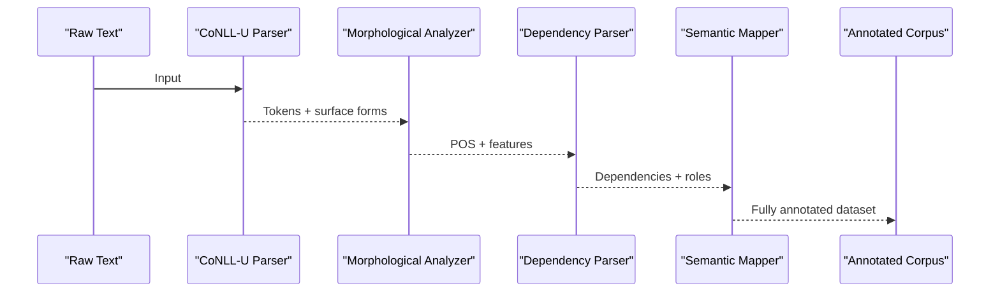
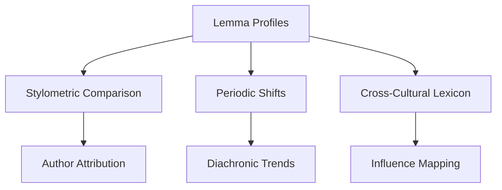
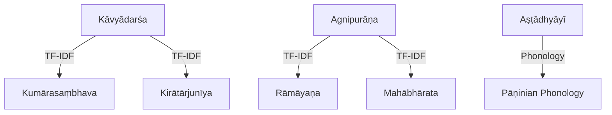

<cite>
**Referenced Files in This Document**
- [INDEX.md](file://INDEX.md)
- [kavyadarsa.md](file://kavyadarsa.md)
- [kavyalankara.md](file://kavyalankara.md)
- [kumarasambhava.md](file://kumarasambhava.md)
- [meghaduta.md](file://meghaduta.md)
- [buddhacarita.md](file://buddhacarita.md)
- [natyasastra.md](file://natyasastra.md)
- [rasadhyaya.md](file://rasadhyaya.md)
- [astadhyayi.md](file://astadhyayi.md)
- [paninian-phonology.md](file://paninian-phonology.md)
- [abhidhanacintamani.md](file://abhidhanacintamani.md)
</cite>

## Table of Contents
1. [Introduction](#introduction)
2. [Project Structure](#project-structure)
3. [Core Components](#core-components)
4. [Architecture Overview](#architecture-overview)
5. [Detailed Component Analysis](#detailed-component-analysis)
6. [Dependency Analysis](#dependency-analysis)
7. [Performance Considerations](#performance-considerations)
8. [Troubleshooting Guide](#troubleshooting-guide)
9. [Conclusion](#conclusion)
10. [Appendices](#appendices)

## Introduction
This document explains how to perform stylistic and linguistic analysis of classical kāvya literature using computational methods on a large, CoNLL-U parsed corpus of Sanskrit texts. It covers:
- Identification of alaṃkāra (poetic embellishments) via lexical and syntactic patterns
- Application of rasa theory through thematic and semantic feature extraction
- Meter and prosody analysis leveraging morphological and sandhi-aware tokenization
- Vocabulary richness measurement using lemma-based frequency distributions
- TF-IDF similarity calculations to reveal connections between texts and authors
- Use of CoNLL-U parsing for syntax, morphology, and semantic relationships
- Authorial fingerprinting, period-specific language features, and cross-cultural influences

The repository provides concept pages that summarize each text’s scope, CoNLL-U edition details, notable lemmas, and TF-IDF similarity rankings across the corpus. These artifacts enable reproducible computational analyses without requiring direct access to raw files.

## Project Structure
The repository organizes 260 topics with consistent metadata:
- Concept pages per text or theme (e.g., poetics treatises, major kāvyas, grammar works)
- Each page documents:
  - Description and tags
  - Sources (including raw directories when applicable)
  - Citations
  - Related texts ranked by TF-IDF cosine similarity over lemma usage
  - Notable lemmas with occurrence counts and links to concordance indices

**Diagram sources**
- [INDEX.md:1-20](file://INDEX.md#L1-L20)
- [kavyadarsa.md:1-12](file://kavyadarsa.md#L1-L12)
- [kumarasambhava.md:1-12](file://kumarasambhava.md#L1-L12)
- [meghaduta.md:1-12](file://meghaduta.md#L1-L12)
- [buddhacarita.md:1-12](file://buddhacarita.md#L1-L12)
- [natyasastra.md:1-12](file://natyasastra.md#L1-L12)
- [rasadhyaya.md:1-12](file://rasadhyaya.md#L1-L12)
- [astadhyayi.md:1-17](file://astadhyayi.md#L1-L17)
- [paninian-phonology.md:1-19](file://paninian-phonology.md#L1-L19)
- [abhidhanacintamani.md:1-21](file://abhidhanacintamani.md#L1-L21)

**Section sources**
- [INDEX.md:1-277](file://INDEX.md#L1-L277)

## Core Components
- Poetics and Alaṃkāraśāstra: foundational treatises defining poetic figures and aesthetic qualities; provide domain vocabulary for detection pipelines.
- Major Kāvyas: canonical poems with rich metaphorical language, complex compounds, and structured meters; ideal for stylometric and semantic studies.
- Rasa and Dramaturgy: theoretical frameworks and performance-oriented texts enabling thematic classification and emotional valence modeling.
- Grammar and Phonology: Pāṇinian rules and phonological descriptions underpinning robust morphological analysis, sandhi reconstruction, and token normalization.
- Lexicography: structured vocabularies (kośas) supporting semantic field mapping and cross-textual synonymy.

Key capabilities evidenced in the repository:
- TF-IDF similarity rankings across texts based on lemma usage
- Lemma frequency tables (“Notable Lemmas”) for vocabulary profiling
- CoNLL-U editions with full morphological analysis, lemma identification, and sandhi reconstruction

**Section sources**
- [kavyadarsa.md:1-48](file://kavyadarsa.md#L1-L48)
- [kumarasambhava.md:1-48](file://kumarasambhava.md#L1-L48)
- [meghaduta.md:1-48](file://meghaduta.md#L1-L48)
- [buddhacarita.md:1-58](file://buddhacarita.md#L1-L58)
- [natyasastra.md:1-48](file://natyasastra.md#L1-L48)
- [rasadhyaya.md:1-48](file://rasadhyaya.md#L1-L48)
- [astadhyayi.md:1-67](file://astadhyayi.md#L1-L67)
- [paninian-phonology.md:1-86](file://paninian-phonology.md#L1-L86)
- [abhidhanacintamani.md:1-85](file://abhidhanacintamani.md#L1-L85)

## Architecture Overview
A typical computational pipeline for stylistic and linguistic analysis of Sanskrit kāvya:

[No sources needed since this diagram shows conceptual workflow, not actual code structure]

## Detailed Component Analysis

### Poetics and Alaṃkāra Identification
- Treatises such as Kāvyādarśa and Kāvyālaṃkāra define categories of ornamentation and stylistic qualities. Their presence in the corpus enables building domain lexicons and rule sets for detecting metaphors, similes, hyperbole, and other figures.
- TF-IDF similarity highlights textual affinities among poetics works and kāvyas, indicating shared rhetorical strategies and genre conventions.

**Diagram sources**
- [kavyadarsa.md:1-48](file://kavyadarsa.md#L1-L48)
- [kavyalankara.md:1-12](file://kavyalankara.md#L1-L12)

**Section sources**
- [kavyadarsa.md:1-48](file://kavyadarsa.md#L1-L48)
- [kavyalankara.md:1-12](file://kavyalankara.md#L1-L12)

### Rasa Theory Application
- Rasa theory underpins emotional aesthetics in drama and poetry. The Nāṭyaśāstra provides foundational concepts; co-occurrence with kāvyas indicates practical application in literary works.
- Thematic lexicons derived from rasa-related lemmas can classify verses by dominant rasa (e.g., śṛṅgāra, karuṇa, vīra).

[No sources needed since this diagram shows conceptual workflow, not actual code structure]

**Section sources**
- [natyasastra.md:1-48](file://natyasastra.md#L1-L48)
- [buddhacarita.md:1-58](file://buddhacarita.md#L1-L58)

### Meter and Prosody Analysis
- CoNLL-U editions include morphological analysis and sandhi reconstruction, which are essential for accurate syllable counting and metrical pattern recognition.
- Pāṇinian phonology informs sound combinations and boundary handling critical for prosodic segmentation.

**Diagram sources**
- [astadhyayi.md:37-48](file://astadhyayi.md#L37-L48)
- [paninian-phonology.md:63-77](file://paninian-phonology.md#L63-L77)

**Section sources**
- [astadhyayi.md:1-67](file://astadhyayi.md#L1-L67)
- [paninian-phonology.md:1-86](file://paninian-phonology.md#L1-L86)

### Vocabulary Richness Measurement
- Lemma frequency tables (“Notable Lemmas”) enable type-token ratio, hapax legomena rates, and lexical diversity metrics per text.
- Cross-text comparisons via TF-IDF similarity reveal shared vocabulary domains and stylistic overlap.

**Section sources**
- [kumarasambhava.md:31-48](file://kumarasambhava.md#L31-L48)
- [meghaduta.md:31-48](file://meghaduta.md#L31-L48)
- [buddhacarita.md:31-58](file://buddhacarita.md#L31-L58)

### TF-IDF Similarity Calculations and Connections
- The repository computes TF-IDF cosine similarity over lemma usage to rank related texts. High similarity suggests shared authorial style, genre conventions, or period-specific diction.
- Examples:
  - Kāvyādarśa shows affinity with other poetics and kāvya texts, reflecting shared rhetorical vocabulary.
  - Purāṇic texts cluster together, indicating common narrative lexicon and formulaic expressions.

**Diagram sources**
- [kavyadarsa.md:15-30](file://kavyadarsa.md#L15-L30)
- [agnipurana.md:81-96](file://agnipurana.md#L81-L96)

**Section sources**
- [kavyadarsa.md:15-30](file://kavyadarsa.md#L15-L30)
- [agnipurana.md:81-96](file://agnipurana.md#L81-L96)

### CoNLL-U Parsing for Syntax, Morphology, and Semantics
- CoNLL-U editions provide:
  - Full morphological analysis (case, number, gender, verb tense/person)
  - Lemma identification and occurrence identifiers
  - Sandhi reconstruction for pre-sandhi forms
  - Dependency parsing for syntactic relations
  - Semantic codes for many entries (WordSem)
- These features support advanced analyses:
  - Syntactic complexity measures (dependency depth, clause boundaries)
  - Morphological richness (inflectional variety, derivational patterns)
  - Semantic role labeling and thematic role extraction

**Diagram sources**
- [astadhyayi.md:37-48](file://astadhyayi.md#L37-L48)
- [abhidhanacintamani.md:53-61](file://abhidhanacintamani.md#L53-L61)
- [acintyastava.md:50-58](file://acintyastava.md#L50-L58)

**Section sources**
- [astadhyayi.md:37-48](file://astadhyayi.md#L37-L48)
- [abhidhanacintamani.md:53-61](file://abhidhanacintamani.md#L53-L61)
- [acintyastava.md:50-58](file://acintyastava.md#L50-L58)

### Authorial Fingerprints, Period-Specific Features, and Cross-Cultural Influences
- Authorial fingerprints:
  - Compare lemma frequency profiles across texts by the same author (e.g., Kālidāsa’s Kumārasaṃbhava vs. Meghadūta) to identify stable stylistic markers.
  - Use TF-IDF similarity to detect intertextual influence and borrowing.
- Period-specific features:
  - Track shifts in lemma usage across centuries (e.g., Buddhist kāvya vs. later Purāṇic prose-poetry).
  - Analyze grammatical and phonological choices informed by Pāṇinian tradition.
- Cross-cultural influences:
  - Identify loanwords and semantic calques via lexicographic resources (kośas) and comparative lemma sets.
  - Examine thematic overlaps between Buddhist, Śaiva, and Vaiṣṇava corpora.

**Section sources**
- [kumarasambhava.md:15-30](file://kumarasambhava.md#L15-L30)
- [meghaduta.md:15-30](file://meghaduta.md#L15-L30)
- [buddhacarita.md:15-30](file://buddhacarita.md#L15-L30)
- [paninian-phonology.md:63-77](file://paninian-phonology.md#L63-L77)
- [abhidhanacintamani.md:23-47](file://abhidhanacintamani.md#L23-L47)

## Dependency Analysis
Concept pages depend on underlying CoNLL-U editions and reference materials. TF-IDF similarity creates implicit dependency edges between texts based on shared lemma distributions.

**Diagram sources**
- [kavyadarsa.md:15-30](file://kavyadarsa.md#L15-L30)
- [agnipurana.md:81-96](file://agnipurana.md#L81-L96)
- [astadhyayi.md:37-48](file://astadhyayi.md#L37-L48)
- [paninian-phonology.md:63-77](file://paninian-phonology.md#L63-L77)

**Section sources**
- [kavyadarsa.md:15-30](file://kavyadarsa.md#L15-L30)
- [agnipurana.md:81-96](file://agnipurana.md#L81-L96)
- [astadhyayi.md:37-48](file://astadhyayi.md#L37-L48)
- [paninian-phonology.md:63-77](file://paninian-phonology.md#L63-L77)

## Performance Considerations
- Tokenization and normalization:
  - Leverage CoNLL-U morphological features to handle sandhi and compound boundaries accurately before computing frequencies.
- Feature engineering:
  - Use lemma vectors rather than surface forms to reduce noise and improve TF-IDF stability.
- Scalability:
  - Precompute TF-IDF matrices and similarity scores for rapid querying across the corpus.
- Evaluation:
  - Validate alaṃkāra detection with manual annotations; assess rasa classification against established commentaries.

[No sources needed since this section provides general guidance]

## Troubleshooting Guide
Common issues and resolutions:
- Incorrect sandhi reconstruction:
  - Ensure preprocessing uses CoNLL-U metadata to restore pre-sandhi forms before meter analysis.
- Overfitting on frequent function words:
  - Filter stop words and focus on content lemmas for stylistic signals.
- Ambiguous lemma mappings:
  - Cross-check with lexicographic resources (kośas) and grammatical dictionaries to disambiguate homonyms.
- Inconsistent POS tagging:
  - Align tagsets with Pāṇinian categories where possible; use dependency parsing to resolve structural ambiguities.

**Section sources**
- [astadhyayi.md:37-48](file://astadhyayi.md#L37-L48)
- [paninian-phonology.md:63-77](file://paninian-phonology.md#L63-L77)
- [abhidhanacintamani.md:53-61](file://abhidhanacintamani.md#L53-L61)

## Conclusion
The repository’s CoNLL-U parsed editions and concept pages provide a robust foundation for computational stylistic and linguistic analysis of classical kāvya. By combining TF-IDF similarity, lemma frequency profiling, and morpho-syntactic parsing, researchers can:
- Detect alaṃkāra patterns grounded in poetics treatises
- Classify rasa themes using semantic lexicons
- Analyze meter and prosody with sandhi-aware tokenization
- Measure vocabulary richness and track diachronic shifts
- Identify authorial fingerprints and cross-cultural influences

These methods enable reproducible, data-driven insights into Sanskrit literary traditions while respecting their grammatical and aesthetic complexities.

[No sources needed since this section summarizes without analyzing specific files]

## Appendices

### Example Workflows Using Repository Artifacts
- Authorship attribution:
  - Compare lemma profiles of Kālidāsa’s works (Kumārasaṃbhava, Meghadūta) using TF-IDF similarity and frequency distributions.
- Period-specific features:
  - Contrast Buddhist kāvya (Buddhacarita) with later Purāṇic texts to observe shifts in vocabulary and thematic emphasis.
- Cross-cultural influences:
  - Use kośa-derived semantic fields to trace loanwords and conceptual borrowings across religious and philosophical corpora.

**Section sources**
- [kumarasambhava.md:15-30](file://kumarasambhava.md#L15-L30)
- [meghaduta.md:15-30](file://meghaduta.md#L15-L30)
- [buddhacarita.md:15-30](file://buddhacarita.md#L15-L30)
- [abhidhanacintamani.md:23-47](file://abhidhanacintamani.md#L23-L47)
