<cite>
**Referenced Files in This Document**
- [gitagovinda.md](file://gitagovinda.md)
- [devimahatmya.md](file://devimahatmya.md)
- [bhartrhari-and-the-vakyapadiya.md](file://bhartrhari-and-the-vakyapadiya.md)
- [acintyastava.md](file://acintyastava.md)
- [bhairavastava.md](file://bhairavastava.md)
- [mukundamala.md](file://mukundamala.md)
- [suryasataka.md](file://suryasataka.md)
- [abhinavacintamani.md](file://abhinavacintamani.md)
- [haribhaktivilasa.md](file://haribhaktivilasa.md)
- [krsnamrtamaharnava.md](file://krsnamrtamaharnava.md)
- [INDEX.md](file://INDEX.md)
</cite>

## Table of Contents
1. Introduction
2. Project Structure
3. Core Components
4. Architecture Overview
5. Detailed Component Analysis
6. Dependency Analysis
7. Performance Considerations
8. Troubleshooting Guide
9. Conclusion

## Introduction
This document provides a comprehensive overview of devotional Sanskrit poetry (stotra) and bhakti literature, focusing on theological themes, emotional expression, musicality, and computational analysis of vocabulary and prayer structures. It highlights key works such as Jayadeva’s Gītagovinda, the Devīmāhātmya, hymns by poets like Bhartṛhari, and other stotras across Vaishnavism, Shaivism, Shaktism, and Buddhist traditions. The repository includes CoNLL-U parsed editions that enable quantitative study of lemma frequencies, dependency patterns, and thematic evolution across traditions.

## Project Structure
The repository organizes texts as individual markdown concept files, each describing a work or topic with metadata, tags, sources, and computed lemma statistics. For devotional poetry:
- Stotra and bhakti texts are tagged accordingly (e.g., stotra, vaisnava, saiva, devi).
- Each file lists “Notable Lemmas” and “Related Texts,” enabling cross-text similarity via TF-IDF cosine scores.
- Many entries reference raw CoNLL-U files for morphological and syntactic analysis.

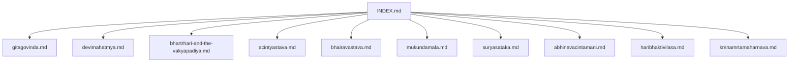

**Diagram sources**
- [INDEX.md:1-200](file://INDEX.md#L1-L200)

**Section sources**
- [INDEX.md:1-200](file://INDEX.md#L1-L200)

## Core Components
- Gītagovinda (Jayadeva): Lyrical depiction of divine love; high-frequency devotional lemmas such as second-person pronouns and deity names indicate intimate address and praise.
- Devīmāhātmya: Foundational Śākta narrative; lemma profiles reflect mythic and cosmological vocabulary.
- Acintyastava (Nāgārjuna): Madhyamaka devotional poem blending philosophical emptiness with devotion; frequent negation and metaphysical terms.
- Bhairavastava: Śaiva stotra to Bhairava; personal address and protective/transformative imagery.
- Mukundamālā (Kulaśekhara Āḻvār): Vaiṣṇava stotra emphasizing surrender and praise of Kṛṣṇa/Mukunda.
- Sūryaśataka (Mayūrabhaṭṭa): Hundred verses praising the Sun god; directional and cosmic imagery.
- Abhinavacintāmaṇi: Stotra dramatizing Kṛṣṇa’s līlā through elemental inversions; wish-fulfilling metaphor.
- Haribhaktivilāsa: Gauḍīya Vaiṣṇava manual on ritual and bhakti rules; extensive procedural vocabulary.
- Kṛṣṇāmṛtamahārṇava: Vaiṣṇava devotional text celebrating divine qualities and play.

These components collectively illustrate how stotra combines theology, emotion, and musical form, while their CoNLL-U annotations support computational analysis of devotional language.

**Section sources**
- [gitagovinda.md:1-48](file://gitagovinda.md#L1-L48)
- [devimahatmya.md:1-30](file://devimahatmya.md#L1-L30)
- [acintyastava.md:1-111](file://acintyastava.md#L1-L111)
- [bhairavastava.md:1-40](file://bhairavastava.md#L1-L40)
- [mukundamala.md:1-48](file://mukundamala.md#L1-L48)
- [suryasataka.md:1-48](file://suryasataka.md#L1-L48)
- [abhinavacintamani.md:1-94](file://abhinavacintamani.md#L1-L94)
- [haribhaktivilasa.md:1-48](file://haribhaktivilasa.md#L1-L48)
- [krsnamrtamaharnava.md:1-48](file://krsnamrtamaharnava.md#L1-L48)

## Architecture Overview
The conceptual architecture of devotional poetry in this corpus can be viewed as a layered system:
- Theological layer: Doctrinal content (bhakti, śūnyatā, līlā, goddess glory).
- Poetic-musical layer: Meter, rhyme, and lyrical devices suited for chanting and performance.
- Computational layer: CoNLL-U parsing enables lemma frequency analysis, dependency structure inspection, and cross-text similarity.

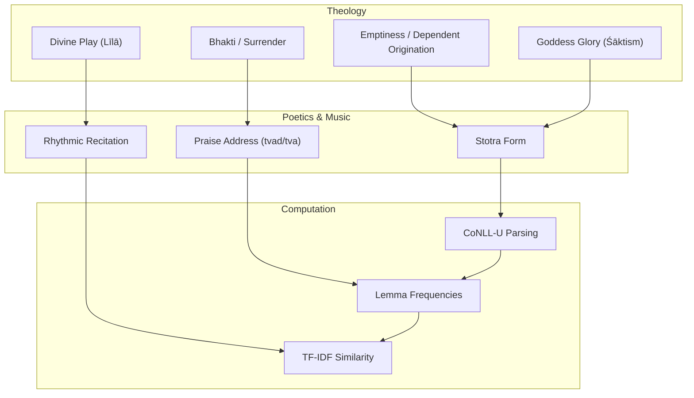

[No sources needed since this diagram shows conceptual workflow, not actual code structure]

## Detailed Component Analysis

### Gītagovinda (Jayadeva)
- Theological focus: Divine love between Rādhā and Kṛṣṇa; intimacy expressed through second-person address and epithets.
- Emotional expression: Yearning, separation, union; lyrical intensity suitable for musical rendering.
- Musical qualities: Structured for performance; rhythmic phrasing supports classical dance-drama traditions.
- Computational insights: High frequency of personal pronouns and deity names indicates direct address and devotional focus; related texts include epic and Purāṇic narratives.

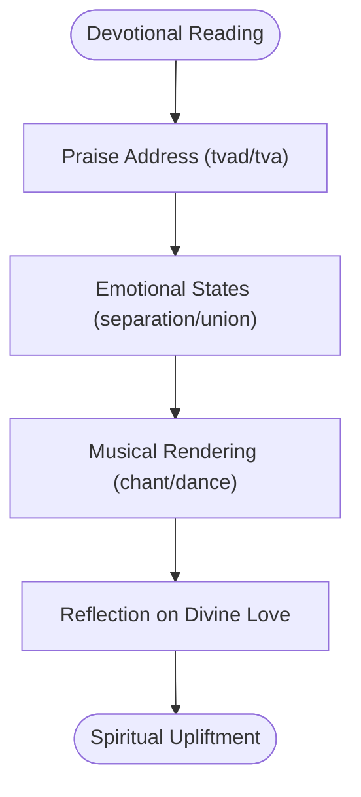

**Section sources**
- [gitagovinda.md:1-48](file://gitagovinda.md#L1-L48)

### Devīmāhātmya (Śāktism)
- Theological focus: Glorification of the Goddess; battles against demons symbolize triumph of divine power.
- Emotional expression: Awe, protection, empowerment; narrative-driven devotion.
- Computational insights: Lemma distribution reflects mythic and cosmological vocabulary; serves as a foundational Śākta text.

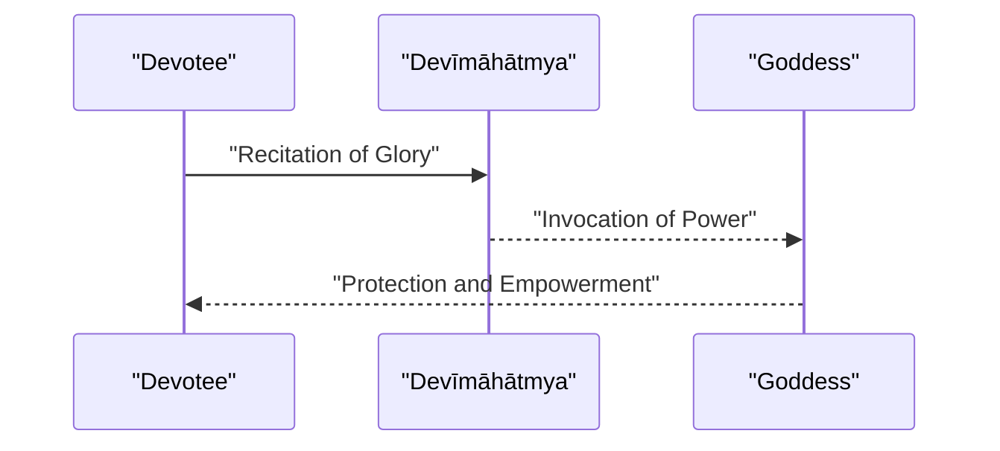

**Section sources**
- [devimahatmya.md:1-30](file://devimahatmya.md#L1-L30)

### Acintyastava (Nāgārjuna)
- Theological focus: Emptiness (śūnyatā) and dependent origination; devotion to the Buddha’s insight.
- Emotional expression: Reverence for inconceivable truth; intellectual devotion merged with bhakti.
- Computational insights: Frequent negation and metaphysical terms; strong philosophical vocabulary alongside devotional address.

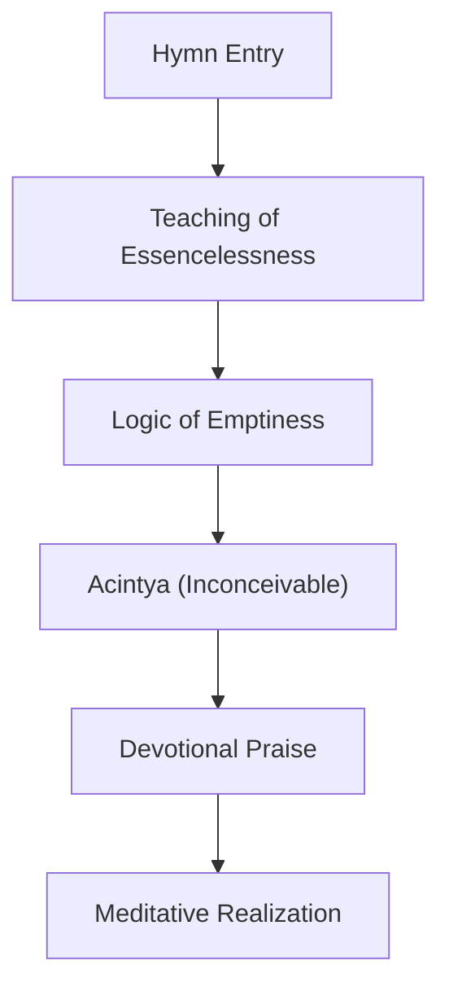

**Section sources**
- [acintyastava.md:1-111](file://acintyastava.md#L1-L111)

### Bhairavastava (Shaivism)
- Theological focus: Praise of Bhairava as fierce protector; tantric practice context.
- Emotional expression: Fear, reverence, transformation; invocation for protection and liberation.
- Computational insights: Personal address and protective terminology; lemma profile aligns with Śaiva stotra conventions.

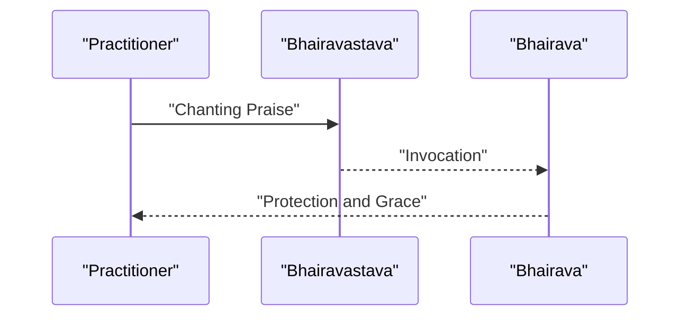

**Section sources**
- [bhairavastava.md:1-40](file://bhairavastava.md#L1-L40)

### Mukundamālā (Vaiṣṇava)
- Theological focus: Surrender to Kṛṣṇa/Mukunda; classic bhakti stotra.
- Emotional expression: Devotional longing, gratitude, and devotion.
- Computational insights: Pronoun usage and deity names highlight direct address; related texts include Vaiṣṇava Purāṇas.

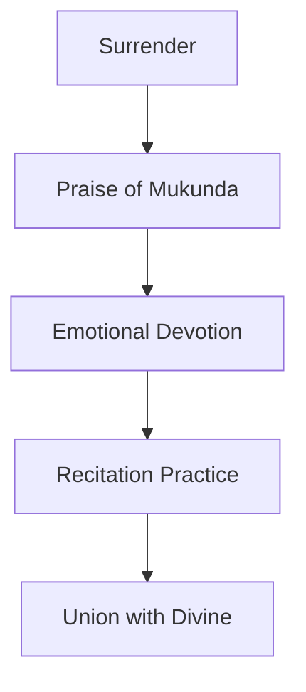

**Section sources**
- [mukundamala.md:1-48](file://mukundamala.md#L1-L48)

### Sūryaśataka (Solar Devotion)
- Theological focus: Praise of Sūrya; cosmic and directional imagery.
- Emotional expression: Reverence for light and order; meditative contemplation.
- Computational insights: Lemma patterns emphasize cosmic terms and address forms.

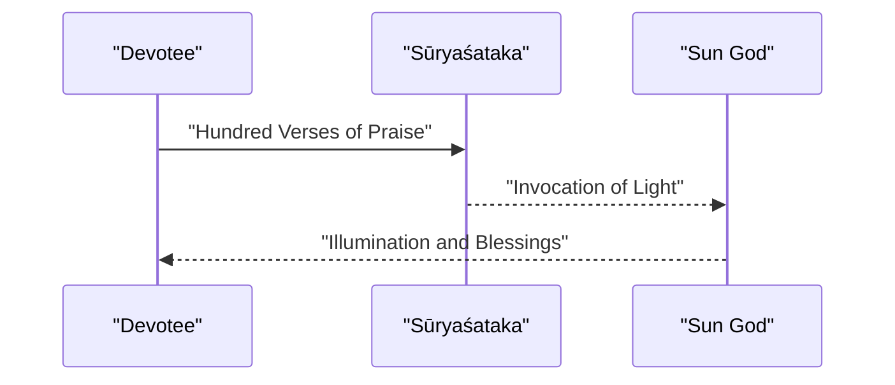

**Section sources**
- [suryasataka.md:1-48](file://suryasataka.md#L1-L48)

### Abhinavacintāmaṇi (Kṛṣṇa Stotra)
- Theological focus: Kṛṣṇa’s līlā through elemental inversions; wish-fulfilling metaphor.
- Emotional expression: Wonder at divine play; transformative devotion.
- Computational insights: Rich descriptive vocabulary; CoNLL-U parsing supports detailed morphological and dependency analysis.

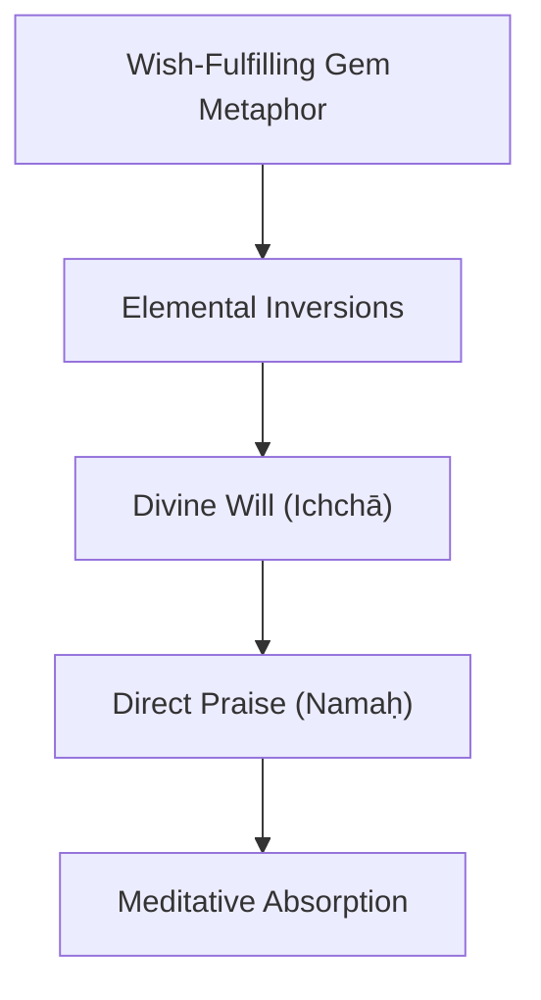

**Section sources**
- [abhinavacintamani.md:1-94](file://abhinavacintamani.md#L1-L94)

### Haribhaktivilāsa (Vaiṣṇava Manual)
- Theological focus: Rules and rituals of bhakti; Gauḍīya tradition.
- Emotional expression: Structured devotion; discipline and delight in Hari’s service.
- Computational insights: Extensive procedural vocabulary; high lemma counts reflect detailed instructions.

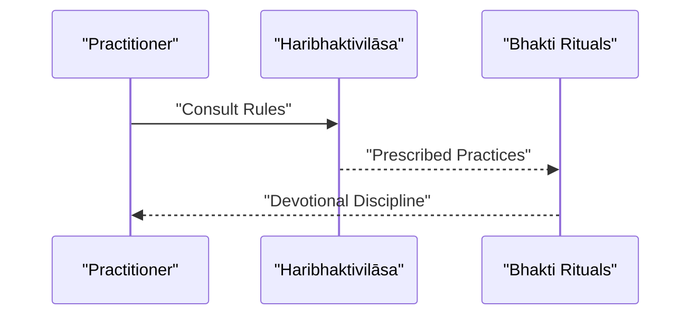

**Section sources**
- [haribhaktivilasa.md:1-48](file://haribhaktivilasa.md#L1-L48)

### Kṛṣṇāmṛtamahārṇava (Vaiṣṇava Devotional Text)
- Theological focus: Celebrating Kṛṣṇa’s qualities and play; oceanic metaphor for nectar-like devotion.
- Emotional expression: Joy, awe, and deep affection.
- Computational insights: Lemma distribution emphasizes deity names and action verbs; related texts include Purāṇic narratives.

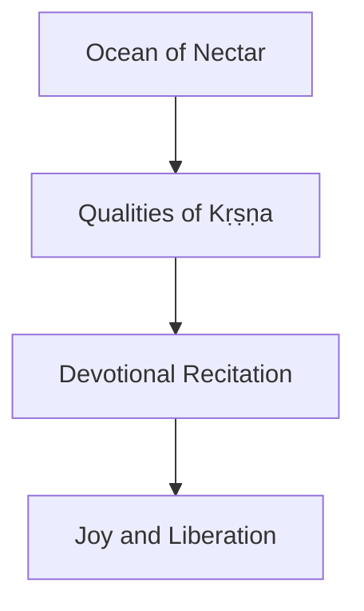

**Section sources**
- [krsnamrtamaharnava.md:1-48](file://krsnamrtamaharnava.md#L1-L48)

### Conceptual Overview
Across traditions, stotra poetry integrates theology, emotion, and musicality. Computational methods reveal patterns:
- Personal address (tvad/tva) signals intimate devotion.
- Negation and metaphysical terms appear in Buddhist stotras.
- Cosmic and protective vocabulary dominate Śaiva and Śākta texts.
- Related-text similarity maps thematic clusters across traditions.

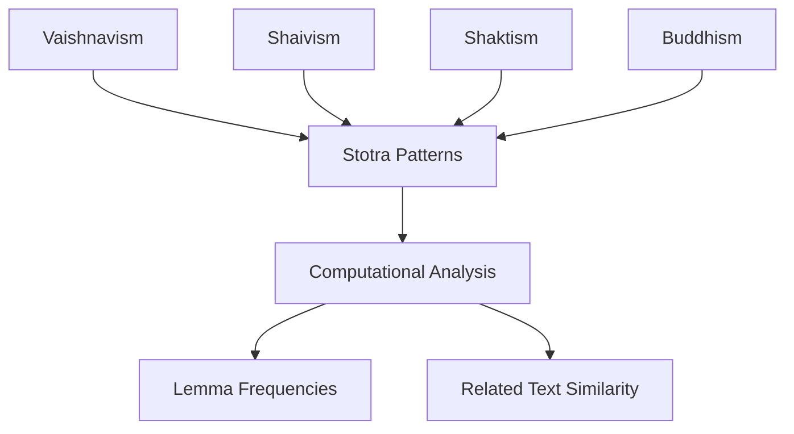

[No sources needed since this diagram shows conceptual workflow, not actual code structure]

## Dependency Analysis
Cross-text relationships emerge from lemma-based similarity:
- Gītagovinda relates closely to poetic and Purāṇic texts.
- Vaiṣṇava manuals cluster with Purāṇas and sectarian texts.
- Śaiva and Śākta stotras show distinct lexical profiles aligned with their theological concerns.

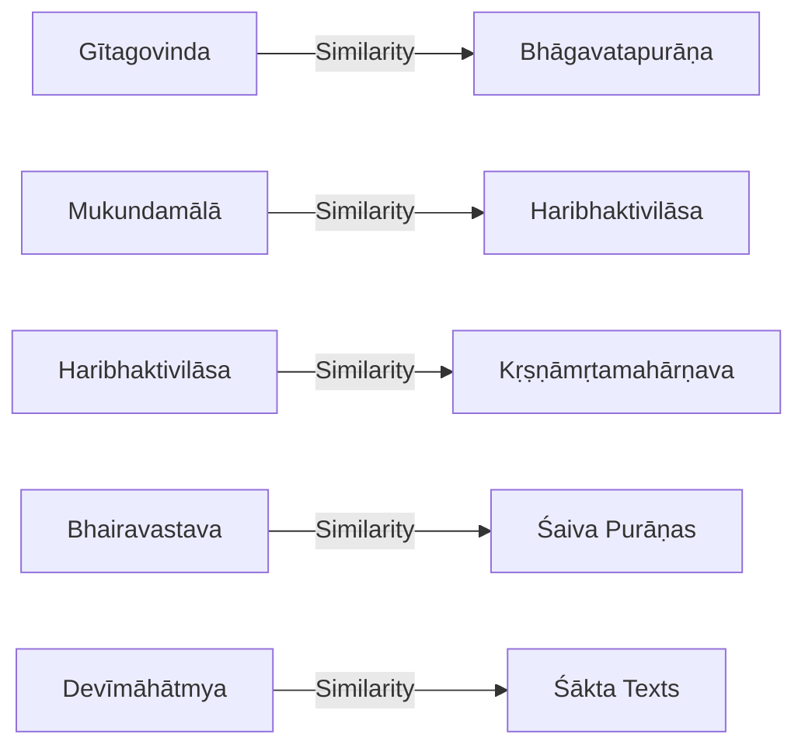

**Section sources**
- [gitagovinda.md:1-48](file://gitagovinda.md#L1-L48)
- [mukundamala.md:1-48](file://mukundamala.md#L1-L48)
- [haribhaktivilasa.md:1-48](file://haribhaktivilasa.md#L1-L48)
- [krsnamrtamaharnava.md:1-48](file://krsnamrtamaharnava.md#L1-L48)
- [bhairavastava.md:1-40](file://bhairavastava.md#L1-L40)
- [devimahatmya.md:1-30](file://devimahatmya.md#L1-L30)

## Performance Considerations
- Lemma frequency analysis is efficient for large corpora; CoNLL-U parsing enables scalable computation.
- TF-IDF similarity provides quick clustering of thematic groups across traditions.
- Dependency parsing supports deeper syntactic analysis but may require more resources; prioritize based on research goals.

[No sources needed since this section provides general guidance]

## Troubleshooting Guide
- If lemma indices are missing, verify CoNLL-U parsing pipelines and ensure consistent tokenization and normalization.
- For unexpected similarity scores, check preprocessing steps (stopword handling, lemmatization quality).
- When analyzing philosophical stotras, ensure domain-specific lexicons (e.g., Madhyamaka terms) are correctly recognized.

[No sources needed since this section provides general guidance]

## Conclusion
Devotional Sanskrit poetry spans multiple traditions, each with distinct theological emphases, emotional tones, and musical forms. The repository’s CoNLL-U annotated texts enable robust computational analysis of vocabulary, structure, and thematic evolution. By combining literary appreciation with data-driven insights, researchers can trace patterns in bhakti language and spiritual expression across Vaishnavism, Shaivism, Shaktism, and Buddhism.

[No sources needed since this section summarizes without analyzing specific files]
