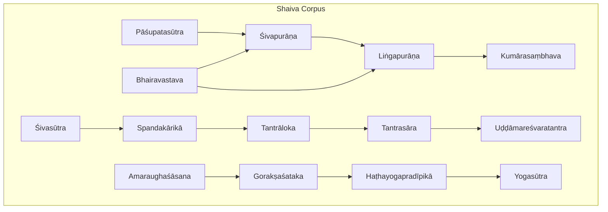
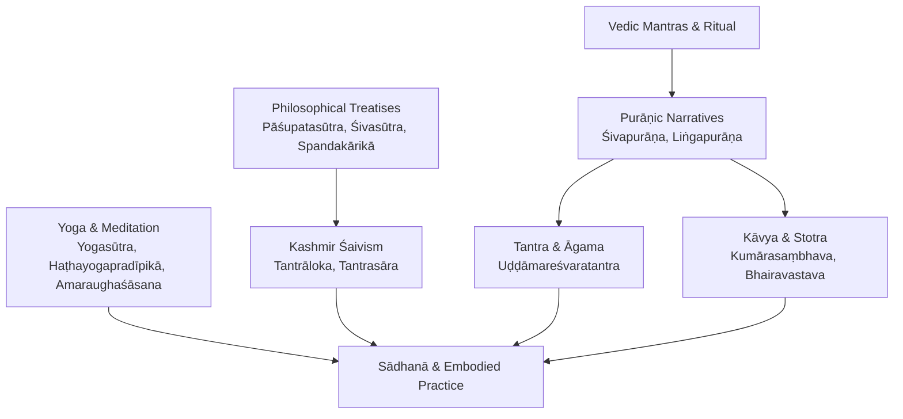
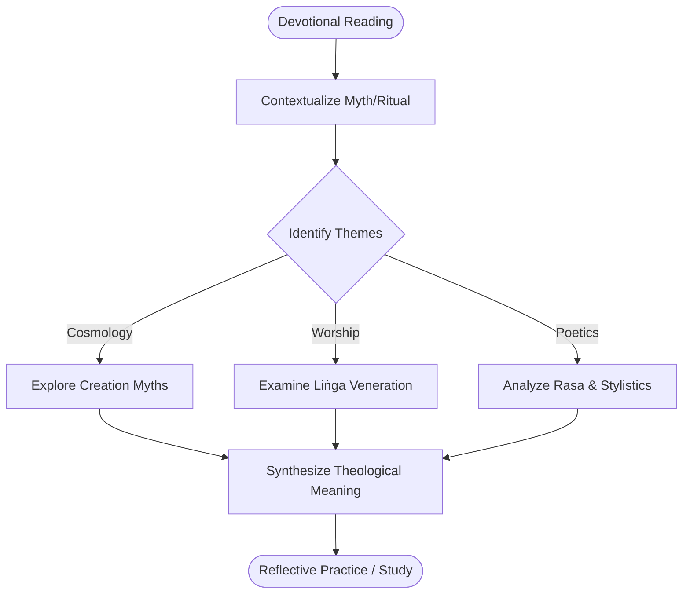
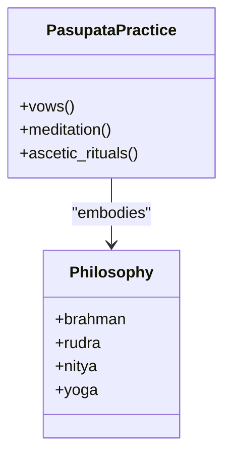
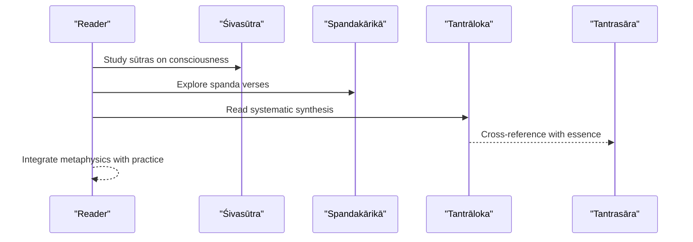
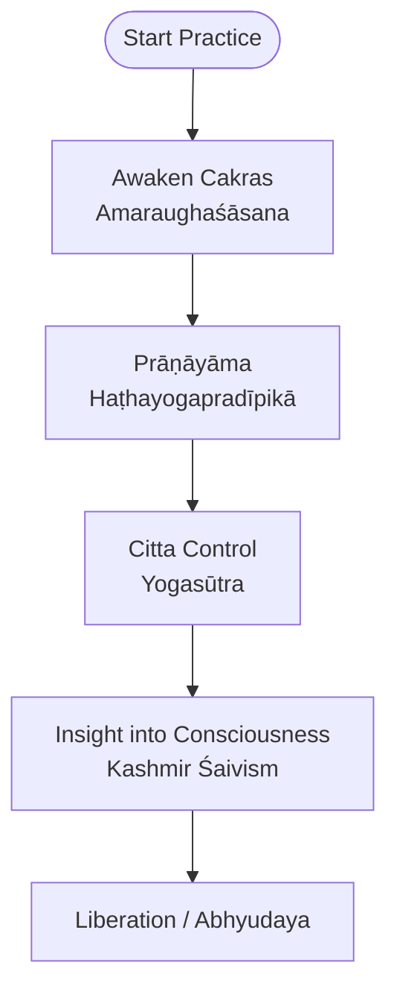
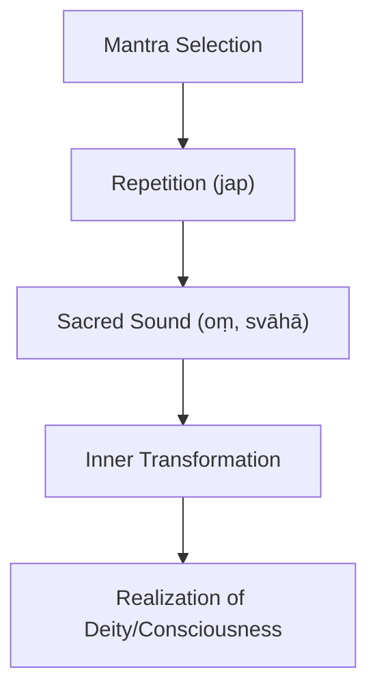
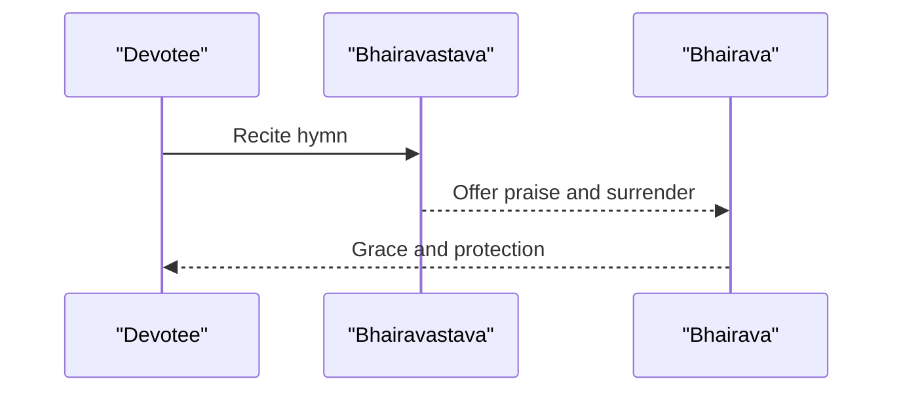
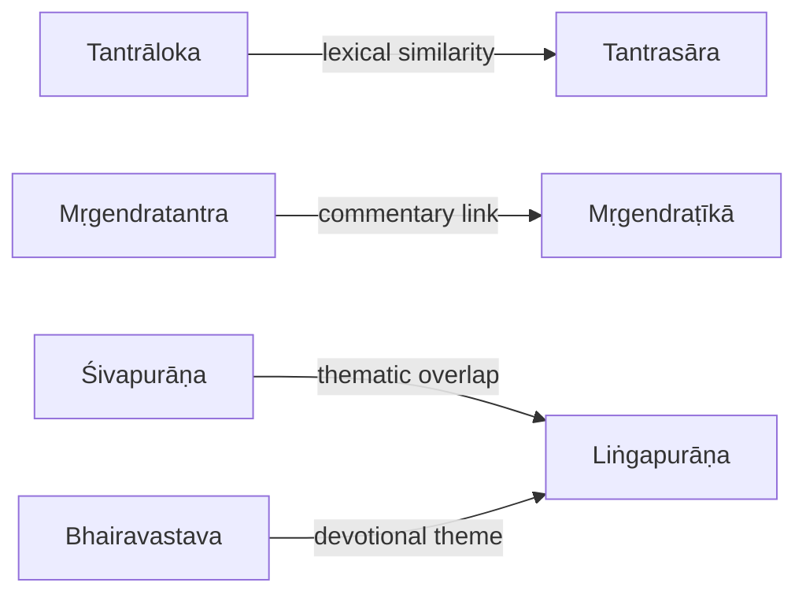

<cite>
**Referenced Files in This Document**
- [INDEX.md](file://INDEX.md)
- [Bhairavastava.md](file://bhairavastava.md)
- [Śivapurāṇa.md](file://sivapurana.md)
- [Liṅgapurāṇa.md](file://lingapurana.md)
- [Pāśupatasūtra.md](file://pasupatasutra.md)
- [Śivasūtra.md](file://sivasutra.md)
- [Tantrāloka.md](file://tantraloka.md)
- [Tantrasāra.md](file://tantrasara.md)
- [Spandakārikā.md](file://spandakarika.md)
- [Mṛgendratantra.md](file://mrgendratantra.md)
- [Uḍḍāmareśvaratantra.md](file://uddamaresvaratantra.md)
- [Amaraughaśāsana.md](file://amaraughasasana.md)
- [Gorakṣaśataka.md](file://goraksasataka.md)
- [Haṭhayogapradīpikā.md](file://hathayogapradipika.md)
- [Yogasūtra.md](file://yogasutra.md)
- [Kumārasaṃbhava.md](file://kumarasambhava.md)
</cite>

## Table of Contents
1. Introduction
2. Project Structure
3. Core Components
4. Architecture Overview
5. Detailed Component Analysis
6. Dependency Analysis
7. Performance Considerations
8. Troubleshooting Guide
9. Conclusion
10. Appendices

## Introduction
This document provides a comprehensive guide to Shaiva devotional poetry and related traditions within the repository, covering both orthodox (Vedic–Puranic) and tantric streams. It explains how computational analysis of Sanskrit corpora reveals patterns in vocabulary, themes, and intertextual relationships across philosophical treatises and devotional literature. The focus includes:
- Philosophical underpinnings of Shaivism across Pāśupata, Purāṇic, and Kashmir Śaiva/Tantric traditions
- Representation of Shiva in stotra, kāvya, and Āgama contexts
- Integration of yoga and meditation practices into poetic expression
- Computational insights from lemma frequencies, similarity networks, and concordance indices
- Evolution from Vedic mantras to Purāṇic narratives to Tantric mantric composition
- Use of mantras and sacred sounds (nāda, oṃ, svāhā) in devotional texts

## Project Structure
The repository organizes each text as a concept page with metadata, tags, and computed lexical statistics (notable lemmas, related texts by cosine similarity). For Shaiva studies, key files include:
- Orthodox/epic/Puranic: Śivapurāṇa, Liṅgapurāṇa, Kumārasaṃbhava
- Early ascetic/philosophical: Pāśupatasūtra
- Kashmir Śaivism/Tantra: Śivasūtra, Spandakārikā, Tantrāloka, Tantrasāra
- Yoga and subtle body: Amaraughaśāsana, Gorakṣaśataka, Haṭhayogapradīpikā, Yogasūtra
- Mantra-heavy Tantra: Uḍḍāmareśvaratantra
- Stotra: Bhairavastava

**Diagram sources**
- [Pāśupatasūtra.md:1-30](file://pasupatasutra.md#L1-L30)
- [Śivapurāṇa.md:1-12](file://sivapurana.md#L1-L12)
- [Liṅgapurāṇa.md:1-48](file://lingapurana.md#L1-L48)
- [Kumārasaṃbhava.md:1-48](file://kumarasambhava.md#L1-L48)
- [Śivasūtra.md:1-12](file://sivasutra.md#L1-L12)
- [Spandakārikā.md:1-30](file://spandakarika.md#L1-L30)
- [Tantrāloka.md:1-48](file://tantraloka.md#L1-L48)
- [Tantrasāra.md:1-48](file://tantrasara.md#L1-L48)
- [Uḍḍāmareśvaratantra.md:1-48](file://uddamaresvaratantra.md#L1-L48)
- [Amaraughaśāsana.md:1-94](file://amaraughasasana.md#L1-L94)
- [Gorakṣaśataka.md:1-48](file://goraksasataka.md#L1-L48)
- [Haṭhayogapradīpikā.md:1-48](file://hathayogapradipika.md#L1-L48)
- [Yogasūtra.md:1-48](file://yogasutra.md#L1-L48)
- [Bhairavastava.md:1-40](file://bhairavastava.md#L1-L40)

**Section sources**
- [INDEX.md:1-277](file://INDEX.md#L1-L277)

## Core Components
- Orthodox Shaiva devotion and narrative:
  - Śivapurāṇa and Liṅgapurāṇa provide mythic and ritual foundations for Shiva worship, including cosmology, pilgrimage, and liṅga veneration.
  - Kumārasaṃbhava exemplifies classical kāvya celebrating Shiva’s marriage and progeny, integrating aesthetic rasa with theological themes.
- Ascetic and philosophical Shaivism:
  - Pāśupatasūtra codifies vows, practices, and early ascetic philosophy centered on Rudra-Shiva.
- Kashmir Śaivism and Tantra:
  - Śivasūtra and Spandakārikā articulate metaphysics of consciousness and dynamic vibration (spanda).
  - Tantrāloka and Tantrasāra synthesize Trika philosophy, aesthetics, and ritual; they show strong lexical overlap with each other and with commentarial works.
- Yoga and meditation integration:
  - Amaraughaśāsana, Gorakṣaśataka, Haṭhayogapradīpikā, and Yogasūtra describe subtle anatomy, breath control, and meditative absorption, often framed within Shaiva or broader yogic worldviews.
- Mantra and sacred sound:
  - Uḍḍāmareśvaratantra exhibits high frequency of mantra-related lemmas (mantra, oṃ, svāhā, jap), evidencing mantric composition and practice.
- Stotra tradition:
  - Bhairavastava is a focused hymn to Bhairava, reflecting personal devotion and protective aspects of Shiva.

Computational indicators:
- Lemma frequency tables per file reveal thematic emphasis (e.g., mantra-heavy Tantra vs. narrative-heavy Purāṇa).
- Cosine-similarity “Related Texts” lists expose intertextual clusters (e.g., Tantrāloka ↔ Tantrasāra; Mṛgendratantra ↔ its commentary).

**Section sources**
- [Śivapurāṇa.md:1-12](file://sivapurana.md#L1-L12)
- [Liṅgapurāṇa.md:1-48](file://lingapurana.md#L1-L48)
- [Kumārasaṃbhava.md:1-48](file://kumarasambhava.md#L1-L48)
- [Pāśupatasūtra.md:1-30](file://pasupatasutra.md#L1-L30)
- [Śivasūtra.md:1-12](file://sivasutra.md#L1-L12)
- [Spandakārikā.md:1-30](file://spandakarika.md#L1-L30)
- [Tantrāloka.md:1-48](file://tantraloka.md#L1-L48)
- [Tantrasāra.md:1-48](file://tantrasara.md#L1-L48)
- [Amaraughaśāsana.md:1-94](file://amaraughasasana.md#L1-L94)
- [Gorakṣaśataka.md:1-48](file://goraksasataka.md#L1-L48)
- [Haṭhayogapradīpikā.md:1-48](file://hathayogapradipika.md#L1-L48)
- [Yogasūtra.md:1-48](file://yogasutra.md#L1-L48)
- [Uḍḍāmareśvaratantra.md:1-48](file://uddamaresvaratantra.md#L1-L48)
- [Bhairavastava.md:1-40](file://bhairavastava.md#L1-L40)

## Architecture Overview
The corpus can be viewed as layered traditions that inform one another:
- Vedic roots and mantric heritage underpin later Purāṇic and Tantric compositions.
- Purāṇic narratives popularize Shiva theology and iconography, feeding into kāvya and stotra genres.
- Kashmir Śaivism systematizes metaphysics and aesthetics, influencing both philosophical discourse and devotional poetics.
- Yoga texts integrate meditative techniques into spiritual practice, often referencing Shiva as the supreme guru or principle.

[No sources needed since this diagram shows conceptual workflow, not actual code structure]

## Detailed Component Analysis

### Orthodox Shaiva Narrative and Devotion
- Śivapurāṇa and Liṅgapurāṇa present Shiva’s cosmic roles, myths, and ritual frameworks. Their lemma profiles emphasize connective particles and pronouns typical of narrative prose/verse, while also featuring deity terms like deva.
- Kumārasaṃbhava demonstrates classical courtly style with elevated diction, frequent use of demonstratives and second-person forms in praise, aligning with śṛṅgāra and vīra rasas.

**Section sources**
- [Śivapurāṇa.md:1-12](file://sivapurana.md#L1-L12)
- [Liṅgapurāṇa.md:1-48](file://lingapurana.md#L1-L48)
- [Kumārasaṃbhava.md:1-48](file://kumarasambhava.md#L1-L48)

### Early Ascetic Shaivism: Pāśupata Tradition
- Pāśupatasūtra establishes foundational vows and practices for ascetics devoted to Rudra-Shiva. Its lemma profile highlights core philosophical terms such as brahman, rudra, nitya, and yoga, indicating a blend of metaphysics and disciplined practice.

**Diagram sources**
- [Pāśupatasūtra.md:1-30](file://pasupatasutra.md#L1-L30)

**Section sources**
- [Pāśupatasūtra.md:1-30](file://pasupatasutra.md#L1-L30)

### Kashmir Śaivism and Tantric Metaphysics
- Śivasūtra and Spandakārikā articulate the nature of consciousness and spanda (divine vibration). Their lemma distributions reflect concise aphoristic style with frequent logical connectors and existential verbs.
- Tantrāloka and Tantrasāra form a tight lexical cluster, showing deep intertextuality and shared terminology around consciousness, form, and ritual.

**Diagram sources**
- [Śivasūtra.md:1-12](file://sivasutra.md#L1-L12)
- [Spandakārikā.md:1-30](file://spandakarika.md#L1-L30)
- [Tantrāloka.md:1-48](file://tantraloka.md#L1-L48)
- [Tantrasāra.md:1-48](file://tantrasara.md#L1-L48)

**Section sources**
- [Śivasūtra.md:1-12](file://sivasutra.md#L1-L12)
- [Spandakārikā.md:1-30](file://spandakarika.md#L1-L30)
- [Tantrāloka.md:1-48](file://tantraloka.md#L1-L48)
- [Tantrasāra.md:1-48](file://tantrasara.md#L1-L48)

### Yoga, Meditation, and Subtle Anatomy in Shaiva Contexts
- Amaraughaśāsana describes the descent of ūrdhvaśakti through cakras and outlines six paths (ṣaḍadhvagā) of reality, bridging Shaiva metaphysics with embodied practice.
- Gorakṣaśataka and Haṭhayogapradīpikā detail practical techniques (cakras, prāṇāyāma, mudrās) aligned with liberation goals.
- Yogasūtra provides a foundational framework for mind-stilling and kaivalya, frequently referenced across traditions.

**Diagram sources**
- [Amaraughaśāsana.md:1-94](file://amaraughasasana.md#L1-L94)
- [Gorakṣaśataka.md:1-48](file://goraksasataka.md#L1-L48)
- [Haṭhayogapradīpikā.md:1-48](file://hathayogapradipika.md#L1-L48)
- [Yogasūtra.md:1-48](file://yogasutra.md#L1-L48)

**Section sources**
- [Amaraughaśāsana.md:1-94](file://amaraughasasana.md#L1-L94)
- [Gorakṣaśataka.md:1-48](file://goraksasataka.md#L1-L48)
- [Haṭhayogapradīpikā.md:1-48](file://hathayogapradipika.md#L1-L48)
- [Yogasūtra.md:1-48](file://yogasutra.md#L1-L48)

### Mantra and Sacred Sound in Tantric Composition
- Uḍḍāmareśvaratantra exhibits high-frequency mantra-related lemmas (mantra, oṃ, svāhā, jap), evidencing a compositional style centered on sacred sound and sādhanā.
- Computational similarity links show connections to Purāṇic and ritual manuals, indicating cross-traditional resonance in mantric usage.

**Diagram sources**
- [Uḍḍāmareśvaratantra.md:1-48](file://uddamaresvaratantra.md#L1-L48)

**Section sources**
- [Uḍḍāmareśvaratantra.md:1-48](file://uddamaresvaratantra.md#L1-L48)

### Stotra Tradition: Personal Devotion to Bhairava
- Bhairavastava focuses on Bhairava as protector and destroyer of evil, with lemma patterns emphasizing first- and second-person address (tvad, mad, maya), indicative of intimate devotional address.

**Diagram sources**
- [Bhairavastava.md:1-40](file://bhairavastava.md#L1-L40)

**Section sources**
- [Bhairavastava.md:1-40](file://bhairavastava.md#L1-L40)

## Dependency Analysis
Inter-textual dependencies are evident in lemma-based similarity and commentary relationships:
- Tantrāloka and Tantrasāra share a strong lexical bond, reflecting summary-commentary dynamics.
- Mṛgendratantra and its commentary (Mṛgendraṭīkā) exhibit close similarity, indicating direct exegetical linkage.
- Purāṇic texts cluster together, showing shared narrative and ritual vocabulary.

**Diagram sources**
- [Tantrāloka.md:1-48](file://tantraloka.md#L1-L48)
- [Tantrasāra.md:1-48](file://tantrasara.md#L1-L48)
- [Mṛgendratantra.md:1-48](file://mrgendratantra.md#L1-L48)
- [Śivapurāṇa.md:1-12](file://sivapurana.md#L1-L12)
- [Liṅgapurāṇa.md:1-48](file://lingapurana.md#L1-L48)
- [Bhairavastava.md:1-40](file://bhairavastava.md#L1-L40)

**Section sources**
- [Tantrāloka.md:1-48](file://tantraloka.md#L1-L48)
- [Tantrasāra.md:1-48](file://tantrasara.md#L1-L48)
- [Mṛgendratantra.md:1-48](file://mrgendratantra.md#L1-L48)
- [Śivapurāṇa.md:1-12](file://sivapurana.md#L1-L12)
- [Liṅgapurāṇa.md:1-48](file://lingapurana.md#L1-L48)
- [Bhairavastava.md:1-40](file://bhairavastava.md#L1-L40)

## Performance Considerations
- Lexical density and genre: Purāṇic narratives typically have higher token counts and more connective particles; stotra and sūtra texts are denser in technical or devotional terms.
- Similarity thresholds: Cosine similarity helps identify commentary pairs and thematic clusters but should be interpreted alongside genre and period context.
- Concordance utility: Lemma concordances enable targeted exploration of key terms (e.g., mantra, bhairava, shakti) across traditions.

[No sources needed since this section provides general guidance]

## Troubleshooting Guide
- Misclassification risk: Ensure correct tagging (e.g., saiva vs. sakta) when analyzing texts with overlapping deities or practices.
- Overlap between traditions: Some texts blend Purāṇic and Tantric elements; use multiple signals (lemma profiles, similarity lists, tags) to disambiguate.
- Interpretation of similarity: High similarity does not imply direct borrowing; consider historical context and genre conventions.

[No sources needed since this section provides general guidance]

## Conclusion
The repository offers a rich, computationally enriched corpus for studying Shaiva devotional poetry and related traditions. By combining philosophical treatises, Purāṇic narratives, stotras, and yoga manuals, researchers can trace the evolution of Shiva representation and practice from Vedic roots through Purāṇic storytelling to Tantric mantric and contemplative systems. Computational tools—lemma frequency, concordance, and similarity networks—reveal intertextual relationships and thematic continuities that enrich both scholarly understanding and devotional study.

[No sources needed since this section summarizes without analyzing specific files]

## Appendices

### Appendix A: Computational Indicators Across Key Texts
- Notable lemmas highlight thematic focus:
  - Mantra-heavy: Uḍḍāmareśvaratantra (mantra, oṃ, svāhā, jap)
  - Devotional address: Bhairavastava (tvad, mad, maya)
  - Philosophical precision: Pāśupatasūtra (brahman, rudra, nitya, yoga)
  - Kashmir synthesis: Tantrāloka and Tantrasāra (tad, eva, ca, iti)
- Related-text similarity clusters:
  - Tantrāloka ↔ Tantrasāra
  - Mṛgendratantra ↔ Mṛgendraṭīkā
  - Purāṇic clustering among major Mahāpurāṇas

**Section sources**
- [Uḍḍāmareśvaratantra.md:1-48](file://uddamaresvaratantra.md#L1-L48)
- [Bhairavastava.md:1-40](file://bhairavastava.md#L1-L40)
- [Pāśupatasūtra.md:1-30](file://pasupatasutra.md#L1-L30)
- [Tantrāloka.md:1-48](file://tantraloka.md#L1-L48)
- [Tantrasāra.md:1-48](file://tantrasara.md#L1-L48)

### Appendix B: Evolution from Vedic to Purāṇic to Tantric Styles
- Vedic mantras establish sacred sound and ritual efficacy.
- Purāṇic narratives expand theological scope and popularize Shiva’s roles.
- Tantric texts systematize metaphysics, aesthetics, and mantric practice, often integrating yoga and subtle anatomy.

[No sources needed since this section provides general guidance]
