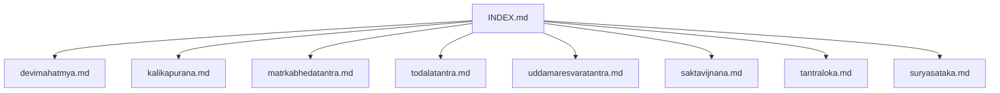
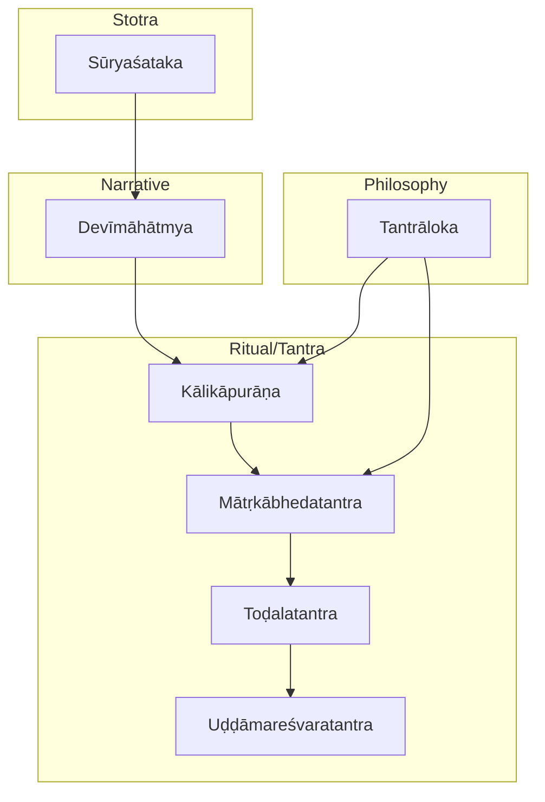
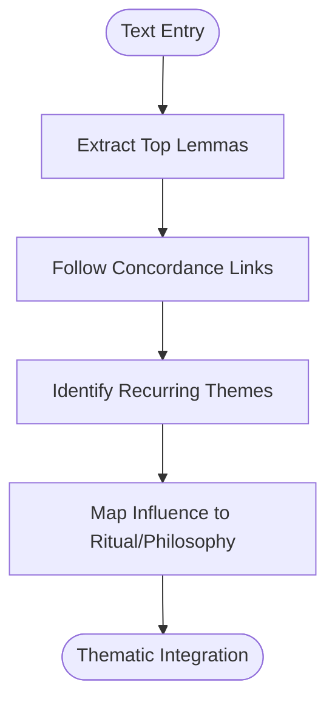
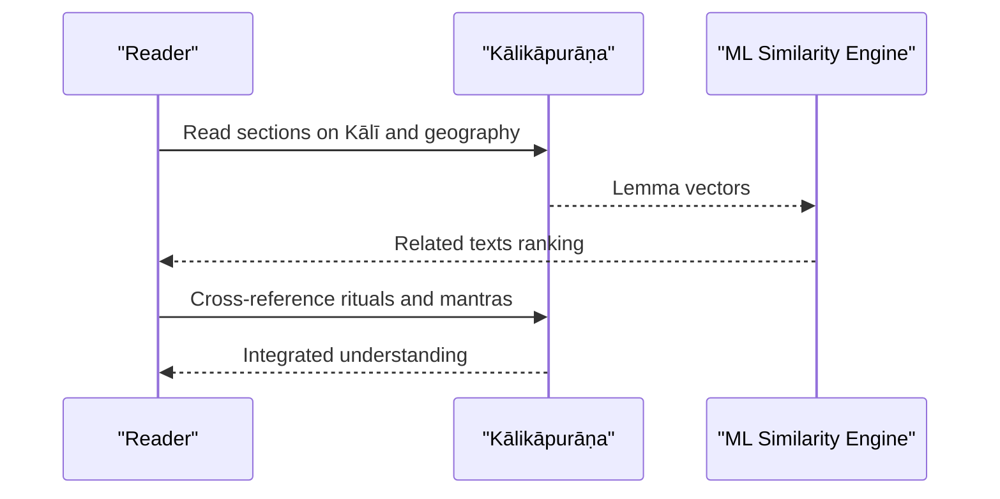
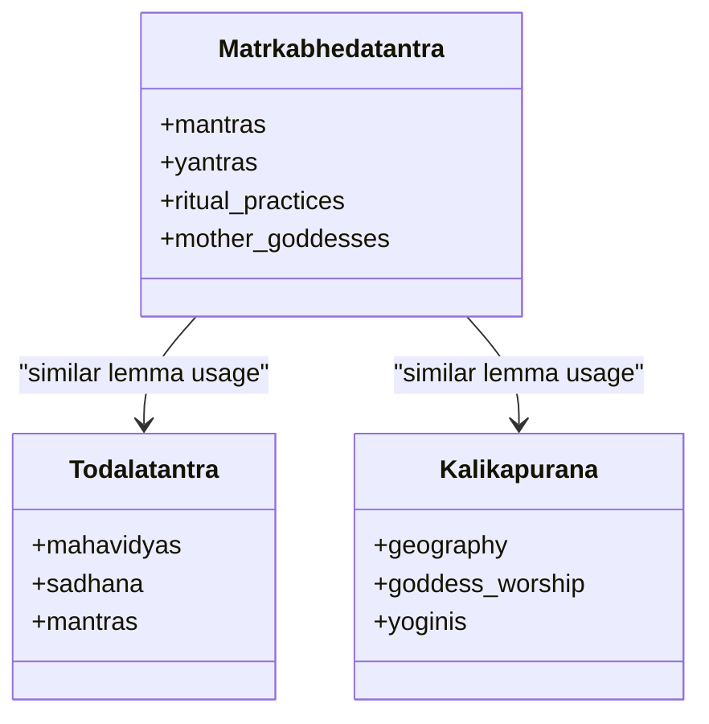
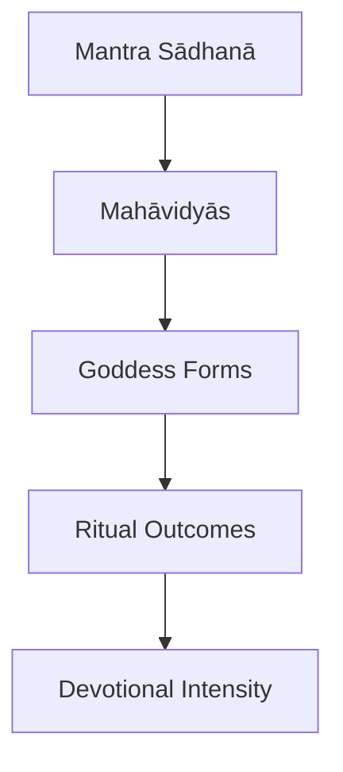
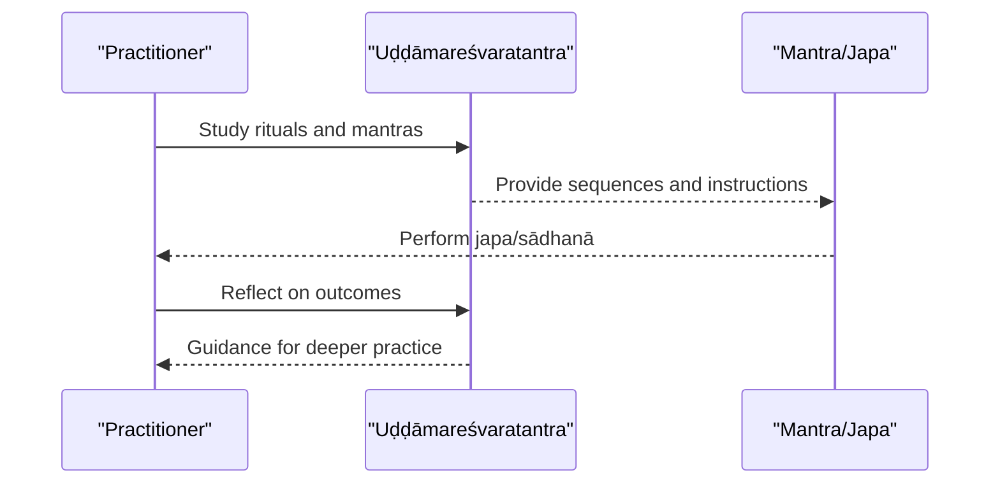
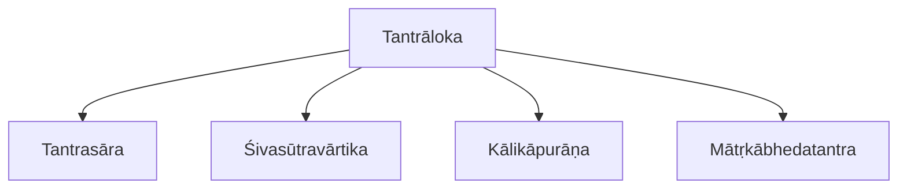
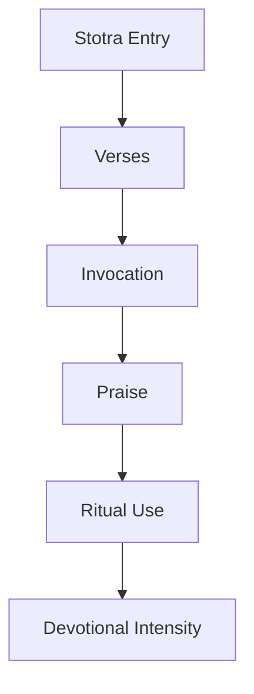
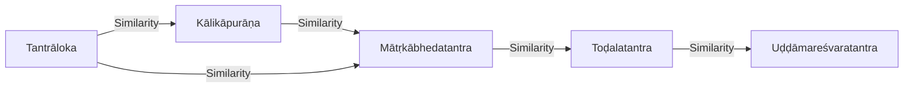

<cite>
**Referenced Files in This Document**
- [INDEX.md](file://INDEX.md)
- [devimahatmya.md](file://devimahatmya.md)
- [kalikapurana.md](file://kalikapurana.md)
- [matrkabhedatantra.md](file://matrkabhedatantra.md)
- [todalatantra.md](file://todalatantra.md)
- [uddamaresvaratantra.md](file://uddamaresvaratantra.md)
- [saktavijnana.md](file://saktavijnana.md)
- [tantraloka.md](file://tantraloka.md)
- [suryasataka.md](file://suryasataka.md)
</cite>

## Table of Contents
1. Introduction
2. Project Structure
3. Core Components
4. Architecture Overview
5. Detailed Component Analysis
6. Dependency Analysis
7. Performance Considerations
8. Troubleshooting Guide
9. Conclusion

## Introduction
This document provides a comprehensive, computational-literature study of Shakti devotional poetry with a focus on the Devīmāhātmya and related Śākta texts. It analyzes the theological framework of Śāktism, the portrayal of goddess forms (Durgā, Kālī, Lakṣmī, Sarasvatī), and the emotional intensity of devotion as expressed in Sanskrit stotras and tantric literature. It also documents computational patterns in goddess worship vocabulary, the structure of stotras, and how machine learning techniques reveal thematic connections across traditions. Finally, it examines tantric influences on devotional language and the role of feminine divine energy in Sanskrit poetry.

## Project Structure
The repository organizes each text as a concept file with metadata, tags, and lemma frequency tables derived from CoNLL-U parsed editions. For Shakti studies, the relevant files include foundational narratives (Devīmāhātmya), Upapurāṇas (Kālikāpurāṇa), tantric manuals (Mātṛkābhedatantra, Toḍalatantra, Uḍḍāmareśvaratantra), philosophical syntheses (Tantrāloka), and stotra exemplars (Sūryaśataka). The INDEX provides cross-references and topic summaries that help locate related materials.

**Diagram sources**
- [INDEX.md:1-277](file://INDEX.md#L1-L277)

**Section sources**
- [INDEX.md:1-277](file://INDEX.md#L1-L277)

## Core Components
- Foundational narrative: Devīmāhātmya (“Glory of the Goddess”) presents the battles of Durgā against demons and establishes core Śākta themes.
- Tantric ritual and philosophy: Kālikāpurāṇa, Mātṛkābhedatantra, Toḍalatantra, Uḍḍāmareśvaratantra provide mantras, yantras, sādhanā, and cosmology centered on the Goddess.
- Philosophical synthesis: Tantrāloka integrates metaphysics, ritual, and aesthetics within Kashmir Śaivism, often interfacing with Śākta thought.
- Stotra tradition: Sūryaśataka exemplifies hundred-verse hymns; similar structures apply to goddess stotras.
- Computational resources: Each file includes lemma frequency tables and similarity rankings enabling quantitative analysis of vocabulary and themes.

**Section sources**
- [devimahatmya.md:1-30](file://devimahatmya.md#L1-L30)
- [kalikapurana.md:1-48](file://kalikapurana.md#L1-L48)
- [matrkabhedatantra.md:1-48](file://matrkabhedatantra.md#L1-L48)
- [todalatantra.md:1-48](file://todalatantra.md#L1-L48)
- [uddamaresvaratantra.md:1-48](file://uddamaresvaratantra.md#L1-L48)
- [tantraloka.md:1-48](file://tantraloka.md#L1-L48)
- [suryasataka.md:1-48](file://suryasataka.md#L1-L48)

## Architecture Overview
The conceptual architecture links narrative, ritual, and philosophical layers through shared vocabulary and thematic clusters identified via TF-IDF cosine similarity and lemma frequencies.

**Diagram sources**
- [devimahatmya.md:1-30](file://devimahatmya.md#L1-L30)
- [kalikapurana.md:1-48](file://kalikapurana.md#L1-L48)
- [matrkabhedatantra.md:1-48](file://matrkabhedatantra.md#L1-L48)
- [todalatantra.md:1-48](file://todalatantra.md#L1-L48)
- [uddamaresvaratantra.md:1-48](file://uddamaresvaratantra.md#L1-L48)
- [tantraloka.md:1-48](file://tantraloka.md#L1-L48)
- [suryasataka.md:1-48](file://suryasataka.md#L1-L48)

## Detailed Component Analysis

### Devīmāhātmya: Narrative Foundation of Śāktism
- Purpose: Establishes the Goddess’s supremacy through mythic battles and sets the devotional tone for later stotras and tantras.
- Computational signature: Lemma frequency tables highlight recurring terms; concordance links enable lexical exploration.
- Thematic reach: Influences ritual manuals and philosophical treatises by providing archetypal motifs (e.g., creation, protection, destruction).

**Diagram sources**
- [devimahatmya.md:1-30](file://devimahatmya.md#L1-L30)

**Section sources**
- [devimahatmya.md:1-30](file://devimahatmya.md#L1-L30)

### Kālikāpurāṇa: Goddess Kālī and Sacred Geography
- Purpose: Upapurāṇa focusing on Kālī worship, yoginīs, and sacred geography of Kāmarūpa.
- Computational signature: High-frequency lemmas such as mantra reflect ritual emphasis; similarity rankings connect it to other Purāṇas and tantric texts.
- Thematic reach: Bridges narrative and ritual, informing tantric practice and regional cults.

**Diagram sources**
- [kalikapurana.md:1-48](file://kalikapurana.md#L1-L48)

**Section sources**
- [kalikapurana.md:1-48](file://kalikapurana.md#L1-L48)

### Mātṛkābhedatantra: Mother Goddesses and Mantra-Yantra
- Purpose: Describes worship of Mātṛkās, yantras, mantras, and ritual practices central to Śākta tantra.
- Computational signature: Frequent use of devī, śrī, vac indicates goddess-centric and speech-oriented theology; similarity ties to Toḍalatantra and Kālikāpurāṇa.
- Thematic reach: Provides technical vocabulary for sādhanā and liturgical composition.

**Diagram sources**
- [matrkabhedatantra.md:1-48](file://matrkabhedatantra.md#L1-L48)
- [todalatantra.md:1-48](file://todalatantra.md#L1-L48)
- [kalikapurana.md:1-48](file://kalikapurana.md#L1-L48)

**Section sources**
- [matrkabhedatantra.md:1-48](file://matrkabhedatantra.md#L1-L48)

### Toḍalatantra: Tārā Worship and Mahāvidyās
- Purpose: Prescribes rituals, mantra sādhanā, and worship of the ten Mahāvidyās.
- Computational signature: Prominent lemmas like devī, śiva, mantra indicate interplay between Śākta and Śaiva vocabularies; similarity connects to Mātṛkābhedatantra and Kālikāpurāṇa.
- Thematic reach: Expands goddess pantheon and deepens meditative frameworks.

**Diagram sources**
- [todalatantra.md:1-48](file://todalatantra.md#L1-L48)

**Section sources**
- [todalatantra.md:1-48](file://todalatantra.md#L1-L48)

### Uḍḍāmareśvaratantra: Bhairava Tradition and Goddess Worship
- Purpose: Śākta tantric text of the Bhairava tradition emphasizing Goddess worship, mantras, and sādhanā.
- Computational signature: High counts of bhū, mantra, svāhā, oṃ, jap reflect ritualistic and phonetic emphasis; similarity links to Kālikāpurāṇa and Liṅgapurāṇa.
- Thematic reach: Integrates fierce deity imagery with goddess-centered practices.

**Diagram sources**
- [uddamaresvaratantra.md:1-48](file://uddamaresvaratantra.md#L1-L48)

**Section sources**
- [uddamaresvaratantra.md:1-48](file://uddamaresvaratantra.md#L1-L48)

### Śāktavijñāna: Knowledge of Śāktism
- Purpose: Concise entry identifying Śāktavijñāna as a tantric Śākta text on Goddess worship.
- Role: Serves as a navigational node linking broader Śākta corpus.

**Section sources**
- [saktavijnana.md:1-12](file://saktavijnana.md#L1-L12)

### Tantrāloka: Philosophical Synthesis and Aesthetics
- Purpose: Abhinavagupta’s magnum opus integrating Trika philosophy, metaphysics, and ritual; influential in shaping tantric aesthetics and devotional expression.
- Computational signature: Lemma frequencies show dense philosophical discourse; similarity connects to Tantrasāra and Śivasūtravārtika.
- Thematic reach: Bridges Śaiva and Śākta thought, enriching devotional language with sophisticated metaphors and rasa theory.

**Diagram sources**
- [tantraloka.md:1-48](file://tantraloka.md#L1-L48)

**Section sources**
- [tantraloka.md:1-48](file://tantraloka.md#L1-L48)

### Sūryaśataka: Stotra Form and Devotional Structure
- Purpose: Hundred verses praising Sūrya; serves as a model for stotra structure applicable to goddess hymns.
- Computational signature: Lemma patterns emphasize direct address (tvad/tva) and poetic devices; similarity highlights literary affinities.
- Thematic reach: Demonstrates how stotras encode devotion through form, repetition, and invocation.

**Diagram sources**
- [suryasataka.md:1-48](file://suryasataka.md#L1-L48)

**Section sources**
- [suryasataka.md:1-48](file://suryasataka.md#L1-L48)

## Dependency Analysis
Machine learning reveals thematic dependencies among texts via TF-IDF cosine similarity and shared lemma distributions.

**Diagram sources**
- [kalikapurana.md:1-48](file://kalikapurana.md#L1-L48)
- [matrkabhedatantra.md:1-48](file://matrkabhedatantra.md#L1-L48)
- [todalatantra.md:1-48](file://todalatantra.md#L1-L48)
- [uddamaresvaratantra.md:1-48](file://uddamaresvaratantra.md#L1-L48)
- [tantraloka.md:1-48](file://tantraloka.md#L1-L48)

**Section sources**
- [kalikapurana.md:1-48](file://kalikapurana.md#L1-L48)
- [matrkabhedatantra.md:1-48](file://matrkabhedatantra.md#L1-L48)
- [todalatantra.md:1-48](file://todalatantra.md#L1-L48)
- [uddamaresvaratantra.md:1-48](file://uddamaresvaratantra.md#L1-L48)
- [tantraloka.md:1-48](file://tantraloka.md#L1-L48)

## Performance Considerations
- Lexical density: High-frequency lemmas (e.g., mantra, devī, śrī) indicate ritual-heavy corpora; prioritize preprocessing to handle repetitive tokens.
- Semantic clustering: Use TF-IDF vectors to cluster texts by theme; validate clusters with concordance links for interpretability.
- Cross-train evaluation: Compare similarity scores across narrative vs. ritual vs. philosophical texts to refine feature weighting.
- Resource constraints: Large CoNLL-U datasets require efficient parsing and indexing; consider chunked processing for lemma extraction.

[No sources needed since this section provides general guidance]

## Troubleshooting Guide
- Misaligned similarity rankings: Verify lemma normalization and stopword handling; check for domain-specific noise (e.g., formulaic mantras).
- Sparse concordance coverage: Ensure concordance indices are up-to-date; re-index if raw CoNLL-U files change.
- Overfitting to high-frequency words: Apply IDF weighting or synonym grouping to reduce bias toward common ritual terms.
- Interpretation pitfalls: Combine computational results with philological context; avoid equating frequency with theological significance without qualitative validation.

[No sources needed since this section provides general guidance]

## Conclusion
The repository offers a robust foundation for studying Shakti devotional poetry through both traditional scholarship and computational methods. The Devīmāhātmya anchors the narrative core, while tantric texts expand ritual and philosophical dimensions. Machine learning tools—lemma frequency tables and similarity rankings—reveal thematic connections across traditions, enabling systematic exploration of goddess forms, devotional intensity, and tantric influences. Together, these approaches illuminate the rich tapestry of Śākta devotion in Sanskrit literature.

[No sources needed since this section summarizes without analyzing specific files]
