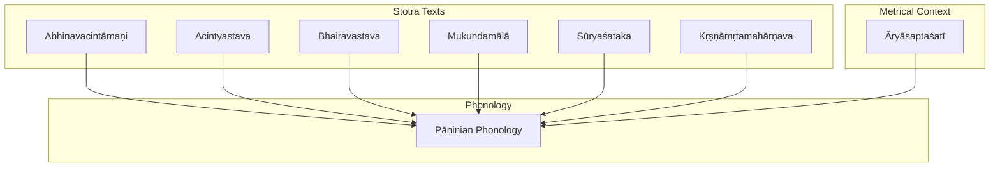
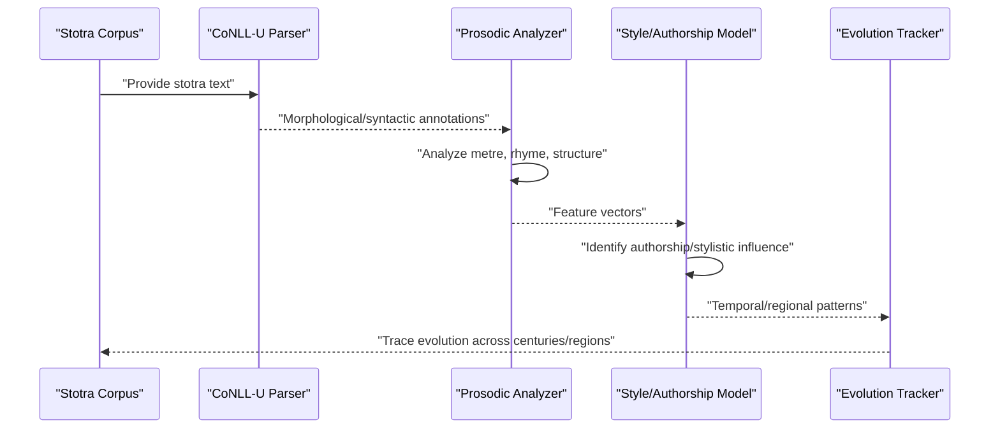
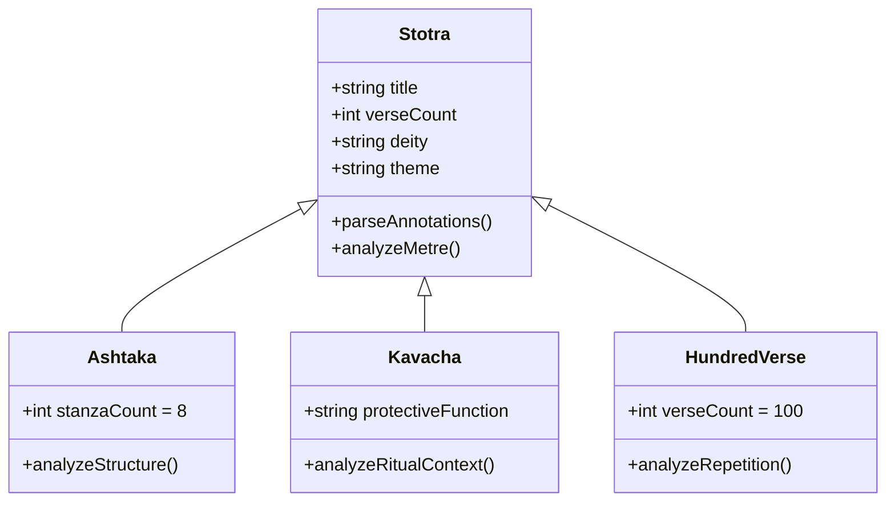
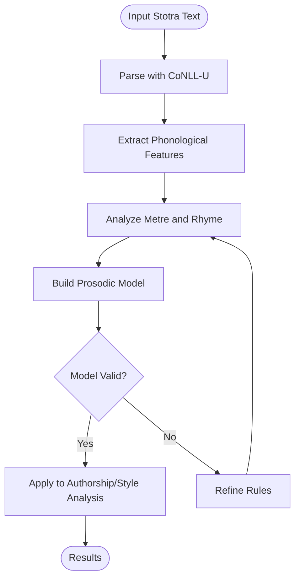
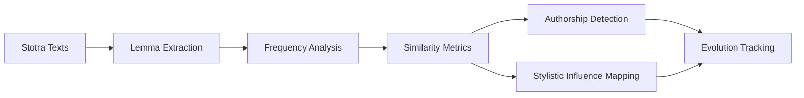
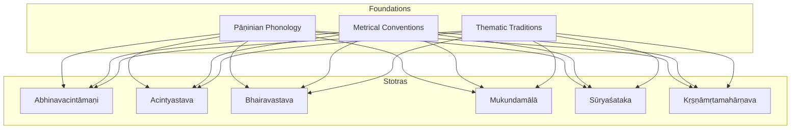

<cite>
**Referenced Files in This Document**
- [INDEX.md](file://INDEX.md)
- [abhinavacintamani.md](file://abhinavacintamani.md)
- [acintyastava.md](file://acintyastava.md)
- [bhairavastava.md](file://bhairavastava.md)
- [mukundamala.md](file://mukundamala.md)
- [suryasataka.md](file://suryasataka.md)
- [krsnamrtamaharnava.md](file://krsnamrtamaharnava.md)
- [aryasaptasati.md](file://aryasaptasati.md)
- [paninian-phonology.md](file://paninian-phonology.md)
</cite>

## Table of Contents
1. [Introduction](#introduction)
2. [Project Structure](#project-structure)
3. [Core Components](#core-components)
4. [Architecture Overview](#architecture-overview)
5. [Detailed Component Analysis](#detailed-component-analysis)
6. [Dependency Analysis](#dependency-analysis)
7. [Performance Considerations](#performance-considerations)
8. [Troubleshooting Guide](#troubleshooting-guide)
9. [Conclusion](#conclusion)
10. [Appendices](#appendices)

## Introduction
This document provides a comprehensive analysis of the formal structures and metrical patterns of Sanskrit stotras (devotional hymns), focusing on types such as ashtakas (eight-stanza poems) and kavachas (protective hymns), alongside broader meter forms used in devotional composition. It also outlines how computational linguistics can analyze metrical patterns, rhyme schemes, and structural formulas to identify authorship, detect stylistic influences, and trace the evolution of devotional poetic forms across centuries and regions. The repository contains multiple stotra texts with CoNLL-U parsed editions that enable morphological, syntactic, and lexical analysis for computational study.

## Project Structure
The repository is organized as a collection of concept files describing major Sanskrit texts, including several stotras and related works. Each file summarizes themes, metadata, and links to parsed editions where available. For stotra-focused analysis, the following files are central:
- Stotra texts: Abhinavacintāmaṇi, Acintyastava, Bhairavastava, Mukundamālā, Sūryaśataka, Kṛṣṇāmṛtamahārṇava
- Metrical context: Āryāsaptaśatī (explicitly notes āryā metre usage)
- Phonological foundation: Pāṇinian phonology (sandhi, svara, mātrā) relevant to prosodic analysis

**Diagram sources**
- [abhinavacintamani.md:1-57](file://abhinavacintamani.md#L1-L57)
- [acintyastava.md:1-111](file://acintyastava.md#L1-L111)
- [bhairavastava.md:1-40](file://bhairavastava.md#L1-L40)
- [mukundamala.md:1-48](file://mukundamala.md#L1-L48)
- [suryasataka.md:1-48](file://suryasataka.md#L1-L48)
- [krsnamrtamaharnava.md:1-48](file://krsnamrtamaharnava.md#L1-L48)
- [aryasaptasati.md:1-51](file://aryasaptasati.md#L1-L51)
- [paninian-phonology.md:63-77](file://paninian-phonology.md#L63-L77)

**Section sources**
- [INDEX.md:5-268](file://INDEX.md#L5-L268)

## Core Components
Key stotra components identified from the repository include:
- Devotional praise and theological themes (e.g., elemental inversions in Abhinavacintāmaṇi; emptiness in Acintyastava)
- Structured verse collections (e.g., hundred verses in Sūryaśataka; eight verses in Bhramarāṣṭaka)
- Metre-specific compositions (e.g., āryā metre in Āryāsaptaśatī)
- Lexical and morphological richness enabling computational analysis (lemmas, concordances, CoNLL-U parsing)

These components provide a foundation for analyzing stotra forms, identifying structural patterns, and applying computational methods to prosody and style.

**Section sources**
- [abhinavacintamani.md:21-57](file://abhinavacintamani.md#L21-L57)
- [acintyastava.md:22-64](file://acintyastava.md#L22-L64)
- [bhairavastava.md:13-40](file://bhairavastava.md#L13-L40)
- [mukundamala.md:15-48](file://mukundamala.md#L15-L48)
- [suryasataka.md:15-48](file://suryasataka.md#L15-L48)
- [krsnamrtamaharnava.md:15-48](file://krsnamrtamaharnava.md#L15-L48)
- [aryasaptasati.md:20-51](file://aryasaptasati.md#L20-L51)

## Architecture Overview
The stotra corpus exhibits a layered architecture:
- Textual layer: individual stotras with thematic content and verse structure
- Metrical layer: consistent use of metres (e.g., āryā) and stanza counts (e.g., ashtaka)
- Computational layer: CoNLL-U parsed editions enabling morphological and syntactic analysis
- Phonological layer: sandhi, svara, and mātrā rules informing prosodic modeling

[No diagram sources needed since this diagram shows conceptual workflow, not actual code structure]

## Detailed Component Analysis

### Stotra Types and Structural Patterns
- Ashtakas: Eight-stanza poems exemplified by Bhramarāṣṭaka ("Eight Verses on the Bee"), demonstrating compact devotional lyricism
- Kavachas: Protective hymns often associated with fierce deities (e.g., Bhairavastava), emphasizing protection and tantric practice
- Hundred-verse collections: Sūryaśataka illustrates structured praise through a fixed number of verses
- Philosophical stotras: Acintyastava integrates devotion with Madhyamaka philosophy, praising emptiness and dependent origination

[No diagram sources needed since this diagram shows conceptual class relationships, not specific source code]

**Section sources**
- [bhairavastava.md:1-40](file://bhairavastava.md#L1-L40)
- [suryasataka.md:1-48](file://suryasataka.md#L1-L48)
- [acintyastava.md:1-111](file://acintyastava.md#L1-L111)

### Metrical Patterns and Prosodic Analysis
- Āryā metre: Explicitly noted in Āryāsaptaśatī as a mātrā-based metre with fixed syllable-count patterns, providing rhythmic uniformity
- Sandhi and phonology: Pāṇinian phonology describes sandhi rules (vowel/consonant combinations, visarga-sandhi) and the Śikṣā tradition's focus on svara and mātrā timing
- Computational application: CoNLL-U parsed editions enable extraction of phonological features for prosodic modeling

[No diagram sources needed since this diagram shows conceptual algorithm flow, not specific source code]

**Section sources**
- [aryasaptasati.md:30-51](file://aryasaptasati.md#L30-L51)
- [paninian-phonology.md:63-77](file://paninian-phonology.md#L63-L77)

### Computational Analysis of Stotra Authorship and Stylistic Influence
- Lemma frequency analysis: Top lemmas reveal stylistic markers (e.g., frequent use of pronouns, deity names, philosophical terms)
- Cosine similarity: Related texts show stylistic proximity (e.g., Mukundamālā similar to Bhāgavatapurāṇa, Haribhaktivilāsa)
- Temporal tracing: Stotras span different periods (e.g., Acintyastava c. 2nd–3rd century CE; Abhinavacintāmaṇi possibly second millennium CE), enabling evolutionary analysis

[No diagram sources needed since this diagram shows conceptual data flow, not specific source code]

**Section sources**
- [mukundamala.md:15-48](file://mukundamala.md#L15-L48)
- [acintyastava.md:68-111](file://acintyastava.md#L68-L111)
- [abhinavacintamani.md:41-57](file://abhinavacintamani.md#L41-L57)

## Dependency Analysis
Stotras depend on shared linguistic and cultural foundations:
- Phonological rules: Sandhi and svara affect verse recitation and prosodic analysis
- Metrical conventions: Fixed metres like āryā provide structural consistency
- Thematic traditions: Deity-specific vocabulary and philosophical concepts shape lexical patterns

**Diagram sources**
- [paninian-phonology.md:63-77](file://paninian-phonology.md#L63-L77)
- [aryasaptasati.md:30-51](file://aryasaptasati.md#L30-L51)
- [abhinavacintamani.md:21-57](file://abhinavacintamani.md#L21-L57)
- [acintyastava.md:22-64](file://acintyastava.md#L22-L64)
- [bhairavastava.md:1-40](file://bhairavastava.md#L1-L40)
- [mukundamala.md:15-48](file://mukundamala.md#L15-L48)
- [suryasataka.md:15-48](file://suryasataka.md#L15-L48)
- [krsnamrtamaharnava.md:15-48](file://krsnamrtamaharnava.md#L15-L48)

**Section sources**
- [paninian-phonology.md:63-77](file://paninian-phonology.md#L63-L77)
- [aryasaptasati.md:30-51](file://aryasaptasati.md#L30-L51)

## Performance Considerations
- Data volume: Large CoNLL-U files (e.g., Abhinavacintāmaṇi ~4,795 lines) require efficient parsing and memory management
- Feature extraction: Morphological and syntactic annotations enable rich feature sets but may increase computational cost
- Model scalability: Stylistic and authorship models should handle diverse stotra types and historical periods

[No sources needed since this section provides general guidance]

## Troubleshooting Guide
Common issues in stotra analysis:
- Sandhi ambiguity: Complex vowel/consonant combinations may require careful rule application
- Metre detection: Fixed metres like āryā need precise syllable counting and stress pattern recognition
- Lemma normalization: Variations in deity names and philosophical terms may affect similarity metrics

**Section sources**
- [paninian-phonology.md:63-77](file://paninian-phonology.md#L63-L77)
- [aryasaptasati.md:30-51](file://aryasaptasati.md#L30-L51)

## Conclusion
The stotra corpus offers a rich foundation for studying Sanskrit devotional poetry through both traditional literary analysis and modern computational linguistics. By leveraging CoNLL-U parsed editions, researchers can analyze metrical patterns, identify stylistic influences, and trace the evolution of stotra forms across time and regions. The integration of phonological rules, metrical conventions, and thematic traditions enables robust modeling of stotra structures and authorship attribution.

[No sources needed since this section summarizes without analyzing specific files]

## Appendices
- Glossary of key terms: stotra, ashtaka, kavacha, chandas, sandhi, svara, mātrā
- References to parsed editions and lemma indices for further analysis

[No sources needed since this section provides supplementary information]
